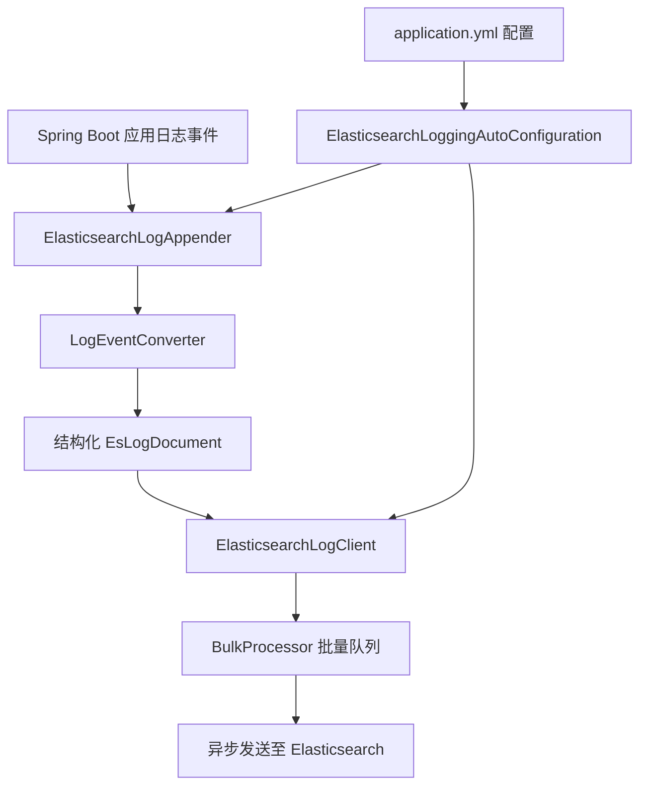

你是否还在为应用日志分散各处而烦恼？是否曾因调试线上问题而焦头烂额地翻看服务器日志文件？今天给大家推荐一个我们团队自研的高性能、零侵入的日志解决方案——`elasticsearch-logging-starter`！

这是一个基于 Spring Boot Starter 机制打造的日志收集组件，能够将你的应用日志*异步、批量、结构*化地发送到 Elasticsearch 集群，让你轻松实现日志的集中管理和可视化检索。

[项目地址](https://github.com/liulasty/elasticsearch-logging-parent)

## ✨ 核心亮点 ##

- 开箱即用，零侵入：只需引入依赖、添加配置，无需修改任何一行业务代码或logback.xml。
- 高性能异步写入：基于 Elasticsearch 官方 BulkProcessor 实现，批量发送，对应用性能影响极低。
- 结构化与链路追踪：自动将日志转化为 JSON 文档，并完美支持从 MDC 中提取 traceId、spanId，分布式链路追踪无压力。
- 多环境智能隔离：通过applicationName和environment配置，轻松区分不同应用、不同环境的日志。

## 🏗 架构与核心组件 ##

整个 Starter 的设计遵循 Spring Boot 自动配置理念，核心流程如下图所示：




### 自动配置入口 - ElasticsearchLoggingAutoConfiguration ###

- 触发条件：当配置文件中es.logging.enabled=true时自动生效。
- 核心职责：在 Spring 容器启动后，自动初始化日志客户端和 Appender，并动态挂载到 Logback 的根 Logger 上，真正做到“配置即用”。

### 统一配置属性 - ElasticsearchLoggingProperties ###

所有配置都以es.logging为前缀，清晰明了：

```yaml
es:
  logging:
    enabled: true
    hosts: localhost:9200            # ES集群地址
    username: elastic                # 可选，认证用户名
    password: ${ES_PASSWORD}         # 可选，认证密码
    index: “app-logs-%%{yyyy.MM.dd}” # 索引模式，支持日期滚动
    application-name: user-service    # 应用名，用于标识
    environment: prod                # 环境标识
    bulk-size: 1000                  # 批量发送大小
    bulk-interval: 5000              # 批量发送间隔(ms)
```

### 日志传输核心 - ElasticsearchLogClient ###

- 内部封装了 RestHighLevelClient 和 BulkProcessor，负责管理到 ES 的连接、批处理逻辑及失败重试。
- 内置健康检查线程，确保日志管道持续可用。

### 日志捕获桥梁 - ElasticsearchLogAppender ###

- 一个自定义的 Logback Appender，负责拦截所有日志事件。
- 将 ILoggingEvent 事件交给 LogEventConverter 转换为结构化的 EsLogDocument，然后交由 Client 异步发送。

## 📄 日志数据结构 ##

发送到 Elasticsearch 的日志将被转换成如下格式的 JSON 文档，信息丰富，便于检索分析：

| **字段**        |      **类型**      |    **说明**      |
| :------------- | :-----------: | :-----------: |
|   `@timestamp`   |  `date`  |  日志发生时间 (ISO 8601 格式)  |
|   `level`   |  `keyword`  |  日志级别 (INFO, ERROR, WARN等)  |
|   `message`   |  `text`  |  原始日志消息  |
|   `logger`   |  `keyword`  |  产生日志的 Logger 名  |
|   `thread`   |  `keyword`  |  线程名  |
|   `traceId` / `spanId`   |  `keyword`  |  分布式链路追踪ID (自动从MDC获取)  |
|   `exception`   |  `text`  |  异常类名  |
|   `stackTrace`   |  `text`  |  详细的异常堆栈  |
|   `application`   |  `keyword`  |  应用名称 (来自配置)  |
|   `environment`   |  `keyword`  |  环境标识 (来自配置)  |
|   `mdc`   |  `object`  |  完整的 MDC 上下文映射  |

## 🚀 快速开始 ##

只需三步，立享集中式日志管理：

### 引入依赖 ###

将 starter 模块打包发布到你的私库，然后在项目中引入：

```xml
<dependency>
    <groupId>com.lz.logging</groupId>
    <artifactId>elasticsearch-logging-starter</artifactId>
    <version>{latest-version}</version>
</dependency>
```

### 添加配置 ###

在 application.yml 中启用并配置：

```yaml
es:
  logging:
    enabled: true
    hosts: localhost:9200
    application-name: order-service
    environment: dev
    # 其他参数可根据需要调整
```

### 查看日志 ###

启动你的 Spring Boot 应用，日志便会自动、静默地发送到指定的 Elasticsearch 集群。你可以在 Kibana 中创建索引模式 app-logs-*，开始进行可视化搜索和分析。

## 💡 设计思考 ##

这个 Starter 在设计上特别注重了 “开发者体验” 和 “生产可靠性”：

- 对业务透明：开发者可以继续使用熟悉的 log.info() 等方式打日志，无需关心日志如何被收集和传输。
- 性能优先：异步批量机制是核心，避免了同步网络IO对业务主线程的阻塞。
- 运维友好：清晰的配置项和健康检查机制，让运维监控和问题排查变得简单。

如果你正在为 Spring Boot 应用的日志收集问题寻找一个优雅、高效的解决方案，不妨试试这个项目。也欢迎各位开发者 Star、Fork 和提 PR，共同完善它！
