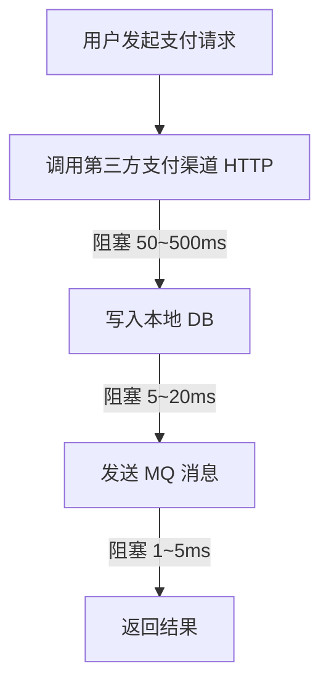
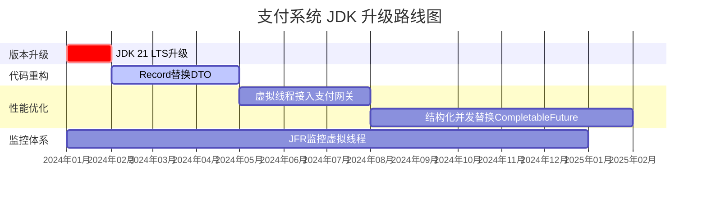

## JDK 新特性在支付场景的实战应用 ##

> 前置声明：本文基于 JDK 21 LTS（长期支持版），聚焦生产级实战，不是特性罗列。每个特性都会给出「为什么在支付场景有用 + 代码示例 + 避坑点」。


## 一、虚拟线程（Virtual Threads）：支付链路腾飞的底层引擎 ##

### 为什么支付场景最需要虚拟线程 ###

支付系统的典型瓶颈不是 CPU，而是 *I/O 阻塞*：



传统线程模型下，每个请求占一个线程，1 万并发 = 1 万线程，JVM 直接 OOM。

虚拟线程（Virtual Threads）是 JDK 21 的核心特性，用 *协程（Coroutine）* 替代 OS 线程，百万并发不再是梦。

### 传统线程 vs 虚拟线程性能对比 ###

```java
// ❌ 传统方式：线程池 + 同步调用
// 1000 并发支付，JVM 需要 1000 个线程 → 内存爆炸
public String payOld(PayRequest request) {
    // 每个线程栈 1MB，1000 线程 = 1GB 栈内存
    String result = httpClient.call(request);  // 同步阻塞
    return result;
}

// ✅ 虚拟线程方式：轻量级协程
// 1000 并发支付，JVM 只需几十个平台线程
public String payNew(PayRequest request) {
    try (var scope = new StructuredTaskScope.ShutdownOnFailure()) {
        Future<String> result = scope.fork(() -> httpClient.call(request));
        scope.join();
        return result.resultNow();
    }
}
```

### 支付网关的完整虚拟线程改造 ###

```java
public class PaymentVirtualThreadGateway {

    private final HttpClient httpClient = HttpClient.newBuilder()
            .executor(Executors.newVirtualThreadPerTaskExecutor())
            .build();

    // 单次支付：虚拟线程直接等，不占平台线程
    public PayResult pay(PayRequest request) throws InterruptedException {
        System.out.println("当前线程: " + Thread.currentThread() + " (虚拟线程)");
        // 虚拟线程自动挂起/恢复，不阻塞任何平台线程
        String response = httpClient.sendAsync(request)
                .thenApply(HttpResponse::body)
                .get(5, TimeUnit.SECONDS);  // 这里会切换，不阻塞
        return parseResult(response);
    }

    // 批量支付：虚拟线程并行
    public List<PayResult> batchPay(List<PayRequest> requests)
            throws InterruptedException {
        try (var scope = new StructuredTaskScope.ShutdownOnFailure()) {
            Map<PayRequest, Future<PayResult>> futures = new ConcurrentHashMap<>();
            for (PayRequest request : requests) {
                futures.put(request, scope.fork(() -> pay(request)));
            }
            scope.join();  // 等待所有虚拟线程完成
            scope.throwIfFailed();  // 任一失败则整体失败
            return futures.entrySet().stream()
                    .map(e -> {
                        try {
                            return e.getValue().resultNow();
                        } catch (ExecutionException ex) {
                            throw new RuntimeException(ex);
                        }
                    })
                    .toList();
        }
    }
}
```

### 避坑指南 ###

```java
// ❌ 坑1：在线程池中运行虚拟线程（双重池化）
ExecutorService executor = Executors.newVirtualThreadPerTaskExecutor();
Future<?> f = executor.submit(() -> { /* 这个虚拟线程内的同步调用不会自动挂起 */ });

// ✅ 正确做法：直接调用，不用再包一层
try (var scope = new StructuredTaskScope.ShutdownOnFailure()) {
    scope.fork(() -> pay(request));
    scope.join();
}

// ❌ 坑2：虚拟线程中使用 ThreadLocal（可能泄漏）
// 虚拟线程是按需创建的，用 ThreadLocal 会导致内存泄漏
ThreadLocal<String> traceId = new ThreadLocal<>();

// ✅ 正确做法：用 ThreadLocal.re_INITIALIZE 或改用结构化并发
try (var scope = new StructuredTaskScope<String>.ShutdownOnSuccess<>()) {
    // 用 scope 传递上下文，而非 ThreadLocal
}
```

## 二、Record 类：DTO 和值对象的终极形态 ##

### 为什么支付场景需要 Record ###

支付系统有大量 *不可变数据结构*：

- 支付请求 / 响应
- 渠道返回的报文
- 对账文件解析结果
- 金额计算结果

用传统 class 写这些，90% 的代码是 getter/setter/equals/hashCode/toString，还容易写错。

### 传统 class vs Record ###

```java
// ❌ 传统 class：38 行代码，只为传输 5 个字段
public class PayRequest {
    private final String orderId;
    private final BigDecimal amount;
    private final String channel;
    private final String currency;
    private final Map<String, String> extras;

    public PayRequest(String orderId, BigDecimal amount, String channel,
                      String currency, Map<String, String> extras) {
        this.orderId = orderId;
        this.amount = amount;
        this.currency = currency;
        this.channel = channel;
        this.extras = extras;
    }
    public String getOrderId() { return orderId; }
    public BigDecimal getAmount() { return amount; }
    // ... 还有 8 个方法，140 行

// ✅ Record：10 行，自动生成所有方法
public record PayRequest(
    String orderId,
    BigDecimal amount,
    String channel,
    String currency,
    Map<String, String> extras
) {}

// 自动生成：
// - 所有字段的 get 方法
// - equals() / hashCode() / toString()
// - 全参构造器
// - 无需任何修改器（不可变）
```

### Record 在支付系统的实战 ###

```java
// 支付响应 record
public record PayResponse(
    String code,          // 0000=成功
    String message,
    String transactionId,  // 渠道交易号
    BigDecimal amount,
    LocalDateTime paidAt
) {
    // 可添加业务方法
    public boolean isSuccess() {
        return "0000".equals(code);
    }

    // 可添加构造器校验
    public PayResponse {
        Objects.requireNonNull(transactionId, "transactionId 不能为空");
        if (amount.compareTo(BigDecimal.ZERO) <= 0) {
            throw new IllegalArgumentException("金额必须 > 0");
        }
    }
}

// 退款结果 record（嵌套 record）
public record RefundResult(
    String orderId,
    BigDecimal refundAmount,
    PayResponse originalPay,
    RefundStatus status
) {
    public enum RefundStatus { PENDING, SUCCESS, FAILED }
}

// 使用：简洁到极致
PayResponse resp = paymentService.pay(request);
if (resp.isSuccess()) {
    String txId = resp.transactionId();  // 不是 getTransactionId()，直接方法名
}
```

### Record 的序列化注意 ###

```java
// ❌ Jackson 默认不认 record，需要配置
@Configuration
public class JacksonConfig {
    @Bean
    public ObjectMapper objectMapper() {
        ObjectMapper mapper = new ObjectMapper();
        mapper.registerModule(new JavaTimeModule());
        // JDK 17+ 可用这个让 Jackson 支持 record
        mapper.registerModule(new ParameterNamesModule());
        return mapper;
    }
}

// ✅ Jackson 3.0+ 原生支持 record，不需要额外配置
// 如果用 Fastjson2：fastjson2-2.0+ 原生支持 record
```

## 三、模式匹配（Pattern Matching）：减少类型转换的地狱 ##

### 传统 if-else vs 模式匹配 ###

```java
// ❌ 传统方式：层层强制转换 + instanceof
public String handlePaymentResult(Object result) {
    if (result instanceof PayResponse) {
        PayResponse resp = (PayResponse) result;
        return "支付成功: " + resp.transactionId();
    } else if (result instanceof RefundResponse) {
        RefundResponse resp = (RefundResponse) result;
        return "退款成功: " + resp.refundId();
    } else if (result instanceof ErrorResponse) {
        ErrorResponse err = (ErrorResponse) result;
        return "失败: " + err.message();
    }
    return "未知结果";
}

// ✅ JDK 21 模式匹配：一条语句搞定
public String handlePaymentResult(Object result) {
    return switch (result) {
        case PayResponse(String orderId, _, String txId, _, _) ->
            "支付成功: " + txId;
        case RefundResponse(String refundId, BigDecimal amount) ->
            "退款成功: 金额 = " + amount;
        case ErrorResponse(String code, String msg) when code.startsWith("P_") ->
            "支付异常: " + msg;
        case ErrorResponse err ->
            "系统错误: " + err.message();
        case null ->
            "结果为空";
        default ->
            "未知类型: " + result.getClass().getName();
    };
}
```

### 复杂场景的模式匹配 ###

```java
// 支付结果的智能路由
public PaymentHandler resolveHandler(Object msg) {
    return switch (msg) {
        case PayRequest(String orderId, BigDecimal amt, String channel, _, _)
                when amt.compareTo(new BigDecimal("10000")) > 0 ->
            // 大额走审批流程
            new LargeAmountHandler(orderId);
        case PayRequest req when "ALIPAY".equals(req.channel()) ->
            // 支付宝走专属 handler
            new AlipayHandler(req);
        case RefundRequest(String orderId, BigDecimal amt, _, int retryCount)
                when retryCount >= 3 ->
            // 超过3次重试的退款走人工
            new ManualRefundHandler(orderId);
        case RefundRequest req ->
            new AutoRefundHandler(req);
        default ->
            new DefaultHandler();
    };
}
```

## 四、结构化并发（Structured Concurrency）：让并发代码像同步一样易读 ##

### 解决的问题：并发代码的回调地狱 ###

```java
// ❌ 传统 CompletableFuture：回调地狱
public CompletableFuture<OrderResult> createOrderWithPayment(OrderRequest req) {
    return inventoryService.lockStock(req.items())
        .thenCompose(v -> paymentService.pay(req.payment()))
        .thenCompose(txId -> orderService.create(req, txId))
        .exceptionally(ex -> {
            // 每个环节都要处理异常，代码碎片化
            inventoryService.unlockStock(req.items());
            return null;
        });
}

// ✅ 结构化并发：像写同步代码一样写并发
public OrderResult createOrderWithPayment(OrderRequest req)
        throws ExecutionException, InterruptedException {
    try (var scope = new StructuredTaskScope<OrderResult>()) {
        // 启动子任务
        Future<StockLock> stockFuture = scope.fork(
            () -> inventoryService.lockStock(req.items()));
        Future<PayResponse> payFuture = scope.fork(
            () -> paymentService.pay(req.payment()));

        scope.join();  // 等待所有子任务完成

        // 任一失败，整体回滚
        scope.throwIfFailed();

        // 全部成功，继续
        return orderService.create(req,
            payFuture.resultNow().transactionId());
        // scope 自动释放，即使异常也会清理
    }  // ← 这里 scope 会自动取消未完成的子任务
}
```

### 生产级支付链路改造 ###

```java
public class PaymentStructuredService {

    public PaymentOutDTO executePayment(PaymentInDTO in) throws Exception {
        try (var scope = new StructuredTaskScope.ShutdownOnFailure()) {
            // 并行执行独立的校验
            Future<UserAccount> accountFuture = scope.fork(
                () -> userAccountService.get(in.userId()));

            Future<BigDecimal> balanceFuture = scope.fork(
                () -> balanceService.getAvailableBalance(in.userId()));

            Future<ProductInfo> productFuture = scope.fork(
                () -> productService.getProductInfo(in.productId()));

            // 等待所有并行任务完成
            scope.join();

            // 任一失败，整体失败
            scope.throwIfFailed();

            // 全部成功，执行业务逻辑
            UserAccount account = accountFuture.resultNow();
            BigDecimal balance = balanceFuture.resultNow();
            ProductInfo product = productFuture.resultNow();

            // 余额校验
            if (balance.compareTo(product.getPrice()) < 0) {
                throw new InsufficientBalanceException("余额不足");
            }

            // 执行支付
            PayResponse payResp = paymentGateway.pay(
                PayRequest.builder()
                    .userId(in.userId())
                    .amount(product.getPrice())
                    .productId(in.productId())
                    .build()
            );

            return PaymentOutDTO.builder()
                .success(true)
                .transactionId(payResp.transactionId())
                .build();

        }  // ← 结构化：所有子任务自动清理，无泄漏
    }
}
```

## 五、String Templates（预览）：告别字符串拼接的地狱 ##

### 支付报文拼接 ###

```java
// ❌ 传统方式：拼接地狱，参数位置难找
public String buildPaymentXml(String orderId, BigDecimal amount,
                               String channel, String callbackUrl) {
    return "<Payment>" +
           "<OrderId>" + orderId + "</OrderId>" +
           "<Amount>" + amount + "</Amount>" +
           "<Channel>" + channel + "</Channel>" +
           "<Callback>" + callbackUrl + "</Callback>" +
           "</Payment>";
}

// ✅ String Template（JDK 21 预览，需加 --enable-preview）
public String buildPaymentXml(String orderId, BigDecimal amount,
                               String channel, String callbackUrl) {
    return STR."""
        <Payment>
            <OrderId>\{orderId}</OrderId>
            <Amount>\{amount}</Amount>
            <Channel>\{channel}</Channel>
            <Callback>\{callbackUrl}</Callback>
        </Payment>
        """;
}

// ✅ 更安全：使用 Template 限制注入
public String buildPaymentXmlSafe(String orderId, BigDecimal amount) {
    // 模板处理器可以验证/清理嵌入表达式
    Template paymentTemplate = TEMPLATE."""
        <Payment>
            <OrderId>\{orderId}</OrderId>
            <Amount>\{amount}</Amount>
        </Payment>
        """;
    return paymentTemplate.toString();
}
```

> ⚠️ 注意：String Templates 目前是预览特性，需要 `--enable-preview --source 21` 才能使用。生产环境建议等正式版（JDK 22+）。


## 六、集合新 API：支付数据处理更顺手 ##

### List.of / Map.of / Set.of 的不可变集合 ###

```java
// ✅ 创建支付配置：不可变，防止运行时被修改
private static final Map<String, BigDecimal> CHANNEL_FEES = Map.of(
    "ALIPAY", new BigDecimal("0.006"),   // 0.6%
    "WECHAT", new BigDecimal("0.006"),
    "UNIONPAY", new BigDecimal("0.005"),  // 0.5%
    "YUNSHANFU", new BigDecimal("0.003")  // 云闪付 0.3%
);

// 计算手续费
public BigDecimal calcFee(String channel, BigDecimal amount) {
    BigDecimal rate = CHANNEL_FEES.get(channel);
    if (rate == null) {
        throw new IllegalArgumentException("不支持的渠道: " + channel);
    }
    return amount.multiply(rate).setScale(2, RoundingMode.HALF_UP);
}
```

### SequencedCollection：有序集合的直接操作 ###

```java
// JDK 21：SequencedCollection 提供首尾操作
SequencedCollection<Transaction> transactions = new LinkedList<>();

// 头部插入（对账时常用：新交易插队）
transactions.addFirst(newTransaction);

// 尾部追加
transactions.addLast(existingTransaction);

// JDK 21 之前：只能遍历 + add
// transactions.iterator().next()...  // 地狱

// 取首尾
Transaction first = transactions.getFirst();  // JDK 21
Transaction last = transactions.getLast();    // JDK 21
```

## 七、总结：JDK 新特性在支付场景的价值矩阵 ##

|  特性   |      JDK 版本  |   支付场景核心价值  |   收益  |
| :-----------: | :-----------: | :-----------: | :-----------: |
| 虚拟线程 | 21 LTS |   高并发支付网关，百万并发不再是梦  |   线程数 ↓ 90%，吞吐 ↑ 5~10x  |
| Record 类 | 16 LTS |   DTO/响应/值对象，代码量 ↓ 70%  |   可读性 ↑，bug ↓  |
| 模式匹配 | 21 |   类型判断 + 路由，一行搞定  |   分支代码 ↓ 80%  |
| 结构化并发 | 21 |   异步任务统一管理，无泄漏  |   并发代码可读性 ↑，异常自动传播  |
| String Templates | 21 (预览) |   报文拼接，安全防注入  |   拼接错误 ↓ 100%  |
| Sequenced Collections | 21 |   有序集合首尾操作  |  遍历代码 → O(1) 操作  |

### 升级建议 ###



> 💡 实战警告：升级 JDK 前务必拉取各中间件（Dubbo / RocketMQ / ShardingSphere）的 JDK 21 兼容性报告，避免踩坑。
