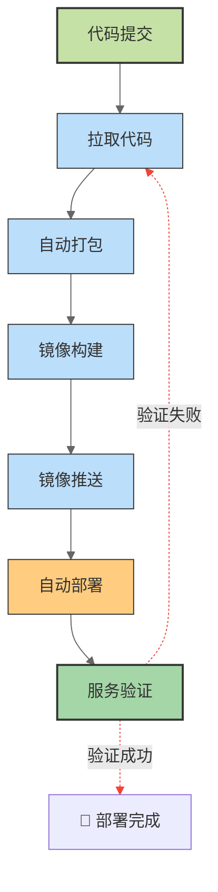

本文聚焦 Jenkins + Docker 组合搭建 CI/CD 流水线，针对 SpringBoot Maven 项目实现零项目配置文件全自动部署，涵盖环境搭建、流水线配置、实战案例全流程，解决环境不一致、部署繁琐、权限报错等常见痛点，适合后端开发、运维人员快速落地自动化部署方案。

## 一、CI/CD 核心概念梳理 ##

### 核心组件及作用 ###

CI/CD（持续集成/持续部署）是 DevOps 核心实践，通过自动化工具串联代码提交、构建、测试、部署全流程，以下是本次实战必备组件的核心定位：

|  组件名称   | 核心作用  |
| :-----------: | :-----------: |
|    Git  |   代码托管仓库，作为流水线触发源头，支持 GitHub、GitLab、Gitee 等主流平台，私有仓库需配置访问凭据  |
|    Jenkins  |   CI/CD 调度中心，负责串联全流程、触发执行各环节，支持插件扩展、流水线脚本自定义，是本次实战的核心调度工具  |
|    Docker  |  应用容器化工具，将应用及依赖打包为镜像，彻底解决开发、测试、生产环境不一致问题，实现“一次构建，处处运行”  |
|    Maven  |   Java 项目构建工具，负责依赖管理、源码编译、打包生成 Jar/War 包，是 SpringBoot 项目标准化构建利器  |
|    Docker Registry  |   镜像存储仓库，本次选用阿里云私有镜像仓库，用于存储构建好的 Docker 镜像，实现跨服务器镜像调用  |

### 标准 CI/CD 流水线流程 ###

本次实战遵循极简自动化流程，全程无人工干预，闭环落地部署：



## 二、前置环境准备与搭建（周末实操任务） ##

### 环境要求与前置验证 ###

- 服务器配置：Linux 系统（CentOS 7+/Ubuntu 20.04+），推荐 2核4G 及以上，避免资源不足导致部署失败
- 基础依赖：提前安装 Git、JDK8+、Maven，验证命令：`git --version`、`java -version`、`mvn -version`，确保版本兼容
- 网络配置：关闭服务器防火墙，或开放 8080（Jenkins Web）、50000（Jenkins 代理）端口，避免端口占用导致服务无法访问

### Docker 一键安装与优化 ###

采用官方一键脚本安装，适配 CentOS/Ubuntu 双系统，补充镜像加速器解决国内拉取慢问题：

```bash
# 安装系统依赖（双系统兼容）
yum install -y yum-utils device-mapper-persistent-data lvm2 || apt install -y apt-transport-https ca-certificates curl software-properties-common
# 官方一键安装 Docker
curl -fsSL https://get.docker.com | bash
# 启动并设置开机自启
systemctl start docker && systemctl enable docker
# 验证安装
docker --version

# 配置阿里云镜像加速器（提升拉取速度）
mkdir -p /etc/docker
tee /etc/docker/daemon.json <<EOF
{
  "registry-mirrors": ["https://docker.mirrors.aliyun.com"]
}
EOF
# 重启生效
systemctl daemon-reload && systemctl restart docker
```

异常处理：若 Docker 启动失败，执行 `systemctl status docker` 查看日志，排查依赖缺失、端口冲突问题

### Docker 方式部署 Jenkins（持久化+权限优化） ###

采用容器化部署 Jenkins，实现环境隔离、一键迁移，重点解决容器内权限不足、无法调用宿主机 Docker痛点：

```bash
# 创建 Jenkins 数据持久化目录（防止容器重建丢失配置）
mkdir -p /jenkins_home
# 配置目录权限（核心：解决容器内读写报错）
chmod 777 /jenkins_home
chown -R 1000:1000 /jenkins_home

# 拉取 Jenkins 稳定版（LTS）
docker pull jenkins/jenkins:lts

# 启动 Jenkins 容器（完整挂载配置）
docker run -d \
  -u root \
  -p 8080:8080 \ # Web 访问端口
  -p 50000:50000 \ # 代理通信端口
  -v /jenkins_home:/var/jenkins_home \ # 数据持久化
  -v /var/run/docker.sock:/var/run/docker.sock \ # 调用宿主机 Docker
  -v /usr/bin/docker:/usr/bin/docker \ # 容器内执行 Docker 命令
  -v /usr/local/maven:/usr/local/maven \ # 挂载本地 Maven
  -v /etc/profile:/etc/profile \ # 同步系统环境变量
  --name jenkins \
  --restart=always \ # 开机自启
  jenkins/jenkins:lts

# 查看启动状态
docker ps | grep jenkins
# 查看初始管理员密码（初始化必备）
docker exec jenkins cat /var/jenkins_home/secrets/initialAdminPassword
```

### Jenkins 必备插件安装 ###

进入 Jenkins → 插件管理 → 可选插件，安装以下核心插件，安装完成后重启 Jenkins 生效：

- Git Plugin：拉取 Git 代码，支持私有仓库访问
- Maven Integration：Maven 构建集成，需全局配置 Maven 路径
- Docker Plugin/Docker Commons Plugin：Docker 镜像构建、推送
- Pipeline：声明式流水线核心插件，解析流水线脚本
- Generic Webhook Trigger：代码提交自动触发流水线
- SSH Plugin：远程服务器部署，执行 Shell 命令

## 四、SpringBoot 项目实战案例 ##

### 案例场景说明 ###

- 项目类型：SpringBoot Maven 项目，仅存放源码，无额外配置文件
- 代码仓库：Gitee/GitHub 私有仓库
- 镜像仓库：阿里云私有镜像仓库
- 部署目标：测试服务器（已安装 Docker，与 Jenkins 服务器网络互通）
- 实现目标：代码提交 → 全自动构建部署 → 服务验证

### Jenkins 凭据配置（安全必备） ###

进入 Jenkins → 凭据 → 系统 → 全局凭据，添加 3 类凭据，凭据 ID 需与流水线脚本严格对应：

- Git 仓库凭据：用户名密码类型，填入 Git 账号/令牌，ID 自定义
- 阿里云镜像仓库凭据：用户名密码类型，填入镜像仓库账号/令牌，ID 自定义
- 测试服务器 SSH 凭据：用户名密码类型，填入服务器登录账号密码，ID 自定义

### 完整流水线脚本（声明式） ###

新建 Pipeline 任务，选择Pipeline script，粘贴以下脚本，按需修改参数即可运行：

```txt
pipeline {
    agent any
    tools {
        maven 'M3.8.8'  // 与 Jenkins 全局配置的 Maven 名称一致
    }
    environment {
        # 自定义参数（必改）
        GIT_USER = "你的Git用户名"
        GIT_TOKEN = "你的Git令牌"
        GIT_URL = "你的Git仓库地址"
        APP_NAME = "项目名称"
        VERSION = "${env.BUILD_NUMBER}"
        ALIYUN_REGISTRY = "阿里云镜像仓库地址"
        ALIYUN_NAMESPACE = "阿里云命名空间"
        TEST_SERVER_IP = "测试服务器IP"
        TEST_SERVER_USER = "服务器登录用户"
        TEST_PORT = "服务映射端口"
        ALIYUN_IMAGE = "${ALIYUN_REGISTRY}/${ALIYUN_NAMESPACE}/${APP_NAME}:${VERSION}"
    }
        
    stages {
        # 拉取代码（重试3次，超时5分钟）
        stage('拉取代码') {
            options {
                retry(3)
                timeout(time: 5, unit: 'MINUTES')
            }
            steps {
                sh "git clone https://${GIT_USER}:${GIT_TOKEN}@仓库地址 ."
                sh 'ls -la ${WORKSPACE}'
                echo '✅ 代码拉取完成'
            }
        }
        
        # Maven打包（配置阿里云镜像加速）需配置jenkin的全局工具中的maven
        stage('Maven打包') {
            steps {
                sh '''
                    mkdir -p ~/.m2
                    echo '<settings xmlns="http://maven.apache.org/SETTINGS/1.0.0"
                      xmlns:xsi="http://www.w3.org/2001/XMLSchema-instance"
                      xsi:schemaLocation="http://maven.apache.org/SETTINGS/1.0.0 http://maven.apache.org/xsd/settings-1.0.0.xsd">
                      <mirrors>
                        <mirror>
                          <id>aliyun</id>
                          <name>aliyun</name>
                          <url>https://maven.aliyun.com/repository/public</url>
                          <mirrorOf>central</mirrorOf>
                        </mirror>
                      </mirrors>
                    </settings>' > ~/.m2/settings.xml
                    
                    mvn clean package -DskipTests
                '''
                echo '✅ Maven打包完成'
            }
        }

        # 内嵌生成 Dockerfile（无需项目内创建）
        stage('构建Docker镜像') {
            steps {
                script {
                    writeFile file: 'Dockerfile', text: '''
FROM openjdk:17-jdk-slim  # 根据项目JDK版本修改
WORKDIR /app
COPY target/*.jar app.jar
ENV JAVA_OPTS="-Xms256m -Xmx512m"
ENTRYPOINT ["sh","-c","java $JAVA_OPTS -jar app.jar"]
EXPOSE 8080
                    '''
                }
                sh "docker build -t ${ALIYUN_IMAGE} ."
                echo '✅ Docker镜像构建完成'
            }
        }

        # 推送镜像到阿里云仓库（重试2次）
        stage('推送镜像') {
            options { retry(2) }
            steps {
                withCredentials([usernamePassword(
                    credentialsId: '阿里云凭据ID',
                    usernameVariable: 'ALI_USER',
                    passwordVariable: 'ALI_PASS'
                )]) {
                    sh '''
                        echo "$ALI_PASS" | docker login --username="$ALI_USER" --password-stdin ${ALIYUN_REGISTRY}
                        docker push ${ALIYUN_IMAGE}
                        docker rmi ${ALIYUN_IMAGE}
                    '''
                }
            }
        }

        # 远程部署测试环境（免密登录+服务重启）
        stage('部署测试环境') {
            steps {
                withCredentials([
                    usernamePassword(credentialsId: '阿里云凭据ID', usernameVariable: 'ALI_USER', passwordVariable: 'ALI_PASS'),
                    usernamePassword(credentialsId: '服务器SSH凭据ID', usernameVariable: 'SERVER_USER', passwordVariable: 'SERVER_PASS')
                ]) {
                    sh '''
                        apt update && apt install -y sshpass
                        sshpass -p "$SERVER_PASS" ssh -o StrictHostKeyChecking=no $SERVER_USER@${TEST_SERVER_IP} "
                            docker stop ${APP_NAME} || true
                            docker rm ${APP_NAME} || true
                            echo '$ALI_PASS' | docker login --username='$ALI_USER' --password-stdin ${ALIYUN_REGISTRY}
                            docker pull ${ALIYUN_IMAGE}
                            docker run -d --name ${APP_NAME} --restart=always -p ${TEST_PORT}:8080 ${ALIYUN_IMAGE}
                            sleep 15
                        "
                    '''
                }
            }
        }

        # 服务可用性验证
        stage('验证服务') {
            steps {
                sh "curl -s --connect-timeout 5 http://${TEST_SERVER_IP}:${TEST_PORT} || true"
            }
        }
    }

    # 构建结果回调
    post {
        success {
            echo "🎉 部署成功！访问地址：http://${TEST_SERVER_IP}:${TEST_PORT}"
        }
        failure { echo "❌ 构建失败，请排查日志" }
        always {
            script {
                sh '清理构建目录...'
                cleanWs()
            }
        }
    }
}
```

## 五、实战总结与核心价值 ##

### 方案核心优势 ###

- 极简配置：项目零额外文件，开发者仅需关注业务代码，无需维护部署配置
- 环境统一：Docker 容器化打包，彻底告别“本地能跑，线上报错”
- 高效部署：代码提交即自动部署，大幅缩短发布周期，减少人为失误
- 安全可控：敏感信息加密管理，构建日志可追溯，支持快速回滚

### 关键落地注意事项 ###

- Jenkins 容器权限配置是核心，务必挂载 Docker 套接字并授权
- 流水线脚本中的凭据 ID、参数信息必须与实际配置一致，否则执行报错
- JDK 版本需与项目兼容，Dockerfile 基础镜像按需调整
- 服务器网络互通、端口开放是远程部署的前提，提前做好连通性测试

本方案可直接复用到生产环境，仅需调整镜像仓库、服务器配置、构建校验规则，即可实现测试/生产多环境自动化部署，是中小型项目 DevOps 落地的优选方案。
