## 一、前言 ##

在开始这篇文章之前，我想先介绍一下为什么需要延迟加载。

当我第一次在项目里面用到这个特性时，简直是发现了新大陆：当时我调用了一个RPC调用，然后对应的值在多个地方用到了，我第一反应是将这个值作为函数变量进行传递，这样我只需要调用一次RPC然后进行复用即可。

虽然这样做可以服用RPC响应的结果，从而优化性能，但是后来又遇到一个场景即有时候并不需要这个RPC的结果，或者有时候只需要在一个地方用到这个值，这时候是否要调用RPC和何时调用RPC就成为了一个问题。参考伪代码如下：

```java
// 传统的RPC调用方式 - 存在多个痛点
class TraditionalApproach {
    // RPC服务接口
    private RpcService rpcService;
    
    // 问题1：何时调用？在何处调用？
    public void processOrder(String orderId) {
        // 是否需要用户信息？
        boolean needUserInfo = shouldFetchUserInfo(orderId);
        
        UserInfo userInfo = null;
        if (needUserInfo) {
            // 问题2：这里调用RPC，消耗性能
            userInfo = rpcService.getUserInfo(orderId); // RPC调用
        }
        
        // 在多个方法中使用
        validateOrder(orderId, userInfo);    // 需要传递userInfo，但是不一定用到
        calculatePrice(orderId, userInfo);   // 需要传递userInfo，但是不一定用到
        sendNotification(orderId, userInfo); // 需要传递userInfo，但是不一定用到
    }
    
    // 另一个场景：可能不需要用户信息
    public void simpleProcess(String orderId) {
        // 这里不需要userInfo，但代码结构相似
        // 很难区分何时需要调用RPC
        if (someCondition) {
            UserInfo userInfo = rpcService.getUserInfo(orderId); 
        }
    }
    
    // 辅助方法都需要接收userInfo参数
    private void validateOrder(String orderId, UserInfo userInfo) {
        if (userInfo != null) {
            // 使用userInfo
        }
    }
    
    // 问题3：参数传递链变长
    private void calculatePrice(String orderId, UserInfo userInfo) {
        // 可能需要进一步传递给其他方法
        applyDiscount(orderId, userInfo);
    }
}
```

在日常开发中，我们也会经常遇到这样的场景：某些对象的创建成本很高，但不一定会被使用。

- 数据库连接
- 复杂的配置解析
- 大型文件读取
- 远程服务调用

如果每次都预先初始化这些对象，会造成资源浪费和启动时间变长。今天，我们来探讨一种优雅的延迟加载实现：`LazyValueHolder`，可以在需要用到对象的时候进行延迟加载，提高项目性能。

## 二、什么是 LazyValueHolder？ ##

`LazyValueHolder` 是一个通用的延迟加载容器，它只在第一次访问时才执行初始化逻辑，后续访问直接返回缓存的值。这种模式也被称为"惰性初始化"或"懒加载"。

### 核心实现 ###

> 注意：多线程可以考虑为成员变量增加 volatile 修饰

让我们先看一个完整的实现：

```java

public class LazyValueHolder<T> {
    private final Supplier<T> supplier;
    private boolean invoked = false;
    private T value = null;

    private LazyValueHolder(Supplier<T> supplier) {
        this.supplier = supplier;
    }

    public static <T> LazyValueHolder<T> of(Supplier<T> supplier) {
        return new LazyValueHolder<T>(supplier);
    }

    public T get() {
        if (this.invoked) {
            return this.value;
        } else {
            synchronized(this) {
                if (this.invoked) {
                    return this.value;
                }

                this.value = (T)this.supplier.get();
                this.invoked = true;
            }

            return this.value;
        }
    }
}
```

### 执行流程 ###

LazyValueHoder 执行流程可以参考如下：

#### 单线程执行时序图 ####

```mermaid
---
title: LazyValueHolder 单线程执行时序
---
sequenceDiagram
    participant T as 线程
    participant L as LazyValueHolder
    participant S as Supplier
    
    Note over L: 初始状态&#x3C;br>invoked=false, value=null
    
    T->>L: 第一次调用 get()
    Note over T,L: 检查 invoked=false
    L->>L: synchronized(this)
    Note over L: 进入同步块，获取锁
    L->>L: 再次检查 invoked=false
    L->>S: supplier.get()
    S-->>L: 返回初始化结果
    L->>L: value=result, invoked=true
    L->>L: 释放锁
    L-->>T: 返回 value
    
    Note over L: 状态变为&#x3C;br>invoked=true, value=已初始化
    
    T->>L: 第二次调用 get()
    Note over T,L: 检查 invoked=true
    L-->>T: 直接返回缓存的 value
```



#### 多线程执行时序图 ####

```mermaid
---
title: LazyValueHolder 多线程竞争时序
---
sequenceDiagram
    participant T1 as 线程1
    participant T2 as 线程2
    participant T3 as 线程3
    participant L as LazyValueHolder
    participant S as Supplier
    
    Note over L: 初始状态&#x3C;br>invoked=false, value=null
    
    par 线程1和线程2几乎同时调用
        T1->>L: get()
        Note over T1,L: 检查 invoked=false
        L->>L: synchronized(this)
        Note over L: 线程1获取锁
        
        T2->>L: get()
        Note over T2,L: 检查 invoked=false
        Note over T2,L: 线程2等待锁
    end
    
    L->>L: 再次检查 invoked=false
    L->>S: supplier.get()
    S-->>L: 返回初始化结果
    L->>L: value=result, invoked=true
    L->>L: 释放锁
    L-->>T1: 返回 value
    
    L-->>T2: 线程2获取锁
    L->>L: 再次检查 invoked=true
    L->>L: 释放锁
    L-->>T2: 返回缓存的 value
    
    Note over L: 状态变为&#x3C;br>invoked=true, value=已初始化
    
    T3->>L: 第三次调用 get()
    Note over T3,L: 检查 invoked=true
    L-->>T3: 直接返回缓存的 value
```



### 设计亮点 ###

#### 线程安全的双重检查锁（Double-Checked Locking） ####

```java
public T get() {
    if (this.invoked) {                    // 第一次检查（无锁）
        return this.value;
    } else {
        synchronized(this) {               // 加锁
            if (this.invoked) {            // 第二次检查（有锁）
                return this.value;
            }

            this.value = this.supplier.get();
            this.invoked = true;
        }

        return this.value;
    }
}
```

为什么需要双重检查？

- 第一次检查（无锁）：避免大多数情况下的加锁开销
- 第二次检查（加锁后）：防止多个线程同时通过第一次检查后的重复初始化

这是实现高效线程安全延迟加载的经典模式。

#### 函数式接口 Supplier 的使用 ####

```java
private final Supplier<T> supplier;
```

使用 `Supplier<T>` 作为初始化逻辑的载体，带来了以下好处：

- 延迟执行：`supplier` 中的逻辑只有在调用 `get()` 时才执行
- 灵活性：可以传入 `lambda` 表达式、方法引用或任何 `Supplier` 实现
- 解耦：初始化逻辑与持有器本身分离

#### 简洁的工厂方法 ####

```java
public static <T> LazyValueHolder<T> of(Supplier<T> supplier) {
    return new LazyValueHolder<T>(supplier);
}
```

静态工厂方法使创建实例更加简洁：

```java
// 使用工厂方法
LazyValueHolder<String> holder = LazyValueHolder.of(() -> expensiveOperation());

// 对比传统构造器
LazyValueHolder<String> holder = new LazyValueHolder<>(() -> expensiveOperation());
```

## 三、使用场景示例 ##

### 场景1：昂贵的资源初始化 ###

```java
public class DatabaseConnectionManager {
    // 延迟初始化数据库连接
    private LazyValueHolder<Connection> connectionHolder = 
        LazyValueHolder.of(() -> {
            System.out.println("Creating database connection...");
            return DriverManager.getConnection(URL, USERNAME, PASSWORD);
        });
    
    public Connection getConnection() {
        return connectionHolder.get();  // 第一次调用时才真正创建连接
    }
}

// 使用
DatabaseConnectionManager manager = new DatabaseConnectionManager();
// 此时还没有创建连接
// ...
Connection conn = manager.getConnection();  // 现在才创建连接
```

### 场景2：配置文件的懒加载 ###

```java
public class AppConfig {
    private LazyValueHolder<Properties> configHolder = 
        LazyValueHolder.of(() -> {
            Properties props = new Properties();
            try (InputStream is = getClass().getResourceAsStream("/config.properties")) {
                props.load(is);
            } catch (IOException e) {
                throw new RuntimeException("Failed to load config", e);
            }
            return props;
        });
    
    public String getProperty(String key) {
        return configHolder.get().getProperty(key);
    }
}
```

### 场景3：缓存计算结果 ###

```java
public class ExpensiveCalculator {
    private LazyValueHolder<BigDecimal> resultHolder = 
        LazyValueHolder.of(() -> {
            System.out.println("Calculating...");
            // 模拟复杂计算
            try {
                Thread.sleep(3000);
            } catch (InterruptedException e) {
                Thread.currentThread().interrupt();
            }
            return new BigDecimal("123456.789");
        });
    
    public BigDecimal getResult() {
        return resultHolder.get();  // 只计算一次
    }
}
```

## 四、与传统方案的对比 ##

本章只是简单分析一下关联的方案，仅供大家举一反三分析。

### 对比方案1：简单的懒加载模式 ###

```java
// 传统实现
public class SimpleLazy<T> {
    private T value;
    private Supplier<T> supplier;
    
    public synchronized T get() {
        if (value == null) {
            value = supplier.get();
        }
        return value;
    }
}
```

问题：每次调用都要加锁，性能较差。

### 对比方案2：使用 AtomicReference ###

```java
// 使用 AtomicReference
public class AtomicLazy<T> {
    private final AtomicReference<T> value = new AtomicReference<>();
    private final Supplier<T> supplier;
    
    public T get() {
        T val = value.get();
        if (val == null) {
            val = supplier.get();
            value.compareAndSet(null, val);
        }
        return value.get();
    }
}
```

问题：可能多次执行 `supplier.get()`。

### 对比方案3：Guava 的 Suppliers.memoize ###

```java
// Google Guava 的实现
Supplier<ExpensiveObject> memoizedSupplier = 
    Suppliers.memoize(() -> expensiveOperation());
```

- 优点：功能完善，线程安全
- 缺点：需要引入外部依赖

## 五、总结 ##

`LazyValueHolder` 是一个简单而强大的工具，它体现了几个重要的软件设计原则：

- 单一职责原则：专注于延迟加载这一职责
- 开闭原则：通过 Supplier 接口支持扩展不同的初始化逻辑
- 惰性原则：只在必要时才进行计算

通过双重检查锁模式和函数式接口的结合，我们实现了一个既线程安全又高效的延迟加载容器。

*关键收获*：

- 延迟加载可以显著提升应用启动性能
- 双重检查锁是实现线
- 程安全懒加载的有效模式
- Supplier 接口提供了良好的扩展性
- 在合适的场景中使用，避免过度设计

如果你想实践运行一下本文提到的懒加载辅助类，这里给出一个测试类仅供参考：

```java
public class LazyValueHolderTest {
    
    @Test
    public void testLazyInitialization() {
        AtomicInteger counter = new AtomicInteger(0);
        
        LazyValueHolder<String> holder = LazyValueHolder.of(() -> {
            counter.incrementAndGet();
            return "Value-" + counter.get();
        });
        
        // 尚未初始化
        assertEquals(0, counter.get());
        
        // 第一次获取
        assertEquals("Value-1", holder.get());
        assertEquals(1, counter.get());
        
        // 第二次获取，应该使用缓存
        assertEquals("Value-1", holder.get());
        assertEquals(1, counter.get());  // 计数器没有增加
    }
    
    @Test
    public void testThreadSafety() throws InterruptedException {
        AtomicInteger counter = new AtomicInteger(0);
        LazyValueHolder<Integer> holder = LazyValueHolder.of(() -> {
            try {
                Thread.sleep(100);  // 模拟初始化延迟
            } catch (InterruptedException e) {
                Thread.currentThread().interrupt();
            }
            return counter.incrementAndGet();
        });
        
        // 多个线程并发访问
        ExecutorService executor = Executors.newFixedThreadPool(10);
        List<Future<Integer>> futures = new ArrayList<>();
        
        for (int i = 0; i < 100; i++) {
            futures.add(executor.submit(holder::get));
        }
        
        // 所有线程应该得到相同的值
        Integer firstResult = futures.get(0).get();
        for (Future<Integer> future : futures) {
            assertEquals(firstResult, future.get());
        }
        
        // 初始化只应发生一次
        assertEquals(1, counter.get());
        
        executor.shutdown();
    }
}
```
