## 简介 ##

在 .NET 项目里，只要分层稍微清晰一点，就绕不开这类代码：

- Entity -> Dto
- Request -> Command
- Command -> Aggregate
- Grpc Message -> Application Model

一开始大家通常是手写：

```csharp
var dto = new UserDto
{
    Id = user.Id,
    Name = user.Name,
    Email = user.Email
};
```

少量场景这么写没问题，代码也最直接。

但映射一多，问题也很快出现：

- 代码重复
- 改字段时容易漏
- 嵌套对象和集合一多就开始烦
- 映射规则分散，后面不好查

很多团队会在这时候上 `AutoMapper`，但又会慢慢遇到另一类问题：

- 运行时配置和约定过多
- 生成结果不够直观
- 出问题时不如手写代码好追
- 对 `AOT`、裁剪、性能敏感项目不够友好

`Mapperly` 就是这类背景下很值得看的一个方案。

一句话先说结论：

> `Mapperly` 是一个基于 `Source Generator` 的对象映射库，它把映射代码放到编译期生成，运行时执行的仍然是普通 C# 代码。

## Mapperly 到底是什么？ ##

它的 NuGet 包是： `Riok.Mapperly`

最核心的定位不是“更快的映射库”，而是：

> 它是一个编译期生成映射代码的工具。

也就是说，你在代码里声明：

- 哪个类型要映射到哪个类型
- 哪些字段对应不上
- 哪些字段要忽略
- 哪些字段要走自定义转换

然后在编译时，`Mapperly` 会给你生成一个真实存在的 `.g.cs` 实现文件。

所以它和很多传统映射库最本质的差别在于：

- 不是运行时用反射去“猜”
- 不是启动时再构建一大堆配置
- 而是编译时把映射代码直接写出来

这点很关键，因为它直接决定了它后面的几个特征：

- 运行时开销更低
- 生成结果更透明
- 编译器能更早发现一部分映射问题
- 对裁剪和 `Native AOT` 更友好

## 它和手写映射、`AutoMapper`/`Mapster` 的关系是什么？ ##

可以先把它放在这三种思路里看：

### 手写映射 ###

优点很明显：

- 最直白
- 最容易调试
- 没有额外依赖

问题也很明显：

- 很重复
- 容易漏字段
- 多个模块风格不统一

### `AutoMapper`/`Mapster` ###

它的价值在于上手快、约定多、看起来省代码。

但它的问题也很现实：

- 配置和运行时行为之间隔了一层
- 一些错误更晚暴露
- 映射过程不如普通代码直观

### Mapperly ###

它走的是第三条路：

- 保留“工具减少重复”的优势
- 尽量接近“手写代码”的透明度

所以更准确的理解不是：

> Mapperly 让映射这件事自动消失

而是：

> Mapperly 用编译期代码生成，把本来你要手写的映射代码自动补出来。

这也是为什么很多人会把它理解成：**.NET 里更偏编译期、显式风格的对象映射方案**

## 为什么这类库这几年更受欢迎？ ##

因为项目对这几件事越来越敏感：

- 性能
- 启动开销
- 运行时可预测性
- `AOT` / `trimming` 兼容性
- 代码可维护性

如果你做的是：

- 微服务
- 高并发接口
- `gRPC` / `REST` 混合调用
- DTO 比较多的分层系统

那“映射是不是发生在运行时黑盒里”这件事，开始不是小问题。

Mapperly 受欢迎，不是因为它神奇，而是因为它刚好踩中了这种趋势：

- 能省掉大部分重复映射代码
- 又不至于把行为藏得太深

## 安装 ##

先装包：

```bash
dotnet add package Riok.Mapperly
```

如果你更习惯在 `csproj` 里看依赖，也就是加上：

```xml
<ItemGroup>
  <PackageReference Include="Riok.Mapperly" Version="*" />
</ItemGroup>
```

安装完成后，代码里通常会用到这个命名空间：

```csharp
using Riok.Mapperly.Abstractions;
```

这一步本身不复杂。真正要注意的是：

- Mapperly 不是运行时初始化型库
- 不需要像很多 Mapper 方案那样在 `Program.cs` 里注册一大段配置才能工作
- 重点在于你声明一个 `partial mapper`，然后让编译器生成实现

## 最小 demo：从 0 到跑通 ##

下面直接看一个最小可用例子。

先准备两个类型：

```csharp
public sealed class User
{
    public int Id { get; set; }
    public string Name { get; set; } = string.Empty;
    public string Email { get; set; } = string.Empty;
}

public sealed class UserDto
{
    public int Id { get; set; }
    public string Name { get; set; } = string.Empty;
    public string Email { get; set; } = string.Empty;
}
```

然后声明一个映射器：

```csharp
using Riok.Mapperly.Abstractions;

[Mapper]
public partial class UserMapper
{
    public partial UserDto ToDto(User user);
    public partial User ToEntity(UserDto dto);
}
```

最后在代码里使用它：

```csharp
var user = new User
{
    Id = 1,
    Name = "lance",
    Email = "lance@example.com"
};

var mapper = new UserMapper();
var dto = mapper.ToDto(user);

Console.WriteLine(dto.Name);
Console.WriteLine(dto.Email);
```

这个例子最值得注意的点有两个：

- UserMapper 是你自己写的
- ToDto / ToEntity 的实现不是你手写的，而是编译器生成的

这就是 Mapperly 最基本的工作方式。

## 它到底生成了什么？ ##

这一步如果不讲清楚，很多人第一次看会觉得有点“魔法”。

你写的是：

```csharp
[Mapper]
public partial class UserMapper
{
    public partial UserDto ToDto(User user);
}
```

编译后，Mapperly 会生成一个近似这样的实现：

```csharp
public partial class UserMapper
{
    public partial UserDto ToDto(User user)
    {
        var target = new UserDto();
        target.Id = user.Id;
        target.Name = user.Name;
        target.Email = user.Email;
        return target;
    }
}
```

这里我故意写的是“近似”，因为真实生成代码会更完整，细节也会因版本和场景不同略有变化。

但理解上抓住这件事就够了：

> 它最后落地的不是某种运行时动态映射，而是一段普通的 C# 赋值代码。

这也是它比很多运行时映射方案更容易接受的原因：

- 你知道它最后在干什么
- 出问题时也更容易定位

## 怎么查看生成出来的代码？ ##

这一点建议一定自己看一次。

通常在项目编译后，你可以到 `obj` 目录下找生成文件，常见思路是看类似这种路径： `obj/Debug/net8.0/generated/`

不同项目和 IDE 下具体目录可能略有差异，但核心是一样的：

- Mapperly 会把生成代码落到构建产物相关目录
- 你可以直接打开看

如果你用的是支持 Source Generator 展示的 IDE，也能直接看到生成代码节点。

这一步很有价值，因为你会更容易建立一个正确心智模型：

- 你不是在调用黑盒
- 你是在调用一段生成出来的普通方法

## 从源码视角看，Source Generator 到底是怎么接进来的？ ##

很多人第一次接触 Mapperly，容易把它理解成：

- 编译后偷偷做了一些反射
- 或者运行时再动态拼了一段代码

这两个理解都不对。

更接近真实情况的链路是：

```mermaid
flowchart TD
    subgraph A [开发阶段]
        A1["开发者编写业务代码<br>包含 Partial Class 和 &#91;Mapper&#93; 特性"]
    end

    subgraph B [编译阶段 - 源生成器执行]
        direction LR
        B1["Roslyn 编译器<br>分析代码"] --> B2{"发现 &#91;Mapper&#93;<br>等源生成器特性"}
        B2 -- 是 --> B3["调用 Mapperly 源生成器"]
        B3 --> B4["分析源/目标类型<br>映射方法签名/配置"]
        B4 --> B5["生成 .g.cs 映射实现文件"]
    end

    subgraph C [编译阶段 - 最终编译]
        C1["用户业务代码"] -- 与 --> C2["生成的 .g.cs 文件<br>合并"]
        C1 --> C3["一起参与编译"]
        C2 --> C3
        C3 --> C4["生成最终程序集"]
    end

    subgraph D [运行阶段]
        D1["程序运行时"] --> D2["直接调用生成的高效<br>静态映射方法"]
    end

    A1 --> B1
    B5 --> C2
    C4 --> D1
```



这里最关键的不是“生成了代码”这句话本身，而是：

- 生成发生在编译期
- 生成结果会进入最终程序集
- 运行时不需要再根据配置临时推导映射逻辑

所以从运行时心智模型看，它更像：

- 你少写了一段代码
- 编译器帮你补上了

而不是：

- 框架在运行时替你猜了一次

如果你之前看过 `.NET` 里别的 `Source Generator`，比如：

- `System.Text.Json` 源生成
- `LibraryImport`
- `LoggerMessage`

那 Mapperly 的思路其实是同一类：

- 尽量把确定性的工作前移到编译期

## 编译期诊断为什么是它很有价值的一点？ ##

这是很多人一开始容易忽略，但实际用了以后会越来越在意的地方。

运行时映射方案经常有一种问题：

- 配置能写
- 项目能启动
- 真正跑到某条路径时才发现字段没对上

Mapperly 的优势之一就在于，很多映射问题会更早暴露成编译期诊断。

例如这些情况，就很适合尽早发现：

- 目标类型新增了字段，但没被映射
- 你写的属性路径不对
- 自定义转换方法签名不符合预期
- 某些成员无法自动转换

这类问题如果能在编译阶段看到，成本会低很多。

工程上更值得建立的习惯是：

- 不只是“项目能编过就算了”
- 还要看 Mapperly 给出的 `warning` / `diagnostic` 到底在提示什么

因为它很多时候不是在找你麻烦，而是在帮你提前暴露 DTO 演进后的破口。

## 一个稍微真实一点的 demo ##

实际项目里，字段名往往不会这么整齐。

比如下面这种情况就很常见：

```csharp
public sealed class User
{
    public int Id { get; set; }
    public string UserName { get; set; } = string.Empty;
    public string Email { get; set; } = string.Empty;
}

public sealed class UserListItemDto
{
    public int Id { get; set; }
    public string Name { get; set; } = string.Empty;
    public string Email { get; set; } = string.Empty;
}
```

这时候可以显式告诉它字段对应关系：

```csharp
using Riok.Mapperly.Abstractions;

[Mapper]
public partial class UserMapper
{
    [MapProperty(nameof(User.UserName), nameof(UserListItemDto.Name))]
    public partial UserListItemDto ToListItem(User user);
}
```

这里的意思很直接：

- 源对象的 `UserName`
- 映射到目标对象的 `Name`

这种写法虽然比“完全约定式”多写了一点，但好处也很直接：

- 规则写在方法旁边
- 看代码的人不用猜

## 扁平化和嵌套对象怎么处理？ ##

这也是项目里很常见的一类映射。

例如：

```csharp
public sealed class Address
{
    public string City { get; set; } = string.Empty;
    public string Street { get; set; } = string.Empty;
}

public sealed class User
{
    public int Id { get; set; }
    public string Name { get; set; } = string.Empty;
    public Address Address { get; set; } = new();
}

public sealed class UserDto
{
    public int Id { get; set; }
    public string Name { get; set; } = string.Empty;
    public string City { get; set; } = string.Empty;
}
```

如果要把 `Address.City` 摊平到 `UserDto.City`，可以这样写：

```csharp
[Mapper]
public partial class UserMapper
{
    [MapProperty("Address.City", nameof(UserDto.City))]
    public partial UserDto ToDto(User user);
}
```

这一类场景很典型：

- 领域对象结构更完整
- 对外 DTO 更平

Mapperly 在这里的价值不是“自动把一切都猜出来”，而是：

- 简单场景按约定走
- 对不上时允许你把规则写明白

## 集合映射怎么写？ ##

集合通常不需要你一项一项手写。

例如：

```csharp
[Mapper]
public partial class UserMapper
{
    public partial UserDto ToDto(User user);
    public partial List<UserDto> ToDtoList(List<User> users);
}
```

使用时就是：

```csharp
var users = new List<User>
{
    new() { Id = 1, Name = "A", Email = "a@example.com" },
    new() { Id = 2, Name = "B", Email = "b@example.com" }
};

var mapper = new UserMapper();
var dtos = mapper.ToDtoList(users);
```

理解上可以把它看成：

- 单个元素映射先成立
- 集合映射再在这个基础上生成

## 更新已有对象，而不是新建对象 ##

这也是实际项目里很有用的一种写法。

例如更新场景里，你可能不想每次都 `new` 一个目标对象，而是把请求对象映射到一个已有实体上：

```csharp
public sealed class UpdateUserRequest
{
    public string Name { get; set; } = string.Empty;
    public string Email { get; set; } = string.Empty;
}

public sealed class User
{
    public int Id { get; set; }
    public string Name { get; set; } = string.Empty;
    public string Email { get; set; } = string.Empty;
}
```

对应映射器可以写成：

```csharp
[Mapper]
public partial class UserMapper
{
    public partial void Apply(UpdateUserRequest request, User user);
}
```

使用时：

```csharp
var entity = await repository.GetAsync(id);
var request = new UpdateUserRequest
{
    Name = "new-name",
    Email = "new@example.com"
};

var mapper = new UserMapper();
mapper.Apply(request, entity);
```

这种写法比“重新 `new` 一个实体再自己拷回去”更贴近很多真实业务代码。

## 忽略某些字段怎么做？ ##

比如你更新实体时，不希望请求把 Id、CreatedTime 之类字段覆盖掉。

这类场景下，通常会用忽略目标成员的方式控制：

```csharp
[Mapper]
public partial class UserMapper
{
    [MapperIgnoreTarget(nameof(User.Id))]
    public partial void Apply(UpdateUserRequest request, User user);
}
```

## 自定义转换怎么处理？ ##

总会遇到一些简单赋值解决不了的场景。

例如：

- DateTime -> string
- decimal -> string
- 枚举值转展示文本
- 多个字段合成一个字段

这时候最实用的思路不是硬堆配置，而是写一个清楚的小方法。

例如：

```csharp
public sealed class User
{
    public string FirstName { get; set; } = string.Empty;
    public string LastName { get; set; } = string.Empty;
}

public sealed class UserDto
{
    public string FullName { get; set; } = string.Empty;
}

[Mapper]
public partial class UserMapper
{
    [MapPropertyFromSource(nameof(UserDto.FullName), Use = nameof(BuildFullName))]
    public partial UserDto ToDto(User user);

    private static string BuildFullName(User user)
    {
        return $"{user.FirstName} {user.LastName}";
    }
}
```

这里最重要的不是记住某个特性写法，而是这个原则：

> 复杂映射要尽量写成看得懂的方法，而不是把所有逻辑都塞进映射约定里。

## 在项目里怎么组织更合适？ ##

我更建议把 Mapperly 当成一种“模块内的基础设施”，而不是全项目只有一个超大 Mapper。

更实用的组织方式通常是：

- UserMapper
- OrderMapper
- ProductMapper
- GrpcContractMapper

而不是：

- AppMapper
- GlobalMapper
- EverythingMapper

原因很简单：

- 映射规则天然和领域、模块、契约边界相关
- 放太大以后很难查，也很难维护

## 一个更贴近项目的完整示例 ##

假设你有一个订单列表接口，要把实体映射成展示 DTO。

源对象：

```csharp
public sealed class Order
{
    public long Id { get; set; }
    public decimal Amount { get; set; }
    public Customer Customer { get; set; } = new();
    public DateTime CreatedAt { get; set; }
}

public sealed class Customer
{
    public string Name { get; set; } = string.Empty;
}
```

目标对象：

```csharp
public sealed class OrderListItemDto
{
    public long Id { get; set; }
    public decimal Amount { get; set; }
    public string CustomerName { get; set; } = string.Empty;
    public string CreatedAtText { get; set; } = string.Empty;
}
```

映射器：

```csharp
using Riok.Mapperly.Abstractions;

[Mapper]
public partial class OrderMapper
{
    [MapProperty("Customer.Name", nameof(OrderListItemDto.CustomerName))]
    [MapProperty(nameof(OrderListItemDto.CreatedAtText), Use = nameof(FormatTime))]
    public partial OrderListItemDto ToListItem(Order order);

    public partial List<OrderListItemDto> ToListItems(List<Order> orders);

    private static string FormatTime(Order order)
    {
        return order.CreatedAt.ToString("yyyy-MM-dd HH:mm:ss");
    }
}
```

调用：

```csharp
var orders = await repository.GetListAsync();
var mapper = new OrderMapper();
var result = mapper.ToListItems(orders);
```

这个例子里，Mapperly 比较有价值的点就在于：

- 简单字段直接生成
- 嵌套字段显式展开
- 特殊字段单独自定义
- 列表映射顺手带出来

整个结构会比较像人平时自己写的代码，而不是藏着一层“运行时猜测”。

## 它适合什么场景？ ##

我会优先在这些场景里考虑它：

- 项目里 `DTO` / `Entity` / `ViewModel` 映射很多
- 希望减少重复代码，但又不想引入太重的运行时映射机制
- 对性能、启动时间、`AOT`、裁剪比较敏感
- 团队希望把映射规则写得更显式

尤其是下面这些系统，很适合：

- Web API
- 微服务
- `gRPC` 服务间调用
- `CQRS` / 分层架构项目

## 它不适合什么场景？ ##

也别把它当银弹。

这些场景里要慎用：

- 映射规则非常动态，必须运行时决定
- 映射本身夹带太多业务逻辑
- 你其实只有两三个简单类型，手写更省事

简单说：

- 如果映射本身就是静态、明确、可预期的，Mapperly 很合适
- 如果映射高度动态，那它就不是最自然的工具

## 和 Mapster、AutoMapper 放在一起，该怎么更细地看？ ##

如果只看一句话对比，我会这么概括：

- AutoMapper：更典型的运行时配置映射
- Mapster：介于约定式运行时映射和生成式映射之间，弹性更大
- Mapperly：更明确地站在编译期生成这一边

## 一个比较务实的落地建议 ##

如果你现在项目里还没有统一映射方案，不用一上来全量替换。

更实用的做法是：

- 先选一个 DTO 较多但业务逻辑不重的模块试点
- 用 Mapperly 接管最常见的 `Entity` -> `Dto` 和 `Request` -> `Entity` 映射
- 把复杂字段转换明确拆成小方法
- 让团队先适应“生成代码也要看”的习惯

这样风险最低，收益也最容易看见。

## 总结 ##

Mapperly 不是让映射消失，而是让映射从“重复劳动”变成“编译期生成的普通代码”。
