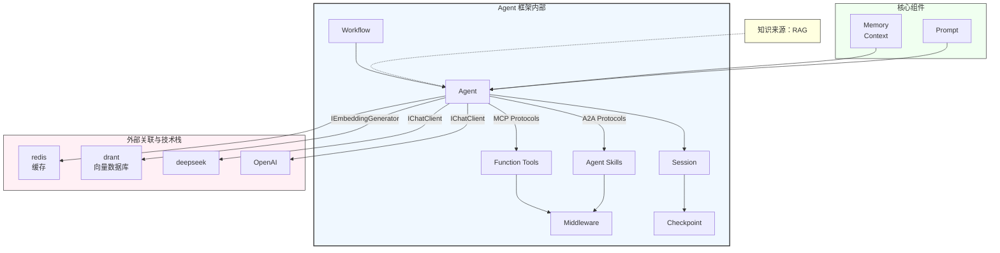
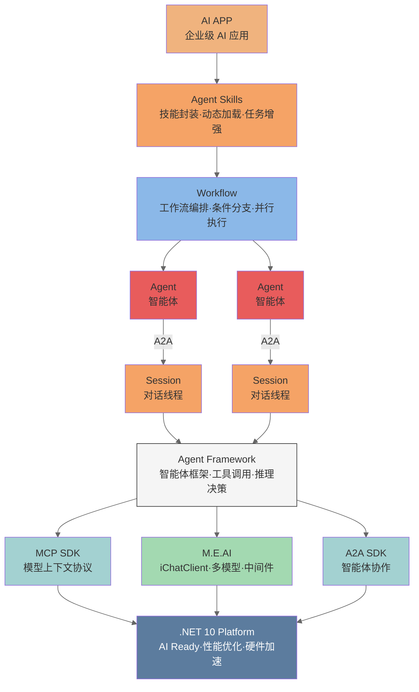
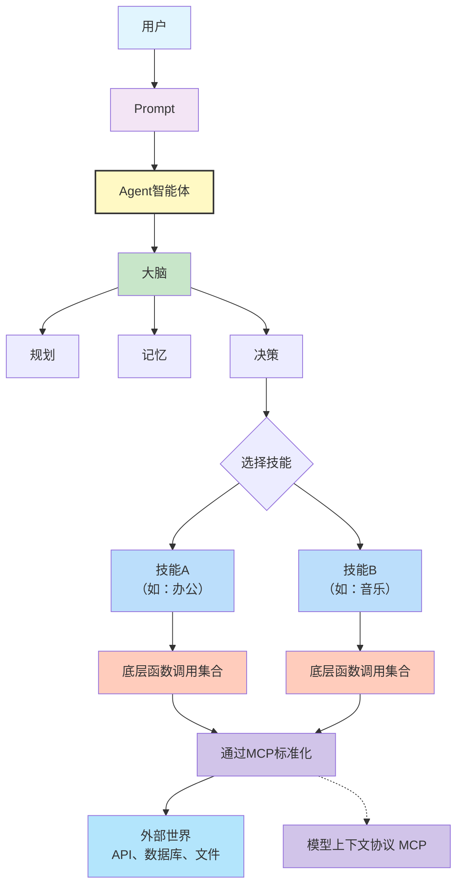
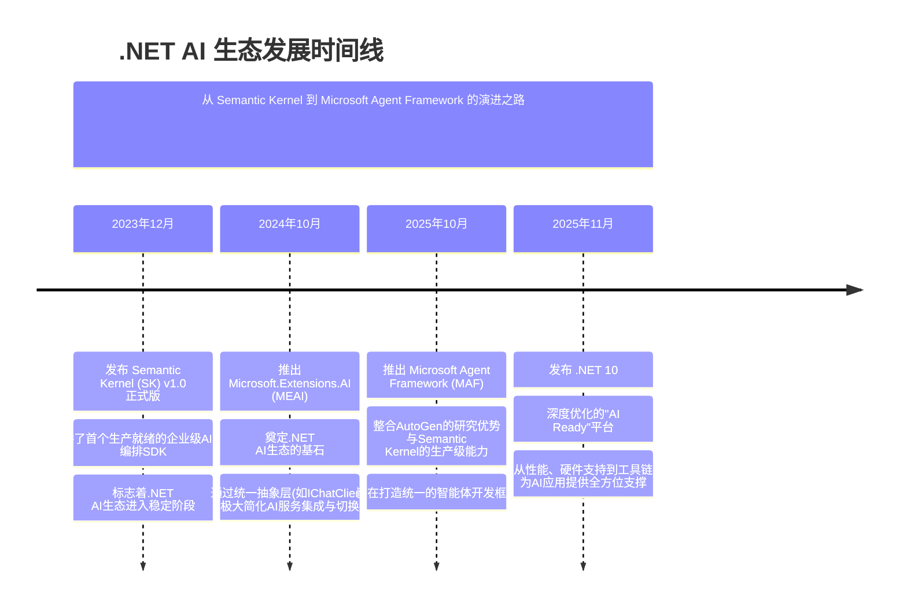
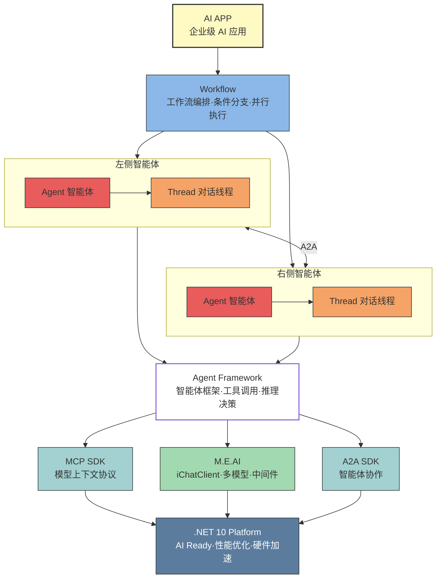

如果你最近在关注微软的 AI Agent 技术栈，这次发布值得认真看。

Microsoft Agent Framework .NET 1.0.0 正式上线。

这不是一次普通的版本升级，而是一个清晰信号：*微软正把过去分散在 Semantic Kernel、AutoGen 的能力，收敛为统一的 Agent 开发底座。随着 Agent Skills 这块拼图补齐，框架从“可以演示”走向“可以落地、可以扩展、可以长期维护”*。

很多人看到 1.0，会先关注“终于 GA 了”。但更重要的是它传达的趋势：

> Agent 开发，正在从 Demo 时代进入工程化时代。



## 一、为什么这次 1.0 值得重点关注 ##

先说判断：

这次 1.0 的价值，不在于功能变多，而在于边界更清晰、抽象更稳定、工程信号更强。

真正决定一个框架能否进入生产环境的，通常不是“支持了多少模型”，而是这三件事：

- 能力边界是否清晰
- 核心抽象是否稳定
- 复杂度是否能被组织起来

从官方 overview 和 README 来看，Microsoft Agent Framework 已经形成了明确骨架：

- Agents：负责与模型、工具、MCP servers 交互，处理开放式任务。
- Workflows：负责把 Agent 与确定性函数连接起来，处理多步骤、可控制、可恢复的流程。

再加上 session state、context providers、middleware、telemetry、多模型支持，以及 A2A / MCP / AG-UI 互操作，这已经不是“调用模型的 SDK”，而是一个面向生产的 Agent Runtime 基础设施。

## 二、Microsoft Agent Framework 在“统一”什么 ##

如果用一句话概括：

> 它正在统一三层抽象：Agent 抽象、流程抽象、能力封装抽象。

### Agent 抽象 ###

Agent 不再是“一次模型调用”，而是可持续交互、可挂载中间件、可持有会话状态的运行时实体。

### Workflow 抽象 ###

复杂任务不再完全依赖 Agent 自由发挥，而是通过 graph-based workflows 把 Agent 与函数按显式流程组织起来，支持顺序、并发、handoff、group chat 等模式，并具备 checkpointing、human-in-the-loop、type-safe routing 等工程能力。

### 能力封装抽象（Skills） ###

这次最关键的补齐点就是 Agent Skills。它让“领域知识、操作说明、脚本资源、模板资产”拥有了统一且可复用的封装形态。



## 三、为什么说 Agent Skills 补上了 1.0 的最后一块拼图 ##

如果只把 Agent 当成“会调工具的模型壳子”，你很快会遇到两个常见问题：

Prompt 不断膨胀，维护成本持续上升。
业务知识和流程经验混在系统提示词里，复用困难、审计困难。

Agent Skills 的核心价值，就是把这类能力从 Agent 本体剥离出来，做成可移植、可复用、可审计、可按需加载的模块。
典型结构是：

- `SKILL.md`
- 可选 `scripts/`
- 可选 `references/`
- 可选 `assets/`

更重要的是它引入了 Progressive Disclosure（渐进式披露）机制：

- Advertise：先只注入技能名称和描述。
- Load：任务匹配后再加载完整 SKILL.md。
- Read resources：确有需要再读取参考资料或模板。
- Run scripts：确有需要再执行脚本。

这直接改善了上下文窗口管理、Token 成本控制和多团队协作效率。

可以这样理解：

- Workflows 解决“过程如何被控制”。
- Skills 解决“能力如何被沉淀和复用”。

两者结合，框架才真正具备工程完整性。

> 但这远不是Microsoft Agent Framework 的最后一块拼图，随着 AI 的发展，肯定还会有很多的协议和规范将持续落地和集成至框架中去。

## 四、这次 1.0 给开发者的核心启示 ##

### 不要再把 Agent 当成 Prompt 工程延长线 ###

生产级 Agent 的竞争点是：状态管理、流程控制、工具约束、可观测、可恢复、合规边界、协作稳定性，而不是“提示词写得多花”。

### 先做“任务分流”，再做“技术实现” ##

先判断任务应由函数完成，还是由 Agent 完成。

- 能用确定性函数直接解决的，优先函数。
- 需要语义理解、规划和弹性决策的，再交给 Agent。

### 学会 Skill 与 Workflow 的边界划分 ###

- 希望 AI 自主决定路径，用 Skill。
- 必须保证步骤和顺序，用 Workflow。

这不是二选一，而是两个不同层面的复杂度治理手段。

### 框架评估要从“模型数量”升级到“工程能力” ###

除了多模型接入，还应重点看：

- 是否有统一抽象与迁移路径
- 是否具备可观测和中间件机制
- 是否支持人类介入与恢复机制
- 是否支持标准互操作（A2A、MCP、AG-UI）

## 五、对 .NET 开发者的职业信号 ##

过去谈 AI，很多人默认先看 Python；这是研究创新阶段的自然路径。

但当目标从“原型验证”变成“生产系统”，关注点会转向：复杂业务承载、状态治理、企业集成、可观测、安全边界和长期演进。

从这次 1.0 的收敛路线看，微软正在把 .NET 在类型系统和工程化上的传统优势，迁移到 Agent 时代。这意味着 .NET 开发者不该只问“会不会被边缘化”，而要问“如何把这些工程优势转化为 AI 时代的系统能力”。

## 六、总结：1.0 不是终点，而是主航道的开始 ##

如果把这次发布放到更长时间线看，它代表的是三条主线的汇合：

- 从 Semantic Kernel、AutoGen 到统一的 Agent Framework。
- 从单体 Agent 到由 Agents + Workflows + Skills 组成的系统化平台。
- 从“智能演示”走向“工程治理”。

所以，这次 1.0 真正意味着的不是“Agent 又多了几个功能”，而是：

> 开发者终于可以用更稳定的方法，构建可持续演进的 Agent 系统。

> 你分得清 Prompt、Agent、Function Call、Skill、MCP 吗？

## 前言 ##

随着 AI 的迅速崛起，有很多词汇你可能会经常听到，但是让你来详细地说一下它们各自的区别与联系，有很多人还是回答不上来的，这期咱们就来详细地讲解一下它们各自的区别与联系，让你对它们有更多的了解。

可以把它们想象成构建一个智能应用（比如一个智能助手）的不同层次和组件，从最基础的指令，到高级的交互协议。

## 核心概念定义 ##

### Prompt（提示词/提示工程） ###

- 是什么：这是用户与 AI 模型交互的最基本形式。它是你输入给大语言模型（LLM）的一段文本，用来引导模型生成你想要的回复。

- 本质：可以看作是写给 AI 的“使用说明书”或“指令” 。它本身不执行动作，只是告诉模型应该做什么、扮演什么角色、输出什么格式。

- 示例：你问“法国的首都是哪里？”，这就是一个简单的 Prompt。复杂的 Prompt 可能包括：“你是一个专业的旅游顾问，请为我规划一个为期 3 天的巴黎行程，并以列表形式输出。”

### Agent（智能体/代理） ###

- 是什么：Agent 是一个更复杂的系统，它利用 LLM 作为核心“大脑”或“决策引擎”，来自主地完成一个相对复杂的任务。它通常具备规划、记忆、以及使用工具的能力。

- 本质：Agent 是一个能“行动”的实体。它不仅仅是被动地回答问题，而是会主动思考：要实现这个目标，我需要做哪些步骤？第一步该做什么？如果失败了怎么办？

- 工作流程示例：你让它“帮我预订一张下周五从北京到上海的机票”。Agent 会：

  - 规划：需要查询航班、比较价格、选择航班、然后下单。
  - 调用工具：它可能会调用一个“查询航班”的工具（Function Call）。
  - 执行与反馈：拿到查询结果后，它会整理信息，再询问你要选哪个，最后帮你下单。整个过程中，它可能需要进行多次“思考-行动-观察”的循环。

### Function Call（函数调用） ###

- 是什么：这是 LLM 的一种能力。在请求模型时，你可以向它描述一系列函数（包括函数的功能、参数等）。当用户的问题需要执行特定操作或获取实时信息时，模型不会自己去执行代码，而是返回一个“调用某个函数”的请求，并附带好相应的参数。

- 本质：这是连接 LLM 与外部世界（数据、系统、API）的“桥梁” 。它让 LLM 从只能“说话”升级为可以“动手”的接口。

- 示例：你问“北京天气怎么样？”。

  - 你在 Prompt 中向模型描述了一个 `get_weather(city: string)` 函数。
  - 模型判断出需要调用这个函数，于是返回一个特殊格式的回复，内容类似于：`{ "function": "get_weather", "parameters": {"city": "北京"} }`。
  - 你的程序收到这个请求，然后去执行真正的天气 API 调用，获取数据，最后把数据返回给模型，让模型用自然语言告诉你“北京今天晴，10-20度”。

### Skill（技能） ###

- 是什么：这是一个偏产品和应用层的概念。一个 Skill 可以理解为赋予 Agent 的一种特定能力或“插件” 。它通常封装了一系列用于完成特定领域任务的 Prompt、工作流和 Function Call。

- 本质：可以看作是 Agent 的 “应用程序” 。安装一个“音乐技能”，Agent 就能放歌；安装一个“办公技能”，Agent 就能帮你处理文档。

- 示例：在一个智能音箱里，“闹钟技能”包含了设置闹钟、取消闹钟、查询闹钟等功能。对于 Agent 来说，一个 Skill 可能对应着一个或多个底层的 Function Call，也可能结合了特定的 Prompt 模板来指导 Agent 如何使用这些功能。

### MCP（模型上下文协议 / Model Context Protocol） ###

- 是什么：这是一个开放的、标准化的协议，由 Anthropic 提出。它旨在解决一个问题：如何让 AI 模型（特别是 Agent）能够以一种统一、安全的方式，动态地发现和使用各种外部工具和数据源。

- 本质：可以看作是 AI 世界的“USB-C 接口” 。想象一下，以前每个外部设备（打印机、键盘、显示器）都需要不同的接口和驱动。MCP 就是想成为一个通用的标准接口。只要你的 AI 应用支持 MCP，它就能即插即用地连接到任何也支持 MCP 的数据源或工具服务器。

- 工作流程：一个支持 MCP 的 Agent 可以通过 MCP 客户端，去连接一个 MCP 服务器（比如一个 Google Drive 服务器，或一个本地文件服务器）。服务器会告诉客户端：“我有这些工具：list_files、read_file、search_docs”。Agent 就可以像使用本地 Function Call 一样，去调用这些远程工具。

## 区别与联系 ##

现在，我们用一张图和一个类比来串联它们。

### 关系图 ###



### 核心区别与联系 ###

|  概念   |      核心角色  |   层次  |   核心问题  |   相互关系  |
| :-----------: | :-----------: | :-----------: | :-----------: | :-----------: |
|  Prompt   |      指令  |   交互层  |   我该怎么告诉 AI 我想要什么？  |   是一切交互的基础。Agent 的思考过程、Function Call 的描述，本质上都是在使用 Prompt。  |
|  Agent   |      执行者  |   应用层  |   我如何自主地完成一个复杂目标？  |   它是“老板”，负责统筹规划。它使用 Function Call 作为手脚，管理着各种 Skill。  |
|  Function Call   |      接口模型  |   能力层  |   LLM 如何请求调用外部工具？  |   它是“手脚”，是 Agent 执行具体操作的方式。一个 Skill 可以封装多个 Function Call。  |
|  Skill   |      能力包  |   应用/产品层  |   如何将一组相关功能打包，方便 Agent 调用？  |   它是“技能包”或“应用”，是组织 Function Call 和 Prompt 的高级单元。Agent 通过拥有 Skill 来获得能力。  |
|  MCP   |      协议  |   基础设施层  |   如何让 Agent 能通用、安全地发现和连接任何工具？  |   它是“万能接口标准”。它标准化了 Function Call 的发现和调用过程，让 Skill 的开发和使用更加模块化和解耦。 |

## 综合类比：一个智能厨房 ##

为了更好地理解，我们把这个过程比作一个智能厨房：

- Prompt（指令） ：你对厨房机器人说：“我饿了，给我做一份番茄炒蛋。” 这就是 Prompt，是你下达的初始指令。
- Agent（智能厨房机器人） ：机器人本身就是 Agent。它听到你的话，开始思考：做番茄炒蛋需要先洗番茄、切番茄、打鸡蛋、炒菜……这是一个有规划的过程。
- Function Call（具体动作） ：机器人的手臂开始执行具体动作：“拿起番茄”（这是一个 Function Call）、“打开水龙头”（另一个 Function Call）、“开启炉灶”（又一个 Function Call）。LLM 本身不做这些，但它会决定何时调用这些动作。
- Skill（烹饪技能包） ：机器人内部安装了一个“中式烹饪技能包”，这个技能包里包含了“洗菜”、“切菜”、“炒菜”等一系列相关的 Function Call 的说明书和操作流程。如果装的是“西式烘焙技能包”，那它就会调用和面、烤箱相关的功能。
- MCP（通用厨房接口标准） ：假设你的厨房还有一台独立的智能冰箱和智能烤箱，它们各自有不同的接口。如果它们都遵循 MCP 标准，那么你的厨房机器人就可以通过标准的“查询库存”接口访问冰箱，通过标准的“设置温度”接口控制烤箱，无需为每个设备单独写一套连接代码。

## 总结 ##

- Prompt 是语言，告诉 AI “要什么” 。
- Function Call 是工具，赋予 AI “怎么做” 的能力接口。
- Skill 是技能包，将相关工具打包，让 AI 的能力模块化。
- Agent 是执行者，利用大脑（LLM）规划，使用手脚（Function Call/Skill）去自主完成任务。
- MCP 是标准接口，让 AI 能通用、便捷地连接任何外部工具，是整个生态的“基础设施”。


> .NET真的做不了AI吗？

## 开篇：你是否也遇到过这些场景？ ##

技术选型会议上，你刚提出用.NET开发AI应用，就被架构师打断：

> "做AI？还是用Python吧，生态成熟。"

翻开招聘网站，AI岗位的JD清一色写着：

> "熟悉PyTorch/TensorFlow/LangChain者优先，.NET经验可加分。"

深夜浏览技术社区，看着Python开发者分享AI项目如鱼得水，而你作为.NET开发者，心里冒出一个问题：

> "是该转型Python，还是继续坚守.NET？难道.NET开发者真的无缘AI红利吗？"

如果你也有这样的焦虑和困惑，请继续往下看。

今天，我要告诉你一个被严重低估的事实：

> **.NET开发者不仅能做AI，而且可能是最适合把AI落地到生产环境的那群人。**
 
## 第一部分：破解迷思——.NET真的做不了AI吗？ ##

### 迷思一："搞AI必须用Python" ###

#### ❌ 误区认知 ####

"AI = Python"，这似乎已经成为行业共识。

打开任何一个AI教程，清一色都是：

```python
import openaiimport langchainfrom transformers import AutoModel
```

于是很多.NET开发者开始怀疑人生：难道我这么多年的C#白学了？

#### ✅ 真相揭秘 ####

- AI的核心是算法和模型，编程语言只是工具。
- Python在AI领域的优势，主要是在研究和实验阶段：

  - 快速原型开发
  - 丰富的科学计算库
  - 学术界广泛使用

但当AI应用要走向生产环境时，企业级需求完全不同：

| 生产环境需求 | Python现状 | .NET优势 |
| :---: | :---: | :---: |
| 性能 | 解释型语言，性能瓶颈明显 | 编译型+JIT，性能优越 |
| 类型安全 | 动态类型，运行时才发现错误 | 强类型，编译时即可检查 |
| 并发处理 | GIL限制，真正的多线程困难 | 原生支持异步和并行 |
| 企业集成 | 需要额外工作集成现有系统 | 与.NET生态无缝集成 |
| 长期维护 | 代码可维护性相对较弱 | 强类型+IDE支持，维护性强 |

> 一句话总结：Python适合AI研究，.NET更适合AI落地。

而现在，越来越多的企业开始意识到：真正的价值不在实验室的模型，而在生产环境跑得稳的AI应用。

### 迷思二："微软AI生态不成熟" ###

#### ❌ 误区认知 ####

很多人认为：

- 微软只有Azure OpenAI，除此之外没什么
- .NET的AI生态远不如Python成熟
- 学.NET做AI就是在孤军奋战

#### ✅ 真相揭秘：从0到完整生态只用了2年 ####



让我用时间线来展示微软在.NET AI生态上的爆发式布局：

##### 📅 2023年12月：Semantic Kernel v1.0 正式版 #####

- 🎯 首个生产就绪的企业级AI应用编排SDK
- 🏢 从此.NET AI生态进入稳定阶段
- 💡 核心能力：提示工程、函数调用、计划器、记忆系统

> 这意味着什么？ .NET开发者可以用熟悉的依赖注入、中间件模式开发AI应用，不再需要学习Python那套完全不同的开发范式。

##### 📅 2024年10月：Microsoft.Extensions.AI (MEAI) #####

- 🎯 推出统一抽象层：IChatClient
- 🔄 一次编写，多模型运行（OpenAI、Azure、Anthropic、本地模型...）
- 🏗️ 就像ASP.NET Core统一了Web开发，MEAI统一了AI开发

代码对比，感受一下差异：

Python切换模型（需要改代码）：

```py
# 使用OpenAI
from openai import OpenAIclient = OpenAI() 
# 切换到Anthropic，需要改代码
from anthropic import Anthropicclient = Anthropic()
```

.NET切换模型（只需要改配置）：

```C#
// 依赖注入配置
services.AddChatClient(builder =>     builder.UseOpenAI(apiKey)); // 或 .UseAzureOpenAI() 或 .UseAnthropic() 
// 业务代码完全不变
public class MyService(IChatClient chatClient) {    var response = await chatClient.CompleteAsync("你好");}
```

> 这意味着什么？ 你可以在不改代码的情况下，自由切换AI模型。今天用OpenAI，明天换成本地DeepSeek，后天接入企业内部模型，对业务代码零影响。

##### 📅 2025年10月：Microsoft Agent Framework (MAF) #####

- 🎯 融合之作：AutoGen（研究成果）+ Semantic Kernel（生产能力）
- 🤖 统一的智能体开发框架
- 🌟 覆盖：单智能体、多智能体协作、工作流编排

> 这意味着什么？ 微软把研究院的前沿成果和生产级框架的最佳实践融合了。你既能用到最新的AI Agent技术，又不用担心生产环境的稳定性。

##### 📅 2025年11月：.NET 10 发布 #####

- 🎯 "AI Ready" 平台深度优化
- ⚡ 性能提升：AI推理性能优化、张量运算加速
- 🖥️ 硬件支持：GPU、NPU原生支持强化
- 🛠️ 工具链：AI调试、追踪、性能分析全面强化

> 这意味着什么？ .NET 10不是简单的版本迭代，而是专门为AI时代打造的平台升级。从语言特性到运行时，从编译器到工具链，全面针对AI场景优化。

##### 🎯 完整生态对比 #####

| 时间投入 | Python AI生态 | .NET AI生态 |
| :--- | :--- | :--- |
| 成熟周期 | 10年+ (2012年至今) | 2年 (2023-2025) |
| 成熟度 | 分散，需自行整合 | 统一框架，开箱即用 |
| 生产就绪 | 需大量适配工作 | 原生企业级支持 |

结论：.NET用2年时间，走完了Python 10年的路，而且更适合生产环境。

### 迷思三："学习成本太高，来不及了" ###

#### ❌ 误区认知 ####

很多.NET开发者在想：

- "现在去学Python的AI生态，是不是太晚了？"
- "别人都学了好几年了，我现在才开始..."
- "重新学一门语言和生态，投入太大了"

#### ✅ 真相揭秘：.NET开发者反而有弯道超车的机会 ####

为什么这么说？

##### 1️⃣ 无需重新学习语言 #####

你已经掌握的C#技能，可以直接复用：

- ✅ 依赖注入 → AI服务注册
- ✅ 中间件模式 → AI管道处理
- ✅ 异步编程 → AI流式响应
- ✅ LINQ查询 → 数据处理
- ✅ 强类型 → 结构化输出

对比学习成本：

- Python转.NET AI：学语言 + 学框架 + 学AI = 3个月+
- .NET学AI：只需学AI框架 = 1个月

##### 2️⃣ 统一的开发体验 #####

从Web开发到AI开发，一脉相承：

```C#
// 你熟悉的ASP.NET Core
services.AddControllers();services.AddDbContext<MyDbContext>(); // 同样熟悉的AI开发
services.AddChatClient(builder => builder.UseOpenAI());
services.AddAgent<MyAgent>();
```

相同的代码风格，相同的思维模式，零学习曲线。

##### 3️⃣ 企业级开发经验可直接迁移 #####

你在.NET开发中积累的经验，都能用到AI开发中：

| .NET企业开发经验 | AI开发中的应用 |
| :--- | :--- |
| 分层架构 | AI应用的模块化设计 |
| 依赖注入 | AI服务的解耦与测试 |
| 配置管理 | 模型参数的动态配置 |
| 日志追踪 | AI调用的可观测性 |
| 异常处理 | AI异常的优雅降级 |
| 性能优化 | AI推理的性能调优 |

> 你不是从零开始，而是站在现有技能的肩膀上。

## 第二部分：揭秘武器——.NET AI技术栈到底有多强？ ##

现在你知道了.NET可以做AI，那么具体怎么做呢？让我带你了解.NET AI的完整技术栈。

### M.E.AI：.NET平台的AI底座 ###

#### 是什么？ ####

Microsoft.Extensions.AI (MEAI) 是.NET平台的AI统一抽象层。

如果你熟悉ASP.NET Core，你会发现：

- ASP.NET Core之于Web开发
- MEAI之于AI开发

都是提供统一的抽象和开发体验。

#### 能做什么？ ####

核心能力：一次编写，多模型运行

```cs
// 1. 注册AI服务（配置层）
services.AddChatClient(builder => {    builder        .UseOpenAI(apiKey)        // 或        .UseAzureOpenAI(endpoint)  // 或        .UseAnthropic(apiKey)      // 或        .UseOllama(endpoint);      // 本地模型}); 
// // 2. 业务代码（永远不变）
public class AIService(IChatClient chatClient)
{    
  public async Task<string> Chat(string message)    
  {        
    var response = await chatClient.CompleteAsync(message);        
    return response.Message.Text;    
  }
}
```

切换模型只需要改配置，业务代码完全不动。

#### 为什么强？ ####

因为它完全符合.NET开发者的习惯：

| ASP.NET Core概念 | MEAI对应概念 | 作用 |
| :--- | :--- | :--- |
| IHostBuilder | IChatClient | 统一抽象 |
| Middleware | ChatClientMiddleware | 请求管道 |
| ILogger | AI日志集成 | 可观测性 |
| IOptions | 模型配置 | 配置管理 |
| DI Container | AI服务注册 | 依赖注入 |

你学ASP.NET Core时掌握的技能，在MEAI中完全适用。

### MCP：大模型的"外挂商店" ###

#### 是什么？ ####

Model Context Protocol (MCP) 是让AI模型连接外部工具的协议。

打个比方：

- AI模型 = 一台高性能电脑
- MCP = USB接口标准
- MCP服务器 = 各种USB设备（U盘、键盘、鼠标...）

有了MCP，AI就能：

- 📁 访问文件系统
- 🗄️ 查询数据库
- 🌐 调用Web API
- 🔧 执行系统命令
- 🔌 连接任何你需要的工具

#### 实战场景 ####

##### 场景1：让AI访问企业数据库 #####

```C#
// 创建MCP服务器，暴露数据库查询能力
var mcpServer = new McpServer();
mcpServer.AddTool("query_customer", async (string sql) => {    return await db.Customers.FromSqlRaw(sql).ToListAsync();}); // AI自动调用数据库查询
var response = await chatClient.CompleteAsync(    "查询最近7天注册的VIP客户",    tools: mcpServer.GetTools());
```

##### 场景2：让AI操作企业系统 #####

```C#
mcpServer.AddTool("create_order", async (Order order) => {    await orderService.CreateOrderAsync(order);    return "订单创建成功";}); // AI理解意图，自动创建订单await chatClient.CompleteAsync(    "帮我给客户张三创建一个iPhone 16的订单");
```

MCP让AI从"只会聊天"变成"能干活"。

### MAF：智能体开发的"终极武器" ###

#### 什么是智能体（Agent）？ ####

如果说传统AI是"一问一答"的客服，那么智能体就是能自主完成任务的助手。

对比：

| 传统AI | 智能体（Agent） |
| :--- | :--- |
| 用户：今天天气如何？<br>AI：北京今天晴，20度 | 用户：帮我安排明天的行程<br>Agent：<br>1. 查询天气→晴天<br>2. 查看日历→10点有会<br>3. 推荐活动→下午适合户外<br>4. 生成行程→已发送到你邮箱 |
| 被动响应 | 主动规划+执行 |

#### MAF核心能力 ####

Microsoft Agent Framework (MAF) 是微软统一的智能体开发框架。

##### 单智能体开发 #####

```C#
// 定义一个客服智能体
public class CustomerServiceAgent : AgentBase{    [Tool("查询订单")]    public async Task<Order> QueryOrder(string orderId) { }        [Tool("退款处理")]    public async Task<bool> Refund(string orderId) { }        public override async Task<string> RunAsync(string input)    {        // Agent自动决策：        // 1. 理解用户意图        // 2. 选择合适的工具        // 3. 执行并返回结果    }}
```

##### 多智能体协作（A2A - Agent to Agent） #####

```C#
// 定义智能体团队
var team = new AgentTeam()    .AddAgent<ResearchAgent>("研究员")   
// 负责信息收集    
.AddAgent<WriterAgent>("作家")       
// 负责内容创作    
.AddAgent<ReviewerAgent>("审核员"); 
// 负责质量把关 // 协作完成任务
await team.ExecuteAsync("写一篇关于.NET AI的技术文章"); // 执行过程：// 研究员 → 收集.NET AI最新资料// 作家   → 根据资料撰写文章// 审核员 → 检查文章质量，提出修改建议// 作家   → 根据建议修改// 审核员 → 确认通过
```

##### 工作流编排（Workflow） #####

```C#
// 定义复杂业务流程
var workflow = new WorkflowBuilder()    .Start<InputAgent>()                    
// 接收用户输入    
.Then<ValidationAgent>()                
// 验证输入    
.Branch(        
  condition: result => result.IsValid,        
  onTrue: builder => builder            .
  Parallel(                      
    // 并行执行                
    b => b.Step<ProcessAgent1>(),                
    b => b.Step<ProcessAgent2>()            
    )            
  .Then<AggregateAgent>(),       
  // 聚合结果        
  onFalse: builder => builder            
  .Step<ErrorHandlingAgent>()     
  // 错误处理    
  )    
  .End<OutputAgent>()                     
  // 输出结果    
  .Build();
```

#### 技术亮点 ####

MAF = AutoGen（微软研究院） + Semantic Kernel（生产级框架）

| 来源 | 贡献 |
| :--- | :--- |
| AutoGen | 多智能体协作模式、对话策略 |
| Semantic Kernel | 企业级稳定性、生产环境最佳实践 |

你既能用到前沿的AI Agent技术，又不用担心生产环境的坑。

#### 对标产品 ####

| 能力 | MAF (.NET) | LangGraph (Python) | CrewAI (Python) |
| :--- | :--- | :--- | :--- |
| 单智能体 | ✅ | ✅ | ✅ |
| 多智能体协作 | ✅ | ✅ | ✅ |
| 工作流编排 | ✅ | ✅ | ❌ |
| 企业级稳定性 | ⭐⭐⭐⭐⭐ | ⭐⭐⭐ | ⭐⭐ |
| .NET集成 | ⭐⭐⭐⭐⭐ | ❌ | ❌ |
| 学习曲线（.NET开发者） | ⭐⭐⭐⭐⭐ | ⭐⭐ | ⭐⭐ |

对.NET开发者来说，MAF是最优选择。

### 完整技术栈地图 ###

现在，让我们把所有技术拼图组合起来，看看完整的.NET AI技术栈:



每一层都是生产级的，每一层都可以独立使用，也可以组合使用。

技术栈层次说明：

| 层次 | 名称 | 作用 | 应用场景 |
| :--- | :--- | :--- | :--- |
| 🚀 应用层 | 企业级AI应用 | 最终交付的产品 | 客服系统、文档处理、智能助手 |
| 🔄 编排层 | Workflow | 复杂流程自动化 | 多步骤业务流程、条件分支 |
| 🤝 协作层 | A2A | 多智能体协同 | 团队协作、任务分解 |
| 🤖 智能体层 | MAF | 单智能体核心 | 自主决策、工具调用 |
| 🔧 工具层 | RAG + MCP | 能力增强 | 知识检索、外部集成 |
| ⚡ 抽象层 | M.E.AI | 统一接口 | 多模型切换、管道处理 |
| 💎 平台层 | .NET 10 | 运行时支持 | 性能、硬件、工具链 |

## 结语：.NET开发者的AI时代 ##

当别人问你**"Python AI生态有多强"**时，

你只需要反问一句：

> "你的Python AI应用，能承受生产环境的考验吗？"

.NET开发者从来不缺技术能力，

我们拥有的是：

- ✅ 强大的类型系统
- ✅ 优秀的性能表现
- ✅ 企业级的开发经验
- ✅ 完善的工具链支持

现在，随着微软在AI领域的全面布局，.NET开发者终于有了完整的AI技术栈。

AI的红利属于先行者。

而.NET开发者，正站在最佳的起跑线上。

