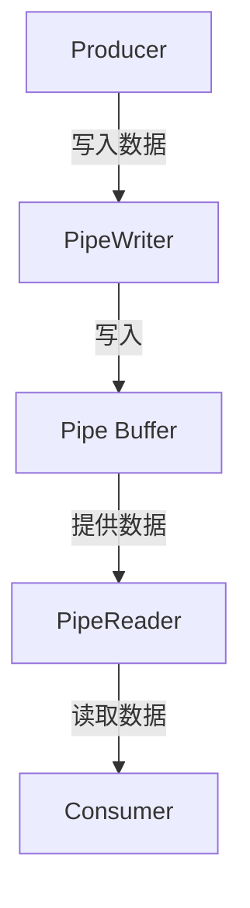

## 简介 ##

如果说：

- `Span<T>` 解决的是“如何高效操作一段连续内存”；
- `Memory<T>` 解决的是“如何跨异步边界持有连续内存”；
- `ReadOnlySequence<T>` 解决的是“如何处理多段逻辑连续内存”；

那么 `System.IO.Pipelines` 解决的就是更完整的一层问题：

> 如何把“数据读取、缓冲区管理、分段处理、背压控制、协议解析”整合成一套高性能 IO 管道模型？

这就是为什么 `Pipelines` 看起来像一个专门给框架作者用的库，但它其实非常务实。

只要你的程序碰到这些问题：

- 网络读写吞吐越来越大；
- 缓冲区管理越来越复杂；
- 半包、粘包、分帧逻辑越来越乱；
- `Stream` 代码里充满了临时数组和复制；
- 读取和解析耦合在一起，维护成本很高；

你基本就会走到 `System.IO.Pipelines`。

## 为什么 Stream 模式会越来越吃力？ ##

传统写法通常像这样：

```csharp
byte[] buffer = new byte[4096];
int bytesRead = await stream.ReadAsync(buffer, 0, buffer.Length);
```

这在简单场景没问题，但一旦你开始做协议解析，问题就会不断冒出来：

- 一次读到的数据可能不完整；
- 一次也可能读到多条消息；
- 你得自己维护“剩余未消费数据”；
- 你得自己决定什么时候扩容；
- 你得自己处理拷贝、拼接、缓存复用；
- 消费慢于生产时，还要自己想办法做背压。

换句话说，传统 `Stream` 模式的问题不是“不能处理 IO”，而是：

- 越往高性能场景走，越容易写出一堆复杂而脆弱的缓冲区代码。

`Pipelines` 的设计目标，就是把这些复杂度收敛成一套固定模型。

## Pipelines 到底是什么？ ##

你可以先用一句最直白的话理解：

> `System.IO.Pipelines` 是一套面向高性能流式 IO 的生产者-消费者管道抽象。

它的核心不是“替代所有 Stream”，而是：

- 把读取和解析解耦；
- 把缓冲区管理标准化；
- 把多段数据处理标准化；
- 把高吞吐场景下的背压和零拷贝路径标准化。

## 核心模型：`Pipe`、`PipeWriter`、`PipeReader`

`Pipelines` 的核心对象很少，主要就这三个：

|  类型  |  作用  |
| :-----------: | :----: |
|  `Pipe`  |  管道本体，负责管理缓冲区和读写协作  |
|  `PipeWriter`  |  写端，生产者把数据写进来  |
|  `PipeReader`  |  读端，消费者从这里读取和解析  |

最简单的心智模型就是：



也就是说：

- 上游负责写；
- 下游负责读；
- 管道本体负责协调内存和状态。

## 一个最小示例 ##

### 最小用法 ###

```csharp
using System.IO.Pipelines;

var pipe = new Pipe();

PipeWriter writer = pipe.Writer;
PipeReader reader = pipe.Reader;
```

这几行就已经建立了一条内存内管道。

接下来通常会变成两个方向：

- 一个地方持续写入数据；
- 另一个地方持续读取和消费数据。

## 写端是怎么工作的？ ##

写端最常见的流程是：

1. 申请一块可写内存；
2. 往里面写数据；
3. 告诉管道写了多少字节；
4. `FlushAsync()` 通知读端可以读了。

典型代码：

```csharp
Memory<byte> memory = writer.GetMemory(512);
int bytesRead = await socket.ReceiveAsync(memory, SocketFlags.None);
writer.Advance(bytesRead);
FlushResult result = await writer.FlushAsync();
```

这里逐行理解：

`GetMemory(...)`

```csharp
Memory<byte> memory = writer.GetMemory(512);
```

作用是：

- 向 `PipeWriter` 申请一块至少 512 字节的可写缓冲区；
- 这块缓冲区通常来自池化内存，而不是每次新建数组。

### 往里面写数据 ###

```csharp
int bytesRead = await socket.ReceiveAsync(memory, SocketFlags.None);
```

重点是：

- 数据直接写进 `PipeWriter` 给你的内存；
- 避免了“先读到临时数组，再复制到另一个缓冲区”的中间过程。

`Advance(...)`

```csharp
writer.Advance(bytesRead);
```

这一步是在告诉管道：

- 刚刚那块内存里，真正写入了多少字节。

如果你申请了 512 字节，但实际只写了 120 字节，就必须告诉它是 120，而不是 512。

`FlushAsync()`

```csharp
FlushResult result = await writer.FlushAsync();
```

它的作用是：

- 把刚才写入的数据正式“提交”给读端；
- 让 `PipeReader` 有机会读到这些数据；
- 同时也是背压协调的关键点。

所以 `Advance()` 和 `FlushAsync()` 不要混淆：

- Advance 是声明写了多少；
- FlushAsync 是把已写内容对外可见。

## 读端是怎么工作的？ ##

读端最常见的流程是：

- `ReadAsync()` 拿到当前可读数据；
- 解析 `ReadOnlySequence<byte>`；
- 确定哪些数据已经消费，哪些只是看过但还要保留；
- 调用 `AdvanceTo(...)` 告诉管道。

典型代码：

```csharp
ReadResult result = await reader.ReadAsync();
ReadOnlySequence<byte> buffer = result.Buffer;
```

这里最重要的点是：

- 读出来的不是 `byte[]`
- 也不是单段 `ReadOnlyMemory<byte>`

而是：

```csharp
ReadOnlySequence<byte>
```

也就是说，`Pipelines` 天然就是按多段缓冲区模型工作的。

## 为什么 `PipeReader` 返回的是 `ReadOnlySequence<byte>`？ ##

因为管道内部的数据很可能就是分段的。

例如：

- 第一次收到 1000 字节；
- 第二次收到 800 字节；
- 这两次并不一定会被拼成一整块连续数组。

所以 `Pipelines` 直接把真实模型暴露给你：

- 多段；
- 但逻辑连续；
- 用 `ReadOnlySequence<byte>` 表示。

这也正是它和 `ReadOnlySequence<T>` 那篇文章衔接的地方。

## 一个最小的生产者-消费者示例 ##

```csharp
using System.IO.Pipelines;
using System.Text;

var pipe = new Pipe();

Task producer = ProduceAsync(pipe.Writer);
Task consumer = ConsumeAsync(pipe.Reader);

await Task.WhenAll(producer, consumer);

static async Task ProduceAsync(PipeWriter writer)
{
    try
    {
        byte[] data = Encoding.UTF8.GetBytes("hello\nworld\n");
        await writer.WriteAsync(data);
    }
    finally
    {
        await writer.CompleteAsync();
    }
}

static async Task ConsumeAsync(PipeReader reader)
{
    try
    {
        while (true)
        {
            ReadResult result = await reader.ReadAsync();
            ReadOnlySequence<byte> buffer = result.Buffer;

            SequencePosition? position;
            while ((position = buffer.PositionOf((byte)'\n')) != null)
            {
                ReadOnlySequence<byte> line = buffer.Slice(0, position.Value);
                Console.WriteLine(Encoding.UTF8.GetString(line.ToArray()));

                buffer = buffer.Slice(buffer.GetPosition(1, position.Value));
            }

            reader.AdvanceTo(buffer.Start, buffer.End);

            if (result.IsCompleted)
            {
                break;
            }
        }
    }
    finally
    {
        await reader.CompleteAsync();
    }
}
```

这个例子不复杂，但已经体现出 `Pipelines` 的几个核心点：

- 写端和读端分离；
- 读端面对的是 `ReadOnlySequence<byte>`；
- 解析后通过 `AdvanceTo(...)` 告诉管道消费进度。

## `AdvanceTo(consumed, examined)` 是 `Pipelines` 最关键、也最容易写错的地方 ##

这是整个 PipeReader API 里最重要的点。

先看签名：

```csharp
reader.AdvanceTo(consumed, examined);
```

这两个位置不是重复信息，它们分别代表：

- `consumed`：我已经真正处理完、可以丢弃的数据边界
- `examined`：我已经看过但可能还需要保留的数据边界

你可以这样理解：

- `consumed` 决定哪些数据可以被回收；
- `examined` 决定读端下一次是否还需要立刻唤醒。

## 先说最常见的两种写法 ##

### 情况 1：所有数据都处理完了 ###

```csharp
reader.AdvanceTo(buffer.End);
```

或者等价地理解成：

```csharp
reader.AdvanceTo(buffer.End, buffer.End);
```

表示：

- 全部消费；
- 全部检查完；
- 管道可以把这些数据都视为已处理。

### 情况 2：还没读到一条完整消息 ###

例如没有找到换行符：

```csharp
reader.AdvanceTo(buffer.Start, buffer.End);
```

表示：

- 还没有真正消费任何数据，所以 `consumed = buffer.Start`
- 但我已经把当前可读内容都检查过了，所以 `examined = buffer.End`

这意味着：

- 当前数据要保留，等待下次继续拼接；
- 但管道知道你已经检查到末尾了。

## 为什么不能乱写 AdvanceTo？ ##

因为一旦写错，通常会出现两类问题：

### 提前消费 ###

如果你把还没解析完的数据也标成 `consumed`，那它就可能被回收掉。

结果就是：

- 半包数据丢失；
- 协议解析出错；
- 很难排查。

### 永远不消费 ###

如果你一直不推进 `consumed`，那缓冲区就会不断累积。

结果就是：

- 内存不断增长；
- 背压越来越重；
- 吞吐下降。

所以：

> `AdvanceTo` `写对了，Pipelines` 才真正安全好用；写错了，问题往往很隐蔽。

## ReadResult 里的几个状态怎么看？ ##

```csharp
ReadResult result = await reader.ReadAsync();
```

最常看的几个成员：

|  成员  |  含义  |
| :-----------: | :----: |
|  `Buffer`  |  当前可读的 `ReadOnlySequence<byte>`  |
|  `IsCompleted`  |  写端已经完成，后续不会再有数据  |
|  `IsCanceled`  |  当前读取被取消  |

其中最重要的是：

- `IsCompleted = true` 不代表当前 `Buffer` 一定为空；
- 它只代表写端不会再写更多数据了。

所以通常正确模式是：

- 先处理当前 `Buffer`
- 再根据 `IsCompleted` 决定是否退出

## 标准读循环应该怎么写？ ##

下面这段模式非常常见，也比较稳：

```csharp
while (true)
{
    ReadResult result = await reader.ReadAsync();
    ReadOnlySequence<byte> buffer = result.Buffer;

    // 解析 buffer

    reader.AdvanceTo(consumed, examined);

    if (result.IsCompleted)
    {
        break;
    }
}
```

如果你不知道该怎么起步，这就是标准骨架。

## `SequenceReader<byte>` 为什么常常和 `Pipelines` 一起出现？ ##

因为直接手写 `ReadOnlySequence<byte>` 解析虽然能做，但对“协议帧、分隔符、定长头部”这类场景会越来越底层。

这时 `SequenceReader<byte>` 往往更顺手。

例如按换行读取：

```csharp
var sequenceReader = new SequenceReader<byte>(buffer);
if (sequenceReader.TryReadTo(out ReadOnlySequence<byte> line, (byte)'\n'))
{
    // line 就是一条完整记录
}
```

它的优势在于：

- 适合逐步推进游标；
- 适合处理多段数据；
- 比自己手动管理 `SequencePosition` 更自然。

所以很多真实协议解析代码里，你会经常看到：

- `PipeReader`
- `ReadOnlySequence<byte>`
- `SequenceReader<byte>`

一起出现。

## `PipeWriter` 的高频写法：`GetMemory` / `Advance` / `FlushAsync` ##

虽然前面提过一次，但这三步值得再强调一下：

```csharp
Memory<byte> memory = writer.GetMemory(1024);
int written = Fill(memory.Span);
writer.Advance(written);
FlushResult flushResult = await writer.FlushAsync();
```

可以把它理解成：

- 先借一块内存；
- 再往里面填；
- 再告诉管道填了多少；
- 最后正式提交。

这和很多手写 `Stream` + 临时数组的区别就在于：

- 你操作的是管道管理的缓冲区；
- 而不是自己反复 `new` 的中间数组。

## `FlushAsync` 为什么不仅仅是“刷新”？ ##

很多人会把它想得太像 `Stream.FlushAsync()`。

在 `Pipelines` 里，它还承担几个关键职责：

- 让数据对读端可见；
- 参与生产者和消费者的协调；
- 在必要时触发背压。

也就是说，`FlushAsync()` 在 `Pipelines` 里比表面看起来更重要。

## 背压（Backpressure）是什么？ ##

这是 Pipelines 的一个核心价值。

简单说：

- 如果写入速度远快于消费速度，系统不能无穷无尽地继续堆内存。

`Pipelines` 会通过内部阈值和 `FlushAsync()` / 读取推进机制来协调读写两端速度。

这意味着：

- 消费慢时，写端不会无脑无限增长；
- 系统更容易维持稳定；
- 这对高吞吐网络服务尤其重要。

所以 `Pipelines` 不是只帮你“处理 buffer”，它还帮你处理了读写协作问题。

## 什么时候适合用 Pipelines？ ##

这要说得务实一点。

### 适合的场景 ###

- 自定义 TCP 协议；
- 高吞吐网络服务器；
- 日志流式处理；
- 需要分帧、拆包、粘包处理的协议；
- 需要尽量减少中间数组分配的场景；
- 需要读写解耦和背压的场景。

### 不太适合的场景 ###

- 只是简单读写小文件；
- 一次性 `ReadAllTextAsync` 就能解决的业务；
- 对性能没有明显压力；
- 团队还没有能力稳定维护这套模型。

一句话说：

- `Pipelines` 很强；
- 但不是所有 `Stream` 都该替换成 `Pipelines`。

## 和 `Channels` 的区别，不要混 ##

`Channels` 和 `Pipelines` 都像“管道”，但解决的问题完全不同。

|  技术  |  解决什么问题  |
| :-----------: | :----: |
|  `Channel<T>`  |  对象级生产者-消费者队列  |
|  `System.IO.Pipelines`  |  字节流 / 内存块级高性能 IO 管道  |

也就是说：

- `Channel<T>` 更像“消息队列”
- `Pipelines` 更像“字节流处理基础设施”

不要拿 `Channel<byte[]>` 去硬替代 `Pipelines`，也不要拿 `Pipelines` 去替代正常的对象队列。

## 常见坑 ##

### `AdvanceTo` 写错 ###

这是第一大坑，也是最常见的坑。

### 过早 `ToArray()` ###

如果你一拿到 `ReadOnlySequence<byte>` 就 `ToArray()`，那 `Pipelines` 的零拷贝价值会被打掉很多。

### 把 `IsCompleted` 理解成“当前没数据” ###

它表示的是“写端结束”，不是“缓冲区一定空了”。

### 不调用 `CompleteAsync()` ###

无论是读端还是写端，结束时都应该正确完成，否则资源管理会有问题。

### 读写逻辑耦合太深 ###

`Pipelines` 的一个核心价值就是解耦：

- 写端专注读入数据；
- 读端专注协议解析。

如果最后还是全写在一个大循环里，很多优势都会被削弱。

## 一套比较稳妥的实践建议 ##

如果你准备在项目里真正用 `Pipelines`，下面这些建议比较实用：

- 先把 `PipeReader` / `PipeWriter` 的职责分清；
- 读端优先先掌握标准循环和 `AdvanceTo` 语义；
- 遇到协议解析，优先考虑 `SequenceReader<byte>`；
- 尽量延后或避免 `ToArray()`；
- 简单业务别强上 `Pipelines`；
- 真要上，就用它解决真正的 IO 和缓冲区复杂度问题。

## 总结 ##

`System.IO.Pipelines` 的本质，不是“高性能版 Stream”这么简单，而是一套完整的高性能流式 IO 编程模型。

你可以这样理解它：

- `Span<T>` 是内存操作基础；
- `Memory<T>` 是异步可持久视图；
- `ReadOnlySequence<T>` 是多段只读数据模型；
- `Pipelines` 则是在这些基础之上，把读写协作、缓冲管理、协议解析、背压控制整合起来的一层基础设施。

在今天的 .NET 项目里，只要你开始处理这些问题：

- 自定义网络协议；
- 高吞吐流式解析；
- 零拷贝缓冲管理；
- 复杂拆包粘包；
- 服务端底层 IO 管道；

那 `System.IO.Pipelines` 基本都是值得认真掌握的一项能力。
