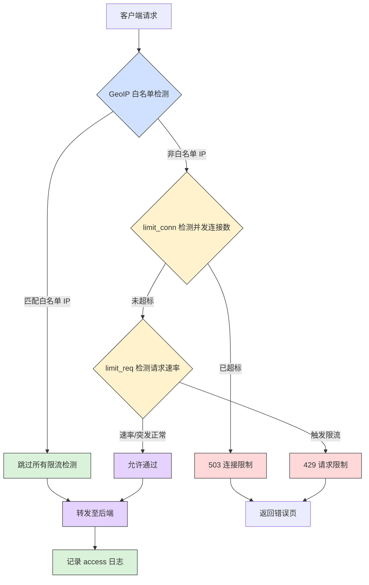

在高并发场景下，服务器的资源（CPU、内存、数据库连接）总是有限的。当面临恶意攻击、爬虫抓取或突发的流量洪峰时，如果不加以限制，服务很容易被压垮，导致雪崩效应。

*限流* 是保护系统稳定性的第一道防线。Nginx 作为高性能的反向代理，提供了两套核心限流机制：

- 限制并发连接数 (`limit_conn`)：控制同时存在的连接数量，防御连接耗尽型攻击。
- 限制请求速率 (`limit_req`)：控制每秒允许通过的请求数量，防御请求洪峰冲击。

本文将从底层原理入手，循序渐进地讲解配置技巧，并提供可直接用于生产环境的完整方案。

## 一、核心原理：深入理解漏桶算法 ##

Nginx 的 `limit_req` 模块核心基于 漏桶算法。理解它是掌握限流配置的关键。

### 什么是漏桶算法？ ###

想象一个底部有小孔的桶：

- 水（请求）：从上方流入桶中，流速是不确定的（代表突发的用户请求）。
- 桶底的小孔：以恒定的速率将水漏出（代表 Nginx 转发给后端的速率）。
- 溢出：如果进水太快，桶满了，多余的水就会直接溢出（代表拒绝请求）。

### 算法逻辑图解 ###

通过下图，您可以直观地看到请求是如何被“整形”的：

```mermaid
flowchart TD
    subgraph In ["突发流量"]
        direction TB
        R1[请求 1]
        R2[请求 2]
        R3[请求 3]
        R4[请求 N...]
    end

    subgraph Bucket ["漏桶核心"]
        B[缓冲队列&#x3C;br/>暂存多余请求]
    end

    subgraph Out ["处理逻辑"]
        P[恒定速率处理&#x3C;br/>例如: 10r/s]
    end

    R1 &#x26; R2 &#x26; R3 &#x26; R4 -->|随机速率流入| B
    
    B -->|匀速流出| P
    
    B -.->|队列满了溢出| D[拒绝请求&#x3C;br/>HTTP 429]
    
    style D fill:#ffcccc,stroke:#f00,stroke-width:2px
    style P fill:#ccffcc,stroke:#090,stroke-width:2px
```

核心意义：不管进水（请求）多急，出水（处理）永远是匀速的。这完美保护了后端服务免受流量冲击。

二、两大限流机制的区别

很多开发者容易混淆“连接数”和“请求数”。

|  维度   |      limit_conn (连接限制) |   limit_req (请求限制) |
| :-----------: | :-----------: | :-----------: |
|    控制对象 |   管道 (TCP连接) |   货物 (HTTP请求) |
|    技术特征 |   同一时间的连接数 |   单位时间内的请求数 (QPS) |
|    适用场景 |   防御 DDoS 攻击、限制大文件下载占用带宽 |   保护数据库、防止接口被刷、应对秒杀洪峰 |
|    HTTP/2影响 |   HTTP/2 复用连接，需谨慎设置阈值 |   不受连接复用影响，控制更精准 |

> 最佳实践：通常两者结合使用，`limit_conn` 作为粗粒度的兜底，`limit_req` 作为细粒度的管控。

## 三、实战一：限制并发连接数 (`limit_conn`) ##

`ngx_http_limit_conn_module` 用于防止单个 IP 占满服务器连接池。

### 配置语法 ###

```nginx
# 语法：limit_conn_zone key zone=name:size;
# key: 通常是 $binary_remote_addr (IP)
limit_conn_zone $binary_remote_addr zone=conn_zone:10m;

server {
    location /download/ {
        # 语法：limit_conn zone number;
        # 限制每个 IP 同时只能保持 10 个连接
        limit_conn conn_zone 10;
        
        proxy_pass http://backend;
    }
}
```

### 注意事项 ###

在 HTTP/1.1 Keep-Alive 环境下，浏览器会复用连接。如果一个公司出口 IP 是同一个（NAT），设置过低的阈值（如 1 或 2）会导致正常用户无法访问。建议设置 10-20 左右的阈值。

## 四、实战二：限制请求速率 (`limit_req`) ##

这是生产环境中最常用的限流手段，我们分三个阶段演进配置。

### 阶段 1：严格限制 (生硬拒绝) ###

```nginx
limit_req_zone $binary_remote_addr zone=req_zone:10m rate=2r/s;

server {
    location /api/ {
        limit_req zone=req_zone;
    }
}
```

效果：严格限制每秒 2 个请求。如果瞬间发 3 个请求，第 3 个直接被拒绝（503）。这太严格了，用户体验差。

### 阶段 2：引入缓冲 (有延迟) ###

```nginx
limit_req zone=req_zone burst=5;
```

效果：设置了一个容量为 5 的桶。多余的请求排队等待，按速率慢慢处理。

问题：排队意味着延迟。如果队里有 5 个请求，用户要等几秒钟，感觉像网页卡死。

### 阶段 3：生产级配置 (无延迟突发) ###

这是生产环境的标准配置，核心在于 `nodelay` 参数。

```mermaid
graph TD
    A[请求到达] --> B{速率检查}
    B -- 正常速率 --> C[通过处理]
    B -- 超过速率 --> D{配置模式?}
    
    D -- 基础模式<br>无 burst --> E[拒绝]
    
    D -- 缓冲模式<br>burst=N --> F{队列已满?}
    F -- 是 --> E
    F -- 否 --> G[进入队列等待]
    G --> H[延迟处理]
    H --> C
    
    D -- 生产模式<br>burst=N nodelay --> I{队列已满?}
    I -- 是 --> E
    I -- 否 --> J[进入队列等待]
    J --> K[立即处理]
    K --> C

    %% 可选旁路
    A -- 跳过速率检查 --> C

    %% 注明来源
    linkStyle 11 stroke:#999,stroke-width:1px,stroke-dasharray: 5 5;
    subgraph 来源说明
        Z[掘金技术社区@陈暖秋]
    end
```

配置代码：

```nginx
limit_req zone=req_zone burst=5 nodelay;
```

核心解读：

- `burst=5`：允许瞬间突发 5 个请求。
- `nodelay`：突发的那 5 个请求不需要排队等待，立即转发给后端。
- 代价：虽然请求被立即处理了，但“桶”里的令牌被消耗了，后续请求需要等待令牌恢复。这实现了“允许瞬间并发，但限制总体频率”。

## 五、终极方案：生产级综合配置 ##

下面是一个包含白名单、连接限制、请求限制和友好错误提示的完整配置。

### 完整架构流程图 ###



完整 Nginx 配置代码
请将以下配置保存为 `nginx.conf` 或放入 `conf.d` 目录：

```nginx
# ==========================================
# 1. 预处理定义 (http 块)
# ==========================================

# 1.1 定义白名单变量
# 逻辑：默认赋值 IP (进行限流)；白名单 IP 赋值为空 (跳过限流)
# 注意：geo 块内只能有一个 default 指令
geo $limit_key {
    # 默认情况：非白名单 IP，Key 设为 $binary_remote_addr
    default $binary_remote_addr;
    
    # 白名单 IP：Key 设为空字符串 ""
    # 当 limit_conn/limit_req 检测到空 Key 时，会自动跳过限流逻辑
    127.0.0.1 "";         # 本地回环地址
    192.168.1.0/24 "";    # 内网办公网段
    # 10.0.0.100 "";      # 运维监控服务器
}

# 1.2 定义连接数限制区域
# 10m 空间约存储 16 万个 IP 的连接状态
limit_conn_zone $limit_key zone=conn_zone:10m;

# 1.3 定义请求速率限制区域
# rate=10r/s：平均每秒允许 10 个请求
limit_req_zone $limit_key zone=req_zone:10m rate=10r/s;


# ==========================================
# 2. Server 配置
# ==========================================
server {
    listen 80;
    server_name api.example.com;

    # 全局限流状态码设置
    limit_req_log_level warn;      # 限流日志级别
    limit_req_status 429;          # 请求限流返回 429 (Too Many Requests)
    limit_conn_status 503;         # 连接限流返回 503 (Service Unavailable)

    location /api/ {
        # --------------------------------
        # 2.1 应用连接数限制 (粗粒度)
        # --------------------------------
        # 限制单个 IP 并发连接数不超过 20
        # 场景：防止攻击者建立大量连接耗尽 Nginx 资源
        limit_conn conn_zone 20;

        # --------------------------------
        # 2.2 应用请求速率限制 (细粒度)
        # --------------------------------
        # burst=20：允许瞬间突发 20 个请求排队
        # nodelay：排队的请求立即处理，不产生延迟感
        # 综合效果：瞬间最大允许处理 30 个请求(10rate + 20burst)，超出返回 429
        limit_req zone=req_zone burst=20 nodelay;

        # --------------------------------
        # 2.3 友好错误处理
        # --------------------------------
        # 捕获 429 和 503 错误，返回友好的 JSON 提示
        error_page 429 503 = @too_many_requests;
        
        proxy_pass http://backend_servers;
    }

    location @too_many_requests {
        default_type application/json;
        return 429 '{"code": 429, "message": "访问过于频繁，请稍后再试"}';
    }
}
```

### 配置深度解析 ###

- 白名单机制 (geo 模块)：

  - 通过 `geo` 指令，我们将白名单 IP 的 `$limit_key` 设为空字符串。
  - Nginx 的 `limit_conn` 和 `limit_req` 模块有一个特性：当 Key 为空时，不进行计数，从而实现了优雅的豁免。

- 双重限制的协同：

  - 第一道防线 (`limit_conn`)：限制并发连接数。防止恶意用户发起海量 TCP 连接耗尽服务器资源。
  - 第二道防线 (`limit_req`)：限制请求速率。防止短时间内大量 HTTP 请求打挂后端数据库。

- 参数调优建议：

  - rate：建议通过压测确定后端服务的最大承载 QPS，然后除以 Nginx 节点数量。
  - burst：建议根据业务容忍度设置。如果是普通 API，10-20 即可应对误操作；如果是秒杀场景，可适当调大。

## 六、总结 ##

Nginx 限流是保障服务高可用的利器。记住以下口诀：

- 原理要懂：漏桶算法，匀速处理，多了溢出。
- 区别要清：limit_conn 管连接，limit_req 管请求。
- 配置要准：burst + nodelay 是生产标配，既防冲击又无延迟。
- 白名单要有：geo 模块设空值，内网监控不被误杀。

通过这套组合拳，可以构建起一道坚固的流量防线，让服务在面对高并发流量时更加从容稳定。
