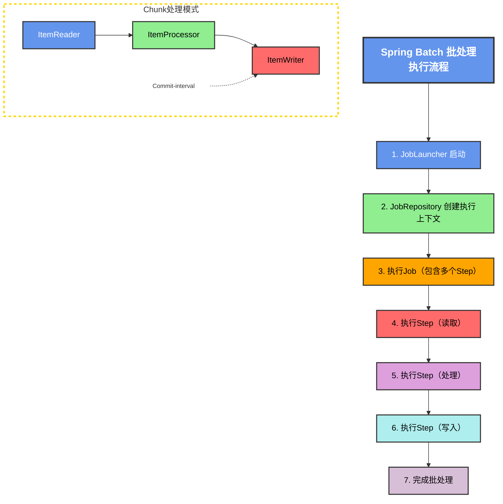
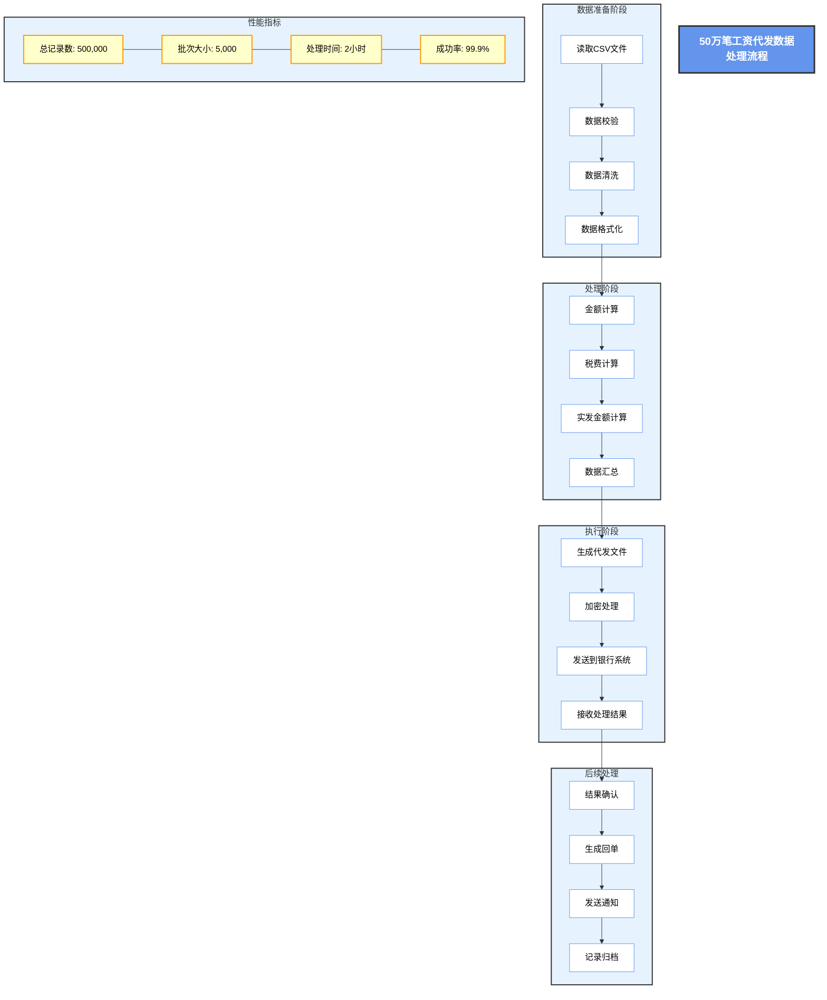
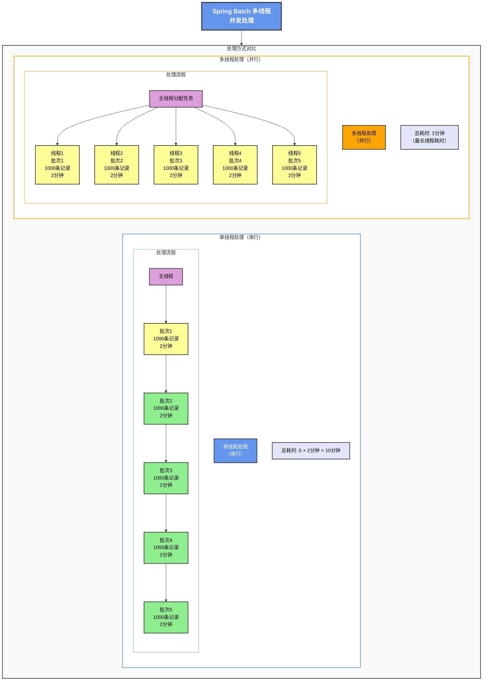

## 前言 ##

在企业级应用中，批量数据处理是一个非常常见的需求。比如月底的工资代发、银行对账、数据报表生成等。当数据量达到几十万甚至上百万时，如何高效、可靠地处理这些数据，就成了一个技术挑战。

本文将以"50万笔工资代发"为实际场景，详细介绍如何使用Spring Batch框架来处理大规模批量数据，并重点讲解当处理失败时，如何实现*部分回滚机制*，确保已成功处理的数据不会因为少量失败记录而全部回滚。

## 一、什么是Spring Batch？ ##

### Spring Batch简介 ###

Spring Batch是一个轻量级的、全面的批处理框架，由Spring团队开发，旨在帮助企业开发健壮的批处理应用程序。它于2008年首次发布，经过十多年的发展，已经成为Java批处理领域的事实标准。

Spring Batch的核心设计理念包括：

- Chunk-oriented Processing（块级处理） ：将大量数据分批处理，避免内存溢出
- 事务管理：每个Chunk作为一个独立的事务，支持部分回滚
- 容错机制：支持跳过（Skip）、重试（Retry）等容错策略
- 作业调度：支持定时任务、手动触发等多种调度方式
- 监控与统计：提供完整的执行记录和统计信息

### 核心概念详解 ###

#### Job（作业） ####

Job是批处理的核心概念，代表一个完整的批处理任务。一个Job可以包含多个Step，按顺序或并行执行。

```java
@Bean
public Job salaryPaymentJob() {
    return jobBuilderFactory.get("salaryPaymentJob")
        .start(step1())
        .next(step2())
        .build();
}
```

#### Step（步骤） ####

Step是Job的基本执行单元，每个Step包含：

- ItemReader：读取数据
- ItemProcessor：处理数据（可选）
- ItemWriter：写入数据

```java
@Bean
public Step salaryPaymentStep() {
    return stepBuilderFactory.get("salaryPaymentStep")
        .<SalaryPayment, SalaryPayment>chunk(1000)
        .reader(reader())
        .processor(processor())
        .writer(writer())
        .build();
}
```

#### Chunk（数据块） ####

Chunk是Spring Batch处理数据的基本单位。每次从Reader读取指定数量的记录，处理后一起提交到数据库：

```txt
读取1000条 → 处理1000条 → 写入1000条 → 提交事务
```

### 应用场景 ###

Spring Batch适用于以下典型场景：

| 场景 | 描述 | 示例 |
| :--- | :--- | :--- |
| 数据迁移 | 跨系统数据同步 | 从旧系统迁移数据到新系统 |
| 数据转换 | ETL过程 | 从数据库读取、转换、写入数据仓库 |
| 批量处理 | 定期批量操作 | 月底工资代发、银行对账 |
| 报表生成 | 定期生成报表 | 每日交易汇总报表 |

### 与其他框架对比 ###

| 特性 | Spring Batch | Quartz | Scheduled Executor |
| :--- | :--- | :--- | :--- |
| 批量处理 | ✅ 专用 | 需要 | 需要 |
| 事务管理 | ✅ 内置 | 无 | 无 |
| 容错机制 | ✅ 完善的Skip/Retry | 无 | 无 |
| 监控统计 | ✅ 数据库持久化 | 基础 | 无 |
| 并行处理 | ✅ 多种模式 | 无 | 基础 |

### 为什么需要部分回滚？ ##

想象一下：你需要处理50万笔工资代发，如果第49万笔记录因为银行卡号错误而失败，在没有部分回滚机制的情况下，前面489,999笔已成功处理的数据会全部回滚！这对于业务来说是不可接受的。

## 二、系统架构设计 ##

为了实现50万笔工资代发的高效处理，我们设计了如下的系统架构：

```mermaid
flowchart TD
    %% 标题
    Title[Spring Batch 系统架构]:::title
    
    %% 应用层
    subgraph AppLayer[应用层 (Application Layer)]
        direction LR
        App1[REST API]
        App2[Web界面]
        App3[Quartz调度]
        App4[CLI命令行]
    end

    %% 批处理层
    subgraph BatchLayer[批处理层 (Batch Layer)]
        direction LR
        Batch1[Job作业]
        Batch2[Step步骤]
        Batch3[Chunk数据块]
        Batch4[Partition分区]
    end

    %% 核心层
    subgraph CoreLayer[核心层 (Core Layer)]
        direction LR
        Core1[JobRepository]
        Core2[ItemReader]
        Core3[ItemProcessor]
        Core4[ItemWriter]
    end

    %% 数据层
    subgraph DataLayer[数据层 (Data Layer)]
        direction LR
        Data1[MySQL]
        Data2[Batch表]
        Data3[Redis缓存]
        Data4[日志系统]
    end
    
    %% 核心组件说明
    subgraph Explanation[核心组件说明]
        Exp1[1.Job-批处理作业容器<br/>封装整个批处理流程，包含多个Step]
        Exp2[2.Step-作业执行步骤<br/>实际执行单元，支持Chunk处理模式]
        Exp3[3.ItemReader-数据读取器<br/>从数据源读取记录，支持多种格式]
        Exp4[4.ItemProcessor-数据处理器<br/>对读取的数据进行业务处理]
        Exp5[5.ItemWriter-数据写入器<br/>将处理后的数据批量写入目标]
        Exp6[6.JobRepository-状态持久化<br/>存储Job执行状态和元数据]
        Exp7[7.JobLauncher-作业启动器<br/>启动Job执行，创建执行上下文]
    end

    %% 连接关系
    Title --> AppLayer
    AppLayer --> BatchLayer
    BatchLayer --> CoreLayer
    CoreLayer --> DataLayer
    
    %% 样式定义
    classDef title fill:#6495ed,stroke:#333,stroke-width:3px,color:#fff,font-size:20px,font-weight:bold
    classDef appLayer fill:#90ee90,stroke:#333,stroke-width:2px
    classDef batchLayer fill:#dda0dd,stroke:#333,stroke-width:2px
    classDef coreLayer fill:#ffff99,stroke:#333,stroke-width:2px
    classDef dataLayer fill:#ffb6c1,stroke:#333,stroke-width:2px
    classDef explanation fill:#e6e6fa,stroke:#333,stroke-width:2px
    
    %% 应用样式
    class Title title
    class AppLayer appLayer
    class BatchLayer batchLayer
    class CoreLayer coreLayer
    class DataLayer dataLayer
    class Explanation explanation
```


### 系统架构 ###

上图展示了Spring Batch工资代发系统的分层架构：

- Web层：提供监控面板，支持Job启动/停止、实时状态监控和统计信息查询
- Batch控制层：REST API接口，包含JobLauncher和JobRepository
- Spring Batch核心层：Job→Step→Chunk的处理流程，包含Reader、Processor、Writer三大组件
- 数据存储层：MySQL数据库、CSV文件和Job执行日志

### 核心组件说明 ###

| 组件 | 职责 | 实现类 |
| :--- | :--- | :--- |
| Job | 整个批处理任务 | SalaryPaymentJob |
| Step | 任务中的一个步骤 | SalaryPaymentStep |
| ItemReader | 数据读取器 | FlatFileItemReader（读取CSV） |
| ItemProcessor | 数据处理器 | SalaryPaymentProcessor（数据验证） |
| ItemWriter | 数据写入器 | JdbcBatchItemWriter（批量写入数据库） |

## 三、部分回滚机制原理 ##

### Chunk-Oriented Processing ###

Spring Batch采用*Chunk-Oriented Processing（块级处理）* 模式，这是实现部分回滚的核心机制：



上图展示了Batch处理的核心流程：`Reader读取数据 → Processor处理验证 → Writer批量写入`，形成完整的处理管道。

对于50万笔数据的处理，Chunk机制的工作方式如下：

```txt
50万笔数据
    │
    ├─► Chunk 1 (1-1000笔)   ──► 独立事务 ──► 成功提交
    ├─► Chunk 2 (1001-2000笔) ──► 独立事务 ──► 成功提交
    ├─► Chunk 3 (2001-3000笔) ──► 独立事务 ──► 第2500笔失败 → 重试3次 → 跳过 → 其余999笔提交
    ├─► Chunk 4 (3001-4000笔) ──► 独立事务 ──► 成功提交
    ...
    └─► Chunk 500 (499001-500000笔) ──► 独立事务 ──► 成功提交

最终结果：499,999笔成功，1笔被跳过
```

关键配置：

- chunkSize: 1000（每1000笔提交一次）
- skipLimit: 100（最多跳过100笔失败记录）
- retryLimit: 3（每笔失败重试3次）

### 事务边界与部分回滚 ###

每个Chunk是独立的事务单元，这是实现部分回滚的关键：

上图清晰地展示了事务边界和部分回滚的工作机制：

```mermaid
flowchart TD
    %% 主标题
    Title[Spring Batch 事务管理与部分回滚机制]:::title
    
    %% 场景一：正常处理流程
    subgraph Scenario1[场景一：正常处理流程]
        S1A[1.Chunk 1: 读取1000条记录]
        S1B[2.Chunk 1: 处理1000条记录]
        S1C[3.Chunk 1: 写入1000条记录]
        S1D[4.Chunk 1: 提交事务]
        S1E[5.Chunk 2: 读取1000条记录]
        S1F[6.Chunk 2: 处理1000条记录]
        S1G[7.Chunk 2: 写入1000条记录]
        S1H[所有数据成功处理并提交]
        S1I[8.Chunk 2: 提交事务]
        
        S1A --> S1B --> S1C --> S1D --> S1E --> S1F --> S1G --> S1H --> S1I
    end
    
    %% 场景二：处理失败回滚
    subgraph Scenario2[场景二：处理失败回滚]
        S2A[1.Chunk 1: 读取1000条记录]
        S2B[2.Chunk 1: 处理中第800条失败!]
        S2C[3.Spring Batch捕获异常]
        S2D[4.回滚当前Chunk的800条]
        S2E[5.记录失败日志到数据库]
        S2F[6.Job状态: FAILED]
        S2G[7.Chunk 2: 写入1000条记录]
        S2H[所有数据成功处理并提交]
        S2I[8.Chunk 2: 提交事务]
        
        S2A --> S2B --> S2C --> S2D --> S2E --> S2F --> S2G --> S2H --> S2I
    end
    
    %% 场景三：部分失败跳过(Skip)
    subgraph Scenario3[场景三：部分失败跳过(Skip)]
        S3A[1.Chunk 1: 处理1000条]
        S3B[2.遇到5条脏数据]
        S3C[3.配置skip-limit=100]
        S3D[4.跳过5条失败记录]
        S3E[5.成功提交995条]
        S3F[6.5条记录记录到skip表]
        S3Note1[失败时回滚当前Chunk，之前已提交的不会回滚]
        S3Note2[配置跳过机制，部分失败不影响整体]
        
        S3A --> S3B --> S3C --> S3D --> S3E --> S3F
        S3F -.-> S3Note1
        S3F -.-> S3Note2
    end
    
    %% 核心机制说明
    subgraph CoreMechanism[核心机制说明]
        direction LR
        
        CM1[Chunk事务边界<br/>每个Chunk是独立事务，提交前失败则回滚该Chunk<br/>commit-interval=1000]
        CM2[已提交数据<br/>Chunk一旦提交，即使后续失败也不会回滚<br/>保证数据一致性]
        CM3[Skip机制<br/>Skip机制可跳过异常记录，继续处理<br/>容错处理]
        CM4[Retry机制<br/>Retry限制可重试失败记录<br/>提高成功率]
        
        CM1 --- CM2 --- CM3 --- CM4
    end
    
    %% 布局和连接
    Title --> Scenario1
    Title --> Scenario2
    Title --> Scenario3
    
    Scenario1 --> CoreMechanism
    Scenario2 --> CoreMechanism
    Scenario3 --> CoreMechanism
    
    %% 样式定义
    classDef title fill:#6495ed,stroke:#333,stroke-width:3px,color:#fff,font-size:20px,font-weight:bold
    classDef scenario1 fill:#90ee90,stroke:#333,stroke-width:2px
    classDef scenario2 fill:#ff6b6b,stroke:#333,stroke-width:2px
    classDef scenario3 fill:#ffa500,stroke:#333,stroke-width:2px
    classDef mechanism fill:#afeeee,stroke:#333,stroke-width:2px
    
    classDef node fill:#fff,stroke:#333,stroke-width:1px,color:#000
    
    %% 应用样式
    class Title title
    class Scenario1 scenario1
    class Scenario2 scenario2
    class Scenario3 scenario3
    class CoreMechanism mechanism
    
    %% 节点样式
    class S1A,S1B,S1C,S1D,S1E,S1F,S1G,S1H,S1I node
    class S2A,S2B,S2C,S2D,S2E,S2F,S2G,S2H,S2I node
    class S3A,S3B,S3C,S3D,S3E,S3F,S3Note1,S3Note2 node
    class CM1,CM2,CM3,CM4 node
```

*事务规则*：

- Chunk内任意记录失败 → 整个Chunk回滚
- 重试成功 → 继续处理
- 重试失败且可跳过 → 跳过该记录，继续处理Chunk内剩余记录
- 跳过次数超限 → 整个Job失败

实际案例： 假设Chunk 3中有1000笔数据，第500笔验证失败：

- Spring Batch回滚整个Chunk 3
- 重新读取Chunk 3的1000笔数据
- 处理到第500笔时，捕获异常
- 重试3次后仍然失败
- 检查是否可跳过（IllegalArgumentException在跳过列表中）
- 跳过第500笔，继续处理501-1000笔
- 最终Chunk 3成功提交999笔，1笔被跳过

### 容错策略配置 ###

```java
.faultTolerant()                    // 启用容错
    .skipLimit(100)                 // 最多跳过100条
    .skip(IllegalArgumentException.class)    // 跳过数据验证异常
    .skip(NullPointerException.class)        // 跳过空指针异常
    .retryLimit(3)                  // 失败重试3次
    .retry(Exception.class)         // 重试所有异常
```

## 四、50万笔工资代发数据处理流程 ##

在理解了部分回滚机制后，我们来看完整的工资代发数据处理流程：



上图展示了从CSV文件读取到数据库写入的完整数据流，包含以下关键步骤：

- 数据读取：FlatFileItemReader读取CSV文件，每行映射为SalaryPayment对象
- 数据验证：SalaryPaymentProcessor进行数据校验
  - 员工ID非空验证
  - 金额范围验证（0.01-100万）
  - 银行卡号格式验证（16-19位数字）
  - 状态更新：设置状态为PROCESSING，生成唯一交易ID
  - 批量写入：JdbcBatchItemWriter批量写入数据库
  - 异常处理：验证失败的记录被跳过，记录到失败列表

## 五、核心代码实现 ##

### Job配置 ###

```java
@Configuration
public class SalaryPaymentJobConfig {

    @Value("${batch.chunk.size:1000}")
    private int chunkSize;  // 每次处理的记录数

    @Value("${batch.skip.limit:100}")
    private int skipLimit;  // 跳过限制

    @Value("${batch.retry.limit:3}")
    private int retryLimit; // 重试次数

    @Bean
    public Step salaryPaymentStep() {
        return stepBuilderFactory
            .get("salaryPaymentStep")
            .<SalaryPayment, SalaryPayment>chunk(chunkSize)
            .reader(salaryPaymentReader())
            .processor(salaryPaymentProcessor())
            .writer(salaryPaymentWriter())
            .faultTolerant()  // 启用容错
            .skipLimit(skipLimit)
            .skip(IllegalArgumentException.class)
            .skip(NullPointerException.class)
            .retryLimit(retryLimit)
            .retry(Exception.class)
            .listener(new SalaryItemReadListener())
            .listener(new SalaryItemWriteListener())
            .build();
    }

    @Bean
    public Job salaryPaymentJob(Step step, SalaryJobExecutionListener listener) {
        return jobBuilderFactory.get("salaryPaymentJob")
            .incrementer(new RunIdIncrementer())
            .listener(listener)
            .start(step)
            .build();
    }
}
```

### 数据读取器 ###

```java
@Bean
public FlatFileItemReader<SalaryPayment> salaryPaymentReader() {
    FlatFileItemReader<SalaryPayment> reader = new FlatFileItemReader<>();
    reader.setName("salaryPaymentReader");
    reader.setResource(new ClassPathResource("input/salary-payments.csv"));
    reader.setLinesToSkip(1);  // 跳过CSV标题行

    // 设置列映射
    DelimitedLineTokenizer tokenizer = new DelimitedLineTokenizer();
    tokenizer.setNames(new String[]{
        "employeeId", "employeeName", "accountNumber",
        "accountName", "bankName", "amount", "currency",
        "paymentDate", "remark"
    });

    // 设置字段映射
    BeanWrapperFieldSetMapper<SalaryPayment> mapper = new BeanWrapperFieldSetMapper<>();
    mapper.setTargetType(SalaryPayment.class);

    DefaultLineMapper<SalaryPayment> lineMapper = new DefaultLineMapper<>();
    lineMapper.setLineTokenizer(tokenizer);
    lineMapper.setFieldSetMapper(mapper);
    reader.setLineMapper(lineMapper);

    return reader;
}
```

### 数据处理器（验证逻辑） ###

```java
public class SalaryPaymentProcessor implements ItemProcessor<SalaryPayment, SalaryPayment> {

    private static final BigDecimal MIN_AMOUNT = new BigDecimal("0.01");
    private static final BigDecimal MAX_AMOUNT = new BigDecimal("1000000");

    @Override
    public SalaryPayment process(SalaryPayment item) throws Exception {
        // 1. 数据验证
        if (item.getEmployeeId() == null || item.getEmployeeId().trim().isEmpty()) {
            throw new IllegalArgumentException("员工ID不能为空");
        }

        // 2. 金额验证
        if (item.getAmount() == null) {
            throw new IllegalArgumentException("发放金额不能为空");
        }
        if (item.getAmount().compareTo(MIN_AMOUNT) < 0) {
            throw new IllegalArgumentException("发放金额不能小于0.01元");
        }
        if (item.getAmount().compareTo(MAX_AMOUNT) > 0) {
            throw new IllegalArgumentException("发放金额不能大于100万元");
        }

        // 3. 银行卡号验证
        if (item.getAccountNumber() == null ||
            item.getAccountNumber().length() < 16 ||
            item.getAccountNumber().length() > 19) {
            throw new IllegalArgumentException("银行账号长度必须在16-19位之间");
        }

        // 4. 设置处理状态
        item.setStatus("PROCESSING");
        item.setTransactionId("SAL" + System.currentTimeMillis() + item.getEmployeeId());

        return item;
    }
}
```

### 数据写入器 ###

```java
public class SalaryPaymentWriter implements ItemWriter<SalaryPayment> {

    private final JdbcBatchItemWriter<SalaryPayment> delegate;

    public SalaryPaymentWriter(DataSource dataSource) {
        this.delegate = new JdbcBatchItemWriter<>();
        this.delegate.setDataSource(dataSource);
        this.delegate.setSql(
            "INSERT INTO salary_payment " +
            "(employee_id, employee_name, account_number, account_name, " +
            "bank_name, amount, currency, payment_date, remark, " +
            "status, transaction_id, create_time, update_time) " +
            "VALUES (:employeeId, :employeeName, :accountNumber, :accountName, " +
            ":bankName, :amount, :currency, :paymentDate, :remark, " +
            ":status, :transactionId, :createTime, :updateTime)");
        this.delegate.setItemSqlParameterSourceProvider(
            new BeanPropertyItemSqlParameterSourceProvider<>()
        );
    }

    @Override
    public void write(List<? extends SalaryPayment> items) throws Exception {
        delegate.write(items);
    }
}
```

### 自定义SkipPolicy ###

```java
@Component
public class PartialRollbackHandler implements SkipPolicy {

    private static final int SKIP_LIMIT = 100;

    @Override
    public boolean shouldSkip(Throwable throwable, int skipCount) {
        // 超过跳过限制
        if (skipCount >= SKIP_LIMIT) {
            return false;
        }

        // 文件不存在，不能跳过
        if (throwable instanceof FileNotFoundException) {
            return false;
        }

        // 数据格式错误，可以跳过
        if (throwable instanceof FlatFileParseException) {
            return true;
        }

        // 数据验证失败，可以跳过
        if (throwable instanceof IllegalArgumentException ||
            throwable instanceof NullPointerException) {
            return true;
        }

        return false;
    }
}
```

## 六、监控与调度架构 ##

除了数据处理，Spring Batch还提供了完善的监控和调度能力：

```mermaid
flowchart TD
    %% 标题
    Title[Spring Batch监控与调度架构]:::title
    
    %% 调度层
    subgraph SchedulerLayer[调度层 (Scheduler Layer)]
        direction LR
        S1[Quartz调度器<br/>支持分布式调度, 集群高可用]:::scheduler
        S2[Spring Task调度<br/>轻量级调度, 适合简单任务]:::scheduler
        S3[Cron表达式<br/>时间规则定义, 灵活调度]:::scheduler
    end
    
    %% 执行层
    subgraph ExecutionLayer[执行层 (Execution Layer)]
        direction LR
        E1[JobLauncher<br/>作业启动器, 创建执行上下文]:::execution
        E2[JobOperator<br/>作业操作接口, 控制作业执行]:::execution
    end
    
    %% 监控层
    subgraph MonitoringLayer[监控层 (Monitoring Layer)]
        direction LR
        M1[JobRepository<br/>作业仓库, 存储执行状态与元数据]:::monitoring
        M2[JobExplorer<br/>作业探索器, 查询作业执行详情]:::monitoring
        M3[Metrics监控<br/>性能指标收集, 监控作业健康]:::monitoring
    end
    
    %% 数据层
    subgraph DataLayer[数据层 (Data Layer)]
        direction LR
        D1[MySQL 8.0<br/>存储批处理元数据, 执行历史]:::data
        D2[Redis缓存<br/>缓存作业状态, 提升查询性能]:::data
    end
    
    %% 连接关系
    Title --> SchedulerLayer
    SchedulerLayer --> ExecutionLayer
    ExecutionLayer --> MonitoringLayer
    MonitoringLayer --> DataLayer
    
    %% 样式定义
    classDef title fill:#6495ed,stroke:#333,stroke-width:3px,color:#fff,font-size:20px,font-weight:bold
    classDef scheduler fill:#6495ed,stroke:#333,stroke-width:2px,color:#fff
    classDef execution fill:#90ee90,stroke:#333,stroke-width:2px,color:#000
    classDef monitoring fill:#ffa500,stroke:#333,stroke-width:2px,color:#000
    classDef data fill:#dda0dd,stroke:#333,stroke-width:2px,color:#000
    
    %% 子图样式
    class SchedulerLayer,ExecutionLayer,MonitoringLayer,DataLayer fill:#fff,stroke:#333,stroke-width:2px
```

上图展示了完整的监控与调度架构：

- 调度层：支持三种调度方式

  - Quartz调度器：支持分布式调度，适合集群环境
  - Spring Task调度：简单的定时任务，轻量级选择
  - Cron表达式：灵活的时间配置

- 执行层：核心执行组件

  - JobLauncher：启动作业，创建执行上下文
  - JobOperator：操作作业，支持停止/重启/重试
  - StepExecution：步骤执行，采用Chunk处理模式
  - ThreadPoolExecutor：线程池，实现并发处理

- 监控层：监控与统计

  - JobRepository：存储元数据（`BATCH_JOB_INSTANCE`、`BATCH_JOB_EXECUTION`、`BATCH_STEP_EXECUTION`）
  - JobExplorer：查询作业状态、获取执行历史
  - Metrics：处理记录数、执行时间、失败率统计

- 数据层：数据存储

- MySQL 8.0：存储元数据表、业务数据表、日志记录
- Redis缓存：执行状态缓存、计数器、分布式锁

## 七、数据库设计 ##

### 工资代发表 ###

```sql
CREATE TABLE salary_payment (
    id BIGINT AUTO_INCREMENT PRIMARY KEY,
    employee_id VARCHAR(50) NOT NULL COMMENT '员工ID',
    employee_name VARCHAR(100) NOT NULL COMMENT '员工姓名',
    account_number VARCHAR(50) NOT NULL COMMENT '银行账号',
    account_name VARCHAR(100) NOT NULL COMMENT '账户名称',
    bank_name VARCHAR(100) NOT NULL COMMENT '开户行',
    amount DECIMAL(18,2) NOT NULL COMMENT '发放金额',
    currency VARCHAR(10) NOT NULL DEFAULT 'CNY' COMMENT '币种',
    payment_date DATETIME NOT NULL COMMENT '发放日期',
    remark VARCHAR(500) COMMENT '备注',
    status VARCHAR(20) NOT NULL DEFAULT 'PENDING' COMMENT '状态',
    transaction_id VARCHAR(100) COMMENT '交易ID',
    error_message VARCHAR(1000) COMMENT '错误信息',
    create_time DATETIME NOT NULL DEFAULT CURRENT_TIMESTAMP,
    update_time DATETIME NOT NULL DEFAULT CURRENT_TIMESTAMP ON UPDATE CURRENT_TIMESTAMP,
    INDEX idx_employee_id (employee_id),
    INDEX idx_status (status)
) ENGINE=InnoDB DEFAULT CHARSET=utf8mb4;
```

### Spring Batch元表 ###

Spring Batch框架会自动创建以下元表来存储Job执行信息：

- batch_job_instance - Job实例表
- batch_job_execution - Job执行表
- batch_job_execution_params - Job参数表
- batch_step_execution - Step执行表
- batch_step_execution_context - Step上下文表

## 八、REST API设计 ##

```java
@RestController
@RequestMapping("/api/batch")
public class BatchJobController {

    // 启动Job
    @PostMapping("/start")
    public ResponseEntity<Map<String, Object>> startJob(
        @RequestParam String inputFile
    ) {
        JobParameters params = new JobParametersBuilder()
            .addLong("startTime", System.currentTimeMillis())
            .addString("inputFile", inputFile)
            .toJobParameters();
        JobExecution execution = jobLauncher.run(salaryPaymentJob, params);
        return ResponseEntity.ok(result);
    }

    // 获取Job状态
    @GetMapping("/status/{jobExecutionId}")
    public ResponseEntity<Map<String, Object>> getJobStatus(
        @PathVariable Long jobExecutionId
    ) {
        JobExecution execution = jobRepository.getJobExecution(jobExecutionId);
        // 返回执行详情
    }

    // 停止Job
    @PostMapping("/stop/{jobExecutionId}")
    public ResponseEntity<Map<String, Object>> stopJob(
        @PathVariable Long jobExecutionId
    ) {
        JobExecution execution = jobRepository.getJobExecution(jobExecutionId);
        execution.stop();
        return ResponseEntity.ok(result);
    }

    // 获取统计信息
    @GetMapping("/statistics")
    public ResponseEntity<Map<String, Object>> getStatistics() {
        // 返回总数、成功数、失败数等统计
    }

    // 健康检查
    @GetMapping("/health")
    public ResponseEntity<Map<String, Object>> health() {
        // 返回系统健康状态
    }
}
```

## 九、性能优化与并行处理 ##

当数据量达到50万甚至更多时，单线程处理可能成为瓶颈。Spring Batch提供了多种并行处理方式。

### 多线程并发处理 ###

Spring Batch支持多线程并发处理，大幅提升处理效率：



上图展示了多线程并发处理的工作原理：

- 核心机制：

  - 主线程：创建线程池，分配任务
  - 工作线程：并发执行多个Step或Chunk
  - 线程安全：JobRepository保证线程安全的状态管理
- 负载均衡：任务均匀分配到各个线程

- 配置示例：

```java
@Bean
public TaskExecutor taskExecutor() {
    ThreadPoolTaskExecutor executor = new ThreadPoolTaskExecutor();
    executor.setCorePoolSize(5);
    executor.setMaxPoolSize(10);
    executor.setQueueCapacity(100);
    executor.setThreadNamePrefix("salary-batch-");
    executor.initialize();
    return executor;
}

// 在Step中使用
.step(stepName)
.chunk(chunkSize)
.taskExecutor(taskExecutor())
.throttleLimit(10)  // 限制并发数
.build();
```

### 分区处理（Partitioning） ###

对于超大数据集，可以使用分区处理实现更高程度的并行：

```mermaid

```

上图展示了分区处理的架构：

- 核心组件：

  - Master Step：负责创建和管理分区
  - Slave Step：每个分区独立执行
  - Partitioner：将数据分成多个分区
  - TaskExecutor：线程池执行分区任务

- 配置示例：

```java
@Bean
public Step masterStep() {
    return stepBuilderFactory.get("masterStep")
        .partitioner(slaveStep().getName(), rangePartitioner(1, 10))
        .step(slaveStep())
        .gridSize(10)  // 分成10个分区
        .taskExecutor(taskExecutor())
        .build();
}

@Bean
public Partitioner rangePartitioner(int min, int max) {
    return new Partitioner() {
        @Override
        public Map<String, ExecutionContext> partition(int gridSize) {
            Map<String, ExecutionContext> result = new HashMap<>();
            int range = (max - min) / gridSize;
            for (int i = 0; i < gridSize; i++) {
                ExecutionContext context = new ExecutionContext();
                context.putInt("minValue", min + i * range);
                context.putInt("maxValue", min + (i + 1) * range - 1);
                result.put("partition" + i, context);
            }
            return result;
        }
    };
}
```

### 调优参数 ###

| 参数 | 推荐值 | 说明 |
| :--- | :--- | :--- |
|  chunkSize | 1000-5000 | 根据记录大小调整，越大吞吐量越高但内存占用也越大 |
|  skipLimit | 100-500 | 根据数据质量设置 |
|  retryLimit | 3-5 | 过多会浪费时间，过少可能误判暂时性故障 |
|  线程池大小 | CPU核心数*2 | 用于多线程处理 |

### 批量写入优化 ###

使用JDBC批量操作代替单条插入：

```java
// 单条插入（慢）
for (SalaryPayment p : payments) {
    jdbcTemplate.update(sql, p.getId(), p.getName(), ...);
}

// 批量插入（快）
jdbcTemplate.batchUpdate(sql, new BatchPreparedStatementSetter() {
    @Override
    public void setValues(PreparedStatement ps, int i) throws SQLException {
        // 设置参数
    }
    @Override
    public int getBatchSize() {
        return payments.size();
    }
});
```

### 索引优化 ###

```sql
-- 为常用查询字段添加索引
CREATE INDEX idx_employee_id ON salary_payment(employee_id);
CREATE INDEX idx_status ON salary_payment(status);
CREATE INDEX idx_create_time ON salary_payment(create_time);

-- 复合索引
CREATE INDEX idx_status_employee ON salary_payment(status, employee_id);
```

## 十、实际应用场景 ##

### 场景1：月底工资代发 ###

某公司月底需要为50,000名员工发放工资，使用Spring Batch：

- 设置`chunkSize=1000`，分成50个`Chunk`处理
- 假设第23个`Chunk`中第23,456号员工银行卡号错误
- 系统重试3次后跳过该记录
- 最终结果：49,999笔成功，1笔记录到失败列表供后续处理

### 场景2：银行对账文件处理 ###

银行提供100万笔交易对账文件：

- 设置`chunkSize=5000`，提高处理效率
- 使用多线程并发处理（Partitioning）
- 完成后生成对账差异报告

### 场景3：数据报表生成 ###

每天凌晨生成T+1交易报表：

- 使用Spring Task定时调度
- 读取当日交易数据
- 生成Excel报表并发送邮件

## 十一、常见问题与解决方案 ##

### Q1: Job执行一半挂了怎么办？ ###

Spring Batch支持Job重启。通过JobRepository记录的执行状态，可以从上次失败的位置继续执行：

```java
.job(salaryPaymentJob)
    .allowStartIfComplete(false)  // 已完成的Job不重新执行
    .restartable(true)  // 允许重启
```

### Q2: 如何实现并行处理？ ###

使用`Partitioning`方式实现多线程并行处理：

```java
@Bean
public Step masterStep() {
    return stepBuilderFactory.get("masterStep")
        .partitioner(slaveStep().getName(), partitioner())
        .step(slaveStep())
        .gridSize(10)  // 分成10个分区并行处理
        .taskExecutor(taskExecutor())
        .build();
}
```

### Q3: 处理失败的数据如何重试？ ###

可以通过以下方式重试：

- 查询`status='FAILED'`的记录
- 修正错误数据
- 将`status`改回`'PENDING'`
- 重新执行Job

## 十二、总结 ##

Spring Batch 作为成熟的批处理框架，提供了完整的解决方案来处理大规模批量数据。

*适用场景*：

- 银行对账、清算
- 工资代发、批量转账
- 报表生成、数据导出

*注意事项*：

- 合理设置`chunkSize`，平衡内存和性能
- 配置合适的`Skip`和`Retry`策略
- 做好失败记录的重处理机制
- 定期清理`Job`执行历史数据
