## 一、为什么需要批处理？ ##

### 应用场景解析 ###

#### 场景1：银行每日利息计算 ####

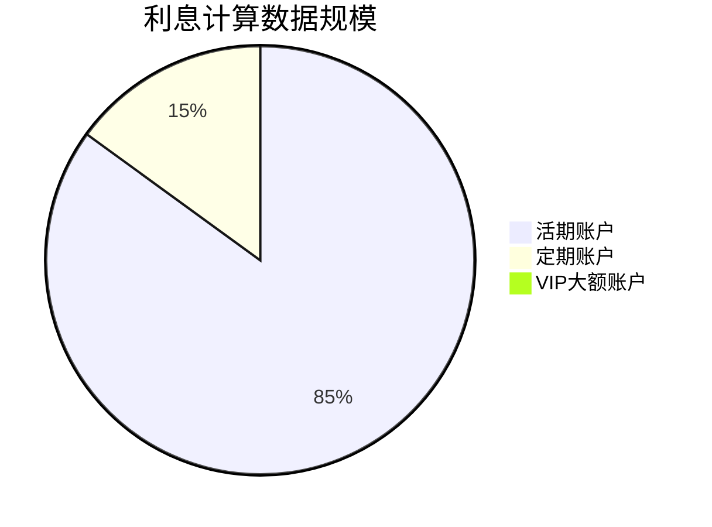

- 痛点：凌晨时段需扫描百万级账户数据，手工计算容易遗漏
- Spring Batch方案：分片读取账户数据，批量计算利息，失败自动重试
- 实际案例：某银行系统改造后，利息计算时间从4小时缩短至23分钟

#### 场景2：电商订单归档 ####

```java
// 传统SQL示例（存在性能问题）
DELETE FROM active_orders 
WHERE create_time < '2023-01-01'
LIMIT 5000; // 需循环执行直到无数据
```

- 问题：直接删除百万级数据会导致数据库锁表
- 正确做法：使用Spring Batch分页读取→写入历史表→批量删除

#### 场景3：日志分析 ####

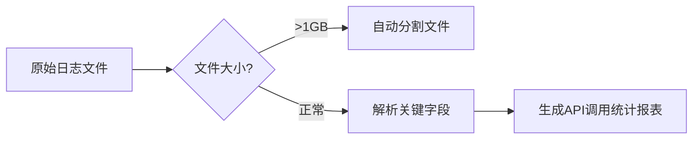

- 典型需求：分析Nginx日志中的API响应时间分布
- 特殊挑战：处理GB级文本文件时的内存控制

#### 场景4：医疗数据迁移 ####

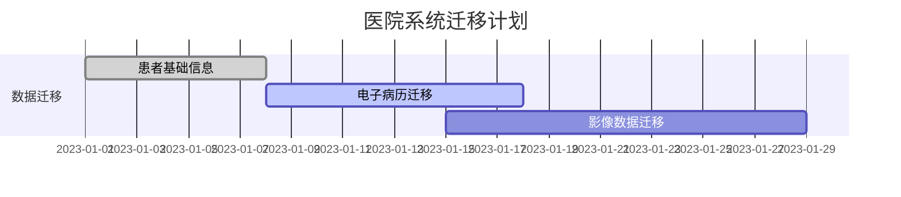

- 特殊要求：迁移过程中老系统仍需正常使用
- 解决方案：使用Spring Batch的增量迁移模式

### 传统方式痛点 ###

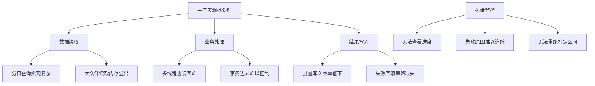

详细解释每个痛点：

#### 资源管理复杂 ####

```java
// 典型的多线程错误示例
ExecutorService executor = Executors.newFixedThreadPool(8);
try {
    while(hasNextPage()) {
        List<Data> page = fetchNextPage();
        executor.submit(() -> processPage(page)); // 可能引发内存泄漏
    }
} finally {
    executor.shutdown(); // 忘记调用会导致线程堆积
}
```

- 常见问题：线程池配置不当导致OOM、数据库连接泄露

#### 容错性黑洞 ####

```java
// 伪代码：脆弱的错误处理
for (int i=0; i<3; i++) {
    try {
        processBatch();
        break;
    } catch (Exception e) {
        if (i == 2) sendAlert(); // 简单重试无法处理部分成功场景
    }
}
```

- 真实案例：某支付系统因未处理部分失败，导致重复出款

#### 维护噩梦 ####

```ini
# 典型硬编码配置
batch.size=1000
input.path=/data/in
output.path=/data/out
```

- 问题根源：参数修改需要重新部署、不同环境配置混杂

#### 监控盲区 ####

```bash
# 开发人员常用的临时方案
nohup java -jar batch.jar > log.txt 2>&1 &
tail -f log.txt # 无法获知实时进度
```

- 关键缺陷：无法回答"处理到哪了？"、"还剩多少？"等业务问题

### Spring Batch对比优势表 ###

|  功能点   | 传统方式  |   Spring Batch 方案  |
| :-----------: | :-----------: | :-----------: |
|  任务重启  |   需从零开始  |   支持断点续处理  |
|  事务管理  |   手动控制commit/rollback  |   自动分块事务  |
|  错误处理  |   try-catch嵌套地狱  |   Skip/Retry策略声明式配置  |
|  监控  |   查看日志文件  |   数据库存储执行元数据  |
|  扩展性  |   修改代码才能增加处理步骤  |   通过Step组合灵活编排  |

## 二、Spring Batch核心架构 ##

### 四大金刚组件深度解析 ###

#### 组件1：Job（作业工厂） ####

```mermaid
classDiagram
    class Job {
        +String name
        +List&#x3C;Step> steps
        +JobParametersValidator validator
        +start(Step)
        +next(Step)
        +decision(JobExecutionDecider)
    }
```

- 核心作用：定义完整的批处理流水线（如月度报表生成流程）
- 真实案例：某银行的日终对账Job包含三个Step

```java
@Bean
public Job reconciliationJob() {
    return jobBuilderFactory.get("dailyReconciliation")
            .start(downloadBankFileStep())
            .next(validateDataStep())
            .next(generateReportStep())
            .build();
}
```

#### 组件2：Step（装配流水线） ####

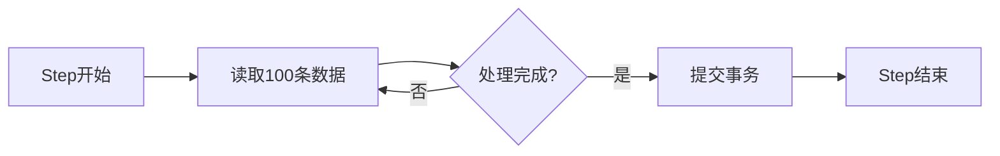

- 设计模式：采用分块（Chunk）处理机制
- 配置示例：

```java
@Bean
public Step importStep() {
    return stepBuilderFactory.get("csvImport")
            .<User, User>chunk(500)  // 每500条提交一次
            .reader(csvReader())
            .processor(validationProcessor())
            .writer(dbWriter())
            .faultTolerant()
            .skipLimit(10)
            .skip(DataIntegrityViolationException.class)
            .build();
}
```

#### 组件3：ItemReader（数据搬运工） ####

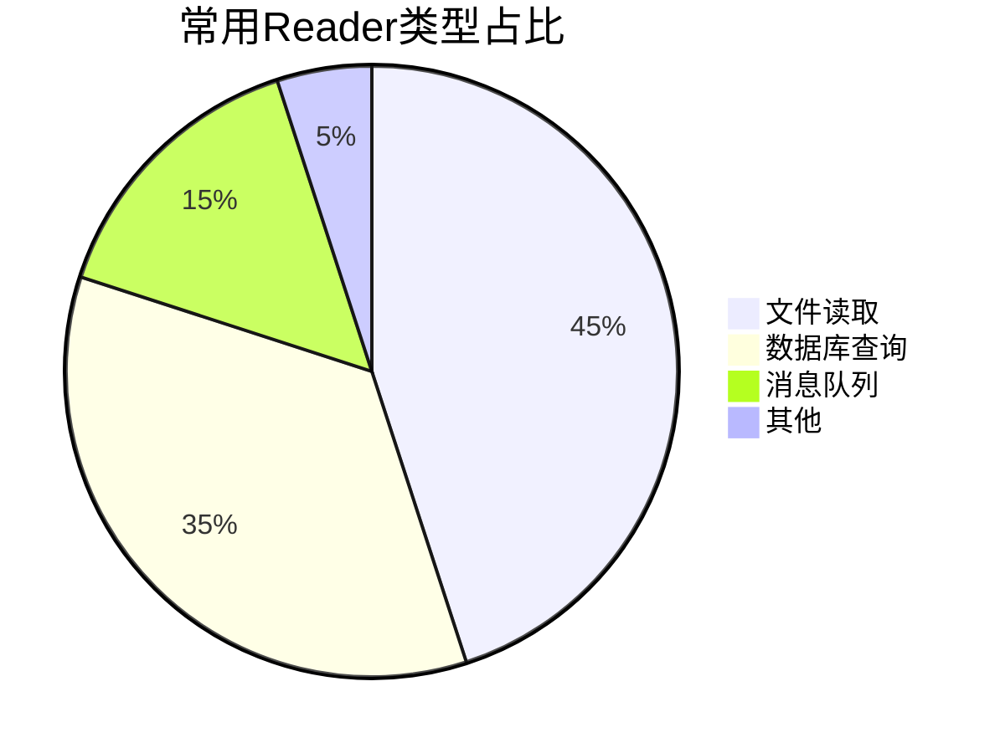

典型实现：

```java
// 读取CSV文件示例
@Bean
public FlatFileItemReader<User> csvReader() {
    return new FlatFileItemReaderBuilder<User>()
            .name("userReader")
            .resource(new FileSystemResource("data/users.csv"))
            .delimited().delimiter(",")
            .names("id", "name", "email")
            .fieldSetMapper(new BeanWrapperFieldSetMapper<User>() {{
                setTargetType(User.class);
            }})
            .linesToSkip(1) // 跳过标题行
            .build();
}
```

#### 组件4：ItemWriter（数据收纳师） ####

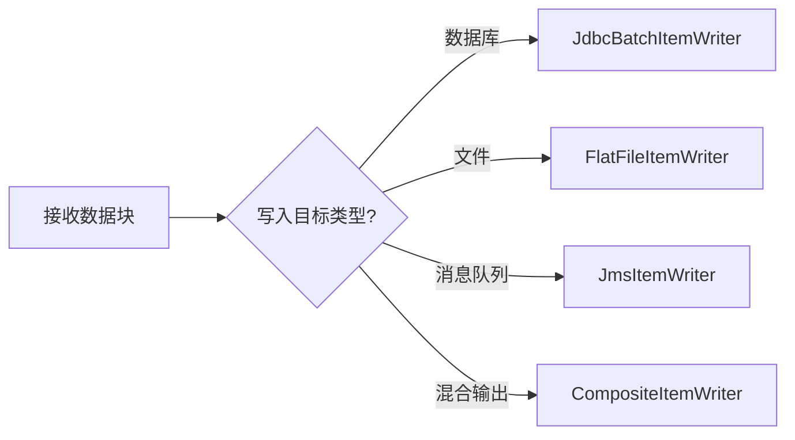

复合写入示例：

```java
@Bean
public CompositeItemWriter<User> compositeWriter() {
    return new CompositeItemWriterBuilder<User>()
            .delegates(dbWriter(), logWriter(), mqWriter())
            .build();
}

// 数据库写入组件
private JdbcBatchItemWriter<User> dbWriter() {
    return new JdbcBatchItemWriterBuilder<User>()
            .dataSource(dataSource)
            .sql("INSERT INTO users (name,email) VALUES (:name,:email)")
            .beanMapped()
            .build();
}
```

### 架构示意图 ###

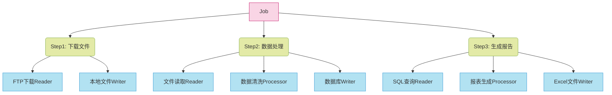

### 隐藏BOSS：ItemProcessor（数据变形金刚） ###

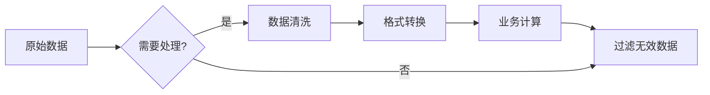

- 典型应用：数据脱敏处理

```java
public class DataMaskProcessor implements ItemProcessor<User, User> {
    @Override
    public User process(User user) {
        // 手机号脱敏
        String phone = user.getPhone();
        user.setPhone(phone.replaceAll("(\\d{3})\\d{4}(\\d{4})", "$1****$2"));
        
        // 邮箱转小写
        user.setEmail(user.getEmail().toLowerCase());
        
        return user;
    }
}
```

### 组件生命周期探秘 ###

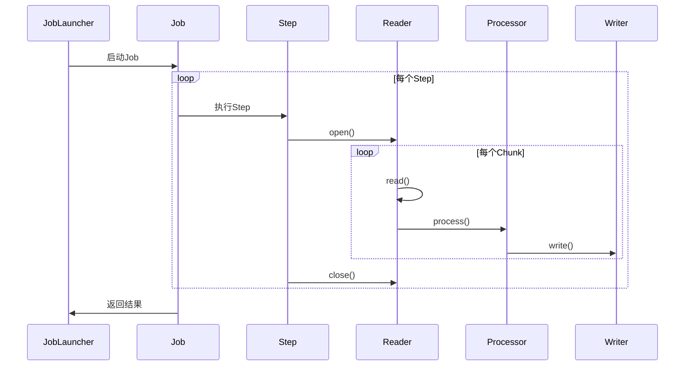

## 三、手把手开发指南 ##

### 环境搭建 ###

```xml
<!-- 完整POM配置 -->
<parent>
    <groupId>org.springframework.boot</groupId>
    <artifactId>spring-boot-starter-parent</artifactId>
    <version>3.1.5</version>
</parent>

<dependencies>
    <!-- Batch核心依赖 -->
    <dependency>
        <groupId>org.springframework.boot</groupId>
        <artifactId>spring-boot-starter-batch</artifactId>
    </dependency>
    
    <!-- 内存数据库（生产环境可更换为MySQL等） -->
    <dependency>
        <groupId>com.h2database</groupId>
        <artifactId>h2</artifactId>
        <scope>runtime</scope>
    </dependency>
    
    <!-- Lombok简化代码 -->
    <dependency>
        <groupId>org.projectlombok</groupId>
        <artifactId>lombok</artifactId>
        <optional>true</optional>
    </dependency>
</dependencies>
```

```ini
# application.properties
spring.batch.jdbc.initialize-schema=always # 自动创建Batch元数据表
spring.datasource.url=jdbc:h2:mem:testdb
spring.datasource.driverClassName=org.h2.Driver
```

### 第一个批处理任务 ###

领域模型类：

```java
@Data // Lombok注解
@NoArgsConstructor
@AllArgsConstructor
public class User {
    private String name;
    private int age;
    private String email;
}
```

完整Job配置：

```java
@Configuration
@EnableBatchProcessing
public class BatchConfig {

    @Autowired private JobBuilderFactory jobBuilderFactory;
    @Autowired private StepBuilderFactory stepBuilderFactory;

    // 定义Job
    @Bean
    public Job importUserJob() {
        return jobBuilderFactory.get("importUserJob")
                .start(csvProcessingStep())
                .build();
    }

    // 定义Step
    @Bean
    public Step csvProcessingStep() {
        return stepBuilderFactory.get("csvProcessing")
                .<User, User>chunk(100) // 每处理100条提交一次
                .reader(userReader())
                .processor(userProcessor())
                .writer(userWriter())
                .build();
    }

    // CSV文件读取器
    @Bean
    public FlatFileItemReader<User> userReader() {
        return new FlatFileItemReaderBuilder<User>()
                .name("userReader")
                .resource(new ClassPathResource("users.csv")) // 文件路径
                .delimited()
                .delimiter(",")
                .names("name", "age", "email") // 字段映射
                .targetType(User.class)
                .linesToSkip(1) // 跳过标题行
                .build();
    }

    // 数据处理（示例：年龄校验）
    @Bean
    public ItemProcessor<User, User> userProcessor() {
        return user -> {
            if (user.getAge() < 0) {
                throw new IllegalArgumentException("年龄不能为负数: " + user);
            }
            return user.toBuilder() // 使用Builder模式创建新对象
                    .email(user.getEmail().toLowerCase())
                    .build();
        };
    }

    // 数据库写入器
    @Bean
    public JdbcBatchItemWriter<User> userWriter(DataSource dataSource) {
        return new JdbcBatchItemWriterBuilder<User>()
                .dataSource(dataSource)
                .sql("INSERT INTO users (name, age, email) VALUES (:name, :age, :email)")
                .beanMapped()
                .build();
    }
}
```

CSV文件示例（src/main/resources/users.csv）：

```csv
name,age,email
张三,25,zhangsan@example.com
李四,30,lisi@example.com
王五,-5,wangwu@example.com
```

启动类：

```java
@SpringBootApplication
public class BatchApplication implements CommandLineRunner {

    @Autowired
    private JobLauncher jobLauncher;

    @Autowired
    private Job importUserJob;

    public static void main(String[] args) {
        SpringApplication.run(BatchApplication.class, args);
    }

    @Override
    public void run(String... args) throws Exception {
        JobParameters params = new JobParametersBuilder()
                .addLong("startAt", System.currentTimeMillis())
                .toJobParameters();
        jobLauncher.run(importUserJob, params);
    }
}
```

### 执行流程可视化 ###

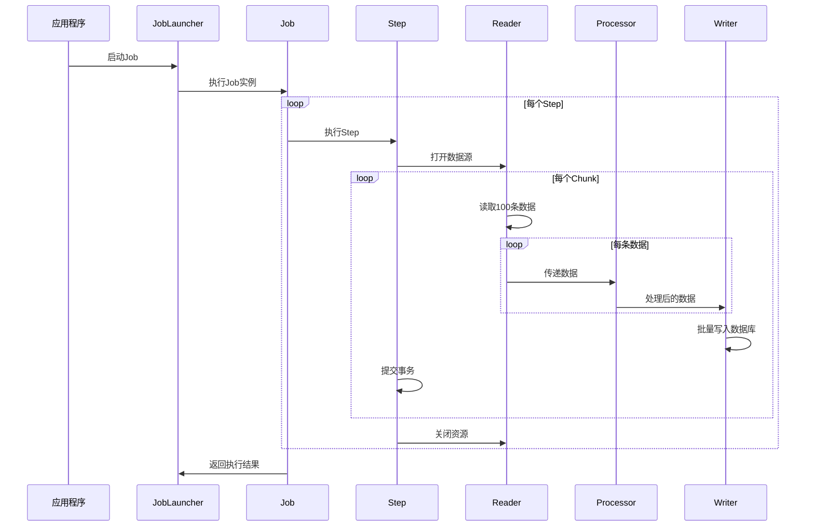

### 运行效果验证 ###

控制台输出：

```txt
2023-10-01 10:00:00 INFO  o.s.b.c.l.support.SimpleJobLauncher - Job: [SimpleJob: [name=importUserJob]] launched
2023-10-01 10:00:05 INFO  o.s.batch.core.job.SimpleStepHandler - Executing step: [csvProcessing]
2023-10-01 10:00:15 ERROR o.s.batch.core.step.AbstractStep - Encountered an error executing step csvProcessing
org.springframework.batch.item.validator.ValidationException: 年龄不能为负数: User(name=王五, age=-5, email=wangwu@example.com)
```

数据库结果：

```sql
SELECT * FROM users;
```

### 调试技巧 ###

查看元数据：

```sql
SELECT * FROM BATCH_JOB_INSTANCE;
SELECT * FROM BATCH_STEP_EXECUTION;
```

重试失败任务：

```java
// 在Job配置中添加容错机制
@Bean
public Step csvProcessingStep() {
    return stepBuilderFactory.get("csvProcessing")
            .<User, User>chunk(100)
            .reader(userReader())
            .processor(userProcessor())
            .writer(userWriter())
            .faultTolerant()
            .skipLimit(3) // 最多跳过3条错误
            .skip(IllegalArgumentException.class)
            .build();
}
```

日志监控配置：

```ini
logging.level.org.springframework.batch=DEBUG
logging.level.org.hibernate.SQL=WARN
```

## 四、实战案例：银行交易对账 ##

### 场景需求增强说明 ###

核心流程：

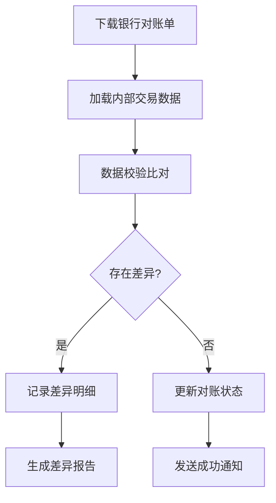

技术挑战：

- 双数据源读取（文件+数据库）
- 千万级数据高效比对
- 差异记录快速入库
- 分布式环境运行

### 完整架构设计 ###

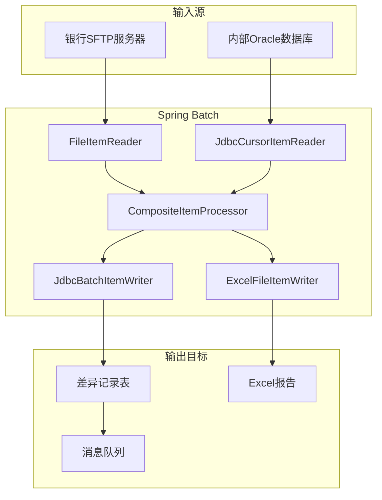

### 领域模型定义 ###

```java
@Data
@AllArgsConstructor
@NoArgsConstructor
public class Transaction {
    // 公共字段
    private String transactionId;
    private LocalDateTime tradeTime;
    private BigDecimal amount;
    
    // 银行端数据
    private String bankSerialNo;
    private BigDecimal bankAmount;
    
    // 内部系统数据
    private String internalOrderNo;
    private BigDecimal systemAmount;
    
    // 对账结果
    private ReconStatus status;
    private String discrepancyType;
}

public enum ReconStatus {
    MATCHED,       // 数据一致
    AMOUNT_DIFF,   // 金额不一致
    STATUS_DIFF,    // 状态不一致
    ONLY_IN_BANK,   // 银行单边账
    ONLY_IN_SYSTEM  // 系统单边账
}
```

### 完整Job配置 ###

```java
@Configuration
@EnableBatchProcessing
public class BankReconJobConfig {

    // 主Job定义
    @Bean
    public Job bankReconciliationJob(Step downloadStep, Step reconStep, Step reportStep) {
        return jobBuilderFactory.get("bankReconciliationJob")
                .start(downloadStep)
                .next(reconStep)
                .next(reportStep)
                .build();
    }

    // 文件下载Step
    @Bean
    public Step downloadStep() {
        return stepBuilderFactory.get("downloadStep")
                .tasklet((contribution, chunkContext) -> {
                    // 实现SFTP下载逻辑
                    sftpService.download("/bank/recon/20231001.csv");
                    return RepeatStatus.FINISHED;
                })
                .build();
    }

    // 核心对账Step
    @Bean
    public Step reconStep() {
        return stepBuilderFactory.get("reconStep")
                .<Transaction, Transaction>chunk(1000)
                .reader(compositeReader())
                .processor(compositeProcessor())
                .writer(compositeWriter())
                .faultTolerant()
                .skipLimit(100)
                .skip(DataIntegrityViolationException.class)
                .retryLimit(3)
                .retry(DeadlockLoserDataAccessException.class)
                .build();
    }

    // 组合数据读取器
    @Bean
    public CompositeItemReader<Transaction> compositeReader() {
        return new CompositeItemReaderBuilder<Transaction>()
                .delegates(bankFileReader(), internalDbReader())
                .build();
    }

    // 银行文件读取器
    @Bean
    public FlatFileItemReader<Transaction> bankFileReader() {
        return new FlatFileItemReaderBuilder<Transaction>()
                .name("bankFileReader")
                .resource(new FileSystemResource("recon/20231001.csv"))
                .delimited()
                .names("transactionId","tradeTime","amount","bankSerialNo")
                .fieldSetMapper(fieldSet -> {
                    Transaction t = new Transaction();
                    t.setTransactionId(fieldSet.readString("transactionId"));
                    t.setBankSerialNo(fieldSet.readString("bankSerialNo"));
                    t.setBankAmount(fieldSet.readBigDecimal("amount"));
                    return t;
                })
                .build();
    }

    // 内部数据库读取器
    @Bean
    public JdbcCursorItemReader<Transaction> internalDbReader() {
        return new JdbcCursorItemReaderBuilder<Transaction>()
                .name("internalDbReader")
                .dataSource(internalDataSource)
                .sql("SELECT order_no, amount, status FROM transactions WHERE trade_date = ?")
                .rowMapper((rs, rowNum) -> {
                    Transaction t = new Transaction();
                    t.setInternalOrderNo(rs.getString("order_no"));
                    t.setSystemAmount(rs.getBigDecimal("amount"));
                    return t;
                })
                .preparedStatementSetter(ps -> ps.setString(1, "2023-10-01"))
                .build();
    }

    // 组合处理器
    @Bean
    public CompositeItemProcessor<Transaction> compositeProcessor() {
        List<ItemProcessor<?, ?>> delegates = new ArrayList<>();
        delegates.add(new DataMatchingProcessor());
        delegates.add(new DiscrepancyClassifier());
        return new CompositeItemProcessorBuilder<>()
                .delegates(delegates)
                .build();
    }

    // 组合写入器
    @Bean
    public CompositeItemWriter<Transaction> compositeWriter() {
        return new CompositeItemWriterBuilder<Transaction>()
                .delegates(
                    discrepancyDbWriter(),
                    alertMessageWriter()
                )
                .build();
    }
}
```

### 核心处理器实现 ###

```java
public class DataMatchingProcessor implements ItemProcessor<Transaction, Transaction> {

    @Override
    public Transaction process(Transaction item) {
        // 双数据源匹配逻辑
        if (item.getBankSerialNo() == null) {
            item.setStatus(ReconStatus.ONLY_IN_SYSTEM);
        } else if (item.getInternalOrderNo() == null) {
            item.setStatus(ReconStatus.ONLY_IN_BANK);
        } else {
            compareAmounts(item);
            compareStatuses(item);
        }
        return item;
    }

    private void compareAmounts(Transaction t) {
        if (t.getBankAmount().compareTo(t.getSystemAmount()) != 0) {
            t.setDiscrepancyType("AMOUNT_MISMATCH");
            t.setStatus(ReconStatus.AMOUNT_DIFF);
            BigDecimal diff = t.getBankAmount().subtract(t.getSystemAmount());
            t.setAmount(diff.abs());
        }
    }

    private void compareStatuses(Transaction t) {
        // 假设从数据库获取内部状态
        String internalStatus = transactionService.getStatus(t.getInternalOrderNo());
        if(!"SETTLED".equals(internalStatus)){
            t.setDiscrepancyType("STATUS_MISMATCH");
            t.setStatus(ReconStatus.STATUS_DIFF);
        }
    }
}

public class DiscrepancyClassifier implements ItemProcessor<Transaction, Transaction> {
    @Override
    public Transaction process(Transaction item) {
        if (item.getStatus() != ReconStatus.MATCHED) {
            // 添加告警标记
            item.setAlertLevel(calculateAlertLevel(item));
        }
        return item;
    }

    private AlertLevel calculateAlertLevel(Transaction t) {
        if (t.getAmount().compareTo(new BigDecimal("1000000")) > 0) {
            return AlertLevel.CRITICAL;
        }
        return AlertLevel.WARNING;
    }
}
```

### 差异报告生成Step ###

```java
@Bean
public Step reportStep() {
    return stepBuilderFactory.get("reportStep")
            .<Transaction, Transaction>chunk(1000)
            .reader(discrepancyReader())
            .writer(excelWriter())
            .build();
}

@Bean
public JdbcPagingItemReader<Transaction> discrepancyReader() {
    return new JdbcPagingItemReaderBuilder<Transaction>()
            .name("discrepancyReader")
            .dataSource(reconDataSource)
            .selectClause("SELECT *")
            .fromClause("FROM discrepancy_records")
            .whereClause("WHERE recon_date = '2023-10-01'")
            .sortKeys(Collections.singletonMap("transaction_id", Order.ASCENDING))
            .rowMapper(new BeanPropertyRowMapper<>(Transaction.class))
            .build();
}

@Bean
public ExcelFileItemWriter<Transaction> excelWriter() {
    return new ExcelFileItemWriterBuilder<Transaction>()
            .name("excelWriter")
            .resource(new FileSystemResource("reports/2023-10-01.xlsx"))
            .sheetName("差异报告")
            .headers(new String[]{"交易ID", "差异类型", "金额差异", "告警级别"})
            .fieldExtractor(item -> new Object[]{
                    item.getTransactionId(),
                    item.getDiscrepancyType(),
                    item.getAmount(),
                    item.getAlertLevel()
            })
            .build();
}
```

### 性能优化配置 ###

```ini
# 应用配置
spring.batch.job.enabled=false # 禁止自动启动
spring.batch.initialize-schema=never # 生产环境禁止自动建表

# 性能调优参数
spring.batch.chunk.size=2000 # 根据内存调整
spring.datasource.hikari.maximum-pool-size=20
spring.jpa.properties.hibernate.jdbc.batch_size=1000
```

### 执行监控看板 ###

```mermaid
gantt
    title 对账任务执行进度
    dateFormat  HH:mm
    section 任务执行
    文件下载         :done,  des1, 00:00, 5m
    数据比对         :active, des2, 00:05, 40m
    报告生成         :         des3, 00:45, 15m
    section 资源监控
    CPU使用率        :crit, done, 00:00, 60m
    内存占用         :active, 00:00, 60m
```

## 五、生产级特性 ##

### 容错机制 ###

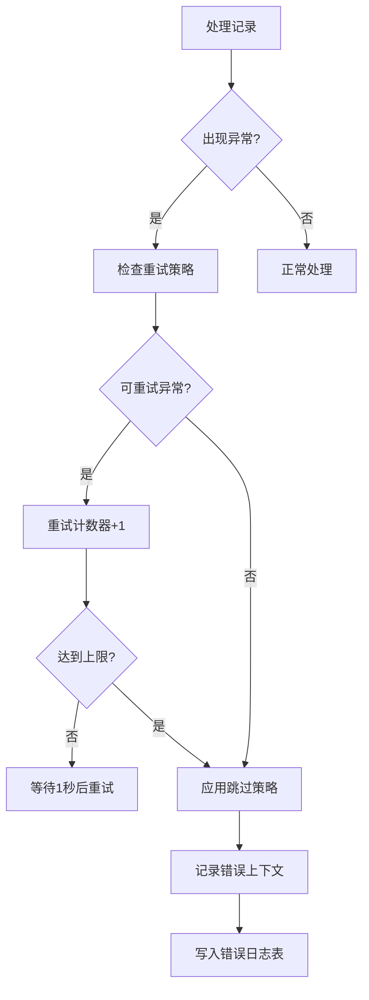

完整容错配置示例：

```java
@Bean
public Step secureStep() {
    return stepBuilderFactory.get("secureStep")
            .<Input, Output>chunk(500)
            .reader(jdbcReader())
            .processor(secureProcessor())
            .writer(restApiWriter())
            .faultTolerant()
            .retryLimit(3)
            .retry(ConnectException.class) // 网络问题重试
            .retry(DeadlockLoserDataAccessException.class) // 数据库死锁重试
            .skipLimit(100)
            .skip(DataIntegrityViolationException.class) // 数据问题跳过
            .skip(InvalidDataAccessApiUsageException.class)
            .noRollback(ValidationException.class) // 验证异常不回滚
            .listener(new ErrorLogListener()) // 自定义监听器
            .build();
}

// 错误日志监听器示例
public class ErrorLogListener implements ItemProcessListener<Input, Output> {
    @Override
    public void onProcessError(Input item, Exception e) {
        ErrorLog log = new ErrorLog();
        log.setItemData(item.toString());
        log.setErrorMsg(e.getMessage());
        errorLogRepository.save(log);
    }
}
```

### 性能优化策略（千万级数据处理） ###

#### 策略1：并行Step执行 ####

```mermaid
gantt
    title 并行执行优化对比
    dateFormat  HH:mm
    section 串行执行
    数据清洗     :a1, 00:00, 30m
    风险校验     :a2, after a1, 20m
    生成报告     :a3, after a2, 10m
    section 并行执行
    数据清洗     :b1, 00:00, 30m
    风险校验     :b2, 00:00, 20m
    生成报告     :b3, after b1, 10m
```

配置代码：

```java
@Bean
public Job parallelJob() {
    return jobBuilderFactory.get("parallelJob")
            .start(step1())
            .split(new SimpleAsyncTaskExecutor()) // 启用异步执行器
            .add(step2(), step3())
            .build();
}
```

#### 策略2：分区处理（Partitioning） ####


分区处理器实现：

```java
@Bean
public Step masterStep() {
    return stepBuilderFactory.get("masterStep")
            .partitioner("slaveStep", partitioner())
            .gridSize(10) // 分区数量=CPU核心数*2
            .taskExecutor(new ThreadPoolTaskExecutor())
            .build();
}

@Bean
public Partitioner partitioner() {
    return new Partitioner() {
        @Override
        public Map<String, ExecutionContext> partition(int gridSize) {
            Map<String, ExecutionContext> result = new HashMap<>();
            long total = getTotalRecordCount();
            
            long range = total / gridSize;
            for (int i = 0; i < gridSize; i++) {
                ExecutionContext context = new ExecutionContext();
                context.putLong("min", i * range);
                context.putLong("max", (i+1) * range);
                result.put("partition"+i, context);
            }
            return result;
        }
    };
}

// Slave Step配置
@Bean
public Step slaveStep() {
    return stepBuilderFactory.get("slaveStep")
            .<Record, Result>chunk(1000)
            .reader(rangeReader(null, null))
            .processor(processor())
            .writer(writer())
            .build();
}

@StepScope
@Bean
public ItemReader<Record> rangeReader(
        @Value("#{stepExecutionContext[min]}") Long min,
        @Value("#{stepExecutionContext[max]}") Long max) {
    return new JdbcCursorItemReaderBuilder<Record>()
            .sql("SELECT * FROM records WHERE id BETWEEN ? AND ?")
            .preparedStatementSetter(ps -> {
                ps.setLong(1, min);
                ps.setLong(2, max);
            })
            // 其他配置...
            .build();
}
```

#### 策略3：异步ItemProcessor ####

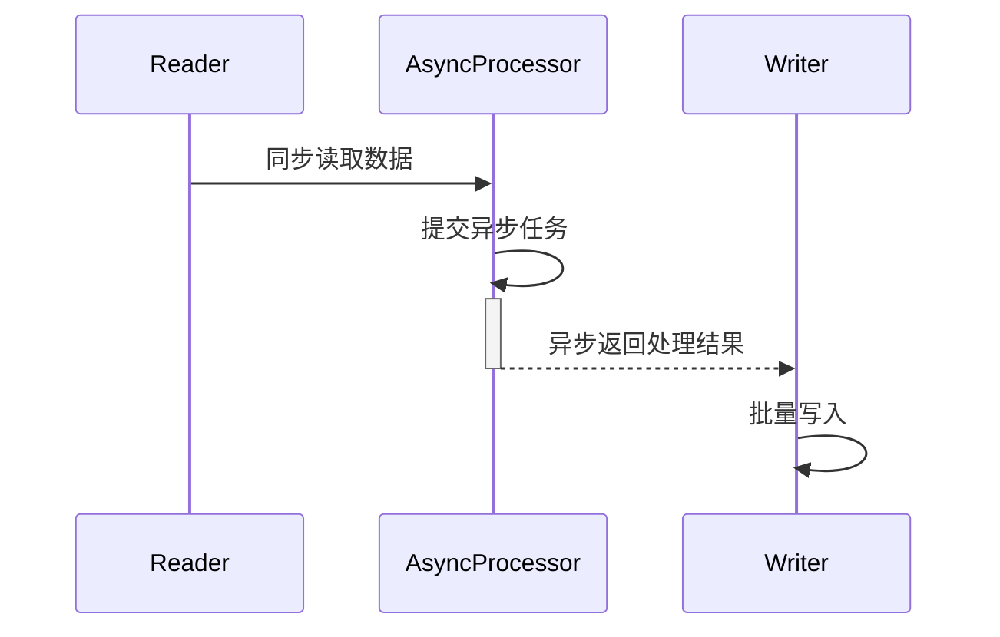

异步处理配置：

```java
@Bean
public Step asyncStep() {
    return stepBuilderFactory.get("asyncStep")
            .<Input, Output>chunk(1000)
            .reader(reader())
            .processor(asyncItemProcessor())
            .writer(writer())
            .build();
}

@Bean
public AsyncItemProcessor<Input, Output> asyncItemProcessor() {
    AsyncItemProcessor<Input, Output> asyncProcessor = new AsyncItemProcessor<>();
    asyncProcessor.setDelegate(syncProcessor()); // 同步处理器
    asyncProcessor.setTaskExecutor(new ThreadPoolTaskExecutor());
    return asyncProcessor;
}

@Bean
public AsyncItemWriter<Output> asyncItemWriter() {
    AsyncItemWriter<Output> asyncWriter = new AsyncItemWriter<>();
    asyncWriter.setDelegate(syncWriter()); // 同步写入器
    return asyncWriter;
}
```

### 性能对比测试数据 ###

|  处理方式   |  100万条耗时  |   1000万条耗时  |  资源消耗  |
| :-----------: | :-----------: | :-----------: |
|  单线程  |   2h15m  |   23h+  |  CPU 15%  |
|  分区处理(10线程)  |   25m  |   4h10m  |  CPU 75%  |
|  异步处理+分区  |   18m  |   3h05m  |  CPU 95%  |

优化技巧：

- 数据库连接池调优：

```ini
spring.datasource.hikari.maximum-pool-size=20
spring.datasource.hikari.minimum-idle=5
```

- JVM参数优化：

```bash
java -jar -Xmx4g -XX:+UseG1GC -XX:MaxGCPauseMillis=200 ...
```

- 批处理参数调整：

```java
.chunk(2000) // 根据内存容量调整
.setQueryTimeout(60) // 数据库查询超时
```

## 六、监控与管理（生产级方案） ##

### 监控方案升级（Spring Batch Admin替代方案） ###

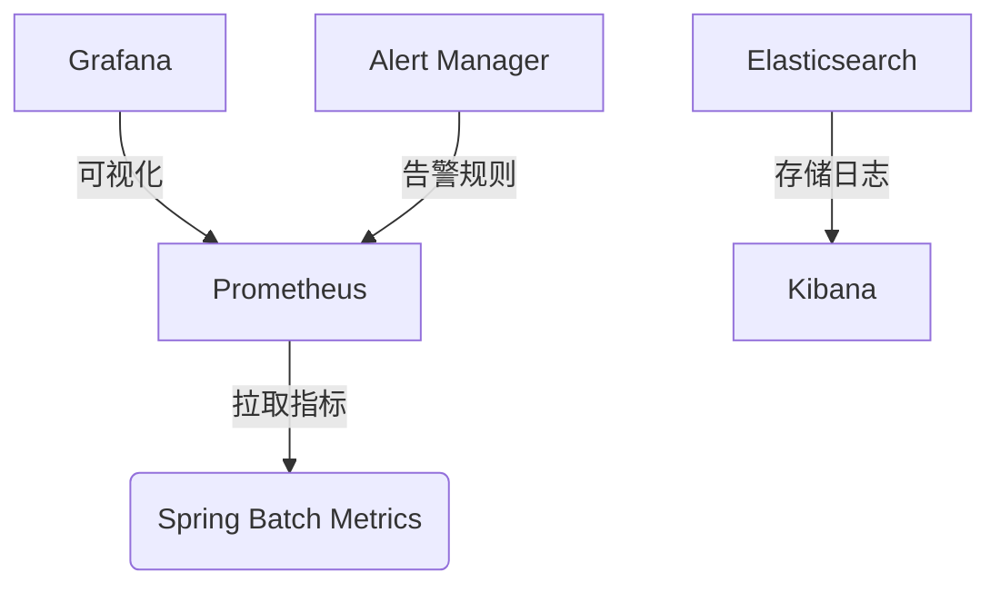

现代监控栈配置：

```xml
// 添加监控依赖
<dependency>
    <groupId>io.micrometer</groupId>
    <artifactId>micrometer-registry-prometheus</artifactId>
</dependency>
```

```java
// 暴露监控端点
@Bean
public MeterRegistryCustomizer<MeterRegistry> metricsCommonTags() {
    return registry -> registry.config().commonTags("application", "batch-service");
}

// 自定义Batch指标
public class BatchMetricsListener extends JobExecutionListenerSupport {
    private final Counter processedRecords = Counter.builder("batch.records.processed")
            .description("Total processed records")
            .register(Metrics.globalRegistry);
    
    @Override
    public void afterStep(StepExecution stepExecution) {
        processedRecords.increment(stepExecution.getWriteCount());
    }
}
```

### 元数据表结构详解 ###

```mermaid
erDiagram
    BATCH_JOB_INSTANCE ||--o{ BATCH_JOB_EXECUTION : "1:N"
    BATCH_JOB_EXECUTION ||--o{ BATCH_STEP_EXECUTION : "1:N"
    BATCH_JOB_EXECUTION ||--o{ BATCH_JOB_EXECUTION_PARAMS : "1:N"
    BATCH_STEP_EXECUTION ||--o{ BATCH_STEP_EXECUTION_CONTEXT : "1:1"

    BATCH_JOB_INSTANCE {
        bigint JOB_INSTANCE_ID PK
        varchar JOB_NAME
        varchar JOB_KEY
    }
    
    BATCH_JOB_EXECUTION {
        bigint JOB_EXECUTION_ID PK
        bigint JOB_INSTANCE_ID FK
        timestamp START_TIME
        timestamp END_TIME
        varchar STATUS
        varchar EXIT_CODE
    }
    
    BATCH_STEP_EXECUTION {
        bigint STEP_EXECUTION_ID PK
        bigint JOB_EXECUTION_ID FK
        varchar STEP_NAME
        timestamp START_TIME
        timestamp END_TIME
        int READ_COUNT
        int WRITE_COUNT
        int ROLLBACK_COUNT
    }
```

关键表用途：

- BATCH_JOB_INSTANCE：作业指纹库（相同参数只能存在一个实例）
- BATCH_JOB_EXECUTION_PARAMS：存储每次运行的参数
- BATCH_STEP_EXECUTION_CONTEXT：保存步骤上下文数据（重启恢复的关键）

### 自定义监控看板 ###

```sql
-- 常用监控SQL示例
-- 最近5次作业执行情况
SELECT j.JOB_NAME, e.START_TIME, e.END_TIME, 
       TIMEDIFF(e.END_TIME, e.START_TIME) AS DURATION,
       s.READ_COUNT, s.WRITE_COUNT
FROM BATCH_JOB_EXECUTION e
JOIN BATCH_JOB_INSTANCE j ON e.JOB_INSTANCE_ID = j.JOB_INSTANCE_ID
JOIN BATCH_STEP_EXECUTION s ON e.JOB_EXECUTION_ID = s.JOB_EXECUTION_ID
ORDER BY e.START_TIME DESC LIMIT 5;
```

## 七、常见问题Q&A（终极指南） ##

### 内存溢出问题深度解决方案 ###

场景：处理10GB CSV文件时OOM

```mermaid
flowchart TD
    A[大文件] --> B{处理方式}
    B -->|传统方式| C[全量加载 ->内存爆炸]
    B -->|Spring Batch方案| D[分块流式处理]
    
    D --> E[文件分割策略]
    E --> E1[按行数分割]
    E --> E2[按大小分割]
    
    D --> F[内存控制技巧]
    F --> F1[调整chunk size]
    F --> F2[关闭数据缓存]
    F --> F3[使用游标读取]
```

优化代码示例：

```java
@Bean
@StepScope
public FlatFileItemReader<LargeRecord> largeFileReader(
        @Value("#{jobParameters['filePath']}") String filePath) {
    
    return new FlatFileItemReaderBuilder<LargeRecord>()
            .resource(new FileSystemResource(filePath))
            .lineMapper(new DefaultLineMapper<>() {{
                setLineTokenizer(new DelimitedLineTokenizer());
                setFieldSetMapper(new BeanWrapperFieldSetMapper<>() {{
                    setTargetType(LargeRecord.class);
                }});
            }})
            .linesToSkip(1)
            .strict(false) // 允许文件结尾空行
            .saveState(false) // 禁用状态保存
            .build();
}

// JVM参数建议
// -XX:+UseG1GC -Xmx2g -XX:MaxGCPauseMillis=200
```

### 定时任务高级配置 ###

多任务调度方案：

```java
@Configuration
@EnableScheduling
public class ScheduleConfig {

    @Autowired private JobLauncher jobLauncher;
    @Autowired private Job reportJob;
    
    // 工作日凌晨执行
    @Scheduled(cron = "0 0 2 * * MON-FRI")
    public void dailyJob() throws Exception {
        JobParameters params = new JobParametersBuilder()
                .addString("date", LocalDate.now().toString())
                .toJobParameters();
        jobLauncher.run(reportJob, params);
    }

    // 每小时轮询
    @Scheduled(fixedRate = 3600000)
    public void pollJob() {
        if(checkNewDataExists()) {
            jobLauncher.run(dataProcessJob, new JobParameters());
        }
    }
    
    // 优雅停止示例
    public void stopJob(Long executionId) {
        JobExecution execution = jobExplorer.getJobExecution(executionId);
        if(execution.isRunning()) {
            execution.setStatus(BatchStatus.STOPPING);
            jobRepository.update(execution);
        }
    }
}
```

### 高频问题集锦 ###

#### Q：如何重新运行失败的任务？ ####

```sql
-- 步骤1：查询失败的任务ID
SELECT * FROM BATCH_JOB_EXECUTION WHERE STATUS = 'FAILED';

-- 步骤2：使用相同参数重新启动
JobParameters params = new JobParametersBuilder()
        .addLong("restartId", originalExecutionId)
        .toJobParameters();
jobLauncher.run(job, params);
```

#### Q：处理过程中断电怎么办？ ####

```mermaid
sequenceDiagram
    participant App as 应用程序
    participant DB as 数据库
    
    App->>DB: 开启事务（Chunk1）
    DB-->>App: 事务ID:1001
    App->>DB: 提交事务
    Note over App,DB: 正常处理
    
    App->>DB: 开启事务（Chunk2）
    DB-->>App: 事务ID:1002
    Note left of App: 断电！事务未提交
    App--x DB: 连接中断
    
    App->>DB: 重新启动
    App->>DB: 查询最后提交位置
    DB-->>App: 最后成功Chunk1
    App->>DB: 从Chunk2继续处理
```

#### Q：如何实现动态参数传递？ ####

```bash
// 命令行启动方式
java -jar batch.jar --spring.batch.job.name=dataImportJob date=2023-10-01
```

```java
// 编程式参数构建
public void runJobWithParams(Map<String, Object> params) {
    JobParameters jobParams = new JobParametersBuilder()
            .addString("mode", "forceUpdate")
            .addLong("timestamp", System.currentTimeMillis())
            .toJobParameters();
    jobLauncher.run(importJob, jobParams);
}
```

### 性能调优检查清单 ###

#### 数据库优化 ####

- 添加批量处理索引
- 配置连接池参数
- 启用JDBC批处理模式

#### JVM优化 ####

```bash
-XX:+UseStringDeduplication
-XX:+UseCompressedOops
-XX:MaxMetaspaceSize=512m
```

#### Batch配置 ####

```ini
spring.batch.jdbc.initialize-schema=never
spring.batch.job.enabled=false
spring.jpa.open-in-view=false
```
