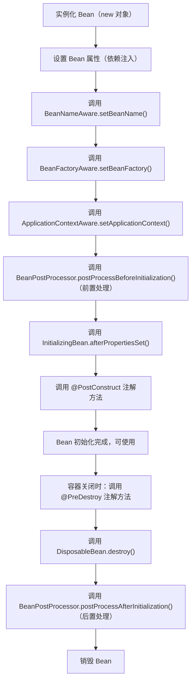
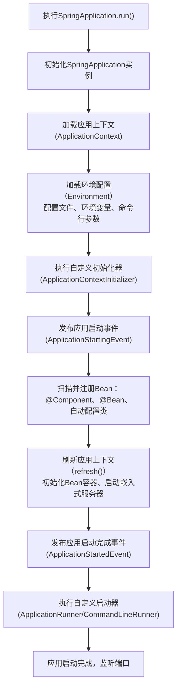

Spring Boot 之所以能成为 Java 后端开发的 “标配”，核心在于它以 “约定大于配置” 的理念，简化了 Spring 框架的繁琐配置，让开发者聚焦业务逻辑而非框架搭建。本文将从配置优先级、Bean 的生命周期与管理、Spring Boot 核心启动原理三个维度，深度拆解 Spring Boot 的底层逻辑，帮你从 “会用” 到 “懂原理”。

## 一、Spring Boot 核心价值：为什么它能取代传统 Spring？ ##

传统 Spring 开发的痛点：

- 需手动编写大量 XML 配置（如 applicationContext.xml）或 Java 配置类，配置繁琐；
- 需手动整合第三方框架（如 MyBatis、Redis），依赖版本冲突频繁；
- 需手动搭建嵌入式服务器（如 Tomcat），部署流程复杂；
- 环境配置分散，多环境（开发 / 测试 / 生产）切换成本高。

Spring Boot 的核心解决思路：

- 自动配置（AutoConfiguration） ：根据类路径下的依赖自动配置框架组件（如引入 spring-boot-starter-web 自动配置 Tomcat、Spring MVC）；
- 起步依赖（Starter） ：整合常用依赖，解决版本冲突问题；
- 嵌入式服务器：内置 Tomcat/Jetty/Undertow，一键启动；
- 统一配置管理：通过 application.yml/properties 集中管理配置，支持多环境切换；
- 简化 Bean 管理：自动扫描、注册 Bean，无需手动配置。

## 二、Spring Boot 配置优先级：配置加载的 “规则” ##

Spring Boot 支持多种配置方式（配置文件、命令行参数、环境变量等），当同一配置项在多个地方定义时，会按照优先级从高到低加载，确保配置的灵活性和可控性。

### 配置优先级总览（从高到低） ###

以下是 Spring Boot 官方定义的配置优先级（核心常用项），优先级高的配置会覆盖优先级低的：

1. 命令行参数（如 `java -jar app.jar --server.port=8081`）；
2. 操作系统环境变量（如 `SERVER_PORT=8082`）；
3. 应用外部的 `application-{profile}.yml/properties`（如 `/config/application-dev.yml`）；
4. 应用外部的 `application.yml/properties`（如 `/config/application.yml`）；
5. 应用内部的 `application-{profile}.yml/properties`（如 `resources/application-dev.yml`）；
6. 应用内部的 `application.yml/properties`（如 `resources/application.yml`）；
7. `@Configuration` 配置类中的 `@Value` 注解；
8. Spring Boot 内置默认配置（如 `server.port=8080`）。

### 核心配置方式详解 ###

#### 配置文件：最常用的配置方式 ####

Spring Boot 默认加载 resources 目录下的 `application.yml/application.properties`，支持 YAML 和 Properties 两种格式（YAML 更简洁，推荐使用）。

示例：application.yml

```yaml
# 服务器配置
server:
  port: 8080
  servlet:
    context-path: /demo

# 自定义配置
app:
  name: spring-boot-demo
  version: 1.0.0

# 多环境配置激活
spring:
  profiles:
    active: dev
```

多环境配置：创建 `application-dev.yml`（开发环境）、`application-prod.yml`（生产环境），通过 `spring.profiles.active` 激活：

```yaml
# application-dev.yml
server:
  port: 8081
app:
  env: development

# application-prod.yml
server:
  port: 8082
app:
  env: production
```

#### 命令行参数：临时覆盖配置 ####

启动 Jar 包时通过 -- 传递参数，优先级最高，适合临时修改配置：

```bash
java -jar spring-boot-demo.jar --server.port=8083 --app.name=demo-prod
```

#### 环境变量：适配不同部署环境 ####

操作系统环境变量可覆盖配置文件，适合在不同服务器上适配环境：

```bash
# Linux 系统设置环境变量
export SERVER_PORT=8084
export APP_NAME=demo-env
# 启动应用
java -jar spring-boot-demo.jar
```

#### @Configuration 配置类：硬编码配置 ####

通过 `@Configuration` + `@Value` 或 `@ConfigurationProperties` 读取配置，优先级低于外部配置：

```java
// 方式1：@Value 读取单个配置
@Configuration
public class AppConfig {
    @Value("${app.name:默认名称}") // 配置不存在时使用默认值
    private String appName;

    @Value("${app.version}")
    private String appVersion;
}

// 方式2：@ConfigurationProperties 批量读取配置（推荐）
@Configuration
@ConfigurationProperties(prefix = "app")
@Data // Lombok 注解，简化get/set
public class AppProperties {
    private String name;
    private String version;
    private String env;
}
```

### 配置优先级验证实战 ###

假设同时配置了以下内容：

- application.yml：`server.port=8080`；
- application-dev.yml：`server.port=8081`；
- 命令行参数：`--server.port=8082`；
- 环境变量：`SERVER_PORT=8083`。

最终生效的端口是 *8082*（命令行参数优先级最高），验证了 “高优先级配置覆盖低优先级” 的核心规则。

### 配置优先级最佳实践 ###

- 核心配置固化：将通用配置（如应用名称、数据库连接）放在 application.yml 中；

- 多环境隔离：不同环境的配置（如端口、数据库地址）放在 `application-{profile}.yml` 中，通过 `spring.profiles.active` 激活；

- 临时配置用命令行：生产环境临时修改配置（如端口），优先使用命令行参数，避免修改配置文件；

- 配置校验：使用 `@ConfigurationProperties` + `@Validated` 校验配置合法性，避免配置错误导致启动失败：

```java
@Configuration
@ConfigurationProperties(prefix = "app")
@Validated
@Data
public class AppProperties {
    @NotBlank(message = "应用名称不能为空")
    private String name;
    
    @Pattern(regexp = "^\d+\.\d+\.\d+$", message = "版本号格式错误")
    private String version;
}
```

## 三、Spring Boot Bean 管理：从创建到销毁的全生命周期 ##

Bean 是 Spring 容器的核心，Spring Boot 对 Spring 的 Bean 管理做了大量简化，核心包括 “Bean 的注册、生命周期、作用域、依赖注入” 四部分。

### Bean 的注册方式 ###

Spring Boot 支持多种 Bean 注册方式，优先级从高到低：

#### @Bean 注解（手动注册） ####

在 `@Configuration` 配置类中通过 `@Bean` 注解注册 Bean，适用于第三方组件（如 RedisTemplate、DataSource）：

```java
@Configuration
public class BeanConfig {
    // 注册自定义 Bean
    @Bean("userService") // 指定 Bean 名称，默认是方法名
    public UserService userService() {
        return new UserService();
    }

    // 注册第三方 Bean（如数据源）
    @Bean
    public DataSource dataSource() {
        HikariDataSource dataSource = new HikariDataSource();
        dataSource.setJdbcUrl("jdbc:mysql://localhost:3306/test");
        dataSource.setUsername("root");
        dataSource.setPassword("123456");
        return dataSource;
    }
}
```

#### @Component 注解（自动扫描） ####

通过 `@Component` 及其衍生注解（`@Service`、`@Controller`、`@Repository`）标记类，Spring Boot 会自动扫描并注册 Bean：

- 扫描范围：默认扫描主启动类所在包及其子包；

- 自定义扫描范围：通过 `@ComponentScan` 指定：

```java
// 主启动类
@SpringBootApplication
@ComponentScan(basePackages = {"com.example.demo", "com.example.common"})
public class DemoApplication {
    public static void main(String[] args) {
        SpringApplication.run(DemoApplication.class, args);
    }
}
```

#### 自动配置类（AutoConfiguration） ####

Spring Boot 核心特性，通过 `spring-boot-autoconfigure` 包中的自动配置类（如 DataSourceAutoConfiguration、WebMvcAutoConfiguration）自动注册框架 Bean，无需手动配置：

- 触发条件：类路径下存在对应依赖（如引入 `spring-boot-starter-web` 触发 `WebMvcAutoConfiguration`）；
- 关闭自动配置：通过 `@SpringBootApplication(exclude = DataSourceAutoConfiguration.class)` 排除不需要的自动配置。

### Bean 的生命周期（核心） ###

Spring Boot 中 Bean 的生命周期由 Spring 容器管理，完整流程如下：



#### 实战演示：Bean 生命周期监控 ####

```java
@Component
@Slf4j
public class UserService implements InitializingBean, DisposableBean, BeanNameAware {
    private String userName;

    // 1. 依赖注入
    @Value("${app.name}")
    public void setUserName(String userName) {
        this.userName = userName;
        log.info("【步骤2】设置 Bean 属性：userName={}", userName);
    }

    // 2. BeanNameAware 回调
    @Override
    public void setBeanName(String name) {
        log.info("【步骤3】调用 BeanNameAware.setBeanName()：beanName={}", name);
    }

    // 3. 前置处理器（需单独定义 BeanPostProcessor）
    @Component
    static class MyBeanPostProcessor implements BeanPostProcessor {
        @Override
        public Object postProcessBeforeInitialization(Object bean, String beanName) throws BeansException {
            if ("userService".equals(beanName)) {
                log.info("【步骤6】调用 BeanPostProcessor.postProcessBeforeInitialization()");
            }
            return bean;
        }

        @Override
        public Object postProcessAfterInitialization(Object bean, String beanName) throws BeansException {
            if ("userService".equals(beanName)) {
                log.info("【步骤11】调用 BeanPostProcessor.postProcessAfterInitialization()");
            }
            return bean;
        }
    }

    // 4. InitializingBean 回调
    @Override
    public void afterPropertiesSet() throws Exception {
        log.info("【步骤7】调用 InitializingBean.afterPropertiesSet()");
    }

    // 5. @PostConstruct 注解方法
    @PostConstruct
    public void init() {
        log.info("【步骤8】调用 @PostConstruct 注解方法：Bean 初始化完成");
    }

    // 6. @PreDestroy 注解方法
    @PreDestroy
    public void preDestroy() {
        log.info("【步骤10】调用 @PreDestroy 注解方法");
    }

    // 7. DisposableBean 回调
    @Override
    public void destroy() throws Exception {
        log.info("【步骤11】调用 DisposableBean.destroy()：Bean 销毁");
    }
}
```

启动应用后，控制台会按生命周期顺序打印日志，直观展示 Bean 从创建到销毁的全过程。

### Bean 的作用域 ###

Spring Boot 定义了 5 种 Bean 作用域，常用的有 4 种：

|  作用域   |      注解   |  核心说明   |      适用场景   |
| :-----------: | :-----------: | :-----------: | :-----------: |
| 单例（singleton） | `@Scope("singleton")`（默认） |  容器中仅存在一个 Bean 实例，所有请求共享   |      无状态的服务类（如 UserService、OrderService）   |
| 多例（prototype） | `@Scope("prototype")` |  每次获取 Bean 时创建新实例   |      有状态的对象（如 User、Order）   |
| 请求（request） | `@Scope("request")` |  每个 HTTP 请求创建一个 Bean 实例   |      Web 场景中，存储请求级别的数据   |
| 会话（session） | `@Scope("session")` |  每个 HTTP 会话创建一个 Bean 实例   |      Web 场景中，存储会话级别的数据（如用户信息）   |

实战示例：

```java
@Component
@Scope("prototype") // 多例作用域
@Data
public class User {
    private Long id;
    private String name;
}

// 测试多例作用域
@RestController
public class UserController {
    @Autowired
    private ApplicationContext context;

    @GetMapping("/user")
    public String getUser() {
        User user1 = context.getBean(User.class);
        User user2 = context.getBean(User.class);
        return "user1 == user2：" + (user1 == user2); // 输出 false，多例作用域每次创建新实例
    }
}
```

### Bean 依赖注入的方式 ###

Spring Boot 支持 3 种依赖注入方式，推荐使用构造器注入：

#### 构造器注入（推荐） ####

```java
@Service
public class OrderService {
    private final UserService userService;

    // 构造器注入（强制依赖，避免空指针）
    @Autowired // Spring 4.3+ 中，单个构造器可省略 @Autowired
    public OrderService(UserService userService) {
        this.userService = userService;
    }
}
```

#### Setter 注入 ####

```java
@Service
public class OrderService {
    private UserService userService;

    // Setter 注入（可选依赖）
    @Autowired
    public void setUserService(UserService userService) {
        this.userService = userService;
    }
}
```

#### 字段注入（不推荐） ####

```java
@Service
public class OrderService {
    // 字段注入（耦合度高，不利于单元测试）
    @Autowired
    private UserService userService;
}
```

## 四、Spring Boot 核心启动原理：从 main 方法到容器初始化 ##

Spring Boot 的启动流程是其核心原理的集中体现，我们从 “主启动类” 入手，拆解完整启动过程。

### 主启动类核心注解：@SpringBootApplication ###

`@SpringBootApplication` 是一个复合注解，整合了 3 个核心注解：

```java
@Target(ElementType.TYPE)
@Retention(RetentionPolicy.RUNTIME)
@Documented
@Inherited
@SpringBootConfiguration // 等价于 @Configuration，标记为配置类
@EnableAutoConfiguration // 开启自动配置（核心）
@ComponentScan // 开启组件扫描
public @interface SpringBootApplication {
    // 排除自动配置类
    Class<?>[] exclude() default {};
    // 指定组件扫描范围
    String[] scanBasePackages() default {};
}
```

核心注解解析：

- `@SpringBootConfiguration`：继承自 `@Configuration`，表示当前类是配置类，可通过 @Bean 注册 Bean；
- `@ComponentScan`：扫描当前包及其子包下的 `@Component` 注解类，注册为 Bean；
- `@EnableAutoConfiguration`：开启自动配置，是 Spring Boot “约定大于配置” 的核心。

### @EnableAutoConfiguration 核心原理 ###

`@EnableAutoConfiguration` 通过 `AutoConfigurationImportSelector` 类，读取 `META-INF/spring/org.springframework.boot.autoconfigure.AutoConfiguration.imports` 文件（Spring Boot 2.7+ 版本），加载所有自动配置类（如 `WebMvcAutoConfiguration`、`DataSourceAutoConfiguration`）。

自动配置的核心逻辑：

- 条件注解：自动配置类通过 `@Conditional` 系列注解（如 `@ConditionalOnClass`、`@ConditionalOnMissingBean`）判断是否满足配置条件；

  - @ConditionalOnClass：类路径下存在指定类时生效；
  - @ConditionalOnMissingBean：容器中不存在指定 Bean 时生效；
  - @ConditionalOnProperty：配置文件中存在指定属性时生效。

- 自动配置生效：满足条件时，自动配置类中的 @Bean 会被注册到容器中，替代手动配置。

#### 示例：WebMvcAutoConfiguration 核心逻辑 ####

```java
@Configuration(proxyBeanMethods = false)
@ConditionalOnWebApplication(type = Type.SERVLET) // Web 应用时生效
@ConditionalOnClass({ Servlet.class, DispatcherServlet.class, WebMvcConfigurer.class }) // 存在指定类时生效
@ConditionalOnMissingBean(WebMvcConfigurationSupport.class) // 不存在该 Bean 时生效
@AutoConfigureOrder(Ordered.HIGHEST_PRECEDENCE + 10)
@AutoConfigureAfter({ DispatcherServletAutoConfiguration.class, TaskExecutionAutoConfiguration.class })
public class WebMvcAutoConfiguration {
    // 自动注册 DispatcherServlet Bean
    @Bean
    @ConditionalOnMissingBean
    public DispatcherServlet dispatcherServlet() {
        DispatcherServlet dispatcherServlet = new DispatcherServlet();
        dispatcherServlet.setDispatchOptionsRequest(true);
        return dispatcherServlet;
    }
}
```

### Spring Boot 完整启动流程 ###

Spring Boot 的启动流程可分为 8 个核心步骤，通过 SpringApplication.run() 方法触发：



核心步骤详解：

- 初始化 SpringApplication：加载 `META-INF/spring.factories` 中的初始化器、监听器；

- 加载环境配置：整合多种配置方式，按优先级生成 Environment 对象；

- 刷新应用上下文：

  - 创建 BeanFactory（Bean 工厂）；
  - 加载 Bean 定义（BeanDefinition）；
  - 初始化 Bean（执行生命周期方法）；
  - 启动嵌入式服务器（如 Tomcat）；

执行启动器：ApplicationRunner/CommandLineRunner 用于在应用启动后执行初始化逻辑（如加载缓存、初始化数据）。

#### 实战：自定义启动器 ####

```java
// 实现 CommandLineRunner，应用启动后执行
@Component
@Slf4j
public class MyCommandLineRunner implements CommandLineRunner {
    @Override
    public void run(String... args) throws Exception {
        log.info("【应用启动完成】执行自定义初始化逻辑：加载缓存数据");
        // 模拟初始化逻辑
        loadCache();
    }

    private void loadCache() {
        log.info("缓存数据加载完成");
    }
}
```

### 嵌入式服务器启动原理 ###

Spring Boot 内置 Tomcat 等服务器，无需手动部署，核心原理：

- 引入 `spring-boot-starter-web` 依赖时，自动引入 `tomcat-starter`；
- `ServletWebServerFactoryAutoConfiguration` 自动配置类根据类路径下的服务器依赖（Tomcat/Jetty），创建对应的 `ServletWebServerFactory`；
- 应用上下文刷新时，`WebServerApplicationContext` 调用 `getWebServer()` 方法启动服务器；
- 服务器绑定配置的端口（默认 8080），监听 HTTP 请求。

自定义服务器端口：

```yaml
# application.yml
server:
  port: 8081 # 覆盖默认端口
  tomcat:
    uri-encoding: UTF-8 # 自定义 Tomcat 配置
```

## 五、核心原理实战：自定义 Starter ##

理解 Spring Boot 原理的最佳方式是 “造轮子”—— 自定义一个 Starter，模拟自动配置过程。

### 步骤 1：创建 Starter 项目（Maven 模块） ###

#### pom.xml 依赖 ####

```xml
<?xml version="1.0" encoding="UTF-8"?>
<project xmlns="http://maven.apache.org/POM/4.0.0"
         xmlns:xsi="http://www.w3.org/2001/XMLSchema-instance"
         xsi:schemaLocation="http://maven.apache.org/POM/4.0.0 http://maven.apache.org/xsd/maven-4.0.0.xsd">
    <modelVersion>4.0.0</modelVersion>

    <groupId>com.example</groupId>
    <artifactId>my-spring-boot-starter</artifactId>
    <version>1.0.0</version>

    <dependencies>
        <!-- Spring Boot 自动配置核心依赖 -->
        <dependency>
            <groupId>org.springframework.boot</groupId>
            <artifactId>spring-boot-autoconfigure</artifactId>
            <version>2.7.15</version>
        </dependency>
        <!-- 配置绑定依赖 -->
        <dependency>
            <groupId>org.springframework.boot</groupId>
            <artifactId>spring-boot-configuration-processor</artifactId>
            <version>2.7.15</version>
            <optional>true</optional>
        </dependency>
    </dependencies>
</project>
```

#### 配置属性类 ####

```java
@ConfigurationProperties(prefix = "my.starter")
@Data
public class MyStarterProperties {
    private String name = "default";
    private String version = "1.0.0";
}
```

#### 自动配置类 ####

```java
@Configuration
@ConditionalOnClass(MyService.class) // 存在 MyService 时生效
@EnableConfigurationProperties(MyStarterProperties.class) // 启用配置属性
public class MyStarterAutoConfiguration {
    private final MyStarterProperties properties;

    public MyStarterAutoConfiguration(MyStarterProperties properties) {
        this.properties = properties;
    }

    // 自动注册 MyService Bean
    @Bean
    @ConditionalOnMissingBean // 容器中不存在时生效
    public MyService myService() {
        MyService myService = new MyService();
        myService.setName(properties.getName());
        myService.setVersion(properties.getVersion());
        return myService;
    }
}
```

#### 核心服务类 ####

```java
@Data
public class MyService {
    private String name;
    private String version;

    public String sayHello() {
        return "Hello, MyStarter! name=" + name + ", version=" + version;
    }
}
```

#### 注册自动配置类 ####

在 `resources/META-INF/spring/org.springframework.boot.autoconfigure.AutoConfiguration.imports` 文件中添加：

```txt
com.example.mystarter.MyStarterAutoConfiguration
```

### 步骤 2：使用自定义 Starter ###

在 Spring Boot 项目中引入自定义 Starter 依赖：

```xml
<dependency>
    <groupId>com.example</groupId>
    <artifactId>my-spring-boot-starter</artifactId>
    <version>1.0.0</version>
</dependency>
```

配置自定义属性：

```yaml
# application.yml
my:
  starter:
    name: my-custom-starter
    version: 2.0.0
```

测试使用：

```java
@RestController
public class MyStarterController {
    @Autowired
    private MyService myService;

    @GetMapping("/my-starter")
    public String test() {
        return myService.sayHello(); // 输出：Hello, MyStarter! name=my-custom-starter, version=2.0.0
    }
}
```

启动应用后，访问 `/my-starter` 接口，验证自定义 Starter 自动配置生效，完整模拟了 Spring Boot 官方 Starter 的实现逻辑。

## 六、总结与核心要点回顾 ##

### 配置优先级 ###

- 核心规则：命令行参数 > 环境变量 > 外部配置文件 > 内部配置文件 > 硬编码 > 默认配置；
- 最佳实践：多环境配置用 `application-{profile}.yml`，临时配置用命令行参数，配置校验用 `@Validated`。

### Bean 管理 ###

- 注册方式：`@Bean`（手动）、`@Component`（自动扫描）、自动配置类（框架自动注册）；
- 生命周期：实例化 → 属性注入 → 初始化（`@PostConstruct`/`InitializingBean`）→ 使用 → 销毁（`@PreDestroy`/`DisposableBean`）；
- 作用域：默认单例，有状态对象用原型作用域；
- 依赖注入：优先使用构造器注入，避免字段注入。

### Spring Boot 核心原理 ###

- 核心注解：`@SpringBootApplication` 整合 `@Configuration`、`@ComponentScan`、`@EnableAutoConfiguration`；
- 自动配置：通过 `@EnableAutoConfiguration` 加载自动配置类，结合条件注解实现 “按需配置”；
- 启动流程：`SpringApplication.run()` → 初始化上下文 → 加载配置 → 注册 Bean → 启动嵌入式服务器 → 执行启动器；
- 核心思想：约定大于配置，通过自动配置和起步依赖简化开发。

> SpringBoot的4种Bean注入冲突解决方案

在Spring Boot应用开发中，依赖注入是最常用的功能之一，它极大地简化了对象之间的依赖关系管理。
然而，当Spring容器中存在多个类型相同的Bean时，就会产生注入冲突问题。

介绍Spring Boot中的四种Bean注入冲突解决方案。

## 一、Bean注入冲突的基本概念 ##

### 什么是Bean注入冲突 ###

Bean注入冲突指的是当Spring容器中存在多个相同类型的Bean实例时，在进行依赖注入时，Spring不知道应该注入哪一个实例的情况。这通常发生在以下场景：

- 多个类实现了同一个接口
- 配置了多个相同类型的Bean
- 引入的第三方库中含有相同类型的Bean定义

### 示例场景 ###

假设我们有一个支付服务接口PaymentService，以及它的两个实现类AlipayService和WechatPayService：

```java
public interface PaymentService {
    boolean pay(BigDecimal amount);
}

@Service
public class AlipayService implements PaymentService {
    @Override
    public boolean pay(BigDecimal amount) {
        System.out.println("使用支付宝支付: " + amount);
        return true;
    }
}

@Service
public class WechatPayService implements PaymentService {
    @Override
    public boolean pay(BigDecimal amount) {
        System.out.println("使用微信支付: " + amount);
        return true;
    }
}
```

当我们尝试注入PaymentService时，Spring会抛出NoUniqueBeanDefinitionException异常：

```java
@Service
public class OrderService {
    private final PaymentService paymentService;
    
    @Autowired
    public OrderService(PaymentService paymentService) {
        this.paymentService = paymentService;
    }
    
    public void processOrder(BigDecimal amount) {
        paymentService.pay(amount);
    }
}
```

错误信息通常是：

```txt
org.springframework.beans.factory.NoUniqueBeanDefinitionException: No qualifying bean of type 'com.example.service.PaymentService' available: expected single matching bean but found 2: alipayService,wechatPayService
```

这就是典型的Bean注入冲突问题，下面我们将介绍四种解决方案。

## 二、使用@Primary注解指定主要Bean ##

### 基本原理 ###

`@Primary` 注解用于指示当多个Bean满足自动装配条件时，被注解的Bean应该优先被考虑。

一旦某个Bean被标记为主要Bean，Spring在自动装配时会优先选择它。

### 实现方式 ###

修改上述例子，我们可以为其中一个实现类添加`@Primary`注解：

```java
@Service
@Primary
public class AlipayService implements PaymentService {
    @Override
    public boolean pay(BigDecimal amount) {
        System.out.println("使用支付宝支付: " + amount);
        return true;
    }
}

@Service
public class WechatPayService implements PaymentService {
    @Override
    public boolean pay(BigDecimal amount) {
        System.out.println("使用微信支付: " + amount);
        return true;
    }
}
```

这样，当注入PaymentService时，Spring会自动选择AlipayService。

### 在Java配置类中使用@Primary ###

如果Bean是通过`@Bean`方法定义的，也可以在方法上使用`@Primary`：

```java
@Configuration
public class PaymentConfig {
    
    @Bean
    @Primary
    public PaymentService alipayService() {
        return new AlipayService();
    }
    
    @Bean
    public PaymentService wechatPayService() {
        return new WechatPayService();
    }
}
```

### 优缺点分析 ###

优点：

- 简单直观，只需添加一个注解
- 不需要修改注入点的代码
- 适合有明确"主要实现"的场景

缺点：

- 一个类型只能有一个 `@PrimaryBean`
- 不够灵活，无法根据不同的注入点选择不同的实现
- 在某些场景下可能不够明确

### 适用场景 ###

- 系统中有一个明确的"默认"或"主要"实现
- 希望在不修改现有代码的情况下更改默认行为
- 第三方库集成时需要指定首选实现

## 三、使用@Qualifier注解指定Bean名称 ##

### 基本原理 ###

@Qualifier注解用于在依赖注入点上指定要注入的Bean的名称，从而明确告诉Spring应该注入哪个Bean。

### 实现方式 ###

首先，可以为Bean定义指定名称：

```java
@Service("alipay")
public class AlipayService implements PaymentService {
    // 实现略
}

@Service("wechat")
public class WechatPayService implements PaymentService {
    // 实现略
}
```

然后，在注入点使用@Qualifier指定要注入的Bean名称：

```java
@Service
public class OrderService {
    private final PaymentService paymentService;
    
    @Autowired
    public OrderService(@Qualifier("wechat") PaymentService paymentService) {
        this.paymentService = paymentService;
    }
    
    public void processOrder(BigDecimal amount) {
        paymentService.pay(amount);
    }
}
```

也可以在字段注入时使用：

```java
@Service
public class OrderService {
    @Autowired
    @Qualifier("alipay")
    private PaymentService paymentService;
    
    // 方法略
}
```

### 自定义限定符 ###

除了使用Bean名称作为限定符外，还可以创建自定义的限定符注解：

```java
@Target({ElementType.FIELD, ElementType.PARAMETER, ElementType.TYPE})
@Retention(RetentionPolicy.RUNTIME)
@Qualifier
public @interface Alipay {
}

@Target({ElementType.FIELD, ElementType.PARAMETER, ElementType.TYPE})
@Retention(RetentionPolicy.RUNTIME)
@Qualifier
public @interface Wechat {
}
```

然后在Bean和注入点使用这些注解：

```java
@Service
@Alipay
public class AlipayService implements PaymentService {
    // 实现略
}

@Service
@Wechat
public class WechatPayService implements PaymentService {
    // 实现略
}

@Service
public class OrderService {
    @Autowired
    @Wechat
    private PaymentService paymentService;
    
    // 方法略
}
```

### 优缺点分析 ###

优点：

- 精确控制每个注入点使用的Bean
- 可以在不同的注入点使用不同的实现
- 通过自定义限定符可以提高代码可读性

缺点：

- 需要修改每个注入点的代码
- 增加了代码的耦合度
- 如果注入点很多，需要修改的地方也很多

### 适用场景 ###

- 不同的业务场景需要不同的实现
- Bean的选择逻辑是静态的，在编码时就能确定
- 代码清晰度和明确性比灵活性更重要的场景

## 四、使用@Resource按名称注入 ##

### 基本原理 ###

@Resource是JavaEE的注解，Spring对其提供了支持。与@Autowired主要按类型匹配不同，@Resource默认按名称匹配，只有当找不到与名称匹配的Bean时，才会按类型匹配。

### 实现方式 ###

不需要修改Bean定义，只需在注入点使用@Resource并指定名称：

```java
@Service
public class OrderService {
    @Resource(name = "alipayService")
    private PaymentService paymentService;
    
    public void processOrder(BigDecimal amount) {
        paymentService.pay(amount);
    }
}
```

如果不指定name属性，则使用字段名或参数名作为Bean名称：

```java
@Service
public class OrderService {
    @Resource
    private PaymentService alipayService;  // 会查找名为"alipayService"的Bean
    
    // 方法略
}
```

在构造函数参数中使用@Resource：

```java
@Service
public class OrderService {
    private final PaymentService paymentService;
    
    public OrderService(@Resource(name = "wechatPayService") PaymentService paymentService) {
        this.paymentService = paymentService;
    }
    
    // 方法略
}
```

### 优缺点分析 ###

优点：

- 不需要额外的@Qualifier注解
- 可以利用字段名自动匹配Bean名称
- 是JavaEE标准的一部分，不是Spring特有的

缺点：

- 不如@Qualifier灵活，不支持自定义限定符
- 不支持与@Primary的配合使用
- Spring官方更推荐使用@Autowired和@Qualifier的组合

### 适用场景 ###

- 需要按名称注入且不想使用额外注解的场景
- 迁移自JavaEE的项目
- 字段名与Bean名称一致的简单场景

## 五、使用条件注解进行动态配置 ##

### 基本原理 ###

Spring Boot提供了一系列@ConditionalOn...注解，用于根据条件动态决定是否创建某个Bean。这可以用来解决Bean冲突问题，通过在运行时动态决定使用哪个Bean。

### 常用条件注解 ###

Spring Boot提供了多种条件注解，常用的包括：

- @ConditionalOnProperty：基于配置属性的条件
- @ConditionalOnClass：基于类存在的条件
- @ConditionalOnMissingBean：基于Bean不存在的条件
- @ConditionalOnExpression：基于SpEL表达式的条件
- @ConditionalOnWebApplication：基于Web应用的条件

### 实现方式 ###

使用@ConditionalOnProperty根据配置属性决定创建哪个Bean：

```java
@Configuration
public class PaymentConfig {
    
    @Bean
    @ConditionalOnProperty(name = "payment.type", havingValue = "alipay", matchIfMissing = true)
    public PaymentService alipayService() {
        return new AlipayService();
    }
    
    @Bean
    @ConditionalOnProperty(name = "payment.type", havingValue = "wechat")
    public PaymentService wechatPayService() {
        return new WechatPayService();
    }
}
```

在 `application.properties` 或 `application.yml` 中配置：

```ini
payment.type=wechat
```

使用@ConditionalOnMissingBean创建默认实现：

```java
@Configuration
public class PaymentConfig {
    
    @Bean
    @ConditionalOnMissingBean(PaymentService.class)
    public PaymentService defaultPaymentService() {
        return new AlipayService();
    }
}
```

结合多种条件：

```java
@Configuration
public class PaymentConfig {
    
    @Bean
    @ConditionalOnProperty(name = "payment.enabled", havingValue = "true", matchIfMissing = true)
    @ConditionalOnClass(name = "com.alipay.sdk.AlipayClient")
    public PaymentService alipayService() {
        return new AlipayService();
    }
    
    @Bean
    @ConditionalOnProperty(name = "payment.type", havingValue = "wechat")
    @ConditionalOnMissingBean(PaymentService.class)
    public PaymentService wechatPayService() {
        return new WechatPayService();
    }
}
```

### 使用@Profile进行环境隔离 ###

@Profile注解也是一种特殊的条件注解，可以根据不同的环境创建不同的Bean：

```java
@Configuration
public class PaymentConfig {
    
    @Bean
    @Profile("dev")
    public PaymentService mockPaymentService() {
        return new MockPaymentService();
    }
    
    @Bean
    @Profile("prod")
    public PaymentService alipayService() {
        return new AlipayService();
    }
}
```

然后通过配置 `spring.profiles.active` 属性激活相应的环境：

```ini
spring.profiles.active=dev
```

### 自定义条件注解 ###

如果内置的条件注解不满足需求，还可以创建自定义条件注解：

```java
public class OnPaymentTypeCondition implements Condition {
    @Override
    public boolean matches(ConditionContext context, AnnotatedTypeMetadata metadata) {
        // 获取注解属性
        Map<String, Object> attributes = metadata.getAnnotationAttributes(
                ConditionalOnPaymentType.class.getName());
        String type = (String) attributes.get("value");
        
        // 获取环境属性
        String paymentType = context.getEnvironment().getProperty("payment.type");
        
        return type.equals(paymentType);
    }
}

@Target({ElementType.TYPE, ElementType.METHOD})
@Retention(RetentionPolicy.RUNTIME)
@Conditional(OnPaymentTypeCondition.class)
public @interface ConditionalOnPaymentType {
    String value();
}
```

使用自定义条件注解：

```java
@Configuration
public class PaymentConfig {
    
    @Bean
    @ConditionalOnPaymentType("alipay")
    public PaymentService alipayService() {
        return new AlipayService();
    }
    
    @Bean
    @ConditionalOnPaymentType("wechat")
    public PaymentService wechatPayService() {
        return new WechatPayService();
    }
}
```

### 优缺点分析 ###

优点：

- 灵活性极高，可以根据各种条件动态决定使用哪个Bean
- 不需要修改注入点代码，降低耦合度
- 可以通过配置文件更改行为，无需修改代码
- 适合复杂的决策逻辑

缺点：

- 配置相对复杂
- 条件逻辑可能分散在多个地方，降低可读性
- 调试困难，特别是当条件组合复杂时

### 适用场景 ###

- 根据环境或配置动态选择不同实现的场景
- 第三方库集成，需要根据类路径决定使用哪个实现
- 微服务架构中的可插拔组件
- 需要通过配置文件控制应用行为的场景

## 六、总结 ##

在实际应用中，应根据项目需求和复杂度选择合适的方案，或者混合使用多种方案。

通过合理解决Bean注入冲突问题，我们可以充分利用Spring的依赖注入功能，构建灵活、松耦合的应用架构。
