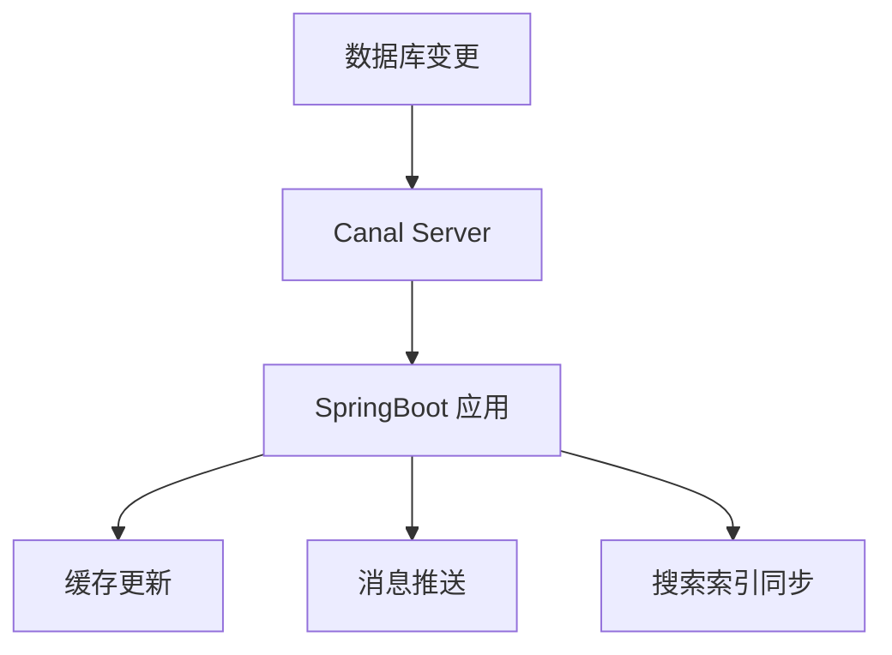

在很多业务系统中，我们都希望能够快速感知数据库中数据的变化，例如：

- 用户信息更新时同步到缓存；
- 订单状态改变后推送消息；
- 增量同步 MySQL 数据到 Elasticsearch。

这些场景的共同点是：我们想要捕获数据库变更事件（Change Data Capture，CDC）。

本文将介绍 Canal 的基本原理，并演示如何通过 canal-spring-boot-starter 在 Spring Boot 项目中轻松集成。

## 一、什么是 Canal？ ##

Canal 是阿里巴巴开源的 MySQL Binlog 增量订阅 & 消费组件。

它的核心原理是伪装成一个 MySQL 的从节点，从主节点拉取 Binlog 日志，解析其中的数据变更事件，然后将这些变化事件推送给客户端。

简单来说，Canal 就是帮我们从 MySQL 的 Binlog 中读取数据变更明细，然后我们在业务层面进行处理。

### Canal 工作原理示意图 ###

```mermaid

```

## 二、Canal 与 Spring Boot 集成 ##

传统方式下，我们需要自己编写 Canal Client 来连接 Canal Server 并处理消息。而现在有更便捷的方式 —— 使用 canal-spring-boot-starter。

该 Starter 基于注解驱动，极大简化了 Canal 客户端的开发工作。

### 添加依赖 ###

在 `pom.xml` 中加入以下依赖：

```xml
<dependency>
    <groupId>top.javatool</groupId>
    <artifactId>canal-spring-boot-starter</artifactId>
    <version>1.2.1-RELEASE</version>
</dependency>
```

### 基本配置 ###

在 Spring Boot 的 application.yml 中配置 Canal 服务端连接信息：

```yaml
canal:
  server: 127.0.0.1:11111
  destination: example
  username:
  password:
```

说明：

- server 为 Canal Server 的地址和端口；
- destination 对应你在 Canal Server 中配置的实例名。

### 修改实体类 ###

把数据库表对应的实体类添加注解,通过 `@Id`、`@Column` 等注解完成Item与数据库表字段的映射：

```java
import com.baomidou.mybatisplus.annotation.IdType;
import com.baomidou.mybatisplus.annotation.TableField;
import com.baomidou.mybatisplus.annotation.TableId;
import com.baomidou.mybatisplus.annotation.TableName;
import lombok.Data;
import org.springframework.data.annotation.Id;
import org.springframework.data.annotation.Transient;

import javax.persistence.Column;
import java.util.Date;

@Data
@TableName("tb_item")
public class Item {
    @TableId(type = IdType.AUTO)
    @Id
    private Long id;//商品id
    @Column(name = "name")
    private String name;//商品名称
    private String title;//商品标题
    private Long price;//价格（分）
    private String image;//商品图片
    private String category;//分类名称
    private String brand;//品牌名称
    private String spec;//规格
    private Integer status;//商品状态 1-正常，2-下架
    private Date createTime;//创建时间
    private Date updateTime;//更新时间
    @TableField(exist = false)
    @Transient
    private Integer stock;
    @TableField(exist = false)
    @Transient
    private Integer sold;
}
```

### 编写监听类 ###

通过实现 `EntryHandler<T>` 接口编写监听器，监听Canal消息。注意两点：

- 实现类通过 `@CanalTable("tb_item")` 指定监听的表信息
- EntryHandler的泛型是与表对应的实体类

```java
import com.github.benmanes.caffeine.cache.Cache;
import com.heima.item.config.RedisHandler;
import com.heima.item.pojo.Item;
import org.springframework.beans.factory.annotation.Autowired;
import org.springframework.stereotype.Component;
import top.javatool.canal.client.annotation.CanalTable;
import top.javatool.canal.client.handler.EntryHandler;

@CanalTable("tb_item")
@Component
public class ItemHandler implements EntryHandler<Item> {

    @Autowired
    private RedisHandler redisHandler;
    @Autowired
    private Cache<Long, Item> itemCache;

    @Override
    public void insert(Item item) {
        // 写数据到JVM进程缓存
        itemCache.put(item.getId(), item);
        // 写数据到redis
        redisHandler.saveItem(item);
    }

    @Override
    public void update(Item before, Item after) {
        // 写数据到JVM进程缓存
        itemCache.put(after.getId(), after);
        // 写数据到redis
        redisHandler.saveItem(after);
    }

    @Override
    public void delete(Item item) {
        // 删除数据到JVM进程缓存
        itemCache.invalidate(item.getId());
        // 删除数据到redis
        redisHandler.deleteItemById(item.getId());
    }
}
```

## 三、测试流程 ##

1. 启动 Canal Server；
2. 启动 Spring Boot 应用；
3. 在 MySQL 中执行简单的增删改操作；
4. 在应用日志中可以看到相应的变更输出信息。

比如：

```sql
INSERT INTO user(id, name, age) VALUES(1, 'Alice', 18);
```

应用控制台会输出：

```txt
User inserted: {id=1, name=Alice, age=18}
```

## 四、实际应用场景 ##


|  场景   |      实现思路   |
| :-----------: | :-----------: |
| 缓存同步 | 监听变更后自动更新 Redis 缓存 |
| 搜索同步 | 捕获更新事件推送至 Elasticsearch |
| 数据审计 | 将 Binlog 日志内容记录到审计系统 |
| 事件通知 | 针对特定业务表，触发消息通知（如订单状态变更） |

## 五、总结 ##

- Canal 是基于 Binlog 的数据变更订阅系统；
- 使用 canal-spring-boot-starter 可以大幅降低集成复杂度；
- 在分布式架构中，通过 Canal 可实现数据库与缓存、消息队列、搜索引擎的实时联动。


