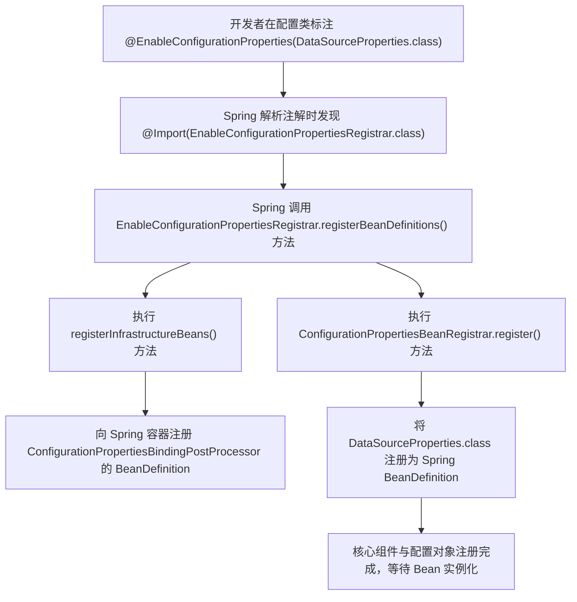

在 Spring Boot 开发中，`@ConfigurationProperties` 是实现配置文件与 Java Bean 绑定的核心注解。它能够优雅地将 `application.yml` 或 `application.properties` 中的配置项自动映射为 Java 实体类的属性，不仅避免了重复使用 `@Value` 注解的繁琐，还提供了类型转换、属性校验、松散绑定等增强能力。

本文将从基本使用实践、核心组件原理、底层实现流程和高级特性扩展四个维度，全面拆解 `@ConfigurationProperties` 的工作机制，帮助开发者掌握配置管理的最佳实践。

## 一、基本使用：从配置到 Bean 的映射落地 ##

`@ConfigurationProperties` 的核心目标是建立 “配置文件 - Java 实体类” 的映射关系，核心步骤分为 “定义配置绑定对象” 和 “启用配置绑定” 两步。以下以最常见的数据源配置场景为例，展开具体实践。

### 定义配置绑定对象 ###

首先创建一个 Java 实体类，通过 `@ConfigurationProperties` 注解指定配置前缀（对应配置文件中的层级路径），并定义与配置项同名的属性（支持驼峰命名与横杠命名的自动映射，例如 driverClassName 可匹配配置文件中的 `driver-class-name`）。

```java
import org.springframework.beans.factory.InitializingBean;
import org.springframework.beans.factory.BeanClassLoaderAware;
import org.springframework.boot.context.properties.ConfigurationProperties;

/**
 * 数据源配置绑定对象
 * 前缀 prefix = "spring.datasource" 对应配置文件中 spring.datasource 下的所有配置项
 */
@ConfigurationProperties(prefix = "spring.datasource")
public class DataSourceProperties implements BeanClassLoaderAware, InitializingBean {

    /**
     * 数据库驱动类名（可选，Spring Boot 可自动推断）
     */
    private String driverClassName;

    /**
     * JDBC 数据库连接URL（必填，如 jdbc:mysql://localhost:3306/test）
     */
    private String url;

    /**
     * 数据库登录用户名
     */
    private String username;

    /**
     * 数据库登录密码
     */
    private String password;

    // 省略 getter/setter 方法（必须提供，否则无法注入值）
    // 实现 BeanClassLoaderAware、InitializingBean 接口的方法（可选，用于扩展初始化逻辑）
    @Override
    public void setBeanClassLoader(ClassLoader classLoader) {
        // 自定义类加载器逻辑（如加载特定驱动类）
    }

    @Override
    public void afterPropertiesSet() throws Exception {
        // 属性注入完成后的校验逻辑（如检查 url 是否为空）
        if (url == null || url.trim().isEmpty()) {
            throw new IllegalArgumentException("spring.datasource.url 配置不能为空");
        }
    }

    /**
     * 自定义方法：推断数据库名称（从 url 中提取）
     */
    public String determineDatabaseName() {
        if (url.contains("/")) {
            String path = url.split("\\?")[0];
            return path.substring(path.lastIndexOf("/") + 1);
        }
        return "defaultDB";
    }
}
```

关键说明：

- 配置前缀（prefix）：必须与配置文件中的层级严格对应。例如 `prefix = "spring.datasource"` 对应配置文件中 `spring.datasource.url`、`spring.datasource.username` 等配置项；

- Getter/Setter 必要性：Spring 通过 Setter 方法注入配置值，若省略则会导致配置绑定失败；

配置文件示例（application.yml）：

```yaml
spring:
  datasource:
    url: jdbc:h2:mem:testdb
    username: sa
    password: ""
    driver-class-name: org.h2.Driver
```

### 启用配置绑定并注入使用 ###

定义好配置对象后，需通过 `@EnableConfigurationProperties` 注解启用绑定功能，并将配置对象注册为 Spring Bean。该注解通常结合 `@Configuration` 配置类使用，后续可通过依赖注入直接使用配置对象。

```java
import org.springframework.beans.factory.BeanClassLoaderAware;
import org.springframework.boot.autoconfigure.jdbc.EmbeddedDatabaseConnection;
import org.springframework.boot.context.properties.EnableConfigurationProperties;
import org.springframework.context.annotation.Bean;
import org.springframework.context.annotation.Configuration;
import org.springframework.jdbc.datasource.embedded.EmbeddedDatabase;
import org.springframework.jdbc.datasource.embedded.EmbeddedDatabaseBuilder;

/**
 * 嵌入式数据源配置类
 * proxyBeanMethods = false：禁用 Bean 方法代理（非必要时提升性能）
 */
@Configuration(proxyBeanMethods = false)
// 启用 DataSourceProperties 的配置绑定，并将其注册为 Spring Bean
@EnableConfigurationProperties(DataSourceProperties.class)
public class EmbeddedDataSourceConfiguration implements BeanClassLoaderAware {

    private ClassLoader classLoader;

    /**
     * 注册嵌入式数据源 Bean
     * 依赖 DataSourceProperties：Spring 自动注入绑定后的配置对象
     */
    @Bean(destroyMethod = "shutdown") // 容器销毁时调用 shutdown 方法关闭数据源
    public EmbeddedDatabase dataSource(DataSourceProperties properties) {
        return new EmbeddedDatabaseBuilder()
                // 从类加载器推断嵌入式数据库类型（如 H2、HSQLDB）
                .setType(EmbeddedDatabaseConnection.get(this.classLoader).getType())
                // 从配置对象中获取数据库名称（自定义方法）
                .setName(properties.determineDatabaseName())
                // 构建数据源（默认会初始化必要的数据库脚本，如 schema.sql）
                .build();
    }

    @Override
    public void setBeanClassLoader(ClassLoader classLoader) {
        this.classLoader = classLoader;
    }
}
```

核心要点：

- `@EnableConfigurationProperties` 的双重作用：

  - 启用 `@ConfigurationProperties` 注解的绑定能力，让 Spring 识别并处理配置对象；
  - 将 `DataSourceProperties` 自动注册为 Spring 单例 Bean，无需额外添加 `@Component` 注解；

- 依赖注入：配置类中通过方法参数（如 `dataSource(DataSourceProperties properties)`）注入配置对象时，Spring 已完成配置值的绑定，可直接使用其属性和自定义方法；

- 资源释放：`destroyMethod = "shutdown"` 确保容器关闭时，数据源能正常释放连接池等资源，避免内存泄漏。

## 二、关键对象：配置绑定的核心组件 ##

`@ConfigurationProperties` 的绑定能力并非孤立存在，而是依赖于 Spring Boot 内置的两个核心组件：`ConfigurationPropertiesBindingPostProcessor ` 和 `EnableConfigurationPropertiesRegistrar`。二者协同工作，分别负责 “配置注入执行” 和 “核心组件注册”。

### ConfigurationPropertiesBindingPostProcessor ###

- 核心定位：实现 `BeanPostProcessor` 接口的后置处理器，是配置绑定的 “执行引擎”；

  - 核心职责：拦截所有标注 `@ConfigurationProperties` 的 Bean 的创建过程，在 Bean 初始化前（`postProcessBeforeInitialization` 方法）完成配置值的注入；

- 工作流程拆解：

  - 识别目标 Bean：在 Bean 实例化后，检查其是否标注 `@ConfigurationProperties` 注解，或是否通过 `@EnableConfigurationProperties` 关联；
  - 提取配置前缀：从注解中获取 prefix 属性，确定需要绑定的配置项层级（如 `spring.datasource`）；
  - 获取配置值：从 Spring 环境（Environment）中读取前缀对应的所有配置项（包括配置文件、系统属性、命令行参数等）；
  - 类型转换与注入：通过 `ConfigurationPropertiesBinder` 工具类，将配置值转换为 Bean 属性的类型（如字符串转整数、集合），并通过 Setter 方法注入；

- 特殊特性：作为 “基础设施 Bean”，其优先级高于普通 Bean，确保所有配置绑定 Bean 都能被拦截处理。

### EnableConfigurationPropertiesRegistrar ###

- 核心定位：实现 `ImportBeanDefinitionRegistrar` 接口的注册器，由 `@EnableConfigurationProperties` 注解通过 `@Import` 隐式引入；
- 核心职责：在 Spring 启动阶段完成两个关键操作，为配置绑定搭建基础环境；

  - 注册 `ConfigurationPropertiesBindingPostProcessor`：将后置处理器的 BeanDefinition 注册到 Spring 容器，使其能在 Bean 创建时生效；
  - 注册配置对象 Bean：将 `@EnableConfigurationProperties` 注解 value 属性指定的配置类（如 `DataSourceProperties.class`）注册为 BeanDefinition，后续由 Spring 实例化并触发绑定；

- 执行时机：Spring 解析 `@Import` 注解时触发，早于普通 Bean 的扫描和注册流程，确保核心组件优先就绪。

## 三、实现流程：从注解到配置注入的完整链路 ##

`@ConfigurationProperties` 的整个工作流程可分为核心组件注册和配置注入执行两个阶段。以下结合流程图，拆解每个环节的具体逻辑。

### 阶段 1：核心组件与配置对象的注册流程 ###

该阶段的目标是通过 `@EnableConfigurationProperties` 触发注册器，完成 “后置处理器” 和 “配置对象” 的注册，为后续注入做准备。



关键节点说明：

- `@Import` 注解的作用：`@EnableConfigurationProperties` 内部通过 `@Import` 引入注册器，这是 Spring 中 “通过注解动态注册 Bean” 的标准模式；
- 基础设施 Bean 的优先级：`ConfigurationPropertiesBindingPostProcessor` 被标记为 “基础设施 Bean”，不会被普通组件扫描过滤，确保全局生效；
- 配置对象的注册：`DataSourceProperties` 无需添加 `@Component` 注解，仅通过 `@EnableConfigurationProperties` 的 value 属性即可完成注册。

### 阶段 2：配置注入的执行流程 ###

当 Spring 开始实例化配置对象（如 `DataSourceProperties`）时，`ConfigurationPropertiesBindingPostProcessor` 会拦截流程，完成配置值的注入。

```mermaid
graph TD
    A["Spring 开始实例化 DataSourceProperties Bean（调用构造方法）"]
    A --> B["Bean 实例化完成，进入后置处理阶段"]
    B --> C["Spring 调用 ConfigurationPropertiesBindingPostProcessor.postProcessBeforeInitialization() 方法"]
    C --> D["调用 ConfigurationPropertiesBean.get(bean, beanName) 方法检查是否为配置绑定 Bean"]
    D --> E{"是否标注 &#x3C;br/>@ConfigurationProperties&#x3C;br/> 或关联配置？"}
    E -->|否| F["直接返回 Bean，不执行绑定逻辑"]
    E -->|是| G["提取 @ConfigurationProperties 注解的 prefix（如 spring.datasource）"]
    G --> H["调用 ConfigurationPropertiesBinder.bind() 方法执行绑定"]
    H --> I["从 Spring Environment 中读取 prefix 对应的所有配置项"]
    I --> J["执行类型转换（如 String → Integer、String → List&#x3C;String>）"]
    J --> K["通过 Setter 方法将配置值注入 Bean 属性"]
    K --> L["执行 Bean 初始化逻辑（如 InitializingBean.afterPropertiesSet()）"]
    L --> M["配置绑定完成，返回注入后的 DataSourceProperties Bean"]
```



关键细节说明：

- 配置来源：Environment 是 Spring 的环境抽象，包含配置文件、系统属性、命令行参数、环境变量等所有配置信息，ConfigurationPropertiesBinder 从这里统一获取配置值；

- 类型转换能力：支持自动转换多种类型：

  - 基本类型：如配置文件中的字符串 "100" 自动转为 Integer 类型的 100；
  - 集合类型：如配置 `spring.datasource.whitelist=127.0.0.1,192.168.1.1` 自动转为 `List<String>`；
  - 嵌套对象：如配置 `spring.datasource.hikari.max-pool-size=10` 可映射到 `DataSourceProperties` 中的嵌套类 `HikariProperties` 的 `maxPoolSize` 属性；

- 绑定时机：在 Bean 初始化前（`postProcessBeforeInitialization`）执行，确保 `afterPropertiesSet` 等初始化方法中能使用已绑定的配置值；

- 容错机制：若配置文件中缺少非必填属性，Bean 属性会保持默认值（如 String 为 null、int 为 0）；若属性为必填（如加了 `@NotBlank`），则会抛出 BindException 异常。

## 四、扩展说明：高级特性 ##

- 属性校验：结合 `javax.validation` 注解（如 `@NotNull`、`@Min`、`@Pattern`）实现配置校验，需添加 `spring-boot-starter-validation` 依赖，并在配置类标注 `@Validated`：

```java
@ConfigurationProperties(prefix = "spring.datasource")
@Validated // 启用校验
public class DataSourceProperties {
    @NotNull(message = "driverClassName 不能为空")
    private String driverClassName;
    
    @Pattern(regexp = "^jdbc:.*$", message = "url 必须以 jdbc: 开头")
    private String url;
    // ...
}
```

- 嵌套对象绑定：支持配置项的多层级嵌套，对应实体类的嵌套属性。例如配置 Hikari 连接池参数：

```yaml
# 配置文件
spring:
  datasource:
    hikari:
      max-pool-size: 10
      connection-timeout: 30000
```

对应的配置对象：

```java
// 实体类
@ConfigurationProperties(prefix = "spring.datasource")
public class DataSourceProperties {
    private Hikari hikari; // 嵌套类
    public static class Hikari {
        private int maxPoolSize;
        private long connectionTimeout;
        // getter/setter
    }
    // getter/setter
}
```

- 松散绑定：支持配置项命名风格的自动映射（如 `max-pool-size` → `maxPoolSize`、`MAX_POOL_SIZE`），无需严格一致。

## 五、总结 ##

`@ConfigurationProperties` 是 Spring Boot 简化配置管理的核心注解，其底层通过 `EnableConfigurationPropertiesRegistrar` 注册核心组件，再由 `ConfigurationPropertiesBindingPostProcessor` 拦截 Bean 创建流程，完成配置文件到实体类的绑定。掌握其基本使用、核心组件和实现流程，能帮助开发者更优雅地管理配置，避免硬编码，同时支持配置校验、类型转换等高级特性，提升项目的可维护性。

在实际开发中，建议将不同模块的配置（如数据源、缓存、第三方服务）拆分到独立的 `@ConfigurationProperties` 类中，配合 `@EnableConfigurationProperties` 启用绑定，让配置管理更清晰、更具扩展性。
