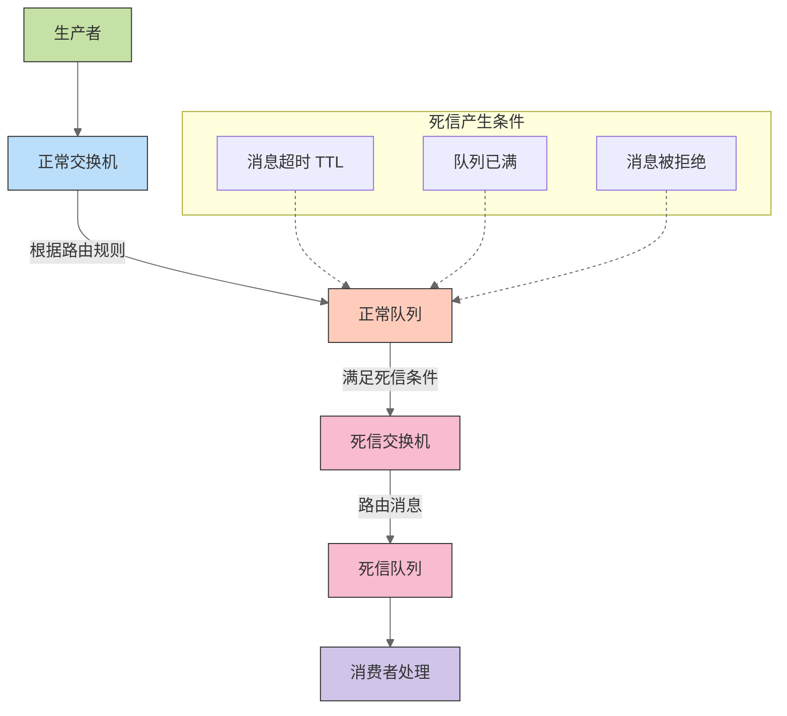

## 一、为什么要使用死信队列 ##

在分布式系统的消息处理过程中，常常会遇到消息无法被正常消费的情况，比如消息格式错误、消费者处理逻辑异常、消息队列达到最大长度等。这些问题可能导致消息丢失，影响系统的可靠性和稳定性。

为了解决这些问题，死信队列应运而生。死信队列（Dead Letter Queue，DLQ）就像是消息世界里的 “收容所”，专门用来存放那些无法被正常处理的消息，也就是所谓的 “死信”。

死信队列主要有以下几个好处：

- 提高系统可靠性：避免消息丢失，确保处理失败的消息有备份，防止因消息处理异常导致的消息无限重试。

- 异常消息管理：将异常消息与正常消息分离，便于监控和排查问题消息。

- 灵活的重试机制：支持延迟重试，可设置不同的重试策略。

- 系统解耦：业务逻辑与异常处理逻辑分离，提高代码的可维护性。

## 二、RabbitMQ 死信队列核心概念 ##

### （一）什么是死信队列 ###

死信队列（Dead Letter Queue，DLQ），其实是一种特殊的队列，主要用于存储那些因为特定原因而无法被正常消费的消息，这些消息就被称为 “死信”。简单来说，死信队列就像是一个 “消息回收站”，专门存放那些在正常消息处理流程中出现问题的消息 。

### （二）死信产生的原因 ###

死信产生的原因主要有以下几种：

- 消息被拒绝且不重新入队：当消费者调用`basic.reject`或`basic.nack`方法拒绝接收消息，并且将`requeue`参数设置为`false`时，该消息就会成为死信。比如，在一个电商订单处理系统中，当消费者接收到一个格式错误的订单消息时，就可以拒绝该消息并将其设置为不重新入队，从而使该消息进入死信队列。

- 消息过期：消息可以设置一个生存时间（TTL，Time To Live），如果在这个时间内消息没有被消费，那么该消息就会过期成为死信。比如，在一个限时优惠活动中，当一个优惠券领取消息在规定时间内没有被处理时，就可以让它过期并进入死信队列。

- 队列达到最大长度：当队列设置了最大长度限制，并且队列已满时，从交换机路由到该队列的新消息会自动成为死信。比如，在一个高并发的秒杀系统中，当订单队列达到最大长度时，新的订单消息就会成为死信。

### （三）死信队列的工作流程 ###

死信队列的工作流程涉及到正常队列、死信交换机（DLX，Dead Letter Exchange）和死信队列。正常队列在声明时，可以通过设置参数`x-dead-letter-exchange`指定死信交换机，通过参数`x-dead-letter-routing-key`指定死信消息的路由键。

当消息在正常队列中成为死信时，RabbitMQ 会自动将其转发到指定的死信交换机。死信交换机再根据路由键将死信路由到对应的死信队列。消费者可以从死信队列中获取死信消息，并进行相应的处理，如记录日志、人工干预、自动重试等。

为了更直观地理解死信队列的工作流程，我们可以参考下面这张图：



在这张图中，生产者发送消息到正常交换机，正常交换机根据路由规则将消息路由到正常队列。当正常队列中的消息满足死信产生的条件时，消息就会被转发到死信交换机，死信交换机再将消息路由到死信队列，最后由死信队列的消费者进行处理。

## 三、Spring Boot 4.0 新特性速览 ##

Spring Boot 4.0 在 2025 年 11 月 21 日正式发布，带来了众多令人瞩目的新特性，为 Java 开发领域注入了新的活力，也为整合 RabbitMQ 带来了诸多优势。

### （一）支持 Java 21 ###

Spring Boot 4.0 最低要求 Java 17，但官方强烈推荐使用 Java 21。Java 21 引入了虚拟线程、结构化并发等新特性，能够显著提升应用程序的性能和并发处理能力。Spring Boot 4.0 对 Java 21 的支持，使得开发者可以充分利用这些新特性，优化消息处理的性能。例如，在处理大量 RabbitMQ 消息时，虚拟线程可以轻松实现高并发，减少线程上下文切换的开销，从而提高系统的吞吐量。

### （二）集成 Spring Framework 7.0 ###

Spring Boot 4.0 基于 Spring Framework 7.0 构建，带来了一系列功能升级和改进。Spring Framework 7.0 增强了对 Jakarta EE 11 的支持，包括 Servlet 6.1、JPA 3.2、Bean Validation 3.1 等规范的升级。这些升级为 Spring Boot 4.0 整合 RabbitMQ 提供了更强大的基础，使得在消息处理过程中能够更好地利用新的规范和功能，提升系统的稳定性和可维护性。

### （三）虚拟线程 ###

基于 Java 21 的虚拟线程特性，Spring Boot 4.0 重构了线程池模型，实现了 “百万级并发” 支持。通过配置spring.threads.virtual.enabled=true即可全局开启虚拟线程，原有@Async注解无需修改即可自动使用虚拟线程。在与 RabbitMQ 整合时，虚拟线程可以大大提高消息的消费速度，特别是在高并发的场景下，能够显著提升系统的性能。例如，在一个电商订单处理系统中，大量的订单消息需要被快速处理，虚拟线程可以让系统轻松应对高并发的订单消息，提高订单处理的效率。

### （四）云原生融合 ###

Spring Boot 4.0 进一步强化了对云原生的支持，与云原生生态系统的集成更加紧密。它提供了更好的容器化支持，能够更方便地在 Kubernetes 等容器编排平台上部署和运行。在整合 RabbitMQ 时，云原生融合的特性可以让消息队列服务更好地与其他云原生组件协同工作，实现弹性伸缩、故障恢复等功能。例如，在一个基于 Kubernetes 的微服务架构中，Spring Boot 应用与 RabbitMQ 可以通过云原生的方式进行集成，实现服务的高可用性和可扩展性。

### （五）GraalVM 原生镜像支持 ###

Spring Boot 4.0 将 GraalVM 原生编译从 “实验特性” 升级为 “生产级支持”，通过 AOT（提前编译）技术实现启动速度与内存占用的 “数量级优化”。传统 JVM 模式下启动的微服务，编译为原生镜像后启动时间大幅缩短，堆内存占用也显著降低。在与 RabbitMQ 整合时，原生镜像支持可以让应用更快地启动并开始处理消息，减少系统的初始化时间，提高系统的响应速度。

### （六）自动模块推导 ###

Spring Boot 4.0 引入了自动模块推导功能，对于没有模块描述符的 JAR 包，能够自动推导模块信息。这使得依赖管理更加简单和高效，减少了手动配置模块的工作量。在整合 RabbitMQ 时，自动模块推导可以让相关的依赖模块更加容易地被管理和使用，提高开发效率。

## 四、Spring Boot 4.0 整合 RabbitMQ 死信队列实战 ##

接下来，我们通过一个具体的示例来演示如何在 Spring Boot 4.0 项目中整合 RabbitMQ 死信队列。

### （一）创建 Spring Boot 项目 ###

我们可以使用 Spring Initializr 来快速创建一个 Spring Boot 项目。打开浏览器，访问start.spring.io/，在页面中进行如下配置：

- Project：选择 Maven Project。

- Language：选择 Java。

- Spring Boot：选择 4.0.0 版本。

- Group：填写项目组 ID，例如com.example。

- Artifact：填写项目唯一标识符，例如rabbitmq-dlx-demo。

- Name：填写项目名称，例如RabbitMQ DLX Demo。

- Description：填写项目描述信息。

- Packaging：选择 Jar。

- Java：选择 Java 21（因为 Spring Boot 4.0 推荐使用 Java 21）。

在 “Dependencies” 部分，点击 “Add Dependencies” 按钮，搜索并添加 “Spring for RabbitMQ” 依赖。完成配置后，点击页面下方的 “Generate” 按钮，下载生成的项目压缩包，解压到本地即可。

### （二）添加 RabbitMQ 依赖 ###

在项目的pom.xml文件中，已经自动添加了 Spring AMQP 的依赖：

```xml
<dependency>
    <groupId>org.springframework.boot</groupId>
    <artifactId>spring-boot-starter-amqp</artifactId>
</dependency>
```

这个依赖将帮助我们在 Spring Boot 项目中集成 RabbitMQ。

### （三）配置 RabbitMQ 连接 ###

在`src/main/resources`目录下的`application.yml`文件中，添加 RabbitMQ 的连接配置：

```yaml
spring:
  rabbitmq:
    host: localhost
    port: 5672
    username: guest
    password: guest
    virtual-host: /
```

上述配置中，我们指定了 RabbitMQ 服务器的地址、端口、用户名、密码和虚拟主机。如果你的 RabbitMQ 服务器有不同的配置，请根据实际情况进行修改。

### （四）配置死信队列 ###

接下来，我们需要通过配置类来定义正常队列、死信队列、死信交换机及它们之间的绑定关系。在src/main/java/com/example/rabbitmqdlxdemo目录下创建一个配置类RabbitMQConfig.java，代码如下：

```java
import org.springframework.amqp.core.*;
import org.springframework.context.annotation.Bean;
import org.springframework.context.annotation.Configuration;

@Configuration
public class RabbitMQConfig {

    // 正常队列名称
    public static final String NORMAL_QUEUE = "normal.queue";
    // 死信队列名称
    public static final String DLX_QUEUE = "dlx.queue";
    // 死信交换机名称
    public static final String DLX_EXCHANGE = "dlx.exchange";
    // 正常路由键
    public static final String NORMAL_ROUTING_KEY = "normal.routing.key";
    // 死信路由键
    public static final String DLX_ROUTING_KEY = "dlx.routing.key";

    // 定义正常队列
    @Bean("normalQueue")
    public Queue normalQueue() {
        return QueueBuilder.durable(NORMAL_QUEUE)
               .withArgument("x-dead-letter-exchange", DLX_EXCHANGE)
               .withArgument("x-dead-letter-routing-key", DLX_ROUTING_KEY)
               .build();
    }

    // 定义死信队列
    @Bean("dlxQueue")
    public Queue dlxQueue() {
        return QueueBuilder.durable(DLX_QUEUE).build();
    }

    // 定义死信交换机
    @Bean("dlxExchange")
    public DirectExchange dlxExchange() {
        return new DirectExchange(DLX_EXCHANGE);
    }

    // 绑定正常队列和死信交换机
    @Bean
    public Binding normalBinding() {
        return BindingBuilder.bind(normalQueue()).to(dlxExchange()).with(DLX_ROUTING_KEY);
    }

    // 绑定死信队列和死信交换机
    @Bean
    public Binding dlxBinding() {
        return BindingBuilder.bind(dlxQueue()).to(dlxExchange()).with(DLX_ROUTING_KEY);
    }
}
```

在上述代码中：

- 我们定义了一个正常队列`normalQueue`，并通过`withArgument`方法设置了两个参数：`x-dead-letter-exchange`指定死信交换机为`dlx.exchange`，`x-dead-letter-routing-key`指定死信路由键为`dlx.routing.key`。这意味着当正常队列中的消息成为死信时，会被发送到指定的死信交换机，并根据死信路由键路由到死信队列。

- 定义了死信队列`dlxQueue`和死信交换机`dlxExchange`，并分别创建了绑定关系`normalBinding`和`dlxBinding`，将正常队列和死信队列都绑定到死信交换机上，使用相同的死信路由键。

### （五）编写消息生产者 ###

创建一个消息生产者类MessageProducer.java，用于发送消息到正常队列。在`src/main/java/com/example/rabbitmqdlxdemo`目录下创建该类，代码如下：

```java
import org.springframework.amqp.rabbit.core.RabbitTemplate;
import org.springframework.beans.factory.annotation.Autowired;
import org.springframework.stereotype.Component;

@Component
public class MessageProducer {

    @Autowired
    private RabbitTemplate rabbitTemplate;

    // 发送简单消息
    public void sendSimpleMessage(String message) {
        rabbitTemplate.convertAndSend(RabbitMQConfig.NORMAL_ROUTING_KEY, message);
        System.out.println("发送简单消息: " + message);
    }

    // 发送对象消息
    public void sendObjectMessage(Object object) {
        rabbitTemplate.convertAndSend(RabbitMQConfig.NORMAL_ROUTING_KEY, object);
        System.out.println("发送对象消息: " + object);
    }
}
```

在上述代码中，我们通过`RabbitTemplate`的`convertAndSend`方法发送消息。`convertAndSend`方法的第一个参数是路由键，这里我们使用正常路由键`normal.routing.key`，将消息发送到正常队列。我们提供了两个方法，一个用于发送简单字符串消息，另一个用于发送对象消息。

### （六）编写消息消费者 ###

创建两个消息消费者类，一个用于消费正常队列的消息，另一个用于消费死信队列的消息。

正常队列消息消费者NormalMessageConsumer.java：

```java
import org.springframework.amqp.rabbit.annotation.RabbitListener;
import org.springframework.stereotype.Component;

@Component
public class NormalMessageConsumer {

    @RabbitListener(queues = RabbitMQConfig.NORMAL_QUEUE)
    public void receive(String message) {
        System.out.println("正常队列收到消息: " + message);
        // 模拟处理消息失败，拒绝消息并设置不重新入队，使消息进入死信队列
        boolean success = false;
        if (!success) {
            System.out.println("消息处理失败，拒绝消息并进入死信队列: " + message);
            // 这里可以根据业务逻辑进行更复杂的处理，例如记录日志、重试等
            // 这里简单地抛出异常模拟处理失败
            throw new RuntimeException("消息处理失败");
        }
    }
}
```

在上述代码中，我们使用`@RabbitListene`r注解监听正常队列`normal.queue`。当有消息到达时，receive方法会被调用。在方法中，我们简单地打印收到的消息，然后模拟处理消息失败的情况，通过抛出异常来拒绝消息并设置不重新入队，使消息进入死信队列。

死信队列消息消费者DeadLetterMessageConsumer.java：

```java
import org.springframework.amqp.rabbit.annotation.RabbitListener;
import org.springframework.stereotype.Component;

@Component
public class DeadLetterMessageConsumer {

    @RabbitListener(queues = RabbitMQConfig.DLX_QUEUE)
    public void receive(String message) {
        System.out.println("死信队列收到消息: " + message);
        // 处理死信消息，例如记录日志、人工干预等
        // 这里可以根据业务逻辑进行更复杂的处理，例如记录详细的错误信息、通知管理员等
        System.out.println("对死信消息进行处理，例如记录日志");
    }
}
```
在上述代码中，我们使用`@RabbitListener`注解监听死信队列`dlx.queue`。当有死信消息到达时，receive方法会被调用，我们在方法中简单地打印收到的死信消息，并模拟对死信消息进行处理的操作。

## 五、案例分析：电商订单超时处理 ##

在电商系统中，订单超时未支付自动关闭是一个常见的业务需求。通过使用 RabbitMQ 的死信队列结合 TTL（Time To Live，生存时间）机制，我们可以优雅地实现这一功能。下面我们将详细阐述其原理和具体实现步骤。

### （一）实现原理 ###

- 消息发送：当用户下单后，订单系统会发送一条消息到 RabbitMQ 的一个普通队列（业务队列），同时为该消息设置一个 TTL，比如 30 分钟，表示订单在 30 分钟内未支付则会超时。

- 消息过期：消息在普通队列中等待被消费，如果在 TTL 设置的时间内没有被消费，该消息就会过期成为死信。

- 死信转发：由于普通队列配置了死信交换机（DLX）和死信路由键，过期的死信会被转发到对应的死信队列。

- 订单关闭处理：消费者监听死信队列，当有消息到达时，说明有订单超时未支付，消费者会执行订单关闭的业务逻辑，例如更新订单状态为 “已取消”，释放库存等。

### （二）具体实现步骤 ###

配置延迟队列：在前面的RabbitMQConfig.java配置类中，我们已经定义了正常队列和死信队列等。现在我们可以进一步完善配置，为正常队列设置 TTL，使其成为一个延迟队列。修改normalQueue的定义如下：

```java
// 定义正常队列
@Bean("normalQueue")
public Queue normalQueue() {
    return QueueBuilder.durable(NORMAL_QUEUE)
           .withArgument("x-dead-letter-exchange", DLX_EXCHANGE)
           .withArgument("x-dead-letter-routing-key", DLX_ROUTING_KEY)
           .withArgument("x-message-ttl", 1800000) // 设置消息TTL为30分钟（30 * 60 * 1000）
           .build();
}
```
在上述代码中，我们通过`withArgument("x-message-ttl", 1800000)`为正常队列中的消息设置了 30 分钟的 TTL。当消息在该队列中存活超过 30 分钟未被消费时，就会成为死信并被转发到死信队列。

- 发送延迟消息：在订单创建时，我们需要将订单相关信息作为消息发送到正常队列。修改MessageProducer.java类，添加发送订单消息的方法：

```java
import com.example.rabbitmqdlxdemo.entity.Order; // 假设Order是订单实体类

@Component
public class MessageProducer {

    @Autowired
    private RabbitTemplate rabbitTemplate;

    // 发送简单消息
    public void sendSimpleMessage(String message) {
        rabbitTemplate.convertAndSend(RabbitMQConfig.NORMAL_ROUTING_KEY, message);
        System.out.println("发送简单消息: " + message);
    }

    // 发送对象消息
    public void sendObjectMessage(Object object) {
        rabbitTemplate.convertAndSend(RabbitMQConfig.NORMAL_ROUTING_KEY, object);
        System.out.println("发送对象消息: " + object);
    }

    // 发送订单消息
    public void sendOrderMessage(Order order) {
        rabbitTemplate.convertAndSend(RabbitMQConfig.NORMAL_ROUTING_KEY, order);
        System.out.println("发送订单消息: " + order);
    }
}
```

在实际应用中，当用户下单成功后，调用sendOrderMessage方法，将订单对象发送到正常队列。例如：

```java
@Service
public class OrderService {

    @Autowired
    private MessageProducer messageProducer;

    public void createOrder(Order order) {
        // 保存订单到数据库等操作
        //...

        // 发送订单消息到RabbitMQ
        messageProducer.sendOrderMessage(order);
    }
}
```

- 消费延迟消息：创建一个消费者类OrderConsumer.java，用于消费死信队列中的消息，执行订单超时关闭的业务逻辑。在`src/main/java/com/example/rabbitmqdlxdemo`目录下创建该类，代码如下：

```java
import com.example.rabbitmqdlxdemo.entity.Order;
import org.springframework.amqp.rabbit.annotation.RabbitListener;
import org.springframework.stereotype.Component;

@Component
public class OrderConsumer {

    @RabbitListener(queues = RabbitMQConfig.DLX_QUEUE)
    public void handleOrderTimeout(Order order) {
        System.out.println("处理订单超时关闭: " + order);
        // 执行订单关闭的业务逻辑，例如更新订单状态为“已取消”，释放库存等
        // 这里假设存在一个OrderRepository用于操作订单数据库
        // orderRepository.updateOrderStatus(order.getId(), "已取消");
        // 这里还可以添加释放库存等其他业务逻辑
        System.out.println("订单 " + order.getId() + " 已超时关闭，库存已释放");
    }
}
```

在上述代码中，`@RabbitListener(queues = RabbitMQConfig.DLX_QUEUE)`注解表示该方法监听死信队列`dlx.queue`。当有消息到达时，handleOrderTimeout方法会被调用，在方法中我们可以获取到订单对象，并执行订单关闭的业务逻辑，如更新订单状态为 “已取消”，释放库存等操作。这里假设存在一个OrderRepository用于操作订单数据库，实际应用中需要根据具体的数据库访问框架进行实现。

## 六、常见问题与解决方案 ##

在使用 Spring Boot 4.0 整合 RabbitMQ 死信队列的过程中，可能会遇到一些常见问题，下面我们将对这些问题进行分析，并提供相应的解决方案。

### （一）消息丢失问题 ###

消息丢失是消息队列使用中最常见的问题之一，可能由多种原因导致，以下是一些常见的原因分析及解决方案：

- 网络问题：生产者与 RabbitMQ 之间的网络不稳定，可能导致消息发送失败；消费者与 RabbitMQ 之间的网络问题，可能导致消息接收失败或确认消息丢失。

- 消费者异常：消费者在处理消息过程中出现异常，若没有正确处理，可能导致消息被丢弃或重新入队，进而可能丢失。

- RabbitMQ 服务器问题：RabbitMQ 服务器宕机、磁盘故障等，可能导致消息丢失，尤其是未持久化的消息。

针对消息丢失问题，我们可以采取以下解决方案：

- 开启消息确认机制：在生产者端，开启`publisher-confirm-type: correlated`配置，通过RabbitTemplate的setConfirmCallback方法注册确认回调，在回调中判断消息是否成功到达 RabbitMQ 服务器。若消息未成功到达，可以进行重试或记录日志以便后续处理。

- 持久化配置：将交换机、队列和消息都设置为持久化。在配置类中定义交换机和队列时，使用`durable(true)`方法设置为持久化；在发送消息时，设置消息的DeliveryMode为PERSISTENT。这样，即使 RabbitMQ 服务器重启，消息也不会丢失。

- 消费者异常处理：在消费者端，使用try-catch块捕获异常，避免因异常导致消息丢失。若消息处理失败，可以根据业务需求进行重试或发送到死信队列。例如，在NormalMessageConsumer类的receive方法中，可以添加如下异常处理逻辑：

```java
@Component
public class NormalMessageConsumer {

    @RabbitListener(queues = RabbitMQConfig.NORMAL_QUEUE)
    public void receive(String message) {
        try {
            System.out.println("正常队列收到消息: " + message);
            // 模拟处理消息失败，拒绝消息并设置不重新入队，使消息进入死信队列
            boolean success = false;
            if (!success) {
                System.out.println("消息处理失败，拒绝消息并进入死信队列: " + message);
                throw new RuntimeException("消息处理失败");
            }
        } catch (Exception e) {
            // 记录异常日志
            System.err.println("处理消息时发生异常: " + e.getMessage());
            // 可以选择将消息发送到死信队列
            // rabbitTemplate.convertAndSend(RabbitMQConfig.DLX_EXCHANGE, RabbitMQConfig.DLX_ROUTING_KEY, message);
        }
    }
}
```

### （二）死信队列堆积 ###

死信队列堆积是指死信队列中积累了大量的死信消息，导致队列占用过多资源，影响系统性能。死信队列堆积通常由以下原因导致：

- 大量异常消息：系统中出现大量异常消息，导致死信队列不断接收新的死信，而处理速度跟不上产生速度。

- 处理缓慢：死信队列的消费者处理死信消息的速度较慢，无法及时处理堆积的消息。

- 针对死信队列堆积问题，我们可以采取以下解决方案：

- 增加处理能力：增加死信队列消费者的数量或优化消费者的处理逻辑，提高死信消息的处理速度。可以通过配置SimpleRabbitListenerContainerFactory的concurrentConsumers和maxConcurrentConsumers属性来调整消费者线程数。

- 设置告警：通过监控工具（如 Prometheus + Grafana）实时监控死信队列的消息堆积情况，当堆积量达到一定阈值时，及时发出告警通知运维人员进行处理。

- 定期清理：定期清理死信队列中的历史消息，避免堆积过多。可以编写定时任务，定期删除死信队列中超过一定时间的消息。例如，使用 Spring 的 `@Scheduled` 注解实现定时任务：

```java
@Component
public class DeadLetterQueueCleaner {

    @Autowired
    private RabbitTemplate rabbitTemplate;

    @Scheduled(cron = "0 0 0 * * ?") // 每天凌晨执行
    public void cleanDeadLetterQueue() {
        // 获取死信队列中的消息数量
        int messageCount = rabbitTemplate.execute(channel -> {
            GetResponse response = channel.basicGet(RabbitMQConfig.DLX_QUEUE, false);
            return response != null? 1 : 0;
        });

        if (messageCount > 0) {
            // 这里可以根据实际情况设置清理条件，例如只清理超过一定时间的消息
            rabbitTemplate.execute(channel -> {
                channel.queuePurge(RabbitMQConfig.DLX_QUEUE);
                return null;
            });
            System.out.println("死信队列已清理");
        }
    }
}
```

### （三）性能优化 ###

在使用 Spring Boot 4.0 整合 RabbitMQ 死信队列时，为了提高系统性能，可以从以下几个方面进行优化：

- 连接池配置：合理配置 RabbitMQ 的连接池参数，如connection-timeout（连接超时时间）、channel-cache-size（通道缓存大小）等，减少连接创建和销毁的开销。在application.yml文件中可以进行如下配置：

```yaml
spring:
  rabbitmq:
    connection-timeout: 5s
    listener:
      simple:
        connection-recovery-interval: 5000 # 连接恢复间隔时间
        retry:
          enabled: true # 开启重试
          max-attempts: 3 # 最大重试次数
          initial-interval: 1000 # 初始重试间隔时间（毫秒）
```

- 批量处理消息：在消费者端，可以采用批量处理消息的方式，减少消息处理的次数，提高处理效率。可以通过配置SimpleRabbitListenerContainerFactory的batchSize属性来设置批量处理的消息数量。

- 优化路由规则：合理设计交换机和队列的绑定关系，优化路由规则，减少不必要的消息转发，提高消息路由的效率。

- 合理设置队列参数：根据业务需求，合理设置队列的参数，如x-message-ttl（消息过期时间）、x-max-length（队列最大长度）等，避免因参数设置不当导致性能问题。例如，在定义正常队列时，可以根据业务场景调整 TTL：

```java
// 定义正常队列
@Bean("normalQueue")
public Queue normalQueue() {
    return QueueBuilder.durable(NORMAL_QUEUE)
           .withArgument("x-dead-letter-exchange", DLX_EXCHANGE)
           .withArgument("x-dead-letter-routing-key", DLX_ROUTING_KEY)
           .withArgument("x-message-ttl", 3600000) // 设置消息TTL为1小时（根据业务调整）
           .build();
}
```

## 七、总结与展望 ##

通过本文的介绍，我们深入了解了 Spring Boot 4.0 整合 RabbitMQ 死信队列的原理、配置和实战应用。死信队列作为消息处理中的重要机制，能够有效提高系统的可靠性和稳定性，帮助我们优雅地处理异常消息。Spring Boot 4.0 的新特性为整合 RabbitMQ 提供了更强大的支持，无论是性能提升还是与云原生的融合，都为我们构建高效、可靠的消息处理系统提供了便利。

在实际项目中，希望大家能够根据业务需求，灵活运用死信队列和 Spring Boot 4.0 的新特性，优化消息处理流程，提升系统的整体性能和可靠性。同时，随着技术的不断发展，消息处理领域也在持续演进，未来我们可以期待更高效、智能的消息处理解决方案的出现，为分布式系统的发展注入新的活力。

如果你在使用 Spring Boot 4.0 整合 RabbitMQ 死信队列的过程中有任何问题或经验，欢迎在评论区留言分享，让我们一起交流进步！

> 为啥那么讲解死信队列，因为好多人不会使用，不知道什么场景下使用，此案例是我在公司实现的一种方式，让大家都可以学习到

## 一、死信队列的好处 ##

### 提高系统可靠性 ###

- 避免消息丢失，确保处理失败的消息有备份
- 防止因消息处理异常导致的消息无限重试

### 异常消息管理 ###

- 将异常消息与正常消息分离
- 便于监控和排查问题消息

### 灵活的重试机制 ###

- 支持延迟重试
- 可设置不同的重试策略

### 系统解耦 ###

- 业务逻辑与异常处理逻辑分离
- 提高代码的可维护性

## 二、注解式配置说明 ##

### 主配置注解 ###

```java
@Configuration
public class RabbitMQConfig {
    
    // 主队列
    @Bean
    public Queue orderQueue() {
        return QueueBuilder.durable("order.queue")
            .deadLetterExchange("dlx.exchange")  // 死信交换器
            .deadLetterRoutingKey("dlx.routing.key")  // 死信路由键
            .ttl(10000)  // 消息10秒未消费进入死信
            .maxLength(1000)  // 队列最大长度
            .build();
    }
    
    // 死信队列
    @Bean
    public Queue deadLetterQueue() {
        return QueueBuilder.durable("dl.queue")
            .build();
    }
    
    // 死信交换器
    @Bean
    public DirectExchange deadLetterExchange() {
        return new DirectExchange("dlx.exchange");
    }
    
    // 绑定死信交换器和队列
    @Bean
    public Binding deadLetterBinding() {
        return BindingBuilder.bind(deadLetterQueue())
            .to(deadLetterExchange())
            .with("dlx.routing.key");
    }
}
```

### 监听器注解 ###

```java
@Component
public class OrderMessageListener {
    
    // 监听正常队列
    @RabbitListener(queues = "order.queue")
    public void processOrderMessage(OrderDTO order, 
                                   Channel channel, 
                                   @Header(AmqpHeaders.DELIVERY_TAG) long tag) {
        try {
            // 业务处理逻辑
            if (processOrder(order)) {
                // 手动确认
                channel.basicAck(tag, false);
            } else {
                // 拒绝消息，进入死信队列
                channel.basicNack(tag, false, false);
            }
        } catch (Exception e) {
            // 异常时拒绝
            channel.basicNack(tag, false, false);
        }
    }
    
    // 监听死信队列
    @RabbitListener(queues = "dl.queue")
    public void processDeadLetter(OrderDTO order) {
        log.error("收到死信消息: {}", order);
        // 死信消息处理逻辑
        handleDeadLetter(order);
    }
}
```

## 三、详细整合步骤 ##

### 添加依赖 ###

```xml
<dependency>
    <groupId>org.springframework.boot</groupId>
    <artifactId>spring-boot-starter-amqp</artifactId>
</dependency>
```

### 配置属性 ###

```yaml
spring:
  rabbitmq:
    host: localhost
    port: 5672
    username: guest
    password: guest
    # 开启消息返回机制
    publisher-returns: true
    # 开启确认机制
    publisher-confirm-type: correlated
    listener:
      simple:
        # 手动确认
        acknowledge-mode: manual
        # 重试配置
        retry:
          enabled: true
          max-attempts: 3
          initial-interval: 1000
```

### 完整配置类 ###

```java
@Configuration
@Slf4j
public class RabbitMQFullConfig {
    
    // ========== 正常业务队列配置 ==========
    @Bean
    public DirectExchange orderExchange() {
        return new DirectExchange("order.exchange", true, false);
    }
    
    @Bean
    public Queue orderQueue() {
        Map<String, Object> args = new HashMap<>();
        // 死信交换器
        args.put("x-dead-letter-exchange", "order.dlx.exchange");
        // 死信路由键
        args.put("x-dead-letter-routing-key", "order.dlx.key");
        // 消息TTL（毫秒）
        args.put("x-message-ttl", 30000);
        // 队列最大长度
        args.put("x-max-length", 10000);
        return QueueBuilder.durable("order.queue")
            .withArguments(args)
            .build();
    }
    
    @Bean
    public Binding orderBinding() {
        return BindingBuilder.bind(orderQueue())
            .to(orderExchange())
            .with("order.key");
    }
    
    // ========== 死信队列配置 ==========
    @Bean
    public DirectExchange deadLetterExchange() {
        return new DirectExchange("order.dlx.exchange", true, false);
    }
    
    @Bean
    public Queue deadLetterQueue() {
        return QueueBuilder.durable("order.dl.queue")
            .build();
    }
    
    @Bean
    public Binding deadLetterBinding() {
        return BindingBuilder.bind(deadLetterQueue())
            .to(deadLetterExchange())
            .with("order.dlx.key");
    }
    
    // ========== 重试队列（延时队列替代方案）==========
    @Bean
    public CustomExchange delayExchange() {
        Map<String, Object> args = new HashMap<>();
        args.put("x-delayed-type", "direct");
        return new CustomExchange("delay.exchange", 
            "x-delayed-message", true, false, args);
    }
    
    @Bean
    public Queue delayQueue() {
        return QueueBuilder.durable("delay.queue")
            .build();
    }
    
    @Bean
    public Binding delayBinding() {
        return BindingBuilder.bind(delayQueue())
            .to(delayExchange())
            .with("delay.key")
            .noargs();
    }
}
```

### 消息生产者 ###

```java
@Component
@Slf4j
public class MessageProducer {
    
    @Autowired
    private RabbitTemplate rabbitTemplate;
    
    // 发送普通消息
    public void sendOrderMessage(OrderDTO order) {
        CorrelationData correlationData = new CorrelationData(order.getId());
        
        rabbitTemplate.convertAndSend(
            "order.exchange",
            "order.key",
            order,
            message -> {
                // 设置消息属性
                message.getMessageProperties()
                    .setExpiration("30000")  // 消息TTL
                    .setDeliveryMode(MessageDeliveryMode.PERSISTENT);
                return message;
            },
            correlationData
        );
        
        // 确认回调
        correlationData.getFuture().addCallback(
            result -> {
                if (result.isAck()) {
                    log.info("消息发送成功: {}", order.getId());
                }
            },
            ex -> log.error("消息发送失败: {}", ex.getMessage())
        );
    }
    
    // 发送延迟消息
    public void sendDelayMessage(OrderDTO order, int delayTime) {
        rabbitTemplate.convertAndSend(
            "delay.exchange",
            "delay.key",
            order,
            message -> {
                message.getMessageProperties()
                    .setHeader("x-delay", delayTime);
                return message;
            }
        );
    }
}
```

### 消息消费者（完整版） ###

```java
@Component
@Slf4j
public class OrderMessageConsumer {
    
    private static final int MAX_RETRY_COUNT = 3;
    
    @Autowired
    private MessageProducer messageProducer;
    
    /**
     * 监听订单队列
     */
    @RabbitListener(queues = "order.queue")
    public void handleOrderMessage(
            @Payload OrderDTO order,
            @Headers Map<String, Object> headers,
            Channel channel,
            @Header(AmqpHeaders.DELIVERY_TAG) long deliveryTag) {
        
        try {
            log.info("收到订单消息: {}", order);
            
            // 模拟业务处理
            boolean success = processOrderBusiness(order);
            
            if (success) {
                // 业务成功，确认消息
                channel.basicAck(deliveryTag, false);
                log.info("订单处理成功: {}", order.getId());
            } else {
                // 获取重试次数
                Integer retryCount = (Integer) headers.get("x-retry-count");
                retryCount = (retryCount == null) ? 1 : retryCount + 1;
                
                if (retryCount <= MAX_RETRY_COUNT) {
                    // 重试次数未超限，重新入队
                    log.warn("订单处理失败，第{}次重试: {}", retryCount, order.getId());
                    
                    // 设置重试计数
                    headers.put("x-retry-count", retryCount);
                    
                    // 延迟重试
                    messageProducer.sendDelayMessage(order, 5000);
                    
                    // 确认消息，避免重新投递
                    channel.basicAck(deliveryTag, false);
                } else {
                    // 超过重试次数，进入死信队列
                    log.error("订单处理失败次数超过上限，进入死信队列: {}", order.getId());
                    channel.basicNack(deliveryTag, false, false);
                }
            }
        } catch (Exception e) {
            log.error("处理订单消息异常: {}", e.getMessage());
            try {
                // 拒绝消息，进入死信队列
                channel.basicNack(deliveryTag, false, false);
            } catch (IOException ex) {
                log.error("拒绝消息失败: {}", ex.getMessage());
            }
        }
    }
    
    /**
     * 监听死信队列
     */
    @RabbitListener(queues = "order.dl.queue")
    public void handleDeadLetterMessage(
            @Payload OrderDTO order,
            @Headers Map<String, Object> headers) {
        
        log.error("收到死信消息: {}", order);
        
        // 记录死信消息
        logDeadLetter(order, headers);
        
        // 发送告警
        sendAlert(order);
        
        // 人工处理或其他补偿措施
        manualProcess(order);
    }
    
    /**
     * 监听延迟队列
     */
    @RabbitListener(queues = "delay.queue")
    public void handleDelayMessage(@Payload OrderDTO order) {
        log.info("收到延迟消息，开始重试: {}", order);
        
        // 重新发送到订单队列
        messageProducer.sendOrderMessage(order);
    }
    
    private boolean processOrderBusiness(OrderDTO order) {
        // 业务处理逻辑
        // 返回true表示成功，false表示失败
        return new Random().nextBoolean();
    }
    
    private void logDeadLetter(OrderDTO order, Map<String, Object> headers) {
        // 记录死信日志
        log.info("记录死信: {}, headers: {}", order, headers);
    }
    
    private void sendAlert(OrderDTO order) {
        // 发送告警通知
        log.warn("发送告警: 订单{}处理失败", order.getId());
    }
    
    private void manualProcess(OrderDTO order) {
        // 人工处理逻辑
        log.info("等待人工处理订单: {}", order.getId());
    }
}
```

## 四、使用场景 ##

### 订单超时取消 ###

```java
// 订单创建时发送延迟消息
public void createOrder(OrderDTO order) {
    // 保存订单
    orderService.save(order);
    
    // 发送30分钟过期的消息
    rabbitTemplate.convertAndSend(
        "order.exchange",
        "order.key",
        order,
        message -> {
            message.getMessageProperties()
                .setExpiration("1800000");  // 30分钟
            return message;
        }
    );
}
```

### 支付回调重试 ###

```java
// 支付回调失败时进入死信队列，人工处理
@RabbitListener(queues = "payment.callback.queue")
public void handlePaymentCallback(PaymentDTO payment) {
    if (!paymentService.processCallback(payment)) {
        throw new RuntimeException("支付回调处理失败");
    }
}
```

### 库存锁定与释放 ###

```java
// 库存锁定15分钟后自动释放
public void lockInventory(String orderId) {
    inventoryService.lock(orderId);
    
    // 发送15分钟后到期的消息
    rabbitTemplate.convertAndSend(
        "inventory.exchange",
        "inventory.lock.key",
        orderId,
        message -> {
            message.getMessageProperties()
                .setExpiration("900000");  // 15分钟
            return message;
        }
    );
}
```

### 消息重试机制 ###

```java
// 分级重试策略
public class RetryStrategy {
    // 第一次重试：5秒后
    // 第二次重试：30秒后
    // 第三次重试：5分钟后
    // 超过3次进入死信队列
}
```

## 五、优点总结 ##

- 可靠性：确保消息不丢失，即使处理失败也有备份
- 灵活性：支持多种死信策略（超时、长度限制、拒绝等）
- 可维护性：异常处理与正常业务逻辑分离
- 监控性：死信队列便于监控和统计异常消息
- 可扩展性：支持多种重试和补偿机制

## 六、最佳实践建议 ##

- 合理设置TTL：根据业务需求设置合适的过期时间
- 监控死信队列：设置告警，及时处理死信消息
- 限制队列大小：防止消息积压
- 记录详细日志：便于问题排查
- 死信消息分析：定期分析死信原因，优化系统

通过Spring Boot整合RabbitMQ死信队列，可以构建更加健壮、可靠的消息驱动系统，有效处理各种异常场景，提高系统的整体稳定性。
