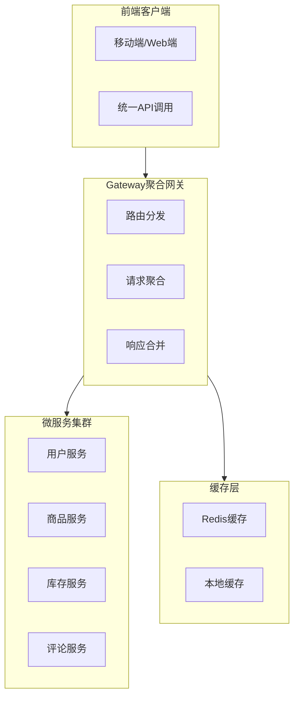

## 引言 ##

在微服务架构盛行的今天，我们经常面临一个头疼的问题：前端需要展示一个完整的页面，却要调用七八个不同的微服务接口。用户点一下刷新，后端就要发起一堆请求，不仅网络开销大，响应速度还慢得像蜗牛。

有没有办法让这些请求合并成一个？就像GraphQL那样，一次调用就能拿到所有需要的数据。今天就来聊聊如何用Spring Cloud Gateway实现这种GraphQL-like的请求聚合功能。

## 为什么需要请求聚合？ ##

### 传统微服务调用的问题 ###

想象一下电商商品详情页的场景：

- 用户服务：获取商家信息
- 商品服务：获取商品基本信息
- 库存服务：获取库存状态
- 评论服务：获取用户评价
- 推荐服务：获取相关推荐

如果前端直接调用这5个服务，会有什么问题？

- *网络开销大*：5次HTTP请求，每次都有TCP握手、SSL协商等开销
- *响应时间长*：串行调用需要5倍的延迟，即使并行调用也有网络波动影响
- *客户端复杂*：需要处理多个异步请求、错误处理、数据整合
- *服务耦合*：前端需要了解每个服务的接口细节

### 请求聚合的价值 ###

通过网关层的请求聚合，我们可以：

- 减少网络请求：从N次请求合并为1次
- 提升响应速度：并行调用下游服务
- 简化客户端：统一的API接口
- 增强控制力：在网关层统一处理认证、限流、缓存

## 整体架构设计 ##

我们的请求聚合架构是这样的：



## 核心实现方案 ##

### 方案一：基于Gateway Filter的聚合 ###

这是最灵活的方案，通过自定义GlobalFilter实现：

```java
@Component
public class RequestAggregationFilter implements GlobalFilter {
    
    @Override
    public Mono<Void> filter(ServerWebExchange exchange, GatewayFilterChain chain) {
        // 判断是否为聚合请求
        if (isAggregationRequest(exchange)) {
            return handleAggregationRequest(exchange);
        }
        return chain.filter(exchange);
    }
    
    private Mono<Void> handleAggregationRequest(ServerWebExchange exchange) {
        // 1. 解析聚合配置
        AggregationConfig config = parseAggregationConfig(exchange);
        
        // 2. 并行调用多个服务
        List<Mono<ServiceResponse>> serviceCalls = config.getServices()
            .stream()
            .map(service -> callService(service))
            .collect(Collectors.toList());
        
        // 3. 等待所有服务响应
        return Mono.zip(serviceCalls, responses -> {
            // 4. 合并响应数据
            AggregatedResponse result = mergeResponses(responses);
            // 5. 返回聚合结果
            return writeResponse(exchange, result);
        }).then();
    }
}
```

### 方案二：基于路由配置的聚合 ###

通过配置文件定义聚合路由：

```yaml
spring:
  cloud:
    gateway:
      routes:
        - id: product-detail-aggregation
          uri: no://op
          predicates:
            - Path=/api/aggregation/product-detail
          filters:
            - name: Aggregation
              args:
                services:
                  - userService: /api/user/{userId}
                  - productService: /api/product/{productId}
                  - inventoryService: /api/inventory/{productId}
                  - reviewService: /api/reviews/{productId}
```

### 方案三：基于注解的声明式聚合 ###

提供更优雅的编程接口：

```java
@AggregationMapping("/api/product-detail")
public class ProductDetailAggregation {
    
    @ServiceCall(service = "user-service", path = "/api/user/{userId}")
    private UserInfo userInfo;
    
    @ServiceCall(service = "product-service", path = "/api/product/{productId}")
    private ProductInfo productInfo;
    
    @ServiceCall(service = "inventory-service", path = "/api/inventory/{productId}")
    private InventoryInfo inventoryInfo;
    
    // 自动聚合结果
    public ProductDetailResponse aggregate() {
        return new ProductDetailResponse(userInfo, productInfo, inventoryInfo);
    }
}
```

## 关键技术要点 ##

### 并行调用优化 ###

```java
@Service
public class ParallelServiceCaller {
    
    public Mono<AggregatedResponse> callServices(List<ServiceCall> calls) {
        // 使用WebClient进行并行调用
        List<Mono<ServiceResponse>> monoList = calls.stream()
            .map(this::callService)
            .collect(Collectors.toList());
        
        // 等待所有请求完成
        return Mono.zip(monoList, this::mergeResponses);
    }
    
    private Mono<ServiceResponse> callService(ServiceCall call) {
        return webClient.get()
            .uri(call.getUrl())
            .retrieve()
            .bodyToMono(ServiceResponse.class)
            .timeout(Duration.ofSeconds(5))
            .onErrorResume(this::handleError);
    }
}
```

### 响应数据合并 ###

```java
@Component
public class ResponseMerger {
    
    public AggregatedResponse mergeResponses(Object[] responses) {
        Map<String, Object> result = new HashMap<>();
        
        // 按服务名称组织响应数据
        for (int i = 0; i < responses.length; i++) {
            ServiceResponse response = (ServiceResponse) responses[i];
            result.put(response.getServiceName(), response.getData());
        }
        
        return AggregatedResponse.builder()
            .data(result)
            .timestamp(Instant.now())
            .build();
    }
}
```

### 错误处理和降级 ###

```java
@Component
public class AggregationErrorHandler {
    
    public ServiceResponse handleServiceError(Throwable error, ServiceCall call) {
        // 记录错误日志
        log.error("Service call failed: {}", call.getServiceName(), error);
        
        // 返回降级数据
        return ServiceResponse.builder()
            .serviceName(call.getServiceName())
            .data(getFallbackData(call))
            .error(error.getMessage())
            .build();
    }
    
    private Object getFallbackData(ServiceCall call) {
        // 根据服务类型返回默认数据
        switch (call.getServiceName()) {
            case "user-service":
                return getDefaultUser();
            case "product-service":
                return getDefaultProduct();
            default:
                return Collections.emptyMap();
        }
    }
}
```

## 配置管理设计 ##

### 聚合配置实体 ###

```java
@Data
@Builder
public class AggregationConfig {
    private String aggregationPath;      // 聚合接口路径
    private List<ServiceCall> services;  // 需要调用的服务列表
    private TimeoutConfig timeout;       // 超时配置
    private RetryConfig retry;           // 重试配置
    private CacheConfig cache;           // 缓存配置
}

@Data
public class ServiceCall {
    private String serviceName;    // 服务名称
    private String path;           // 请求路径
    private HttpMethod method;     // HTTP方法
    private Map<String, String> headers; // 请求头
    private String requestBody;    // 请求体
}
```

### 动态配置加载 ###

```java
@Component
public class AggregationConfigManager {
    
    private final Map<String, AggregationConfig> configCache = new ConcurrentHashMap<>();
    
    @PostConstruct
    public void loadConfigs() {
        // 从配置中心加载聚合配置
        List<AggregationConfig> configs = configService.loadAggregationConfigs();
        configs.forEach(config -> 
            configCache.put(config.getAggregationPath(), config)
        );
    }
    
    public AggregationConfig getConfig(String path) {
        return configCache.get(path);
    }
    
    // 支持配置热更新
    @EventListener
    public void handleConfigChange(ConfigChangeEvent event) {
        if (event.getConfigType() == ConfigType.AGGREGATION) {
            AggregationConfig updatedConfig = event.getConfig();
            configCache.put(updatedConfig.getAggregationPath(), updatedConfig);
        }
    }
}
```

## 缓存策略优化 ##

### 多级缓存设计 ###

```java
@Component
public class AggregationCacheManager {
    
    // 一级缓存：本地缓存（快速响应）
    private final Cache<String, AggregatedResponse> localCache = 
        Caffeine.newBuilder()
            .maximumSize(1000)
            .expireAfterWrite(Duration.ofMinutes(5))
            .build();
    
    // 二级缓存：Redis缓存（共享缓存）
    @Autowired
    private RedisTemplate<String, AggregatedResponse> redisTemplate;
    
    public Mono<AggregatedResponse> getCachedResponse(String cacheKey) {
        // 先查本地缓存
        AggregatedResponse localResult = localCache.getIfPresent(cacheKey);
        if (localResult != null) {
            return Mono.just(localResult);
        }
        
        // 再查Redis缓存
        return redisTemplate.opsForValue()
            .get(cacheKey)
            .doOnNext(result -> {
                if (result != null) {
                    // 回填本地缓存
                    localCache.put(cacheKey, result);
                }
            });
    }
    
    public void cacheResponse(String cacheKey, AggregatedResponse response) {
        // 同时更新两级缓存
        localCache.put(cacheKey, response);
        redisTemplate.opsForValue().set(cacheKey, response, Duration.ofMinutes(30));
    }
}
```

## 监控和治理 ##

### 性能监控指标 ###

```java
@Component
public class AggregationMetricsCollector {
    
    private final MeterRegistry meterRegistry;
    
    public void recordAggregationCall(String aggregationPath, long duration, boolean success) {
        // 记录调用次数
        Counter.builder("aggregation.calls.total")
            .tag("path", aggregationPath)
            .tag("success", String.valueOf(success))
            .register(meterRegistry)
            .increment();
        
        // 记录响应时间
        Timer.builder("aggregation.calls.duration")
            .tag("path", aggregationPath)
            .register(meterRegistry)
            .record(duration, TimeUnit.MILLISECONDS);
        
        // 记录各服务调用时间
        // ...
    }
}
```

### 熔断降级配置 ###

```java
@Configuration
public class AggregationCircuitBreakerConfig {
    
    @Bean
    public Customizer<ReactiveResilience4JCircuitBreakerFactory> defaultCustomizer() {
        return factory -> factory.configureDefault(id -> new Resilience4JConfigBuilder(id)
            .circuitBreakerConfig(CircuitBreakerConfig.custom()
                .failureRateThreshold(50)
                .waitDurationInOpenState(Duration.ofSeconds(10))
                .slidingWindowSize(10)
                .build())
            .timeLimiterConfig(TimeLimiterConfig.custom()
                .timeoutDuration(Duration.ofSeconds(3))
                .build())
            .build());
    }
}
```

## 业务场景应用 ##

### 场景一：电商商品详情页 ###

```json5
// 聚合配置示例
{
  "aggregationPath": "/api/product-detail/{productId}",
  "services": [
    {
      "serviceName": "product-service",
      "path": "/api/product/{productId}",
      "cacheTtl": 3600
    },
    {
      "serviceName": "inventory-service",
      "path": "/api/inventory/{productId}",
      "cacheTtl": 300
    },
    {
      "serviceName": "review-service",
      "path": "/api/reviews/{productId}?limit=5",
      "cacheTtl": 1800
    }
  ]
}
```

### 场景二：用户个人中心 ###

```json5
// 用户信息聚合
{
  "aggregationPath": "/api/user-profile/{userId}",
  "services": [
    {
      "serviceName": "user-service",
      "path": "/api/user/{userId}"
    },
    {
      "serviceName": "order-service",
      "path": "/api/user/{userId}/recent-orders?limit=10"
    },
    {
      "serviceName": "coupon-service",
      "path": "/api/user/{userId}/available-coupons"
    }
  ]
}
```

### 场景三：Dashboard数据面板 ###

```json
// 仪表板数据聚合
{
  "aggregationPath": "/api/dashboard/overview",
  "services": [
    {
      "serviceName": "analytics-service",
      "path": "/api/analytics/today-summary"
    },
    {
      "serviceName": "user-service",
      "path": "/api/users/active-count"
    },
    {
      "serviceName": "order-service",
      "path": "/api/orders/today-count"
    }
  ]
}
```

## 最佳实践建议 ##

### 性能优化 ###

- 合理设置并行度，避免线程池耗尽
- 对不同服务设置不同的超时时间
- 使用连接池优化HTTP客户端性能
- 实施分级缓存策略

### 容错处理 ###

- 为每个服务调用设置独立的熔断器
- 实现部分成功场景的优雅降级
- 记录详细的错误日志用于问题排查
- 提供fallback数据保证基本可用性

### 配置管理 ###

- 支持聚合配置的热更新
- 提供配置版本管理和回滚机制
- 实施配置的权限控制和审计
- 建立配置变更的测试验证流程

### 监控告警 ###

- 监控聚合接口的调用成功率
- 跟踪各服务的响应时间和错误率
- 设置性能阈值告警
- 建立容量规划和扩容机制

## 写在最后 ##

请求聚合看似简单，实则是微服务架构下的一项重要优化。它不仅能够显著提升系统性能，更重要的是为前端开发提供了更好的API体验。

关键要点总结：

- 理解业务场景：不是所有接口都需要聚合，要识别真正有价值的场景
- 平衡复杂度：聚合功能会增加系统复杂度，需要权衡收益和成本
- 重视监控：聚合接口成为关键路径，必须有完善的监控体系
- 渐进式实施：从简单场景开始，逐步扩展到复杂业务

通过Spring Cloud Gateway实现请求聚合，我们能够在保持微服务架构优势的同时，为前端提供类似GraphQL的优雅体验。这不仅是技术实现，更是架构设计思维的体现。
