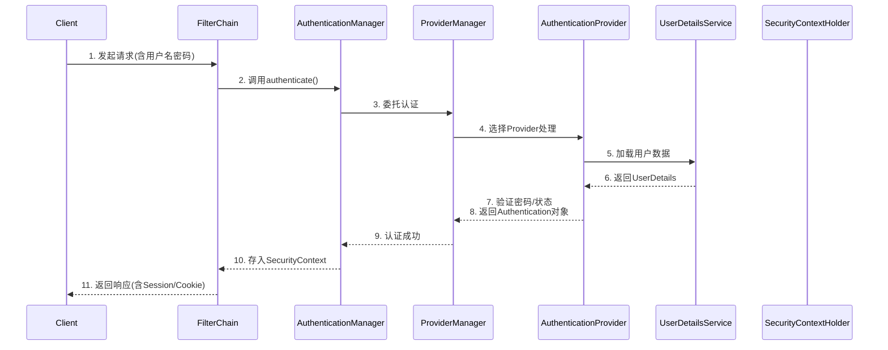
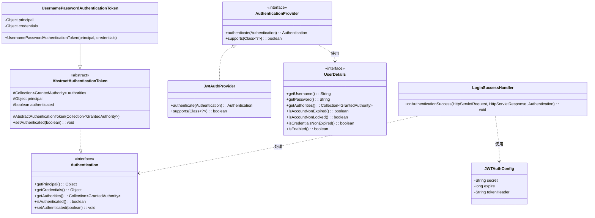
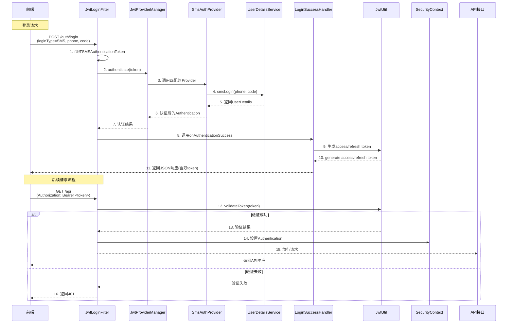
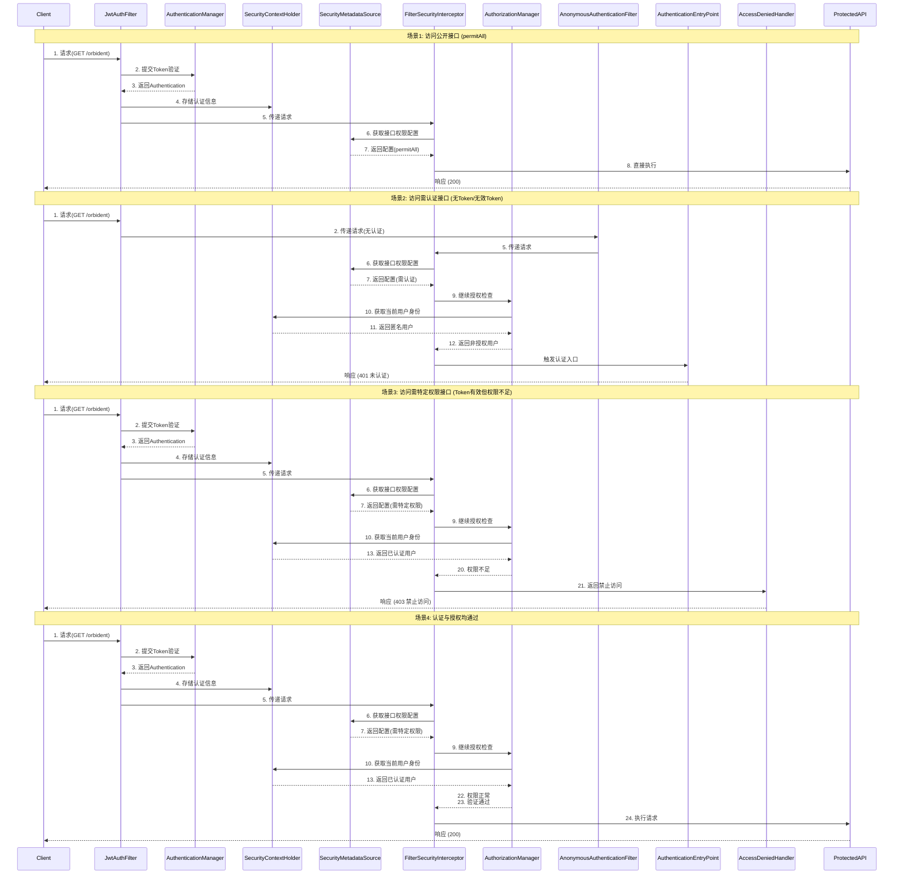
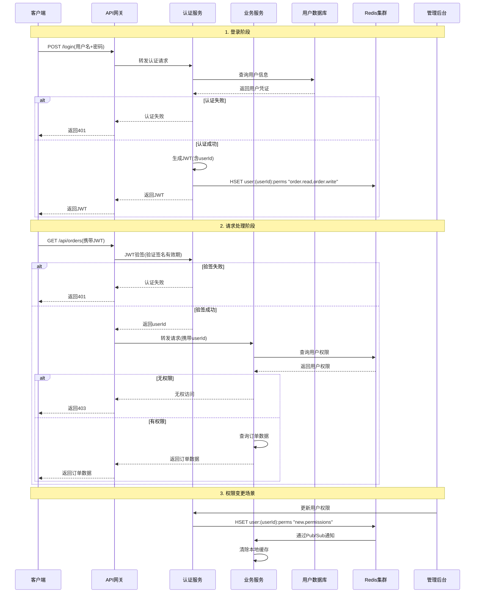
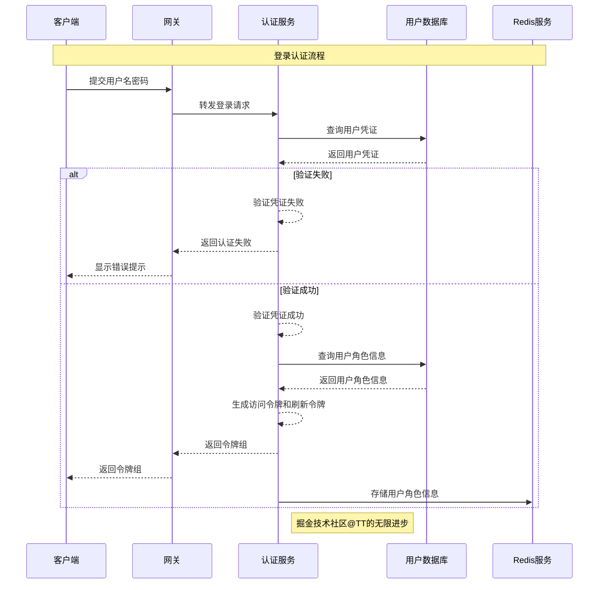
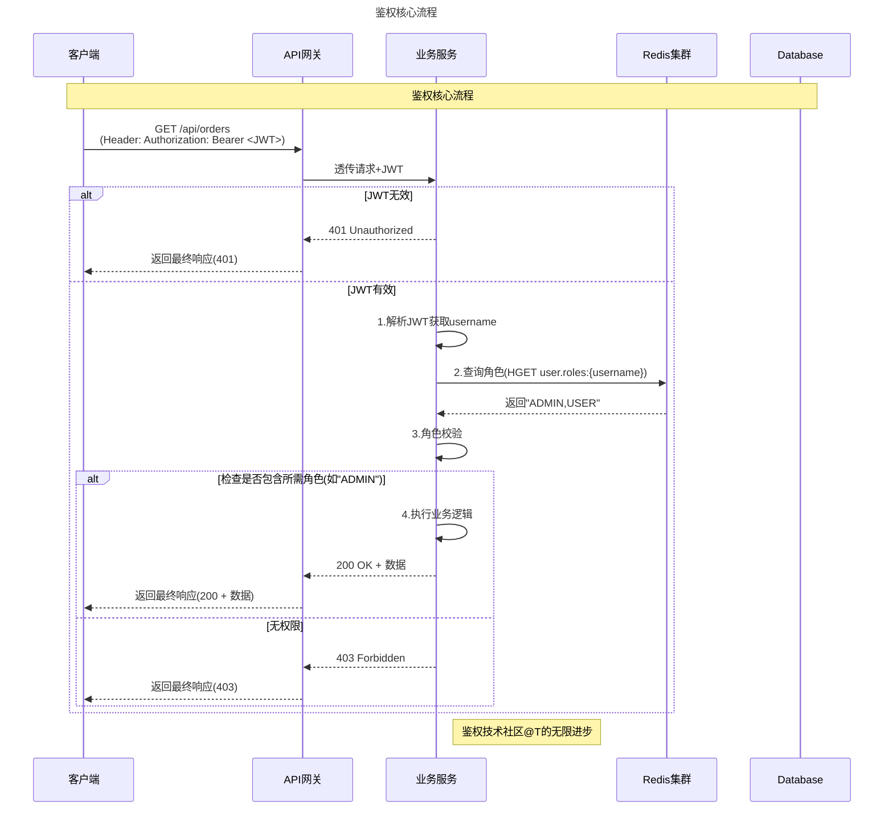

## 前言 ##

> Spring Security 是一个功能强大且高度且可定制的身份验证和访问控制框架，包含标准的身份认证和授权。
> 本文主要介绍SpringBoot中如何配置使用 Spring Security 安全认证框架并简述相关原理和步骤。

## 核心认证流程解析 ##



### 请求过滤 ###

- 用户提交登录表单
- `AbstractAuthenticationProcessingFilter` 过滤请求，创建 `AbstractAuthenticationToken`

以默认提供的 `UsernamePasswordAuthenticationFilter` 举例：

```java
public class UsernamePasswordAuthenticationFilter extends
  AbstractAuthenticationProcessingFilter {

 public UsernamePasswordAuthenticationFilter() {
        // 设置过滤规则
  super(new AntPathRequestMatcher("/login", "POST"));
 }

 public Authentication attemptAuthentication(HttpServletRequest request,
   HttpServletResponse response) throws AuthenticationException {
        // ......
  String username = obtainUsername(request);
  String password = obtainPassword(request);

  if (username == null) {
   username = "";
  }

  if (password == null) {
   password = "";
  }

  username = username.trim();

        // 根据请求参数设置 UsernamePasswordAuthenticationToken 实例
  UsernamePasswordAuthenticationToken authRequest = new UsernamePasswordAuthenticationToken(
    username, password);
  setDetails(request, authRequest);

  return this.getAuthenticationManager().authenticate(authRequest);
 }

 // ......
}
```

### 认证管理器 ###

- `AuthenticationManager`（通常是 `ProviderManager`）协调认证过程，根据 `AbstractAuthenticationToken` 类型 选择对应的 `AuthenticationProvider`

在 `ProviderManager` 中根据不同的 `Token` 类型匹配不同的 `Provider`

```java
public Authentication authenticate(Authentication authentication)
        throws AuthenticationException {
    Class<? extends Authentication> toTest = authentication.getClass();
    AuthenticationException lastException = null;
    AuthenticationException parentException = null;
    Authentication result = null;
    Authentication parentResult = null;
    boolean debug = logger.isDebugEnabled();

    // 遍历所有已注册的 providers ，匹配能处理当前 authentication 的 provider 进行认证处理
    for (AuthenticationProvider provider : getProviders()) {
        // 判断provider是否可以处理当前的authentication
        if (!provider.supports(toTest)) {
            continue;
        }
        try {
            // 执行认证逻辑，返回认证结果
            result = provider.authenticate(authentication);

            if (result != null) {
                copyDetails(authentication, result);
                break;
            }
        } catch (AccountStatusException | InternalAuthenticationServiceException e) {
            prepareException(e, authentication);
            throw e;
        } catch (AuthenticationException e) {
            lastException = e;
        }
    }
    // .......
    throw lastException;
}
```

匹配到对应的 `provider` 后，调用 `provider.authenticate(authentication);` 执行实际的认证过程。

> 认证过程以 `AbstractUserDetailsAuthenticationProvider`（实现`DaoAuthenticationProvider`）为例，大致过程为：
>
> `getUserDetailsService().loadUserByUsername(username);` 加载用户信息
> `preAuthenticationChecks.check(user);` 校验用户信息，是否锁定、过期、可用等
> `additionalAuthenticationChecks(user,authentication);` 验证用户密码

### 认证后处理 ###

- 认证成功：生成已认证的 `Authentication` 对象，存入 `SecurityContext`
- 认证失败：抛出 `AuthenticationException` 由 `AuthenticationEntryPoint` 处理

|  组件   |   职责 |  典型实现类   |
| :-----------: | :-----------: | :-----------: |
| AbstractAuthenticationProcessingFilter |   拦截认证请求，封装认证对象 |  UsernamePasswordAuthenticationFilter |
| AuthenticationManager |   认证流程协调者 |  ProviderManager |
| AuthenticationProvider |   执行具体认证逻辑 |  DaoAuthenticationProvider |
| UserDetailsService |   加载用户数据 |  自定义实现类 |

其中 `UsernamePasswordAuthenticationFilter` 和 `UsernamePasswordAuthenticationToken` 为框架自带的 登录请求过滤和Token实例。

如需自定义登录请求过滤和Token实例，可自行实现  `AbstractAuthenticationProcessingFilter` 和 `AbstractAuthenticationToken` 接口。

不同的 `AbstractAuthenticationToken` 通常有不同的  `AuthenticationProvider` 与之对应，用于实现不同的认证逻辑。

自定义的认证逻辑中，通常都是对 `AbstractAuthenticationToken` 和  `AuthenticationProvider` 的不同实现。

## JWT ##

JWT（JSON Web Token） 是一种轻量级的开放标准（RFC 7519），用于在网络应用间安全地传输信息。它通常用于 身份认证（Authentication） 和 数据交换（Information Exchange），特别适合 前后端分离 和 无状态（Stateless） 的应用场景。

### JWT在登录中的应用过程 ###

- 用户提交 用户名 + 密码 登录
- 服务器验证后，生成 JWT 并返回给客户端
- 客户端存储 JWT（通常放 `localStorage` 或 `Cookie`）
- 后续请求 在 `Authorization` 头携带 JWT
- 服务器 验证 JWT 签名，并解析数据

### 特点 ###

- 防篡改：签名（Signature）确保 Token 未被修改
- 可设置有效期（exp 字段）避免长期有效
- 无状态：服务器不需要存储 Session，适合分布式系统

## 自定义认证逻辑 ##

接下来根据 Spring Security 的认证过程和JWT的特点进行自定义登录逻辑的编写

### 核心类图 ###



### 登录流程 ###



### 具体实现 ###

#### JwtLoginFilter ####

实现 `AbstractAuthenticationProcessingFilter` 接口

```java
public class JwtLoginFilter extends AbstractAuthenticationProcessingFilter {
    public JwtLoginFilter() {
        // 设置当前 Filter ，也就是需要过滤的登录URL
        super(new AntPathRequestMatcher("/auth/login", "POST"));
    }

    @Override
    public Authentication attemptAuthentication(HttpServletRequest request, HttpServletResponse response)
            throws AuthenticationException, IOException, ServletException {

        // 获取前端传递登录模式
        String loginType = request.getParameter("loginType");
        Authentication authentication = null;
        // 判断前端使用的登录模式
        if (CommonConstant.LoginType.SMS.equals(loginType)) {
            // 手机短信
            String phone = request.getParameter("phone");
            String code = request.getParameter("code");
            authentication = new SmsAuthenticationToken(phone, code);
        }
        if (CommonConstant.LoginType.WX.equals(loginType)) {
            String code = request.getParameter("code");
            authentication = new WxAuthenticationToken(code);
        }

        if (authentication == null) {
            throw new UnsupportedLoginTypeException();
        }
        return getAuthenticationManager().authenticate(authentication);
    }
}
```

#### SmsAuthenticationToken ####

> TIPS：如果需要多种认证模式，如：用户密码、短信认证、扫描登录、三方认证等，可实现不同的 `Token` 实例，并实现与之对应的 `Provider`。

以短信认证 Token `SmsAuthenticationToken` 举例

```java
public class SmsAuthenticationToken extends AbstractAuthenticationToken {

    private final String phone;
    private final String code;

    public SmsAuthenticationToken(String phone, String code) {
        super(new ArrayList<>());
        this.phone = phone;
        this.code = code;
    }

    @Override
    public String getCredentials() {
        return code;
    }

    @Override
    public String getPrincipal() {
        return phone;
    }
}
```

#### SmsAuthProvider ####

具体实现短信认证的逻辑，主要工作原理是将前端传递的手机号和短信验证码进行匹配校验，如果合法，则认证成功，如果不合法，返回认证失败。

```java
@Component
public class SmsAuthProvider implements AuthenticationProvider {

    @Autowired
    private AbstractLogin abstractLogin;

    @Autowired
    private JwtUtil jwtUtil;

    /**
     * 验证手机验证码登录认证
     *
     * @param authentication the authentication request object.
     * @return
     * @throws AuthenticationException
     */
    @Override
    public Authentication authenticate(Authentication authentication) throws AuthenticationException {
        SmsAuthenticationToken token = (SmsAuthenticationToken) authentication;
        String phone = token.getPrincipal();
        String code = token.getCredentials();
        try {
            UserDetails userDetails = abstractLogin.smsLogin(phone, code);
            token.setDetails(userDetails);
        } catch (AuthenticationException authenticationException) {
            throw authenticationException;
        } catch (Exception e) {
            throw new LoginFailException();
        }
        return token;
    }

    @Override
    public boolean supports(Class<?> authentication) {
        return SmsAuthenticationToken.class.equals(authentication);
    }
}
```

## SpringBoot配置过程 ##

我们已在上述的过程中将核心的认证逻辑实现，接下来就是把对应的代码配置到 Spring Security 工程之中。

### JwtAuthConfig ###

`JwtAuthConfig` 实现 `WebSecurityConfigurerAdapter` 作为整体的配置入口

```java
@Configuration
@EnableWebSecurity
@EnableGlobalMethodSecurity(prePostEnabled = true,securedEnabled = true)
public class JwtAuthConfig extends WebSecurityConfigurerAdapter {

    @Autowired
    private JwtLoginConfig loginConfig;

    @Override
    public void configure(WebSecurity web) throws Exception {
        super.configure(web);
    }

    @Override
    protected void configure(HttpSecurity http) throws Exception {
        http
                .csrf()
                .disable()
                .formLogin()
                .disable()
                // 应用登录相关配置信息
                .apply(loginConfig)
                .and()
                .authorizeRequests()
                // 放行登录 URL 
                .antMatchers("/auth/login")
                .permitAll();
    }
}
```

该配置类中，只做了初始化的简单配置，如设置放行登录URL、禁用 csrf、禁用 默认的formLogin等。更多的登录认证配置在 `JwtLoginConfig` 中进行。

### JwtLoginConfig ###

`JwtLoginConfig` 实现了 `SecurityConfigurerAdapter`，`SecurityConfigurerAdapter` 是 Spring Security 的核心配置基类，用于自定义安全规则（如认证、授权、过滤器链等）。

配置信息如下：

```java
@Configuration
public class JwtLoginConfig extends SecurityConfigurerAdapter<DefaultSecurityFilterChain, HttpSecurity> {

    @Autowired
    private LoginSuccessHandler successHandler;
    @Autowired
    private LoginFailHandler failHandler;

    @Autowired
    private JwtProviderManager jwtProviderManager;


    /**
     * 将登录接口的过滤器配置到过滤器链中
     * 1. 配置登录成功、失败处理器
     * 2. 配置自定义的userDetailService（从数据库中获取用户数据）
     * 3. 将自定义的过滤器配置到spring security的过滤器链中，配置在UsernamePasswordAuthenticationFilter之前
     * @param http
     */
    @Override
    public void configure(HttpSecurity http) {
        JwtLoginFilter filter = new JwtLoginFilter();
        // authenticationManager 中已经预设系统内的 provider 集合
        filter.setAuthenticationManager(jwtProviderManager);
        //认证成功处理器
        filter.setAuthenticationSuccessHandler(successHandler);
        //认证失败处理器
        filter.setAuthenticationFailureHandler(failHandler);

        //将这个过滤器添加到UsernamePasswordAuthenticationFilter之后执行
        http.addFilterAfter(filter, UsernamePasswordAuthenticationFilter.class);
    }
}
```

### JwtProviderManager ###

从上文中的认证过程（时序图）中，`AuthenticationManager` 是委托 `ProviderManager`进行认证模式的匹配和执行对应的 provider。

:::tips 

为了后续的多认证模式的支持和动态匹配，所以将 ProviderManager 交给 Spring 容器管理，并且通过构造方法将平台内所有已经注册到Spring容器中的 provider进行注入，以达到自动装配的目的。

:::

注：暂只做简单实现。

```java
@Component
public class JwtProviderManager extends ProviderManager {
    public JwtProviderManager(List<AuthenticationProvider> providers) {
        super(providers);
    }
}
```

### LoginSuccessHandler ###

认证成功后，对认证结果生成JWT Token 返回前端

```java
public class LoginSuccessHandler implements AuthenticationSuccessHandler {

    @Autowired
    private JwtUtil jwtUtil;

    @Autowired
    private NacosHcUserConfigProperties configProperties;
    
    @Override
    public void onAuthenticationSuccess(
            HttpServletRequest request,
            HttpServletResponse response,
            Authentication authentication)
            throws IOException, ServletException {

        // 生成 token 返回前端
//        Object principal = authentication.getPrincipal();
        UserDetails details = (UserDetails) authentication.getDetails();
        // accessToken 过期时间 30分钟
        Long accessTokenExpireSeconds = configProperties.getAuth().getAccessTokenExpireSeconds();
        // refreshToken 过期时间 6小时
        Long refreshTokenExpireSeconds = configProperties.getAuth().getRefreshTokenExpireSeconds();
        String accessToken = jwtUtil.createToken(details.getUsername(), accessTokenExpireSeconds);
        String refreshToken = jwtUtil.createToken(accessToken, refreshTokenExpireSeconds);

        Map<String, String> tokenMap = new HashMap<>();
        tokenMap.put("accessToken", accessToken);
        tokenMap.put("refreshToken", refreshToken);

        response.setContentType(MediaType.APPLICATION_JSON_UTF8_VALUE);
        response.getWriter().write(JSON.toJSONString(ApiResult.success(tokenMap)));

    }
}
```

至此，相关 Spring Security 配置已完成！💯💯


> 下一篇继续探究 Spring Security 在登录后的认证鉴权过程。

## 前言 ##

>「认证只是安全的第一步」

在 Spring Security 实践之登录 中，我们实现了基于Spring Security的基础登录逻辑，但用户登录后：

- 🔒 如何控制不同角色访问API的权限？
- ⚖️ 如何实现方法级的细粒度权限控制？
- 🛡️ 如何进行匿名访问和接口开放？

本文将对上述问题进行注意解决。

## Spring Security 鉴权过程 ##

### 权限校验过程图解 ###



### 概述 ###

#### 请求拦截阶段 ####

- `JwtAuthFilter` 检查请求头中的 Token
- 有 Token → 进入认证流程
- 无 Token → 进入匿名（暂未生成匿名用户）处理流程

#### 认证处理阶段 ####

A. 有效 Token 流程

- `JwtAuthFilter` 解析 Token
- 调用 `AuthenticationManager` 验证 Token
- 验证通过后生成 `Authentication` 对象
- 将认证信息存入 `SecurityContextHolder`

B. 无效/缺失 Token 流程

- 验证访问资源是否为 `permitAll()`
- 如果是 `permitAll()` 资源，直接放行
- 如果不是 `permitAll()` 资源，`AnonymousAuthenticationFilter` 介入
- 生成匿名认证对象 `anonymousUser`
- 将匿名认证信息存入 `SecurityContextHolder`

### 授权检查阶段 ###

- `FilterSecurityInterceptor` 拦截请求
- 调用 `AuthorizationManager` 进行权限决策
- 从 `SecurityContextHolder` 获取当前用户权限
- 从系统配置获取接口所需权限
- 进行权限比对

### 结果处理阶段 ###

- 权限足够 → 放行请求，返回业务数据（200）
- 未认证（或匿名用户权限不足） → 触发 `AuthenticationEntryPoint`（返回 401）
- 无权限 → 触发 `AccessDeniedHandler`（返回 403）

### 核心组件清单 ###

#### 认证相关 ####

- JwtAuthFilter：Token 解析
- AuthenticationManager：认证协调
- SecurityContextHolder：存储认证信息

#### 授权相关 ####

- FilterSecurityInterceptor：最终权限检查
- AuthorizationManager：权限决策

#### 异常处理 ####

- AuthenticationEntryPoint：处理 401
- AccessDeniedHandler：处理 403

## 鉴权实现 ##

在本文中，我们主要通过自定义的 `JwtAuthFilter`
进行认证和权限信息的加载和注册。`AuthenticationEntryPoint` 和  `AccessDeniedHandler` 虽然也有实现，但只做简单实现，将错误信息进行统一化处理。

同时对于上篇 Spring Security 实践之登录 中所提及的登录逻辑进行一部分的改造，以适配后续认证鉴权的实现。

### 登录改造 ###

#### LoginSuccessHandler 修改 ####

在原有登录成功的逻辑中，我们在登录成功后将 `UserDetails` 信息存储 `UserTokenCache` 中，在后续的认证鉴权中可以直接从缓存中获取信息。

```java
public void onAuthenticationSuccess(
    HttpServletRequest request,
    HttpServletResponse response,
    Authentication authentication)
throws IOException, ServletException {

    // 生成 token 返回前端
    UserDetails details = (UserDetails) authentication.getDetails();
    // accessToken 过期时间 30分钟
    Long accessTokenExpireSeconds = configProperties.getAuth().getAccessTokenExpireSeconds();
    // refreshToken 过期时间 6小时
    Long refreshTokenExpireSeconds = configProperties.getAuth().getRefreshTokenExpireSeconds();
    String accessToken = jwtUtil.createToken(details.getUsername(), accessTokenExpireSeconds);
    String refreshToken = jwtUtil.createToken(accessToken, refreshTokenExpireSeconds);

    // 设置 TokenCache 也就是当前登录人信息
    userTokenCache.setToken(accessToken, (AuthUserInfo) details);

    Map<String, String> tokenMap = new HashMap<>();
    tokenMap.put("accessToken", accessToken);
    tokenMap.put("refreshToken", refreshToken);

    response.setContentType(MediaType.APPLICATION_JSON_UTF8_VALUE);
    response.getWriter().write(JSON.toJSONString(ApiResult.success(tokenMap)));
}
```

#### SmsAuthProvider 修改 ####

需要对原登录逻辑进行一定的调整，调整内容包括：修改原先登录成功后返回的用户信息实体；抽象化原登录逻辑，后续交给 `UserService` 进行实现。

```java
@Component
public class SmsAuthProvider implements AuthenticationProvider {

    @Autowired
    private AbstractLogin abstractLogin;

    /**
     * 验证手机验证码登录认证
     *
     * @param authentication the authentication request object.
     * @return
     * @throws AuthenticationException
     */
    @Override
    public Authentication authenticate(Authentication authentication) throws AuthenticationException {
        SmsAuthenticationToken token = (SmsAuthenticationToken) authentication;
        String phone = token.getPrincipal();
        String code = token.getCredentials();
        try {
            UserDetails userDetails = abstractLogin.smsLogin(phone, code);
            token.setDetails(userDetails);
        } catch (AuthenticationException authenticationException) {
            throw authenticationException;
        } catch (Exception e) {
            throw new LoginFailException();
        }
        return token;
    }

    @Override
    public boolean supports(Class<?> authentication) {
        return SmsAuthenticationToken.class.equals(authentication);
    }
}
```

#### AbstractLogin 定义 ####

这里只对登录过程进行定义，后续在实现 *多模式登录* 时，做具体说明，同时现阶段也是每个登录动作做出具体的定义，而非使用策略模式做相应扩展，后续再对扩展性做可行性分析。

```java
public interface AbstractLogin {

    /**
     * 短信验证码登录
     * @param phone
     * @param code
     * @return
     */
    AuthUserInfo smsLogin(String phone, String code);

    /**
     * 用户名密码登录
     * @param username
     * @param password
     * @return
     */
    AuthUserInfo userPasswordLogin(String username, String password);

    /**
     * 微信直接登录
     * @param code
     * @return
     */
    AuthUserInfo wxLogin(String code);

}
```

#### AuthUserInfo 实现 ####

`AuthUserInfo` 是对 `UserDetails` 的具体实现

```java
public class AuthUserInfo implements UserDetails {

    private String phoneNum;
    private String username;

    private List<String> roles;

    @Override
    public List<? extends GrantedAuthority> getAuthorities() {
        if (roles != null) {
            return roles.stream()
                    .map(role -> new SimpleGrantedAuthority("ROLE_" + role))
                    .collect(Collectors.toList());
        }
        return Collections.emptyList();
    }

    // ...... 
}
```

至此，我们对原登录逻辑的修改就告一段落。接下来是实际鉴权过程的实现。

### 具体实现 ###

#### 实现思路 ####

- `JwtAuthFilter` 实现 `OncePerRequestFilter` ，对所有URL（除已配置的URL外）进行请求过滤
- `JwtAuthFilter` 从请求中获取 Token 信息
- `JwtUtil` 校验及解析 Token
- 从 `UserTokenCache` 中获取用户信息并构建认证和权限信息
- 继续请求，交给后续的 Spring Security 内置的权限校验

#### JwtAuthFilter ####

```java
@Component
public class JwtAuthFilter extends OncePerRequestFilter {

    private JwtUtil jwtUtil;
    private UserTokenCache userTokenCache;

    public JwtAuthFilter(JwtUtil jwtUtil, UserTokenCache userTokenCache) {
        this.jwtUtil = jwtUtil;
        this.userTokenCache = userTokenCache;
    }
    @Override
    protected void doFilterInternal(HttpServletRequest request, HttpServletResponse response, FilterChain chain)
            throws ServletException, IOException {
        // 1. 从请求头提取Token
        String token = getToken(request);

        if (token != null && jwtUtil.validateToken(token)) {
            // 2. 构建认证对象
            Authentication auth = buildAuthentication(token);
            SecurityContextHolder.getContext().setAuthentication(auth);
        }

        // 3. 继续过滤器链
        chain.doFilter(request, response);
    }

    private String getToken(HttpServletRequest request) {
        String header = request.getHeader("Authorization");
        if (StringUtils.hasText(header) && header.startsWith("Bearer ")) {
            return header.substring(7);
        }
        return null;
    }

    /**
     * 根据JWT构建Authentication对象
     * @param token 有效的JWT令牌
     * @return 已认证的Authentication对象
     */
    public Authentication buildAuthentication(String token) {
        // 1. 从JWT中提取用户名
        String username = jwtUtil.parseToken(token);

        // 2. 加载用户信息
        // 从JWT自定义声明中直接读取权限（推荐无状态方案）
        UserDetails userDetails = getTokenUser(token);

        return new UsernamePasswordAuthenticationToken(
                userDetails.getUsername(),
                // credentials置空
                null,
                userDetails.getAuthorities()
        );
    }

    /**
     * 从缓存中获取用户权限信息
     */
    private UserDetails getTokenUser(String token) {
        // 从缓存中获取
        AuthUserInfo authUserInfo = userTokenCache.tokenUser(token);
        if (authUserInfo == null) {
            throw new UserNotLoginException();
        }

        return authUserInfo;
    }
}
```

#### UserTokenCache 缓存实现 ####

```java
@Component
public class UserTokenCache {

    private static final Logger LOGGER = LoggerFactory.getLogger(UserTokenCache.class);

    private static final String TOKEN_REDIS_PREFIX = "TOKEN::";
    private static final long TOKEN_TIME_OUT_SECOND = 30 * 60;

    @Autowired
    private RedisTemplate<String, String> redisTemplate;


    public void setToken(String token, AuthUserInfo userInfo) {
        setToken(token, JSON.toJSONString(userInfo));
    }

    private void setToken(String token, String userInfoJson) {
        ValueOperations<String, String> ops = redisTemplate.opsForValue();
        ops.set(getTokenKey(token), userInfoJson, TOKEN_TIME_OUT_SECOND, TimeUnit.SECONDS);
    }

    /**
     * 获取 token 对应的用户信息
     * 每次调用此方法获取信息，都会将token有效期延长 TOKEN_TIME_OUT_SECOND 秒
     * @param token
     * @return
     */
    public AuthUserInfo tokenUser(String token) {
        ValueOperations<String, String> ops = redisTemplate.opsForValue();
        String userJson = ops.get(getTokenKey(token));
        if (StringUtils.isEmpty(userJson)) {
            throw new UserNotLoginException();
        }
        AuthUserInfo authUserInfo = JSON.parseObject(userJson, AuthUserInfo.class);
        setToken(token, userJson);
        return authUserInfo;
    }

    String getTokenKey(String token) {
        return TOKEN_REDIS_PREFIX + token;
    }

}
```

:::tips 

该缓存设计中，在通过Token获取用户信息的同时，再次执行了 setToken 操作，对 Token 的有效期进行了顺延的操作。这也是本文中 Token 超时和延时 的具体方案。
对比双Token来说，各有利弊。

在本文的之后篇章中再做两种方案的分析。

:::

#### JwtAuthConfig 配置修改 ####

```java
@Configuration
@EnableWebSecurity
// 启用方法级别安全控制
@EnableGlobalMethodSecurity(
        // 启用Spring的@PreAuthorize等注解
        prePostEnabled = true,
        // 启用Spring的@Secured注解
        securedEnabled = true,
        // 启用JSR-250标准注解（如@RolesAllowed、@PermitAll）
        jsr250Enabled = true
)
public class JwtAuthConfig extends WebSecurityConfigurerAdapter {

    @Autowired
    private JwtLoginConfig loginConfig;

    @Autowired
    private JwtAuthFilter authFilter;

    @Autowired
    private NeedLoginHandler needLoginHandler;
    @Autowired
    private CustomAccessDeniedHandler customAccessDeniedHandler;

    @Override
    public void configure(WebSecurity web) throws Exception {
        super.configure(web);
    }

    @Override
    protected void configure(HttpSecurity http) throws Exception {
        http
                .csrf()
                .disable()
                // 禁用表单登录
                .formLogin().disable()
                // 不会写入Cookie JSESSIONID
                .sessionManagement()
                .sessionCreationPolicy(SessionCreationPolicy.STATELESS)
                .and()
                .apply(loginConfig)
                .and()
                .authorizeRequests()
                // 过滤登录等需要放开的请求
                .antMatchers("/auth/**", "/open/**").permitAll()
                // 其余请求需要登录
                .anyRequest().authenticated()
                .and()
                .addFilterBefore(authFilter, UsernamePasswordAuthenticationFilter.class)
                //定义异常处理器
                .exceptionHandling()
                // 未登录处理
                .authenticationEntryPoint(needLoginHandler)
                // 无权限处理
                .accessDeniedHandler(customAccessDeniedHandler);
    }
}
```

主要修改信息：

- 启用 Spring 的 `@PreAuthorize` 等注解
- 启用 Spring 的 `@Secured` 注解
- 启用JSR-250标准注解（如 `@RolesAllowed`、`@PermitAll`）
- `anyRequest().authenticated()` 所有请求开启登录认证信息校验
- `addFilterBefore(authFilter, UsernamePasswordAuthenticationFilter.class)` 注册请求过滤器，加载用户信息
- 定义相关权限异常处理器，`needLoginHandler` 和 `customAccessDeniedHandler` 都只做了简单实现，本文中不做具体说明

基于 Spring Security的登录认证鉴权方案已经基本完成，接下来进入验证阶段。

## 其他 ##

### Token有效期顺延 vs 双Token方案 ###

#### 单Token顺延方案 ####

实现方式

- 每次合法请求时，在返回业务数据的同时 刷新原Token有效期（重新生成或延长过期时间）
- 客户端需持续更新本地存储的Token

优点

- ✅ 实现简单：服务端只需维护单个Token的签发/刷新逻辑
- ✅ 流量优化：减少一次获取新Token的HTTP请求（对比Refresh Token方案）
- ✅ 实时性强：每次交互都检查Token活性

缺点

- ❌ 安全性风险：长期有效的Token一旦泄露，攻击窗口期较大
- ❌ 状态依赖：需要服务端记录Token过期时间（违背JWT无状态原则）
- ❌ 客户端耦合：要求客户端必须及时更新Token

适用场景

- 内部系统或低安全要求场景
- 需要简化实现的短期项目

#### 双Token方案（Access Token + Refresh Token） ####

实现方式

- Access Token：短期有效（如2小时），用于业务请求
- Refresh Token：长期有效（如7天），仅用于获取新Access Token
- 通过专用接口 `/refresh-token` 轮换Access Token

优点

- ✅ 安全性高：Access Token短期有效，泄露风险低
- ✅ 无状态性：Refresh Token可设置服务端黑名单，平衡安全与无状态
- ✅ 权限控制灵活：可独立吊销Refresh Token

缺点

- ❌ 实现复杂：需额外处理Token轮换逻辑和并发请求问题
- ❌ 网络开销：需频繁调用刷新接口
- ❌ 客户端适配：需处理Token过期和刷新的边缘情况

适用场景

- 面向公众的高安全要求系统
- 需要精细控制会话生命周期的场景

## 总结 ##

后续 Spring Security 的相关文章和方案，均会采用 *单Token顺延方案*。 主要还是简单！！

### 匿名访问/接口开放 ###

接口开放指被 `permitAll()` 标记的接口，如本文中的 `/auth/**` 和 `/open/**` 接口。

## `permitAll` 与匿名用户的本质区别 ##

### 概念差异 ###

- `permitAll()`：是 权限放行规则，直接绕过所有安全检查（不关心用户是谁）。
- 匿名用户：是 一种特殊的认证身份（`AnonymousAuthenticationToken`），仍需经过权限校验。

### 特点对比 ###

|  特性   |  `permitAll()`  |  匿名用户   |
| :-----------: | :-----------: | :-----------: |
| 本质 |   权限配置（Authorization） |  认证身份（Authentication） |
| 是否检查身份 |   ❌ 完全不检查 |  ✅ 生成 `anonymousUser` 身份 |
| 是否走权限决策 |   ❌ 直接放行 |  ✅ 需通过 `AuthorizationManager` 检查权限 |
| 典型配置 |   `.requestMatchers("/open/**").permitAll()` |  默认启用（`http.anonymous().disable()` 可关闭） |
| 安全影响 |   完全开放 |  仍受 `hasRole('ANONYMOUS')` 等规则约束 |

### 流程差异（以访问 `/api/data` 为例） ###

#### 场景1：配置为 `permitAll()` ####

```txt
.requestMatchers("/api/data").permitAll()
```

流程：

- 请求到达 `FilterSecurityInterceptor`
- 检查到 `permitAll()` → 直接放行 → 不生成身份，不检查权限

#### 场景2：未配置 `permitAll()`（启用匿名） ####

```txt
.requestMatchers("/api/data").authenticated()
```

流程：

- 请求无 Token → `AnonymousAuthenticationFilter` 生成 `AnonymousAuthenticationToken`
- `AuthorizationManager` 检查权限 → 因要求 `authenticated()`，拒绝匿名用户
- 返回 401 Unauthorized

### 差异总结 ###

目的不同：

- `permitAll()`：完全开放接口（如健康检查、静态资源）。
- 匿名用户：区分游客与登录用户（如论坛允许匿名浏览，但评论需登录）。

技术实现不同：

- `permitAll()` 的接口 不会出现在权限决策流程中。
- 匿名用户 仍属于认证体系，只是身份特殊。

安全影响不同：


- `.requestMatchers("/admin").permitAll()`   // 危险！任何人可访问管理员接口
- `.requestMatchers("/admin").hasRole("ADMIN")` // 匿名用户会被拒绝

### `PermitAll` 注解 及 配置优先级 ###

#### 启用方式 ####

Spring Security 默认不处理 `@PermitAll` 注解，必须显式启用。

```java
@Configuration
@EnableWebSecurity
@EnableGlobalMethodSecurity(jsr250Enabled = true) // 必须添加这一行
public class SecurityConfig extends WebSecurityConfigurerAdapter {
    // 其他配置...
}
```

#### 优先级问题 ####

- `@PermitAll` 与 `@PreAuthorize`：`@PreAuthorize` 优先级更高，会覆盖 `@PermitAll`
- `@PermitAll` 与 `HttpSecurity` 配置：若全局配置为 `denyAll()`，注解会被忽略（全局配置优先级最高）。
- `@PermitAll` 与 `anyRequest()` 配置：若全局配置为 `anyRequest()`，注解会被忽略（全局配置优先级最高）。

### 总结 ###

`@PermitAll` 是 Java EE/Jakarta EE 的标准安全注解，在 Spring Security 中用于声明某个类或方法允许所有用户访问（包括匿名用户），无需任何身份认证或权限检查。

优先级规则：

- 全局配置 > 方法注解 > 类注解

  - `HttpSecurity` 的规则优先级最高，其次是方法级安全注解，最后是类级 `@PermitAll`。

- 注解之间的覆盖关系

  - `@PreAuthorize` > `@RolesAllowed` > `@PermitAll`
  - 更具体的注解（方法级）会覆盖更通用的注解（类级）。

- 隐式权限冲突

  - 如果接口被标记为 `@PermitAll`，但全局配置要求认证（如 `.anyRequest().authenticated()`），实际会 要求认证（全局配置胜出）。

## 多登录模式 ##

后续计划实现 短信验证码、邮箱验证码、用户密码、扫码登录、WX授权等多种模式的登录。

具体实现可仿照 SMS 方式进行，该文不做过多赘述，后续会单独文章说明。
SMS短信认证

> 注：因各大运营商要求，目前个人开发者已无法再使用阿里云（其他厂商一样）的SMS短信服务。本文中的验证码已改为“假”验证码。后续 “多登录模式” 支持后，改用其他方式，如邮箱、密码、公众号扫码之类。

> Redis+JWT 认证管理最佳实践

在单体应用中，通过 Session 或简单的 JWT 即可完成认证与鉴权。但在分布式架构下，用户的请求可能跨越多个服务，认证和鉴权又会带来新的问题：

- 🔑 认证状态共享：用户登录后，如何让所有微服务识别其身份？
- 🔄 权限一致性：角色权限变更时，如何实时同步到所有服务？
- 🔗 跨服务安全：服务间调用（如 Feign、RPC）如何传递身份并鉴权？
- 🚨 高可用性：认证服务宕机时，如何保证系统仍能安全运行？

## 认证管理方案分析 ##

> Redis 和 JWT 都天然支持分布式场景下的认证管理。

### Redis 会话共享 ###

- 🔵 核心思路：集中存储会话数据，所有服务读取同一Redis集群
- ✅ 优势：状态完整、支持强制下线、自动过期
- ⚠️ 注意：Redis需高可用部署，网络延迟影响性能

### JWT 无状态 ###

- 🟢 核心思路：自包含签名令牌，服务本地验签不依赖存储
- ✅ 优势：无状态、高性能、天然跨域
- ⚠️ 注意：无法主动失效，需设短期有效期+刷新机制

### Redis+JWT ###

- 🟠 核心思路：JWT传递基础身份+Redis存储动态权限
- ✅ 优势：平衡性能与灵活性，支持权限实时更新
- ⚠️ 注意：需维护两种机制，架构略复杂

### 差异比对 ###

|  对比维度   |   Redis会话共享方案 |  JWT无状态方案   |   混合方案 |
| :-----------: | :-----------: | :-----------: | :-----------: |
| 核心原理 |   集中存储会话数据，所有服务读取同一Redis |  自包含签名令牌，服务本地验签 |  JWT传递身份 + Redis存储动态权限 |
| 状态管理 |   有状态 |  完全无状态 |  部分无状态（身份无状态，权限有状态） |
| 实时性 |   即时生效 |  依赖令牌过期身份 |  即时生效，权限可调控（缓存TTL） |

## Redis+JWT 方案实现 ##

该方案结合 JWT（无状态令牌） 和 Redis（动态状态管理），实现分布式环境下的高效、安全的认证与鉴权：

- JWT 负责 身份认证，携带用户基础信息（如 `user_id`），由服务端签名，客户端存储并随请求发送。
- Redis 负责 权限管理，存储动态数据（如 `roles`、权限黑名单、Refresh Token、用户设备绑定），支持实时失效和扩展性。

### Redis+JWT 方案解析 ###

整体流程的时序图



🚀 整个过程分为 3 个核心阶段，每个阶段都有明确的职责和交互逻辑，确保系统既 高性能 又 安全可控。

#### 🔑 阶段 1：用户登录（认证阶段） ####

- 📌 目标：验证用户身份，生成 Token，并预加载权限到 Redis。
- 💡 权限预加载：登录时就把权限存入 Redis，避免每次请求查数据库！
- 💡 无状态 Token：JWT 自带身份信息，业务服务可 独立验签，不依赖认证中心！

📝 流程步骤

1. 📲 用户发起登录请求

   - 客户端发送 POST `/login`，携带 用户名 + 密码（或者其他登录模式信息） 到 认证服务。

2. 🔍 认证服务校验身份

   - 认证服务查询 数据库，检查账号密码是否正确。
   - ❌ 失败 → 返回 401（登录失败）。
   - ✅ 成功 → 进入下一步！

3. 🛠️ 生成 JWT + 存储权限

   - 认证服务生成 JWT（包含 `userId` 等基本信息）。
   - 同时，将用户权限（如 `order:read`、`order:write`）存入 Redis（`HSET user:{userId}:perms`）。

4. 📤 返回 Token 给客户端

   - JWT 通过网关返回，客户端后续请求需携带它！

#### 📡 阶段 2：业务请求（鉴权阶段） ####

- 📌 目标：校验 JWT 有效性，动态检查权限，返回业务数据。
- 💡 分层校验：先 本地验签（快！），再 动态鉴权（查 Redis）。

📝 流程步骤

1. 📲 客户端发起业务请求（如 GET /api/orders）

   - 在 Authorization 头携带 JWT。

2. 🔐 业务服务验签

   - 解析 JWT，检查 签名是否有效 + 是否过期。
   - ❌ 验签失败 → 返回 401需登录。
   - ✅ 验签成功 → 进入权限检查！

3. 🛡️ 权限校验（查 Redis）

   - 业务服务查询 Redis，检查用户是否有权限（如 `HGET user:{userId}:perms "order:read"`）。
   - ❌ 无权限 → 返回 403无权限访问。
   - ✅ 有权限 → 继续执行！

4. 📊 查询数据并返回

#### 🔄 阶段 3：权限变更（实时同步）（本文不做具体说明和实现） ####

-📌 目标：管理员修改权限后，所有服务 实时生效！

📝 流程步骤

1. 👨‍💻 管理员更新权限

   - 在管理后台修改用户权限（如允许 `order:delete`）。

2. 📡 数据库 → 认证服务 → Redis

   - 数据库变更后，通知 认证服务，更新 Redis 权限数据。

- 📢 Redis Pub/Sub 通知所有业务服务

  - 通过 发布-订阅 机制，让所有业务服务 清除本地缓存，立即生效新权限！

### Redis+JWT 实现 ###

基于 Spring Security 实践之认证鉴权 文中已实现的内容进行 Redis+JWT 的混合方案实现。

#### 登录过程实现 ####

基于 Spring Security 实践之登录 中的实现过程，`JwtLoginFilter` 对登录完成请求过滤，已实现了 SMS 的短信认证，本文中实现 `UserPassword` 的登录认证。



修改 `JwtLoginFilter` 实现对 用户密码登录的支持，主要为判断前端传输的 `loginModel`是否为密码登录，在 密码登录的模式下，生成 `UserPasswordLoginAuthToken`之后，交给 `ProviderManager`进行 `Provider`的匹配，匹配到 `UserPasswordAuthProvider` 进行实际的登录操作。

`JwtLoginFilter` 修改内容：

```java
public class JwtLoginFilter extends AbstractAuthenticationProcessingFilter {
    public JwtLoginFilter() {
        // 设置当前 Filter ，也就是登录动作
        super(new AntPathRequestMatcher("/auth/login", "POST"));
    }

    @Override
    public Authentication attemptAuthentication(HttpServletRequest request, HttpServletResponse response)
            throws AuthenticationException, IOException, ServletException {

        // 规定前端传递登录模式
        String loginType = request.getParameter("loginType");
        Authentication authentication = null;
        // 判断前端使用的登录模式
        if (CommonConstant.LoginType.SMS.equals(loginType)) {
            // 手机短信
            String phone = request.getParameter("phone");
            String code = request.getParameter("code");
            authentication = new SmsAuthenticationToken(phone, code);
        }
        if (CommonConstant.LoginType.WX.equals(loginType)) {
            String code = request.getParameter("code");
            authentication = new WxAuthenticationToken(code);
        }
     // 用户名密码登录
        if (CommonConstant.LoginType.USER_PASSWORD.equals(loginType)) {
            String username = request.getParameter("username");
            String password = request.getParameter("password");
            authentication = new UserPasswordLoginAuthToken(username, password);
        }

        if (authentication == null) {
            throw new UnsupportedLoginTypeException();
        }
        return getAuthenticationManager().authenticate(authentication);
    }

}
```

`UserPasswordAuthProvider` 实现

```java
@Component
public class UserPasswordAuthProvider implements AuthenticationProvider {

    @Autowired
    private AbstractLogin abstractLogin;

    @Override
    public Authentication authenticate(Authentication authentication) throws AuthenticationException {
        UserPasswordLoginAuthToken token = (UserPasswordLoginAuthToken) authentication;
        // password 暂明文传输至后台
        String password = authentication.getCredentials().toString();
        String username = authentication.getPrincipal().toString();

        try {
            AuthUserInfo authUserInfo = abstractLogin.userPasswordLogin(username, password);
            token.setDetails(authentication);
        } catch (AuthenticationException authenticationException) {
            throw authenticationException;
        } catch (Exception e) {
            throw new LoginFailException();
        }

        return token;
    }

    @Override
    public boolean supports(Class<?> authentication) {
        return UserPasswordLoginAuthToken.class.equals(authentication);
    }
}
```

接下来需对 `LoginSuccessHandler` 和 `用户信息缓存` 进行方案改写。

改写计划：

- 双Token方案实现（AccessToken+RefreshToken）
- AccessToken中存储 UserName 简单信息（30分钟有效期）
- RefreshToken存储 UserName 简单信息， 长期有效 （12小时）
- 用户权限信息预加载至 Redis 缓存
- 返回前端 双 Token 信息
- 改写原 单Token顺延续期方案，修改 `UserTokenCache` 为 `UserAuthCache`
- 基于Redis对用户 roles 信息进行存储

基于Redis实现 UserAuthCache

```java
@Component
public class UserAuthCache {

    private static final Logger LOGGER = LoggerFactory.getLogger(UserAuthCache.class);

    private static final String AUTH_REDIS_PREFIX = "USER:AUTH::";
    /**
     * 超时时间应与 RefreshToken 一致
     * 此为 12 小时
     */
    private static final long ROLE_TIME_OUT_SECOND = 12 * 60 * 60;

    @Autowired
    private RedisTemplate<String, String> redisTemplate;

    public void setUserAuth(String username, AuthUserInfo userInfo) {
        ValueOperations<String, String> ops = redisTemplate.opsForValue();
        ops.set(getUserAuthKey(username), JSON.toJSONString(userInfo), ROLE_TIME_OUT_SECOND, TimeUnit.SECONDS);
    }

    public AuthUserInfo getUserAuth(String username) {
        ValueOperations<String, String> ops = redisTemplate.opsForValue();
        String rolesJson = ops.get(getUserAuthKey(username));

        return JSON.parseObject(rolesJson, AuthUserInfo.class);
    }


    String getUserAuthKey(String username) {
        return AUTH_REDIS_PREFIX + username;
    }

}
```

`LoginSuccessHandler` 中对双 Token 生成 和 角色信息缓存的具体实现

```java
@Component
public class LoginSuccessHandler implements AuthenticationSuccessHandler {

    /**
     * accessToken 过期时间 30分钟
     */
    private static final long ACCESS_TOKEN_TIME_OUT_SECOND = 30 * 60;
    /**
     * refreshToken 过期时间 12小时
     */
    private static final long REFRESH_TOKEN_TIME_OUT_SECOND = 12 * 60 * 60;

    @Autowired
    private JwtUtil jwtUtil;
    @Autowired
    private UserAuthCache userAuthCache;
    
    @Override
    public void onAuthenticationSuccess(
            HttpServletRequest request,
            HttpServletResponse response,
            Authentication authentication)
            throws IOException, ServletException {

        // 生成 token 返回前端
        AuthUserInfo details = (AuthUserInfo) authentication.getDetails();
        String username = details.getUsername();
        
        String accessToken = jwtUtil.createToken(username, ACCESS_TOKEN_TIME_OUT_SECOND);
        String refreshToken = jwtUtil.createToken(username, REFRESH_TOKEN_TIME_OUT_SECOND);

        // 设置 UserAuth 也就是当前登录人信息
        userAuthCache.setUserAuth(username, details);

        Map<String, String> tokenMap = new HashMap<>();
        tokenMap.put("accessToken", accessToken);
        tokenMap.put("refreshToken", refreshToken);

        response.setContentType(MediaType.APPLICATION_JSON_UTF8_VALUE);
        response.getWriter().write(JSON.toJSONString(ApiResult.success(tokenMap)));

    }
}
```

至此登录过程已完成实现，包括用户名和密码的登录模式识别匹配、密码校验、双Token生成、角色信息加载和缓存等过程。后续前端携带 accessToken 访问后台接口，后台进行认证鉴权。

#### 鉴权过程实现 ####

在 Spring Security 实践之认证鉴权 中 我们已经完成了 `JwtAuthFilter` 的实现，包括 Token 提取、验证、解析 和 角色信息加载。

本文中需要对其中的 角色信息加载做分离处理，因为在一般的系统请求中 **80% **的都是只验证是否登录，而不验证是否有某种角色权限。

这样的分离设计可以保证 80% 的请求只用CPU级别的JWT解析即可完成，极大的减少了在 单Token中与Redis的网络交互，提升处理性能。

鉴权的具体流程



- 网关透传请求
- 服务提取JWT `accessToken`
- 解析 `accessToken` 获取 `username`
- 构建基础的 `AuthenticationToken` 对象，不携带 角色信息
- 如果该请求需要进行角色权限判断，再从 Redis 中根据 `username` 获取角色信息进行动态匹配

在这种分离设计中，与原权限校验不同的是，只有当真正需要鉴权的情况下，才会从 Redis 缓存中加载用户权限信息。
分离认证信息和权限加载的方案有两种，一种是自定义 `AccessDecisionVoter` 决策投票，另一种是 重写 `AbstractAuthenticationToken` 的 `getAuthorities` 方法。

##### 🔧 复杂方案 - AccessDecisionVoter（不用） #####

SpringSecurity 已经提供了 `AccessDecisionVoter` 接口，允许我们实现自定义鉴权逻辑，比如：

- ✅ 从 Redis 缓存（`UserAuthCache`）动态加载用户角色
- ✅ 支持 `@PreAuthorize("hasRole('ADMIN')")` 注解
- ✅ 灵活控制权限校验逻辑

> 但！我们不采用这种方式！ ❌
> 
原因：实现复杂，维护成本高，需要处理投票逻辑、表达式解析，还要和 Spring Security 的默认机制兼容。

接下来我将要介绍 一种简单粗暴的方案进行实现！！！很简单！！很粗暴！

##### ⚡**简单粗暴方案 - 重写 `AbstractAuthenticationToken` 的`getAuthorities()`（推荐！）** #####

核心思想：

- 👉 无论 Spring Security 怎么玩权限校验，最终都得调用 `AbstractAuthenticationToken` 的 `getAuthorities()` 拿权限列表！
- 👉 所以，我们直接“劫持”这个方法，让它按我们的规则返回权限！

`CacheUserAuthenticationToken` 重写 `AbstractAuthenticationToken` 的逻辑跟我们一开始说的从 Redis 中根据 `username` 获取角色信息 一致，步骤包括：

- `setAuthenticated(true)` 标记当前 token 为 已认证 状态，否则会返回 401
- 设计 `authorities` 权限集合的 多级缓存 （内存+Redis）
- 获取当前 token 中的已缓存的权限集合 `cachedAuthorities` ，如果不会空，则返回
- 如果为空（null or empty），则从 `UserAuthCache` 中获取
- 将从 `UserAuthCache` 中获取到的权限集合 进行内存缓存至 `cachedAuthorities`
- 返回权限集合

优点：

- 🚀 超简单： 不用管 Spring Security 的复杂机制，直接控制权限来源！
- ⚡ 高性能： JWT+内存缓存减少 Redis 查询，80% 请求不走网络！
- 🔧 易维护： 代码清晰，逻辑集中，改权限逻辑不用动整个鉴权流程！

`CacheUserAuthenticationToken` 实现

```java
public class CacheableUserAuthenticationToken extends AbstractAuthenticationToken {

    private final UserAuthCache userAuthCache;
    private final UserDetails userDetails;

    /**
     * 缓存的 authorities 集合
     */
    private List<GrantedAuthority> cachedAuthorities;

    CacheableUserAuthenticationToken(UserDetails userDetails, UserAuthCache userAuthCache) {
        // 初始化一个空的权限集合
        super(Collections.emptyList());
        // 默认是已经认证过的 token，如果这一步设为 false 责会标记当前 token 为 未认证
        setAuthenticated(true);
        this.userAuthCache = userAuthCache;
        this.userDetails = userDetails;
    }

    /**
     * 从缓存中获取当前用户的权限集合
     *
     * @return
     */
    @Override
    public Collection<GrantedAuthority> getAuthorities() {
        if (cachedAuthorities == null || cachedAuthorities.isEmpty()) {
            AuthUserInfo userAuth = userAuthCache.getUserAuth(userDetails.getUsername());
            if (userAuth != null && userAuth.getRoles() != null) {
                cachedAuthorities = userAuth.getRoles().stream().map(
                        r -> {
                            return new GrantedAuthority() {
                                @Override
                                public String getAuthority() {
                                    return "ROLE_" + r;
                                }
                            };
                        }
                ).collect(Collectors.toList());
            }

        }
        return cachedAuthorities;
    }

    @Override
    public Object getCredentials() {
        // 凭证为空
        return null;
    }

    @Override
    public Object getPrincipal() {
        // 身份信息
        return userDetails.getUsername();
    }
}
```

同时，我们需要修改 `JwtAuthFilter`，将加载的当前用户的认证对象修改为 `CacheableUserAuthenticationToken`

```java
@Component
public class JwtAuthFilter extends OncePerRequestFilter {

    private JwtUtil jwtUtil;
    private UserAuthCache userAuthCache;

    public JwtAuthFilter(JwtUtil jwtUtil, UserAuthCache userAuthCache) {
        this.jwtUtil = jwtUtil;
        this.userAuthCache = userAuthCache;
    }

    @Override
    protected void doFilterInternal(HttpServletRequest request, HttpServletResponse response, FilterChain chain)
            throws ServletException, IOException {
        // 1. 从请求头提取Token
        String token = getToken(request);

        if (token != null && jwtUtil.validateToken(token)) {
            // 2. 构建认证对象
            Authentication auth = buildAuthentication(token);
            SecurityContextHolder.getContext().setAuthentication(auth);
        }

        // 3. 继续过滤器链
        chain.doFilter(request, response);
    }

    private String getToken(HttpServletRequest request) {
        String header = request.getHeader("Authorization");
        if (StringUtils.hasText(header) && header.startsWith("Bearer ")) {
            return header.substring(7);
        }
        return null;
    }

    /**
     * 根据JWT构建Authentication对象
     * @param token 有效的JWT令牌
     * @return 已认证的Authentication对象
     */
    public Authentication buildAuthentication(String token) {

        // 从JWT自定义声明中直接读取权限（推荐无状态方案）
        UserDetails userDetails = getTokenUser(token);
     // 构建为使用 userAuthCache 缓存的 AuthenticationToken 对象
        return new CacheableUserAuthenticationToken(userDetails, userAuthCache);
    }

    /**
     * 从缓存中获取用户权限信息
     */
    private UserDetails getTokenUser(String token) {
        String username = jwtUtil.parseToken(token);
        // 直接返回简单 AuthUserInfo
        AuthUserInfo authUserInfo = new AuthUserInfo();
        authUserInfo.setUsername(username);
        authUserInfo.setRoles(Collections.emptyList());

        return authUserInfo;
    }
}
```

至此 Redis+JWT 的认证管理方案已经大功告成。

> 就是这么简单 🎉🎉🎉🎉🎉

### 总结 ###

总结下来代码实现的关键点就 三步

1. 登录后在 Redis 中缓存该用户的权限信息
2. 后续请求提取 Header 中的 accessToken 获取用户信息，生成一个只带有 `username` 的 `CacheableUserAuthenticationToken`
3. 在 `CacheableUserAuthenticationToken` 中实现 `getAuthorities` 方法，从 Redis 缓存中获取当前用户的权限信息

#### RefreshToken过程 ####

```mermaid

```

- 客户端请求

  - 携带 过期AccessToken和 有效RefreshToken

- 服务端验证

  - 从Redis查询该用户设备对应的RefreshToken
  - 比对请求中的Token与存储的是否一致

- 新旧Token交替

  - 删除旧Token：确保单次有效性
  - 生成新Token对：新的AccessToken + RefreshToken
  - 存储新Token：Redis更新为最新RefreshToken

- 失败处理

  - 若Redis中无匹配Token，立即返回401强制重新登录

## 总结 ##

在系统的认证鉴权设计中，没有放之四海而皆准的"完美方案"，只有最适合业务场景的技术组合。Redis+JWT的混合方案，本质上是在无状态灵活性与动态控制力之间找到了最佳平衡点：

- 当JWT的无状态特性让系统轻装上阵时，Redis为它装上了可控的"刹车系统"
- 当Redis的实时管理赋予系统敏捷响应能力时，JWT又为其插上了性能的翅膀

这种设计不仅适用于认证鉴权领域，更是架构设计的核心要义——通过解耦与协作，让每个组件发挥最大价值。正如文中展现的：

- ✅ JWT如身份证——快速证明"你是谁"
- ✅ Redis如指挥中心——动态决定"你能做什么"

无限进步，进步无限
