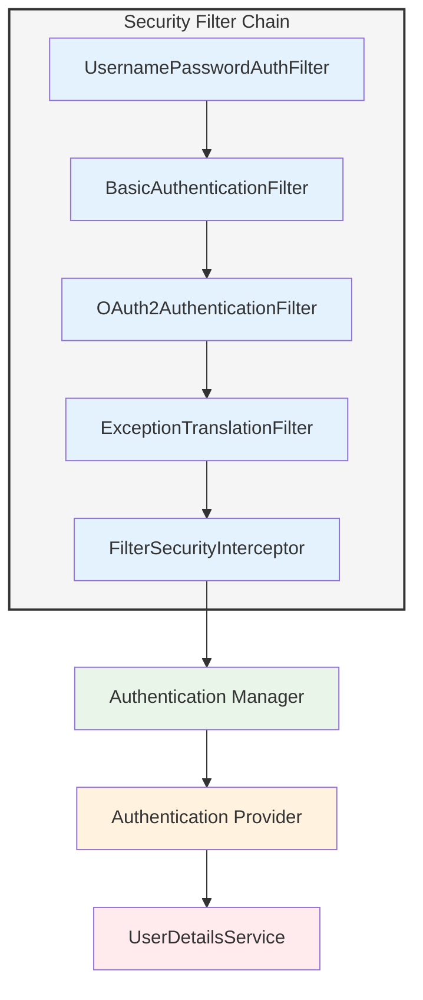
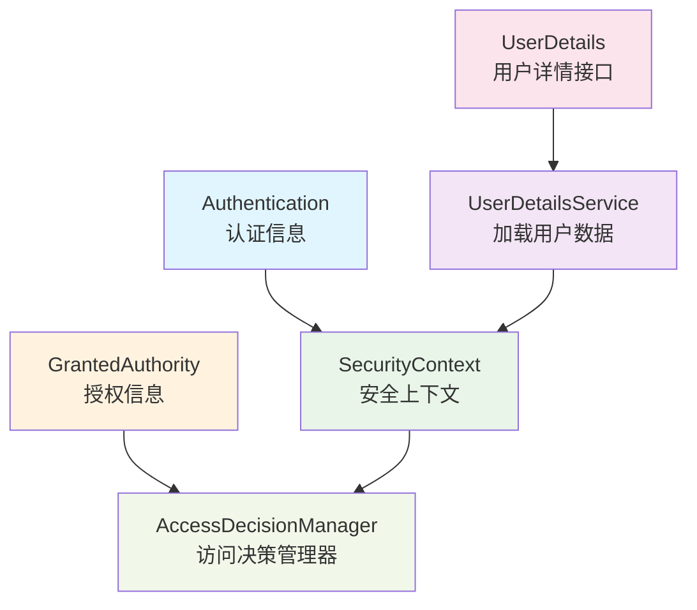
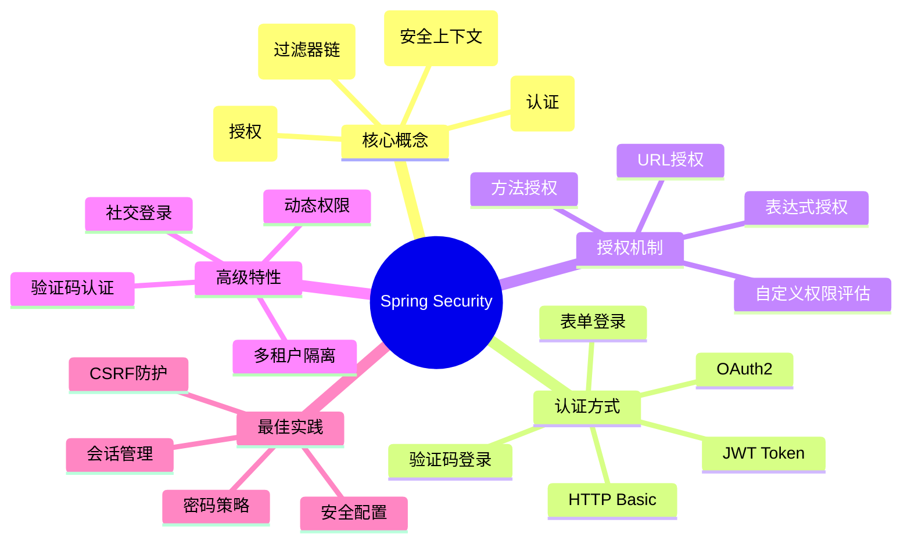

## 前言 ##

Spring Security是Spring生态系统中最强大的安全框架，为Java应用提供了全面的安全解决方案。它提供了认证、授权、防护等核心功能，广泛应用于企业级应用开发。本文将从基础概念到实战应用，全面讲解Spring Security的核心知识点。

## 一、Spring Security概述 ##

### 什么是Spring Security ###

Spring Security是一个功能强大且高度可定制的身份验证和访问控制框架，它为Java应用提供：

- 身份认证（Authentication）
- 授权（Authorization）
- 防护常见攻击（CSRF、Session Fixation等）
- 与Spring生态无缝集成



### 核心概念 ###

核心组件说明





## 二、快速开始 ##

### 添加依赖 ###

```xml
<!-- Spring Boot项目 -->
<dependency>
    <groupId>org.springframework.boot</groupId>
    <artifactId>spring-boot-starter-security</artifactId>
</dependency>

<dependency>
    <groupId>org.springframework.boot</groupId>
    <artifactId>spring-boot-starter-web</artifactId>
</dependency>
```

### 基础配置 ###

```java
/**
 * Spring Security基础配置
 */
@Configuration
@EnableWebSecurity
public class SecurityConfig {

    @Bean
    public SecurityFilterChain securityFilterChain(HttpSecurity http) throws Exception {
        http
            // 配置授权规则
            .authorizeHttpRequests(auth -> auth
                .requestMatchers("/public/**").permitAll()      // 公开接口
                .requestMatchers("/admin/**").hasRole("ADMIN")  // 需要ADMIN角色
                .anyRequest().authenticated()                   // 其他需要认证
            )
            // 配置表单登录
            .formLogin(form -> form
                .loginPage("/login")                            // 自定义登录页
                .defaultSuccessUrl("/home")                     // 登录成功跳转
                .permitAll()
            )
            // 配置登出
            .logout(logout -> logout
                .logoutUrl("/logout")
                .logoutSuccessUrl("/login?logout")
                .permitAll()
            );

        return http.build();
    }

    /**
     * 配置用户详情服务
     */
    @Bean
    public UserDetailsService userDetailsService() {
        // 内存用户（仅用于测试）
        UserDetails user = User.builder()
            .username("user")
            .password(passwordEncoder().encode("password"))
            .roles("USER")
            .build();

        UserDetails admin = User.builder()
            .username("admin")
            .password(passwordEncoder().encode("admin"))
            .roles("ADMIN", "USER")
            .build();

        return new InMemoryUserDetailsManager(user, admin);
    }

    /**
     * 密码编码器
     */
    @Bean
    public PasswordEncoder passwordEncoder() {
        return new BCryptPasswordEncoder();
    }
}
```

### 基础使用 ###

```java
/**
 * 测试Controller
 */
@RestController
public class TestController {

    @GetMapping("/public/hello")
    public String publicHello() {
        return "公开接口，无需认证";
    }

    @GetMapping("/user/profile")
    public String userProfile() {
        return "用户信息，需要认证";
    }

    @GetMapping("/admin/dashboard")
    public String adminDashboard() {
        return "管理后台，需要ADMIN角色";
    }

    @GetMapping("/current-user")
    public String currentUser(Authentication authentication) {
        return "当前用户: " + authentication.getName();
    }
}
```

## 三、认证（Authentication） ##

### 自定义UserDetailsService ###

```java
/**
 * 自定义用户详情服务
 */
@Service
public class CustomUserDetailsService implements UserDetailsService {

    @Autowired
    private UserRepository userRepository;

    @Override
    public UserDetails loadUserByUsername(String username) throws UsernameNotFoundException {
        // 从数据库加载用户
        com.example.entity.User user = userRepository.findByUsername(username)
            .orElseThrow(() -> new UsernameNotFoundException("用户不存在: " + username));

        // 转换为Spring Security的UserDetails
        return org.springframework.security.core.userdetails.User.builder()
            .username(user.getUsername())
            .password(user.getPassword())
            .authorities(getAuthorities(user))
            .accountExpired(!user.isAccountNonExpired())
            .accountLocked(!user.isAccountNonLocked())
            .credentialsExpired(!user.isCredentialsNonExpired())
            .disabled(!user.isEnabled())
            .build();
    }

    /**
     * 获取用户权限
     */
    private Collection<? extends GrantedAuthority> getAuthorities(com.example.entity.User user) {
        return user.getRoles().stream()
            .map(role -> new SimpleGrantedAuthority("ROLE_" + role.getName()))
            .collect(Collectors.toList());
    }
}

/**
 * 用户实体
 */
@Entity
@Table(name = "users")
@Data
public class User {

    @Id
    @GeneratedValue(strategy = GenerationType.IDENTITY)
    private Long id;

    @Column(unique = true, nullable = false)
    private String username;

    @Column(nullable = false)
    private String password;

    private String email;

    private boolean enabled = true;

    private boolean accountNonExpired = true;

    private boolean accountNonLocked = true;

    private boolean credentialsNonExpired = true;

    @ManyToMany(fetch = FetchType.EAGER)
    @JoinTable(
        name = "user_roles",
        joinColumns = @JoinColumn(name = "user_id"),
        inverseJoinColumns = @JoinColumn(name = "role_id")
    )
    private Set<Role> roles = new HashSet<>();
}

/**
 * 角色实体
 */
@Entity
@Table(name = "roles")
@Data
public class Role {

    @Id
    @GeneratedValue(strategy = GenerationType.IDENTITY)
    private Long id;

    @Column(unique = true, nullable = false)
    private String name;

    private String description;
}
```

### 自定义认证提供者 ###

```java
/**
 * 自定义认证提供者
 */
@Component
public class CustomAuthenticationProvider implements AuthenticationProvider {

    @Autowired
    private UserDetailsService userDetailsService;

    @Autowired
    private PasswordEncoder passwordEncoder;

    @Override
    public Authentication authenticate(Authentication authentication)
            throws AuthenticationException {

        String username = authentication.getName();
        String password = authentication.getCredentials().toString();

        // 加载用户
        UserDetails user = userDetailsService.loadUserByUsername(username);

        // 验证密码
        if (!passwordEncoder.matches(password, user.getPassword())) {
            throw new BadCredentialsException("密码错误");
        }

        // 额外的业务校验
        if (!user.isEnabled()) {
            throw new DisabledException("账户已禁用");
        }

        if (!user.isAccountNonLocked()) {
            throw new LockedException("账户已锁定");
        }

        // 创建认证令牌
        return new UsernamePasswordAuthenticationToken(
            user, password, user.getAuthorities()
        );
    }

    @Override
    public boolean supports(Class<?> authentication) {
        return UsernamePasswordAuthenticationToken.class.isAssignableFrom(authentication);
    }
}
```

### 登录接口 ###

```java
/**
 * 登录控制器
 */
@RestController
@RequestMapping("/auth")
public class AuthController {

    @Autowired
    private AuthenticationManager authenticationManager;

    @Autowired
    private JwtTokenProvider jwtTokenProvider;

    /**
     * 用户登录
     */
    @PostMapping("/login")
    public ResponseEntity<?> login(@RequestBody LoginRequest request) {
        try {
            // 认证
            Authentication authentication = authenticationManager.authenticate(
                new UsernamePasswordAuthenticationToken(
                    request.getUsername(),
                    request.getPassword()
                )
            );

            // 设置到安全上下文
            SecurityContextHolder.getContext().setAuthentication(authentication);

            // 生成JWT Token
            String token = jwtTokenProvider.generateToken(authentication);

            return ResponseEntity.ok(new LoginResponse(token, "登录成功"));

        } catch (BadCredentialsException e) {
            return ResponseEntity.status(HttpStatus.UNAUTHORIZED)
                .body(new ErrorResponse("用户名或密码错误"));
        } catch (DisabledException e) {
            return ResponseEntity.status(HttpStatus.FORBIDDEN)
                .body(new ErrorResponse("账户已禁用"));
        }
    }

    /**
     * 用户注册
     */
    @PostMapping("/register")
    public ResponseEntity<?> register(@RequestBody RegisterRequest request) {
        // 实现注册逻辑
        return ResponseEntity.ok("注册成功");
    }
}

@Data
class LoginRequest {
    private String username;
    private String password;
}

@Data
@AllArgsConstructor
class LoginResponse {
    private String token;
    private String message;
}

@Data
@AllArgsConstructor
class ErrorResponse {
    private String message;
}

@Data
class RegisterRequest {
    private String username;
    private String password;
    private String email;
}
```

## 四、授权（Authorization） ##

### 基于URL的授权 ###

```java
/**
 * URL授权配置
 */
@Configuration
@EnableWebSecurity
public class UrlAuthorizationConfig {

    @Bean
    public SecurityFilterChain securityFilterChain(HttpSecurity http) throws Exception {
        http
            .authorizeHttpRequests(auth -> auth
                // 公开接口
                .requestMatchers("/", "/public/**", "/auth/**").permitAll()

                // 需要认证
                .requestMatchers("/user/**").authenticated()

                // 角色授权
                .requestMatchers("/admin/**").hasRole("ADMIN")
                .requestMatchers("/manager/**").hasAnyRole("ADMIN", "MANAGER")

                // 权限授权
                .requestMatchers("/api/users/**").hasAuthority("USER_MANAGE")
                .requestMatchers("/api/posts/**").hasAnyAuthority("POST_READ", "POST_WRITE")

                // 使用SpEL表达式
                .requestMatchers("/api/account/**").access(
                    new WebExpressionAuthorizationManager(
                        "hasRole('USER') and #username == authentication.name"
                    )
                )

                // 其他请求需要认证
                .anyRequest().authenticated()
            );

        return http.build();
    }
}
```

### 基于方法的授权 ###

```java
/**
 * 启用方法级安全
 */
@Configuration
@EnableMethodSecurity(
    prePostEnabled = true,      // 启用@PreAuthorize/@PostAuthorize
    securedEnabled = true,       // 启用@Secured
    jsr250Enabled = true         // 启用@RolesAllowed
)
public class MethodSecurityConfig {
}

/**
 * 方法级授权示例
 */
@Service
public class UserService {

    @Autowired
    private UserRepository userRepository;

    /**
     * @PreAuthorize：方法执行前检查权限
     */
    @PreAuthorize("hasRole('ADMIN')")
    public List<User> getAllUsers() {
        return userRepository.findAll();
    }

    /**
     * 基于参数的权限检查
     */
    @PreAuthorize("#userId == authentication.principal.id or hasRole('ADMIN')")
    public User getUserById(Long userId) {
        return userRepository.findById(userId).orElse(null);
    }

    /**
     * 复杂表达式
     */
    @PreAuthorize("hasRole('USER') and #user.username == authentication.name")
    public void updateUser(User user) {
        userRepository.save(user);
    }

    /**
     * @PostAuthorize：方法执行后检查权限
     */
    @PostAuthorize("returnObject.username == authentication.name or hasRole('ADMIN')")
    public User findUser(Long id) {
        return userRepository.findById(id).orElse(null);
    }

    /**
     * @Secured：基于角色的简单授权
     */
    @Secured({"ROLE_ADMIN", "ROLE_MANAGER"})
    public void deleteUser(Long userId) {
        userRepository.deleteById(userId);
    }

    /**
     * @RolesAllowed：JSR-250标准
     */
    @RolesAllowed("ADMIN")
    public void resetPassword(Long userId, String newPassword) {
        User user = userRepository.findById(userId).orElseThrow();
        user.setPassword(newPassword);
        userRepository.save(user);
    }

    /**
     * @PreFilter：过滤方法参数
     */
    @PreFilter("filterObject.owner == authentication.name")
    public void deleteItems(List<Item> items) {
        items.forEach(item -> System.out.println("删除: " + item.getName()));
    }

    /**
     * @PostFilter：过滤返回结果
     */
    @PostFilter("filterObject.owner == authentication.name")
    public List<Item> getItems() {
        // 返回所有数据，Spring Security会过滤
        return Arrays.asList(
            new Item("Item1", "user1"),
            new Item("Item2", "user2"),
            new Item("Item3", "user1")
        );
    }
}

@Data
@AllArgsConstructor
class Item {
    private String name;
    private String owner;
}
```

### 自定义权限评估器 ###

```java
/**
 * 自定义权限评估器
 */
@Component("permissionEvaluator")
public class CustomPermissionEvaluator implements PermissionEvaluator {

    @Autowired
    private UserRepository userRepository;

    @Override
    public boolean hasPermission(Authentication authentication, Object targetDomainObject,
                                Object permission) {
        if (authentication == null || targetDomainObject == null || !(permission instanceof String)) {
            return false;
        }

        String targetType = targetDomainObject.getClass().getSimpleName().toUpperCase();
        return hasPrivilege(authentication, targetType, permission.toString());
    }

    @Override
    public boolean hasPermission(Authentication authentication, Serializable targetId,
                                String targetType, Object permission) {
        if (authentication == null || targetType == null || !(permission instanceof String)) {
            return false;
        }

        return hasPrivilege(authentication, targetType.toUpperCase(), permission.toString());
    }

    private boolean hasPrivilege(Authentication auth, String targetType, String permission) {
        String username = auth.getName();
        User user = userRepository.findByUsername(username).orElse(null);

        if (user == null) {
            return false;
        }

        // 检查用户权限
        return user.getRoles().stream()
            .flatMap(role -> role.getPermissions().stream())
            .anyMatch(p -> p.getName().equals(targetType + "_" + permission));
    }
}

/**
 * 使用自定义权限评估器
 */
@Service
public class DocumentService {

    /**
     * 使用hasPermission检查权限
     */
    @PreAuthorize("hasPermission(#document, 'EDIT')")
    public void editDocument(Document document) {
        System.out.println("编辑文档: " + document.getTitle());
    }

    @PreAuthorize("hasPermission(#documentId, 'DOCUMENT', 'DELETE')")
    public void deleteDocument(Long documentId) {
        System.out.println("删除文档: " + documentId);
    }
}

@Data
class Document {
    private Long id;
    private String title;
    private String owner;
}
```

## 五、JWT认证 ##

### JWT工具类 ###

```java
/**
 * JWT Token提供者
 */
@Component
public class JwtTokenProvider {

    @Value("${jwt.secret:mySecretKey}")
    private String jwtSecret;

    @Value("${jwt.expiration:86400000}")  // 24小时
    private long jwtExpiration;

    /**
     * 生成Token
     */
    public String generateToken(Authentication authentication) {
        UserDetails userDetails = (UserDetails) authentication.getPrincipal();

        Date now = new Date();
        Date expiryDate = new Date(now.getTime() + jwtExpiration);

        return Jwts.builder()
            .setSubject(userDetails.getUsername())
            .setIssuedAt(now)
            .setExpiration(expiryDate)
            .signWith(SignatureAlgorithm.HS512, jwtSecret)
            .compact();
    }

    /**
     * 从Token获取用户名
     */
    public String getUsernameFromToken(String token) {
        Claims claims = Jwts.parser()
            .setSigningKey(jwtSecret)
            .parseClaimsJws(token)
            .getBody();

        return claims.getSubject();
    }

    /**
     * 验证Token
     */
    public boolean validateToken(String token) {
        try {
            Jwts.parser().setSigningKey(jwtSecret).parseClaimsJws(token);
            return true;
        } catch (SignatureException ex) {
            System.err.println("Invalid JWT signature");
        } catch (MalformedJwtException ex) {
            System.err.println("Invalid JWT token");
        } catch (ExpiredJwtException ex) {
            System.err.println("Expired JWT token");
        } catch (UnsupportedJwtException ex) {
            System.err.println("Unsupported JWT token");
        } catch (IllegalArgumentException ex) {
            System.err.println("JWT claims string is empty");
        }
        return false;
    }
}
```

### JWT认证过滤器 ###

```java
/**
 * JWT认证过滤器
 */
public class JwtAuthenticationFilter extends OncePerRequestFilter {

    @Autowired
    private JwtTokenProvider tokenProvider;

    @Autowired
    private UserDetailsService userDetailsService;

    @Override
    protected void doFilterInternal(HttpServletRequest request,
                                   HttpServletResponse response,
                                   FilterChain filterChain)
            throws ServletException, IOException {

        try {
            // 从请求头获取Token
            String jwt = getJwtFromRequest(request);

            if (StringUtils.hasText(jwt) && tokenProvider.validateToken(jwt)) {
                // 从Token获取用户名
                String username = tokenProvider.getUsernameFromToken(jwt);

                // 加载用户详情
                UserDetails userDetails = userDetailsService.loadUserByUsername(username);

                // 创建认证对象
                UsernamePasswordAuthenticationToken authentication =
                    new UsernamePasswordAuthenticationToken(
                        userDetails, null, userDetails.getAuthorities()
                    );

                authentication.setDetails(
                    new WebAuthenticationDetailsSource().buildDetails(request)
                );

                // 设置到安全上下文
                SecurityContextHolder.getContext().setAuthentication(authentication);
            }
        } catch (Exception ex) {
            logger.error("Could not set user authentication in security context", ex);
        }

        filterChain.doFilter(request, response);
    }

    /**
     * 从请求头提取Token
     */
    private String getJwtFromRequest(HttpServletRequest request) {
        String bearerToken = request.getHeader("Authorization");

        if (StringUtils.hasText(bearerToken) && bearerToken.startsWith("Bearer ")) {
            return bearerToken.substring(7);
        }

        return null;
    }
}
```

### JWT配置 ###

```java
/**
 * JWT安全配置
 */
@Configuration
@EnableWebSecurity
public class JwtSecurityConfig {

    @Autowired
    private JwtAuthenticationEntryPoint jwtAuthEntryPoint;

    @Bean
    public JwtAuthenticationFilter jwtAuthenticationFilter() {
        return new JwtAuthenticationFilter();
    }

    @Bean
    public SecurityFilterChain securityFilterChain(HttpSecurity http) throws Exception {
        http
            // 禁用CSRF（使用JWT不需要）
            .csrf(csrf -> csrf.disable())

            // 禁用Session
            .sessionManagement(session -> session
                .sessionCreationPolicy(SessionCreationPolicy.STATELESS)
            )

            // 异常处理
            .exceptionHandling(exception -> exception
                .authenticationEntryPoint(jwtAuthEntryPoint)
            )

            // 授权配置
            .authorizeHttpRequests(auth -> auth
                .requestMatchers("/auth/**").permitAll()
                .anyRequest().authenticated()
            );

        // 添加JWT过滤器
        http.addFilterBefore(
            jwtAuthenticationFilter(),
            UsernamePasswordAuthenticationFilter.class
        );

        return http.build();
    }

    @Bean
    public AuthenticationManager authenticationManager(
            AuthenticationConfiguration authConfig) throws Exception {
        return authConfig.getAuthenticationManager();
    }
}

/**
 * JWT认证入口点（处理认证失败）
 */
@Component
public class JwtAuthenticationEntryPoint implements AuthenticationEntryPoint {

    @Override
    public void commence(HttpServletRequest request,
                        HttpServletResponse response,
                        AuthenticationException authException)
            throws IOException {

        response.setContentType("application/json;charset=UTF-8");
        response.setStatus(HttpServletResponse.SC_UNAUTHORIZED);

        Map<String, Object> error = new HashMap<>();
        error.put("status", 401);
        error.put("error", "Unauthorized");
        error.put("message", authException.getMessage());
        error.put("path", request.getServletPath());

        ObjectMapper mapper = new ObjectMapper();
        response.getWriter().write(mapper.writeValueAsString(error));
    }
}
```

## 六、实战案例 ##

### 案例1：多租户权限隔离 ###

```java
/**
 * 租户上下文
 */
public class TenantContext {

    private static final ThreadLocal<String> currentTenant = new ThreadLocal<>();

    public static void setCurrentTenant(String tenant) {
        currentTenant.set(tenant);
    }

    public static String getCurrentTenant() {
        return currentTenant.get();
    }

    public static void clear() {
        currentTenant.remove();
    }
}

/**
 * 租户过滤器
 */
public class TenantFilter extends OncePerRequestFilter {

    @Override
    protected void doFilterInternal(HttpServletRequest request,
                                   HttpServletResponse response,
                                   FilterChain filterChain)
            throws ServletException, IOException {

        try {
            // 从请求头获取租户ID
            String tenantId = request.getHeader("X-Tenant-ID");

            if (tenantId != null) {
                TenantContext.setCurrentTenant(tenantId);
            }

            filterChain.doFilter(request, response);

        } finally {
            TenantContext.clear();
        }
    }
}

/**
 * 租户权限评估器
 */
@Component
public class TenantPermissionEvaluator {

    /**
     * 检查用户是否属于当前租户
     */
    public boolean belongsToTenant(Authentication authentication) {
        String currentTenant = TenantContext.getCurrentTenant();
        if (currentTenant == null) {
            return false;
        }

        UserDetails user = (UserDetails) authentication.getPrincipal();
        // 从用户信息中获取租户ID并比较
        return true;  // 简化实现
    }
}

/**
 * 使用租户权限
 */
@RestController
@RequestMapping("/api/tenants")
public class TenantController {

    @PreAuthorize("@tenantPermissionEvaluator.belongsToTenant(authentication)")
    @GetMapping("/data")
    public List<TenantData> getTenantData() {
        String tenantId = TenantContext.getCurrentTenant();
        return Arrays.asList(new TenantData(tenantId, "数据"));
    }
}

@Data
@AllArgsConstructor
class TenantData {
    private String tenantId;
    private String data;
}
```

### 案例2：动态权限管理 ###

```java
/**
 * 动态权限服务
 */
@Service
public class DynamicPermissionService {

    @Autowired
    private PermissionRepository permissionRepository;

    /**
     * 检查动态权限
     */
    public boolean hasPermission(String username, String resource, String action) {
        // 从数据库查询用户权限
        List<Permission> permissions = permissionRepository.findByUsername(username);

        return permissions.stream()
            .anyMatch(p -> p.getResource().equals(resource) &&
                          p.getAction().equals(action));
    }
}

/**
 * 权限实体
 */
@Entity
@Table(name = "permissions")
@Data
class Permission {

    @Id
    @GeneratedValue(strategy = GenerationType.IDENTITY)
    private Long id;

    private String username;
    private String resource;
    private String action;
}

/**
 * 动态权限拦截器
 */
@Component
@Aspect
public class DynamicPermissionAspect {

    @Autowired
    private DynamicPermissionService permissionService;

    @Around("@annotation(requirePermission)")
    public Object checkPermission(ProceedingJoinPoint joinPoint,
                                 RequirePermission requirePermission)
            throws Throwable {

        Authentication auth = SecurityContextHolder.getContext().getAuthentication();
        String username = auth.getName();

        boolean hasPermission = permissionService.hasPermission(
            username,
            requirePermission.resource(),
            requirePermission.action()
        );

        if (!hasPermission) {
            throw new AccessDeniedException("权限不足");
        }

        return joinPoint.proceed();
    }
}

/**
 * 自定义权限注解
 */
@Target(ElementType.METHOD)
@Retention(RetentionPolicy.RUNTIME)
@interface RequirePermission {
    String resource();
    String action();
}

/**
 * 使用动态权限
 */
@RestController
@RequestMapping("/api/users")
public class DynamicPermissionController {

    @RequirePermission(resource = "USER", action = "CREATE")
    @PostMapping
    public String createUser(@RequestBody User user) {
        return "创建用户成功";
    }

    @RequirePermission(resource = "USER", action = "DELETE")
    @DeleteMapping("/{id}")
    public String deleteUser(@PathVariable Long id) {
        return "删除用户成功";
    }
}
```

### 案例3：OAuth2社交登录 ###

```java
/**
 * OAuth2配置
 */
@Configuration
@EnableWebSecurity
public class OAuth2SecurityConfig {

    @Bean
    public SecurityFilterChain securityFilterChain(HttpSecurity http) throws Exception {
        http
            .authorizeHttpRequests(auth -> auth
                .requestMatchers("/", "/login/**", "/oauth2/**").permitAll()
                .anyRequest().authenticated()
            )
            .oauth2Login(oauth2 -> oauth2
                .loginPage("/login")
                .userInfoEndpoint(userInfo -> userInfo
                    .userService(oauth2UserService())
                )
                .successHandler(oauth2AuthenticationSuccessHandler())
            );

        return http.build();
    }

    @Bean
    public OAuth2UserService<OAuth2UserRequest, OAuth2User> oauth2UserService() {
        return new CustomOAuth2UserService();
    }

    @Bean
    public AuthenticationSuccessHandler oauth2AuthenticationSuccessHandler() {
        return new OAuth2AuthenticationSuccessHandler();
    }
}

/**
 * 自定义OAuth2用户服务
 */
public class CustomOAuth2UserService
        extends DefaultOAuth2UserService {

    @Autowired
    private UserRepository userRepository;

    @Override
    public OAuth2User loadUser(OAuth2UserRequest userRequest) {
        OAuth2User oauth2User = super.loadUser(userRequest);

        // 处理OAuth2用户信息
        return processOAuth2User(userRequest, oauth2User);
    }

    private OAuth2User processOAuth2User(OAuth2UserRequest userRequest,
                                        OAuth2User oauth2User) {

        String registrationId = userRequest.getClientRegistration()
            .getRegistrationId();

        String email = oauth2User.getAttribute("email");

        // 查找或创建用户
        User user = userRepository.findByEmail(email)
            .orElseGet(() -> {
                User newUser = new User();
                newUser.setEmail(email);
                newUser.setUsername(oauth2User.getAttribute("name"));
                newUser.setEnabled(true);
                return userRepository.save(newUser);
            });

        return new CustomOAuth2User(user, oauth2User.getAttributes());
    }
}

/**
 * OAuth2成功处理器
 */
public class OAuth2AuthenticationSuccessHandler
        extends SimpleUrlAuthenticationSuccessHandler {

    @Autowired
    private JwtTokenProvider tokenProvider;

    @Override
    public void onAuthenticationSuccess(HttpServletRequest request,
                                       HttpServletResponse response,
                                       Authentication authentication)
            throws IOException {

        // 生成JWT Token
        String token = tokenProvider.generateToken(authentication);

        // 重定向到前端，携带Token
        String targetUrl = "http://localhost:3000/oauth2/redirect?token=" + token;
        getRedirectStrategy().sendRedirect(request, response, targetUrl);
    }
}
```

### 案例4：验证码登录 ###

```java
/**
 * 验证码服务
 */
@Service
public class CaptchaService {

    @Autowired
    private RedisTemplate<String, String> redisTemplate;

    /**
     * 生成验证码
     */
    public String generateCaptcha(String mobile) {
        String code = String.format("%06d", new Random().nextInt(999999));

        // 存储到Redis，5分钟过期
        redisTemplate.opsForValue().set(
            "captcha:" + mobile, code, 5, TimeUnit.MINUTES
        );

        // 实际应用中，这里调用短信服务发送验证码
        System.out.println("验证码: " + code);

        return code;
    }

    /**
     * 验证验证码
     */
    public boolean verifyCaptcha(String mobile, String code) {
        String storedCode = redisTemplate.opsForValue().get("captcha:" + mobile);
        return code.equals(storedCode);
    }
}

/**
 * 验证码认证Token
 */
public class CaptchaAuthenticationToken extends AbstractAuthenticationToken {

    private final String mobile;
    private String captcha;

    public CaptchaAuthenticationToken(String mobile, String captcha) {
        super(null);
        this.mobile = mobile;
        this.captcha = captcha;
        setAuthenticated(false);
    }

    public CaptchaAuthenticationToken(String mobile,
                                     Collection<? extends GrantedAuthority> authorities) {
        super(authorities);
        this.mobile = mobile;
        setAuthenticated(true);
    }

    @Override
    public Object getCredentials() {
        return captcha;
    }

    @Override
    public Object getPrincipal() {
        return mobile;
    }

    public String getMobile() {
        return mobile;
    }
}

/**
 * 验证码认证提供者
 */
@Component
public class CaptchaAuthenticationProvider implements AuthenticationProvider {

    @Autowired
    private CaptchaService captchaService;

    @Autowired
    private UserDetailsService userDetailsService;

    @Override
    public Authentication authenticate(Authentication authentication)
            throws AuthenticationException {

        CaptchaAuthenticationToken token = (CaptchaAuthenticationToken) authentication;

        String mobile = token.getMobile();
        String captcha = (String) token.getCredentials();

        // 验证验证码
        if (!captchaService.verifyCaptcha(mobile, captcha)) {
            throw new BadCredentialsException("验证码错误");
        }

        // 加载用户
        UserDetails user = userDetailsService.loadUserByUsername(mobile);

        return new CaptchaAuthenticationToken(mobile, user.getAuthorities());
    }

    @Override
    public boolean supports(Class<?> authentication) {
        return CaptchaAuthenticationToken.class.isAssignableFrom(authentication);
    }
}

/**
 * 验证码登录接口
 */
@RestController
@RequestMapping("/auth")
public class CaptchaAuthController {

    @Autowired
    private CaptchaService captchaService;

    @Autowired
    private AuthenticationManager authenticationManager;

    @Autowired
    private JwtTokenProvider jwtTokenProvider;

    /**
     * 发送验证码
     */
    @PostMapping("/captcha/send")
    public ResponseEntity<?> sendCaptcha(@RequestParam String mobile) {
        captchaService.generateCaptcha(mobile);
        return ResponseEntity.ok("验证码已发送");
    }

    /**
     * 验证码登录
     */
    @PostMapping("/captcha/login")
    public ResponseEntity<?> loginWithCaptcha(@RequestBody CaptchaLoginRequest request) {
        try {
            Authentication authentication = authenticationManager.authenticate(
                new CaptchaAuthenticationToken(request.getMobile(), request.getCaptcha())
            );

            String token = jwtTokenProvider.generateToken(authentication);
            return ResponseEntity.ok(new LoginResponse(token, "登录成功"));

        } catch (AuthenticationException e) {
            return ResponseEntity.status(HttpStatus.UNAUTHORIZED)
                .body(new ErrorResponse(e.getMessage()));
        }
    }
}

@Data
class CaptchaLoginRequest {
    private String mobile;
    private String captcha;
}
```

## 七、安全最佳实践 ##

### CSRF防护 ###

```java
/**
 * CSRF配置
 */
@Configuration
public class CsrfConfig {

    @Bean
    public SecurityFilterChain securityFilterChain(HttpSecurity http) throws Exception {
        http
            // 启用CSRF保护
            .csrf(csrf -> csrf
                // 忽略某些URL
                .ignoringRequestMatchers("/api/**")
                // 使用Cookie存储Token
                .csrfTokenRepository(CookieCsrfTokenRepository.withHttpOnlyFalse())
            );

        return http.build();
    }
}
```

### 密码策略 ###

```java
/**
 * 密码编码器配置
 */
@Configuration
public class PasswordConfig {

    /**
     * 使用BCrypt编码器
     */
    @Bean
    public PasswordEncoder passwordEncoder() {
        return new BCryptPasswordEncoder(12);  // 强度为12
    }

    /**
     * 密码验证规则
     */
    public boolean isValidPassword(String password) {
        // 至少8位
        if (password.length() < 8) {
            return false;
        }

        // 包含大写字母、小写字母、数字、特殊字符
        String regex = "^(?=.*[a-z])(?=.*[A-Z])(?=.*\\d)(?=.*[@$!%*?&])[A-Za-z\\d@$!%*?&]{8,}$";
        return password.matches(regex);
    }
}
```

### 会话管理 ###

```java
/**
 * 会话管理配置
 */
@Configuration
public class SessionConfig {

    @Bean
    public SecurityFilterChain securityFilterChain(HttpSecurity http) throws Exception {
        http
            .sessionManagement(session -> session
                // 会话创建策略
                .sessionCreationPolicy(SessionCreationPolicy.IF_REQUIRED)
                // 最大会话数
                .maximumSessions(1)
                // 阻止新会话
                .maxSessionsPreventsLogin(true)
                // 会话过期URL
                .expiredUrl("/login?expired")
            );

        return http.build();
    }
}
```

## 八、总结 ##

### 核心知识点回顾 ###

Spring Security核心要点



Spring Security是一个功能强大的安全框架，掌握其核心概念和使用方法对于构建安全的企业级应用至关重要。在实际应用中，需要根据业务需求选择合适的认证和授权策略，并遵循安全最佳实践。
