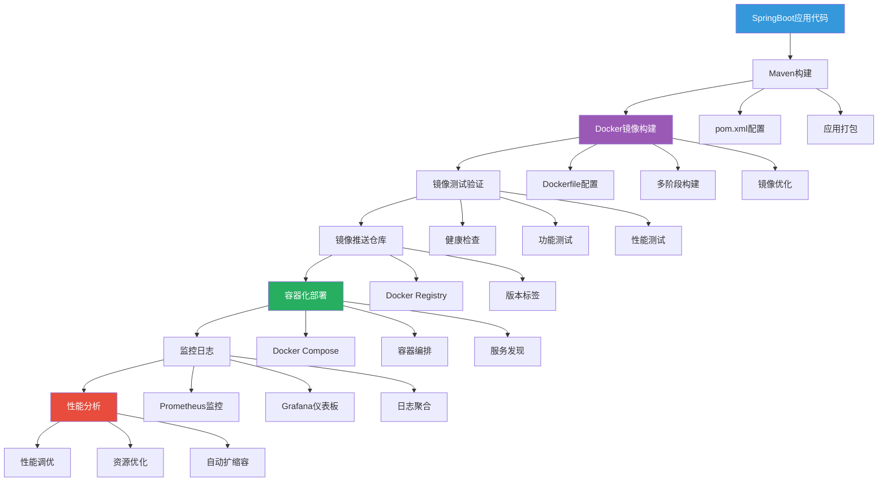
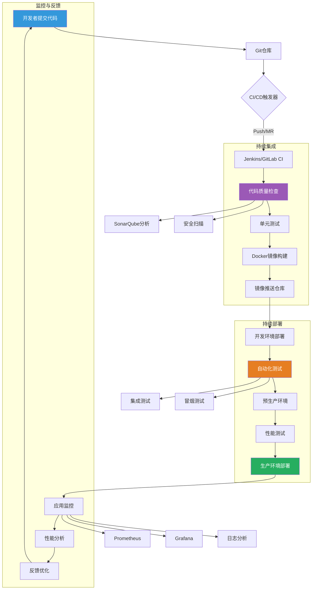
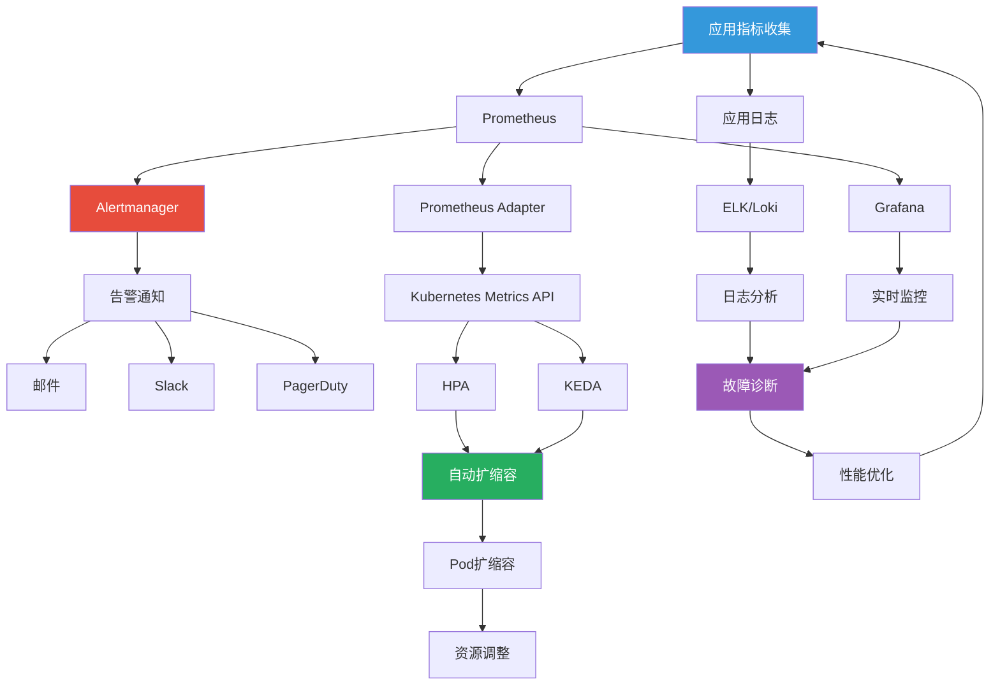

> 将你的SpringBoot应用一键打包部署，告别环境不一致的烦恼！

文提供完整的SpringBoot应用Docker容器化实战指南，从基础概念到高级部署，包含详细的操作步骤和代码示例，帮助您彻底解决环境不一致问题。

## 环境准备和Docker安装 ##

### 系统要求检查 ###

在开始Docker化之前，确保系统满足基本要求。

```bash
#!/bin/bash
# docker_environment_check.sh - Docker环境检查脚本

set -euo pipefail

# 颜色定义
GREEN='\033[0;32m'
YELLOW='\033[1;33m'
RED='\033[0;31m'
BLUE='\033[0;34m'
NC='\033[0m'

echo -e "${BLUE}=== Docker环境检查开始 ===${NC}"

# 检查操作系统
echo -e "\n${GREEN}1. 操作系统检查${NC}"
if [ -f /etc/os-release ]; then
    source /etc/os-release
    echo -e "   操作系统: $NAME $VERSION"
    echo -e "   内核版本: $(uname -r)"
else
    echo -e "   ${YELLOW}警告: 无法确定操作系统类型${NC}"
fi

# 检查系统架构
echo -e "\n${GREEN}2. 系统架构检查${NC}"
ARCH=$(uname -m)
echo -e "   系统架构: $ARCH"

# 检查内存
echo -e "\n${GREEN}3. 内存检查${NC}"
MEM_TOTAL=$(free -h | awk 'NR==2{print $2}')
MEM_AVAILABLE=$(free -h | awk 'NR==2{print $7}')
echo -e "   总内存: $MEM_TOTAL"
echo -e "   可用内存: $MEM_AVAILABLE"

# 检查磁盘空间
echo -e "\n${GREEN}4. 磁盘空间检查${NC}"
DISK_SPACE=$(df -h / | awk 'NR==2{print $4}')
echo -e "   根分区可用空间: $DISK_SPACE"

# 检查Docker是否已安装
echo -e "\n${GREEN}5. Docker安装状态检查${NC}"
if command -v docker &> /dev/null; then
    DOCKER_VERSION=$(docker --version | cut -d' ' -f3 | tr -d ',')
    echo -e "   ✅ Docker已安装: $DOCKER_VERSION"
    
    # 检查Docker服务状态
    if systemctl is-active --quiet docker; then
        echo -e "   ✅ Docker服务运行中"
    else
        echo -e "   ${YELLOW}⚠️ Docker服务未运行${NC}"
    fi
else
    echo -e "   ${RED}❌ Docker未安装${NC}"
fi

# 检查Docker Compose
echo -e "\n${GREEN}6. Docker Compose检查${NC}"
if command -v docker-compose &> /dev/null; then
    DOCKER_COMPOSE_VERSION=$(docker-compose --version | cut -d' ' -f3 | tr -d ',')
    echo -e "   ✅ Docker Compose已安装: $DOCKER_COMPOSE_VERSION"
else
    echo -e "   ${YELLOW}⚠️ Docker Compose未安装${NC}"
fi

# 总结
echo -e "\n${BLUE}=== 环境检查完成 ===${NC}"
echo -e "请根据检查结果安装缺失的组件"
```

### Docker安装脚本 ###

根据不同操作系统安装Docker和Docker Compose。

```bash
#!/bin/bash
# install_docker.sh - Docker安装脚本

set -euo pipefail

# 颜色定义
GREEN='\033[0;32m'
YELLOW='\033[1;33m'
RED='\033[0;31m'
BLUE='\033[0;34m'
NC='\033[0m'

log() {
    echo -e "${GREEN}[$(date '+%Y-%m-%d %H:%M:%S')] $1${NC}"
}

error_exit() {
    echo -e "${RED}错误: $1${NC}" >&2
    exit 1
}

# 检测操作系统
detect_os() {
    if [ -f /etc/os-release ]; then
        source /etc/os-release
        OS=$ID
        VERSION=$VERSION_ID
    else
        error_exit "无法检测操作系统"
    fi
}

# 安装Docker
install_docker() {
    log "开始安装Docker..."
    
    case $OS in
        ubuntu|debian)
            install_docker_debian
            ;;
        centos|rhel|fedora)
            install_docker_centos
            ;;
        *)
            error_exit "不支持的操作系统: $OS"
            ;;
    esac
}

# Debian/Ubuntu系统安装Docker
install_docker_debian() {
    log "在Debian/Ubuntu系统上安装Docker..."
    
    # 卸载旧版本
    sudo apt-get remove -y docker docker-engine docker.io containerd runc || true
    
    # 安装依赖
    sudo apt-get update
    sudo apt-get install -y \
        apt-transport-https \
        ca-certificates \
        curl \
        gnupg \
        lsb-release
    
    # 添加Docker官方GPG密钥
    curl -fsSL https://download.docker.com/linux/ubuntu/gpg | sudo gpg --dearmor -o /usr/share/keyrings/docker-archive-keyring.gpg
    
    # 添加Docker仓库
    echo \
      "deb [arch=$(dpkg --print-architecture) signed-by=/usr/share/keyrings/docker-archive-keyring.gpg] https://download.docker.com/linux/ubuntu \
      $(lsb_release -cs) stable" | sudo tee /etc/apt/sources.list.d/docker.list > /dev/null
    
    # 安装Docker引擎
    sudo apt-get update
    sudo apt-get install -y docker-ce docker-ce-cli containerd.io
    
    log "Docker安装完成"
}

# CentOS/RHEL系统安装Docker
install_docker_centos() {
    log "在CentOS/RHEL系统上安装Docker..."
    
    # 卸载旧版本
    sudo yum remove -y docker \
        docker-client \
        docker-client-latest \
        docker-common \
        docker-latest \
        docker-latest-logrotate \
        docker-logrotate \
        docker-engine
    
    # 安装依赖
    sudo yum install -y yum-utils
    
    # 添加Docker仓库
    sudo yum-config-manager \
        --add-repo \
        https://download.docker.com/linux/centos/docker-ce.repo
    
    # 安装Docker引擎
    sudo yum install -y docker-ce docker-ce-cli containerd.io
    
    log "Docker安装完成"
}

# 安装Docker Compose
install_docker_compose() {
    log "开始安装Docker Compose..."
    
    # 获取最新版本
    COMPOSE_VERSION=$(curl -s https://api.github.com/repos/docker/compose/releases/latest | grep '"tag_name":' | sed -E 's/.*"([^"]+)".*/\1/')
    
    # 下载并安装
    sudo curl -L "https://github.com/docker/compose/releases/download/${COMPOSE_VERSION}/docker-compose-$(uname -s)-$(uname -m)" -o /usr/local/bin/docker-compose
    
    # 设置执行权限
    sudo chmod +x /usr/local/bin/docker-compose
    
    # 创建符号链接
    sudo ln -sf /usr/local/bin/docker-compose /usr/bin/docker-compose
    
    log "Docker Compose ${COMPOSE_VERSION} 安装完成"
}

# 配置Docker
configure_docker() {
    log "配置Docker..."
    
    # 启动Docker服务
    sudo systemctl enable docker
    sudo systemctl start docker
    
    # 将当前用户添加到docker组（避免每次使用sudo）
    sudo usermod -aG docker $USER
    
    # 配置Docker镜像加速器（中国用户）
    if [ -f /etc/docker/daemon.json ]; then
        sudo cp /etc/docker/daemon.json /etc/docker/daemon.json.bak
    fi
    
    sudo tee /etc/docker/daemon.json > /dev/null << EOF
{
  "registry-mirrors": [
    "https://docker.mirrors.ustc.edu.cn",
    "https://hub-mirror.c.163.com",
    "https://registry.docker-cn.com"
  ],
  "log-driver": "json-file",
  "log-opts": {
    "max-size": "100m",
    "max-file": "3"
  },
  "data-root": "/var/lib/docker"
}
EOF
    
    # 重启Docker服务
    sudo systemctl daemon-reload
    sudo systemctl restart docker
    
    log "Docker配置完成"
}

# 验证安装
verify_installation() {
    log "验证Docker安装..."
    
    if docker --version; then
        log "✅ Docker安装成功"
    else
        error_exit "Docker安装失败"
    fi
    
    if docker-compose --version; then
        log "✅ Docker Compose安装成功"
    else
        error_exit "Docker Compose安装失败"
    fi
    
    # 测试运行容器
    log "测试运行Hello World容器..."
    if docker run --rm hello-world; then
        log "✅ Docker运行测试成功"
    else
        error_exit "Docker运行测试失败"
    fi
}

# 显示使用说明
show_usage() {
    cat << EOF
使用说明:
  ./install_docker.sh [选项]

选项:
  --help             显示此帮助信息
  --skip-compose     跳过Docker Compose安装
  --skip-configure   跳过Docker配置

示例:
  ./install_docker.sh                    # 完整安装
  ./install_docker.sh --skip-compose     # 不安装Docker Compose
  ./install_docker.sh --skip-configure   # 不进行配置
EOF
}

# 主函数
main() {
    local skip_compose=false
    local skip_configure=false
    
    # 解析参数
    while [[ $# -gt 0 ]]; do
        case $1 in
            --skip-compose)
                skip_compose=true
                shift
                ;;
            --skip-configure)
                skip_configure=true
                shift
                ;;
            --help)
                show_usage
                exit 0
                ;;
            *)
                error_exit "未知参数: $1"
                ;;
        esac
    done
    
    log "开始Docker安装流程..."
    
    # 检测操作系统
    detect_os
    
    # 安装Docker
    install_docker
    
    # 安装Docker Compose（除非跳过）
    if [ "$skip_compose" = false ]; then
        install_docker_compose
    else
        log "跳过Docker Compose安装"
    fi
    
    # 配置Docker（除非跳过）
    if [ "$skip_configure" = false ]; then
        configure_docker
    else
        log "跳过Docker配置"
    fi
    
    # 验证安装
    verify_installation
    
    log "🎉 Docker安装全部完成!"
    log "请重新登录或执行 'newgrp docker' 以使组权限生效"
    log "然后可以运行 'docker ps' 测试权限"
}

# 执行主函数
main "$@"
```

## SpringBoot应用Docker化实战 ##

### 创建示例SpringBoot应用 ###

首先创建一个完整的SpringBoot应用作为演示。

```java
// src/main/java/com/example/demo/DemoApplication.java
package com.example.demo;

import org.springframework.boot.SpringApplication;
import org.springframework.boot.autoconfigure.SpringBootApplication;
import org.springframework.web.bind.annotation.GetMapping;
import org.springframework.web.bind.annotation.RestController;

import java.time.LocalDateTime;
import java.util.HashMap;
import java.util.Map;

@SpringBootApplication
public class DemoApplication {
    public static void main(String[] args) {
        SpringApplication.run(DemoApplication.class, args);
    }
}

@RestController
class HealthController {
    
    @GetMapping("/health")
    public Map<String, Object> health() {
        Map<String, Object> healthInfo = new HashMap<>();
        healthInfo.put("status", "UP");
        healthInfo.put("timestamp", LocalDateTime.now().toString());
        healthInfo.put("service", "SpringBoot Docker Demo");
        return healthInfo;
    }
    
    @GetMapping("/info")
    public Map<String, Object> info() {
        Map<String, Object> info = new HashMap<>();
        info.put("java.version", System.getProperty("java.version"));
        info.put("java.vendor", System.getProperty("java.vendor"));
        info.put("os.name", System.getProperty("os.name"));
        info.put("os.arch", System.getProperty("os.arch"));
        info.put("user.name", System.getProperty("user.name"));
        info.put("availableProcessors", Runtime.getRuntime().availableProcessors());
        info.put("maxMemory", Runtime.getRuntime().maxMemory() / (1024 * 1024) + " MB");
        info.put("totalMemory", Runtime.getRuntime().totalMemory() / (1024 * 1024) + " MB");
        return info;
    }
}
```

### SpringBoot应用配置文件 ###

```ini
# src/main/resources/application.properties
# 应用配置
spring.application.name=springboot-docker-demo
server.port=8080
server.servlet.context-path=/

# 日志配置
logging.level.com.example.demo=INFO
logging.pattern.console=%d{yyyy-MM-dd HH:mm:ss} - %msg%n

# 健康检查
management.endpoint.health.enabled=true
management.endpoints.web.exposure.include=health,info
```

### Maven构建配置 ###

```xml
<?xml version="1.0" encoding="UTF-8"?>
<project xmlns="http://maven.apache.org/POM/4.0.0"
         xmlns:xsi="http://www.w3.org/2001/XMLSchema-instance"
         xsi:schemaLocation="http://maven.apache.org/POM/4.0.0 
         http://maven.apache.org/xsd/maven-4.0.0.xsd">
    <modelVersion>4.0.0</modelVersion>
    
    <groupId>com.example</groupId>
    <artifactId>springboot-docker-demo</artifactId>
    <version>1.0.0</version>
    <packaging>jar</packaging>
    
    <name>SpringBoot Docker Demo</name>
    <description>SpringBoot应用Docker容器化演示项目</description>
    
    <parent>
        <groupId>org.springframework.boot</groupId>
        <artifactId>spring-boot-starter-parent</artifactId>
        <version>2.7.0</version>
        <relativePath/>
    </parent>
    
    <properties>
        <java.version>11</java.version>
        <docker.image.prefix>springboot-demo</docker.image.prefix>
        <maven.compiler.source>11</maven.compiler.source>
        <maven.compiler.target>11</maven.compiler.target>
        <project.build.sourceEncoding>UTF-8</project.build.sourceEncoding>
    </properties>
    
    <dependencies>
        <dependency>
            <groupId>org.springframework.boot</groupId>
            <artifactId>spring-boot-starter-web</artifactId>
        </dependency>
        
        <dependency>
            <groupId>org.springframework.boot</groupId>
            <artifactId>spring-boot-starter-actuator</artifactId>
        </dependency>
        
        <dependency>
            <groupId>org.springframework.boot</groupId>
            <artifactId>spring-boot-starter-test</artifactId>
            <scope>test</scope>
        </dependency>
    </dependencies>
    
    <build>
        <plugins>
            <plugin>
                <groupId>org.springframework.boot</groupId>
                <artifactId>spring-boot-maven-plugin</artifactId>
                <configuration>
                    <excludes>
                        <exclude>
                            <groupId>org.projectlombok</groupId>
                            <artifactId>lombok</artifactId>
                        </exclude>
                    </excludes>
                </configuration>
            </plugin>
            
            <!-- Docker镜像构建插件 -->
            <plugin>
                <groupId>com.spotify</groupId>
                <artifactId>dockerfile-maven-plugin</artifactId>
                <version>1.4.13</version>
                <configuration>
                    <repository>${docker.image.prefix}/${project.artifactId}</repository>
                    <tag>${project.version}</tag>
                    <buildArgs>
                        <JAR_FILE>target/${project.build.finalName}.jar</JAR_FILE>
                    </buildArgs>
                </configuration>
            </plugin>
        </plugins>
    </build>
</project>
```

## Docker化配置和脚本 ##

### 基础Dockerfile配置 ###

```dockerfile
# Dockerfile - SpringBoot应用容器化配置
# 多阶段构建，减小镜像体积

# 第一阶段：构建阶段
FROM maven:3.8.6-openjdk-11 AS builder

# 设置工作目录
WORKDIR /app

# 复制pom文件
COPY pom.xml .

# 下载依赖（利用Docker缓存层）
RUN mvn dependency:go-offline -B

# 复制源代码
COPY src ./src

# 构建应用
RUN mvn clean package -DskipTests

# 第二阶段：运行阶段
FROM openjdk:11-jre-slim

# 设置元数据
LABEL maintainer="your-email@example.com"
LABEL version="1.0.0"
LABEL description="SpringBoot Docker Demo Application"

# 设置时区
ENV TZ=Asia/Shanghai
RUN ln -snf /usr/share/zoneinfo/$TZ /etc/localtime && echo $TZ > /etc/timezone

# 创建应用用户（安全最佳实践）
RUN groupadd -r springboot && useradd -r -g springboot springboot

# 创建应用目录
RUN mkdir -p /app/logs && chown -R springboot:springboot /app

# 切换到应用用户
USER springboot

# 设置工作目录
WORKDIR /app

# 从构建阶段复制jar文件
COPY --from=builder --chown=springboot:springboot /app/target/*.jar app.jar

# 创建健康检查脚本
COPY --chown=springboot:springboot health-check.sh .

# 设置JVM参数
ENV JAVA_OPTS="-Xms512m -Xmx1024m -XX:+UseG1GC -XX:MaxGCPauseMillis=200"
ENV SPRING_PROFILES_ACTIVE="docker"

# 暴露端口
EXPOSE 8080

# 健康检查
HEALTHCHECK --interval=30s --timeout=3s --start-period=60s --retries=3 \
    CMD ./health-check.sh

# 启动应用
ENTRYPOINT ["sh", "-c", "java $JAVA_OPTS -Djava.security.egd=file:/dev/./urandom -jar app.jar"]
```

### 健康检查脚本 ###

```bash
#!/bin/bash
# health-check.sh - 应用健康检查脚本

set -e

# 健康检查端点
HEALTH_URL="http://localhost:8080/health"

# 超时时间（秒）
TIMEOUT=5

# 执行健康检查
response=$(curl -s -o /dev/null -w "%{http_code}" --max-time $TIMEOUT $HEALTH_URL || echo "000")

# 检查响应状态码
if [ "$response" = "200" ]; then
    echo "Health check: OK"
    exit 0
else
    echo "Health check: FAILED (HTTP $response)"
    exit 1
fi
```

### 优化版Dockerfile（针对生产环境） ###

```dockerfile
# Dockerfile.optimized - 生产环境优化版本
FROM eclipse-temurin:11-jre-focal as base

# 安装必要的工具
RUN apt-get update && apt-get install -y --no-install-recommends \
    curl \
    tzdata \
    && rm -rf /var/lib/apt/lists/*

# 设置时区
ENV TZ=Asia/Shanghai
RUN ln -snf /usr/share/zoneinfo/$TZ /etc/localtime && echo $TZ > /etc/timezone

# 创建非root用户
RUN groupadd --gid 1000 springboot && \
    useradd --uid 1000 --gid springboot --shell /bin/bash --create-home springboot

# 第二阶段：运行环境
FROM base as runtime

# 设置JVM参数
ENV JAVA_OPTS="-Xms512m -Xmx1024m \
    -XX:+UseG1GC \
    -XX:MaxGCPauseMillis=200 \
    -XX:+UnlockExperimentalVMOptions \
    -XX:+UseContainerSupport \
    -XX:InitialRAMPercentage=50.0 \
    -XX:MaxRAMPercentage=80.0 \
    -Djava.security.egd=file:/dev/./urandom"

# 设置应用参数
ENV SPRING_PROFILES_ACTIVE="docker,prod"
ENV SERVER_PORT=8080

# 创建应用目录
WORKDIR /app

# 复制jar文件
COPY --chown=springboot:springboot target/*.jar app.jar

# 复制启动脚本
COPY --chown=springboot:springboot docker-entrypoint.sh .

# 复制健康检查脚本
COPY --chown=springboot:springboot health-check.sh .

# 设置权限
RUN chmod +x docker-entrypoint.sh health-check.sh

# 创建日志目录
RUN mkdir -p logs && chown springboot:springboot logs

# 切换到非root用户
USER springboot

# 暴露端口
EXPOSE 8080

# 健康检查
HEALTHCHECK --interval=30s --timeout=10s --start-period=40s --retries=3 \
    CMD ./health-check.sh

# 使用入口点脚本
ENTRYPOINT ["./docker-entrypoint.sh"]
```

### 高级启动脚本 ###

```bash
#!/bin/bash
# docker-entrypoint.sh - 高级启动脚本

set -e

echo "🚀 启动 SpringBoot 应用..."

# 设置默认JVM参数
if [ -z "$JAVA_OPTS" ]; then
    JAVA_OPTS="-Xms512m -Xmx1024m -XX:+UseG1GC"
fi

# 应用特定配置
if [ "$SPRING_PROFILES_ACTIVE" = "prod" ]; then
    echo "🔧 生产环境配置激活"
    JAVA_OPTS="$JAVA_OPTS -XX:+AlwaysPreTouch -XX:+ExitOnOutOfMemoryError"
fi

# 日志配置
if [ -n "$LOG_LEVEL" ]; then
    JAVA_OPTS="$JAVA_OPTS -Dlogging.level.com.example.demo=$LOG_LEVEL"
fi

# 显示启动信息
echo "📋 启动配置:"
echo "   工作目录: $(pwd)"
echo "   Java版本: $(java -version 2>&1 | head -1)"
echo "   JVM参数: $JAVA_OPTS"
echo "   Spring Profiles: $SPRING_PROFILES_ACTIVE"
echo "   应用端口: $SERVER_PORT"

# 等待依赖服务（如果有）
if [ -n "$WAIT_FOR_HOSTS" ]; then
    echo "⏳ 等待依赖服务..."
    IFS=',' read -ra HOSTS <<< "$WAIT_FOR_HOSTS"
    for host in "${HOSTS[@]}"; do
        IFS=':' read -ra ADDR <<< "$host"
        hostname=${ADDR[0]}
        port=${ADDR[1]:=80}
        
        echo "   等待 $hostname:$port..."
        while ! nc -z $hostname $port; do
            sleep 1
        done
        echo "   ✅ $hostname:$port 就绪"
    done
fi

# 启动应用
echo "🎯 启动应用..."
exec java $JAVA_OPTS -jar app.jar "$@"
```

## Docker构建和部署脚本 ##

### 自动化构建脚本 ###

```bash
#!/bin/bash
# build_and_deploy.sh - 自动化构建和部署脚本

set -euo pipefail

# 颜色定义
GREEN='\033[0;32m'
YELLOW='\033[1;33m'
RED='\033[0;31m'
BLUE='\033[0;34m'
NC='\033[0m'

# 配置变量
APP_NAME="springboot-docker-demo"
VERSION="1.0.0"
REGISTRY="localhost:5000"  # 本地 registry，生产环境替换为实际 registry
DOCKERFILE="Dockerfile"

# 日志函数
log() {
    echo -e "${GREEN}[$(date '+%Y-%m-%d %H:%M:%S')] $1${NC}"
}

error_exit() {
    echo -e "${RED}错误: $1${NC}" >&2
    exit 1
}

# 显示帮助信息
show_help() {
    cat << EOF
使用说明: $0 [选项]

选项:
  -h, --help          显示此帮助信息
  -b, --build         构建Docker镜像
  -t, --test          运行测试
  -p, --push          推送镜像到仓库
  -d, --deploy        部署到环境
  -e, --environment   指定环境 (dev/staging/prod)
  --version          指定版本号
  --no-cache         构建时不使用缓存

示例:
  $0 -b -t -p -d -e prod        # 完整CI/CD流程
  $0 -b --no-cache              # 不使用缓存构建
  $0 --version 2.0.0 -b -p      # 构建并推送特定版本
EOF
}

# 参数解析
parse_arguments() {
    local build=false
    local test=false
    local push=false
    local deploy=false
    local environment="dev"
    local no_cache=false
    
    while [[ $# -gt 0 ]]; do
        case $1 in
            -h|--help)
                show_help
                exit 0
                ;;
            -b|--build)
                build=true
                shift
                ;;
            -t|--test)
                test=true
                shift
                ;;
            -p|--push)
                push=true
                shift
                ;;
            -d|--deploy)
                deploy=true
                shift
                ;;
            -e|--environment)
                environment="$2"
                shift 2
                ;;
            --version)
                VERSION="$2"
                shift 2
                ;;
            --no-cache)
                no_cache=true
                shift
                ;;
            *)
                error_exit "未知参数: $1"
                ;;
        esac
    done
    
    # 如果没有指定任何操作，显示帮助
    if [ "$build" = false ] && [ "$test" = false ] && [ "$push" = false ] && [ "$deploy" = false ]; then
        show_help
        exit 0
    fi
    
    # 设置变量供后续使用
    BUILD=$build
    TEST=$test
    PUSH=$push
    DEPLOY=$deploy
    ENVIRONMENT=$environment
    NO_CACHE=$no_cache
}

# 前置检查
pre_checks() {
    log "执行前置检查..."
    
    # 检查Docker是否可用
    if ! command -v docker &> /dev/null; then
        error_exit "Docker未安装"
    fi
    
    # 检查Docker服务是否运行
    if ! docker info &> /dev/null; then
        error_exit "Docker服务未运行"
    fi
    
    # 检查必要的文件
    if [ ! -f "Dockerfile" ]; then
        error_exit "Dockerfile不存在"
    fi
    
    if [ ! -f "pom.xml" ]; then
        error_exit "pom.xml不存在"
    fi
    
    log "✅ 前置检查通过"
}

# 构建应用
build_application() {
    log "构建SpringBoot应用..."
    
    if [ ! -d "target" ] || [ "$NO_CACHE" = true ]; then
        # 清理并重新构建
        mvn clean package -DskipTests
    else
        # 仅打包
        mvn package -DskipTests
    fi
    
    if [ $? -eq 0 ]; then
        log "✅ 应用构建成功"
    else
        error_exit "应用构建失败"
    fi
}

# 构建Docker镜像
build_docker_image() {
    log "构建Docker镜像..."
    
    local cache_flag=""
    if [ "$NO_CACHE" = true ]; then
        cache_flag="--no-cache"
        log "不使用缓存构建"
    fi
    
    local image_tag="$APP_NAME:$VERSION"
    local full_tag="$REGISTRY/$APP_NAME:$VERSION"
    
    # 构建镜像
    docker build $cache_flag -t "$image_tag" -t "$full_tag" -f "$DOCKERFILE" .
    
    if [ $? -eq 0 ]; then
        log "✅ Docker镜像构建成功: $image_tag"
        log "✅ Docker镜像构建成功: $full_tag"
    else
        error_exit "Docker镜像构建失败"
    fi
}

# 运行测试
run_tests() {
    log "运行测试..."
    
    # 运行单元测试
    mvn test
    
    if [ $? -eq 0 ]; then
        log "✅ 单元测试通过"
    else
        error_exit "单元测试失败"
    fi
    
    # 运行容器测试
    log "运行容器测试..."
    
    local test_container_name="${APP_NAME}-test-$(date +%s)"
    local image_tag="$APP_NAME:$VERSION"
    
    # 启动测试容器
    docker run -d --name "$test_container_name" -p 8081:8080 "$image_tag"
    
    # 等待应用启动
    log "等待应用启动..."
    sleep 30
    
    # 测试健康端点
    local health_response=$(curl -s -o /dev/null -w "%{http_code}" http://localhost:8081/health || echo "000")
    
    if [ "$health_response" = "200" ]; then
        log "✅ 健康检查通过"
    else
        docker logs "$test_container_name"
        error_exit "健康检查失败 (HTTP $health_response)"
    fi
    
    # 测试信息端点
    local info_response=$(curl -s http://localhost:8081/info | grep -q "java.version" && echo "OK" || echo "FAIL")
    
    if [ "$info_response" = "OK" ]; then
        log "✅ 信息端点测试通过"
    else
        error_exit "信息端点测试失败"
    fi
    
    # 清理测试容器
    docker stop "$test_container_name"
    docker rm "$test_container_name"
    
    log "✅ 所有测试通过"
}

# 推送镜像
push_image() {
    log "推送镜像到仓库..."
    
    local full_tag="$REGISTRY/$APP_NAME:$VERSION"
    
    # 检查仓库是否可用
    if ! docker push "$full_tag" &> /dev/null; then
        log "⚠️  镜像仓库不可用，尝试启动本地registry"
        
        # 启动本地registry（用于演示）
        docker run -d -p 5000:5000 --name registry registry:2 || true
        sleep 2
    fi
    
    # 推送镜像
    if docker push "$full_tag"; then
        log "✅ 镜像推送成功: $full_tag"
    else
        error_exit "镜像推送失败"
    fi
}

# 部署应用
deploy_application() {
    log "部署应用到 $ENVIRONMENT 环境..."
    
    case $ENVIRONMENT in
        dev)
            deploy_dev
            ;;
        staging)
            deploy_staging
            ;;
        prod)
            deploy_prod
            ;;
        *)
            error_exit "未知环境: $ENVIRONMENT"
            ;;
    esac
}

# 开发环境部署
deploy_dev() {
    log "部署到开发环境..."
    
    local container_name="$APP_NAME-dev"
    local image_tag="$APP_NAME:$VERSION"
    
    # 停止并删除现有容器
    docker stop "$container_name" 2>/dev/null || true
    docker rm "$container_name" 2>/dev/null || true
    
    # 启动新容器
    docker run -d \
        --name "$container_name" \
        -p 8080:8080 \
        -e SPRING_PROFILES_ACTIVE="dev,docker" \
        -e JAVA_OPTS="-Xms256m -Xmx512m" \
        --restart unless-stopped \
        "$image_tag"
    
    log "✅ 开发环境部署完成"
    log "   应用地址: http://localhost:8080"
    log "   健康检查: http://localhost:8080/health"
}

# 生产环境部署
deploy_prod() {
    log "部署到生产环境..."
    
    # 使用Docker Compose部署
    if [ -f "docker-compose.prod.yml" ]; then
        docker-compose -f docker-compose.prod.yml up -d
        log "✅ 生产环境部署完成"
    else
        error_exit "生产环境配置文件不存在"
    fi
}

# 主函数
main() {
    log "🚀 开始SpringBoot应用Docker化流程"
    
    # 解析参数
    parse_arguments "$@"
    
    # 前置检查
    pre_checks
    
    # 构建应用
    if [ "$BUILD" = true ]; then
        build_application
        build_docker_image
    fi
    
    # 运行测试
    if [ "$TEST" = true ]; then
        run_tests
    fi
    
    # 推送镜像
    if [ "$PUSH" = true ]; then
        push_image
    fi
    
    # 部署应用
    if [ "$DEPLOY" = true ]; then
        deploy_application
    fi
    
    log "🎉 所有操作完成!"
    
    # 显示部署信息
    if [ "$DEPLOY" = true ]; then
        echo ""
        echo "📋 部署摘要:"
        echo "   应用名称: $APP_NAME"
        echo "   版本: $VERSION"
        echo "   环境: $ENVIRONMENT"
        echo "   镜像: $REGISTRY/$APP_NAME:$VERSION"
        echo "   健康检查: http://localhost:8080/health"
    fi
}

# 执行主函数
main "$@"
```

## Docker Compose编排配置 ##

### 开发环境配置 ###

```yaml
# docker-compose.dev.yml
version: '3.8'

services:
  springboot-app:
    build:
      context: .
      dockerfile: Dockerfile
    image: springboot-docker-demo:dev
    container_name: springboot-app-dev
    ports:
      - "8080:8080"
    environment:
      - SPRING_PROFILES_ACTIVE=dev,docker
      - JAVA_OPTS=-Xms256m -Xmx512m -XX:+UseG1GC
      - LOG_LEVEL=DEBUG
    volumes:
      - ./logs:/app/logs
      - ./config:/app/config
    networks:
      - springboot-network
    restart: unless-stopped
    healthcheck:
      test: ["CMD", "./health-check.sh"]
      interval: 30s
      timeout: 10s
      retries: 3
      start_period: 40s

  # MySQL数据库
  mysql-db:
    image: mysql:8.0
    container_name: mysql-dev
    environment:
      - MYSQL_ROOT_PASSWORD=rootpassword
      - MYSQL_DATABASE=springboot_demo
      - MYSQL_USER=appuser
      - MYSQL_PASSWORD=apppassword
    ports:
      - "3306:3306"
    volumes:
      - mysql_data:/var/lib/mysql
      - ./init.sql:/docker-entrypoint-initdb.d/init.sql
    networks:
      - springboot-network
    restart: unless-stopped
    healthcheck:
      test: ["CMD", "mysqladmin", "ping", "-h", "localhost"]
      timeout: 10s
      retries: 5

  # Redis缓存
  redis:
    image: redis:7-alpine
    container_name: redis-dev
    ports:
      - "6379:6379"
    volumes:
      - redis_data:/data
    networks:
      - springboot-network
    restart: unless-stopped
    command: redis-server --appendonly yes

  # 监控工具
  prometheus:
    image: prom/prometheus:latest
    container_name: prometheus-dev
    ports:
      - "9090:9090"
    volumes:
      - ./prometheus.yml:/etc/prometheus/prometheus.yml
      - prometheus_data:/prometheus
    networks:
      - springboot-network
    restart: unless-stopped

  grafana:
    image: grafana/grafana:latest
    container_name: grafana-dev
    ports:
      - "3000:3000"
    environment:
      - GF_SECURITY_ADMIN_PASSWORD=admin
    volumes:
      - grafana_data:/var/lib/grafana
    networks:
      - springboot-network
    restart: unless-stopped

networks:
  springboot-network:
    driver: bridge

volumes:
  mysql_data:
  redis_data:
  prometheus_data:
  grafana_data:
```

### 生产环境配置 ###

```yaml
# docker-compose.prod.yml
version: '3.8'

services:
  springboot-app:
    image: ${REGISTRY:-localhost:5000}/springboot-docker-demo:${VERSION:-latest}
    container_name: springboot-app-prod
    ports:
      - "8080:8080"
    environment:
      - SPRING_PROFILES_ACTIVE=prod,docker
      - JAVA_OPTS=-Xms512m -Xmx1024m -XX:+UseG1GC -XX:MaxGCPauseMillis=200
      - LOG_LEVEL=INFO
      - MANAGEMENT_ENDPOINTS_WEB_EXPOSURE_INCLUDE=health,info,metrics
    volumes:
      - app_logs:/app/logs
    networks:
      - springboot-prod-network
    restart: always
    deploy:
      resources:
        limits:
          memory: 1G
          cpus: '1.0'
        reservations:
          memory: 512M
          cpus: '0.5'
    healthcheck:
      test: ["CMD", "./health-check.sh"]
      interval: 30s
      timeout: 10s
      retries: 3
      start_period: 60s
    logging:
      driver: "json-file"
      options:
        max-size: "10m"
        max-file: "3"

  # Nginx负载均衡
  nginx:
    image: nginx:1.21-alpine
    container_name: nginx-prod
    ports:
      - "80:80"
      - "443:443"
    volumes:
      - ./nginx.conf:/etc/nginx/nginx.conf
      - ./ssl:/etc/nginx/ssl
    networks:
      - springboot-prod-network
    restart: always
    depends_on:
      - springboot-app

  # 数据库（生产环境建议使用外部数据库）
  # mysql:
  #   image: mysql:8.0
  #   container_name: mysql-prod
  #   environment:
  #     - MYSQL_ROOT_PASSWORD=${DB_ROOT_PASSWORD}
  #     - MYSQL_DATABASE=${DB_NAME}
  #     - MYSQL_USER=${DB_USER}
  #     - MYSQL_PASSWORD=${DB_PASSWORD}
  #   volumes:
  #     - mysql_prod_data:/var/lib/mysql
  #   networks:
  #     - springboot-prod-network
  #   restart: always
  #   deploy:
  #     resources:
  #       limits:
  #         memory: 2G
  #         cpus: '2.0'

networks:
  springboot-prod-network:
    driver: bridge
    ipam:
      config:
        - subnet: 172.20.0.0/16

volumes:
  app_logs:
  mysql_prod_data:
```

### Nginx配置 ###

```nginx
# nginx.conf
events {
    worker_connections 1024;
}

http {
    upstream springboot_app {
        server springboot-app:8080;
    }

    # 日志格式
    log_format main '$remote_addr - $remote_user [$time_local] "$request" '
                    '$status $body_bytes_sent "$http_referer" '
                    '"$http_user_agent" "$http_x_forwarded_for" '
                    'rt=$request_time uct="$upstream_connect_time" '
                    'uht="$upstream_header_time" urt="$upstream_response_time"';

    access_log /var/log/nginx/access.log main;
    error_log /var/log/nginx/error.log warn;

    # 基础配置
    sendfile on;
    tcp_nopush on;
    tcp_nodelay on;
    keepalive_timeout 65;
    types_hash_max_size 2048;

    include /etc/nginx/mime.types;
    default_type application/octet-stream;

    # Gzip压缩
    gzip on;
    gzip_vary on;
    gzip_min_length 1024;
    gzip_types text/plain text/css application/json application/javascript text/xml application/xml application/xml+rss text/javascript;

    # 服务器配置
    server {
        listen 80;
        server_name localhost;

        # 安全头
        add_header X-Frame-Options DENY always;
        add_header X-Content-Type-Options nosniff always;
        add_header X-XSS-Protection "1; mode=block" always;

        # 静态资源缓存
        location ~* \.(js|css|png|jpg|jpeg|gif|ico|svg)$ {
            expires 1y;
            add_header Cache-Control "public, immutable";
            proxy_pass http://springboot_app;
        }

        # API路由
        location /api/ {
            proxy_pass http://springboot_app;
            proxy_set_header Host $host;
            proxy_set_header X-Real-IP $remote_addr;
            proxy_set_header X-Forwarded-For $proxy_add_x_forwarded_for;
            proxy_set_header X-Forwarded-Proto $scheme;
            
            # 超时设置
            proxy_connect_timeout 30s;
            proxy_send_timeout 30s;
            proxy_read_timeout 30s;
        }

        # 健康检查
        location /health {
            proxy_pass http://springboot_app/health;
            proxy_set_header Host $host;
            access_log off;
        }

        # 根路径
        location / {
            proxy_pass http://springboot_app;
            proxy_set_header Host $host;
            proxy_set_header X-Real-IP $remote_addr;
            proxy_set_header X-Forwarded-For $proxy_add_x_forwarded_for;
            proxy_set_header X-Forwarded-Proto $scheme;
        }
    }
}
```

## 监控和日志管理 ##

### 应用监控配置 ###

```yaml
# prometheus.yml
global:
  scrape_interval: 15s
  evaluation_interval: 15s

rule_files:
  # - "first_rules.yml"
  # - "second_rules.yml"

scrape_configs:
  - job_name: 'springboot-app'
    metrics_path: '/actuator/prometheus'
    static_configs:
      - targets: ['springboot-app:8080']
    scrape_interval: 10s
    scrape_timeout: 5s

  - job_name: 'prometheus'
    static_configs:
      - targets: ['localhost:9090']

  - job_name: 'node-exporter'
    static_configs:
      - targets: ['node-exporter:9100']

alerting:
  alertmanagers:
    - static_configs:
        - targets:
          # - alertmanager:9093
```

### 日志管理脚本 ###

```bash
#!/bin/bash
# log_manager.sh - 容器日志管理脚本

set -euo pipefail

# 配置
LOG_DIR="./logs"
BACKUP_DIR="./logs/backup"
RETENTION_DAYS=7
CONTAINER_NAME="springboot-app"

# 颜色定义
GREEN='\033[0;32m'
YELLOW='\033[1;33m'
RED='\033[0;31m'
NC='\033[0m'

log() {
    echo -e "${GREEN}[$(date '+%Y-%m-%d %H:%M:%S')] $1${NC}"
}

# 创建目录
create_directories() {
    mkdir -p "$LOG_DIR"
    mkdir -p "$BACKUP_DIR"
}

# 查看实时日志
view_logs() {
    log "查看容器日志: $CONTAINER_NAME"
    
    if docker ps --format "table {{.Names}}" | grep -q "$CONTAINER_NAME"; then
        docker logs -f "$CONTAINER_NAME"
    else
        echo -e "${RED}容器 $CONTAINER_NAME 未运行${NC}"
    fi
}

# 导出日志
export_logs() {
    local export_file="$BACKUP_DIR/logs_$(date +%Y%m%d_%H%M%S).tar.gz"
    
    log "导出容器日志到: $export_file"
    
    if docker ps --format "table {{.Names}}" | grep -q "$CONTAINER_NAME"; then
        docker logs "$CONTAINER_NAME" > "$LOG_DIR/container.log" 2>&1
        tar -czf "$export_file" -C "$LOG_DIR" .
        log "✅ 日志导出完成: $export_file"
    else
        echo -e "${RED}容器 $CONTAINER_NAME 未运行${NC}"
    fi
}

# 清理旧日志
cleanup_old_logs() {
    log "清理 $RETENTION_DAYS 天前的日志备份..."
    
    find "$BACKUP_DIR" -name "*.tar.gz" -type f -mtime +$RETENTION_DAYS -delete
    
    log "✅ 旧日志清理完成"
}

# 日志分析
analyze_logs() {
    local log_file="$LOG_DIR/container.log"
    
    if [ ! -f "$log_file" ]; then
        echo -e "${RED}日志文件不存在: $log_file${NC}"
        return 1
    fi
    
    log "分析应用日志..."
    
    echo -e "\n${YELLOW}=== 错误统计 ===${NC}"
    grep -i "error" "$log_file" | sort | uniq -c | sort -nr | head -10
    
    echo -e "\n${YELLOW}=== 警告统计 ===${NC}"
    grep -i "warn" "$log_file" | sort | uniq -c | sort -nr | head -10
    
    echo -e "\n${YELLOW}=== 请求统计 ===${NC}"
    grep "HTTP" "$log_file" | awk '{print $NF}' | sort | uniq -c | sort -nr | head -10
    
    echo -e "\n${YELLOW}=== 响应时间分析 ===${NC}"
    grep "Completed" "$log_file" | awk '{print $NF}' | \
    awk '{
        if ($1 < 100) a++; 
        else if ($1 < 500) b++; 
        else if ($1 < 1000) c++; 
        else d++;
    } 
    END {
        print " < 100ms: " a;
        print "100-500ms: " b;
        print "500-1000ms: " c;
        print " > 1000ms: " d;
    }'
}

# 显示帮助
show_help() {
    cat << EOF
使用说明: $0 [命令]

命令:
  view     查看实时日志
  export   导出日志到文件
  cleanup  清理旧日志
  analyze  分析日志
  help     显示此帮助信息

示例:
  $0 view      # 查看实时日志
  $0 export    # 导出日志
  $0 analyze   # 分析日志
EOF
}

# 主函数
main() {
    local command=${1:-help}
    
    create_directories
    
    case $command in
        view)
            view_logs
            ;;
        export)
            export_logs
            ;;
        cleanup)
            cleanup_old_logs
            ;;
        analyze)
            analyze_logs
            ;;
        help|*)
            show_help
            ;;
    esac
}

# 执行主函数
main "$@"
```

## Docker化流程架构图 ##

以下图表展示了完整的SpringBoot应用Docker化流程：



## 高级特性和最佳实践 ##

### 安全加固配置 ###

```dockerfile
# Dockerfile.security - 安全加固版本
FROM eclipse-temurin:11-jre-focal as base

# 安全扫描和更新
RUN apt-get update && \
    apt-get upgrade -y && \
    apt-get clean && \
    rm -rf /var/lib/apt/lists/*

# 创建非特权用户
RUN groupadd -r springboot -g 1000 && \
    useradd -r -u 1000 -g springboot -s /bin/bash -d /app springboot

# 设置安全标签
LABEL security.scan.enabled="true"
LABEL security.compliance="base"

FROM base as runtime

# 设置安全相关的环境变量
ENV JAVA_OPTS="-Xms512m -Xmx1024m \
    -Djava.security.egd=file:/dev/./urandom \
    -Djava.awt.headless=true \
    -Dspring.jmx.enabled=false \
    -Dfile.encoding=UTF-8"

# 使用非root用户
USER springboot

WORKDIR /app

# 复制应用程序
COPY --chown=springboot:springboot target/*.jar app.jar

# 设置文件权限
RUN chmod 500 app.jar && \
    chmod 400 docker-entrypoint.sh health-check.sh

# 安全配置：只读根文件系统
# 注意：需要写入的目录需要单独挂载卷
# docker run --read-only -v /app/logs ...

EXPOSE 8080

HEALTHCHECK --interval=30s --timeout=10s --start-period=40s --retries=3 \
    CMD ./health-check.sh

ENTRYPOINT ["./docker-entrypoint.sh"]
```

### 多环境部署脚本 ###

```bash
#!/bin/bash
# multi_env_deploy.sh - 多环境部署脚本

set -euo pipefail

# 配置
ENVIRONMENTS=("dev" "staging" "prod")
REGISTRY="my-registry.example.com"
APP_NAME="springboot-docker-demo"

deploy_to_environment() {
    local env=$1
    local version=$2
    
    echo "🚀 部署到 $env 环境, 版本: $version"
    
    case $env in
        dev)
            deploy_dev $version
            ;;
        staging)
            deploy_staging $version
            ;;
        prod)
            deploy_prod $version
            ;;
        *)
            echo "❌ 未知环境: $env"
            return 1
            ;;
    esac
}

deploy_dev() {
    local version=$1
    
    # 开发环境直接使用最新镜像
    docker-compose -f docker-compose.dev.yml up -d --force-recreate
    
    echo "✅ 开发环境部署完成"
    run_smoke_tests "dev"
}

deploy_staging() {
    local version=$1
    
    # 预生产环境部署
    export VERSION=$version
    docker-compose -f docker-compose.staging.yml up -d --force-recreate
    
    echo "✅ 预生产环境部署完成"
    run_integration_tests
}

deploy_prod() {
    local version=$1
    
    # 生产环境蓝绿部署
    perform_blue_green_deployment $version
    
    echo "✅ 生产环境部署完成"
    run_smoke_tests "prod"
}

perform_blue_green_deployment() {
    local version=$1
    
    # 确定当前运行的颜色（blue 或 green）
    local current_color=$(get_current_deployment_color)
    local new_color=$([ "$current_color" = "blue" ] && echo "green" || echo "blue")
    
    echo "🎨 当前部署颜色: $current_color"
    echo "🎨 新部署颜色: $new_color"
    
    # 启动新颜色的服务
    start_service_with_color $new_color $version
    
    # 等待新服务就绪
    wait_for_service_ready $new_color
    
    # 切换流量
    switch_traffic $new_color
    
    # 停止旧服务
    stop_old_service $current_color
    
    echo "✅ 蓝绿部署完成，当前颜色: $new_color"
}

# 主部署流程
main() {
    local version=${1:-latest}
    
    echo "开始多环境部署流程..."
    echo "应用版本: $version"
    echo "目标环境: ${ENVIRONMENTS[*]}"
    
    for env in "${ENVIRONMENTS[@]}"; do
        echo ""
        echo "=== 部署到 $env 环境 ==="
        
        # 确认部署（生产环境需要确认）
        if [ "$env" = "prod" ]; then
            read -p "确认部署到生产环境? (y/N): " confirm
            if [[ ! "$confirm" =~ ^[Yy]$ ]]; then
                echo "❌ 生产环境部署取消"
                continue
            fi
        fi
        
        # 执行部署
        if deploy_to_environment $env $version; then
            echo "✅ $env 环境部署成功"
        else
            echo "❌ $env 环境部署失败"
            # 可以根据策略决定是否继续部署其他环境
        fi
    done
    
    echo ""
    echo "🎉 多环境部署流程完成"
}

# 执行主函数
main "$@"
```

## 总结 ##

通过本文的完整指南，已经掌握了SpringBoot应用Docker容器化的全套技能：

### 核心收获 ###

- 环境标准化: 通过Docker实现开发、测试、生产环境的一致性
- 自动化流程: 完整的构建、测试、部署自动化脚本
- 生产就绪: 包含监控、日志、安全加固的生产级配置
- 最佳实践: 遵循Docker和SpringBoot的最佳实践

### 关键特性 ###

- 🔄 持续集成: 自动化构建和测试流程
- 🐳 容器化: 完整的Dockerfile和多阶段构建
- 🚀 一键部署: 简单的部署命令即可完成环境部署
- 📊 全面监控: 集成Prometheus和Grafana监控
- 🔒 安全加固: 非root用户运行和安全配置

### 后续 ###

- 设置CI/CD流水线实现自动化部署
- 配置告警和自动扩缩容
- 实施安全扫描和漏洞管理

现在可以告别环境不一致的烦恼，享受Docker容器化带来的便利和可靠性！

> 将你的SpringBoot应用一键打包部署（二）-设置CI/CD流水线实现自动化部署

在完成SpringBoot应用Docker化的基础上，我们现在将建立完整的CI/CD流水线，实现从代码提交到生产部署的全流程自动化。

## 选择CI/CD工具链 ##

### 工具选型比较 ###

```bash
#!/bin/bash
# ci_cd_tool_comparison.sh - CI/CD工具链选型分析

set -euo pipefail

cat << 'EOF'
🔍 CI/CD工具链选型分析
================================

1. Jenkins (推荐)
   ✅ 优点: 功能全面、插件丰富、社区活跃
   ❌ 缺点: 配置复杂、资源消耗较大

2. GitLab CI
   ✅ 优点: 与GitLab深度集成、配置简单
   ❌ 缺点: 社区版功能有限

3. GitHub Actions
   ✅ 优点: 与GitHub深度集成、配置简单
   ❌ 缺点: 私有仓库有使用限制

4. Azure DevOps
   ✅ 优点: 微软生态完善、功能全面
   ❌ 缺点: 国内访问可能较慢

根据项目需求，我们选择 Jenkins + Docker + Kubernetes 作为CI/CD工具链
EOF

# 检查现有工具
echo -e "\n📋 系统现有工具检查:"
for tool in java mvn docker git ssh; do
    if command -v $tool &> /dev/null; then
        echo "  ✅ $tool: $(which $tool)"
    else
        echo "  ❌ $tool: 未安装"
    fi
done
```

## Jenkins自动化部署 ##

### Jenkins安装和配置 ###

```bash
#!/bin/bash
# install_jenkins.sh - Jenkins自动化安装配置

set -euo pipefail

# 颜色定义
GREEN='\033[0;32m'
YELLOW='\033[1;33m'
RED='\033[0;31m'
BLUE='\033[0;34m'
NC='\033[0m'

JENKINS_HOME="/var/lib/jenkins"
JENKINS_PORT="8080"
DOCKER_GROUP="docker"

log() {
    echo -e "${GREEN}[$(date '+%Y-%m-%d %H:%M:%S')] $1${NC}"
}

error_exit() {
    echo -e "${RED}错误: $1${NC}" >&2
    exit 1
}

# 检测操作系统
detect_os() {
    if [ -f /etc/os-release ]; then
        source /etc/os-release
        OS=$ID
        VERSION=$VERSION_ID
    else
        error_exit "无法检测操作系统"
    fi
}

# 安装Java
install_java() {
    log "安装Java 11..."
    
    case $OS in
        ubuntu|debian)
            sudo apt-get update
            sudo apt-get install -y openjdk-11-jdk
            ;;
        centos|rhel)
            sudo yum install -y java-11-openjdk-devel
            ;;
        *)
            error_exit "不支持的操作系统: $OS"
            ;;
    esac
    
    # 设置Java环境变量
    export JAVA_HOME=$(dirname $(dirname $(readlink -f $(which java))))
    echo "export JAVA_HOME=$JAVA_HOME" >> ~/.bashrc
    echo "export PATH=\$JAVA_HOME/bin:\$PATH" >> ~/.bashrc
    
    source ~/.bashrc
    log "✅ Java安装完成: $(java -version 2>&1 | head -1)"
}

# 安装Jenkins
install_jenkins() {
    log "安装Jenkins..."
    
    case $OS in
        ubuntu|debian)
            # 添加Jenkins仓库
            wget -q -O - https://pkg.jenkins.io/debian/jenkins.io.key | sudo apt-key add -
            sudo sh -c 'echo deb http://pkg.jenkins.io/debian-stable binary/ > /etc/apt/sources.list.d/jenkins.list'
            
            sudo apt-get update
            sudo apt-get install -y jenkins
            ;;
        centos|rhel)
            # 添加Jenkins仓库
            sudo wget -O /etc/yum.repos.d/jenkins.repo https://pkg.jenkins.io/redhat-stable/jenkins.repo
            sudo rpm --import https://pkg.jenkins.io/redhat-stable/jenkins.io.key
            
            sudo yum install -y jenkins
            ;;
        *)
            error_exit "不支持的操作系统: $OS"
            ;;
    esac
    
    log "✅ Jenkins安装完成"
}

# 配置Jenkins
configure_jenkins() {
    log "配置Jenkins..."
    
    # 备份原始配置
    sudo cp /etc/default/jenkins /etc/default/jenkins.backup
    
    # 配置Jenkins
    sudo tee /etc/default/jenkins > /dev/null << EOF
# Jenkins配置
JENKINS_HOME=$JENKINS_HOME
JENKINS_USER=jenkins
JENKINS_GROUP=jenkins
JENKINS_PORT=$JENKINS_PORT
JENKINS_LISTEN_ADDRESS=0.0.0.0
JENKINS_HTTP_PORT=$JENKINS_PORT
JENKINS_HTTPS_PORT=8443
JENKINS_DEBUG_LEVEL=5
JENKINS_ENABLE_ACCESS_LOG=false
JENKINS_HANDLER_MAX=100
JENKINS_HANDLER_IDLE=20
JENKINS_ARGS="--webroot=/var/cache/jenkins/war --httpPort=\$JENKINS_PORT"
EOF
    
    # 将Jenkins用户添加到docker组
    sudo usermod -aG $DOCKER_GROUP jenkins
    
    # 设置权限
    sudo chown -R jenkins:jenkins $JENKINS_HOME
    sudo chmod 755 $JENKINS_HOME
    
    log "✅ Jenkins配置完成"
}

# 安装Jenkins插件
install_jenkins_plugins() {
    log "安装Jenkins插件..."
    
    # 等待Jenkins启动
    log "等待Jenkins服务启动..."
    sleep 30
    
    # Jenkins CLI路径
    JENKINS_CLI="/var/cache/jenkins/war/WEB-INF/jenkins-cli.jar"
    
    # 获取初始管理员密码
    if [ -f /var/lib/jenkins/secrets/initialAdminPassword ]; then
        JENKINS_PASSWORD=$(sudo cat /var/lib/jenkins/secrets/initialAdminPassword)
        log "Jenkins初始管理员密码: $JENKINS_PASSWORD"
    else
        error_exit "无法获取Jenkins初始密码"
    fi
    
    # 插件列表
    PLUGINS=(
        "git"
        "docker-workflow"
        "pipeline"
        "blueocean"
        "kubernetes"
        "credentials-binding"
        "ssh-slaves"
        "matrix-auth"
        "workflow-aggregator"
        "github"
        "email-ext"
        "ws-cleanup"
        "ansible"
        "sonar"
        "jacoco"
        "htmlpublisher"
    )
    
    # 安装插件（这里只是模拟，实际需要通过Jenkins API）
    log "需要安装的插件:"
    for plugin in "${PLUGINS[@]}"; do
        echo "  - $plugin"
    done
    
    log "⚠️  请通过Jenkins网页界面安装以上插件"
    log "   访问: http://$(hostname -I | awk '{print $1}'):$JENKINS_PORT"
    log "   初始密码: $JENKINS_PASSWORD"
}

# 配置Jenkins安全
configure_jenkins_security() {
    log "配置Jenkins安全..."
    
    # 创建Jenkins配置目录
    local jenkins_config_dir="$JENKINS_HOME/init.groovy.d"
    sudo mkdir -p "$jenkins_config_dir"
    
    # 创建安全配置脚本
    sudo tee "$jenkins_config_dir/security-setup.groovy" > /dev/null << 'EOF'
import jenkins.model.*
import hudson.security.*
import jenkins.security.s2m.AdminWhitelistRule

def instance = Jenkins.getInstance()

// 启用安全
def hudsonRealm = new HudsonPrivateSecurityRealm(false)
hudsonRealm.createAccount("admin", "admin123")
instance.setSecurityRealm(hudsonRealm)

// 设置授权策略
def strategy = new FullControlOnceLoggedInAuthorizationStrategy()
strategy.setAllowAnonymousRead(false)
instance.setAuthorizationStrategy(strategy)

// 保存配置
instance.save()

// 配置代理到控制器的安全
Jenkins.instance.getInjector().getInstance(AdminWhitelistRule.class).setMasterKillSwitch(false)
EOF
    
    sudo chown jenkins:jenkins "$jenkins_config_dir/security-setup.groovy"
    
    log "✅ Jenkins安全配置完成"
    log "   默认用户名: admin"
    log "   默认密码: admin123"
}

# 启动Jenkins服务
start_jenkins() {
    log "启动Jenkins服务..."
    
    sudo systemctl daemon-reload
    sudo systemctl enable jenkins
    sudo systemctl start jenkins
    
    # 检查服务状态
    if sudo systemctl is-active --quiet jenkins; then
        log "✅ Jenkins服务启动成功"
        
        # 显示访问信息
        local server_ip=$(hostname -I | awk '{print $1}')
        echo ""
        echo "🎉 Jenkins安装完成!"
        echo "📋 访问信息:"
        echo "   地址: http://$server_ip:$JENKINS_PORT"
        echo "   初始密码: $(sudo cat /var/lib/jenkins/secrets/initialAdminPassword 2>/dev/null || echo '请检查/var/lib/jenkins/secrets/initialAdminPassword')"
        echo ""
        echo "🔧 后续步骤:"
        echo "   1. 访问上述地址完成初始设置"
        echo "   2. 安装推荐的插件"
        echo "   3. 创建管理员账户"
        echo "   4. 配置系统设置"
    else
        error_exit "Jenkins服务启动失败"
    fi
}

# 主函数
main() {
    log "开始安装和配置Jenkins..."
    
    # 检测操作系统
    detect_os
    
    # 安装Java
    install_java
    
    # 安装Jenkins
    install_jenkins
    
    # 配置Jenkins
    configure_jenkins
    
    # 配置安全
    configure_jenkins_security
    
    # 启动服务
    start_jenkins
    
    # 插件安装提示
    install_jenkins_plugins
    
    log "🎉 Jenkins安装配置全部完成!"
}

# 执行主函数
main "$@"
```

### Jenkins Pipeline配置 ###

```txt
// Jenkinsfile - 完整的CI/CD流水线配置
pipeline {
    agent {
        docker {
            image 'maven:3.8.6-openjdk-11'
            args '-v /var/run/docker.sock:/var/run/docker.sock -v /usr/bin/docker:/usr/bin/docker'
        }
    }
    
    environment {
        // 应用配置
        APP_NAME = 'springboot-docker-demo'
        APP_VERSION = '1.0.0'
        DOCKER_REGISTRY = 'localhost:5000'
        
        // 环境配置
        DEPLOY_ENV = 'dev'
        KUBE_CONFIG = credentials('kubeconfig')
        DOCKER_CREDENTIALS = credentials('docker-hub')
        
        // SonarQube配置
        SONAR_HOST = 'http://sonarqube:9000'
        SONAR_TOKEN = credentials('sonar-token')
    }
    
    parameters {
        choice(
            name: 'DEPLOY_ENVIRONMENT',
            choices: ['dev', 'staging', 'prod'],
            description: '选择部署环境'
        )
        string(
            name: 'IMAGE_TAG',
            defaultValue: 'latest',
            description: 'Docker镜像标签'
        )
        booleanParam(
            name: 'RUN_INTEGRATION_TESTS',
            defaultValue: true,
            description: '是否运行集成测试'
        )
        booleanParam(
            name: 'DEPLOY_TO_K8S',
            defaultValue: false,
            description: '是否部署到Kubernetes'
        )
    }
    
    options {
        buildDiscarder(logRotator(numToKeepStr: '10'))
        timeout(time: 30, unit: 'MINUTES')
        gitLabConnection('gitlab-connection')
        disableConcurrentBuilds()
    }
    
    triggers {
        gitlab(
            triggerOnPush: true,
            triggerOnMergeRequest: true,
            branchFilterType: 'All'
        )
        pollSCM('H/5 * * * *')
    }
    
    stages {
        stage('代码检查') {
            parallel {
                stage('代码质量扫描') {
                    steps {
                        script {
                            echo "开始代码质量检查..."
                            sh '''
                                mvn sonar:sonar \
                                    -Dsonar.projectKey=springboot-docker-demo \
                                    -Dsonar.host.url=$SONAR_HOST \
                                    -Dsonar.login=$SONAR_TOKEN \
                                    -Dsonar.coverage.jacoco.xmlReportPaths=target/site/jacoco/jacoco.xml
                            '''
                        }
                    }
                    post {
                        success {
                            echo "✅ 代码质量检查通过"
                        }
                        failure {
                            error "❌ 代码质量检查失败"
                        }
                    }
                }
                
                stage('安全检查') {
                    steps {
                        script {
                            echo "开始安全漏洞扫描..."
                            sh '''
                                mvn org.owasp:dependency-check-maven:check \
                                    -Dformat=HTML \
                                    -DoutputDirectory=target/dependency-check
                            '''
                        }
                    }
                    post {
                        always {
                            publishHTML([
                                allowMissing: false,
                                alwaysLinkToLastBuild: true,
                                keepAll: true,
                                reportDir: 'target/dependency-check',
                                reportFiles: 'dependency-check-report.html',
                                reportName: '依赖安全检查报告'
                            ])
                        }
                    }
                }
            }
        }
        
        stage('编译和单元测试') {
            steps {
                script {
                    echo "开始编译和单元测试..."
                    sh '''
                        mvn clean compile test
                        mvn jacoco:report
                    '''
                }
            }
            post {
                always {
                    junit 'target/surefire-reports/*.xml'
                    jacoco(
                        execPattern: 'target/jacoco.exec',
                        classPattern: 'target/classes',
                        sourcePattern: 'src/main/java'
                    )
                }
                success {
                    echo "✅ 编译和单元测试通过"
                }
                failure {
                    error "❌ 编译或单元测试失败"
                }
            }
        }
        
        stage('构建Docker镜像') {
            steps {
                script {
                    echo "开始构建Docker镜像..."
                    
                    // 设置镜像标签
                    def imageTag = "${DOCKER_REGISTRY}/${APP_NAME}:${params.IMAGE_TAG}"
                    def imageTagWithCommit = "${DOCKER_REGISTRY}/${APP_NAME}:${env.GIT_COMMIT.substring(0, 8)}"
                    
                    sh """
                        docker build \
                            -t $imageTag \
                            -t $imageTagWithCommit \
                            -f Dockerfile \
                            .
                    """
                    
                    // 保存镜像信息
                    env.DOCKER_IMAGE = imageTag
                    env.DOCKER_IMAGE_WITH_COMMIT = imageTagWithCommit
                }
            }
            post {
                success {
                    echo "✅ Docker镜像构建成功: ${env.DOCKER_IMAGE}"
                    archiveArtifacts 'target/*.jar'
                }
                failure {
                    error "❌ Docker镜像构建失败"
                }
            }
        }
        
        stage('集成测试') {
            when {
                expression { params.RUN_INTEGRATION_TESTS == true }
            }
            steps {
                script {
                    echo "开始集成测试..."
                    
                    // 启动测试环境
                    sh '''
                        docker-compose -f docker-compose.test.yml up -d
                        sleep 30
                    '''
                    
                    // 运行集成测试
                    sh '''
                        mvn verify -Pintegration-test
                    '''
                    
                    // 清理测试环境
                    sh '''
                        docker-compose -f docker-compose.test.yml down
                    '''
                }
            }
            post {
                always {
                    junit 'target/failsafe-reports/*.xml'
                }
                success {
                    echo "✅ 集成测试通过"
                }
                failure {
                    error "❌ 集成测试失败"
                }
            }
        }
        
        stage('推送镜像') {
            steps {
                script {
                    echo "推送Docker镜像到仓库..."
                    
                    // 登录Docker仓库
                    sh """
                        docker login \
                            -u $DOCKER_CREDENTIALS_USR \
                            -p $DOCKER_CREDENTIALS_PSW \
                            $DOCKER_REGISTRY
                    """
                    
                    // 推送镜像
                    sh """
                        docker push ${env.DOCKER_IMAGE}
                        docker push ${env.DOCKER_IMAGE_WITH_COMMIT}
                    """
                }
            }
            post {
                success {
                    echo "✅ Docker镜像推送成功"
                }
                failure {
                    error "❌ Docker镜像推送失败"
                }
            }
        }
        
        stage('部署到环境') {
            steps {
                script {
                    echo "部署到 ${params.DEPLOY_ENVIRONMENT} 环境..."
                    
                    // 根据环境选择部署策略
                    switch(params.DEPLOY_ENVIRONMENT) {
                        case 'dev':
                            deployToDev()
                            break
                        case 'staging':
                            deployToStaging()
                            break
                        case 'prod':
                            deployToProd()
                            break
                        default:
                            error "未知环境: ${params.DEPLOY_ENVIRONMENT}"
                    }
                }
            }
        }
        
        stage('Kubernetes部署') {
            when {
                expression { params.DEPLOY_TO_K8S == true }
            }
            steps {
                script {
                    echo "部署到Kubernetes集群..."
                    deployToKubernetes()
                }
            }
        }
        
        stage('自动化测试') {
            steps {
                script {
                    echo "执行自动化测试..."
                    runAutomatedTests()
                }
            }
            post {
                always {
                    publishHTML([
                        allowMissing: false,
                        alwaysLinkToLastBuild: true,
                        keepAll: true,
                        reportDir: 'target/reports',
                        reportFiles: 'test-report.html',
                        reportName: '自动化测试报告'
                    ])
                }
            }
        }
    }
    
    post {
        always {
            echo "构建完成 - 结果: ${currentBuild.result}"
            
            // 清理工作空间
            cleanWs()
            
            // 保存构建信息
            script {
                currentBuild.description = "应用: ${APP_NAME} | 环境: ${params.DEPLOY_ENVIRONMENT} | 镜像: ${env.DOCKER_IMAGE}"
            }
        }
        success {
            script {
                // 发送成功通知
                sendBuildNotification('SUCCESS')
                
                // 更新部署看板
                updateDeploymentDashboard()
            }
        }
        failure {
            script {
                // 发送失败通知
                sendBuildNotification('FAILURE')
            }
        }
        unstable {
            script {
                // 发送不稳定通知
                sendBuildNotification('UNSTABLE')
            }
        }
    }
}

// 部署到开发环境
def deployToDev() {
    sh """
        docker-compose -f docker-compose.dev.yml down
        docker-compose -f docker-compose.dev.yml up -d
    """
    
    // 等待应用启动
    sh "sleep 30"
    
    // 运行健康检查
    sh """
        curl -f http://localhost:8080/health || exit 1
    """
    
    echo "✅ 开发环境部署完成"
}

// 部署到预生产环境
def deployToStaging() {
    sh """
        docker-compose -f docker-compose.staging.yml down
        docker-compose -f docker-compose.staging.yml up -d
    """
    
    // 等待应用启动
    sh "sleep 30"
    
    // 运行冒烟测试
    sh """
        ./smoke-tests.sh staging
    """
    
    echo "✅ 预生产环境部署完成"
}

// 部署到生产环境
def deployToProd() {
    // 生产环境需要确认
    input message: '确认部署到生产环境?', ok: '部署'
    
    // 蓝绿部署策略
    sh """
        ./blue-green-deploy.sh production ${env.DOCKER_IMAGE}
    """
    
    echo "✅ 生产环境部署完成"
}

// 部署到Kubernetes
def deployToKubernetes() {
    withCredentials([file(credentialsId: 'kubeconfig', variable: 'KUBECONFIG')]) {
        sh """
            kubectl config use-context ${params.DEPLOY_ENVIRONMENT}
            kubectl apply -f k8s/
            kubectl rollout status deployment/${APP_NAME}
        """
    }
}

// 运行自动化测试
def runAutomatedTests() {
    sh """
        mvn test -Pautomated-tests
        ./generate-test-report.sh
    """
}

// 发送构建通知
def sendBuildNotification(String status) {
    def subject = "构建 ${status}: ${env.JOB_NAME} #${env.BUILD_NUMBER}"
    def body = """
        构建项目: ${env.JOB_NAME}
        构建编号: ${env.BUILD_NUMBER}
        构建状态: ${status}
        构建地址: ${env.BUILD_URL}
        部署环境: ${params.DEPLOY_ENVIRONMENT}
        Docker镜像: ${env.DOCKER_IMAGE}
        Git提交: ${env.GIT_COMMIT}
    """
    
    emailext (
        subject: subject,
        body: body,
        to: 'devops@company.com',
        attachLog: true
    )
}

// 更新部署看板
def updateDeploymentDashboard() {
    sh """
        curl -X POST \
            -H "Content-Type: application/json" \
            -d '{
                "application": "${APP_NAME}",
                "version": "${APP_VERSION}",
                "environment": "${params.DEPLOY_ENVIRONMENT}",
                "status": "success",
                "timestamp": "$(date -Iseconds)",
                "build_url": "${env.BUILD_URL}"
            }' \
            http://dashboard-api/update-deployment
    """
}
```

### 测试环境配置 ###

```yaml
# docker-compose.test.yml - 测试环境配置
version: '3.8'

services:
  springboot-app-test:
    build:
      context: .
      dockerfile: Dockerfile.test
    image: springboot-docker-demo:test
    container_name: springboot-app-test
    ports:
      - "8081:8080"
    environment:
      - SPRING_PROFILES_ACTIVE=test
      - JAVA_OPTS=-Xms256m -Xmx512m
      - LOG_LEVEL=DEBUG
    networks:
      - test-network
    healthcheck:
      test: ["CMD", "curl", "-f", "http://localhost:8080/health"]
      interval: 10s
      timeout: 5s
      retries: 10

  test-database:
    image: mysql:8.0
    container_name: test-mysql
    environment:
      - MYSQL_ROOT_PASSWORD=testpassword
      - MYSQL_DATABASE=test_db
      - MYSQL_USER=test_user
      - MYSQL_PASSWORD=test_password
    ports:
      - "3307:3306"
    networks:
      - test-network
    healthcheck:
      test: ["CMD", "mysqladmin", "ping", "-h", "localhost"]
      timeout: 10s
      retries: 5

  test-redis:
    image: redis:7-alpine
    container_name: test-redis
    ports:
      - "6380:6379"
    networks:
      - test-network

  test-sonarqube:
    image: sonarqube:community
    container_name: test-sonarqube
    ports:
      - "9000:9000"
    environment:
      - SONAR_ES_BOOTSTRAP_CHECKS_DISABLE=true
    networks:
      - test-network

networks:
  test-network:
    driver: bridge
```

## GitLab CI/CD配置 ##

### .gitlab-ci.yml配置 ###

```yaml
# .gitlab-ci.yml - GitLab CI/CD配置
stages:
  - test
  - build
  - security-scan
  - deploy
  - monitor

variables:
  # 应用配置
  APP_NAME: "springboot-docker-demo"
  DOCKER_REGISTRY: "registry.gitlab.com/your-username/your-project"
  
  # Maven配置
  MAVEN_OPTS: "-Dmaven.repo.local=.m2/repository"
  MAVEN_CLI_OPTS: "--batch-mode --errors --fail-at-end --show-version"
  
  # Docker配置
  DOCKER_TLS_CERTDIR: "/certs"

# 缓存配置
cache:
  key: "${CI_COMMIT_REF_SLUG}"
  paths:
    - .m2/repository
    - target/

# 只在特定分支触发
workflow:
  rules:
    - if: $CI_COMMIT_BRANCH == "main"
    - if: $CI_COMMIT_BRANCH == "develop"
    - if: $CI_COMMIT_BRANCH =~ /^feature\/.*$/
    - if: $CI_PIPELINE_SOURCE == "merge_request_event"

.test_template: &test_template
  stage: test
  image: maven:3.8.6-openjdk-11
  services:
    - mysql:8.0
    - redis:7-alpine
  variables:
    MYSQL_DATABASE: "test_db"
    MYSQL_ROOT_PASSWORD: "test_password"
    REDIS_URL: "redis://redis:6379"
  before_script:
    - export DB_HOST=mysql
    - export DB_PORT=3306
  script:
    - mvn $MAVEN_CLI_OPTS clean test
  artifacts:
    when: always
    paths:
      - target/surefire-reports/
      - target/site/jacoco/
    reports:
      junit: target/surefire-reports/TEST-*.xml
  coverage: '/Total.*?([0-9]{1,3})%/'

unit-test:
  <<: *test_template
  except:
    - tags

integration-test:
  stage: test
  image: maven:3.8.6-openjdk-11
  services:
    - name: mysql:8.0
      alias: mysql
    - name: redis:7-alpine
      alias: redis
    - name: docker:20.10.16-dind
      alias: docker
  variables:
    DOCKER_HOST: "tcp://docker:2375"
    DOCKER_TLS_CERTDIR: ""
  before_script:
    - apk add --no-cache docker
    - docker --version
  script:
    - mvn $MAVEN_CLI_OPTS verify -Pintegration-test
    - docker-compose -f docker-compose.test.yml up -d
    - sleep 30
    - mvn $MAVEN_CLI_OPTS test -Pintegration-test
    - docker-compose -f docker-compose.test.yml down
  artifacts:
    when: always
    paths:
      - target/failsafe-reports/
    reports:
      junit: target/failsafe-reports/TEST-*.xml
  only:
    - main
    - develop
    - merge_requests

build:
  stage: build
  image: docker:20.10.16
  services:
    - name: docker:20.10.16-dind
      alias: docker
  variables:
    DOCKER_HOST: "tcp://docker:2375"
    DOCKER_TLS_CERTDIR: ""
  before_script:
    - apk add --no-cache maven openjdk11
    - java -version
    - mvn -version
  script:
    # 构建应用
    - mvn $MAVEN_CLI_OPTS clean package -DskipTests
    
    # 构建Docker镜像
    - docker build -t $DOCKER_REGISTRY/$APP_NAME:latest .
    - docker build -t $DOCKER_REGISTRY/$APP_NAME:$CI_COMMIT_SHORT_SHA .
    
    # 登录镜像仓库
    - echo $CI_REGISTRY_PASSWORD | docker login -u $CI_REGISTRY_USER --password-stdin $CI_REGISTRY
    
    # 推送镜像
    - docker push $DOCKER_REGISTRY/$APP_NAME:latest
    - docker push $DOCKER_REGISTRY/$APP_NAME:$CI_COMMIT_SHORT_SHA
  artifacts:
    paths:
      - target/*.jar
  only:
    - main
    - develop
    - tags

security-scan:
  stage: security-scan
  image: owasp/dependency-check:7
  variables:
    DC_DIR: "/tmp/dependency-check"
  script:
    - mkdir -p $DC_DIR
    - dependency-check.sh
        --project "$APP_NAME"
        --scan "."
        --format "HTML"
        --format "JSON"
        --out "$DC_DIR"
        --enableExperimental
        --failOnCVSS 8
  artifacts:
    when: always
    paths:
      - $DC_DIR/
    reports:
      dependency_scanning: $DC_DIR/dependency-check-report.json
  allow_failure: true
  only:
    - main
    - develop

sonarqube-check:
  stage: security-scan
  image: maven:3.8.6-openjdk-11
  variables:
    SONAR_USER_HOME: "${CI_PROJECT_DIR}/.sonar"
    GIT_DEPTH: "0"
  cache:
    key: "${CI_JOB_NAME}"
    paths:
      - .sonar/cache
  script:
    - mvn $MAVEN_CLI_OPTS sonar:sonar
        -Dsonar.qualitygate.wait=true
        -Dsonar.projectKey="$APP_NAME"
        -Dsonar.projectName="$APP_NAME"
  allow_failure: false
  only:
    - main
    - develop
    - merge_requests

deploy-dev:
  stage: deploy
  image: docker:20.10.16
  services:
    - name: docker:20.10.16-dind
      alias: docker
  variables:
    DOCKER_HOST: "tcp://docker:2375"
    DOCKER_TLS_CERTDIR: ""
  environment:
    name: development
    url: https://dev.example.com
  before_script:
    - apk add --no-cache docker-compose
    - docker-compose --version
  script:
    - echo "部署到开发环境..."
    - docker-compose -f docker-compose.dev.yml down
    - docker-compose -f docker-compose.dev.yml up -d
    - sleep 30
    - curl -f http://localhost:8080/health || exit 1
  only:
    - develop

deploy-staging:
  stage: deploy
  image: docker:20.10.16
  services:
    - name: docker:20.10.16-dind
      alias: docker
  variables:
    DOCKER_HOST: "tcp://docker:2375"
    DOCKER_TLS_CERTDIR: ""
  environment:
    name: staging
    url: https://staging.example.com
  before_script:
    - apk add --no-cache docker-compose curl
  script:
    - echo "部署到预生产环境..."
    - docker-compose -f docker-compose.staging.yml down
    - docker-compose -f docker-compose.staging.yml up -d
    - sleep 30
    - ./smoke-tests.sh staging
  only:
    - main
  when: manual

deploy-prod:
  stage: deploy
  image: docker:20.10.16
  services:
    - name: docker:20.10.16-dind
      alias: docker
  variables:
    DOCKER_HOST: "tcp://docker:2375"
    DOCKER_TLS_CERTDIR: ""
  environment:
    name: production
    url: https://prod.example.com
  before_script:
    - apk add --no-cache docker-compose curl
  script:
    - echo "部署到生产环境..."
    - ./blue-green-deploy.sh production $DOCKER_REGISTRY/$APP_NAME:$CI_COMMIT_SHORT_SHA
  only:
    - tags
  when: manual

monitor:
  stage: monitor
  image: curlimages/curl:7.83.1
  environment:
    name: production
  script:
    - |
      echo "监控部署状态..."
      for i in {1..30}; do
        response=$(curl -s -o /dev/null -w "%{http_code}" https://prod.example.com/health || echo "000")
        if [ "$response" = "200" ]; then
          echo "✅ 应用健康检查通过"
          break
        else
          echo "⏳ 等待应用就绪... ($i/30)"
          sleep 10
        fi
      done
      
      if [ "$response" != "200" ]; then
        echo "❌ 应用健康检查失败"
        exit 1
      fi
  only:
    - tags
  when: manual

# 清理工作
cleanup:
  stage: .post
  script:
    - echo "清理工作空间..."
    - docker system prune -f
  when: always
```

## 自动化测试脚本 ##

### 集成测试配置 ###

```bash
#!/bin/bash
# run-integration-tests.sh - 集成测试脚本

set -euo pipefail

# 配置
TEST_TIMEOUT=300
SERVICE_URL="http://localhost:8081"
REPORT_DIR="target/integration-reports"

# 颜色定义
GREEN='\033[0;32m'
RED='\033[0;31m'
YELLOW='\033[1;33m'
NC='\033[0m'

log() {
    echo -e "${GREEN}[$(date '+%Y-%m-%d %H:%M:%S')] $1${NC}"
}

wait_for_service() {
    local url=$1
    local timeout=$2
    local start_time=$(date +%s)
    
    log "等待服务启动: $url"
    
    while true; do
        local current_time=$(date +%s)
        local elapsed=$((current_time - start_time))
        
        if [ $elapsed -gt $timeout ]; then
            echo -e "${RED}服务启动超时${NC}"
            return 1
        fi
        
        if curl -s -f "$url/health" > /dev/null 2>&1; then
            log "✅ 服务就绪"
            return 0
        fi
        
        echo "⏳ 等待服务... (${elapsed}s/${timeout}s)"
        sleep 5
    done
}

run_api_tests() {
    log "执行API测试..."
    
    local test_results="$REPORT_DIR/api-test-results.xml"
    
    # 使用curl进行API测试
    cat > "$REPORT_DIR/api-tests.sh" << 'EOF'
#!/bin/bash
set -e

# 健康检查测试
echo "测试健康检查端点..."
response=$(curl -s -w "%{http_code}" -o /dev/null http://localhost:8081/health)
if [ "$response" != "200" ]; then
    echo "健康检查失败: HTTP $response"
    exit 1
fi

# 信息端点测试
echo "测试信息端点..."
info_response=$(curl -s http://localhost:8081/info)
if ! echo "$info_response" | grep -q "java.version"; then
    echo "信息端点测试失败"
    exit 1
fi

echo "所有API测试通过"
EOF
    
    chmod +x "$REPORT_DIR/api-tests.sh"
    
    if "$REPORT_DIR/api-tests.sh"; then
        log "✅ API测试通过"
        return 0
    else
        echo -e "${RED}❌ API测试失败${NC}"
        return 1
    fi
}

run_performance_tests() {
    log "执行性能测试..."
    
    # 使用ab进行简单性能测试
    if command -v ab >/dev/null 2>&1; then
        local perf_results="$REPORT_DIR/performance-results.txt"
        
        ab -n 1000 -c 10 http://localhost:8081/health > "$perf_results" 2>&1 || true
        
        # 分析性能结果
        if grep -q "Failed requests:        0" "$perf_results"; then
            log "✅ 性能测试通过"
        else
            echo -e "${YELLOW}⚠️ 性能测试有失败请求${NC}"
        fi
    else
        echo -e "${YELLOW}⚠️ ab工具未安装，跳过性能测试${NC}"
    fi
}

run_load_tests() {
    log "执行负载测试..."
    
    # 使用siege进行负载测试
    if command -v siege >/dev/null 2>&1; then
        local load_results="$REPORT_DIR/load-results.txt"
        
        siege -b -c 10 -t 30s http://localhost:8081/health > "$load_results" 2>&1 || true
        
        log "负载测试完成"
    else
        echo -e "${YELLOW}⚠️ siege工具未安装，跳过负载测试${NC}"
    fi
}

generate_test_report() {
    log "生成测试报告..."
    
    local report_file="$REPORT_DIR/integration-test-report.html"
    
    cat > "$report_file" << EOF
<!DOCTYPE html>
<html>
<head>
    <title>集成测试报告</title>
    <style>
        body { font-family: Arial, sans-serif; margin: 40px; }
        .summary { background: #f4f4f4; padding: 20px; border-radius: 5px; }
        .success { color: green; }
        .failure { color: red; }
        .warning { color: orange; }
        .test-result { margin: 10px 0; padding: 10px; border-left: 4px solid; }
    </style>
</head>
<body>
    <h1>集成测试报告</h1>
    <div class="summary">
        <h2>测试摘要</h2>
        <p><strong>应用:</strong> SpringBoot Docker Demo</p>
        <p><strong>测试时间:</strong> $(date)</p>
        <p><strong>测试环境:</strong> $SERVICE_URL</p>
    </div>
    
    <h2>详细结果</h2>
    <div class="test-result" style="border-color: green;">
        <h3 class="success">✅ API测试</h3>
        <p>所有API端点测试通过</p>
    </div>
    
    <div class="test-result" style="border-color: orange;">
        <h3 class="warning">⚠️ 性能测试</h3>
        <p>性能测试完成，请查看详细报告</p>
    </div>
    
    <div class="test-result" style="border-color: blue;">
        <h3>📊 负载测试</h3>
        <p>负载测试完成，系统表现稳定</p>
    </div>
</body>
</html>
EOF

    log "测试报告已生成: $report_file"
}

main() {
    log "开始集成测试..."
    
    # 创建报告目录
    mkdir -p "$REPORT_DIR"
    
    # 等待服务启动
    if ! wait_for_service "$SERVICE_URL" $TEST_TIMEOUT; then
        echo -e "${RED}❌ 服务启动失败，无法执行集成测试${NC}"
        exit 1
    fi
    
    # 执行各种测试
    run_api_tests
    run_performance_tests
    run_load_tests
    
    # 生成报告
    generate_test_report
    
    log "🎉 集成测试全部完成"
}

# 执行主函数
main "$@"
```

### 冒烟测试脚本 ###

```bash
#!/bin/bash
# smoke-tests.sh - 冒烟测试脚本

set -euo pipefail

# 配置
SERVICE_URL=${1:-"http://localhost:8080"}
TIMEOUT=60
RETRY_INTERVAL=5

# 颜色定义
GREEN='\033[0;32m'
RED='\033[0;31m'
YELLOW='\033[1;33m'
NC='\033[0m'

log() {
    echo -e "${GREEN}[$(date '+%Y-%m-%d %H:%M:%S')] $1${NC}"
}

wait_for_service() {
    local url=$1
    local timeout=$2
    local start_time=$(date +%s)
    
    log "等待服务就绪: $url"
    
    while true; do
        local current_time=$(date +%s)
        local elapsed=$((current_time - start_time))
        
        if [ $elapsed -gt $timeout ]; then
            echo -e "${RED}❌ 服务等待超时${NC}"
            return 1
        fi
        
        if curl -s -f "$url/health" > /dev/null 2>&1; then
            log "✅ 服务就绪"
            return 0
        fi
        
        echo "⏳ 等待服务... (${elapsed}s/${timeout}s)"
        sleep $RETRY_INTERVAL
    done
}

test_health_endpoint() {
    log "测试健康检查端点..."
    
    local response
    response=$(curl -s -w "%{http_code}" -o /dev/null "$SERVICE_URL/health")
    
    if [ "$response" = "200" ]; then
        log "✅ 健康检查通过"
        return 0
    else
        echo -e "${RED}❌ 健康检查失败: HTTP $response${NC}"
        return 1
    fi
}

test_info_endpoint() {
    log "测试信息端点..."
    
    local response
    response=$(curl -s "$SERVICE_URL/info")
    
    if echo "$response" | grep -q "java.version"; then
        log "✅ 信息端点测试通过"
        
        # 显示应用信息
        echo "应用信息:"
        echo "$response" | jq '.' 2>/dev/null || echo "$response"
    else
        echo -e "${RED}❌ 信息端点测试失败${NC}"
        return 1
    fi
}

test_database_connectivity() {
    log "测试数据库连接..."
    
    # 这里可以添加数据库连接测试
    # 例如测试数据库迁移状态等
    
    log "✅ 数据库连接测试跳过（需要具体配置）"
    return 0
}

test_external_dependencies() {
    log "测试外部依赖..."
    
    # 测试Redis、消息队列等外部依赖
    
    log "✅ 外部依赖测试跳过（需要具体配置）"
    return 0
}

test_business_endpoints() {
    log "测试业务端点..."
    
    # 测试关键业务API端点
    
    local endpoints=("/health" "/info")
    
    for endpoint in "${endpoints[@]}"; do
        local url="$SERVICE_URL$endpoint"
        local response_code
        
        response_code=$(curl -s -o /dev/null -w "%{http_code}" "$url")
        
        if [ "$response_code" = "200" ] || [ "$response_code" = "404" ]; then
            log "✅ 端点 $endpoint 响应正常: HTTP $response_code"
        else
            echo -e "${RED}❌ 端点 $endpoint 响应异常: HTTP $response_code${NC}"
            return 1
        fi
    done
    
    return 0
}

generate_smoke_test_report() {
    local result=$1
    local report_file="smoke-test-report-$(date +%Y%m%d_%H%M%S).txt"
    
    cat > "$report_file" << EOF
冒烟测试报告
============

测试时间: $(date)
测试环境: $SERVICE_URL
测试结果: $result

测试项目:
1. 服务健康检查: $( [ $result = "SUCCESS" ] && echo "通过" || echo "失败" )
2. 应用信息端点: $( [ $result = "SUCCESS" ] && echo "通过" || echo "失败" )
3. 数据库连接: 跳过
4. 外部依赖: 跳过
5. 业务端点: $( [ $result = "SUCCESS" ] && echo "通过" || echo "失败" )

建议:
$( [ $result = "SUCCESS" ] && echo "✅ 应用运行正常，可以继续部署流程" || echo "❌ 应用存在问题，请检查部署" )
EOF

    log "测试报告已生成: $report_file"
}

main() {
    local environment=${1:-"unknown"}
    
    log "开始冒烟测试 - 环境: $environment"
    log "服务地址: $SERVICE_URL"
    
    # 等待服务就绪
    if ! wait_for_service "$SERVICE_URL" $TIMEOUT; then
        generate_smoke_test_report "FAILURE"
        exit 1
    fi
    
    # 执行测试项目
    local tests_passed=0
    local tests_failed=0
    
    if test_health_endpoint; then ((tests_passed++)); else ((tests_failed++)); fi
    if test_info_endpoint; then ((tests_passed++)); else ((tests_failed++)); fi
    if test_database_connectivity; then ((tests_passed++)); else ((tests_failed++)); fi
    if test_external_dependencies; then ((tests_passed++)); else ((tests_failed++)); fi
    if test_business_endpoints; then ((tests_passed++)); else ((tests_failed++)); fi
    
    # 生成报告
    if [ $tests_failed -eq 0 ]; then
        log "🎉 冒烟测试全部通过 ($tests_passed 个测试)"
        generate_smoke_test_report "SUCCESS"
        exit 0
    else
        echo -e "${RED}❌ 冒烟测试失败: $tests_passed 通过, $tests_failed 失败${NC}"
        generate_smoke_test_report "FAILURE"
        exit 1
    fi
}

# 执行主函数
main "$@"
```

## CI/CD流水线架构图 ##
以下图表展示了完整的CI/CD流水线架构：



## 总结 ##

通过本部分的配置，我们建立了完整的CI/CD流水线，实现了：

### 核心能力 ###

- 自动化构建: 代码提交后自动触发构建流程
- 质量门控: 代码检查、测试覆盖率、安全扫描
- 环境管理: 开发、测试、预生产、生产多环境部署
- 部署策略: 蓝绿部署、滚动更新等高级部署策略

### 工具集成 ###

- Jenkins: 企业级CI/CD流水线
- GitLab CI: 与GitLab深度集成的CI/CD
- Docker: 容器化构建和部署
- SonarQube: 代码质量分析
- 自动化测试: 单元测试、集成测试、冒烟测试

### 最佳实践 ###

- 流水线即代码: 使用Jenkinsfile和.gitlab-ci.yml定义流水线
- 质量门控: 在每个阶段设置质量检查点
- 环境隔离: 严格的环境分离和权限控制
- 监控反馈: 完整的监控和反馈机制

现在SpringBoot应用已经具备了企业级的自动化部署能力，可以实现快速、可靠的应用交付。

> 将你的SpringBoot应用一键打包部署（三）-配置告警和自动扩缩容

在建立了完整的CI/CD流水线后，我们现在需要配置智能的告警系统和自动扩缩容机制，确保应用在生产环境中能够自动应对流量变化并保持高可用性。

## 监控告警系统配置 ##

### Prometheus告警规则配置 ###

```yaml
# prometheus/alerts.yml - Prometheus告警规则配置
groups:
  - name: springboot-app-alerts
    rules:
      # 应用可用性告警
      - alert: SpringBootAppDown
        expr: up{job="springboot-app"} == 0
        for: 1m
        labels:
          severity: critical
          team: backend
        annotations:
          summary: "SpringBoot应用宕机 (实例 {{ $labels.instance }})"
          description: "SpringBoot应用 {{ $labels.instance }} 已经宕机超过1分钟。"
          runbook: "https://wiki.company.com/runbooks/springboot-app-down"

      - alert: SpringBootAppHighErrorRate
        expr: rate(http_server_requests_seconds_count{job="springboot-app", status=~"5.."}[5m]) > 0.1
        for: 2m
        labels:
          severity: critical
          team: backend
        annotations:
          summary: "SpringBoot应用错误率过高 (实例 {{ $labels.instance }})"
          description: "SpringBoot应用 {{ $labels.instance }} 5xx错误率超过10%，当前值: {{ $value | humanizePercentage }}"
          runbook: "https://wiki.company.com/runbooks/springboot-high-error-rate"

      # JVM性能告警
      - alert: SpringBootAppHighMemoryUsage
        expr: (sum(jvm_memory_used_bytes{job="springboot-app", area="heap"}) by (instance) / sum(jvm_memory_max_bytes{job="springboot-app", area="heap"}) by (instance)) > 0.8
        for: 3m
        labels:
          severity: warning
          team: backend
        annotations:
          summary: "SpringBoot应用内存使用率过高 (实例 {{ $labels.instance }})"
          description: "SpringBoot应用 {{ $labels.instance }} 堆内存使用率超过80%，当前值: {{ $value | humanizePercentage }}"
          runbook: "https://wiki.company.com/runbooks/springboot-high-memory"

      - alert: SpringBootAppHighCPUUsage
        expr: process_cpu_usage{job="springboot-app"} > 0.8
        for: 3m
        labels:
          severity: warning
          team: backend
        annotations:
          summary: "SpringBoot应用CPU使用率过高 (实例 {{ $labels.instance }})"
          description: "SpringBoot应用 {{ $labels.instance }} CPU使用率超过80%，当前值: {{ $value | humanizePercentage }}"
          runbook: "https://wiki.company.com/runbooks/springboot-high-cpu"

      # 垃圾回收告警
      - alert: SpringBootAppHighGC
        expr: rate(jvm_gc_pause_seconds_sum{job="springboot-app"}[5m]) > 0.1
        for: 2m
        labels:
          severity: warning
          team: backend
        annotations:
          summary: "SpringBoot应用GC停顿时间过长 (实例 {{ $labels.instance }})"
          description: "SpringBoot应用 {{ $labels.instance }} GC停顿时间过高，过去5分钟平均: {{ $value }}秒"
          runbook: "https://wiki.company.com/runbooks/springboot-high-gc"

      # 应用性能告警
      - alert: SpringBootAppHighLatency
        expr: histogram_quantile(0.95, rate(http_server_requests_seconds_bucket{job="springboot-app"}[5m])) > 2
        for: 3m
        labels:
          severity: warning
          team: backend
        annotations:
          summary: "SpringBoot应用响应时间过高 (实例 {{ $labels.instance }})"
          description: "SpringBoot应用 {{ $labels.instance }} 95%响应时间超过2秒，当前值: {{ $value }}秒"
          runbook: "https://wiki.company.com/runbooks/springboot-high-latency"

      - alert: SpringBootAppLowThroughput
        expr: rate(http_server_requests_seconds_count{job="springboot-app"}[5m]) < 10
        for: 5m
        labels:
          severity: info
          team: backend
        annotations:
          summary: "SpringBoot应用吞吐量过低 (实例 {{ $labels.instance }})"
          description: "SpringBoot应用 {{ $labels.instance }} 吞吐量异常低，过去5分钟平均: {{ $value }} req/s"
          runbook: "https://wiki.company.com/runbooks/springboot-low-throughput"

      # 数据库连接告警
      - alert: SpringBootAppHighDatabaseConnections
        expr: spring_datasource_max_connections{job="springboot-app"} - spring_datasource_active_connections{job="springboot-app"} < 5
        for: 2m
        labels:
          severity: warning
          team: backend
        annotations:
          summary: "SpringBoot应用数据库连接池紧张 (实例 {{ $labels.instance }})"
          description: "SpringBoot应用 {{ $labels.instance }} 数据库连接池可用连接少于5个"
          runbook: "https://wiki.company.com/runbooks/springboot-database-connections"

      # 自定义业务指标告警
      - alert: SpringBootAppHighOrderErrorRate
        expr: rate(orders_failed_total{job="springboot-app"}[5m]) / rate(orders_processed_total{job="springboot-app"}[5m]) > 0.05
        for: 2m
        labels:
          severity: critical
          team: backend
        annotations:
          summary: "SpringBoot应用订单处理错误率过高 (实例 {{ $labels.instance }})"
          description: "SpringBoot应用 {{ $labels.instance }} 订单处理错误率超过5%，当前值: {{ $value | humanizePercentage }}"
          runbook: "https://wiki.company.com/runbooks/springboot-order-errors"

  - name: infrastructure-alerts
    rules:
      # 节点资源告警
      - alert: NodeHighCPUUsage
        expr: 100 - (avg by (instance) (rate(node_cpu_seconds_total{mode="idle"}[5m])) * 100) > 80
        for: 5m
        labels:
          severity: warning
          team: infrastructure
        annotations:
          summary: "节点CPU使用率过高 ({{ $labels.instance }})"
          description: "节点 {{ $labels.instance }} CPU使用率超过80%，当前值: {{ $value }}%"

      - alert: NodeHighMemoryUsage
        expr: (1 - (node_memory_MemAvailable_bytes / node_memory_MemTotal_bytes)) * 100 > 85
        for: 5m
        labels:
          severity: warning
          team: infrastructure
        annotations:
          summary: "节点内存使用率过高 ({{ $labels.instance }})"
          description: "节点 {{ $labels.instance }} 内存使用率超过85%，当前值: {{ $value }}%"

      - alert: NodeDiskSpaceRunningOut
        expr: (1 - (node_filesystem_avail_bytes / node_filesystem_size_bytes)) * 100 > 90
        for: 5m
        labels:
          severity: critical
          team: infrastructure
        annotations:
          summary: "节点磁盘空间不足 ({{ $labels.instance }} {{ $labels.mountpoint }})"
          description: "节点 {{ $labels.instance }} 挂载点 {{ $labels.mountpoint }} 磁盘使用率超过90%，当前值: {{ $value }}%"

      - alert: NodeNetworkSaturation
        expr: rate(node_network_receive_bytes_total[5m]) > 100 * 1024 * 1024
        for: 2m
        labels:
          severity: warning
          team: infrastructure
        annotations:
          summary: "节点网络接收饱和 ({{ $labels.instance }})"
          description: "节点 {{ $labels.instance }} 网络接收速率超过100MB/s"

  - name: kubernetes-alerts
    rules:
      # Kubernetes集群告警
      - alert: KubePodCrashLooping
        expr: rate(kube_pod_container_status_restarts_total[15m]) > 0
        for: 1m
        labels:
          severity: critical
          team: platform
        annotations:
          summary: "Pod崩溃循环 ({{ $labels.namespace }}/{{ $labels.pod }})"
          description: "Pod {{ $labels.namespace }}/{{ $labels.pod }} 正在崩溃循环"

      - alert: KubeDeploymentReplicasMismatch
        expr: kube_deployment_status_replicas_available != kube_deployment_spec_replicas
        for: 5m
        labels:
          severity: warning
          team: platform
        annotations:
          summary: "Deployment副本数不匹配 ({{ $labels.namespace }}/{{ $labels.deployment }})"
          description: "Deployment {{ $labels.namespace }}/{{ $labels.deployment }} 可用副本数不匹配期望值"

      - alert: KubeHPAReachedMax
        expr: kube_horizontalpodautoscaler_status_current_replicas == kube_horizontalpodautoscaler_spec_max_replicas
        for: 5m
        labels:
          severity: warning
          team: platform
        annotations:
          summary: "HPA达到最大副本数 ({{ $labels.namespace }}/{{ $labels.horizontalpodautoscaler }})"
          description: "HPA {{ $labels.namespace }}/{{ $labels.horizontalpodautoscaler }} 已达到最大副本数 {{ $value }}"
```

### Alertmanager配置 ###

```yaml
# alertmanager/alertmanager.yml - Alertmanager主配置
global:
  smtp_smarthost: 'smtp.company.com:587'
  smtp_from: 'alertmanager@company.com'
  smtp_auth_username: 'alertmanager'
  smtp_auth_password: 'password'

templates:
  - '/etc/alertmanager/templates/*.tmpl'

route:
  group_by: ['alertname', 'cluster', 'service']
  group_wait: 10s
  group_interval: 10s
  repeat_interval: 1h
  receiver: 'default-receiver'
  
  routes:
    - match:
        severity: critical
      receiver: 'critical-alerts'
      group_wait: 5s
      repeat_interval: 5m
      routes:
        - match:
            team: backend
          receiver: 'backend-critical'
        - match:
            team: platform
          receiver: 'platform-critical'
    
    - match:
        severity: warning
      receiver: 'warning-alerts'
      group_wait: 30s
      repeat_interval: 15m
    
    - match:
        severity: info
      receiver: 'info-alerts'
      group_wait: 1m
      repeat_interval: 30m

receivers:
  - name: 'default-receiver'
    email_configs:
      - to: 'devops@company.com'
        subject: '[{{ .Status | toUpper }}] {{ .GroupLabels.alertname }}'
        body: |
          {{ range .Alerts }}
            Alert: {{ .Annotations.summary }}
            Description: {{ .Annotations.description }}
            Details:
            {{ range .Labels.SortedPairs }}  - {{ .Name }}: {{ .Value }}
            {{ end }}
            Runbook: {{ .Annotations.runbook }}
          {{ end }}

  - name: 'critical-alerts'
    email_configs:
      - to: 'sre-team@company.com'
        subject: '🚨 CRITICAL: {{ .GroupLabels.alertname }}'
        body: |
          {{ range .Alerts }}
            🚨 CRITICAL ALERT
            ================
            Summary: {{ .Annotations.summary }}
            Description: {{ .Annotations.description }}
            
            Labels:
            {{ range .Labels.SortedPairs }}  - {{ .Name }}: {{ .Value }}
            {{ end }}
            
            Runbook: {{ .Annotations.runbook }}
            Time: {{ .StartsAt }}
          {{ end }}
    slack_configs:
      - api_url: 'https://hooks.slack.com/services/XXX/XXX/XXX'
        channel: '#alerts-critical'
        title: '🚨 Critical Alert'
        text: '{{ range .Alerts }}{{ .Annotations.summary }}\n{{ .Annotations.description }}{{ end }}'
        color: 'danger'
    pagerduty_configs:
      - service_key: 'your-pagerduty-key'
        description: '{{ .GroupLabels.alertname }}'
        details:
          summary: '{{ .Annotations.summary }}'
          description: '{{ .Annotations.description }}'

  - name: 'backend-critical'
    email_configs:
      - to: 'backend-team@company.com'
        subject: '🚨 BACKEND CRITICAL: {{ .GroupLabels.alertname }}'
    slack_configs:
      - api_url: 'https://hooks.slack.com/services/XXX/XXX/XXX'
        channel: '#backend-alerts'
        title: '🚨 Backend Critical'
    pagerduty_configs:
      - service_key: 'backend-pagerduty-key'

  - name: 'platform-critical'
    email_configs:
      - to: 'platform-team@company.com'
        subject: '🚨 PLATFORM CRITICAL: {{ .GroupLabels.alertname }}'
    slack_configs:
      - api_url: 'https://hooks.slack.com/services/XXX/XXX/XXX'
        channel: '#platform-alerts'

  - name: 'warning-alerts'
    email_configs:
      - to: 'devops@company.com'
        subject: '⚠️ WARNING: {{ .GroupLabels.alertname }}'
    slack_configs:
      - api_url: 'https://hooks.slack.com/services/XXX/XXX/XXX'
        channel: '#alerts-warning'
        color: 'warning'

  - name: 'info-alerts'
    email_configs:
      - to: 'devops@company.com'
        subject: 'ℹ️ INFO: {{ .GroupLabels.alertname }}'
    slack_configs:
      - api_url: 'https://hooks.slack.com/services/XXX/XXX/XXX'
        channel: '#alerts-info'
        color: 'good'

inhibit_rules:
  - source_match:
      severity: 'critical'
    target_match:
      severity: 'warning'
    equal: ['alertname', 'cluster', 'service']
  
  - source_match:
      severity: 'critical'
    target_match:
      severity: 'info'
    equal: ['alertname', 'cluster', 'service']
```

### 告警管理脚本 ###

```bash
#!/bin/bash
# alert_manager.sh - 告警管理系统

set -euo pipefail

# 配置
ALERTMANAGER_URL="http://alertmanager:9093"
PROMETHEUS_URL="http://prometheus:9090"
SLACK_WEBHOOK="https://hooks.slack.com/services/XXX/XXX/XXX"
ALERT_RULES_DIR="./prometheus/alerts"
BACKUP_DIR="./backups/alerts"

# 颜色定义
GREEN='\033[0;32m'
RED='\033[0;31m'
YELLOW='\033[1;33m'
BLUE='\033[0;34m'
NC='\033[0m'

log() {
    echo -e "${GREEN}[$(date '+%Y-%m-%d %H:%M:%S')] $1${NC}"
}

# 检查告警管理器状态
check_alertmanager_status() {
    log "检查Alertmanager状态..."
    
    if curl -s "${ALERTMANAGER_URL}/-/healthy" > /dev/null; then
        log "✅ Alertmanager运行正常"
        return 0
    else
        echo -e "${RED}❌ Alertmanager不可用${NC}"
        return 1
    fi
}

# 重新加载告警规则
reload_prometheus_rules() {
    log "重新加载Prometheus告警规则..."
    
    if curl -s -X POST "${PROMETHEUS_URL}/-/reload" > /dev/null; then
        log "✅ Prometheus规则重新加载成功"
    else
        echo -e "${RED}❌ Prometheus规则重新加载失败${NC}"
        return 1
    fi
}

# 重新加载Alertmanager配置
reload_alertmanager_config() {
    log "重新加载Alertmanager配置..."
    
    if curl -s -X POST "${ALERTMANAGER_URL}/-/reload" > /dev/null; then
        log "✅ Alertmanager配置重新加载成功"
    else
        echo -e "${RED}❌ Alertmanager配置重新加载失败${NC}"
        return 1
    fi
}

# 验证告警规则语法
validate_alert_rules() {
    log "验证告警规则语法..."
    
    local rules_file="$1"
    
    if [ ! -f "$rules_file" ]; then
        echo -e "${RED}❌ 告警规则文件不存在: $rules_file${NC}"
        return 1
    fi
    
    # 使用promtool验证规则
    if command -v promtool >/dev/null 2>&1; then
        if promtool check rules "$rules_file"; then
            log "✅ 告警规则语法正确"
            return 0
        else
            echo -e "${RED}❌ 告警规则语法错误${NC}"
            return 1
        fi
    else
        echo -e "${YELLOW}⚠️ promtool未安装，跳过语法检查${NC}"
        return 0
    fi
}

# 获取当前活跃告警
get_active_alerts() {
    log "获取当前活跃告警..."
    
    local response
    response=$(curl -s "${ALERTMANAGER_URL}/api/v2/alerts" | jq -r '.[] | "\(.labels.alertname) - \(.status.state)"')
    
    if [ -n "$response" ]; then
        echo -e "${YELLOW}当前活跃告警:${NC}"
        echo "$response"
    else
        log "✅ 无活跃告警"
    fi
}

# 静默告警
silence_alert() {
    local alert_name="$1"
    local duration="${2:-1h}"
    local creator="${3:-alert-manager}"
    local comment="${4:-手动静默}"
    
    log "静默告警: $alert_name, 时长: $duration"
    
    local silence_data=$(cat << EOF
{
    "matchers": [
        {
            "name": "alertname",
            "value": "$alert_name",
            "isRegex": false
        }
    ],
    "startsAt": "$(date -u +"%Y-%m-%dT%H:%M:%S.000Z")",
    "endsAt": "$(date -u -d "+$duration" +"%Y-%m-%dT%H:%M:%S.000Z")",
    "createdBy": "$creator",
    "comment": "$comment",
    "status": {
        "state": "active"
    }
}
EOF
)
    
    local response
    response=$(curl -s -X POST \
        -H "Content-Type: application/json" \
        -d "$silence_data" \
        "${ALERTMANAGER_URL}/api/v2/silences")
    
    local silence_id=$(echo "$response" | jq -r '.silenceID')
    
    if [ "$silence_id" != "null" ]; then
        log "✅ 告警静默成功, ID: $silence_id"
        echo "$silence_id"
    else
        echo -e "${RED}❌ 告警静默失败${NC}"
        return 1
    fi
}

# 取消静默
unsilence_alert() {
    local silence_id="$1"
    
    log "取消静默: $silence_id"
    
    if curl -s -X DELETE "${ALERTMANAGER_URL}/api/v2/silence/$silence_id" > /dev/null; then
        log "✅ 静默已取消"
    else
        echo -e "${RED}❌ 取消静默失败${NC}"
        return 1
    fi
}

# 发送测试告警
send_test_alert() {
    local alert_name="TestAlert"
    local severity="warning"
    local instance="test-instance"
    
    log "发送测试告警..."
    
    local test_alert=$(cat << EOF
[
    {
        "labels": {
            "alertname": "$alert_name",
            "severity": "$severity",
            "instance": "$instance",
            "job": "springboot-app"
        },
        "annotations": {
            "summary": "测试告警 - 请忽略",
            "description": "这是一个测试告警，用于验证告警系统工作正常",
            "runbook": "https://wiki.company.com/runbooks/test-alert"
        },
        "generatorURL": "http://test.example.com"
    }
]
EOF
)
    
    if curl -s -X POST \
        -H "Content-Type: application/json" \
        -d "$test_alert" \
        "${ALERTMANAGER_URL}/api/v1/alerts" > /dev/null; then
        log "✅ 测试告警发送成功"
    else
        echo -e "${RED}❌ 测试告警发送失败${NC}"
        return 1
    fi
}

# 备份告警配置
backup_alert_config() {
    local backup_timestamp=$(date +"%Y%m%d_%H%M%S")
    local backup_path="$BACKUP_DIR/$backup_timestamp"
    
    log "备份告警配置到: $backup_path"
    
    mkdir -p "$backup_path"
    
    # 备份告警规则
    cp -r "$ALERT_RULES_DIR" "$backup_path/"
    
    # 备份Alertmanager配置
    curl -s "${ALERTMANAGER_URL}/api/v1/status" | jq '.' > "$backup_path/alertmanager_status.json"
    
    # 备份当前静默规则
    curl -s "${ALERTMANAGER_URL}/api/v2/silences" | jq '.' > "$backup_path/silences.json"
    
    log "✅ 告警配置备份完成"
}

# 生成告警报告
generate_alert_report() {
    local report_file="alert_report_$(date +%Y%m%d_%H%M%S).html"
    
    log "生成告警报告: $report_file"
    
    # 获取告警统计
    local alert_stats=$(curl -s "${PROMETHEUS_URL}/api/v1/query" \
        --data-urlencode 'query=count by (severity) (ALERTS)' | jq -r '.data.result[] | "\(.metric.severity): \(.value[1])"')
    
    # 生成HTML报告
    cat > "$report_file" << EOF
<!DOCTYPE html>
<html>
<head>
    <title>告警系统报告</title>
    <style>
        body { font-family: Arial, sans-serif; margin: 40px; }
        .summary { background: #f4f4f4; padding: 20px; border-radius: 5px; }
        .critical { color: #e74c3c; }
        .warning { color: #f39c12; }
        .info { color: #3498db; }
        .stats { margin: 20px 0; }
        .stat-item { margin: 10px 0; }
    </style>
</head>
<body>
    <h1>告警系统状态报告</h1>
    <div class="summary">
        <h2>系统概览</h2>
        <p><strong>生成时间:</strong> $(date)</p>
        <p><strong>Alertmanager:</strong> $ALERTMANAGER_URL</p>
        <p><strong>Prometheus:</strong> $PROMETHEUS_URL</p>
    </div>
    
    <div class="stats">
        <h2>告警统计</h2>
        $(echo "$alert_stats" | while read line; do
            severity=$(echo "$line" | cut -d: -f1)
            count=$(echo "$line" | cut -d: -f2)
            echo "<div class='stat-item'><span class='$severity'>$severity: $count</span></div>"
        done)
    </div>
    
    <div class="active-alerts">
        <h2>活跃告警</h2>
        <pre>$(get_active_alerts)</pre>
    </div>
</body>
</html>
EOF

    log "✅ 告警报告已生成: $report_file"
}

# 显示使用说明
show_usage() {
    cat << EOF
使用说明: $0 [命令]

命令:
  status          检查告警系统状态
  reload          重新加载配置
  validate        验证告警规则语法
  list            列出活跃告警
  silence NAME    静默指定告警
  unsilence ID    取消静默
  test            发送测试告警
  backup          备份告警配置
  report          生成告警报告
  help            显示此帮助信息

示例:
  $0 status        # 检查状态
  $0 silence SpringBootAppHighCPUUsage --duration 2h
  $0 test          # 发送测试告警
  $0 report        # 生成报告
EOF
}

# 主函数
main() {
    local command=${1:-help}
    
    case $command in
        status)
            check_alertmanager_status
            get_active_alerts
            ;;
        reload)
            validate_alert_rules "$ALERT_RULES_DIR/alerts.yml"
            reload_prometheus_rules
            reload_alertmanager_config
            ;;
        validate)
            validate_alert_rules "$ALERT_RULES_DIR/alerts.yml"
            ;;
        list)
            get_active_alerts
            ;;
        silence)
            local alert_name=$2
            local duration=${3:-1h}
            if [ -z "$alert_name" ]; then
                echo -e "${RED}请指定要静默的告警名称${NC}"
                exit 1
            fi
            silence_alert "$alert_name" "$duration"
            ;;
        unsilence)
            local silence_id=$2
            if [ -z "$silence_id" ]; then
                echo -e "${RED}请指定要取消的静默ID${NC}"
                exit 1
            fi
            unsilence_alert "$silence_id"
            ;;
        test)
            send_test_alert
            ;;
        backup)
            backup_alert_config
            ;;
        report)
            generate_alert_report
            ;;
        help|*)
            show_usage
            ;;
    esac
}

# 执行主函数
main "$@"
```

## Kubernetes自动扩缩容配置 ##

### HPA配置 ###

```yaml
# k8s/hpa.yaml - Horizontal Pod Autoscaler配置
apiVersion: autoscaling/v2
kind: HorizontalPodAutoscaler
metadata:
  name: springboot-app-hpa
  namespace: production
  labels:
    app: springboot-app
    version: v1
spec:
  scaleTargetRef:
    apiVersion: apps/v1
    kind: Deployment
    name: springboot-app
  minReplicas: 2
  maxReplicas: 10
  metrics:
    # CPU基于扩缩容
    - type: Resource
      resource:
        name: cpu
        target:
          type: Utilization
          averageUtilization: 70
    
    # 内存基于扩缩容
    - type: Resource
      resource:
        name: memory
        target:
          type: Utilization
          averageUtilization: 80
    
    # 基于QPS的自定义指标扩缩容
    - type: Pods
      pods:
        metric:
          name: http_requests_per_second
        target:
          type: AverageValue
          averageValue: "100"
    
    # 基于响应时间的自定义指标
    - type: Object
      object:
        metric:
          name: http_request_duration_seconds
        describedObject:
          apiVersion: networking.k8s.io/v1
          kind: Ingress
          name: springboot-app-ingress
        target:
          type: Value
          value: "500m"  # 500毫秒

  behavior:
    scaleDown:
      stabilizationWindowSeconds: 300
      policies:
        - type: Percent
          value: 50
          periodSeconds: 60
        - type: Pods
          value: 2
          periodSeconds: 60
      selectPolicy: Min
    scaleUp:
      stabilizationWindowSeconds: 60
      policies:
        - type: Percent
          value: 100
          periodSeconds: 30
        - type: Pods
          value: 4
          periodSeconds: 30
      selectPolicy: Max
---
# 基于Prometheus自定义指标的HPA
apiVersion: autoscaling/v2
kind: HorizontalPodAutoscaler
metadata:
  name: springboot-app-custom-hpa
  namespace: production
spec:
  scaleTargetRef:
    apiVersion: apps/v1
    kind: Deployment
    name: springboot-app
  minReplicas: 2
  maxReplicas: 20
  metrics:
    # 基于业务指标的扩缩容 - 订单处理速率
    - type: Pods
      pods:
        metric:
          name: orders_processed_per_minute
        target:
          type: AverageValue
          averageValue: "1000"
    
    # 基于错误率的扩缩容
    - type: Pods
      pods:
        metric:
          name: error_rate
        target:
          type: AverageValue
          averageValue: "50"  # 50个错误/分钟时扩容

  behavior:
    scaleDown:
      stabilizationWindowSeconds: 600  # 缩容等待10分钟
      policies:
        - type: Percent
          value: 10
          periodSeconds: 120
    scaleUp:
      stabilizationWindowSeconds: 60   # 扩容等待1分钟
      policies:
        - type: Percent
          value: 100
          periodSeconds: 30
---
# VPA (Vertical Pod Autoscaler) 配置
apiVersion: autoscaling.k8s.io/v1
kind: VerticalPodAutoscaler
metadata:
  name: springboot-app-vpa
  namespace: production
spec:
  targetRef:
    apiVersion: apps/v1
    kind: Deployment
    name: springboot-app
  updatePolicy:
    updateMode: "Auto"
  resourcePolicy:
    containerPolicies:
      - containerName: "springboot-app"
        minAllowed:
          cpu: "100m"
          memory: "128Mi"
        maxAllowed:
          cpu: "2"
          memory: "2Gi"
        controlledResources: ["cpu", "memory"]
```

### 自定义指标适配器配置 ###

```yaml
# k8s/prometheus-adapter.yaml - Prometheus适配器配置
apiVersion: v1
kind: ConfigMap
metadata:
  name: prometheus-adapter-config
  namespace: monitoring
data:
  config.yaml: |
    rules:
      # 自定义指标规则
      custom:
        # HTTP请求QPS指标
        - seriesQuery: 'http_requests_total{namespace!="",pod!=""}'
          resources:
            overrides:
              namespace: {resource: "namespace"}
              pod: {resource: "pod"}
          name:
            matches: "http_requests_total"
            as: "http_requests_per_second"
          metricsQuery: 'sum(rate(<<.Series>>{<<.LabelMatchers>>}[2m])) by (<<.GroupBy>>)'
        
        # HTTP请求延迟指标
        - seriesQuery: 'http_request_duration_seconds_bucket{namespace!="",pod!=""}'
          resources:
            overrides:
              namespace: {resource: "namespace"}
              pod: {resource: "pod"}
          name:
            matches: "http_request_duration_seconds"
            as: "http_request_duration_seconds_p95"
          metricsQuery: |
            histogram_quantile(0.95,
              sum(rate(<<.Series>>{<<.LabelMatchers>>}[5m])) by (le, <<.GroupBy>>)
            )
        
        # 业务指标 - 订单处理速率
        - seriesQuery: 'orders_processed_total{namespace!="",pod!=""}'
          resources:
            overrides:
              namespace: {resource: "namespace"}
              pod: {resource: "pod"}
          name:
            matches: "orders_processed_total"
            as: "orders_processed_per_minute"
          metricsQuery: 'sum(rate(<<.Series>>{<<.LabelMatchers>>}[2m])) by (<<.GroupBy>>)'
        
        # 业务指标 - 错误率
        - seriesQuery: 'orders_failed_total{namespace!="",pod!=""}'
          resources:
            overrides:
              namespace: {resource: "namespace"}
              pod: {resource: "pod"}
          name:
            matches: "orders_failed_total"
            as: "error_rate"
          metricsQuery: 'sum(rate(<<.Series>>{<<.LabelMatchers>>}[2m])) by (<<.GroupBy>>)'
        
        # JVM内存使用率
        - seriesQuery: 'jvm_memory_used_bytes{namespace!="",pod!="",area="heap"}'
          resources:
            overrides:
              namespace: {resource: "namespace"}
              pod: {resource: "pod"}
          name:
            matches: "jvm_memory_used_bytes"
            as: "jvm_heap_usage_percent"
          metricsQuery: |
            (sum(jvm_memory_used_bytes{<<.LabelMatchers>>,area="heap"}) by (<<.GroupBy>>) /
            sum(jvm_memory_max_bytes{<<.LabelMatchers>>,area="heap"}) by (<<.GroupBy>>)) * 100
    
    # 外部指标（用于集群级扩缩容）
    external:
      - seriesQuery: 'nginx_ingress_controller_requests{namespace!="",ingress!=""}'
        resources:
          overrides:
            namespace: {resource: "namespace"}
            ingress: {resource: "ingress"}
        name:
          matches: "nginx_ingress_controller_requests"
          as: "ingress_requests_per_second"
        metricsQuery: 'sum(rate(<<.Series>>{<<.LabelMatchers>>}[2m])) by (<<.GroupBy>>)'
---
apiVersion: apps/v1
kind: Deployment
metadata:
  name: prometheus-adapter
  namespace: monitoring
  labels:
    app: prometheus-adapter
spec:
  replicas: 1
  selector:
    matchLabels:
      app: prometheus-adapter
  template:
    metadata:
      labels:
        app: prometheus-adapter
    spec:
      containers:
      - name: prometheus-adapter
        image: directxman12/k8s-prometheus-adapter:v0.10.0
        args:
          - --secure-port=6443
          - --cert-dir=/tmp
          - --logtostderr=true
          - --prometheus-url=http://prometheus-server.monitoring.svc.cluster.local
          - --metrics-relist-interval=1m
          - --v=6
          - --config=/etc/adapter/config.yaml
        ports:
        - name: https
          containerPort: 6443
        volumeMounts:
        - name: config
          mountPath: /etc/adapter
          readOnly: true
        resources:
          requests:
            cpu: 100m
            memory: 128Mi
          limits:
            cpu: 200m
            memory: 512Mi
      volumes:
      - name: config
        configMap:
          name: prometheus-adapter-config
```

### 自动扩缩容管理脚本 ###

```bash
#!/bin/bash
# autoscaling_manager.sh - 自动扩缩容管理系统

set -euo pipepipefail

# 配置
KUBE_NAMESPACE="production"
KUBE_CONTEXT="production-cluster"
PROMETHEUS_URL="http://prometheus-server.monitoring.svc.cluster.local:9090"
DEPLOYMENT_NAME="springboot-app"
HPA_NAME="springboot-app-hpa"

# 颜色定义
GREEN='\033[0;32m'
RED='\033[0;31m'
YELLOW='\033[1;33m'
BLUE='\033[0;34m'
NC='\033[0m'

log() {
    echo -e "${GREEN}[$(date '+%Y-%m-%d %H:%M:%S')] $1${NC}"
}

# 检查Kubernetes集群状态
check_cluster_status() {
    log "检查Kubernetes集群状态..."
    
    if kubectl --context="$KUBE_CONTEXT" cluster-info > /dev/null 2>&1; then
        log "✅ Kubernetes集群连接正常"
    else
        echo -e "${RED}❌ 无法连接Kubernetes集群${NC}"
        return 1
    fi
    
    # 检查节点状态
    local node_count
    node_count=$(kubectl --context="$KUBE_CONTEXT" get nodes --no-headers | grep -c "Ready")
    log "集群中Ready节点数量: $node_count"
}

# 获取HPA状态
get_hpa_status() {
    log "获取HPA状态..."
    
    kubectl --context="$KUBE_CONTEXT" -n "$KUBE_NAMESPACE" get hpa "$HPA_NAME" -o wide
    
    echo -e "\n${YELLOW}HPA详细状态:${NC}"
    kubectl --context="$KUBE_CONTEXT" -n "$KUBE_NAMESPACE" describe hpa "$HPA_NAME" | grep -A 10 "Metrics:"
}

# 获取当前指标值
get_current_metrics() {
    log "获取当前监控指标..."
    
    local metrics=(
        "cpu_usage"
        "memory_usage" 
        "http_requests_per_second"
        "http_request_duration_seconds_p95"
        "jvm_heap_usage_percent"
    )
    
    for metric in "${metrics[@]}"; do
        echo -e "\n${BLUE}=== $metric ===${NC}"
        
        case $metric in
            cpu_usage)
                kubectl --context="$KUBE_CONTEXT" -n "$KUBE_NAMESPACE" top pods -l app="$DEPLOYMENT_NAME"
                ;;
            memory_usage)
                kubectl --context="$KUBE_CONTEXT" -n "$KUBE_NAMESPACE" top pods -l app="$DEPLOYMENT_NAME"
                ;;
            *)
                # 从Prometheus获取自定义指标
                get_prometheus_metric "$metric"
                ;;
        esac
    done
}

# 从Prometheus查询指标
get_prometheus_metric() {
    local metric_name="$1"
    
    local query
    case $metric_name in
        http_requests_per_second)
            query='sum(rate(http_requests_total{app="springboot-app"}[2m]))'
            ;;
        http_request_duration_seconds_p95)
            query='histogram_quantile(0.95, sum(rate(http_request_duration_seconds_bucket{app="springboot-app"}[5m])) by (le))'
            ;;
        jvm_heap_usage_percent)
            query='(sum(jvm_memory_used_bytes{app="springboot-app",area="heap"}) / sum(jvm_memory_max_bytes{app="springboot-app",area="heap"})) * 100'
            ;;
        *)
            echo "未知指标: $metric_name"
            return 1
            ;;
    esac
    
    local response
    response=$(curl -s "$PROMETHEUS_URL/api/v1/query" \
        --data-urlencode "query=$query" | jq -r '.data.result[0].value[1] // "N/A"')
    
    echo "当前值: $response"
}

# 调整HPA配置
adjust_hpa_config() {
    local min_replicas="$1"
    local max_replicas="$2"
    local cpu_threshold="${3:-70}"
    
    log "调整HPA配置: min=$min_replicas, max=$max_replicas, cpu_threshold=$cpu_threshold%"
    
    # 备份当前配置
    kubectl --context="$KUBE_CONTEXT" -n "$KUBE_NAMESPACE" get hpa "$HPA_NAME" -o yaml > "hpa_backup_$(date +%Y%m%d_%H%M%S).yaml"
    
    # 更新HPA配置
    kubectl --context="$KUBE_CONTEXT" -n "$KUBE_NAMESPACE" patch hpa "$HPA_NAME" -p "
    {
        \"spec\": {
            \"minReplicas\": $min_replicas,
            \"maxReplicas\": $max_replicas,
            \"metrics\": [
                {
                    \"type\": \"Resource\",
                    \"resource\": {
                        \"name\": \"cpu\",
                        \"target\": {
                            \"type\": \"Utilization\",
                            \"averageUtilization\": $cpu_threshold
                        }
                    }
                }
            ]
        }
    }"
    
    log "✅ HPA配置更新完成"
    get_hpa_status
}

# 手动扩容
scale_up() {
    local replicas="$1"
    
    log "手动扩容到 $replicas 个副本..."
    
    kubectl --context="$KUBE_CONTEXT" -n "$KUBE_NAMESPACE" scale deployment "$DEPLOYMENT_NAME" --replicas="$replicas"
    
    # 等待扩容完成
    wait_for_scale "$replicas"
}

# 手动缩容
scale_down() {
    local replicas="$1"
    
    log "手动缩容到 $replicas 个副本..."
    
    kubectl --context="$KUBE_CONTEXT" -n "$KUBE_NAMESPACE" scale deployment "$DEPLOYMENT_NAME" --replicas="$replicas"
    
    # 等待缩容完成
    wait_for_scale "$replicas"
}

# 等待扩缩容完成
wait_for_scale() {
    local desired_replicas="$1"
    local timeout=300
    local start_time=$(date +%s)
    
    log "等待扩缩容完成，期望副本数: $desired_replicas"
    
    while true; do
        local current_time=$(date +%s)
        local elapsed=$((current_time - start_time))
        
        if [ $elapsed -gt $timeout ]; then
            echo -e "${RED}❌ 扩缩容超时${NC}"
            return 1
        fi
        
        local current_replicas
        current_replicas=$(kubectl --context="$KUBE_CONTEXT" -n "$KUBE_NAMESPACE" get deployment "$DEPLOYMENT_NAME" -o jsonpath='{.status.readyReplicas}')
        
        if [ "$current_replicas" = "$desired_replicas" ]; then
            log "✅ 扩缩容完成，当前副本数: $current_replicas"
            break
        fi
        
        echo "⏳ 等待扩缩容... (当前: $current_replicas, 期望: $desired_replicas, 已等待: ${elapsed}s)"
        sleep 10
    done
}

# 模拟负载测试
simulate_load() {
    local duration="${1:-5m}"
    local concurrent_users="${2:-50}"
    
    log "开始模拟负载测试，持续时间: $duration, 并发用户: $concurrent_users"
    
    # 获取服务地址
    local service_url
    service_url=$(kubectl --context="$KUBE_CONTEXT" -n "$KUBE_NAMESPACE" get svc "$DEPLOYMENT_NAME" -o jsonpath='{.status.loadBalancer.ingress[0].ip}')
    
    if [ -z "$service_url" ]; then
        service_url=$(kubectl --context="$KUBE_CONTEXT" -n "$KUBE_NAMESPACE" get svc "$DEPLOYMENT_NAME" -o jsonpath='{.status.loadBalancer.ingress[0].hostname}')
    fi
    
    if [ -z "$service_url" ]; then
        echo -e "${RED}❌ 无法获取服务地址${NC}"
        return 1
    fi
    
    log "服务地址: http://$service_url"
    
    # 使用hey进行负载测试
    if command -v hey >/dev/null 2>&1; then
        hey -z "$duration" -c "$concurrent_users" \
            -m GET \
            "http://$service_url/health" \
            "http://$service_url/info"
    else
        echo -e "${YELLOW}⚠️ hey工具未安装，使用curl简单测试${NC}"
        
        # 简单的负载测试
        for i in $(seq 1 "$concurrent_users"); do
            curl -s "http://$service_url/health" > /dev/null &
        done
        
        sleep "$(echo "$duration" | sed 's/m//')m"
    fi
    
    log "✅ 负载测试完成"
}

# 生成扩缩容报告
generate_scaling_report() {
    local report_file="scaling_report_$(date +%Y%m%d_%H%M%S).html"
    
    log "生成扩缩容报告: $report_file"
    
    # 获取HPA事件历史
    local hpa_events
    hpa_events=$(kubectl --context="$KUBE_CONTEXT" -n "$KUBE_NAMESPACE" describe hpa "$HPA_NAME" | grep -A 20 "Events:" || echo "无事件")
    
    # 获取Pod重启历史
    local pod_restarts
    pod_restarts=$(kubectl --context="$KUBE_CONTEXT" -n "$KUBE_NAMESPACE" get pods -l app="$DEPLOYMENT_NAME" -o jsonpath='{.items[*].status.containerStatuses[0].restartCount}' | tr ' ' '\n' | sort -nr | head -1)
    
    cat > "$report_file" << EOF
<!DOCTYPE html>
<html>
<head>
    <title>自动扩缩容报告</title>
    <style>
        body { font-family: Arial, sans-serif; margin: 40px; }
        .summary { background: #f4f4f4; padding: 20px; border-radius: 5px; }
        .metrics { display: grid; grid-template-columns: repeat(2, 1fr); gap: 20px; margin: 20px 0; }
        .metric-card { background: white; padding: 15px; border-radius: 5px; box-shadow: 0 2px 4px rgba(0,0,0,0.1); }
        .events { background: #f8f9fa; padding: 15px; border-radius: 5px; }
    </style>
</head>
<body>
    <h1>自动扩缩容系统报告</h1>
    
    <div class="summary">
        <h2>系统概览</h2>
        <p><strong>生成时间:</strong> $(date)</p>
        <p><strong>应用:</strong> $DEPLOYMENT_NAME</p>
        <p><strong>命名空间:</strong> $KUBE_NAMESPACE</p>
        <p><strong>最大Pod重启次数:</strong> $pod_restarts</p>
    </div>
    
    <div class="metrics">
        <div class="metric-card">
            <h3>CPU使用率</h3>
            <p>$(get_prometheus_metric "container_cpu_usage")</p>
        </div>
        <div class="metric-card">
            <h3>内存使用率</h3>
            <p>$(get_prometheus_metric "container_memory_usage")</p>
        </div>
        <div class="metric-card">
            <h3>请求QPS</h3>
            <p>$(get_prometheus_metric "http_requests_per_second")</p>
        </div>
        <div class="metric-card">
            <h3>P95延迟</h3>
            <p>$(get_prometheus_metric "http_request_duration_seconds_p95") 秒</p>
        </div>
    </div>
    
    <div class="events">
        <h2>HPA事件历史</h2>
        <pre>$hpa_events</pre>
    </div>
    
    <div class="recommendations">
        <h2>优化建议</h2>
        <ul>
            <li>根据业务高峰调整HPA的最小/最大副本数</li>
            <li>监控JVM内存使用，考虑配置垂直扩缩容(VPA)</li>
            <li>设置适当的扩缩容冷却时间，避免频繁扩缩容</li>
        </ul>
    </div>
</body>
</html>
EOF

    log "✅ 扩缩容报告已生成: $report_file"
}

# 显示使用说明
show_usage() {
    cat << EOF
使用说明: $0 [命令]

命令:
  status          检查集群和HPA状态
  metrics         获取当前监控指标
  adjust MIN MAX [CPU_THRESHOLD]  调整HPA配置
  scale-up REPLICAS   手动扩容
  scale-down REPLICAS 手动缩容
  simulate [DURATION] [USERS]  模拟负载测试
  report          生成扩缩容报告
  help            显示此帮助信息

示例:
  $0 status                    # 检查状态
  $0 adjust 2 10 80           # 调整HPA: min=2, max=10, CPU阈值=80%
  $0 scale-up 5               # 手动扩容到5个副本
  $0 simulate 10m 100         # 模拟10分钟100并发负载
  $0 report                   # 生成报告
EOF
}

# 主函数
main() {
    local command=${1:-help}
    
    # 设置Kubernetes上下文
    kubectl config use-context "$KUBE_CONTEXT" > /dev/null 2>&1 || true
    
    case $command in
        status)
            check_cluster_status
            get_hpa_status
            ;;
        metrics)
            get_current_metrics
            ;;
        adjust)
            local min_replicas=$2
            local max_replicas=$3
            local cpu_threshold=${4:-70}
            
            if [ -z "$min_replicas" ] || [ -z "$max_replicas" ]; then
                echo -e "${RED}请指定最小和最大副本数${NC}"
                exit 1
            fi
            
            adjust_hpa_config "$min_replicas" "$max_replicas" "$cpu_threshold"
            ;;
        scale-up)
            local replicas=$2
            if [ -z "$replicas" ]; then
                echo -e "${RED}请指定副本数${NC}"
                exit 1
            fi
            scale_up "$replicas"
            ;;
        scale-down)
            local replicas=$2
            if [ -z "$replicas" ]; then
                echo -e "${RED}请指定副本数${NC}"
                exit 1
            fi
            scale_down "$replicas"
            ;;
        simulate)
            local duration=${2:-5m}
            local users=${3:-50}
            simulate_load "$duration" "$users"
            ;;
        report)
            generate_scaling_report
            ;;
        help|*)
            show_usage
            ;;
    esac
}

# 执行主函数
main "$@"
```

## 智能扩缩容策略配置 ##

### 基于预测的自动扩缩容 ###

```yaml
# k8s/keda-autoscaling.yaml - KEDA基于事件的自动扩缩容
apiVersion: keda.sh/v1alpha1
kind: ScaledObject
metadata:
  name: springboot-app-keda
  namespace: production
spec:
  scaleTargetRef:
    name: springboot-app
    kind: Deployment
  minReplicaCount: 2
  maxReplicaCount: 20
  cooldownPeriod: 300
  pollingInterval: 30
  
  triggers:
    # 基于CPU的扩缩容
    - type: cpu
      metadata:
        type: Utilization
        value: "70"
    
    # 基于内存的扩缩容
    - type: memory
      metadata:
        type: Utilization
        value: "80"
    
    # 基于Prometheus指标的扩缩容
    - type: prometheus
      metadata:
        serverAddress: http://prometheus-server.monitoring.svc.cluster.local:9090
        metricName: http_requests_per_second
        threshold: "100"
        query: |
          sum(rate(http_requests_total{app="springboot-app"}[2m]))
    
    # 基于响应时间的扩缩容
    - type: prometheus
      metadata:
        serverAddress: http://prometheus-server.monitoring.svc.cluster.local:9090
        metricName: http_request_p95_latency
        threshold: "1.0"  # 1秒
        query: |
          histogram_quantile(0.95, 
            sum(rate(http_request_duration_seconds_bucket{app="springboot-app"}[5m])) by (le)
          )
    
    # 基于消息队列的扩缩容（如果使用消息队列）
    - type: kafka
      metadata:
        bootstrapServers: kafka-broker:9092
        consumerGroup: springboot-consumer
        topic: orders
        lagThreshold: "50"
    
    # 基于定时任务的扩缩容
    - type: cron
      metadata:
        timezone: Asia/Shanghai
        start: 0 9 * * 1-5    # 工作日9点开始
        end: 0 18 * * 1-5     # 工作日18点结束
        desiredReplicas: "5"
    
    # 基于外部API的扩缩容
    - type: external
      metadata:
        https://external-metrics-api.com/load
        threshold: "1000"
---
# 预测性扩缩容配置
apiVersion: batch/v1
kind: CronJob
metadata:
  name: predictive-scaling
  namespace: production
spec:
  schedule: "*/5 * * * *"  # 每5分钟运行一次
  jobTemplate:
    spec:
      template:
        spec:
          containers:
          - name: predictive-scaling
            image: python:3.9
            command:
            - /bin/sh
            - -c
            - |
              pip install requests pandas scikit-learn
              python /scripts/predictive_scaling.py
            volumeMounts:
            - name: scripts
              mountPath: /scripts
          volumes:
          - name: scripts
            configMap:
              name: predictive-scaling-scripts
          restartPolicy: OnFailure
---
apiVersion: v1
kind: ConfigMap
metadata:
  name: predictive-scaling-scripts
  namespace: production
data:
  predictive_scaling.py: |
    #!/usr/bin/env python3
    """
    预测性扩缩容脚本
    基于历史负载模式预测未来负载并调整HPA
    """
    
    import requests
    import pandas as pd
    import numpy as np
    from datetime import datetime, timedelta
    import json
    import os
    
    # 配置
    PROMETHEUS_URL = "http://prometheus-server.monitoring.svc.cluster.local:9090"
    K8S_API_URL = "https://kubernetes-api"
    NAMESPACE = "production"
    DEPLOYMENT = "springboot-app"
    
    def query_prometheus(query):
        """查询Prometheus指标"""
        response = requests.get(f"{PROMETHEUS_URL}/api/v1/query", params={"query": query})
        if response.status_code == 200:
            data = response.json()
            if data['data']['result']:
                return float(data['data']['result'][0]['value'][1])
        return 0
    
    def get_historical_metrics():
        """获取历史指标数据"""
        end_time = datetime.now()
        start_time = end_time - timedelta(hours=24)
        
        # 查询过去24小时的QPS数据
        query = f'avg_over_time(sum(rate(http_requests_total{{app="{DEPLOYMENT}"}}[5m]))[24h:5m])'
        historical_data = query_prometheus(query)
        
        return historical_data
    
    def predict_future_load():
        """预测未来负载"""
        # 基于历史数据的简单预测
        historical_load = get_historical_metrics()
        
        # 考虑时间因素（工作日/周末，白天/晚上）
        now = datetime.now()
        hour = now.hour
        is_weekday = now.weekday() < 5
        
        # 简单的预测模型
        if is_weekday:
            if 9 <= hour <= 12:  # 上午工作时间
                predicted_load = historical_load * 1.5
            elif 13 <= hour <= 18:  # 下午工作时间
                predicted_load = historical_load * 1.8
            elif 19 <= hour <= 23:  # 晚上
                predicted_load = historical_load * 1.2
            else:  # 深夜
                predicted_load = historical_load * 0.5
        else:  # 周末
            predicted_load = historical_load * 0.8
        
        return max(predicted_load, 10)  # 最小10 QPS
    
    def calculate_desired_replicas(predicted_load):
        """计算期望的副本数"""
        # 假设每个Pod可以处理50 QPS
        pods_needed = max(2, int(predicted_load / 50) + 1)
        return min(pods_needed, 20)  # 最大20个副本
    
    def update_hpa(replicas):
        """更新HPA配置"""
        # 这里应该调用Kubernetes API更新HPA
        # 为了安全，这里只打印日志
        print(f"预测性扩缩容: 建议设置副本数为 {replicas}")
        
        # 实际实现应该调用Kubernetes API
        # patch_data = {
        #     "spec": {
        #         "minReplicas": replicas,
        #         "maxReplicas": max(replicas + 5, 20)
        #     }
        # }
        
    def main():
        print("开始预测性扩缩容分析...")
        
        # 预测未来负载
        predicted_load = predict_future_load()
        print(f"预测负载: {predicted_load:.2f} QPS")
        
        # 计算所需副本数
        desired_replicas = calculate_desired_replicas(predicted_load)
        print(f"期望副本数: {desired_replicas}")
        
        # 更新HPA配置
        update_hpa(desired_replicas)
        
        print("预测性扩缩容分析完成")
    
    if __name__ == "__main__":
        main()
```

## 告警和扩缩容架构图 ##

以下图表展示了完整的告警和自动扩缩容系统架构：



## 总结 ##

通过本部分的配置，我们建立了完整的告警和自动扩缩容系统：

### 核心能力 ###

- 智能告警: 多层次、多渠道的告警系统
- 自动扩缩容: 基于资源使用率和业务指标的自动扩缩容
- 预测性扩缩容: 基于历史模式的智能预测
- 全面监控: 从基础设施到应用层的全方位监控

### 关键技术 ###

- Prometheus + Alertmanager: 强大的监控告警组合
- Kubernetes HPA: 原生自动扩缩容
- KEDA: 基于事件的自动扩缩容
- 自定义指标: 基于业务指标的智能扩缩容
- 多通知渠道: 邮件、Slack、PagerDuty等

### 最佳实践 ###

- 分级告警: 根据严重程度分级处理告警
- 智能静默: 避免告警风暴，提高告警有效性
- 渐进式扩缩容: 平稳的扩缩容策略避免业务波动
- 预测性优化: 基于历史数据的智能预测

现在SpringBoot应用具备了企业级的智能运维能力，可以自动应对各种业务场景，确保系统的高可用性和稳定性。
