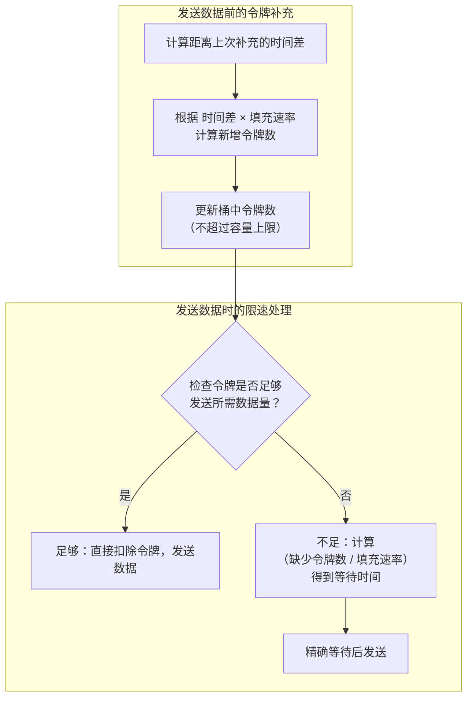
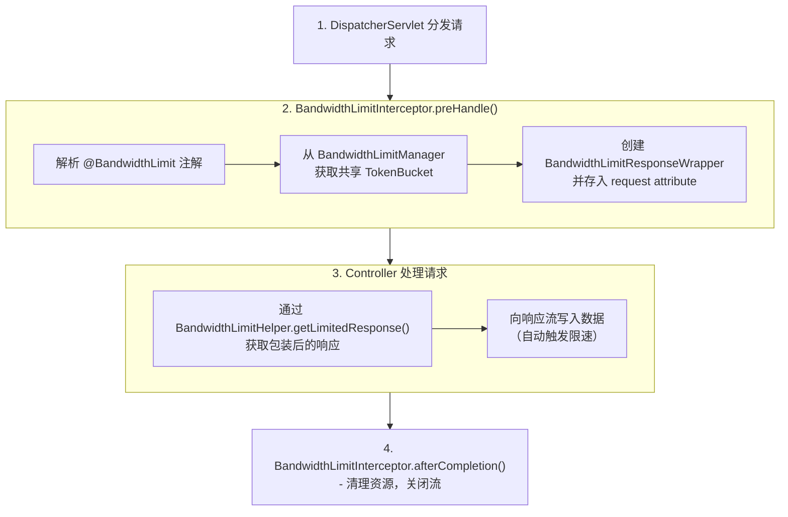

## 概述 ##

本文介绍在 Spring Boot 4 中实现多维度网络带宽限速的完整方案。基于令牌桶算法手动实现核心逻辑，通过自定义 `HandlerInterceptor` 拦截请求、`HttpServletResponseWrapper` 包装响应流、`RateLimitedOutputStream` 控制输出速率，实现对文件下载、视频流等场景的精确速度控制。

## 为什么需要带宽限速 ##

带宽限速与常见的 API 限流不同：限流控制的是*请求次数*（如每分钟100次），而限速控制的是网络带宽（如每秒200KB）。在实际应用中，带宽限速有着重要的业务价值：

### 场景一：文件下载服务 ###

对于网盘或资源分发平台，免费用户限制在 200KB/s，VIP 用户提升到 2MB/s，既能保障基础体验，又能激励付费转化。

### 场景二：视频流媒体 ###

不同清晰度对应不同带宽限制（480P 用 500KB/s，1080P 用 3MB/s），避免高码率视频占用过多服务器带宽。

### 场景三：API 接口保护 ###

大数据量接口（如导出报表）如果没有带宽控制，单个请求可能占满整个出口带宽，影响其他用户访问。

## 核心原理：令牌桶算法 ##

令牌桶算法是流量控制的经典方案，其思想非常直观：想象一个桶，系统以固定速率向桶中放入令牌，请求数据时必须从桶中取走对应数量的令牌。

核心参数解析：

1. 桶容量（Capacity）：决定能承受多大突发流量。容量为 200KB 时，即使桶已满，最多也只能连续发送 200KB 数据，之后必须等待令牌补充。

2. 填充速率（Refill Rate）：决定长期平均传输速度。每秒补充 200KB 令牌，意味着平均速度就是 200KB/s。

3. 分块大小（Chunk Size）：影响流量平滑度。将 8KB 数据拆分成 2KB×4 次写入，每次写入之间进行令牌检查，比一次性写入 8KB 更加平滑。

算法流程：



## 技术设计 ##

### 整体流程 ###

本方案采用拦截器模式，在请求处理的早期阶段完成限速组件的初始化，通过请求属性传递包装后的响应对象。



### 为什么选择 HandlerInterceptor ###

在 Spring Boot 中实现请求处理，有两种常见方式：Filter 和 HandlerInterceptor。本方案选择 HandlerInterceptor 的关键原因是：*注解解析需要 HandlerMethod 对象*。

Filter 在 DispatcherServlet 之前执行，此时还没有确定具体的处理方法，无法获取方法上的 · 注解。而 HandlerInterceptor 在处理器确定后执行，可以通过 HandlerMethod 精确获取方法级别和类级别的注解信息。

### 核心组件职责 ###

|  组件   |      职责 |
| :-----------: | :-----------: |
| `@BandwidthLimit` | 声明式注解，配置限速参数  |
| `BandwidthLimitInterceptor` | 拦截请求，解析注解，创建响应包装器  |
| `BandwidthLimitManager` | 管理多维度限速桶（全局/API/用户/IP）  |
| `BandwidthLimitResponseWrapper` | 包装 HttpServletResponse，替换 OutputStream  |
| `RateLimitedOutputStream` | 实现限速逻辑，包装 TokenBucket  |
| `TokenBucket` | 令牌桶算法实现  |
| `BandwidthLimitHelper` | 从请求属性中获取包装后的响应对象  |

## 多维度限速实现 ##

本方案支持四种限速维度，满足不同业务场景需求：

### 全局限速（GLOBAL） ###

所有请求共享同一个限速桶，适合保护服务器整体出口带宽。例如设置 10MB/s 全局限制，即使有100个并发下载，总带宽也不会超过 10MB/s。

```java
@BandwidthLimit(value = 200, unit = BandwidthUnit.KB, type = LimitType.GLOBAL)
@GetMapping("/download/global")
public void downloadGlobal(HttpServletResponse response) throws IOException {
    HttpServletResponse limitedResponse = BandwidthLimitHelper.getLimitedResponse(request, response);
    // 写入数据...
}
```

### API 维度限速（API） ###

每个接口路径独立限速，不同接口的流量互不影响。`/api/file/download` 限制 500KB/s，`/api/video/stream` 限制 2MB/s，两个接口可以同时达到各自的速度上限。

```java
@BandwidthLimit(value = 500, unit = BandwidthUnit.KB, type = LimitType.API)
@GetMapping("/download/file")
public void downloadFile(HttpServletResponse response) throws IOException {
    // 文件下载逻辑
}

@BandwidthLimit(value = 2048, unit = BandwidthUnit.KB, type = LimitType.API)
@GetMapping("/stream/video")
public void streamVideo(HttpServletResponse response) throws IOException {
    // 视频流逻辑
}
```

### 用户维度限速（USER） ###

根据用户标识（如请求头 `X-User-Id`）进行限速，每个用户独立计算带宽。配合 free 和 vip 参数，可实现差异化服务：

```java
@BandwidthLimit(value = 200, unit = BandwidthUnit.KB, type = LimitType.USER,
                free = 200, vip = 2048)
@GetMapping("/download/user")
public void downloadByUser(@RequestHeader("X-User-Type") String userType,
                           HttpServletResponse response) throws IOException {
    // 根据请求头 X-User-Type 自动应用 200KB/s 或 2MB/s 限速
}
```

### IP 维度限速（IP） ###

根据客户端 IP 地址限速，防止单个 IP 占用过多带宽。支持代理环境下的 IP 获取（X-Forwarded-For、X-Real-IP）。

```java
@BandwidthLimit(value = 300, unit = BandwidthUnit.KB, type = LimitType.IP)
@GetMapping("/download/ip")
public void downloadByIp(HttpServletResponse response) throws IOException {
    // 每个独立 IP 限制 300KB/s
}
```

## 关键代码实现 ##

### 令牌桶核心算法 ###

TokenBucket 的核心在于精确的时间计算和令牌补充。使用 `System.nanoTime()` 获取纳秒级时间戳，确保高精度速率控制。

```java
public synchronized void acquire(long permits) {
    // 1. 补充令牌
    refill();

    // 2. 计算等待时间
    if (tokens >= permits) {
        tokens -= permits;
        return;
    }

    long deficit = permits - tokens;
    long waitNanos = (deficit * 1_000_000_000L) / refillRate;

    // 3. 精确等待
    sleepNanos(waitNanos);

    // 4. 等待后消费
    tokens = 0;
}

private void refill() {
    long now = System.nanoTime();
    long elapsedNanos = now - lastRefillTime;
    long newTokens = (elapsedNanos * refillRate) / 1_000_000_000L;
    tokens = Math.min(capacity, tokens + newTokens);
    lastRefillTime = now;
}
```

### 响应包装器 ###

HttpServletResponseWrapper 是 Servlet 规范提供的响应包装基类，通过覆盖 getOutputStream() 方法返回自定义的限速输出流。

```java
public class BandwidthLimitResponseWrapper extends HttpServletResponseWrapper {
    private final TokenBucket sharedTokenBucket;  // 共享的令牌桶

    @Override
    public ServletOutputStream getOutputStream() throws IOException {
        if (limitedOutputStream == null && sharedTokenBucket != null) {
            // 使用共享 TokenBucket，确保多维度统计正确
            limitedOutputStream = new RateLimitedOutputStream(
                super.getOutputStream(),
                sharedTokenBucket,
                bandwidthBytesPerSecond
            );
        }
        return limitedOutputStream;
    }
}
```

### 拦截器获取包装响应 ###

拦截器在 `preHandle` 中创建响应包装器，存储到 request attribute，Controller 通过 `BandwidthLimitHelper` 获取。

```java
@Override
public boolean preHandle(HttpServletRequest request, HttpServletResponse response, Object handler) {
    BandwidthLimit annotation = findAnnotation(handler);
    if (annotation != null) {
        // 从 Manager 获取共享 TokenBucket
        TokenBucket bucket = limitManager.getBucket(type, key, capacity, rate);

        // 创建包装器并存储
        BandwidthLimitResponseWrapper wrappedResponse =
            new BandwidthLimitResponseWrapper(response, bucket, bandwidthBytesPerSecond, chunkSize);
        request.setAttribute("BandwidthLimitWrappedResponse", wrappedResponse);
    }
    return true;
}
```

### Controller 获取限速响应 ###

Controller 通过 `BandwidthLimitHelper.getLimitedResponse()` 获取包装后的响应，所有写入操作都会自动限速。

```java
@GetMapping("/download/global")
public void downloadGlobal(HttpServletRequest request, HttpServletResponse response) throws IOException {
    HttpServletResponse limitedResponse = BandwidthLimitHelper.getLimitedResponse(request, response);

    limitedResponse.setContentType("application/octet-stream");
    limitedResponse.setHeader("Content-Disposition", "attachment; filename=test.bin");

    // 写入数据时自动限速
    limitedResponse.getOutputStream().write(data);
}
```

## 参数调优指南 ##

### 桶容量选择 ###

容量决定突发流量承受能力：

|  容量设置   |      突发能力 |     适用场景 |
| :-----------: | :-----------: | :-----------: |
| 速率 × 0.5 | 平滑，无突发 |     流量控制严格的场景 |
| 速率 × 1.0 | 允许 1 秒突发 |     默认推荐值 |
| 速率 × 2.0 | 允许 2 秒突发 |     需要良好首屏加载 |

```java
// 注解配置
@BandwidthLimit(value = 200, unit = BandwidthUnit.KB, capacityMultiplier = 1.0)
```

### 分块大小选择 ###

分块大小影响流量平滑度，经验公式：`chunkSize = bandwidth / 50`

|  带宽   |      推荐分块 |   理由 |
| :-----------: | :-----------: | :-----------: |
| 200 KB/s | 1-4 KB |   小分块保证平滑 |
| 1 MB/s | 4-8 KB |   平衡平滑与性能 |
| 5 MB/s+ | 8-16 KB |   减少系统调用开销 |

```java
// 自动计算（推荐）
@BandwidthLimit(value = 200, unit = BandwidthUnit.KB, chunkSize = -1)

// 手动指定
@BandwidthLimit(value = 200, unit = BandwidthUnit.KB, chunkSize = 4096)
```

## 总结 ##

本文基于令牌桶算法，通过 `HandlerInterceptor` + `HttpServletResponseWrapper`，在 Spring Boot 中实现了多维度带宽限速。支持全局/API/用户/IP 四种限速维度，提供实时统计监控，适用于API接口保护、文件下载、视频流等场景。
