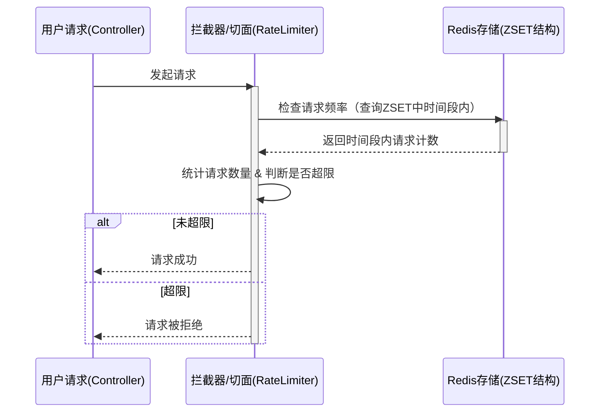

## 引言 ##

在互联网应用的安全建设中，接口防刷是抵御恶意攻击、保障系统稳定的核心环节。恶意用户的高频请求不仅会消耗服务器 CPU、内存、带宽等核心资源，还会造成短信验证码盗刷、密码暴力破解、第三方 API 超额调用等业务损失，严重影响正常用户的访问体验。

本文将基于 SpringBoot 框架，结合*Redis 的 ZSET 数据结构*实现滑动窗口计数算法，从架构设计、代码实现、业务落地到性能优化，全方位分析如何为登录、短信、支付等核心接口构建高可靠的防刷防护墙，让系统从容应对各类暴力攻击。

## 一、为什么必须做接口防刷？ ##

无有效防刷机制的系统，在面对恶意高频请求时，会面临多维度的风险，这些风险最终会传导至系统稳定性、业务成本和用户体验，甚至引发数据安全问题。

- 服务器资源被恶意挤占：持续的高频请求会耗尽 CPU、内存资源，占满数据库连接池，占用网络带宽，导致正常用户的请求被阻塞，系统响应变慢甚至服务不可用。
- 业务运营成本急剧增加：短信验证码被批量刷取会产生巨额通信费用，第三方 API 因调用次数超限需支付额外费用，为应对恶意请求的服务器扩容也会增加硬件成本。
- 用户体验与业务运营受影响：正常用户的合法请求被恶意请求挤占，出现请求超时、接口报错等问题，直接降低用户粘性；系统服务不可用还会导致业务交易中断，影响正常运营。
- 数据安全面临严重威胁：基于高频请求的密码暴力破解、优惠券 / 积分恶意刷取、爬虫批量抓取敏感数据等行为，会直接泄露用户信息和业务核心数据，引发安全事故。

面对以上问题，传统的固定窗口限流算法因存在边界漏判问题（如窗口切换瞬间的高频请求会突破限制），无法满足精准限流的需求。而滑动窗口计数算法能实时滑动统计时间窗口内的请求数，成为接口防刷的最优选择之一。

## 二、滑动窗口计数算法：接口防刷的核心选型 ##

滑动窗口计数算法是一种精准的限流策略，其核心是将时间划分为连续的小窗口，实时统计当前窗口内的请求次数，当请求数超过阈值时拒绝后续请求。相比固定窗口算法，它具备三大核心优势，完美适配接口防刷的业务需求。

- 限流精准，无边界漏洞：能精确统计任意时间窗口内的请求次数，窗口随时间实时滑动，避免了固定窗口切换时的限流失效问题，可精准响应请求频率的动态变化。
- 资源友好，内存占用可控：仅保留当前时间窗口内的请求数据，会自动清理过期的请求记录，结合 Redis 的过期策略，不会造成内存堆积，对服务器和 Redis 的资源消耗极低。
- 灵活适配，支持个性化配置：可根据不同接口的业务特性，单独设置时间窗口大小和最大请求数，支持 IP、用户 ID、接口名等多维度限流，还能动态调整限流参数，适配登录、短信、支付等不同场景。

本方案的核心设计是基于*Redis 的 ZSET 数据结构*实现滑动窗口：将请求的时间戳作为 `ZSET` 的 `score`，生成唯一标识作为 `value`，通过 ZSET 的有序性实现时间窗口的筛选，结合 `ZREMRANGEBYSCORE` 清理过期数据、`ZCOUNT` 统计窗口内请求数，完成限流判断。

## 三、核心架构设计：三层架构实现全链路防刷 ##

本次接口防刷方案采用「请求入口→切面拦截→Redis 存储」的三层架构设计，整体流程简洁清晰，无侵入式改造原有业务代码，便于开发和维护。



- 请求入口层（Controller） ：用户的所有接口请求均通过 Controller 进入系统，核心业务接口（登录、短信、支付）添加自定义限流注解，标记限流规则。
- 切面拦截层（RateLimitAspect） ：基于 Spring AOP 实现环绕通知，拦截带有限流注解的方法，自动生成限流 Key，调用滑动窗口计数服务做限流检查，超限则抛出自定义异常，反之执行原有业务逻辑。
- 数据存储层（Redis ZSET） ：作为滑动窗口的核心存储，记录每个限流 Key 的请求时间戳，提供过期数据清理、请求数统计、新请求记录的核心能力，保障限流判断的实时性和准确性。

三层架构的设计实现了*业务代码与防刷逻辑的解耦*，开发人员无需修改原有业务接口，仅通过注解即可为接口添加防刷能力，大幅提升开发效率。

## 四、完整代码实现：从核心算法到注解化限流 ##

本次方案的代码实现基于 SpringBoot 4.x，核心依赖为spring-boot-starter-data-redis（Redis 操作）、spring-boot-starter-aop（AOP 切面），所有代码均做了异常兜底，保证限流服务故障时不影响主业务，以下为核心模块的完整实现。

### 核心：滑动窗口计数服务实现 ###

封装 `SlidingWindowCounter` 服务，提供普通版和原子性版（Lua 脚本） 两种限流检查方法，原子性版通过 Lua 脚本将「清理过期数据→统计请求数→新增请求记录」合并为一个 Redis 原子操作，减少网络往返，提升高并发场景下的性能。

```java
@Service
@Slf4j
public class SlidingWindowCounter {
    @Autowired
    private RedisTemplate<String, Object> redisTemplate;

    /**
     * 普通版：检查指定Key在时间窗口内的请求次数
     * @param key 限流标识（用户ID、IP、接口名等）
     * @param windowMs 时间窗口（毫秒）
     * @param maxCount 窗口内最大请求数
     * @return true=允许请求，false=超出限制
     */
    public boolean isAllowed(String key, long windowMs, int maxCount) {
        try {
            long currentTime = System.currentTimeMillis();
            long windowStart = currentTime - windowMs;
            String redisKey = "rate_limit:" + key;

            // 1. 清理窗口之前的过期请求记录
            redisTemplate.opsForZSet().removeRangeByScore(redisKey, 0, windowStart);
            // 2. 统计当前窗口内的请求数
            Long currentCount = redisTemplate.opsForZSet().count(redisKey, windowStart, currentTime);
            // 3. 判断是否超限
            if (currentCount != null && currentCount >= maxCount) {
                log.warn("请求被限制: key={}, windowMs={}, maxCount={}, currentCount={}",
                        key, windowMs, maxCount, currentCount);
                return false;
            }
            // 4. 新增当前请求记录（唯一值区分同时间戳请求）
            redisTemplate.opsForZSet().add(redisKey, generateUniqueValue(), currentTime);
            // 5. 设置过期时间，避免Key永久存在（多保留1分钟）
            redisTemplate.expire(redisKey, Duration.ofMillis(windowMs + 60000));
            log.debug("请求通过: key={}, currentCount={}", key, (currentCount != null ? currentCount + 1 : 1));
            return true;
        } catch (Exception e) {
            log.error("滑动窗口计数检查异常", e);
            // 异常兜底：默认允许请求，防止限流服务影响主业务
            return true;
        }
    }

    /**
     * 原子性版：Lua脚本实现，减少Redis网络往返，提升高并发性能
     */
    public boolean isAllowedAtomic(String key, long windowMs, int maxCount) {
        String script =
                "local key = KEYS[1] " +
                "local window_start = ARGV[1] " +
                "local current_time = ARGV[2] " +
                "local max_count = ARGV[3] " +
                // 清理过期数据
                "redis.call('ZREMRANGEBYSCORE', key, 0, window_start) " +
                // 统计窗口内请求数
                "local current_count = redis.call('ZCOUNT', key, window_start, current_time) " +
                // 判断是否超限，0=拒绝，1=允许
                "if tonumber(current_count) >= tonumber(max_count) then " +
                    "return 0 " +
                "else " +
                    "redis.call('ZADD', key, current_time, current_time .. ':' .. math.random(1000000)) " +
                    "redis.call('EXPIRE', key, 60) " +
                    "return 1 " +
                "end";
        try {
            DefaultRedisScript<Long> redisScript = new DefaultRedisScript<>();
            redisScript.setScriptText(script);
            redisScript.setResultType(Long.class);
            Long result = redisTemplate.execute(redisScript,
                    Collections.singletonList("rate_limit:" + key),
                    String.valueOf(System.currentTimeMillis() - windowMs),
                    String.valueOf(System.currentTimeMillis()),
                    String.valueOf(maxCount)
            );
            boolean allowed = result != null && result == 1L;
            if (!allowed) {
                log.warn("请求被限制: key={}, windowMs={}, maxCount={}", key, windowMs, maxCount);
            }
            return allowed;
        } catch (Exception e) {
            log.error("原子性滑动窗口计数检查异常", e);
            return true;
        }
    }

    /**
     * 生成唯一值，区分同一时间戳的不同请求
     */
    private String generateUniqueValue() {
        return System.currentTimeMillis() + ":" + ThreadLocalRandom.current().nextLong(1000000);
    }

    /**
     * 辅助方法：获取指定Key当前窗口内的请求数
     */
    public long getCurrentCount(String key, long windowMs) {
        try {
            long currentTime = System.currentTimeMillis();
            long windowStart = currentTime - windowMs;
            String redisKey = "rate_limit:" + key;
            Long count = redisTemplate.opsForZSet().count(redisKey, windowStart, currentTime);
            return count != null ? count : 0L;
        } catch (Exception e) {
            log.error("获取当前请求数异常", e);
            return 0L;
        }
    }
}
```

### 基础：自定义限流注解与异常 ###

定义 `@RateLimit` 注解，支持注解化配置限流规则，可自定义限流 Key（兼容 SpEL 表达式）、时间窗口、最大请求数、提示信息，及 IP / 用户 ID / 默认（方法名）三种限流维度；同时定义自定义异常 `RateLimitException`，用于限流超时时的异常抛出和统一处理。

```java
/**
 * 自定义限流注解：支持方法/类级别，适配多维度限流
 */
@Target({ElementType.METHOD, ElementType.TYPE})
@Retention(RetentionPolicy.RUNTIME)
@Documented
public @interface RateLimit {
    /**
     * 限流Key，支持SpEL表达式（如：'sms:' + #phone）
     */
    String key() default "";

    /**
     * 时间窗口大小（毫秒），默认1分钟
     */
    long window() default 60000;

    /**
     * 窗口内最大请求数，默认10次
     */
    int count() default 10;

    /**
     * 超限时的提示信息
     */
    String message() default "请求过于频繁，请稍后再试";

    /**
     * 限流维度
     */
    LimitType limitType() default LimitType.DEFAULT;

    /**
     * 限流维度枚举
     */
    enum LimitType {
        /** 默认：方法名+参数作为Key */
        DEFAULT,
        /** IP地址：基于客户端IP限流 */
        IP,
        /** 用户ID：基于登录用户ID限流 */
        USER
    }
}

/**
 * 限流自定义异常：用于统一捕获和返回限流提示
 */
public class RateLimitException extends RuntimeException {
    public RateLimitException(String message) {
        super(message);
    }
}
```

### 关键：AOP 切面实现限流拦截 ###

实现 `RateLimitAspect` 切面，基于 `@Around` 环绕通知拦截带有 `@RateLimit` 注解的方法，核心逻辑包括：生成限流 Key→调用滑动窗口服务做检查→超限抛异常 / 正常执行业务。其中限流 Key 的生成支持 SpEL 表达式解析、IP / 用户 ID / 默认维度自动生成，适配不同业务场景。

```java
@Aspect
@Component
@Slf4j
public class RateLimitAspect {
    @Autowired
    private SlidingWindowCounter slidingWindowCounter;
    @Autowired
    private HttpServletRequest request;

    /**
     * 环绕通知：拦截所有带有@RateLimit注解的方法
     */
    @Around("@annotation(rateLimit)")
    public Object around(ProceedingJoinPoint joinPoint, RateLimit rateLimit) throws Throwable {
        // 1. 生成限流Key
        String key = generateKey(joinPoint, rateLimit);
        // 2. 调用原子性方法做限流检查
        boolean allowed = slidingWindowCounter.isAllowedAtomic(key, rateLimit.window(), rateLimit.count());
        // 3. 超限则抛出自定义异常
        if (!allowed) {
            log.warn("接口访问被限流: key={}, method={}", key, joinPoint.getSignature().getName());
            throw new RateLimitException(rateLimit.message());
        }
        // 4. 未超限则执行原有业务逻辑
        return joinPoint.proceed();
    }

    /**
     * 生成限流Key：支持SpEL解析、IP/用户ID/默认维度
     */
    private String generateKey(ProceedingJoinPoint joinPoint, RateLimit rateLimit) {
        String key = rateLimit.key();
        // 支持SpEL表达式解析（如：'sms:' + #phone）
        if (StringUtils.hasText(key)) {
            EvaluationContext context = new StandardEvaluationContext();
            Object[] args = joinPoint.getArgs();
            for (int i = 0; i < args.length; i++) {
                context.setVariable("arg" + i, args[i]);
            }
            ExpressionParser parser = new SpelExpressionParser();
            Expression expression = parser.parseExpression(key);
            return expression.getValue(context, String.class);
        }
        // 根据限流维度自动生成Key
        switch (rateLimit.limitType()) {
            case IP:
                return getClientIp() + ":" + joinPoint.getSignature().getName();
            case USER:
                // 实际项目中从Spring Security/Token中获取用户ID
                String userId = getCurrentUserId();
                return StringUtils.hasText(userId) ? userId : "anonymous";
            case DEFAULT:
            default:
                return joinPoint.getTarget().getClass().getSimpleName() +
                        "." + joinPoint.getSignature().getName();
        }
    }

    /**
     * 获取客户端真实IP：兼容反向代理（Nginx/APACHE）
     */
    private String getClientIp() {
        String xForwardedFor = request.getHeader("X-Forwarded-For");
        if (StringUtils.hasText(xForwardedFor) && !xForwardedFor.contains("unknown")) {
            return xForwardedFor.split(",")[0].trim();
        }
        String xRealIp = request.getHeader("X-Real-IP");
        if (StringUtils.hasText(xRealIp) && !xRealIp.contains("unknown")) {
            return xRealIp.trim();
        }
        return request.getRemoteAddr();
    }

    /**
     * 获取当前登录用户ID：实际项目中需根据认证框架实现
     */
    private String getCurrentUserId() {
        // 示例：实际从SecurityContextHolder/Token解析中获取
        return "user123";
    }
}
```

### 配置：全局 + 接口级参数化配置 ###

通过 `application.yml` 实现全局默认限流配置和特定接口个性化配置，结合 `@ConfigurationProperties` 实现配置参数的自动注入，同时支持限流开关、日志记录开关的全局控制，便于线上环境的动态调整。

#### 配置文件（application.yml） ####

```yaml
# 限流全局配置
rate-limit:
  enabled: true        # 是否启用限流
  log-enabled: true    # 是否记录限流日志
  default:             # 全局默认规则
    window: 60000      # 默认时间窗口：1分钟
    count: 10          # 默认最大请求数：10次
  specific:            # 特定接口个性化规则
    sms:
      window: 60000
      count: 5
    login:
      window: 60000
      count: 10
    payment:
      window: 3600000
      count: 20

# Redis配置
spring:
  redis:
    host: localhost
    port: 6379
    timeout: 2000ms
    lettuce:
      pool:
        max-active: 20  # 最大连接数
        max-idle: 10    # 最大空闲连接
        min-idle: 5     # 最小空闲连接
        max-wait: 1000ms# 连接等待时间
```

#### 配置类（RateLimitProperties） ####

```java
@Configuration
@ConfigurationProperties(prefix = "rate-limit")
@Data
public class RateLimitProperties {
    private boolean enabled = true;
    private boolean logEnabled = true;
    private DefaultConfig defaultConfig = new DefaultConfig();
    private SpecificConfig specificConfig = new SpecificConfig();

    // 全局默认配置
    @Data
    public static class DefaultConfig {
        private long window = 60000;
        private int count = 10;
    }

    // 特定接口配置
    @Data
    public static class SpecificConfig {
        private InterfaceConfig sms = new InterfaceConfig();
        private InterfaceConfig login = new InterfaceConfig();
        private InterfaceConfig payment = new InterfaceConfig();
    }

    // 单个接口配置
    @Data
    public static class InterfaceConfig {
        private long window = 60000;
        private int count = 10;
    }
}

// 配置注入工具类
@Component
@Data
public class RateLimitConfig {
    @Autowired
    private RateLimitProperties properties;

    public boolean isEnabled() {
        return properties.isEnabled();
    }

    public boolean isLogEnabled() {
        return properties.isLogEnabled();
    }

    public long getDefaultWindow() {
        return properties.getDefaultConfig().getWindow();
    }

    public int getDefaultCount() {
        return properties.getDefaultConfig().getCount();
    }
}
```

### 应用：核心业务接口注解化使用 ###

在登录、短信、支付等核心接口上添加 `@RateLimit` 注解，仅需一行代码即可实现防刷能力，无需修改原有业务逻辑。以下为典型接口的使用示例，支持单维度限流和多维度组合限流。

```java
@RestController
@RequestMapping("/api")
@Slf4j
public class SecurityController {
    @Autowired
    private SmsService smsService;
    @Autowired
    private UserService userService;
    @Autowired
    private PaymentService paymentService;

    /**
     * 短信发送接口：基于手机号限流，1分钟最多5次
     */
    @PostMapping("/sms/send")
    @RateLimit(key = "'sms:' + #phone", window = 60000, count = 5, message = "短信发送过于频繁，请稍后再试")
    public ResponseEntity<ApiResponse<String>> sendSms(@RequestParam String phone) {
        try {
            boolean success = smsService.sendVerificationCode(phone);
            return success ? ResponseEntity.ok(ApiResponse.success("验证码已发送"))
                    : ResponseEntity.badRequest().body(ApiResponse.error("验证码发送失败"));
        } catch (RateLimitException e) {
            return ResponseEntity.status(HttpStatus.TOO_MANY_REQUESTS)
                    .body(ApiResponse.error(e.getMessage()));
        }
    }

    /**
     * 登录接口：基于IP限流，1分钟最多10次
     */
    @PostMapping("/auth/login")
    @RateLimit(limitType = RateLimit.LimitType.IP, window = 60000, count = 10, message = "登录尝试过于频繁，请稍后再试")
    public ResponseEntity<ApiResponse<String>> login(@RequestBody LoginRequest request) {
        try {
            String token = userService.login(request);
            return ResponseEntity.ok(ApiResponse.success(token, "登录成功"));
        } catch (RateLimitException e) {
            return ResponseEntity.status(HttpStatus.TOO_MANY_REQUESTS)
                    .body(ApiResponse.error(e.getMessage()));
        } catch (Exception e) {
            log.error("登录异常", e);
            return ResponseEntity.status(HttpStatus.INTERNAL_SERVER_ERROR)
                    .body(ApiResponse.error("登录失败"));
        }
    }

    /**
     * 支付接口：基于用户ID限流，1小时最多20次
     */
    @PostMapping("/payment/create")
    @RateLimit(limitType = RateLimit.LimitType.USER, window = 3600000, count = 20, message = "支付请求过于频繁，请稍后再试")
    public ResponseEntity<ApiResponse<String>> createPayment(@RequestBody PaymentRequest request) {
        try {
            String orderId = paymentService.createPayment(request);
            return ResponseEntity.ok(ApiResponse.success(orderId, "支付订单创建成功"));
        } catch (RateLimitException e) {
            return ResponseEntity.status(HttpStatus.TOO_MANY_REQUESTS)
                    .body(ApiResponse.error(e.getMessage()));
        } catch (Exception e) {
            log.error("创建支付订单异常", e);
            return ResponseEntity.status(HttpStatus.INTERNAL_SERVER_ERROR)
                    .body(ApiResponse.error("支付订单创建失败"));
        }
    }

    /**
     * 高频健康检查接口：全局限流，1秒最多100次
     */
    @GetMapping("/health")
    @RateLimit(key = "'health_check'", window = 1000, count = 100, message = "健康检查请求过多")
    public ResponseEntity<ApiResponse<String>> healthCheck() {
        return ResponseEntity.ok(ApiResponse.success("OK", "服务正常"));
    }
}

// 基础请求对象（使用Lombok @Data简化）
@Data
class LoginRequest {
    private String username;
    private String password;
    private String ipAddress;
}

@Data
class PaymentRequest {
    private String userId;
    private BigDecimal amount;
    private String productId;
}

// 统一返回结果
@Data
@Builder
class ApiResponse<T> {
    private int code;
    private String message;
    private T data;

    public static <T> ApiResponse<T> success(T data) {
        return ApiResponse.<T>builder().code(200).message("成功").data(data).build();
    }

    public static <T> ApiResponse<T> success(T data, String message) {
        return ApiResponse.<T>builder().code(200).message(message).data(data).build();
    }

    public static <T> ApiResponse<T> error(String message) {
        return ApiResponse.<T>builder().code(429).message(message).data(null).build();
    }
}
```

## 五、业务场景落地：精细化限流适配核心接口 ##

不同的业务接口有不同的访问特性和风险等级，因此需要精细化的限流策略。本方案针对登录、短信、支付三大核心高风险接口，实现多维度组合限流（如 IP + 手机号、IP + 用户 ID），从源头抵御针对性的暴力攻击，以下为各场景的落地实现。

### 短信接口防刷：手机号 + IP 双维度限流 ###

短信接口是恶意刷取的重灾区，核心风险是验证码盗刷造成的通信成本损失，因此采用手机号（主维度）+ IP（辅维度） 的双维度限流：手机号 1 分钟最多 3 次，IP1 分钟最多 5 次，既防止单手机号被刷，也防止单 IP 批量刷取多个手机号。

```java
@Service
@Slf4j
public class SmsProtectionService {
    @Autowired
    private SlidingWindowCounter slidingWindowCounter;
    @Autowired
    private RateLimitMonitor rateLimitMonitor;

    /**
     * 双维度检查短信发送频率
     */
    public boolean checkSmsFrequency(String phone, String ip) {
        // 手机号维度：1分钟最多3次
        String phoneKey = "sms_phone:" + phone;
        boolean phoneAllowed = slidingWindowCounter.isAllowed(phoneKey, 60000, 3);
        if (!phoneAllowed) {
            rateLimitMonitor.recordRateLimitEvent(phoneKey, "sms-by-phone");
            return false;
        }
        // IP维度：1分钟最多5次
        String ipKey = "sms_ip:" + ip;
        boolean ipAllowed = slidingWindowCounter.isAllowed(ipKey, 60000, 5);
        if (!ipAllowed) {
            rateLimitMonitor.recordRateLimitEvent(ipKey, "sms-by-ip");
            return false;
        }
        return true;
    }

    /**
     * 记录短信发送行为，更新滑动窗口
     */
    public void recordSmsSent(String phone, String ip) {
        slidingWindowCounter.isAllowedAtomic("sms_phone:" + phone, 60000, 3);
        slidingWindowCounter.isAllowedAtomic("sms_ip:" + ip, 60000, 5);
        log.info("短信发送记录: phone={}", phone);
    }
}
```

### 登录接口防刷：IP + 用户 ID 双维度限流 ###

登录接口的核心风险是密码暴力破解，采用IP（主维度）+ 用户 ID（辅维度） 的双维度限流：IP1 分钟最多 10 次（防止单 IP 批量破解多个账号），用户 ID1 小时最多 20 次（防止单账号被高频破解），兼顾系统防护和用户体验。

```java
@Service
@Slf4j
public class LoginProtectionService {
    @Autowired
    private SlidingWindowCounter slidingWindowCounter;
    @Autowired
    private RateLimitMonitor rateLimitMonitor;

    /**
     * 双维度检查登录尝试频率
     */
    public boolean checkLoginFrequency(String ip, String username) {
        // IP维度：1分钟最多10次
        String ipKey = "login_ip:" + ip;
        boolean ipAllowed = slidingWindowCounter.isAllowed(ipKey, 60000, 10);
        if (!ipAllowed) {
            rateLimitMonitor.recordRateLimitEvent(ipKey, "login-by-ip");
            return false;
        }
        // 用户维度：1小时最多20次
        String userKey = "login_user:" + username;
        boolean userAllowed = slidingWindowCounter.isAllowed(userKey, 3600000, 20);
        if (!userAllowed) {
            rateLimitMonitor.recordRateLimitEvent(userKey, "login-by-user");
            return false;
        }
        return true;
    }

    /**
     * 记录登录尝试行为（无论成功与否）
     */
    public void recordLoginAttempt(String ip, String username, boolean success) {
        slidingWindowCounter.isAllowedAtomic("login_ip:" + ip, 60000, 10);
        slidingWindowCounter.isAllowedAtomic("login_user:" + username, 3600000, 20);
        if (!success) {
            log.warn("登录失败记录: ip={}, username={}", ip, username);
        }
    }
}
```

### 支付接口防刷：用户 ID+IP 双维度限流 ###

支付接口属于核心交易接口，对稳定性要求极高，采用用户 ID（主维度）+ IP（辅维度） 的双维度限流：用户 ID1 小时最多 20 次（防止单用户高频下单），IP1 小时最多 30 次（防止单 IP 批量模拟下单），保障交易系统的稳定。

```java
@Service
@Slf4j
public class PaymentProtectionService {
    @Autowired
    private SlidingWindowCounter slidingWindowCounter;
    @Autowired
    private RateLimitMonitor rateLimitMonitor;

    /**
     * 双维度检查支付请求频率
     */
    public boolean checkPaymentFrequency(String userId, String ip) {
        // 用户维度：1小时最多20次
        String userKey = "payment_user:" + userId;
        boolean userAllowed = slidingWindowCounter.isAllowed(userKey, 3600000, 20);
        if (!userAllowed) {
            rateLimitMonitor.recordRateLimitEvent(userKey, "payment-by-user");
            return false;
        }
        // IP维度：1小时最多30次
        String ipKey = "payment_ip:" + ip;
        boolean ipAllowed = slidingWindowCounter.isAllowed(ipKey, 3600000, 30);
        if (!ipAllowed) {
            rateLimitMonitor.recordRateLimitEvent(ipKey, "payment-by-ip");
            return false;
        }
        return true;
    }

    /**
     * 记录支付请求行为，更新滑动窗口
     */
    public void recordPaymentRequest(String userId, String ip) {
        slidingWindowCounter.isAllowedAtomic("payment_user:" + userId, 3600000, 20);
        slidingWindowCounter.isAllowedAtomic("payment_ip:" + ip, 3600000, 30);
        log.info("支付请求记录: userId={}", userId);
    }
}
```

## 六、监控 + 告警 + 优化：打造可观测、高性能的防刷体系 ##

一个成熟的接口防刷方案，不仅需要精准的限流能力，还需要完善的监控统计、及时的异常告警和高性能的优化策略，才能应对线上复杂的高并发场景，实现从「被动防御」到「主动防护」的转变。

### 监控统计：基于 MeterRegistry 实现可观测 ###

集成 Spring Boot Actuator 和 Micrometer，基于MeterRegistry实现限流指标的埋点统计，核心统计被限流请求数和活跃限流 Key 数，支持查询指定 Key 的实时请求数和限流状态，让限流行为可视化。

```java
@Service
@Slf4j
public class RateLimitMonitor {
    @Autowired
    private SlidingWindowCounter slidingWindowCounter;
    @Autowired
    private MeterRegistry meterRegistry;

    // 埋点指标：被限流的请求总数（带标签：key/endpoint）
    private final Counter rateLimitedCounter;
    // 埋点指标：活跃的限流Key数量
    private final Gauge activeRequestsGauge;

    public RateLimitMonitor(MeterRegistry meterRegistry) {
        this.rateLimitedCounter = Counter.builder("rate_limit_requests_total")
                .description("被限流的请求数")
                .register(meterRegistry);
        this.activeRequestsGauge = Gauge.builder("active_rate_limit_keys")
                .description("活跃的限流KEY数量")
                .register(meterRegistry, this, RateLimitMonitor::getActiveKeyCount);
    }

    /**
     * 记录限流事件，更新埋点指标
     */
    public void recordRateLimitEvent(String key, String endpoint) {
        rateLimitedCounter.increment(Tags.of("key", key, "endpoint", endpoint));
        log.info("限流事件: key={}, endpoint={}", key, endpoint);
    }

    /**
     * 获取活跃限流Key数量（示例：实际从Redis中统计）
     */
    public double getActiveKeyCount() {
        // 可通过Redis的KEYS/scan命令统计rate_limit:*前缀的Key数量
        return 0;
    }

    /**
     * 获取指定Key的限流统计信息
     */
    public RateLimitStats getStats(String key, long windowMs) {
        long currentCount = slidingWindowCounter.getCurrentCount(key, windowMs);
        return RateLimitStats.builder()
                .key(key)
                .currentCount(currentCount)
                .windowMs(windowMs)
                .allowed(currentCount < getMaxAllowedCount(key))
                .build();
    }

    /**
     * 根据Key前缀获取最大允许请求数
     */
    private int getMaxAllowedCount(String key) {
        if (key.startsWith("sms:")) return 5;
        if (key.startsWith("login:")) return 10;
        if (key.startsWith("payment:")) return 20;
        return 10;
    }

    // 限流统计信息实体
    @Data
    @Builder
    public static class RateLimitStats {
        private String key;
        private long currentCount;
        private long windowMs;
        private boolean allowed;
        private long remainingCount;
        private long resetTime;
    }
}
```

### 异常告警：定时检查实现攻击感知 ###

实现定时告警服务 `RateLimitAlertService`，基于 `@Scheduled` 定时统计限流次数，当限流次数超过预设阈值时，触发告警通知（钉钉 / 企业微信 / 邮件 / 日志），及时发现恶意攻击行为，做到早发现、早处理。

```java
@Component
@Slf4j
public class RateLimitAlertService {
    @Autowired
    private MeterRegistry meterRegistry;

    /**
     * 定时检查：每30秒统计一次限流次数
     */
    @Scheduled(fixedRate = 30000)
    public void checkRateLimitAlerts() {
        // 获取累计被限流请求数
        Double rateLimitedCount = meterRegistry.counter("rate_limit_requests_total").count();
        // 阈值判断：超过1000次则触发告警
        if (rateLimitedCount != null && rateLimitedCount > 1000) {
            log.warn("【限流告警】检测到大量限流请求，疑似恶意攻击！限流总数：{}", rateLimitedCount);
            // 实现告警发送逻辑：钉钉机器人/企业微信/邮件
            sendAlert("检测到大量限流请求，限流总数：" + rateLimitedCount + "，请及时检查是否存在恶意攻击");
        }
    }

    /**
     * 告警发送：实际项目中对接告警平台
     */
    private void sendAlert(String message) {
        // 示例：钉钉机器人WebHook调用
        // RestTemplate.postForObject(dingTalkWebHook, new DingTalkMessage(message), String.class);
        log.error("【告警通知】{}", message);
    }
}
```

### 性能优化: 从本地缓存到连接池，提升高并发能力 ###

针对高并发场景下的性能瓶颈，从本地缓存、Redis 连接池、批量操作三个维度做优化，减少 Redis 的网络访问，提升限流服务的处理能力，同时保证限流的精准性。

- 本地缓存优化：引入 Caffeine 本地缓存，对高频限流请求做 10 秒本地缓存，减少 Redis 的访问次数，适用于对限流精度要求稍低的高频接口（如健康检查）；
- Redis 连接池优化：配置合理的 Redis Lettuce 连接池参数（最大连接数、最大空闲连接、连接等待时间），避免连接耗尽导致的限流服务阻塞；
- 原子性操作优化：优先使用 Lua 脚本实现的原子性限流方法，将多个 Redis 操作合并为一个，减少网络往返，提升高并发下的处理效率；
- 异常兜底优化：所有 Redis 操作均添加异常捕获，异常时默认允许请求，防止 Redis 服务故障导致整个系统的服务不可用。

以下为本地缓存优化的核心实现：

```java
@Service
@Slf4j
public class OptimizedRateLimitService {
    @Autowired
    private RedisTemplate<String, Object> redisTemplate;

    // Caffeine本地缓存：最大1000个Key，10秒过期
    private final LoadingCache<String, Boolean> localCache = Caffeine.newBuilder()
            .maximumSize(1000)
            .expireAfterWrite(Duration.ofSeconds(10))
            .build(this::checkRateLimit);

    /**
     * 带本地缓存的限流检查：适用于高频低精度接口
     */
    public boolean isAllowedWithCache(String key, long windowMs, int maxCount) {
        String cacheKey = key + ":" + windowMs + ":" + maxCount;
        return localCache.get(cacheKey);
    }

    /**
     * 缓存加载方法：调用原子性限流检查
     */
    private Boolean checkRateLimit(String cacheKey) {
        String[] parts = cacheKey.split(":");
        String key = parts[0];
        long windowMs = Long.parseLong(parts[1]);
        int maxCount = Integer.parseInt(parts[2]);
        return new SlidingWindowCounter().isAllowedAtomic(key, windowMs, maxCount);
    }
}
```

## 七、最佳实践与配置建议 ##

结合线上实际业务场景，总结以下接口防刷的最佳实践和标准化配置建议，可以快速落地，避免过度限流或限流不足的问题。

### 限流参数标准化配置 ###

根据接口的业务特性和风险等级，制定标准化的限流参数，以下为通用配置建议，可根据实际业务量调整：

|  接口类型   |   时间窗口 |  最大请求数   |   限流维度 |  核心目的 |
| :-----------: | :-----------: | :-----------: | :-----------: | :-----------: |
| 短信发送 | 1 分钟 |  3-5 次   |      手机号 + IP |      防止验证码盗刷 |
| 用户登录 | 1 分钟 |  10 次   |      IP + 用户 ID |      防止密码暴力破解 |
| 支付 / 下单 | 1 小时 |  20-30 次   |   用户 ID+IP |    保障交易系统稳定 |
| 健康检查 / 心跳 | 1 秒 |  100-200 次   |      全局 Key |      适配高并发健康检查 |
| 普通业务接口 | 1 分钟 |  10-20 次   |      IP / 默认 |      防止单 IP 高频访问 |

### 开发与运维最佳实践 ###

- 注解化开发：优先使用 `@RateLimit` 注解为接口添加防刷能力，实现业务与防刷逻辑的解耦，便于维护和扩展；
- 多维度组合限流：核心高风险接口（短信、登录、支付）采用双维度限流，单维度限流难以抵御针对性的恶意攻击；
- 异常兜底必加：所有 Redis 操作和限流检查必须添加异常捕获，异常时默认允许请求，防止限流服务成为系统瓶颈；
- 监控告警必配：线上环境必须开启限流监控和告警，及时发现恶意攻击，避免系统被持续消耗；
- 参数动态调整：通过配置文件实现限流参数的全局控制，支持线上动态调整，无需重启服务；
- 避免过度限流：限流参数需根据业务实际访问量评估，避免因限流阈值过低影响正常用户的访问体验。

## 八、方案预期效果 ##

通过 SpringBoot + Redis + 滑动窗口计数算法实现的接口防刷方案，能为系统带来多维度的提升，打造高可靠、高安全、高性能的接口防护体系：

- 精准限流，抵御恶意攻击：实时滑动统计请求数，无边界漏洞，能精准控制接口的访问频率，从源头抵御暴力攻击、恶意刷取等行为；
- 资源保护，降低运营成本：有效减少恶意请求对服务器、数据库、带宽的消耗，避免短信验证码、第三方 API 的超额调用，降低运营成本；
- 体验保障，提升用户粘性：保障正常用户的请求优先级，避免因恶意请求导致的系统响应慢、服务不可用，提升用户访问体验；
- 可观测性，实现主动防护：完善的监控统计和异常告警体系，让限流行为可视化，能及时发现恶意攻击，实现从「被动防御」到「主动防护」的转变；
- 易扩展，适配多业务场景：注解化设计 + 多维度限流，可快速为新接口添加防刷能力，适配登录、短信、支付、普通业务等多场景，便于业务扩展。

## 九、总结 ##

接口防刷是互联网应用安全建设的基础且核心环节，面对日益复杂的网络攻击，传统的固定窗口限流已无法满足精准防护的需求。本文基于 SpringBoot 框架，结合 Redis 的 ZSET 数据结构实现了滑动窗口计数算法，从架构设计、代码实现、业务落地到监控优化，打造了一套完整、可落地、高性能的接口防刷方案。

该方案的核心优势在于精准的限流能力、无侵入式的开发体验、完善的可观测体系和高性能的优化策略，仅需通过注解即可为核心接口添加防刷能力，同时支持多维度组合限流、参数动态调整、异常兜底和告警通知，能有效抵御暴力攻击、恶意刷取等行为，保障系统的稳定性、安全性和可用性。

在实际项目中，可根据业务特性调整限流参数和维度，结合自身的认证框架（如 Spring Security）、告警平台（如钉钉、企业微信）做个性化扩展，让接口防刷方案更贴合实际业务需求，为系统的安全运行保驾护航。
