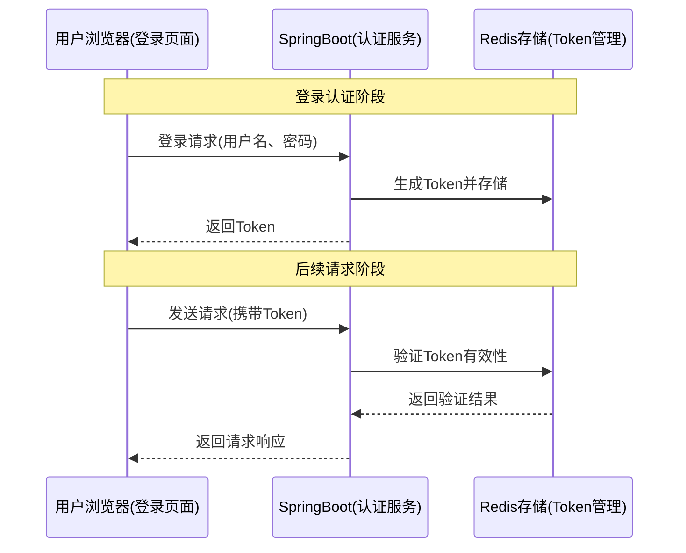

## 引言 ##

最近在优化用户登录体验时，发现一个有意思的现象：用户平均每天打开APP 3-5次，但每次都要求输入密码，体验真的很差。于是我们引入了七天免密登录功能，用户勾选"七天内自动登录"后，7天内无需输入密码，大大提升了用户体验。

很多同学可能觉得免密登录很复杂，其实只要合理利用Redis的过期机制，实现起来并不难。今天就来聊聊如何用SpringBoot + Redis实现一个安全可靠的七天免密登录系统。

## 为什么需要七天免密登录？ ##

### 用户体验痛点 ###

传统的登录方式存在这些问题：

*频繁登录*：

- 用户每天多次打开APP都要输入账号密码
- 忘记密码导致登录失败
- 手机端输入密码体验差

*记忆负担*：

- 多个APP需要记住不同密码
- 密码复杂度要求高，难以记忆
- 密码管理混乱

*安全与便利的平衡*：

- 短期免密登录：兼顾安全与便利
- 长期记住密码：安全风险高
- 永久免密登录：安全隐患大

## 核心架构设计 ##

我们的七天免密登录架构：



## 核心设计要点 ##

### Token设计策略 ###

```java
// 免密登录Token实体
@Data
public class AutoLoginToken {
    private String token;           // 唯一标识
    private Long userId;           // 用户ID
    private String deviceId;       // 设备ID
    private String userAgent;      // 用户代理信息
    private LocalDateTime createTime; // 创建时间
    private LocalDateTime expireTime; // 过期时间
    private String ip;             // IP地址（可选）
}

// Token生成策略
@Component
public class TokenGenerator {
    
    public String generateToken(Long userId, String deviceId) {
        // 使用UUID + 用户ID + 时间戳生成唯一Token
        String tokenSource = userId + "_" + deviceId + "_" + System.currentTimeMillis();
        return DigestUtils.md5DigestAsHex(tokenSource.getBytes());
    }
}
```

### Redis存储结构 ###

```java
// Redis存储设计
@Component
public class RedisTokenStore {
    
    private static final String TOKEN_PREFIX = "autologin:token:";
    private static final String USER_TOKEN_PREFIX = "autologin:user:";
    private static final int TOKEN_EXPIRE_DAYS = 7;
    
    // 存储Token信息
    public void storeToken(String token, AutoLoginToken autoLoginToken) {
        String key = TOKEN_PREFIX + token;
        String userKey = USER_TOKEN_PREFIX + autoLoginToken.getUserId();
        
        // 存储Token详细信息
        redisTemplate.opsForValue().set(key, autoLoginToken, 
            TOKEN_EXPIRE_DAYS, TimeUnit.DAYS);
        
        // 建立用户与Token的关联（用于单点登录控制）
        redisTemplate.opsForValue().set(userKey, token, 
            TOKEN_EXPIRE_DAYS, TimeUnit.DAYS);
    }
    
    // 获取Token信息
    public AutoLoginToken getToken(String token) {
        String key = TOKEN_PREFIX + token;
        return (AutoLoginToken) redisTemplate.opsForValue().get(key);
    }
    
    // 删除Token
    public void removeToken(String token, Long userId) {
        String key = TOKEN_PREFIX + token;
        String userKey = USER_TOKEN_PREFIX + userId;
        
        redisTemplate.delete(key);
        redisTemplate.delete(userKey);
    }
}
```

### 安全验证机制 ###

```java
// 安全验证策略
@Component
public class TokenValidator {
    
    public boolean validateToken(String token, String deviceId, String userAgent, String ip) {
        AutoLoginToken storedToken = redisTokenStore.getToken(token);
        
        if (storedToken == null) {
            return false;  // Token不存在或已过期
        }
        
        // 验证设备ID是否匹配
        if (!Objects.equals(storedToken.getDeviceId(), deviceId)) {
            return false;  // 设备不匹配
        }
        
        // 验证User-Agent是否匹配（防止Token被盗用）
        if (!Objects.equals(storedToken.getUserAgent(), userAgent)) {
            return false;  // User-Agent不匹配
        }
        
        // 可选：验证IP地址（严格模式）
        if (storedToken.getIp() != null && !Objects.equals(storedToken.getIp(), ip)) {
            return false;  // IP地址不匹配
        }
        
        return true;
    }
    
    // 验证通过后，延长Token有效期
    public void refreshToken(String token) {
        AutoLoginToken storedToken = redisTokenStore.getToken(token);
        if (storedToken != null) {
            // 重新设置过期时间为7天
            redisTokenStore.storeToken(token, storedToken);
        }
    }
}
```

## 关键实现细节 ##

### 登录控制器 ###

```java
@RestController
@RequestMapping("/auth")
public class AuthController {
    
    @PostMapping("/login")
    public ResponseEntity<LoginResponse> login(@RequestBody LoginRequest request) {
        // 验证用户名密码
        User user = userService.authenticate(request.getUsername(), request.getPassword());
        
        if (user == null) {
            return ResponseEntity.status(HttpStatus.UNAUTHORIZED)
                .body(LoginResponse.failed("用户名或密码错误"));
        }
        
        // 创建登录响应
        LoginResponse response = new LoginResponse();
        response.setUserId(user.getId());
        response.setUsername(user.getUsername());
        
        // 如果用户选择了七天免密登录
        if (request.isRememberMe()) {
            String token = tokenGenerator.generateToken(user.getId(), request.getDeviceId());
            
            AutoLoginToken autoLoginToken = new AutoLoginToken();
            autoLoginToken.setToken(token);
            autoLoginToken.setUserId(user.getId());
            autoLoginToken.setDeviceId(request.getDeviceId());
            autoLoginToken.setUserAgent(request.getUserAgent());
            autoLoginToken.setCreateTime(LocalDateTime.now());
            autoLoginToken.setExpireTime(LocalDateTime.now().plusDays(7));
            autoLoginToken.setIp(request.getIp());
            
            redisTokenStore.storeToken(token, autoLoginToken);
            
            response.setToken(token);
            response.setRememberMe(true);
        }
        
        return ResponseEntity.ok(response);
    }
    
    @PostMapping("/auto-login")
    public ResponseEntity<LoginResponse> autoLogin(@RequestBody AutoLoginRequest request) {
        // 验证Token有效性
        boolean isValid = tokenValidator.validateToken(
            request.getToken(), 
            request.getDeviceId(), 
            request.getUserAgent(), 
            request.getIp()
        );
        
        if (!isValid) {
            return ResponseEntity.status(HttpStatus.UNAUTHORIZED)
                .body(LoginResponse.failed("免密登录Token无效"));
        }
        
        // 获取用户信息
        AutoLoginToken tokenInfo = redisTokenStore.getToken(request.getToken());
        User user = userService.getById(tokenInfo.getUserId());
        
        // 延长Token有效期
        tokenValidator.refreshToken(request.getToken());
        
        // 返回登录成功信息
        LoginResponse response = new LoginResponse();
        response.setUserId(user.getId());
        response.setUsername(user.getUsername());
        response.setToken(request.getToken());
        response.setRememberMe(true);
        
        return ResponseEntity.ok(response);
    }
    
    @PostMapping("/logout")
    public ResponseEntity<String> logout(@RequestBody LogoutRequest request) {
        // 删除Token
        if (request.getToken() != null) {
            AutoLoginToken tokenInfo = redisTokenStore.getToken(request.getToken());
            if (tokenInfo != null) {
                redisTokenStore.removeToken(request.getToken(), tokenInfo.getUserId());
            }
        }
        
        return ResponseEntity.ok("退出成功");
    }
}
```

### 拦截器实现 ###

```java
@Component
public class AutoLoginInterceptor implements HandlerInterceptor {
    
    @Override
    public boolean preHandle(HttpServletRequest request, HttpServletResponse response, Object handler) {
        String token = request.getHeader("Authorization");
        
        if (token != null && token.startsWith("Bearer ")) {
            token = token.substring(7);
            
            boolean isValid = tokenValidator.validateToken(
                token,
                request.getHeader("Device-ID"), 
                request.getHeader("User-Agent"),
                getClientIpAddress(request)
            );
            
            if (isValid) {
                // 设置当前用户上下文
                AutoLoginToken tokenInfo = redisTokenStore.getToken(token);
                CurrentUserContext.setUserId(tokenInfo.getUserId());
                
                // 延长Token有效期
                tokenValidator.refreshToken(token);
            }
        }
        
        return true;
    }
    
    @Override
    public void afterCompletion(HttpServletRequest request, HttpServletResponse response, Object handler, Exception ex) {
        // 清理用户上下文
        CurrentUserContext.clear();
    }
    
    private String getClientIpAddress(HttpServletRequest request) {
        String xForwardedFor = request.getHeader("X-Forwarded-For");
        if (xForwardedFor != null && !xForwardedFor.isEmpty()) {
            return xForwardedFor.split(",")[0].trim();
        }
        return request.getRemoteAddr();
    }
}
```

### 用户上下文管理 ###

```java
// 当前线程用户上下文
public class CurrentUserContext {
    private static final ThreadLocal<Long> USER_CONTEXT = new ThreadLocal<>();
    
    public static void setUserId(Long userId) {
        USER_CONTEXT.set(userId);
    }
    
    public static Long getUserId() {
        return USER_CONTEXT.get();
    }
    
    public static void clear() {
        USER_CONTEXT.remove();
    }
    
    public static boolean isAuthenticated() {
        return USER_CONTEXT.get() != null;
    }
}

// 用户信息服务
@Service
public class CurrentUserService {
    
    public User getCurrentUser() {
        Long userId = CurrentUserContext.getUserId();
        if (userId != null) {
            return userService.getById(userId);
        }
        return null;
    }
    
    public boolean isCurrentUser(Long userId) {
        return Objects.equals(CurrentUserContext.getUserId(), userId);
    }
}
```

## 业务场景应用 ##

### 登录页面实现 ###

```html
<!DOCTYPE html>
<html>
<head>
    <title>用户登录</title>
</head>
<body>
    <form id="loginForm">
        <div>
            <label>用户名:</label>
            <input type="text" id="username" required>
        </div>
        <div>
            <label>密码:</label>
            <input type="password" id="password" required>
        </div>
        <div>
            <input type="checkbox" id="rememberMe"> 
            <label for="rememberMe">七天内自动登录</label>
        </div>
        <button type="submit">登录</button>
    </form>

    <script>
        document.getElementById('loginForm').addEventListener('submit', async function(e) {
            e.preventDefault();
            
            const formData = {
                username: document.getElementById('username').value,
                password: document.getElementById('password').value,
                rememberMe: document.getElementById('rememberMe').checked,
                deviceId: getDeviceId(), // 生成设备ID
                userAgent: navigator.userAgent,
                ip: await getClientIP() // 获取客户端IP
            };
            
            const response = await fetch('/auth/login', {
                method: 'POST',
                headers: {'Content-Type': 'application/json'},
                body: JSON.stringify(formData)
            });
            
            if (response.ok) {
                const data = await response.json();
                if (data.token) {
                    // 保存Token到localStorage（免密登录用）
                    localStorage.setItem('autologin_token', data.token);
                }
                window.location.href = '/dashboard';
            } else {
                alert('登录失败');
            }
        });
    </script>
</body>
</html>
```

### 自动登录检查 ###

```javascript
// 页面加载时检查自动登录
window.addEventListener('load', async function() {
    const token = localStorage.getItem('autologin_token');
    if (token) {
        const response = await fetch('/auth/auto-login', {
            method: 'POST',
            headers: {'Content-Type': 'application/json'},
            body: JSON.stringify({
                token: token,
                deviceId: getDeviceId(),
                userAgent: navigator.userAgent,
                ip: await getClientIP()
            })
        });
        
        if (response.ok) {
            const data = await response.json();
            // 自动登录成功，跳转到主页
            window.location.href = '/dashboard';
        } else {
            // Token无效，清除本地存储
            localStorage.removeItem('autologin_token');
        }
    }
});
```

### 安全管理功能 ###

```java
// 安全管理服务
@Service
public class SecurityManagementService {
    
    // 查看用户的所有登录设备
    public List<LoginDeviceInfo> getUserLoginDevices(Long userId) {
        // 从Redis获取用户的所有Token信息
        String userTokenKey = "autologin:user:" + userId;
        String token = (String) redisTemplate.opsForValue().get(userTokenKey);
        
        if (token != null) {
            AutoLoginToken autoLoginToken = redisTokenStore.getToken(token);
            if (autoLoginToken != null) {
                LoginDeviceInfo deviceInfo = new LoginDeviceInfo();
                deviceInfo.setToken(token);
                deviceInfo.setDeviceId(autoLoginToken.getDeviceId());
                deviceInfo.setLastLoginTime(autoLoginToken.getCreateTime());
                deviceInfo.setExpireTime(autoLoginToken.getExpireTime());
                return Arrays.asList(deviceInfo);
            }
        }
        
        return new ArrayList<>();
    }
    
    // 强制注销某个设备
    public void forceLogoutDevice(Long userId, String token) {
        redisTokenStore.removeToken(token, userId);
    }
    
    // 注销所有设备
    public void logoutAllDevices(Long userId) {
        // 找到所有相关Token并删除
        String userTokenKey = "autologin:user:" + userId;
        String token = (String) redisTemplate.opsForValue().get(userTokenKey);
        
        if (token != null) {
            redisTokenStore.removeToken(token, userId);
        }
    }
}
```

## 最佳实践建议 ##

### 安全防护措施 ###

```java
@Component
public class SecurityEnhancer {
    
    // 防止暴力破解
    private final Map<String, Integer> loginAttemptCount = new ConcurrentHashMap<>();
    private final Map<String, LocalDateTime> lastAttemptTime = new ConcurrentHashMap<>();
    
    public boolean checkLoginAttempt(String username) {
        String key = "login_attempt:" + username;
        Integer count = (Integer) redisTemplate.opsForValue().get(key);
        
        if (count != null && count >= 5) {  // 5次登录失败
            return false;  // 暂时禁止登录
        }
        
        return true;
    }
    
    public void recordLoginAttempt(String username, boolean success) {
        String key = "login_attempt:" + username;
        
        if (success) {
            redisTemplate.delete(key);  // 登录成功，清除尝试记录
        } else {
            // 登录失败，增加尝试次数
            redisTemplate.opsForValue().increment(key);
            redisTemplate.expire(key, 30, TimeUnit.MINUTES);  // 30分钟内有效
        }
    }
    
    // 设备指纹验证
    public String generateDeviceFingerprint(String userAgent, String ip) {
        String fingerprint = userAgent + ":" + ip;
        return DigestUtils.md5DigestAsHex(fingerprint.getBytes());
    }
}
```

### 监控告警 ###

```java
@Component
public class LoginMonitor {
    
    @EventListener
    public void handleLoginEvent(LoginEvent event) {
        // 记录登录日志
        log.info("用户登录: userId={}, device={}, ip={}, success={}", 
            event.getUserId(), event.getDeviceId(), event.getIp(), event.isSuccess());
        
        // 监控指标上报
        if (event.isSuccess()) {
            MeterRegistry registry = Metrics.globalRegistry;
            registry.counter("login.success").increment();
            registry.timer("login.duration").record(event.getDuration(), TimeUnit.MILLISECONDS);
        } else {
            Metrics.globalRegistry.counter("login.failure").increment();
        }
        
        // 异常登录检测
        if (isSuspiciousLogin(event)) {
            alertService.sendAlert("异常登录", 
                String.format("用户 %s 在 %s 从 %s 登录", 
                    event.getUserId(), event.getDeviceId(), event.getIp()));
        }
    }
    
    private boolean isSuspiciousLogin(LoginEvent event) {
        // 检查异地登录、频繁登录等异常行为
        return checkGeographicAnomaly(event) || checkFrequencyAnomaly(event);
    }
}
```

### 性能优化 ###

```java
@Configuration
public class RedisConfig {
    
    // Redis连接池配置
    @Bean
    public LettuceConnectionFactory redisConnectionFactory() {
        LettuceClientConfiguration clientConfig = LettuceClientConfiguration.builder()
            .commandTimeout(Duration.ofSeconds(5))
            .option(SocketOptions::builder)
                .connectTimeout(Duration.ofSeconds(3))
            .build();
        
        RedisStandaloneConfiguration serverConfig = new RedisStandaloneConfiguration();
        serverConfig.setHostName("localhost");
        serverConfig.setPort(6379);
        
        return new LettuceConnectionFactory(serverConfig, clientConfig);
    }
    
    // Token缓存优化
    @Bean
    public RedisTemplate<String, Object> redisTemplate(RedisConnectionFactory connectionFactory) {
        RedisTemplate<String, Object> template = new RedisTemplate<>();
        template.setConnectionFactory(connectionFactory);
        
        // 使用Jackson序列化
        Jackson2JsonRedisSerializer<Object> serializer = new Jackson2JsonRedisSerializer<>(Object.class);
        ObjectMapper objectMapper = new ObjectMapper();
        objectMapper.setVisibility(PropertyAccessor.ALL, JsonAutoDetect.Visibility.ANY);
        objectMapper.activateDefaultTyping(LazyLoadingAwareObjectMapper.getDefaultFactory());
        serializer.setObjectMapper(objectMapper);
        
        template.setValueSerializer(serializer);
        template.setKeySerializer(new StringRedisSerializer());
        template.afterPropertiesSet();
        
        return template;
    }
}
```

## 预期效果 ##

通过七天免密登录方案，我们可以实现：

- 用户体验提升：用户7天内无需重复登录，操作更便捷
- 登录转化率提高：减少登录步骤，降低流失率
- 安全性保障：多重验证机制，防止Token盗用
- 运维友好：完善的监控和管理功能
- 扩展性强：支持多种免密时长配置

这套方案在保证安全的前提下，极大提升了用户登录体验，是现代Web应用的标配功能。
