## 引入 ##

引入 security 依赖, 版本随 spring boot 版本就可以, 版本不一致,可能会出现依赖冲突.

我当前使用的是 `4.0.5`, 底层是 spring-security `7.0.4`

```xml
<!-- spring security-->
    <dependency>
            <groupId>org.springframework.security</groupId>
            <artifactId>spring-security-web</artifactId>
            <scope>provided</scope>
        </dependency>

        <dependency>
            <groupId>com.nimbusds</groupId>
            <artifactId>nimbus-jose-jwt</artifactId>
        </dependency>
```

## 整体架构 ##

登录认证和鉴权的完整流程:

```mermaid
sequenceDiagram
    participant C as 客户端
    participant G as API网关
    participant A as 认证服务
    participant S as 系统服务
    participant B as 业务服务
    C ->> G: 1. 登录请求 (用户名、密码)
    G ->> A: 2. 路由至认证服务
    A ->> S: 3. 调用 getUerByName (Feign)
    S -->> A: 4. 返回用户基础信息 (含角色)
    A ->> A: 5. 验证密码，生成JWT
    A -->> C: 6. 返回JWT令牌
    C ->> G: 7. 业务请求 (Header: Bearer &#x3C;JWT>)
    G ->> G: 8. 校验JWT，解析出用户ID
    G ->> B: 9. 转发请求，添加Header (X-User-Id)
    Note over B: 10. 业务服务内
    alt 白名单接口命中
        B -->> C: 直接返回业务数据
    end
    B ->> B: 10.1 JWT过滤器从缓存查询用户
    alt 缓存未命中
        B -->> C: 拒绝访问
    else 缓存命中
        B -->> B: 从缓存获取完整用户信息
        B ->> B: 10.4 构建Authentication对象
        B ->> B: 10.5 设置SecurityContext
        B --> B: 10.6 根据PreAuthorize进行鉴权
        B -->> C: 11. 返回业务数据
    end
```



## spring security 配置 ##

### SecurityFilterChain 配置 ###

```java
@Bean
public SecurityFilterChain securityFilterChain(HttpSecurity http) throws Exception {
    http
            // 禁用跨域保护
            .cors(AbstractHttpConfigurer::disable)
            // 前后端访问, 禁用跨站保护
            .csrf(AbstractHttpConfigurer::disable)
            // 禁用Basic认证
            .httpBasic(AbstractHttpConfigurer::disable)
            // 禁用表单认证
            .formLogin(AbstractHttpConfigurer::disable)
            // 添加请求的鉴权拦截器
            .addFilterBefore(authFilter, UsernamePasswordAuthenticationFilter.class)
            // 前后端分离禁用session
            .sessionManagement(session -> session.sessionCreationPolicy(SessionCreationPolicy.STATELESS))
            .authorizeHttpRequests(authorization -> {
                // 通过yml 配置,控制哪些不需要spring security保护
                if (!CollectionUtils.isEmpty(securityProperty.getExcludeAuth())) {
                    authorization.requestMatchers(securityProperty.getExcludeAuth().toArray(new String[0])).permitAll();
                }
                authorization.anyRequest().authenticated();
            })
            // 异常处理
            .exceptionHandling(exception ->
                                       // 未认证访问统一处理
                                       exception.authenticationEntryPoint(myAuthenticationEntryPoint)
                                               // 鉴权失败统一处理
                                               .accessDeniedHandler(accessDeniedHandler));
    return http.build();
}
```

### AuthenticationManager 配置 ###

AuthenticationManager 提供一个集中式的认证调度中心。它本身不直接执行认证逻辑，而是作为认证流程的入口，负责协调和管理具体的认证工作。

```java
@Bean
public AuthenticationManager authenticationManager(AuthenticationConfiguration authConfig) throws Exception {
    // 从 AuthenticationConfiguration 获取全局的 AuthenticationManager
    return authConfig.getAuthenticationManager();
}
```

工作执行流程:

```mermaid
sequenceDiagram
    participant Client
    participant UPFilter as UsernamePassword-&#x3C;br>AuthenticationFilter
    participant AuthMan as AuthenticationManager
    participant DaoAuthP as DaoAuthenticationProvider
    participant UDS as UserDetailsService
    participant PE as PasswordEncoder&#x3C;br>(MyPasswordEncoder)
    Client ->> UPFilter: 提交登录请求 (用户名/密码)
    UPFilter ->> AuthMan: 传递未认证的&#x3C;br>UsernamePasswordAuthenticationToken
    AuthMan ->> DaoAuthP: 委托认证
    DaoAuthP ->> UDS: 调用 loadUserByUsername(username)
    UDS ->> DaoAuthP: 返回 UserDetails&#x3C;br>(包含数据库存储的加密密码)
    DaoAuthP ->> PE: 调用 matches(rawPassword,&#x3C;br>encodedPassword)
    PE ->> DaoAuthP: 返回密码比对结果 (true/false)
    Note over DaoAuthP, PE: 核心调用点
    alt 密码匹配成功
        DaoAuthP ->> AuthMan: 返回已认证的&#x3C;br>Authentication 对象
        AuthMan ->> UPFilter: 返回认证结果
        UPFilter ->> Client: 认证成功处理
    else 密码匹配失败
        DaoAuthP ->> AuthMan: 抛出 BadCredentialsException
        AuthMan ->> UPFilter: 抛出认证异常
        UPFilter ->> Client: 认证失败处理
    end
```



### PasswordEncoder 自定义 ###

实现PasswordEncoder接口, 自定义加密方式和匹配方式, 并注册为bean

```java
@RequiredArgsConstructor
@Component
public class MyPasswordEncoder implements PasswordEncoder {

    @Override
    public String encode(CharSequence rawPassword) {
        return encodePwd(rawPassword);
    }


    @Override
    public boolean matches(CharSequence rawPassword, String encodedPassword) {
        return encodePwd(rawPassword).equals(encodedPassword);
    }


    /**
     * 处理密码
     *
     * @param rawPassword
     * @return
     */
    private String encodePwd(CharSequence rawPassword) {
        // todo  自定义实现密码加密方式, 可以用 sm3等 
        return rawPassword;
    }
}
```

### AuthenticationEntryPoint, AccessDeniedHandler 配置 ###

实现AuthenticationEntryPoint,AccessDeniedHandler,实现认证,鉴权异常的统一响应处理

```java
/**
 * 未认证访问受保护的资源处理
 */
@Component
public class MyAuthenticationEntryPoint implements AuthenticationEntryPoint {
    @Override
    public void commence(HttpServletRequest request, HttpServletResponse response,
                         AuthenticationException authException) throws IOException, ServletException {
        response.setContentType(MediaType.APPLICATION_JSON_VALUE);
        response.setStatus(HttpStatus.UNAUTHORIZED.value());

        Map<String, Object> body = new HashMap<>();
        body.put("status", HttpStatus.UNAUTHORIZED.value());
        body.put("error", "Unauthorized");
        body.put("message", "需要认证后才能访问该资源");
        body.put("path", request.getServletPath());
        body.put("timestamp", Instant.now().toString());

        ObjectMapper mapper = new ObjectMapper();
        mapper.writeValue(response.getOutputStream(), body);
    }
}

/**
 * 已认证但权限不足处理
 */
@Component
public class MyAccessDeniedHandler implements AccessDeniedHandler {
    @Override
    public void handle(HttpServletRequest request, HttpServletResponse response,
                       AccessDeniedException accessDeniedException) throws IOException, ServletException {
        response.setContentType(MediaType.APPLICATION_JSON_VALUE);
        response.setStatus(HttpStatus.FORBIDDEN.value());

        Map<String, Object> body = new HashMap<>();
        body.put("status", HttpStatus.FORBIDDEN.value());
        body.put("error", "Forbidden");
        body.put("message", "权限不足，无法访问该资源");
        body.put("path", request.getServletPath());
        body.put("timestamp", Instant.now().toString());

        ObjectMapper mapper = new ObjectMapper();
        mapper.writeValue(response.getOutputStream(), body);
    }
}
```

### UserDetailService 自定 ###

实现UserDetailsService 接口, 返回实现UserDetails接口的对象, 接收的会是用户名, 查询具体用户的密码,角色等信息

```java
@RequiredArgsConstructor
@Component
public class MyUserDetailService implements UserDetailsService {

    private final SystemFeignClient systemFeignClient;

    @Override
    public UserDetail loadUserByUsername(String username) throws UsernameNotFoundException {
        // 获取用户详细信息
        ResponseEntity<UserPasswordDto> userInfo = systemFeignClient.getByUserName(username);
        UserPasswordDto body = userInfo.getBody();
        if (Objects.isNull(body)) {
            throw new UsernameNotFoundException(username);
        }

        // 自定义返回内容
        return UserDetail.builder()
                .userName(body.getUserName())
                .passWord(body.getPassword())
                .userId(body.getUserId())
                .authoritiesInfo(body.getRoles().stream().map(SimpleGrantedAuthority::new).collect(Collectors.toSet()))
                .build();
    }
}
```

### 开启方法级别鉴权 ###

标注 @EnableMethodSecurity 开启方法注解 @PreAuthorize, 框架会根据hasRole 和 hasAuthority等注解,等录人员的权限中去鉴权。

其中 role 是特殊的权限, 生成 GrantedAuthority 时,需要加 "ROLE_"前缀

```java
/**
 * spring security配置
 */
@Configuration
@EnableWebSecurity
@EnableMethodSecurity
public class SecurityConfig {

    // todo 具体bean配置
}
```

### AuthorizationManager精细化或批量处理鉴权 ###

除了使用 `@PreAuthorize` 注解实现鉴权外,如有特殊需求,或根据特殊条件实现鉴权,可以实现AuthorizationManager

```java
public class MyAuthorizationManager implements AuthorizationManager<RequestAuthorizationContext> {
    @Override
    public AuthorizationDecision check(Supplier<Authentication> authentication, RequestAuthorizationContext context) {
        HttpServletRequest request = context.getRequest();
        String requestURI = request.getRequestURI();
        Authentication auth = authentication.get();
        if (requestURI.startsWith("/api/special")) {
            // 处理特定的一类接口,做精细化的鉴权
            // 动态权限检查逻辑
            boolean hasPermission = checkPermission(auth, requestURI, request.getMethod());
            return new AuthorizationDecision(hasPermission);
        }
        return new AuthorizationDecision(Boolean.TRUE);

    }

    @Override
    public void verify(Supplier<Authentication> authentication, RequestAuthorizationContext object) {
        AuthorizationDecision decision = check(authentication, object);
        if (decision == null || !decision.isGranted()) {
            throw new AccessDeniedException("Access Denied");
        }
    }

    private boolean checkPermission(Authentication auth, String uri, String method) {
        // 实现具体的权限检查逻辑
        // 可以从数据库加载权限规则进行匹配
        return true;
    }
}
```

自定义的 MyAuthorizationManager 可以加全局注册,也可以在  `SecurityFilterChain` 中配置

```java
// 只针对/api/special/**的接口
authorization.requestMatchers("/api/special/**").access(new MyAuthorizationManager())
```

## 登录认证 ##

### 自定义登录 ###

自定义登录,并返回jwt

```java
@PostMapping("/login")
public TokenDto login(@RequestBody @Validated LoginDto loginDto) {
    // 校验验证码
    String code = loginDto.getCode();
    if (!redisUtil.hasKey(GlobalConstant.CAPTCHA_REDIS_PREFIX_KEY + code)) {
        throw new BusinessException("验证码错误");
    }

    // 2. 🔑 调用Spring Security进行核心认证
    // 创建一个未认证的Authentication对象
    UsernamePasswordAuthenticationToken authenticationToken = new UsernamePasswordAuthenticationToken(loginDto.getUserName(),
                                                                                                      loginDto.getPassword());

    Authentication authentication;
    try {
        // 调用认证管理器，这会触发你的UserDetailsService和PasswordEncoder
        authentication = authenticationManager.authenticate(authenticationToken);
    } catch (AuthenticationException e) {
        // todo 认证失败处理，如记录日志
        throw new BusinessException("用户名或密码错误");
    }

    // 3. ✅ 认证成功后的自定义操作
    // 将认证信息存入安全上下文，后续请求即可识别为已登录
    SecurityContextHolder.getContext().setAuthentication(authentication);

    // 获取登录的用户信息
    if (authentication.getPrincipal() instanceof UserDetail userDetail) {
        Map<String, Object> claims = new HashMap<>();
        claims.put("userId", userDetail.getUserId());
        return jwtTokenUtil.generateToken(userDetail.getUsername(), claims);
    }
    throw new BusinessException("生成认证信息失败");
}
```

## 鉴权处理 ##

在方法上添加注解, 如

```java
@PreAuthorize("hasRole('ADMIM') or hasAuthority('permission:save')")
@PostMapping("/saveOrUpdate")
public ResponseEntity<Boolean> saveOrUpdate(@RequestBody @Validated PermissionDto dto) {
    return ResponseEntity.ok(permissionService.saveOrUpdate(dto));
}
```

## 过滤器 ##

- 微服务项目, 在 gateway 结合 `GlobalFilter` 拦截请求的jwt , 解析jwt的用户id ,放到请求头作为下游服务的校验信息
- 下游服务的通用过滤器,获取请求头中的用户id,去缓存里获取用户信息, 生成登陆信息

```java
AuthUserDetail userDetail = new AuthUserDetail(loginUserVo);
UsernamePasswordAuthenticationToken authenticationToken = new UsernamePasswordAuthenticationToken(userDetail,
                                                                                                  null,
                                                                                                  userDetail.getAuthorities()); 
// 前后端分离项目必须执行
SecurityContextHolder.getContext().setAuthentication(authenticationToken);
```

## 总结 ##

记录一下搭建权限体系的过程,防止遗忘, 有不足的地方,欢迎提意见。
