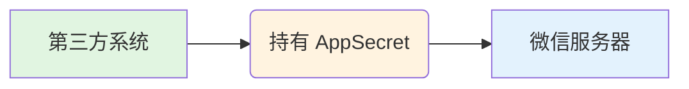
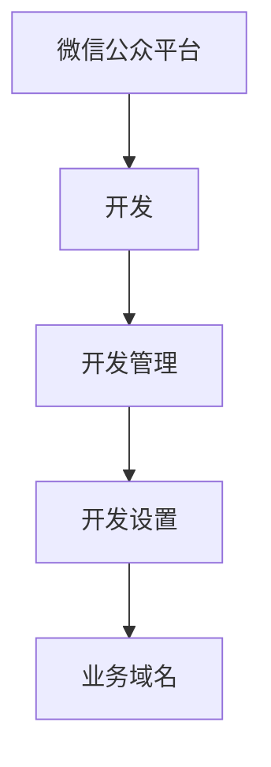
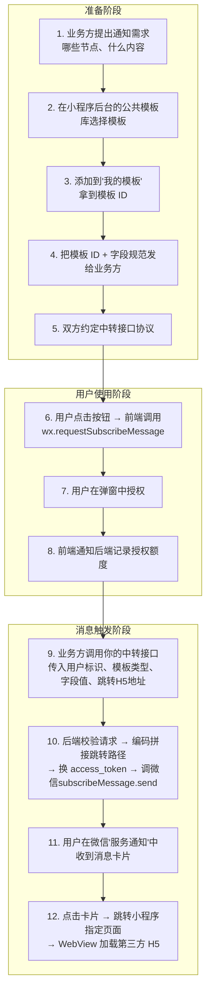

本文系统梳理了微信小程序订阅消息的核心概念、对接流程、开发要点和常见踩坑记录，适合产品经理和前后端开发在项目启动前通读一遍，少走弯路。

## 一、AppSecret 的安全红线 ##

### AppSecret 是什么 ###

AppSecret 是微信小程序的应用密钥，和 AppID 配对使用。它的核心作用是让后端服务器安全地调用微信开放接口，包括：

- 换取 `access_token`（几乎所有服务端接口的通行证，有效期 2 小时）
- 用户登录态换取（`code2Session`，获取 `openid` 和 `session_key`）
- 发送订阅消息、生成小程序码、内容安全检测等

### 绝对不能给第三方 ###

如果你的小程序接入了第三方服务（例如保险、支付、物流等），对方可能会以"需要发送微信消息"为由索要 AppSecret。这是一条安全红线，不能给。

原因很简单：AppSecret 一旦给出去，对方可以冒充你的小程序做任何事——发消息、获取所有用户 openid、消耗接口额度。出了问题，微信追责的是你，不是第三方。

### 正确做法：后端中转 ###




你提供一个发送消息的中转接口给第三方调用，第三方把用户标识和模板参数传过来，由你的后端调微信接口发送。中转接口的工作量不大（access_token 管理 + 一个 send 接口的封装），1-2 天就能搞定。

## 二、订阅消息模板：从申请到使用 ##

### 模板从哪来 ###

订阅消息模板不是随便写的，必须从微信官方的*公共模板库*里挑选：

> 微信公众平台 → 功能 → 订阅消息 → 公共模板库

按行业关键词搜索合适的模板，找到后点"添加"到"我的模板"，会得到一个专属的模板 ID。

如果公共模板库里没有合适的，可以申请新增模板，提交后微信审核，审核通过后会进入公共模板库（所有人都能用，不是你独有的）。

### 模板长什么样 ###

每个模板有固定的字段（关键词），例如：

```txt
订单编号：{{character_string1.DATA}}
购买人：  {{name2.DATA}}
购买产品：{{thing3.DATA}}
下单时间：{{time4.DATA}}
```

每个字段有类型和长度限制（thing 类型最多 20 字符、name 类型最多 10 字符、character_string 类型最多 32 字符等），超长会导致发送失败。

### 模板 ID 是各小程序独立的 ###

同一个公共模板，不同小程序添加后会生成不同的模板 ID，和各自的 AppID 绑定。类比一下：公共模板库是"户型图样板"，你和别的公司都看中了同一个户型，但各自拿到的"房产证号"（模板 ID）不同。

这意味着：

- 模板 ID 不能跨小程序复用
- 不要从网上抄别人的模板 ID（用了也发不出去）
- 字段格式是一致的（因为基于同一个公共模板）

### 模板一旦添加不能修改字段 ###

模板添加到"我的模板"后，字段就固定了，没有编辑入口。想加字段只能：

- 删掉当前模板（模板 ID 随之作废）
- 重新去公共模板库找包含新字段组合的模板
- 添加后得到新的模板 ID
- 更新前后端所有用到旧模板 ID 的地方

建议：选模板时尽量选字段多一点的，发送时用不到的字段可以不填，但后期想加字段就只能换模板了。

### 角色分工 ###

| 角色 | 职责 |
| :--- | :--- |
| 业务方（第三方） | 提出需求：在哪些业务节点发消息、每条消息包含哪些信息 |
| 小程序方（你） | 根据需求去公共模板库找匹配的模板，添加后拿到模板 ID，反馈给业务方 |
| 业务方 | 按照模板 ID 和字段格式，在触发业务时调用中转接口传入对应字段值 |

## 三、三种订阅类型详解 ##

微信公共模板库中有三个分类：一次性订阅、长期订阅、会员订阅（Beta）。核心区别是"一次授权能发几条消息"。

### 一次性订阅 ###

> 规则：用户点一次"允许"，你只能发一条消息，发完即止。

这是大多数小程序能用的类型。发送额度是纯计数机制：

- 用户每授权一次某模板 → 该模板额度 +1
- 每成功发送一条 → 额度 -1
- 用户连续授权 N 次 → 额度累加到 N
- 额度和"消息有没有发出去"无关，是独立累加的

常见误解："用户授权一次，之后想发就发。" ❌ 不行。一次性订阅就是字面意思——一次授权一条消息。

### 长期订阅 ###

> 规则：用户授权一次，可以长期无限次发送同类消息。

但绝大多数小程序用不了。微信只对特定行业类目开放：政务、医疗、交通、金融、教育、公益等。如果你的小程序类目符合条件（例如金融-保险），可以尝试申请。

申请入口：小程序后台 → 功能 → 订阅消息 → 长期订阅 → 申请开通

### 会员订阅（Beta） ###

> 规则：用户成为小程序"会员"后，在会员有效期内可以长期收到消息。

需要接入微信的会员体系能力，有一定开发成本，且不是所有小程序都能开通。适用于电商会员、知识付费年度会员等场景。

## 四、授权弹窗的交互细节 ##

### 弹窗由微信系统控制 ###

调用 `wx.requestSubscribeMessage` 后弹出的授权弹窗，其 UI 完全由微信控制：

- 开发者*不能*自定义弹窗样式、文案
- 开关默认关闭，*不能*设置为默认开启
- 一次最多传入 *3* 个模板 ID

```ts
wx.requestSubscribeMessage({
  tmplIds: ['模板ID_1', '模板ID_2'],
  success(res) {
    // res['模板ID_1'] === 'accept' 或 'reject'
    // res['模板ID_2'] === 'accept' 或 'reject'
  }
})
```

### "总是保持以上选择，不再询问" ###

弹窗底部有这个复选框。一旦用户勾选了：

- 如果之前选了"允许"：之后每次调用都直接 +1 额度，弹窗不再出现（好事）
- 如果之前选了"拒绝"：之后每次调用都直接返回 reject，弹窗也不再出现（坏事）

这个选择是永久生效的，没有过期时间。除非用户自己手动去修改：

> 小程序右上角「…」→ 设置 → 订阅消息 → 找到对应模板 → 重新切换开关

但绝大多数用户根本不知道有这个入口。所以*预防比补救重要*——避免高频弹窗导致用户烦躁而勾选"总是拒绝"。

### 弹窗触发的硬性要求 ###

`wx.requestSubscribeMessage` 必须由用户主动点击行为触发，不能在页面加载（onLoad / onShow）时自动调用。这是微信的强制规定。

## 五、弹窗频率控制 ##

### 每次点击都弹 ###

技术上可以做——每次点击按钮时都调用 `wx.requestSubscribeMessage`。但实际效果取决于用户是否勾选了"总是保持以上选择"。

### 每天只弹一次（推荐） ###

在按钮点击事件中做频率判断：

```ts
buyInsurance() {
  const today = new Date().toDateString()
  const lastDate = wx.getStorageSync('lastSubscribeDate')

  if (lastDate === today) {
    // 今天已经弹过了，直接走业务流程
    this.goToBuy()
    return
  }

  wx.requestSubscribeMessage({
    tmplIds: ['模板ID_1', '模板ID_2'],
    success: (res) => {
      // 记录授权结果，通知后端积累发送额度
      const accepted = []
      Object.keys(res).forEach(key => {
        if (res[key] === 'accept') accepted.push(key)
      })
      if (accepted.length > 0) {
        this.reportSubscribeQuota(accepted)
      }
    },
    complete: () => {
      wx.setStorageSync('lastSubscribeDate', today)
      this.goToBuy()
    }
  })
}
```

如果需要跨设备一致，可以改为后端记录用户的弹窗日期。

### 更精细的策略 ###

- 用户拒绝后 N 天内不再弹
- 按剩余额度触发（后端配合，没额度时再弹）
- 在多个入口分散引导（购买页、保单详情页、理赔页），降低单一入口的打扰感

## 六、消息跳转与 WebView 加载第三方页面 ##

### 发送消息时指定跳转路径 ###

调用微信的 `subscribeMessage.send` 接口时，通过 `page` 参数控制用户点击消息卡片后跳转到哪个页面：

```json
{
  "touser": "用户openid",
  "template_id": "模板ID",
  "page": "pages/webview/index?url=https%3A%2F%2Fexample.com%2Fh5%2Fdetail%3Fid%3D123",
  "data": {
    "thing1": { "value": "通知标题" },
    "thing2": { "value": "通知内容" }
  }
}
```

注意事项：

- 路径不带前导斜杠：写 `pages/xxx/xxx`，不写 `/pages/xxx/xxx`
- 路径不带 `.vue` 后缀
- 路径必须已在 `pages.json` 中注册
- H5 地址必须 URL 编码（`encodeURIComponent`），否则 `?` 和 `&` 会被错误解析为小程序页面的参数

### 目标页面接收参数并加载 WebView ###

```vue
<template>
  <web-view v-if="h5Url" :src="h5Url"></web-view>
</template>

<script>
export default {
  data() {
    return { h5Url: '' }
  },
  onLoad(options) {
    if (options.url) {
      let url = options.url
      if (url.includes('%')) {
        url = decodeURIComponent(url)
      }
      this.h5Url = url
    }
  }
}
</script>
```

### 必须配置业务域名 ###

`<web-view>` 能加载的 URL，其域名必须已在微信公众平台添加到业务域名白名单：



配置要求：

- 域名必须是 HTTPS
- 需要下载校验文件放到目标域名的根目录
- 如果是第三方的域名，需要对方配合放校验文件
- 未配置的域名，WebView 会空白或报错

### 和第三方对接跳转路径 ###

给第三方提供跳转路径时，说清楚三件事：

- 路径格式：`pages/webview/index?url={编码后的H5地址}`
- 编码规则：`url` 参数的值必须做一次 `encodeURIComponent`
- 谁负责编码：建议由你的后端统一负责编码和拼接，第三方只需传原始 `H5` 地址

## 七、常见踩坑清单 ##

| 坑 | 说明 |
| :--- | :--- |
| 字段长度超限 | 微信对每个字段类型有严格字符数限制，超长发送直接失败。中转接口最好做截断或校验。 |
| 订阅次数误解 | 一次性订阅不是"订阅一次永久能发"。要让业务方理解这一点。 |
| 内容不能营销 | 订阅消息不能发广告，只能发服务通知，违规会被封禁模板甚至小程序。 |
| 测试/正式模板 ID 搞混 | 开发环境和正式环境用不同模板 ID 时，切换环境要同步更新。 |
| page 路径写错 | 消息能发出去但用户点击后跳转失败，建议发送前做路径白名单校验。 |
| 业务域名未配置 | WebView 最常见的问题，表现为空白页或报错。 |
| H5 地址参数丢失 | 不编码就传，H5 端拿到的参数会不完整。 |
| WebView 限制 | 个人类型小程序不能用 `<web-view>`；WebView 会占满整个屏幕；H5 要调小程序能力需引入 JSSDK。 |
| "总是拒绝"后无法弹窗 | 用户勾选"总是保持以上选择"并拒绝后，除非用户手动去设置里改，否则永远无法再弹窗。 |
| 后端不知道剩余额度 | 微信不提供查询某个用户剩余额度的接口，需要自己在后端维护计数。 |

## 八、完整对接流程一览 ##



## 九、关键结论速查 ##

- AppSecret 绝对不能给第三方，用中转接口解决
- 模板 ID 各小程序独立，不能跨小程序复用
- 模板字段不可修改，选模板时多选几个字段留余量
- 一次性订阅 = 一次授权一条额度，额度可累加
- 弹窗开关默认关闭，微信强制行为，无法修改
- "总是保持以上选择"永久生效，用户拒绝后几乎不可逆
- 弹窗频率可以自行控制，但弹不弹得出来取决于用户之前的选择
- H5 跳转地址必须 URL 编码，域名必须加入业务域名白名单
