> 前言：架构设计不仅仅是一门技术，更是一种在不确定性中寻找确定性、在复杂性中构建秩序的工程。通过实际项目来积累经验，但这种方式往往代价高昂且耗时。 本系列将深入剖析一套系统化的架构设计方法论。

## 架构设计技术方法 ##

架构设计的核心目标永远都不是追求技术的 “高大上”，而是构建一套具备可扩展、高可用、高弹性的韧性架构体系。这些技术包括 “*拆分与可扩展、主动发现、负载均衡、过载保护、灰度、自动化、柔性*”等系统设计方法。

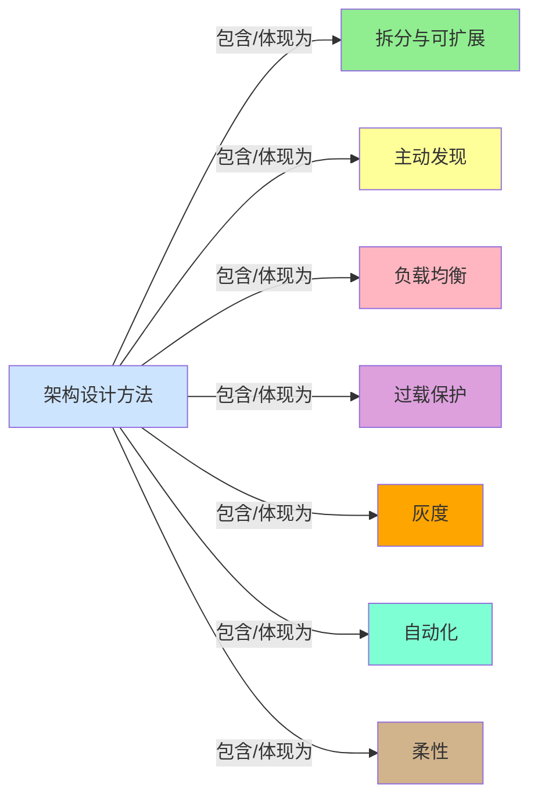


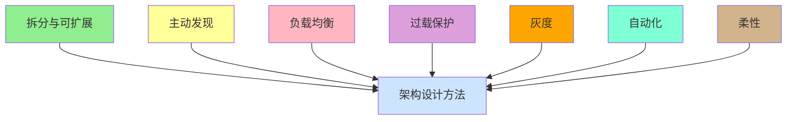

而本文主要谈论的是拆分，拆分在架构设计中至关重要。

## 拆分的决策依据 ##

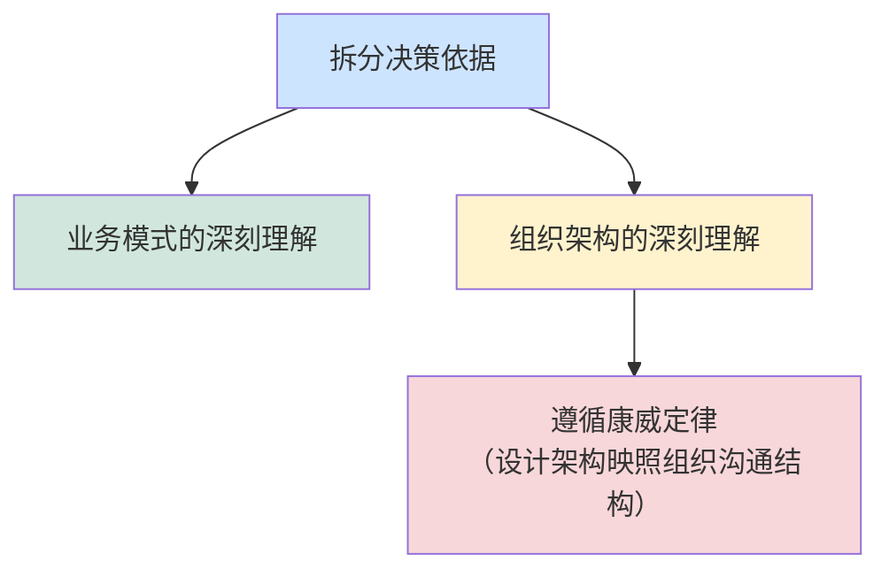

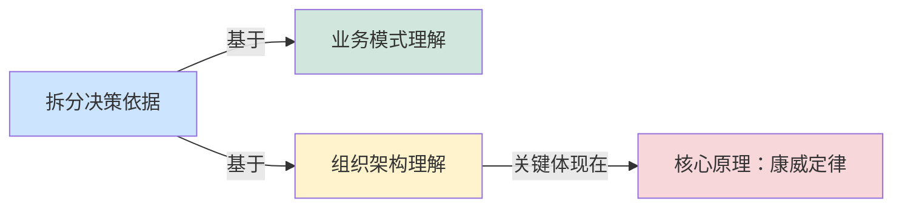

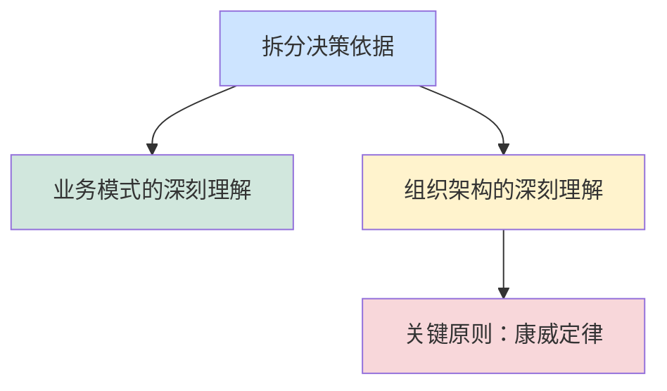

### 业务模式的深刻理解 ###

技术是为业务服务的，再牛的技术没有业务最后也一样毫无价值。曾经做过一个业务告警系统，但说不清切实价值，最后没有用户买单。

> 我们搞不清楚用户是谁、解决客户什么痛点、带来什么价值，就埋头开干，最后还是会以失败收场。

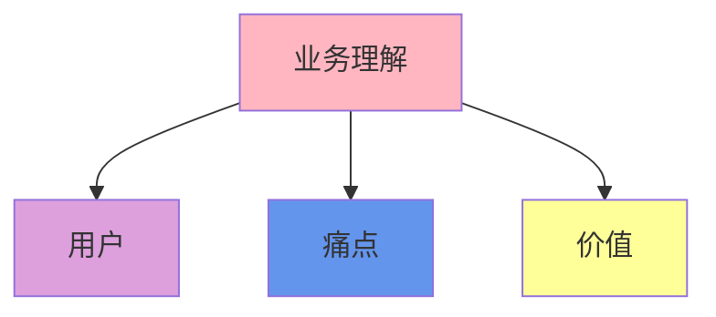

组织架构决定系统架构（康威定律） : 例如，重构一个复杂的遗留系统，仅修改代码是不够的，通常还需要调整背后的团队组织结构，打破部门墙；再比如，微服务架构，需要考虑将大团队拆分成多个小而全的自治团队。

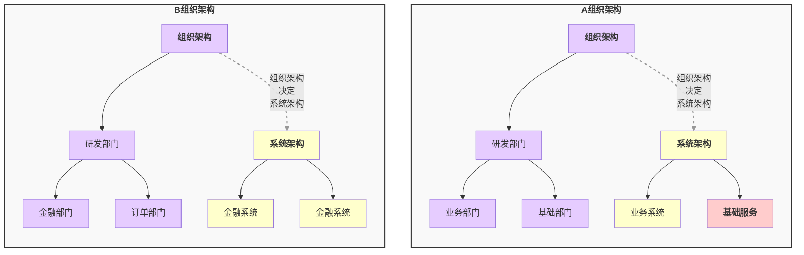

如果一个研发部门没有设立专门的基础架构团队，那么系统往往很难演化出独立的基础服务层。系统依然可以有基础能力，比如登录、鉴权等，但常常都是和业务系统混在一起的。

## 拆分-业务维度的逻辑拆分 ##

拆分并非简单的 “拆小”，而是*基于业务边界、数据特征与流量特性等精准拆解，最终实现 “按需扩展、故障隔离” 的目标*。 另外通过拆分降低系统复杂度，通过设计预留扩展能力。

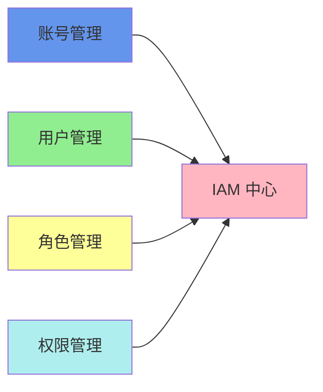

通过业务域的功能与数据应该聚合在同一单元。比如针对账号管理、角色管理统一放在 IAM 中心这一个应用里面。

好的拆分，边界清晰、扩展容易。真正做到新增业务模块时无需改动核心系统，仅扩展对应服务单元。

例如：电商系统拆分为用户、商品、订单、支付服务。

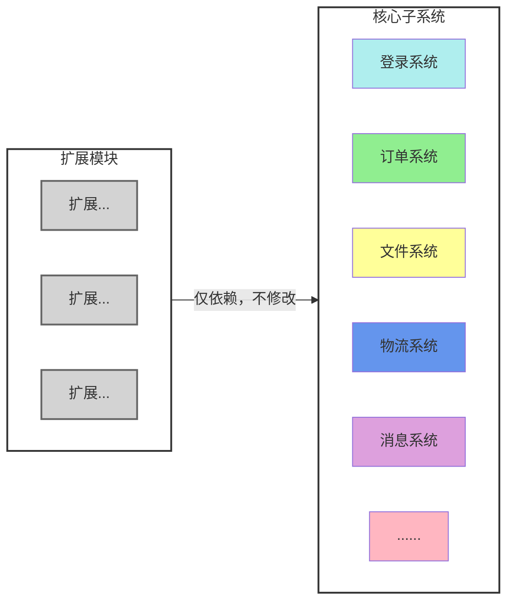

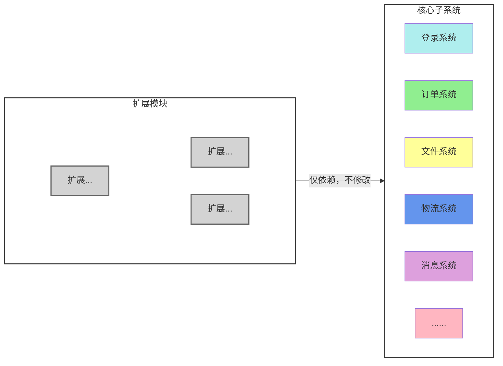

控制业务上下文边界，使得每个服务独立维护自身数据与业务逻辑，保障了新业务无限扩展，同时系统复杂度不会膨胀，也使得新增业务模块也不会改动核心应用。

### 演进式拆分 ###

但我们也不得不承认另外一个事实，就是架构是演进的，不是所有的系统一开始都是将边界控制很好的。也一样会随着业务、组织发展而发展。笔者也曾经处理过一次数据共享的拆分。

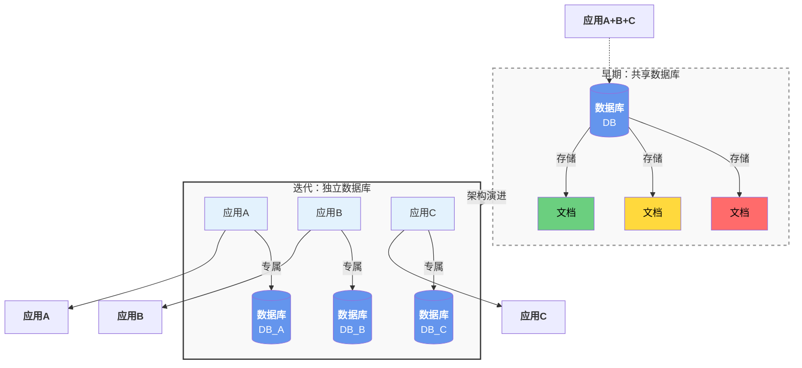

一开始所有应用共享一份角色数据，随着业务、组织变大。角色的变更导致各个应用角色制约影响，后来便将其拆分升级。

这也提醒我们，*数据共享对不同业务而言是一种隐患*。遵循演进式原则，初期避免过细拆分，将高频交互的模块聚合在一起。

### 拆分案例之微服务划分 ###

好的拆分利于扩展、但不好的拆分也会带来复杂。这里面除了上面聊的边界，还有颗粒度复杂性、组织维度等权衡。那么微服务又该如何拆分呢。一个合理的拆分方案需要综合考量业务(最核心)、技术和组织等多个维度。应该按业务域拆分，不是按技术层拆分。

```mermaid
flowchart TD
    %% 定义主节点
    root[微服务拆分]:::root
    
    %% 定义四个分支节点
    root --> principle[拆分原则]:::pink
    root --> strategy[拆分策略]:::purple
    root --> path[实施路径]:::yellow
    root --> pitfall[拆分避坑]:::green
    
    %% 拆分原则下的子节点
    principle --> subgraph_principle
    subgraph subgraph_principle[拆分原则详情]
        p1[单一原则]
        p2[数据自治]
        p3[高内聚低耦合]
        p4[业务闭环]
    end
    
    %% 拆分策略下的子节点
    strategy --> subgraph_strategy
    subgraph subgraph_strategy[拆分策略详情]
        s1[按业务领域拆分]
        s2[按组织结构拆分]
        s3[基础设施参考]
        s4[非功能性拆分]
    end
    
    %% 实施路径下的子节点
    path --> subgraph_path
    subgraph subgraph_path[实施路径详情]
        pa1[业务深入理解]
        pa2[定好边界]
        pa3[做好规范]
        pa4[演进迁移]
        pa5[基础设施]
    end
    
    %% 拆分避坑下的子节点
    pitfall --> subgraph_pitfall
    subgraph subgraph_pitfall[拆分避坑详情]
        pi1[过渡拆分(颗粒度)]
        pi2[共享数据库]
        pi3[分布式事务泛滥]
        pi4[繁琐的循环依赖]
    end
    
    %% 定义样式
    classDef root fill:#6495ed,stroke:#333,stroke-width:2px,color:#fff
    classDef pink fill:#ffb6c1,stroke:#333,stroke-width:1px
    classDef purple fill:#dda0dd,stroke:#333,stroke-width:1px
    classDef yellow fill:#ffff99,stroke:#333,stroke-width:1px
    classDef green fill:#90ee90,stroke:#333,stroke-width:1px
    
    %% 应用样式
    class root root
    class principle pink
    class strategy purple
    class path yellow
    class pitfall green
```

再补充几个点：微服务拆分最先关注的是业务、其次是组织架构，微服务拆分不是为了“微”而“微”，而是*为了让团队能更敏捷地交付业务价值*，同时保证系统的*稳定性*和*可扩展性*。拆分后的基础设施CI/CD 要配套跟上。

*拆分需与业务规模、团队能力、资源成本匹配*，遵循 “先单体模块化、再核心服务拆分、最后非核心服务独立” 的渐进式路径。过度拆分或错误拆分将导致 “分布式灾难”。综上而言，寻找合适的平衡点。

## 拆分-数据维度的逻辑拆分 ##

数据维度拆分是架构设计中最为常见且基础的拆分方式，其核心思想是将庞大的数据集合按照特定维度进行物理或逻辑上的分割，从而降低单点压力，提升系统整体性能。数据是系统的核心资产，数据的拆分策略直接决定了系统的扩展上限。

### 垂直和水平拆分 ###

常见的数据拆分分为两类：垂直和水平。

**水平拆分**：互联网架构应对海量数据的标配，实现了系统的线性扩展能力。但同时带来了跨库Join和全局聚合等难题。

**垂直拆分**： 将不同的业务表拆分到独立的数据库中，也可以是将大字段（如文本、图片存储路径）与核心字段分离。

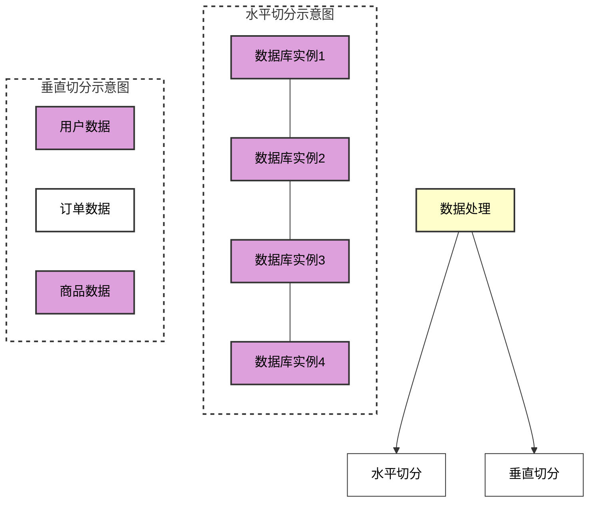

> 延伸：区分热数据、温数据、冷数据。 冷数据存对象存储。提升了热数据访问效率，另外避免全量存储的资源浪费。

### 数据聚合方案 ###

针对分库分表引入的问题，分库分表后*COUNT/SUM/AVG/GROUP BY/ORDER BY/LIMIT*等聚合查询直接失效，核心原因是*数据分散在多库多表，无法单机内存 / 单机索引完成全局计算。当然也就有对应的成熟方案*。

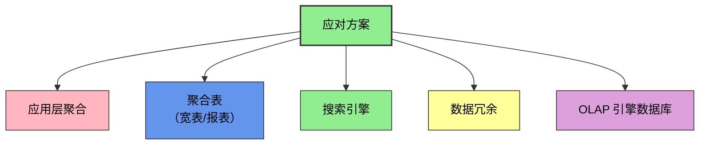

| 方案 | 实时性(粗略) | 复杂度 | 适合场景 | 公司案例 |
| :--- | :--- | :--- | :--- | :--- |
| 应用层聚合 | 实时 | 低 | 简单 COUNT/SUM，小数据 | 初创 / 中小业务 |
| Elasticsearch | 秒级 | 中 | 多维聚合、报表、筛选 | 几乎所有中大厂 |
| ClickHouse | 秒～分钟级 | 中高 | 海量数据、超复杂报表 | 抖音、快手、B 站 |
| OLAP 数仓 | 小时级 | 高 | 数据仓库、BI 分析 | 阿里、腾讯 |

### 二次拆分迁移 ###

水平拆分，由于拆分的key，系统*仍可能*面临二次拆分及数据迁移的挑战。这种就跟随系统演变做好迁移即可。

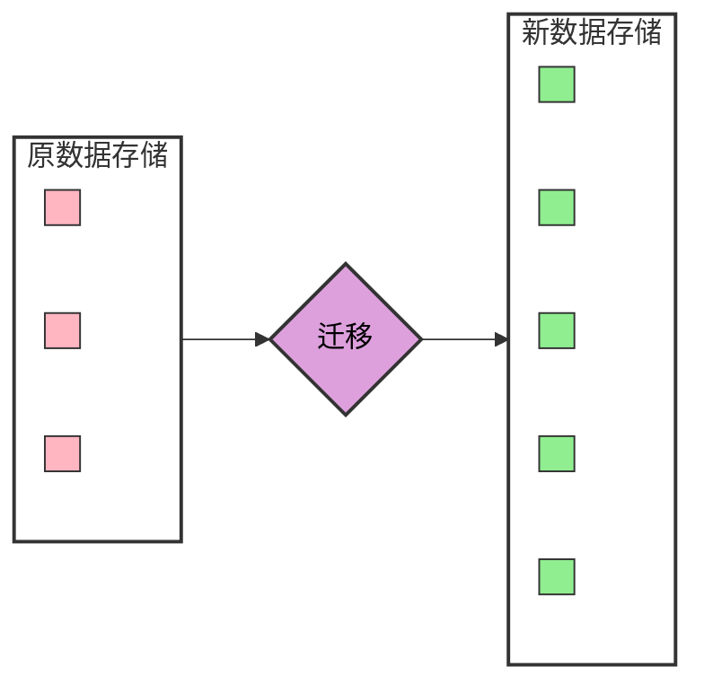

## 总结 ##

优秀的架构设计，核心是通过合理的拆分（业务域拆分、数据拆分、演进式拆分） ，在业务敏捷性与系统复杂度之间寻找最佳平衡点。

> 分布式系统发布理论设计要点

发布绝非小事，而是一场系统性、周密性的演进。在这个领域没有绝对的安全，只有可控的风险。最好的发布，应当让用户完全无感知。

做好“零信任发布”意味着假设任何变更都可能引发故障，因此必须预设兜底方案。如何将发布从单纯的运维操作演变为严谨的系统工程，在复杂分布式环境下实现*变更零感知*与*极速自愈*，是架构师需要长期精进的核心技能。

## 关注点聚焦与发布铁律 ##

- 风险边界：知道风险在什么地方、知道边界在什么地方，比如：本次变更风险在什么地方。
- 系统韧性 ：面对失败发布、系统发布失败如何处理、是否回滚、 降级能力
- 演化路径 ：新旧版本工程、变更如何平滑过渡， 确保变更无感。

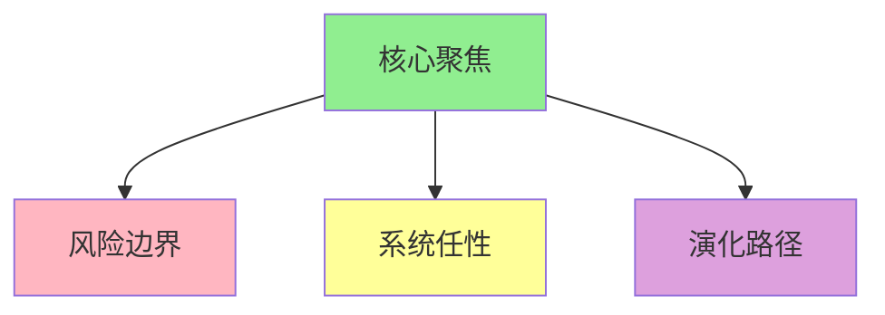

所有发布行为必须严格遵循以下原则，缺一不可：

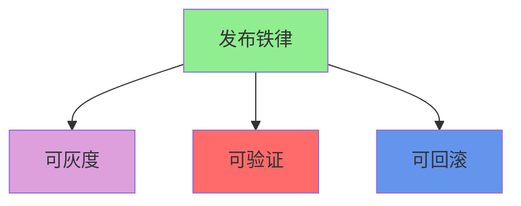

- 可灰度：支持按比例、分批次发布。
- 可验证：具备完善的自动化验证机制。
- 可回滚：具备一键快速回退能力。

## 发布前准备 ##

发布是严肃的工程行为，必须做足准备：

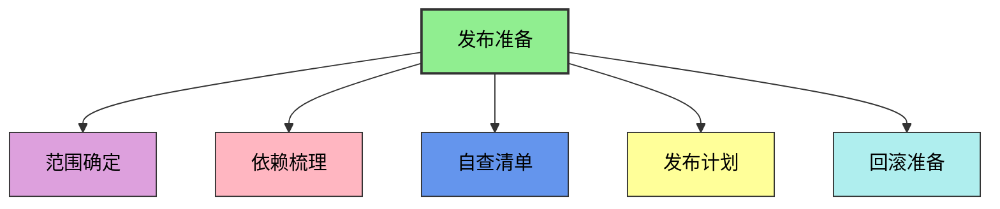

全面梳理服务依赖、接口依赖及数据依赖，确保无遗漏。

## 发布中设计 ##

聚焦以下三个点的发布设计，这是发布之前需要做好的设计要点

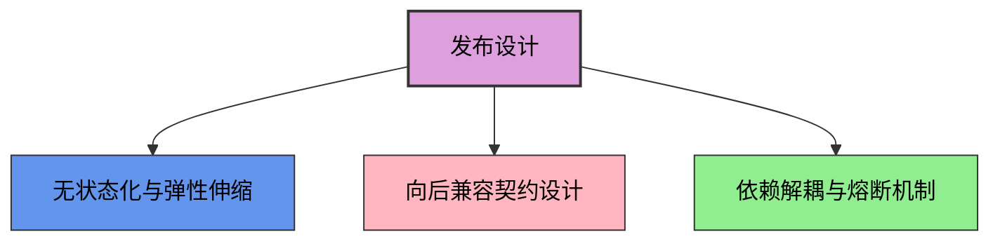

- 无状态与弹性伸缩：这是分布式架构的最低要求，确保服务可随时扩容缩容。
- 向后兼容：新代码需兼容旧数据，旧代码需容忍新格式（字段、接口、类型等）。
- 依赖解耦与熔断机制：单模块发布不应引发雪崩效应，必须设计熔断机制隔离故障。

## 发布时分层灰度与流量治理 ##

高阶发布不仅是看监控，而是建立自动化的决策闭环，实现异常即时发现与处置。

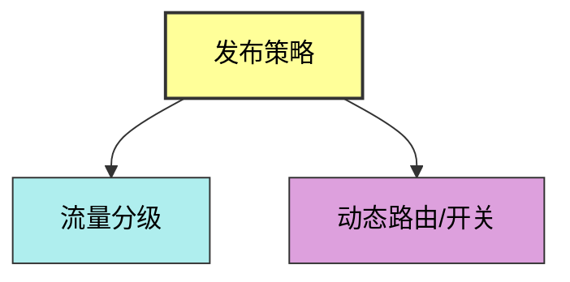

构建多层次的流量调度体系。按照灰度、全量、按比例进行发布；有*秒级生效*的配置中心， 实现过程可控。

## 发布后的可观测 ##

高阶发布不仅仅是看监控，而是建立*自动化的决策闭环*。

```mermaid
flowchart TD
    %% 核心节点
    A[发布后的可观测]:::observability

    %% 三个可观测维度
    A --> B[指标/链路/日志]:::metrics
    A --> C[基线/告警]:::baseline
    A --> D[自动化故障决策]:::automation

    %% 样式定义
    classDef observability fill:#ffff99,stroke:#333,stroke-width:2px,color:#000
    classDef metrics fill:#ffb6c1,stroke:#333,stroke-width:1px,color:#000
    classDef baseline fill:#90ee90,stroke:#333,stroke-width:1px,color:#000
    classDef automation fill:#ffd699,stroke:#333,stroke-width:1px,color:#000
```

## 发布的底线约束 ##

```mermaid
flowchart TD
    %% 顶部核心节点
    A[发布的底线]:::bottomLine

    %% 下方两个子节点
    A --> B[数据一致性]:::dataConsistency
    A --> C[分布式事务]:::distributedTransaction

    %% 样式定义
    classDef bottomLine fill:#dda0dd,stroke:#333,stroke-width:2px,color:#000
    classDef dataConsistency fill:#90ee90,stroke:#333,stroke-width:1px,color:#000
    classDef distributedTransaction fill:#ffff99,stroke:#333,stroke-width:1px,color:#000
```

数据是系统的核心资产，发布过程中的*数据一致性*是绝对红线。若兼容性处理不当，极易产生脏数据。

## 发布清单 ##

发布前自查清单：

- 兼容性：旧版本客户端/服务能否继续正常工作
- 回滚：如果失败，能否在1分钟内恢复到上一稳定状态，数据是否一致
- 隔离：故障是否会被限制在单个服务或单个机房内
- 监控：是否有针对新功能的专属监控
- 降级：如果核心依赖挂了，是否有备选方案
- 容量：新版本是否引入了新的资源消耗（如更复杂的SQL、更多的GC）
- 安全：是否通过了最新的漏洞扫描和权限审计
- 沟通：业务方、客服、运营是否已知晓并准备好了应对话术

## 原则基础 ##

- 红线原则：未经过测试验证的代码严禁上线；未经过灰度验证的核心服务严禁全量发布；无回滚方案的发布视为违规。
- 责任制度：实行“谁发布、谁负责”制度，发布人需对发布期间的系统稳定性负首要责任。

## 最后 ##

发布是软件工程中风险最高的环节之一。唯有将敬畏之心融入每一个检查项、每一行脚本、每一次决策中，构建起严密的防御体系，我们才能在复杂的系统中行稳致远。

无论是代码逻辑还是配置参数，任何一个微小的疏忽都可能导致服务瘫痪。发布无小事，保持敬畏之心，方能确保持续、稳定地交付价值。
