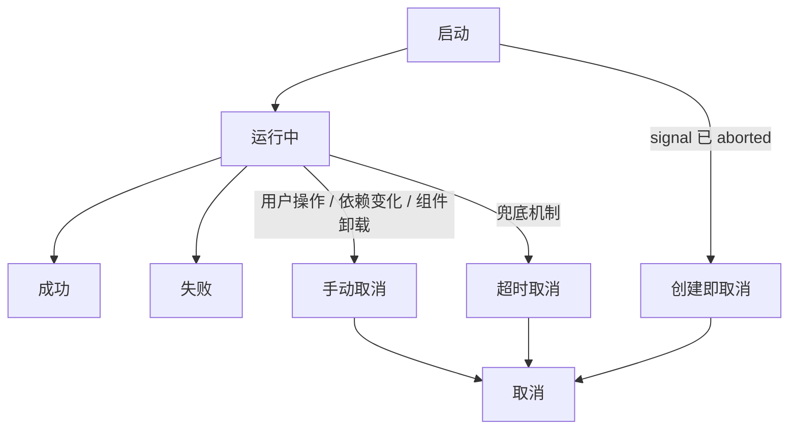

项目越大，请求越多，Bug 越诡异。
你一定见过这些场景：

- 搜索结果偶尔“闪一下又变回旧数据”
- 提交按钮点快了，后台多出几条脏数据
- 页面都切走了，接口还在跑，甚至回来还触发 setState warning

这些问题看起来毫无规律，但本质上只是一件事：

*请求没有被正确“结束”。*

> 大部分团队会优化接口、加缓存、做防抖，却很少有人认真思考：

一个请求，什么时候应该继续？什么时候必须终止？

`AbortController` 应该在项目初期就被当作基础设施来搭建，而不是等线上出了问题才到处打补丁。这篇文章是我踩完所有坑之后的经验沉淀，把竞态取消、超时控制、组件卸载清理这几个场景串起来，给出一套在 React 和 Vue 中都能落地的防御性编排方案。

## 竞态取消：搜索场景的三种方案对比 ##

竞态问题是异步请求里最常见也最容易被忽视的坑。回到搜索框的例子，用户快速输入，多个请求并发，我们只关心最后一次的结果。怎么确保展示的一定是最新请求的数据？

### 方案一：标记法（能用，但粗糙） ###

最朴素的思路——给每次请求打一个版本号，回调里检查是不是最新版本。

```ts
let currentRequestId = 0

async function search(keyword: string) {
  const requestId = ++currentRequestId
  const res = await fetch(`/api/search?q=${keyword}`)
  const data = await res.json()

  if (requestId === currentRequestId) {
    setResults(data) // 版本号匹配才更新 UI
  }
}
```

实现简单、零依赖，但有一个明显的问题：请求并没有被真正取消。"杭"的请求还是跑完了全部流程，占了带宽和连接池，只是回调里没处理结果而已。我们项目初期就是用的这个方案，当时觉得"能用就行"。后来在性能分析里发现，搜索页面在快速输入时，Network 面板里密密麻麻全是 pending 请求，Chrome 的同域 6 连接上限直接被打满，导致其他关键请求（比如用户鉴权、埋点上报）被阻塞。

### 方案二：纯 AbortController（真正取消请求） ###

标记法的核心缺陷是请求仍然在跑，只是忽略了结果。AbortController 可以从网络层真正中断请求，释放连接。

```ts
let currentController: AbortController | null = null

async function search(keyword: string) {
  currentController?.abort() // 取消上一个请求
  const controller = new AbortController()
  currentController = controller

  try {
    const res = await fetch(`/api/search?q=${keyword}`, {
      signal: controller.signal
    })
    const data = await res.json()
    setResults(data)
  } catch (err) {
    if ((err as DOMException).name !== 'AbortError') throw err
    // AbortError 说明是我们主动取消的，静默忽略
  }
}
```

相比标记法，`abort()` 调用后浏览器会立即中断 TCP 连接（或阻止请求发出），被取消的请求在 Network 面板中会显示为 (`canceled`) 状态，不再占用同域的 6 个并发连接。缺点是在高频输入场景下，每次按键都会发出一个请求然后立即取消上一个，虽然连接被释放了，但请求的绝对数量仍然很多，服务端压力并没有减轻。所以对于搜索框这类场景，还需要配合防抖进一步优化。

### 方案三：防抖 + AbortController（生产环境的选择） ###

单纯的 AbortController 取消还不够，还需要配合防抖来减少请求频率。这里有个容易搞错的地方：防抖和取消的职责不一样，不能互相替代。防抖解决的是"减少发出的请求数量"，取消解决的是"已经发出的请求不再需要了"。两个要一起用。

```ts
function useDebouncedSearch(delay = 300) {
  const controllerRef = useRef<AbortController | null>(null)
  const timerRef = useRef<number>()
  const [results, setResults] = useState([])

  const search = useCallback((keyword: string) => {
    clearTimeout(timerRef.current) // 清掉防抖定时器

    timerRef.current = window.setTimeout(async () => {
      controllerRef.current?.abort() // 取消上一个还在飞的请求
      const controller = new AbortController()
      controllerRef.current = controller

      try {
        const res = await fetch(`/api/search?q=${keyword}`, {
          signal: controller.signal
        })
        setResults(await res.json())
      } catch (err) {
        if ((err as DOMException).name !== 'AbortError') throw err
      }
    }, delay)
  }, [delay])

  useEffect(() => () => {
    clearTimeout(timerRef.current)
    controllerRef.current?.abort()
  }, [])

  return { results, search }
}
```

防抖定时器和 AbortController 各管各的：防抖控制"什么时候发请求"，AbortController 控制"已经发出的请求要不要保留"。组件卸载时两个都要清理，缺一不可。我们项目最终落地的就是这个方案。改完之后，搜索页面的无效请求从平均每次搜索 5-6 个降到了 0-1 个，Network 面板终于清爽了。

三种方案放在一起对比：

|  方案   |      请求真正取消  |   实现复杂度  |  适用场景  |
| :-----------: | :-----------: | :-----------: | :-----------: |
|    标记法 |   否，幽灵请求仍占连接  |   低  |  小项目、低频请求  |
|    AbortController |   是，网络层中断  |   中  |  大多数场景  |
|    防抖 + AbortController |   是，且减少请求频次  |   中  |  搜索、筛选等高频输入场景  |

## React 中的异步副作用编排 ##

### `useEffect` 中的正确姿势 ###

```ts
function UserProfile({ userId }: { userId: string }) {
  const [profile, setProfile] = useState(null)

  useEffect(() => {
    const controller = new AbortController()

    async function loadProfile() {
      try {
        const res = await fetch(`/api/users/${userId}`, {
          signal: controller.signal
        })
        setProfile(await res.json())
      } catch (err) {
        if ((err as DOMException).name === 'AbortError') return
        console.error('加载用户信息失败:', err)
      }
    }
    loadProfile()

    return () => controller.abort()
  }, [userId])

  return <div>{profile?.name}</div>
}
```

这段代码看起来简单，有两个细节容易踩坑。

`AbortController` 的创建必须在 `useEffect` 内部。因为每次 `effect` 执行需要一个独立的 controller 实例，放外面会被多个 effect 共享，取消逻辑就乱了。

`async` 函数不能直接作为 `useEffect` 的回调——effect 要求返回 cleanup 函数或 undefined，不能返回 Promise。所以需要在内部定义一个 `async` 函数再调用。这个限制看起来别扭，但它强制你把"发请求"和"清理"分开思考，反而减少了遗漏 cleanup 的概率。

### 封装通用的 useAbortableFetch ###

当团队有十几个页面都需要这种模式时，重复写 AbortController 的样板代码就不合适了。我们封装了一个自定义 Hook：

```ts
function useAbortableFetch<T>(url: string | null, options?: { timeout?: number }) {
  const [state, setState] = useState<{
    data: T | null; loading: boolean; error: Error | null
  }>({ data: null, loading: false, error: null })

  useEffect(() => {
    if (!url) return

    const controller = new AbortController()
    const { timeout = 10000 } = options ?? {}
    const signal = AbortSignal.any
      ? AbortSignal.any([controller.signal, AbortSignal.timeout(timeout)])
      : controller.signal

    setState(prev => ({ ...prev, loading: true, error: null }))

    fetch(url, { signal })
      .then(res => {
        if (!res.ok) throw new Error(`HTTP ${res.status}`)
        return res.json()
      })
      .then(data => setState({ data, loading: false, error: null }))
      .catch(err => {
        if (err.name === 'AbortError' || err.name === 'TimeoutError') return
        setState({ data: null, loading: false, error: err })
      })

    return () => controller.abort()
  }, [url])

  return state
}
```

url 为 `null` 时不发请求，方便做条件请求；url 变了自动重新请求，旧请求自动取消；超时和手动取消合并在一个信号里处理。用起来非常干净：

```ts
function SearchPage() {
  const [keyword, setKeyword] = useState('')
  const debouncedKeyword = useDebounce(keyword, 300)

  const { data, loading, error } = useAbortableFetch<SearchResult[]>(
    debouncedKeyword ? `/api/search?q=${debouncedKeyword}` : null
  )

  return <input value={keyword} onChange={e => setKeyword(e.target.value)} />
}
```

### 手动触发场景的处理 ###

表单提交、批量操作这类请求的特殊之处在于：取消的触发时机不是依赖变化，而是"重复操作"或"组件卸载"。

```ts
function useAbortableAction<T>() {
  const controllerRef = useRef<AbortController | null>(null)

  const execute = useCallback(async (
    asyncFn: (signal: AbortSignal) => Promise<T>
  ): Promise<T | undefined> => {
    controllerRef.current?.abort() // 新操作来了，取消上一个（防连点）
    const controller = new AbortController()
    controllerRef.current = controller

    try {
      return await asyncFn(controller.signal)
    } catch (err) {
      if ((err as DOMException).name === 'AbortError') return undefined
      throw err
    }
  }, [])

  useEffect(() => () => { controllerRef.current?.abort() }, [])
  return execute
}
```

使用时，把 `signal` 透传给请求函数即可：

```ts
const executeAction = useAbortableAction()

const handleSubmit = async (formData: OrderData) => {
  const result = await executeAction(signal =>
    fetch('/api/orders', {
      method: 'POST',
      body: JSON.stringify(formData),
      signal
    }).then(r => r.json())
  )
  if (result) navigate(`/orders/${result.id}`)
}
```

这里有个需要权衡的地方：POST 请求真的应该取消吗？连点两次提交按钮，取消第一个 POST 请求——网络层面是中断了，但后端可能已经处理了一半。

所以对于写操作，`AbortController` 更多是解决"组件卸载后不再处理回调"的问题，而不是真的指望后端能回滚。防重复提交还是要靠按钮 loading 状态锁定 + 后端幂等校验。

## Vue 中的 Composable 实现 ##

在 Vue 中，`watchEffect` 提供的 `onCleanup` 回调天然适合管理请求生命周期，写起来比 React 的 `useEffect` 更直观。下面是与前文 `useAbortableFetch` 对等的 Vue Composable 实现：

```ts
import { ref, watchEffect, toValue, type Ref, type MaybeRefOrGetter } from 'vue'

function useFetchData<T>(url: MaybeRefOrGetter<string | null>, options?: { timeout?: number }) {
  const data = ref<T | null>(null) as Ref<T | null>
  const loading = ref(false)
  const error = ref<Error | null>(null)

  watchEffect((onCleanup) => {
    const resolvedUrl = toValue(url)
    if (!resolvedUrl) {
      data.value = null
      loading.value = false
      return
    }

    const controller = new AbortController()
    const { timeout = 10000 } = options ?? {}

    // 注册清理函数：依赖变化或组件卸载时自动调用
    onCleanup(() => controller.abort())

    loading.value = true
    error.value = null

    const timeoutId = setTimeout(() => controller.abort(), timeout)

    fetch(resolvedUrl, { signal: controller.signal })
      .then(res => {
        if (!res.ok) throw new Error(`HTTP ${res.status}`)
        return res.json()
      })
      .then(json => {
        data.value = json
        loading.value = false
      })
      .catch(err => {
        if (err.name === 'AbortError') return // 主动取消，静默忽略
        error.value = err
        loading.value = false
      })
      .finally(() => clearTimeout(timeoutId))
  })

  return { data, loading, error }
}
```

使用方式同样干净，响应式的 URL 变化会自动触发重新请求并取消旧请求：

```vue
<script setup lang="ts">
import { ref, computed } from 'vue'

const keyword = ref('')
const debouncedKeyword = useDebouncedRef(keyword, 300) // 假设已有防抖 ref 工具
const apiUrl = computed(() =>
  debouncedKeyword.value ? `/api/search?q=${debouncedKeyword.value}` : null
)

const { data: results, loading, error } = useFetchData<SearchResult[]>(apiUrl)
</script>

<template>
  <input v-model="keyword" />
  <div v-if="loading">搜索中...</div>
  <ul v-else-if="results">
    <li v-for="item in results" :key="item.id">{{ item.title }}</li>
  </ul>
</template>
```

Vue 的 `onCleanup` 和 React 的 `useEffect` 中 `return` 做的是同一件事，但 Vue 的写法有个优势：onCleanup 在 effect 函数体内调用，和创建 `AbortController` 的代码紧挨着，不容易遗漏。React 里 `cleanup` 写在函数末尾的 `return` 里，和请求代码隔得比较远，review 时容易看漏。

## 边界场景与防御性思维 ##

### 并发请求的批量取消 ###

页面初始化时可能要同时发五六个请求，用户切走了要一次性全取消。核心技巧是共享一个 signal，配合 Promise.allSettled 处理结果：

```ts
useEffect(() => {
  const controller = new AbortController()

  Promise.allSettled([
    fetch('/api/user/info', { signal: controller.signal }).then(r => r.json()),
    fetch('/api/user/permissions', { signal: controller.signal }).then(r => r.json()),
    fetch('/api/dashboard/stats', { signal: controller.signal }).then(r => r.json()),
  ]).then(results => {
    const [userResult, permResult, statsResult] = results

    if (userResult.status === 'fulfilled') {
      setUserInfo(userResult.value)
    }
    if (permResult.status === 'fulfilled') {
      setPermissions(permResult.value.permissions)
    }
    if (statsResult.status === 'fulfilled') {
      setDashboardStats(statsResult.value)
    }
  })

  return () => controller.abort()
}, [])
```

为什么用 `Promise.allSettled` 而不是 `Promise.all`？因为 `Promise.all` 在任何一个请求 reject 时就会整体 reject，而 abort 会导致所有请求同时 `reject`，你拿不到任何有用信息。`allSettled` 等所有请求都有结果后才 resolve，让你能精细地处理每个请求——哪些成功了用数据，哪些被取消了忽略，哪些真正失败了需要报错。

### SSR 和 Node.js 环境 ###

如果你的项目有 SSR（Next.js、Nuxt），请求取消在服务端同样重要。Node.js 18+ 的 `fetch` 原生支持 `AbortController`，但服务端的超时策略需要比客户端更激进——SSR 请求阻塞的是页面渲染，用户在白屏面前的耐心远低于面对 loading 动画：

```ts
async function getServerSideProps() {
  const controller = new AbortController()
  const timer = setTimeout(() => controller.abort(), 3000) // SSR 超时建议 3-5 秒

  try {
    const res = await fetch('http://internal-api/data', {
      signal: controller.signal
    })
    clearTimeout(timer)
    return { props: { data: await res.json() } }
  } catch {
    clearTimeout(timer)
    return { props: { data: null } } // 超时降级，先渲染页面骨架
  }
}
```

在 Node.js 环境还要注意一点：没有浏览器的 6 连接上限，但有内存泄漏风险。如果请求没有超时控制，在高并发时挂起的请求会持续占用内存，最终可能 OOM。

### 不适用的场景 ###

`AbortController` 不是银弹，有几种场景不适合或者需要特殊处理。

WebSocket 连接有自己的生命周期管理（`close()`），不需要也不能用 AbortController。写操作的取消要谨慎——POST/PUT/DELETE 请求，前端取消了但后端可能已经处理了，关键写操作的幂等性要在后端保证。**流式响应（SSE / ReadableStream）**虽然技术上可以用 abort() 中断，但要区分场景：AI 对话场景下用户点"停止生成"，`abort()` 是合理的；大文件分片上传中途取消，断点续传的状态恢复逻辑需要额外处理，单靠 `abort()` 解决不了。

## 从取消到编排：一个通用模型 ##

回顾全文的内容，请求取消只是一个切入点，背后的通用模型是异步操作的生命周期管理。任何异步操作——请求、定时器、动画、Web Worker 通信——都应该具备三个能力：启动、取消、超时。缺了任何一个，在项目规模变大后都会出问题。这个模型可以这样理解：

异步操作生命周期：



在 React 中，这个生命周期对应的是 `useEffect` 的"执行-清理"周期；在 Vue 中，是 `watchEffect` 的"执行-onCleanup"周期。框架不同，模型一致。

如果你正在做的项目还没有统一的请求生命周期管理，我的建议是分三步推进。第一步，在请求层封装一个带超时和取消能力的基础函数（类似前面的 `createManagedSignal`）。第二步，在框架层封装对应的 Hook / Composable（类似 useAbortableFetch 和 useFetchData），让业务代码不需要直接接触 AbortController。第三步，在 code review 和 CI 中把"有没有处理取消"作为一个检查项。

我们团队落地这套方案之后，做了一次前后数据对比：

|  指标   |      改造前  |   改造后  |
| :-----------: | :-----------: | :-----------: |
|    搜索场景无效请求数（每次搜索） |   5-6 个  |   0-1 个  |
|    超时相关客服工单（每周） |  10+  |   1-2  |
|    页面切换后的 setState warning |   频繁出现  |   完全消除  |
|    请求层代码重复率 |  每个页面各写一套  |   统一收口到 2 个 Hook/Composable  |
|    CI 自定义 lint 规则上线首周拦截的遗漏 |   —  |  14 处  |


现在我们的标准是：每个 `useEffect` / `watchEffect` 里如果有 `fetch` 调用，必须在 `cleanup` 里调用 `abort()`，否则 CI 的自定义 lint 规则会报错。这条规则的 ROI 极高——写规则花了半天，上线一周就拦住了 14 处遗漏，每一处都是潜在的线上 bug。

回头看，请求生命周期管理这件事并不复杂。AbortController 的 API 就那么几个，封装成 Hook / Composable 也不超过 30 行代码。真正难的是在项目早期就意识到它的重要性，把它作为基础设施搭好，而不是等线上出了问题才到处救火。
