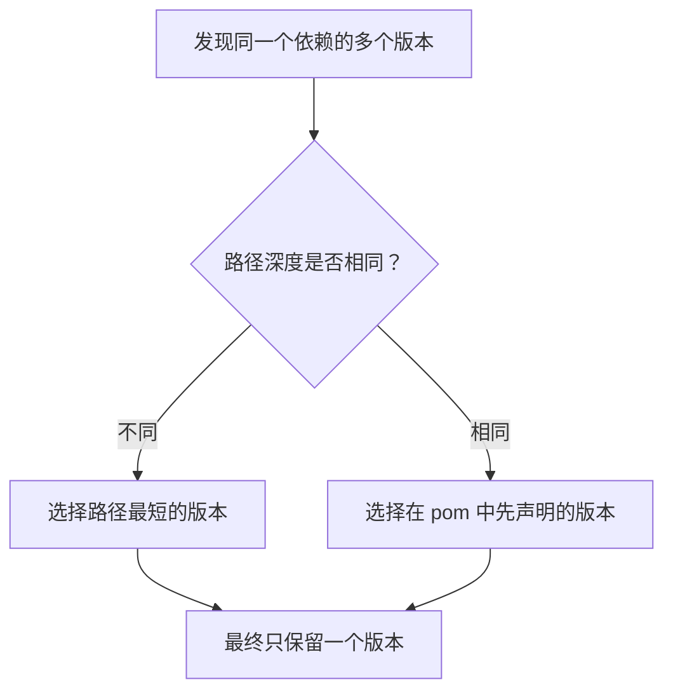
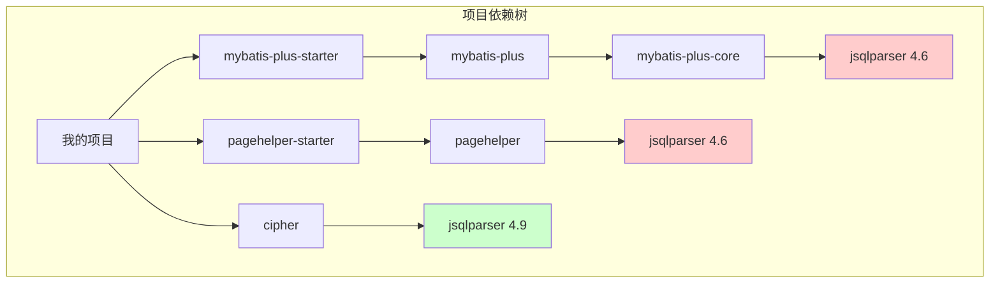
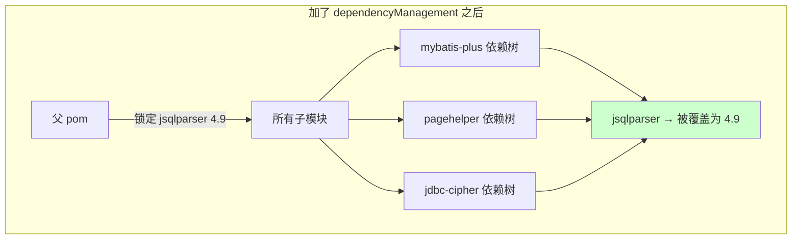
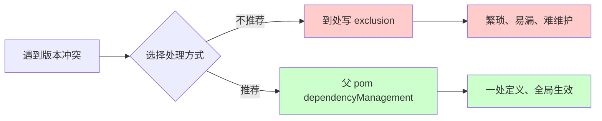

## 事情是这样的 ##

前几天遇到一个线上问题，SQL 解析直接超时了，日志里一堆 `JSQLParserException: Time out occurred`。排查下来发现是 `JSqlParser 4.6` 版本的一个已知 bug，解析复杂 SQL 的时候会陷入回溯地狱，CPU 直接打满。

解决方案很简单，升级到 4.9 就好了。但问题来了——我们项目里有好几个库都依赖 JSqlParser：

- `mybatis-plus-core` 依赖 4.6
- `pagehelper` 依赖 4.6
- 我们自己的 `flcloud-jdbc-cipher` 要用 4.9

这就尴尬了，同一个 jar 包，三个地方要三个版本，Maven 怎么处理？

## Maven 的依赖仲裁机制 ##

先说结论：Maven 不会真的引入多个版本，最终只会保留一个。

那它怎么决定保留哪个？规则其实挺简单的：



举个例子，假设依赖树是这样的：



三个 jsqlparser，深度分别是 4 层、3 层、2 层。按"路径最短优先"，4.9 胜出。

但实际情况往往没这么简单，深度可能差不多，这时候就看谁在 pom 里写在前面了。

## 第一反应：到处写 exclusion ##

说实话，我一开始的想法就是简单粗暴，把不想要的版本排除掉：

```xml
<dependency>
    <groupId>com.baomidou</groupId>
    <artifactId>mybatis-plus-boot-starter</artifactId>
    <version>3.5.3.1</version>
    <exclusions>
        <exclusion>
            <groupId>com.github.jsqlparser</groupId>
            <artifactId>jsqlparser</artifactId>
        </exclusion>
    </exclusions>
</dependency>

<dependency>
    <groupId>com.github.pagehelper</groupId>
    <artifactId>pagehelper-spring-boot-starter</artifactId>
    <version>2.1.0</version>
    <exclusions>
        <exclusion>
            <groupId>com.github.jsqlparser</groupId>
            <artifactId>jsqlparser</artifactId>
        </exclusion>
    </exclusions>
</dependency>
```

能用是能用，但问题也很明显：

- 要改好几个地方，容易漏
- 新同事不知道这段历史，可能哪天又加了个依赖把 `4.6` 带进来
- 看着就难受，到处都是 `exclusion`

## 后来发现更优雅的方式 ##

其实 Maven 早就提供了统一管理依赖版本的机制：在父 `pom` 的 `dependencyManagement` 里锁版本。

```xml
<!-- 父 pom.xml -->
<dependencyManagement>
    <dependencies>
        <dependency>
            <groupId>com.github.jsqlparser</groupId>
            <artifactId>jsqlparser</artifactId>
            <version>4.9</version>
        </dependency>
    </dependencies>
</dependencyManagement>
```

就这么简单。加上这段之后，不管子模块的依赖树里 jsqlparser 出现多少次、原本写的是什么版本，最终都会被统一成 4.9。



改完之后跑一下 `mvn dependency:tree | grep jsqlparser`，确认只剩一个版本就行了。

## 为什么 dependencyManagement 优先级最高 ##

这块我之前也没太搞明白，后来翻了下 Maven 的文档，大概是这么个优先级顺序：


`dependencyManagement` 的作用就是"预定义"版本号，它不会真的引入依赖，但一旦这个依赖在依赖树中出现，就会强制使用预定义的版本。

所以它的优先级比什么路径深度、声明顺序都高，直接一锤定音。

## 几个要注意的地方 ##

### 验证是必须的 ###

改完版本之后，别急着提交，先验证一下各个库在新版本下能不能正常工作。jsqlparser 4.7 之后有些 API 变了，比如 `SubSelect`、`SelectBody` 这些类被干掉了。如果哪个库用到了这些老 API，启动的时候就会报 `NoSuchMethodError`。

我们这次还好，mybatis-plus 和 pagehelper 用的都是比较基础的 API，升到 4.9 之后跑了下单测，没啥问题。

### 查看依赖树的命令 ###

```bash
# 看完整依赖树
mvn dependency:tree

# 只看某个依赖
mvn dependency:tree | grep jsqlparser

# 更详细的冲突分析
mvn dependency:tree -Dverbose -Dincludes=com.github.jsqlparser:jsqlparser
```

### IDEA 也能看 ###

如果你用 IDEA，pom 文件底部有个 "Dependency Analyzer" 标签页，能看到依赖树和冲突情况，比命令行直观多了。

## 总结一下 ##



说白了就是：能用 `dependencyManagement` 解决的，就别到处写 `exclusion`。

前者是"我说了算"，后者是"我不要这个不要那个"。心态都不一样。

如果你也遇到过类似的依赖冲突问题，或者有更好的处理方式，欢迎在评论区聊聊。特别是那种多模块项目、依赖关系特别复杂的场景，不知道大家都是怎么管理的？
