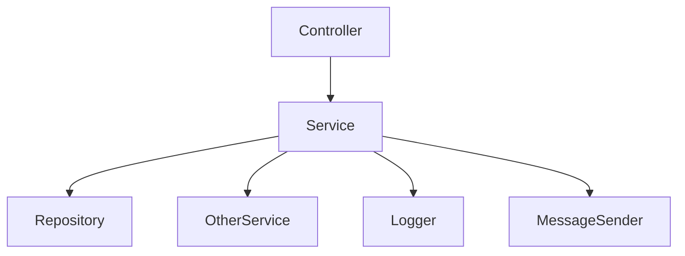
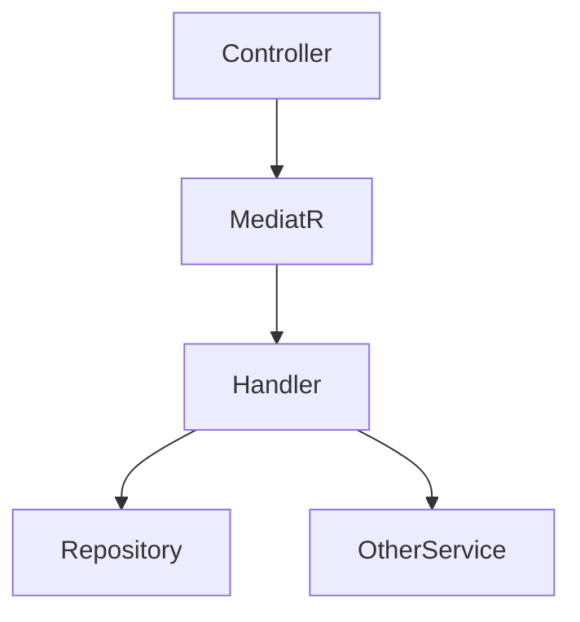

## 简介 ##

MediatR 是 .NET 里很常见的进程内消息分发库。

它做的事情不复杂：

> 调用方发出一个请求，MediatR 找到对应的处理器执行。

这听起来像“多绕了一层”，但在业务代码越来越复杂时，这一层很有用。

没有 MediatR 时，控制器、服务类里经常会堆很多依赖：

```csharp
public class OrdersController : ControllerBase
{
    private readonly IOrderRepository _orders;
    private readonly IInventoryService _inventory;
    private readonly IPaymentService _payment;
    private readonly IEmailService _email;
    private readonly ILogger<OrdersController> _logger;
}
```

一开始还好，后面新增库存、支付、优惠券、消息通知、审计日志，控制器和服务层就会越来越重。

MediatR 的思路是把这些操作拆成一条条消息：

```csharp
await sender.Send(new CreateOrderCommand(...));
```

控制器只表达“要创建订单”，真正的处理逻辑放到对应的 `Handler` 里。

一句话概括：

> MediatR 不是消息队列，也不是分布式事件总线，它是应用进程内部的请求分发器。

这篇文章主要讲清楚：

- MediatR 到底解决什么问题；
- Send、Publish 分别适合什么场景；
- Command、Query、Notification 怎么写；
- Pipeline Behavior 怎么处理日志、验证、事务；
- 在 ASP.NET Core 里怎么注册和使用；
- 实际项目里容易踩哪些坑。

## 先把定位说清楚 ##

MediatR 实现的是中介者模式。

中介者模式的核心不是“高级”，而是减少直接依赖。

普通调用是这样：



使用 MediatR 后变成：



也就是说：

- 调用方不直接依赖具体业务处理类；
- 请求和处理器通过类型匹配；
- 横切逻辑可以放进管道；
- 每个业务动作可以拆成一个独立处理单元。

但这不代表所有项目都要上 MediatR。

如果项目很小，业务逻辑也简单，直接写服务类更清楚。

MediatR 更适合这些场景：

- 控制器越来越薄，业务逻辑想拆到独立用例里；
- 项目采用 CQRS，读写操作希望分开组织；
- 需要统一加日志、验证、权限、事务、性能监控；
- 有领域事件或进程内通知；
- 业务动作很多，按 feature / use case 组织更清晰。

## 它不是消息队列 ##

这个点很重要。

MediatR 是进程内分发。

也就是说：

- 不跨进程；
- 不跨服务；
- 不负责持久化消息；
- 不负责失败重试；
- 不负责削峰；
- 不负责最终一致性。

下面这些事情不是 MediatR 的职责：

- 服务 A 给服务 B 发消息；
- 消息失败后自动重试；
- 消息落库防丢；
- 多个消费者分布式消费。

这些场景要看：

- RabbitMQ
- Kafka
- Redis Stream
- Azure Service Bus
- CAP
- MassTransit

MediatR 解决的是同一个应用内部的调用组织问题。

## 核心接口 ##

MediatR 常用接口不多。

|  接口   |      作用 |    常见场景  |
| :-----------: | :-----------: | :-----------: |
| `IRequest<TResponse>` | 有返回值请求 | 查询、创建后返回 ID |
| `IRequest` | 无返回值请求 | 命令、执行动作 |
| `IRequestHandler<TRequest, TResponse>` | 处理有返回值请求 | Command / Query Handler |
| `IRequestHandler<TRequest>` | 处理无返回值请求 | Command Handler |
| `INotification` | 通知事件 | 订单已创建、用户已注册 |
| `INotificationHandler<TNotification>` | 通知处理器 | 发邮件、写日志、同步缓存 |
| `IPipelineBehavior<TRequest, TResponse>` | 请求管道 | 日志、验证、事务、性能统计 |
| `ISender` | 发送 `Request` | `Send` |
| `IPublisher` | 发布 `Notification` | `Publish` |
| `IMediator` | 同时包含发送和发布能力 | 兼容常见写法 |

现在更推荐按职责注入：

```csharp
private readonly ISender _sender;
private readonly IPublisher _publisher;
```

如果只需要发送命令或查询，用 `ISender` 就够了。

如果只需要发布通知，用 `IPublisher` 就够了。

IMediator 也能用，只是能力更宽。

## 安装和注册 ##

安装：

```bash
dotnet add package MediatR
```

现代版本里，MediatR 已经直接支持 `Microsoft.Extensions.DependencyInjection` 注册。

Program.cs：

```csharp
using MediatR;

var builder = WebApplication.CreateBuilder(args);

builder.Services.AddMediatR(cfg =>
{
    cfg.RegisterServicesFromAssembly(typeof(Program).Assembly);
});
```

如果 Handler 在其他程序集里，就注册对应程序集：

```csharp
builder.Services.AddMediatR(cfg =>
{
    cfg.RegisterServicesFromAssembly(typeof(CreateOrderCommand).Assembly);
});
```

或者注册多个程序集：

```csharp
builder.Services.AddMediatR(cfg =>
{
    cfg.RegisterServicesFromAssemblies(
        typeof(Program).Assembly,
        typeof(CreateOrderCommand).Assembly);
});
```

老资料里经常出现：

```bash
dotnet add package MediatR.Extensions.Microsoft.DependencyInjection
```

这是旧版本常见写法。新项目通常先看当前 MediatR 包本身的注册方式，不要直接照搬旧教程。

## 关于 License Key ##

较新的 MediatR 版本引入了 license key 配置。

注册时可以这样设置：

```csharp
builder.Services.AddMediatR(cfg =>
{
    cfg.RegisterServicesFromAssembly(typeof(Program).Assembly);
    cfg.LicenseKey = builder.Configuration["MediatR:LicenseKey"];
});
```

如果没有配置，可能会看到 license 相关日志。

这类日志不等于功能不能用，但生产环境里需要按实际许可要求处理。客户端应用不要把 license key 打进前端或桌面客户端包里。

如果只是想屏蔽客户端缺失 license 的日志，可以按日志分类过滤：

```csharp
builder.Logging.AddFilter("LuckyPennySoftware.MediatR.License", LogLevel.None);
```

这部分属于版本和许可策略问题，实际项目里要以当前包版本和团队许可为准。

## Command：处理写操作 ##

Command 通常表示“执行一个会改变系统状态的动作”。

比如创建订单、取消订单、修改用户资料。

先定义请求：

```csharp
using MediatR;

public sealed record CreateOrderCommand(
    long UserId,
    IReadOnlyList<CreateOrderItem> Items) : IRequest<long>;

public sealed record CreateOrderItem(
    long ProductId,
    int Quantity);
```

这里 `CreateOrderCommand` 返回 `long`，表示创建后的订单 ID。

再写处理器：

```csharp
using MediatR;

public sealed class CreateOrderCommandHandler
    : IRequestHandler<CreateOrderCommand, long>
{
    private readonly IOrderRepository _orders;
    private readonly IProductRepository _products;
    private readonly IUnitOfWork _unitOfWork;

    public CreateOrderCommandHandler(
        IOrderRepository orders,
        IProductRepository products,
        IUnitOfWork unitOfWork)
    {
        _orders = orders;
        _products = products;
        _unitOfWork = unitOfWork;
    }

    public async Task<long> Handle(
        CreateOrderCommand request,
        CancellationToken cancellationToken)
    {
        if (request.Items.Count == 0)
        {
            throw new InvalidOperationException("订单明细不能为空。");
        }

        var order = new Order(request.UserId);

        foreach (CreateOrderItem item in request.Items)
        {
            Product product = await _products.GetByIdAsync(
                item.ProductId,
                cancellationToken);

            order.AddItem(product.Id, product.Price, item.Quantity);
        }

        await _orders.AddAsync(order, cancellationToken);
        await _unitOfWork.SaveChangesAsync(cancellationToken);

        return order.Id;
    }
}
```

控制器只负责接收请求、发送命令：

```csharp
[ApiController]
[Route("api/orders")]
public sealed class OrdersController : ControllerBase
{
    private readonly ISender _sender;

    public OrdersController(ISender sender)
    {
        _sender = sender;
    }

    [HttpPost]
    public async Task<ActionResult<long>> Create(
        CreateOrderRequest request,
        CancellationToken cancellationToken)
    {
        var command = new CreateOrderCommand(
            request.UserId,
            request.Items
                .Select(x => new CreateOrderItem(x.ProductId, x.Quantity))
                .ToArray());

        long orderId = await _sender.Send(command, cancellationToken);

        return Ok(orderId);
    }
}
```

这样控制器不再关心：

- 怎么查商品；
- 怎么组装订单；
- 怎么保存；
- 怎么提交事务。

这些都在对应的 `Handler` 里。

## Query：处理读操作 ##

Query 通常表示“查询数据，不改变系统状态”。

定义查询：

```csharp
public sealed record GetOrderDetailQuery(long OrderId)
    : IRequest<OrderDetailDto?>;

public sealed record OrderDetailDto(
    long Id,
    long UserId,
    decimal TotalAmount,
    IReadOnlyList<OrderItemDto> Items);

public sealed record OrderItemDto(
    long ProductId,
    string ProductName,
    int Quantity,
    decimal Price);
```

处理器：

```csharp
public sealed class GetOrderDetailQueryHandler
    : IRequestHandler<GetOrderDetailQuery, OrderDetailDto?>
{
    private readonly IOrderReadRepository _orders;

    public GetOrderDetailQueryHandler(IOrderReadRepository orders)
    {
        _orders = orders;
    }

    public Task<OrderDetailDto?> Handle(
        GetOrderDetailQuery request,
        CancellationToken cancellationToken)
    {
        return _orders.GetDetailAsync(request.OrderId, cancellationToken);
    }
}
```

控制器：

```csharp
[HttpGet("{id:long}")]
public async Task<ActionResult<OrderDetailDto>> GetById(
    long id,
    CancellationToken cancellationToken)
{
    OrderDetailDto? order = await _sender.Send(
        new GetOrderDetailQuery(id),
        cancellationToken);

    if (order is null)
    {
        return NotFound();
    }

    return Ok(order);
}
```

Command 和 Query 分开以后，代码结构会更清楚：

- 写操作关注业务规则和状态变化；
- 读操作关注查询效率和返回模型；
- 两边不必强行共用同一个服务方法。

这就是 CQRS 的基本味道。

## Notification：处理一对多事件 ##

Send 是一对一。

一个请求对应一个处理器。

Publish 是一对多。

一个通知可以有多个处理器。

比如订单创建后：

- 写订单日志；
- 发站内信；
- 清理购物车；
- 推送统计事件。

定义通知：

```csharp
public sealed record OrderCreatedNotification(
    long OrderId,
    long UserId,
    decimal TotalAmount) : INotification;
```

发布通知：

```csharp
public sealed class CreateOrderCommandHandler
    : IRequestHandler<CreateOrderCommand, long>
{
    private readonly IOrderRepository _orders;
    private readonly IUnitOfWork _unitOfWork;
    private readonly IPublisher _publisher;

    public CreateOrderCommandHandler(
        IOrderRepository orders,
        IUnitOfWork unitOfWork,
        IPublisher publisher)
    {
        _orders = orders;
        _unitOfWork = unitOfWork;
        _publisher = publisher;
    }

    public async Task<long> Handle(
        CreateOrderCommand request,
        CancellationToken cancellationToken)
    {
        var order = Order.Create(request.UserId);

        await _orders.AddAsync(order, cancellationToken);
        await _unitOfWork.SaveChangesAsync(cancellationToken);

        await _publisher.Publish(
            new OrderCreatedNotification(
                order.Id,
                order.UserId,
                order.TotalAmount),
            cancellationToken);

        return order.Id;
    }
}
```

第一个通知处理器：

```csharp
public sealed class ClearCartWhenOrderCreatedHandler
    : INotificationHandler<OrderCreatedNotification>
{
    private readonly ICartService _cart;

    public ClearCartWhenOrderCreatedHandler(ICartService cart)
    {
        _cart = cart;
    }

    public Task Handle(
        OrderCreatedNotification notification,
        CancellationToken cancellationToken)
    {
        return _cart.ClearAsync(notification.UserId, cancellationToken);
    }
}
```

第二个通知处理器：

```csharp
public sealed class WriteOrderAuditLogHandler
    : INotificationHandler<OrderCreatedNotification>
{
    private readonly IAuditLogRepository _logs;

    public WriteOrderAuditLogHandler(IAuditLogRepository logs)
    {
        _logs = logs;
    }

    public Task Handle(
        OrderCreatedNotification notification,
        CancellationToken cancellationToken)
    {
        return _logs.AddAsync(
            $"订单已创建：{notification.OrderId}",
            cancellationToken);
    }
}
```

这里的重点是：

- 创建订单的主流程不用知道有几个后续动作；
- 新增一个通知处理器，不需要改发布方；
- 通知不适合返回业务结果。

## Publish 不等于可靠事件 ##

Publish 很容易被误用成“事件总线”。

但它仍然是进程内执行。

如果通知处理器失败，行为取决于发布策略和异常处理方式。它没有自动持久化、自动重试、死信队列这些能力。

所以这类事情不要只靠 INotification：

- 扣款成功后必须发送出库消息；
- 订单创建事件必须可靠投递到其他服务；
- 外部系统失败后要重试；
- 消息丢失会造成数据不一致。

这类场景更适合：

- 事务内写业务数据和 Outbox 表；
- 后台任务扫描 Outbox；
- 通过消息队列投递到外部系统。

MediatR 的 Notification 更适合进程内副作用：

- 清理缓存；
- 写审计日志；
- 触发本地领域事件处理；
- 发送非关键通知；
- 拆分本地模块之间的后续动作。

## Pipeline Behavior：把横切逻辑放进管道 ##

Pipeline Behavior 是 MediatR 很重要的能力。

它类似 ASP.NET Core 中间件。

请求进入 Handler 前后，可以统一加一些逻辑：

- 日志；
- 参数验证；
- 权限检查；
- 性能统计；
- 事务；
- 缓存。

基本结构如下：

```csharp
public sealed class LoggingBehavior<TRequest, TResponse>
    : IPipelineBehavior<TRequest, TResponse>
{
    private readonly ILogger<LoggingBehavior<TRequest, TResponse>> _logger;

    public LoggingBehavior(
        ILogger<LoggingBehavior<TRequest, TResponse>> logger)
    {
        _logger = logger;
    }

    public async Task<TResponse> Handle(
        TRequest request,
        RequestHandlerDelegate<TResponse> next,
        CancellationToken cancellationToken)
    {
        string requestName = typeof(TRequest).Name;

        _logger.LogInformation("开始处理 {RequestName}", requestName);

        TResponse response = await next();

        _logger.LogInformation("完成处理 {RequestName}", requestName);

        return response;
    }
}
```

注册：

```csharp
builder.Services.AddMediatR(cfg =>
{
    cfg.RegisterServicesFromAssembly(typeof(Program).Assembly);
    cfg.AddOpenBehavior(typeof(LoggingBehavior<,>));
});
```

这样所有 Send 请求都会经过这个行为。

## 实际示例：FluentValidation 验证管道 ##

MediatR 经常和 FluentValidation 搭配。

需要额外安装：

```bash
dotnet add package FluentValidation
dotnet add package FluentValidation.DependencyInjectionExtensions
```

先定义验证器：

```csharp
using FluentValidation;

public sealed class CreateOrderCommandValidator
    : AbstractValidator<CreateOrderCommand>
{
    public CreateOrderCommandValidator()
    {
        RuleFor(x => x.UserId)
            .GreaterThan(0)
            .WithMessage("用户 ID 不合法。");

        RuleFor(x => x.Items)
            .NotEmpty()
            .WithMessage("订单明细不能为空。");

        RuleForEach(x => x.Items)
            .ChildRules(item =>
            {
                item.RuleFor(x => x.ProductId).GreaterThan(0);
                item.RuleFor(x => x.Quantity).GreaterThan(0);
            });
    }
}
```

验证管道：

```csharp
using FluentValidation;

public sealed class ValidationBehavior<TRequest, TResponse>
    : IPipelineBehavior<TRequest, TResponse>
{
    private readonly IEnumerable<IValidator<TRequest>> _validators;

    public ValidationBehavior(IEnumerable<IValidator<TRequest>> validators)
    {
        _validators = validators;
    }

    public async Task<TResponse> Handle(
        TRequest request,
        RequestHandlerDelegate<TResponse> next,
        CancellationToken cancellationToken)
    {
        if (!_validators.Any())
        {
            return await next();
        }

        var context = new ValidationContext<TRequest>(request);

        var errors = _validators
            .Select(x => x.Validate(context))
            .SelectMany(x => x.Errors)
            .Where(x => x is not null)
            .ToList();

        if (errors.Count > 0)
        {
            throw new ValidationException(errors);
        }

        return await next();
    }
}
```

注册：

```csharp
builder.Services.AddValidatorsFromAssembly(typeof(Program).Assembly);

builder.Services.AddMediatR(cfg =>
{
    cfg.RegisterServicesFromAssembly(typeof(Program).Assembly);
    cfg.AddOpenBehavior(typeof(ValidationBehavior<,>));
});
```

这样 Handler 里就不用堆一堆基础参数校验。

Handler 更专注业务规则：

- 用户是否存在；
- 商品是否可售；
- 库存是否足够；
- 价格是否需要重新计算。

## 实际示例：事务管道 ##

事务也适合放进管道。

不过不是所有请求都需要事务。

可以定义一个标记接口：

```csharp
public interface ITransactionalRequest
{
}
```

让需要事务的命令实现它：

```csharp
public sealed record CreateOrderCommand(
    long UserId,
    IReadOnlyList<CreateOrderItem> Items)
    : IRequest<long>, ITransactionalRequest;
```

事务管道：

```csharp
public sealed class TransactionBehavior<TRequest, TResponse>
    : IPipelineBehavior<TRequest, TResponse>
{
    private readonly AppDbContext _dbContext;

    public TransactionBehavior(AppDbContext dbContext)
    {
        _dbContext = dbContext;
    }

    public async Task<TResponse> Handle(
        TRequest request,
        RequestHandlerDelegate<TResponse> next,
        CancellationToken cancellationToken)
    {
        if (request is not ITransactionalRequest)
        {
            return await next();
        }

        await using var transaction = await _dbContext.Database
            .BeginTransactionAsync(cancellationToken);

        TResponse response = await next();

        await _dbContext.SaveChangesAsync(cancellationToken);
        await transaction.CommitAsync(cancellationToken);

        return response;
    }
}
```

注册顺序要留意。

例如：

```csharp
builder.Services.AddMediatR(cfg =>
{
    cfg.RegisterServicesFromAssembly(typeof(Program).Assembly);
    cfg.AddOpenBehavior(typeof(LoggingBehavior<,>));
    cfg.AddOpenBehavior(typeof(ValidationBehavior<,>));
    cfg.AddOpenBehavior(typeof(TransactionBehavior<,>));
});
```

通常希望：

- 日志最外层；
- 验证在事务之前；
- 事务包住真正的业务处理。

如果验证失败，不需要打开事务。

如果采用这种事务管道，Handler 里就不要再对同一个 DbContext 重复提交。

也就是说，下面两种方式选一种：

- Handler 自己调用 SaveChangesAsync；
- 事务管道统一调用 SaveChangesAsync。

两边都提交，代码语义会变乱。

## Minimal API 里的写法 ##

MediatR 不只适用于控制器。

Minimal API 里也可以直接注入 ISender：

```csharp
app.MapPost("/orders", async (
    CreateOrderRequest request,
    ISender sender,
    CancellationToken cancellationToken) =>
{
    var command = new CreateOrderCommand(
        request.UserId,
        request.Items
            .Select(x => new CreateOrderItem(x.ProductId, x.Quantity))
            .ToArray());

    long orderId = await sender.Send(command, cancellationToken);

    return Results.Ok(new { orderId });
});
```

查询接口：

```csharp
app.MapGet("/orders/{id:long}", async (
    long id,
    ISender sender,
    CancellationToken cancellationToken) =>
{
    OrderDetailDto? order = await sender.Send(
        new GetOrderDetailQuery(id),
        cancellationToken);

    return order is null
        ? Results.NotFound()
        : Results.Ok(order);
});
```

## 文件组织方式 ##

MediatR 代码如果放得乱，很快会变成另一种混乱。

比较常见的组织方式是按功能分目录：

```text
Features/
  Orders/
    CreateOrder/
      CreateOrderCommand.cs
      CreateOrderCommandHandler.cs
      CreateOrderCommandValidator.cs
    GetOrderDetail/
      GetOrderDetailQuery.cs
      GetOrderDetailQueryHandler.cs
      OrderDetailDto.cs
```

这种方式的好处是：

- 一个用例相关的请求、处理器、验证器放在一起；
- 改创建订单时，不用到处找文件；
- 比按 Controllers、Services、Repositories 横向分层更贴近业务动作。

当然，项目如果已经有成熟分层方式，也没必要为了 MediatR 强行重排目录。

## 执行流程 ##

一次 Send 大概是这样：


一次 Publish 大概是这样：


这两张图的区别很关键：

- Send 是一对一，有返回值；
- Publish 是一对多，不适合拿返回值；
- Pipeline Behavior 主要包在 Send 的请求处理链路上。

## 常见坑 1：把所有方法都改成 MediatR ##

MediatR 是组织业务用例的工具，不是替代所有方法调用的工具。

下面这些代码没必要硬套：

- 简单工具方法；
- 实体内部行为；
- 私有领域计算；
- 很短的纯函数；
- 一个类内部的普通协作。

如果一个操作只是同一个类内部拆方法，直接调用方法更清楚。

MediatR 更适合表达“一个应用层用例”。

## 常见坑 2：Handler 变成大杂烩 ##

用了 MediatR，并不自动等于架构清晰。

如果 Handler 里塞满：

- 参数校验；
- 权限判断；
- 事务；
- 日志；
- 复杂查询；
- 外部接口调用；
- 各种 if-else；

那只是把胖控制器换成了胖 Handler。

更合适的拆法是：

- 基础校验放验证器；
- 日志、事务、性能统计放管道；
- 复杂领域规则放领域对象或领域服务；
- 数据访问细节放仓储或查询对象；
- Handler 负责组织这个用例。

## 常见坑 3：在 Handler 里互相 Send ##

一个 Handler 里再调用 `_sender.Send(...)`，有时可以用，但要克制。

如果大量 Handler 互相发送请求，调用链会变得不直观：

```mermaid
flowchart LR
    A[AHandler] -->|Send(BCommand)| B[BHandler]
    B -->|Send(CCommand)| C[CHandler]
```


结果是：

- 调试困难；
- 事务边界不清楚；
- 重复经过管道；
- 容易形成隐式依赖。

更稳的做法是把公共业务能力抽成服务，两个 Handler 都调用这个服务。

## 常见坑 4：滥用 Notification 做关键业务 ##

Notification 适合解耦本地副作用。

但关键业务不要轻易放进“谁订阅谁执行”的隐式流程里。

例如：

- 创建订单必须扣库存；
- 支付成功必须生成流水；
- 审核通过必须变更主状态。

这些动作如果是主流程的一部分，最好明确写在命令处理逻辑里，或者放在明确的领域服务里。

Notification 更适合“主流程完成后顺带发生”的动作。

## 常见坑 5：忽略 CancellationToken ##

Handle 方法自带 CancellationToken。

数据库、HTTP、缓存、消息发送等异步调用，都要尽量传下去：

```csharp
await _orders.AddAsync(order, cancellationToken);
await _unitOfWork.SaveChangesAsync(cancellationToken);
```

如果每一层都丢掉 CancellationToken，上游请求取消后，后台工作仍然可能继续执行。

## 常见坑 6：异常处理边界不清楚 ##

MediatR 不会让异常自动变成统一响应。

Handler 抛出的异常，最终还是要被 ASP.NET Core 的异常处理中间件、过滤器或自定义异常映射处理。

常见做法是：

- 参数错误抛验证异常；
- 找不到资源返回 null 或领域结果对象；
- 业务冲突抛业务异常或返回错误结果；
- 最外层统一转成 HTTP 响应。

不要把所有异常处理都塞进每个 Handler。

## 什么时候不适合用 MediatR？ ##

这些情况可以先不上：

- 项目很小，控制器和服务类已经足够清楚；
- 团队不熟悉这种用例拆分方式；
- 业务逻辑非常简单，主要是 CRUD；
- 引入后只是多了一堆空壳 Command / Handler；
- 调用链可读性比原来更差。

MediatR 的收益来自“拆分复杂度”。

如果本来没有复杂度，引入它只会增加文件数量和跳转成本。

## 总结 ##

MediatR 的核心价值不是“让代码看起来高级”，而是：

> 把应用内部的业务动作，拆成清晰的请求、处理器、通知和管道。

它最常用的几类能力是：

- Send：命令和查询，一对一处理；
- Publish：通知事件，一对多处理；
- Pipeline Behavior：日志、验证、事务、性能统计等横切逻辑；
- ISender / IPublisher：按职责暴露发送和发布能力；
- 程序集扫描：自动注册请求处理器和通知处理器。

真正需要记住的是边界：

- 它是进程内分发，不是消息队列；
- 它能让控制器变薄，但不能自动让业务变清楚；
- Notification 不适合承载必须成功的关键业务；
- Handler 也需要保持单一职责；
- 简单项目没必要为了模式而引入。

用在合适的位置，MediatR 会让应用层更像一组清晰的用例。

用得过度，就只是把直接调用换成绕路调用。
