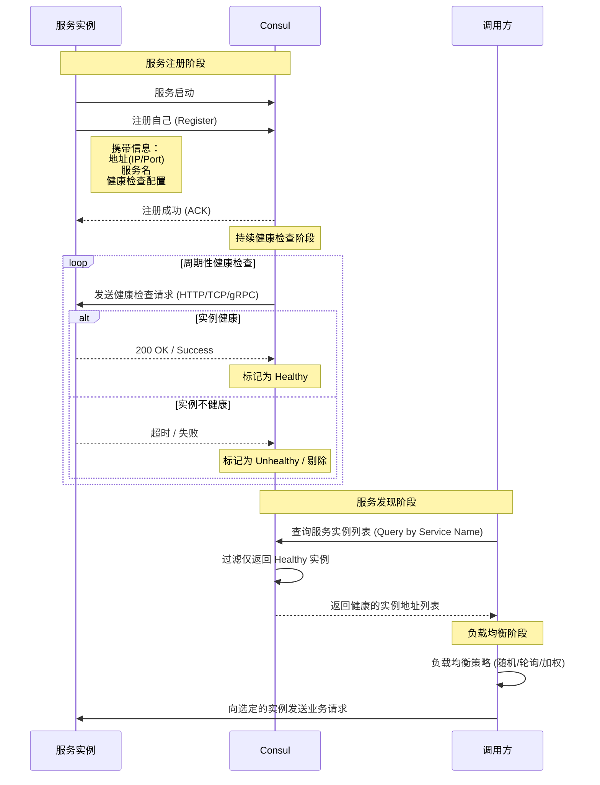
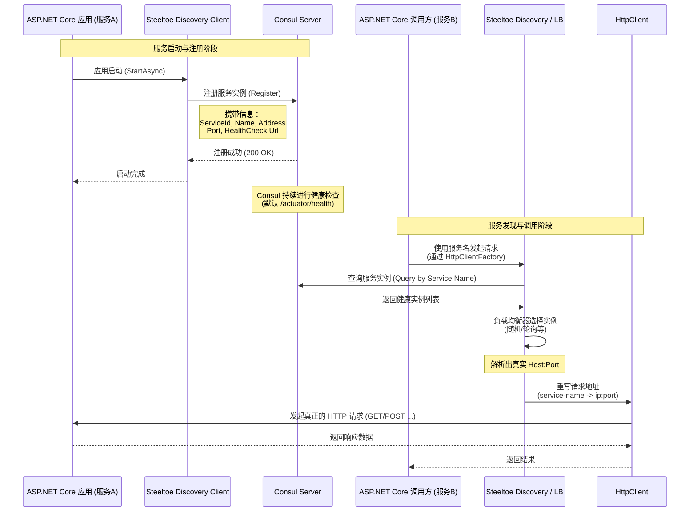
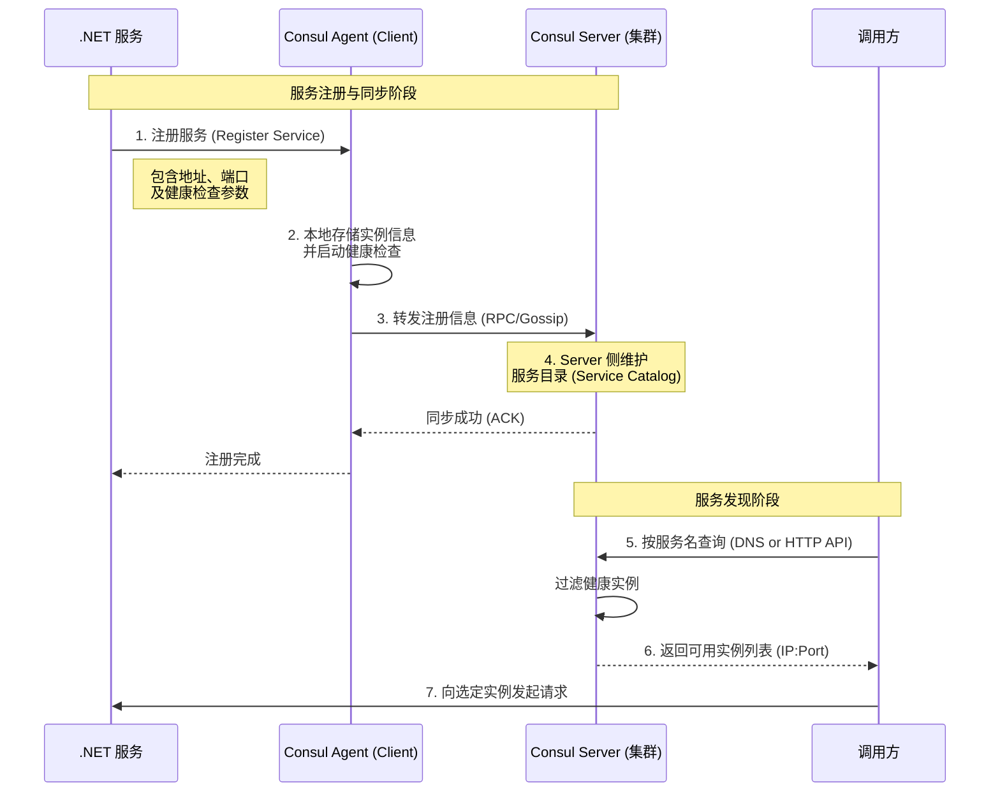
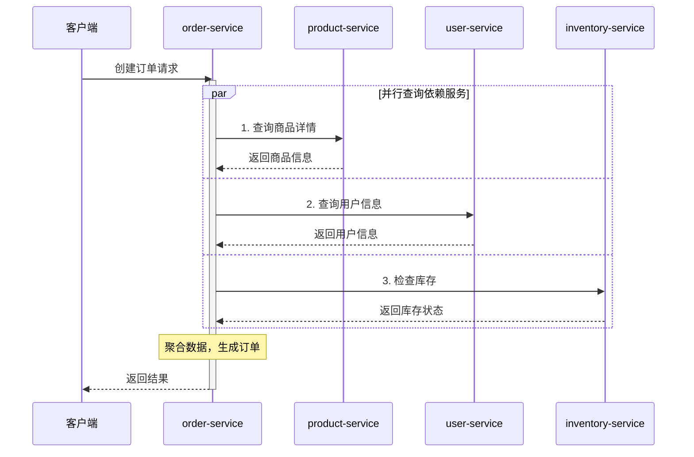

## 简介 ##

在 .NET 微服务里，只要你开始拆服务，很快就会遇到这几个现实问题：

- 服务实例越来越多，地址不固定
- 调用方不能再把 `IP:Port` 写死
- 某个实例挂了，调用方最好别继续打过去
- 配置、注册、发现、负载均衡这些事，不能全靠手写

这时候经常会一起出现两个名字：

```csharp
Consul
Steeltoe
```

一句话先说透：

> `Consul` 是服务注册发现和健康检查的基础设施；`Steeltoe` 是 .NET 里把这些能力接进应用、接进 `HttpClient`、接进服务发现抽象层的一套客户端框架。

所以这篇文章重点不是只讲“怎么装包”，而是讲清楚：

- `Consul` 和 `Steeltoe` 分别解决什么问题；
- 一个 .NET 服务从启动到注册、再到被别的服务发现，中间链路到底怎么走；
- 为什么有时候直接用 `Consul` 客户端就够了，有时候更适合用 `Steeltoe`；
- `Health Check`、`TTL heartbeat`、负载均衡、配置中心这些能力到底怎么分层理解；
- 什么场景适合它们，什么场景不适合它们。

## Consul 到底是什么？ ##

Consul 是 HashiCorp 提供的一套服务治理基础设施。

最常被用到的能力主要有四类：

- 服务注册与发现
- 健康检查
- KV 配置存储
- 服务网格相关能力

但在多数 `.NET` 微服务项目里，最常用的其实还是前两项：

- 注册谁在线
- 查询谁可用

也就是说，Consul 先解决的是：

> 微服务之间怎么找到彼此，以及怎么判断某个实例还能不能接流量。

## Steeltoe 又是什么？ ##

如果把 Consul 看成基础设施，那 Steeltoe 更像 .NET 里的接入层和抽象层。

可以先这样理解：

- Consul：注册中心/发现中心本身
- Steeltoe：让 .NET 应用更自然地接入注册发现、负载均衡和云原生能力

更具体一点说，Steeltoe 干的事包括：

- 提供统一的 `IDiscoveryClient` 抽象
- 提供面向 `HttpClientFactory` 的服务发现接入
- 把“根据服务名解析实例地址”这件事从业务代码里抽出去
- 帮你把注册、注销、健康检查、负载均衡这条链接起来

所以它不是“另一个注册中心”，而是：

- .NET 应用和注册中心之间的桥接层

## Consul 和 Steeltoe 的关系，最简单怎么记？ ##

可以直接记成这句话：

> Consul 负责存和查服务实例；Steeltoe 负责让 .NET 应用更方便地注册、发现和调用这些实例。

如果继续拆得更细一点：

- Consul 决定“注册表里有什么”
- Steeltoe 决定“.NET 应用怎么接这个注册表”

这也是为什么它们经常一起出现，但并不是同一个层级的东西。

## 一条最典型的链路到底怎么走？ ##

先看最常见的服务注册发现链路：



如果用 Steeltoe 接起来，心智模型可以再具体一点：



这条链路里最容易被忽略的一点是：

- 业务代码看到的是服务名
- 真正的实例选择和地址重写，发生在发现/负载均衡层

## Consul 里到底存了什么？ ##

对服务发现来说，最关键的是这些信息：

- 服务名
- 实例 ID
- 地址和端口
- 标签和元数据
- 健康检查配置
- 当前健康状态

更务实地说，调用方真正关心的不是“这个服务在不在注册表里”，而是：

- 这个服务当前有哪些健康实例可以接流量

所以注册中心的价值，不只是“记个名字”，而是：

- 让调用方尽量只看到可用实例

## 从源码和架构视角看，Agent / Server / Catalog 怎么理解？ ##

这是很多人第一次深入 Consul 时最容易混掉的一层。

更务实的理解方式是：

- Agent：离服务实例更近，负责接收注册、探活和本地交互
- Server：负责 Consul 集群的一致性状态和服务目录汇总
- Catalog：可以理解成最终对外可查询的服务目录结果

所以从链路上说，更接近下面这个心智模型：



这里最重要的认知是：

- 你不是直接把“业务实例列表”硬塞给某个静态注册表
- 而是在和一个持续维护健康状态的服务目录系统交互

这也是为什么 Consul 不只是“存个地址簿”。

## 健康检查为什么是整个模型的关键？ ##

因为如果没有健康检查，注册发现只解决了“找到谁”，没有解决“这个实例还能不能用”。

Consul 常见的健康判断方式主要包括：

- HTTP health check
- TTL heartbeat

在 .NET 服务里最常见的就是：

- 暴露一个健康检查地址
- 让 Consul 周期性探活

例如：

```json
{
  "Consul": {
    "Discovery": {
      "HealthCheckPath": "/health",
      "HealthCheckInterval": "10s"
    }
  }
}
```

这件事的重要性在于：

- 注册不是一次性动作
- 健康状态是持续变化的

没有健康检查，服务发现只能算半套。

## 在 .NET 里直接用 Consul 客户端是什么感觉？ ##

如果你不用 Steeltoe，也可以直接用 Consul 的 .NET 客户端自己做注册和发现。

这种方式更像：

- 你自己控制注册
- 你自己控制注销
- 你自己查询服务
- 你自己做实例选择

一个很简化的注册思路大概是：

```csharp
var consulClient = new ConsulClient(options =>
{
    options.Address = new Uri("http://localhost:8500");
});

await consulClient.Agent.ServiceRegister(new AgentServiceRegistration
{
    ID = "order-service-1",
    Name = "order-service",
    Address = "localhost",
    Port = 5001
});
```

这种方式的优点是：

- 灵活
- 透明
- 容易做底层定制

但代价也很明确：

- 注册和反注册要自己管
- 健康检查配置要自己管
- 服务发现和负载均衡逻辑要自己管
- 容易把很多基础能力散落到业务代码里

## 用 Steeltoe 接 Consul，思路会怎么变？ ##

如果用 Steeltoe，更推荐的心智模型是：

- 让服务发现变成基础设施能力
- 不让业务代码到处手写 `ConsulClient`
- 让调用链尽量围绕 `IDiscoveryClient` 和 `HttpClientFactory`

在 Steeltoe v4 下，典型起点是：

```csharp
builder.Services.AddConsulDiscoveryClient();
```

然后对外部服务调用走 HttpClientFactory：

```csharp
builder.Services.AddHttpClient<OrderApiClient>()
    .AddServiceDiscovery();
```

这样业务代码里看到的请求地址就可以是：

```txt
https://ordering-api/orders/123
```

而不是写死某个实例地址。

## 一个更贴近实战的 Steeltoe + Consul 配置长什么样？ ##

例如：

```json
{
  "Consul": {
    "Host": "localhost",
    "Port": 8500,
    "Discovery": {
      "ServiceName": "order-service",
      "Register": true,
      "Deregister": true,
      "Port": 5001,
      "HealthCheckPath": "/health",
      "HealthCheckInterval": "10s",
      "QueryPassing": true
    }
  }
}
```

这组配置里最关键的几个点分别是：

- ServiceName：注册到 Consul 时的服务名
- Register：当前服务是否注册自己
- Deregister：应用停止时是否反注册
- HealthCheckPath / HealthCheckInterval：健康检查
- QueryPassing：查询实例时是否只拿健康通过的实例

## 一个最小可跑通的集成流程怎么做？ ##

如果你要的不是概念，而是“今天就把它跑起来”，可以按这个顺序来。

### 第一步：先起一个本地 Consul ###

开发环境最常见的方式就是直接起一个单机节点：

```bash
docker run --rm -p 8500:8500 --name consul consul agent -dev -client=0.0.0.0
```

启动后先确认这两个点：

- UI 能不能打开：`http://localhost:8500`
- HTTP API 地址是不是：`http://localhost:8500`

如果这一步都没通，后面所有注册发现配置都会是空谈。

### 第二步：准备一个服务提供方 ###

例如我们先准备一个 product-service。

先装包：

```bash
dotnet add package Steeltoe.Discovery.Consul
```

然后在 `appsettings.json` 里配上注册信息：

```json
{
  "Consul": {
    "Host": "localhost",
    "Port": 8500,
    "Discovery": {
      "ServiceName": "product-service",
      "InstanceId": "product-service-5001",
      "Register": true,
      "Deregister": true,
      "Port": 5001,
      "HealthCheckPath": "/health",
      "HealthCheckInterval": "10s",
      "QueryPassing": true
    }
  }
}
```

### 第三步：在提供方接入 Steeltoe ###

Program.cs 可以先保持最小可跑状态：

```csharp
using Steeltoe.Discovery.Client;
using Steeltoe.Discovery.Consul;

var builder = WebApplication.CreateBuilder(args);

builder.Services.AddConsulDiscoveryClient();

var app = builder.Build();

app.MapGet("/health", () => Results.Ok(new { status = "UP" }));
app.MapGet("/products/{id:int}", (int id) => Results.Ok(new { id, name = $"product-{id}" }));

app.Run("http://localhost:5001");
```

这里最关键的是两件事：

- 暴露可被 Consul 探活的 `/health`
- 服务实际监听端口要和注册端口一致

### 第四步：再准备一个服务消费方 ###

例如准备一个 order-service，它不一定非要把自己也注册到 Consul，但为了更贴近实战，通常还是会一起注册。

消费者的配置可以长这样：

```json
{
  "Consul": {
    "Host": "localhost",
    "Port": 8500,
    "Discovery": {
      "ServiceName": "order-service",
      "InstanceId": "order-service-5002",
      "Register": true,
      "Deregister": true,
      "Port": 5002,
      "HealthCheckPath": "/health",
      "HealthCheckInterval": "10s",
      "QueryPassing": true
    }
  }
}
```

### 第五步：把服务发现接进 HttpClientFactory ###

消费者的 `Program.cs` 最小版本可以这样写：

```csharp
using Steeltoe.Discovery.Client;
using Steeltoe.Discovery.Consul;

var builder = WebApplication.CreateBuilder(args);

builder.Services.AddConsulDiscoveryClient();
builder.Services.AddHttpClient("product-api")
    .AddServiceDiscovery();

var app = builder.Build();

app.MapGet("/health", () => Results.Ok(new { status = "UP" }));

app.MapGet("/orders/{id:int}", async (int id, IHttpClientFactory factory) =>
{
    var client = factory.CreateClient("product-api");
    var response = await client.GetAsync($"http://product-service/products/{id}");
    var product = await response.Content.ReadAsStringAsync();

    return Results.Ok(new
    {
        orderId = id,
        product
    });
});

app.Run("http://localhost:5002");
```

这段代码里最关键的点只有一个：

- URL 里写的是 `http://product-service/...`
- 不是某个具体实例地址

也就是说，真正的目标地址解析已经交给 Steeltoe + Consul 这一层了。

### 第六步：怎么验证它真的跑通了？ ###

最实用的验证顺序通常是：

- 打开 Consul UI，确认两个服务都已经注册成功
- 直接访问 `http://localhost:5001/health`，确认健康检查是通的
- 访问 `http://localhost:5002/orders/1`
- 看 `order-service` 是否真的通过服务名调用到了 `product-service`

如果第三步失败，优先排查这几个点：

- 服务名和配置里的 `ServiceName` 是否一致
- 健康检查是否通过
- 服务实际监听端口和注册端口是否一致
- 消费端有没有真的加上 `AddServiceDiscovery()`

## 一个更贴近项目的实践案例怎么理解？ ##

可以用最常见的一条调用链来理解：



如果没有注册发现，这条链通常会变成：

- 一堆写死的地址
- 一堆环境配置差异
- 一堆实例扩缩容后需要跟着改的调用配置

但接上 Consul + Steeltoe 后，调用方关心的会变成：

- product-service
- user-service
- inventory-service

而不再是：

- 10.0.1.12:5001
- 10.0.1.13:5003
- 10.0.1.21:5010

这就是它在项目里的真实价值：

- 让“服务身份”替代“实例地址”
- 让扩容、重启、漂移之后的实例变化，不再直接污染业务调用代码

## 生产环境里，最容易漏掉的配置细节有哪些？ ##

这部分很实战，建议单独记一下。

### 服务注册端口要和真实监听端口一致 ###

这是最常见的问题之一。

如果你应用实际监听的是：

`http://0.0.0.0:8080`

但注册时填成了：

`5001`

那调用方发现服务后，仍然会打到错误端口。

### 健康检查地址不能只在本机能访问 ###

很多人本地调得通，是因为：

- 自己进程里能访问

但 Consul 探活需要的是：

- 注册中心能访问这个地址

容器、宿主机、Kubernetes、反向代理一夹层，这里很容易出问题。

### ServiceName 要稳定，InstanceId 要唯一 ###

更务实地说：

- ServiceName 代表这是哪类服务
- InstanceId 代表这是哪一个实例

不要把两者混成一个字段心智模型。

### 不要把服务发现和网关路由配置写成两套真相 ###

如果你同时用了：

- Consul + Steeltoe
- YARP

那服务名、目标地址、路由规则最好有清晰统一的来源，不然最终一定会出现：

- 注册中心里是一套实例
- 网关里是另一套路由

这会让排障非常痛苦。

## Steeltoe 服务发现和 HttpClientFactory 是怎么串起来的？ ##

这是很多人真正理解服务发现时的分水岭。

如果你只注入一个 IDiscoveryClient，你当然可以自己写：

- 查询实例列表
- 选一个实例
- 自己拼 URL

但 Steeltoe 更推荐的路径是把服务发现接到 `HttpClientFactory` 里。

它的思路不是：

- “先手动查，再手动拼”

而是：

- “把服务名解析和实例选择放进 HTTP 请求管道”

官方推荐的方式是给 HttpClient 加上：

```csharp
.AddServiceDiscovery()
```

这样请求中的：

`https://ordering-api`

会被自动解析成注册中心里的某个真实实例地址。

## 从运行时视角看，IDiscoveryClient -> ILoadBalancer -> HttpClient 这条链到底在干什么？ ##

这条链非常值得单独讲清楚。

如果拆成几个角色看，会更容易理解：

- `IDiscoveryClient`：负责“查到有哪些实例”
- `ILoadBalancer`：负责“从这些实例里选哪一个”
- `AddServiceDiscovery()`：负责“把这个选择结果接进 HTTP 请求管道”

也就是说，真正发请求前，运行时大致会经历：

- 根据 `URI` 里的服务名识别出目标服务
- 通过 `IDiscoveryClient` 拿到该服务的实例列表
- 交给负载均衡器做实例选择
- 把原来的 `friendly name` 改写成真实 `host:port`
- 再由 `HttpClient` 发起真正请求

所以这件事不是单个 API 的技巧，而是一条明确的责任链。

也正因为如此，Steeltoe 的价值从来不只是“帮你少写几行查询代码”，而是：

- 让服务发现真正成为 HTTP 调用基础设施的一部分

## 负载均衡是在谁那里发生的？ ##

不是 Consul 帮你自动把 HTTP 请求轮询出去。

更准确地说：

- `Consul` 提供实例列表和健康状态
- `Steeltoe` 的负载均衡器根据 `IDiscoveryClient` 返回的实例做选择
- 然后 `HttpClient` 才真正打到某个实例

也就是说，Consul 更像：

- 注册表 + 健康状态源

而不是：

- 直接帮你转发请求的网关

## Steeltoe + Consul 在查询实例时是实时拉取还是本地缓存？ ##

这是一个非常容易被忽略，但很关键的运行时细节。

根据 Steeltoe v4 官方文档：

- Consul 客户端在应用启动后不会主动拉整份服务注册表
- 只有当你真正查询某个服务时，才会向 Consul 发请求
- 默认也不会自己缓存查询结果

### 这意味着什么？ ###

这意味着：

- 好处是语义直接，不容易拿到旧缓存
- 代价是查询频繁时，会更依赖 Consul 可用性和网络成本

所以在实例查询很频繁的场景里，缓存和负载均衡策略就需要单独考虑，而不是想当然觉得客户端一定已经把注册表缓存好了。

## Consul + Steeltoe 和 YARP 的职责边界怎么分？ ##

这也是架构讨论里非常高频的一个问题。

可以先直接记结论：

- `Consul + Steeltoe` 更偏服务发现和客户端侧调用接入
- `YARP` 更偏反向代理和网关转发

更具体一点说：

`Consul + Steeltoe` 解决的是：

- 服务实例怎么注册
- 调用方怎么按服务名发现它们
- 客户端怎么在多个实例里选一个

`YARP` 解决的是：

- 外部请求如何统一入口
- 路由、转发、聚合、网关策略怎么处理

所以它们不是互斥关系，反而经常一起出现：

- YARP 作为入口网关
- Consul 作为注册发现来源
- Steeltoe 作为服务内部调用侧的发现接入层

如果把这些角色混成一个，会很容易误以为：

- 注册中心就等于网关
- 或者客户端发现就等于服务端转发

这两个判断都不准确。

## Consul 的 KV 和服务发现是不是一回事？ ##

不是。

这也是很多文章特别容易讲混的点。

Consul 当然也有 KV：

- 可以拿来存配置
- 可以拿来做一些简单的分布式配置读取

但这和服务发现不是同一层能力。

可以先这样拆：

- 服务发现：查有哪些健康实例
- KV 配置：查某个配置值是什么

这两者可能都在 Consul 里，但职责完全不同。

所以如果文章主线在讲 Consul + Steeltoe 的服务治理接入，重点应该放在：

- 注册
- 健康检查
- 查询
- 实例选择

而不是把 KV 和发现混成一坨。

## 它适合哪些场景？ ##

下面这些场景很适合优先考虑 Consul + Steeltoe：

- 传统 `.NET` 微服务拆分后需要服务注册发现
- 想通过服务名调用而不是写死实例地址
- 需要把健康检查接进注册中心
- 需要把发现能力接进 `HttpClientFactory`
- 团队希望把基础设施接入收敛到统一框架层

典型例子包括：

- 内部订单、库存、用户、支付等服务互调
- 网关后面的服务发现
- 多实例部署后的健康路由
- 从手写 `IP:Port` 调用逐步演进到服务名调用

## 它不适合哪些场景？ ##

边界也要说透。

下面这些需求，不能想当然地全压给 `Consul + Steeltoe`：

- 复杂异步消息通信
- 可靠事件投递
- 限流熔断重试全套治理
- 分布式事务
- 高吞吐异步流式传输

更务实地说：

- Consul 不是消息队列
- Steeltoe Discovery 不是 API Gateway
- 注册发现解决的是“找到谁”和“谁健康”
- 不等于把全部微服务治理问题都解决了

## Consul + Steeltoe 和自己手写 ConsulClient 怎么选？ ##

可以先这样判断：

### 适合直接用 ConsulClient ###

- 你只需要很少量的注册/查询
- 你想完全掌控交互细节
- 你不想引入额外框架抽象

### 更适合用 Steeltoe ###

- 项目已经是典型微服务调用链
- 希望统一注册发现接入方式
- 想把服务名解析接进 HttpClientFactory
- 不想到处散落 ConsulClient 调用

这组选择背后的本质是：

- 一个偏底层 API 使用
- 一个偏工程化接入方式

## 一个非常务实的选择顺序 ##

如果你在做 .NET 微服务注册发现选型，可以先按这个顺序判断：

- 你要解决的是不是服务注册发现问题？
- 如果是，并且注册中心选的是 Consul，再决定是直接用 ConsulClient 还是接 Steeltoe
- 如果项目已经是典型微服务 HTTP 调用链，优先考虑 Steeltoe + HttpClientFactory
- 如果只是少量底层操作或特殊注册逻辑，可以直接用 ConsulClient
- 如果需求已经升级到异步消息、可靠投递、背压和事件流，那应该看 MQ、Channel、Kafka 之类，而不是继续堆发现框架

这个顺序很重要。

因为很多团队不是“不会接注册中心”，而是一开始就把“服务发现”“配置中心”“网关”“消息通信”混成了一个问题。

## 面试里怎么答比较到位？ ##

如果面试官问：

“Consul 和 Steeltoe 分别是什么？”

一个比较稳的回答可以是：

> Consul 是注册中心和服务发现基础设施，负责保存服务实例、健康检查和服务查询；Steeltoe 是 .NET 里的客户端和抽象层，负责把 Consul 这类注册中心接到应用里，并把服务发现能力接到 IDiscoveryClient、负载均衡器和 HttpClientFactory 上。两者不是替代关系，而是基础设施和接入层的关系。

如果继续追问“服务调用时到底是谁在做实例选择”，可以答：

> Consul 提供的是实例列表和健康状态，真正的实例选择通常发生在客户端侧。以 Steeltoe 为例，是发现客户端加负载均衡器选出一个实例，再由 HttpClient 把服务名重写成真实地址。

如果继续追问“为什么很多时候推荐 Steeltoe 而不是手写 ConsulClient”，可以答：

> 因为在微服务项目里，服务发现不是单个 API 调用问题，而是一条贯穿注册、查询、负载均衡和 HttpClient 的基础设施链路。Steeltoe 把这些能力收敛到统一抽象里，更适合工程化落地；直接用 ConsulClient 更适合少量底层定制。

如果继续追问“Agent、Server、Catalog 这几个概念怎么分”，可以答：

> Agent 更贴近具体服务实例，负责接收注册和健康检查；Server 负责 Consul 集群的一致性状态；Catalog 可以理解成最终对外查询到的服务目录结果。服务发现不是直接读某个孤立实例列表，而是在查一个带健康状态的动态目录。

如果再追问“Steeltoe 在服务调用里到底做了什么”，可以补一句：

> 运行时会先通过 IDiscoveryClient 查询服务实例，再通过 ILoadBalancer 选择实例，最后由 AddServiceDiscovery() 接入到 HttpClient 请求管道，把服务名改写成真实地址。

如果追问“那和 YARP 的区别是什么”，更稳的回答是：

> Steeltoe + Consul 更偏客户端服务发现和服务间调用接入，YARP 更偏服务端入口网关和反向代理。一个解决内部服务怎么找彼此，一个解决外部流量怎么进系统，它们可以协同，但不是同一层职责。

## 总结 ##

Consul + Steeltoe 最值得记住的，不是“两个名词经常一起出现”，而是它们的分工非常明确：

> Consul 负责存服务和判断健康，Steeltoe 负责让 .NET 应用更自然地注册、发现并调用这些服务。

如果你只想记住几句话，可以记这几条：

- Consul 是注册中心，不是消息队列，也不是网关；
- Steeltoe 是 .NET 里的服务发现接入层，不是另一个注册中心；
- 健康检查是服务发现模型能不能真正工作的重要前提；
- Steeltoe 更适合把发现能力接进 HttpClientFactory 和统一调用链；
- KV 配置和服务发现都可能由 Consul 提供，但它们不是一回事。
