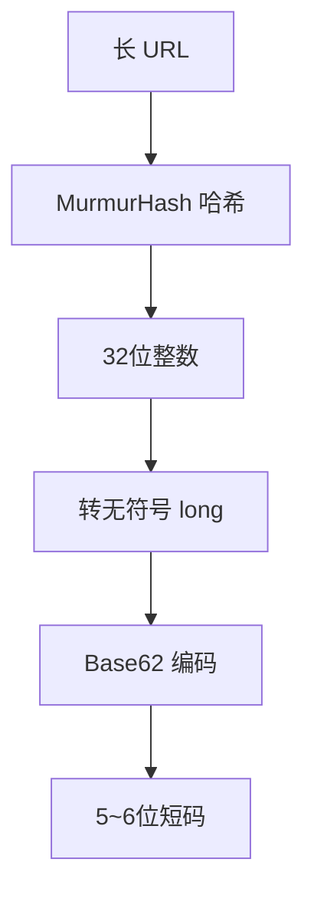

## 前言 ##

短链是我们业务中不陌生的一个场景，也是生活中常见的场景，比如我前几天续费车险涉及到的相关操作，保险公司给我发了一个短信，里面就是一个短链，点击之后会跳转到一个 APP 页面。正好最近的项目有短链场景，分享一下可能的实现方案。

## 源码 ##

源码已分享到 [Github 短链生成项目](https://github.com/yanzhisishui/li-short-url.git) 下载即用

## 为什么需要短链 ##

为什么要用短链来代替原始的长链呢？可能得原因是以下几点

- 原始的长链会暴露我们的 `uri` 资源信息，对服务器来说会有一些不安全
- 原始的长链长度太长了，会占用太多短信字数，服务商的短信字数长度是有限制的，并且太长的链接看起来也不友好
- 原始的长链里面可能会包含一些敏感信息，如果随意明文暴露可能也会造成安全问题

## 实现概述 ##

我们要实现的功能是将原本想要用户点击访问的长链接，变成一个短链接来代替，并且用户访问这个短链接要和访问这个长链接是一样的效果。那么我们可以得出一些结论

- 短链要有过期时间，不能长期有效
- 原始长链和短链要有映射关系，通过短链能够查询到对应的长链
- 需要一个服务处理访问的短链资源，将请求重定向到原始长链
- 短链要唯一，不能重复

## 表设计 ##

我们需要一张表来存储短链和长链的映射关系，为了方便查询，最好是留一个 `md5` 加密过的长链信息字段

```sql
CREATE TABLE `ShortUrlRecord`  (
  `id` int(11) NOT NULL AUTO_INCREMENT COMMENT '主键',
  `long_url` varchar(2500) NOT NULL COMMENT '长链接地址',
  `domain` varchar(64) NOT NULL COMMENT '短链域名',
  `service_id` varchar(50) NOT NULL COMMENT '微服务id',
  `long_url_md5` varchar(36) NOT NULL COMMENT '长链接md5加密字符串',
  `short_url` varchar(20) NULL COMMENT '短链接 uri',
  `compensated` tinyint(1) NOT NULL DEFAULT 0 COMMENT '是否哈希冲突补偿',
  `expire_time` datetime NULL COMMENT '过期时间',
  `crt_time` datetime NOT NULL DEFAULT now() COMMENT '创建时间',
  `upt_time` datetime NOT NULL DEFAULT now() ON UPDATE CURRENT_TIMESTAMP COMMENT '更新时间',
  `deleted` tinyint(1) NOT NULL DEFAULT 0 COMMENT '删除标识',
  PRIMARY KEY (`id`)
);
```

## 生成短链代码 ##

```java
/**
 * 生成短链
 */
public String generateShortUrl(ShortUrlGenerateRequest request) {
    String md5 = EncryptUtil.md5(request.getLongUrl());
    //先查询长链是否已存在，存在直接返回数据库中的短链
    ShortUrlRecord exist = shortUrlRecordMapper.selectOne(Wrappers.<ShortUrlRecord>lambdaQuery().eq(ShortUrlRecord::getLongUrlMd5, md5));
    if (exist != null) {
        return exist.getShortUrl();
    }
    //生成短链
    Set<String> shortUrlList = randomShortUrl(request.getLongUrl());
    List<ShortUrlRecord> existsRecordList = shortUrlRecordMapper.selectList(Wrappers.<ShortUrlRecord>lambdaQuery().in(ShortUrlRecord::getShortUrl, shortUrlList));
    //移除掉数据库中已经存在的
    shortUrlList.removeIf(item -> existsRecordList.stream().anyMatch(x -> x.getShortUrl().equals(item)));
    //随机选一个
    return shortUrlList.stream().findAny().map(item -> {
        //保存短链记录
        ShortUrlRecord record = new ShortUrlRecord();
        record.setLongUrl(request.getLongUrl());
        record.setDomain(request.getDomain());
        record.setServiceId(request.getServiceId());
        record.setLongUrlMd5(md5);
        record.setShortUrl(item);
        record.setCompensated(0);
        record.setExpireTime(LocalDateTime.now().plus(request.getExpireDuration()));
        shortUrlRecordMapper.insert(record);
        return item;
    }).orElseGet(() -> {
        //走到这说明产生出来的短链全都已经存在了，使用兜底方案，创建一个必定唯一的短链
        return compensateGenerate(request);
    });
}
```

### 随机短链函数 ###

```java
/**
 * 生成短链后缀集合
 */
private Set<String> randomShortUrl(String longUrl) {
    int num = 10;//短链创建个数
    Set<String> result = new HashSet<>();
    for (int i = 0; i < num; i++) {
        String suffix = randomString(new String(CHAR_ARRAYS), 5);
        String url = longUrl + "_" + suffix; 
        //使用 MurmurHash3 哈希算法计算字符串的哈希值（从网上找的算法）
        HashCode hashCode = Hashing.murmur3_32_fixed().hashString(url, UTF_8);
        //Base62编码并添加到结果集，示例结果：2fLhXj
        result.add(Base62.encode(hashCode.asBytes()));
    }
    return result;
}
```

## 兜底防重复 ##

```java
/**
 * 补偿兜底生成短链，当 randomShortUrl 方法产生的短链全都存在于数据库中的时候调用该方法
 */
private String compensateGenerate(ShortUrlGenerateRequest request) {
    long seqId = nextId();
    String shortUrl = Base32.encode(parseBytes(seqId));
    ShortUrlRecord record = new ShortUrlRecord();
    record.setLongUrl(request.getLongUrl());
    record.setDomain(request.getDomain());
    record.setServiceId(request.getServiceId());
    record.setLongUrlMd5(EncryptUtil.md5(request.getLongUrl()));
    record.setShortUrl(shortUrl);
    record.setCompensated(1);
    record.setExpireTime(LocalDateTime.now().plus(request.getExpireDuration()));
    shortUrlRecordMapper.insert(record);
    return shortUrl;
}
```

这里的 `nextId()` 我们还是采用号段的方式产生的序列号，对号段不熟悉的可以参考 业务交易号的生成方式 —— 号段

```java
/**
 * 下一个id
 */
public long nextId() {
    //生成唯一序列号 yyyyMMddHHmmSS+5
    String currentTime = LocalDateTime.now().format(DateTimeFormatter.ofPattern("yyyyMMddHHmmss"));
    long suffix = sequenceService.next(SequenceTypes.SHORT_URL_SEQ_ID);
    //当前时间+唯一序列号截取后五位，不足补 0 （当一秒钟产生超过 10w 次短链冲突的时候会出现问题，概率很小不予考虑）
    String seqId = currentTime + StringUtil.subOrLefPad(String.valueOf(suffix), 5);
    return Long.parseLong(seqId);
}
```

## 短链重定向 ##

我们需要单独部署一个代理例如 `nginx`，处理我们短链的域名，将请求代理到短链解析服务，然后在短链解析服务中，获取到请求的短链路径变量，然后查询对应的长链去重定向请求

```java
@GetMapping("/{shortUrl}")
public String resolveShortUrl(@PathVariable("shortUrl") String shortUrl) {
    ShortUrlRecord record = shortUrlRecordMapper.selectOne(Wrappers.<ShortUrlRecord>lambdaQuery().eq(ShortUrlRecord::getShortUrl, shortUrl));
    //过期判断...
    //重定向
    return "redirect:"+record.getLongUrl();
}
```

## 短链过期 ##

有个场景，短链是会过期的，假如产品的需求是当天 23:59:59 过期，然后第二天用户访问短链的时候，通过服务代理之后发现这个链接已经过期，给用户一个默认的兜底页面。

然后用户反馈过来，我们重新发送短信短链给用户，但是长链地址是不变的。MD5 之后的长链结果也是不变的，根据上面的业务逻辑，会返回已存在的过期短链。那么用户再次访问这个短链还是会过期，这就死循环了。

有两种方式来解决这个问题

- 长链末尾拼接一个随机字符串。

```java
"http:xxx.com/resource?key=value&rand"+UUID.random().toString
```

这样就能保证我们过期后，再次生成短链的时候会直接创建新的，而不会查询数据库，所以就能创建新的短链。

- 短链续期

再次创建时，发现长链对应的短链已存在，抛出指定异常，对应业务端调用短链生成接口时捕获这个异常，在 `catch` 代码块中给短链续期。修改生成逻辑

```java
/**
 * 生成短链
 */
public String generateShortUrl(ShortUrlGenerateRequest request) {
    String md5 = EncryptUtil.md5(request.getLongUrl());
    //先查询长链是否已存在，存在直接返回数据库中的短链
    ShortUrlRecord exist = shortUrlRecordMapper.selectOne(Wrappers.<ShortUrlRecord>lambdaQuery().eq(ShortUrlRecord::getLongUrlMd5, md5));
    if (exist != null) {
        if(exist.getExpireTime().isBefore(LocalDateTime.now())) {
            throw new ShortUrlExpireException("短链已过期");
        }
        return exist.getShortUrl();
    }
    //生成短链......
```

- 续期接口

```java
/**
 * 短链续期
 * */
public void renewal(ShortUrlRenewalRequest request){
    String md5 = EncryptUtil.md5(request.getLongUrl());
    ShortUrlRecord exist = shortUrlRecordMapper.selectOne(Wrappers.<ShortUrlRecord>lambdaQuery().eq(ShortUrlRecord::getLongUrlMd5, md5));
    exist.setExpireTime(LocalDateTime.now().plus(request.getDuration()));
    shortUrlRecordMapper.updateById(exist);
}
```

## 结语 ##

短链的生成方案实现是我入职上家公司的面试题，当时没有做过，当时的面试官也就是我的前领导也挺好的，只让我描述了一下大概的思路，我回答了映射关系、加密算法、重定向等几个关键点，算我过了

## 短链接？ ##

你有没有遇到过这种情况？

> 想在朋友圈分享一个链接，结果一粘贴——好家伙，一长串参数，占了半屏，还带一堆 `?utm_source=xxx&ref=yyy……` 别人一看就烦，自己都懒得点。更别说在短信、海报、二维码等空间有限的场景下了。

这时候，就需要一个*短链接*，比如把：

```text
https://example.com/article?id=12345&source=wechat&utm_campaign=spring_sale
```

变成

```text
https://ex.co/aB3k9
```

这类短链接简洁美观，易于传播并且可隐藏原始逻辑，用起来还是挺方便的。

## 哈希 + 编码 = 短码 ##

要生成短链接，关键在于将任意长度的原始 URL 映射为一个固定长度、唯一且紧凑的字符串标识符（即“短码”）。

这里采用两步法：

### 第一步：哈希 ###

使用*非加密型哈希函数*（如 MurmurHash）将原始 URL 转换为一个固定长度的整数（通常是 32 位）。

为什么不用 MD5 或 SHA？因为它们输出太长（MD5 是 32 位十六进制字符串），而我们需要的是短

#### MurmurHash 的优势 ####

- 高性能：计算速度快，适合高并发场景
- 均匀分布：冲突率低，保证不同 URL 生成不同哈希值
- 固定种子：Guava 提供的 `murmur3_32_fixed()` 使用固定种子，确保跨 JVM、跨机器结果一致
- 非加密：不用于安全场景，正适合做 ID 生成

### 第二步：编码 ###

将哈希得到的整数（可能为负数）转换为 `Base62` 字符串。

#### Base62 是什么？ ####

- 字符集：0–9（10个） + A–Z（26个） + a–z（26个） = 共 62 个字符
- 优点：URL 安全（不含 +, /, = 等特殊字符），可直接拼接到域名后
- 对比 Base64：Base64 含 + 和 /，在 URL 中需转义，不适合做短链

### 最终流程 ###



## 核心代码 ##

首先，在 Maven 项目中引入 Google Guava 库（提供了稳定高效的 MurmurHash 实现）

```xml
<!-- https://mvnrepository.com/artifact/com.google.guava/guava -->  
<dependency>  
    <groupId>com.google.guava</groupId>  
    <artifactId>guava</artifactId>  
    <version>33.5.0-jre</version>  
</dependency>
```

哈希测试，看 MurmurHash 输出什么

```java
// import com.google.common.hash.Hashing;
// import java.nio.charset.StandardCharsets;

public static void main(String[] args) {  
    String url = "https://tse1-mm.cn.bing.net/th/id/OIP-C.wb-bFBTpIZDy_1jcvMY_5QHaE8?w=286&h=191&c=7&r=0&o=7&cb=ucfimg2&dpr=1.1&pid=1.7&rm=3&ucfimg=1";  
  
    int hash = Hashing.murmur3_32_fixed()  
            .hashString(url, StandardCharsets.UTF_8)  
            .asInt();  
    System.out.println("hash: " + hash); // 可能为负数，如 -904567778
  
    long unsignedHash = hash & 0xFFFFFFFFL; // 转为无符号 long，如 3390399518
    System.out.println("unsignedHash: " + unsignedHash);  
}
```

```text
hash: -904567778
unsignedHash: 3390399518
```

Java 的 int 是有符号的，直接对负数做 `Base62` 编码会导致错误（比如模运算异常或空字符串），因此须先转为无符号 long

在很多业务中，同一个链接对不同用户可能有不同的行为或权限，就需要对短码进行区分生成，因此可以在生成短码时，将用户唯一标识（如 user_id、设备 ID）与原始 URL 拼接，再进行哈希：

```java
create(url + "|" + userId)
```

因为输入变了，哈希结果就变了，短码自然也不同。

## 完整代码 ##

> 带注释，放心抄

```java
package io.jiangbyte.app.biz.urls.utils;  
  
import com.google.common.hash.Hashing;  
  
import java.nio.charset.StandardCharsets;  
  
/**  
 * 1. 使用 Guava 的 Murmur3_32_fixed 哈希算法对输入字符串计算 32 位哈希值  
 * 2. 将有符号 int 转换为无符号 long（避免负数问题）  
 * 3. 将该数值使用 Base62 编码（字符集：0-9, A-Z, a-z）输出为紧凑字符串  
 */  
public class MurmurHashUtils {  
  
    /**  
     * Base62 编码字符集，按标准顺序排列  
     * - 数字 '0' 到 '9'（10 个）  
     * - 大写字母 'A' 到 'Z'（26 个）  
     * - 小写字母 'a' 到 'z'（26 个）  
     */  
    private static final char[] CHARS = buildBase62Chars();  
  
    /**  
     * Base62 的基数，值为 62  
     * 用于进制转换计算  
     */  
    private static final int BASE = CHARS.length;  
  
    /**  
     * 构建 Base62 字符数组  
     * 按照标准顺序依次填充数字、大写字母、小写字母  
     *  
     * @return 长度为 62 的字符数组，索引即对应数值（如 CHARS[0]='0', CHARS[10]='A'）  
     */  
    private static char[] buildBase62Chars() {  
        char[] chars = new char[62];  
        int index = 0;  
  
        // 填充数字 '0' ~ '9'        for (char c = '0'; c <= '9'; c++) {  
            chars[index++] = c;  
        }  
        // 填充大写字母 'A' ~ 'Z'        for (char c = 'A'; c <= 'Z'; c++) {  
            chars[index++] = c;  
        }  
        // 填充小写字母 'a' ~ 'z'        for (char c = 'a'; c <= 'z'; c++) {  
            chars[index++] = c;  
        }  
  
        return chars;  
    }  
  
    /**  
     * 将一个非负长整型数值转换为 Base62 编码字符串  
     * 不断对 BASE 取模获取最低位字符，再除以 BASE，直到数值为 0, 最后将字符序列反转，得到高位在前的标准表示  
     *  
     * @param n 待编码的非负 long 值  
     * @return Base62 编码后的字符串  
     */  
    private static String base62(long n) {  
        if (n == 0) {  
            return "0"; // 特殊情况：0 编码为 "0"        }  
  
        StringBuilder sb = new StringBuilder();  
        while (n > 0) {  
            sb.append(CHARS[(int) (n % BASE)]); // 取模得到当前最低位对应的字符索引  
            n /= BASE;  // 整除进入下一位  
        }  
  
        // 由于是从低位到高位追加，需反转得到正确顺序  
        return sb.reverse().toString();  
    }  
  
    /**  
     * 对输入字符串进行哈希并生成 Base62 短字符串。  
     * 使用 Murmur3_32_fixed 算法（Guava 提供的固定种子版本，保证跨 JVM 一致性）  
     * 将结果转为无符号 32 位整数，再进行 Base62 编码  
     *  
     * @param input 原始输入字符串  
     * @return Base62 编码的短字符串  
     */  
    public static String create(String input) {  
        // 使用 UTF-8 编码计算 Murmur3_32 哈希值（固定种子）  
        int hash = Hashing.murmur3_32_fixed()  
                .hashString(input, StandardCharsets.UTF_8)  
                .asInt();  
  
        // 将有符号 int 转换为无符号 long（避免负数导致 base62 逻辑异常）  
        // -1 → 0xFFFFFFFFL = 4294967295  
        long unsignedHash = hash & 0xFFFFFFFFL;  
  
        return base62(unsignedHash);  
    }  
  
    /**  
     * 生成带用户隔离的短链标识。  
     * 若提供 userId，则将 URL 与 userId 拼接后再哈希  
     * 使得同一 URL 对不同用户生成不同短链  
     * 若 userId 为 null，则退化为普通模式  
     *  
     * @param url    原始长链接  
     * @param userId 用户唯一标识  
     * @return 用户隔离或通用的 Base62 短字符串  
     */  
    public static String create(String url, String userId) {  
        if (userId != null) {  
            // 拼接格式：原始URL + 分隔符 "|" + 用户ID  
            return create(url + "|" + userId);  
        } else {  
            // 无用户隔离，直接哈希原始 URL
            return create(url);  
        }  
    }  
}
```

### 测试输出 ###

```java
public static void main(String[] args) {  
    String url = "https://tse1-mm.cn.bing.net/th/id/OIP-C.wb-bFBTpIZDy_1jcvMY_5QHaE8?w=286&h=191&c=7&r=0&o=7&cb=ucfimg2&dpr=1.1&pid=1.7&rm=3&ucfimg=1";  
  
    int hash = Hashing.murmur3_32_fixed()  
            .hashString(url, StandardCharsets.UTF_8)  
            .asInt();  
    System.out.println("hash: " + hash); // 有符号 int，逻辑出错，为空  
  
    String base62_hash = base62(hash);  
    System.out.println("base62_hash: " + base62_hash);  
  
    long unsignedHash = hash & 0xFFFFFFFFL;  
    System.out.println("unsignedHash: " + unsignedHash);  
  
    String base62_unsignedHash = base62(unsignedHash);  
    System.out.println("base62_unsignedHash: " + base62_unsignedHash);  
  
    System.out.println("create: " + create(url));  
  
    System.out.println("create: " + create(url, "1234"));  
    System.out.println("create: " + create(url, "1234"));  
    System.out.println("create: " + create(url, "12345"));  
}
```

```text
hash: -904567778
base62_hash: 
unsignedHash: 3390399518
base62_unsignedHash: 3hRlnC
create: 3hRlnC
create: 4YmoRu
create: 4YmoRu
create: GsQoj
```
