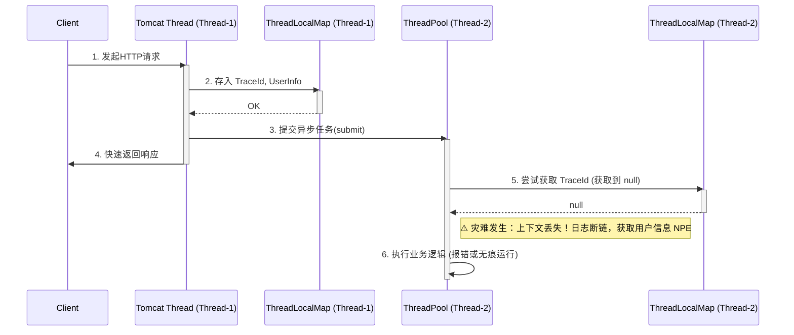
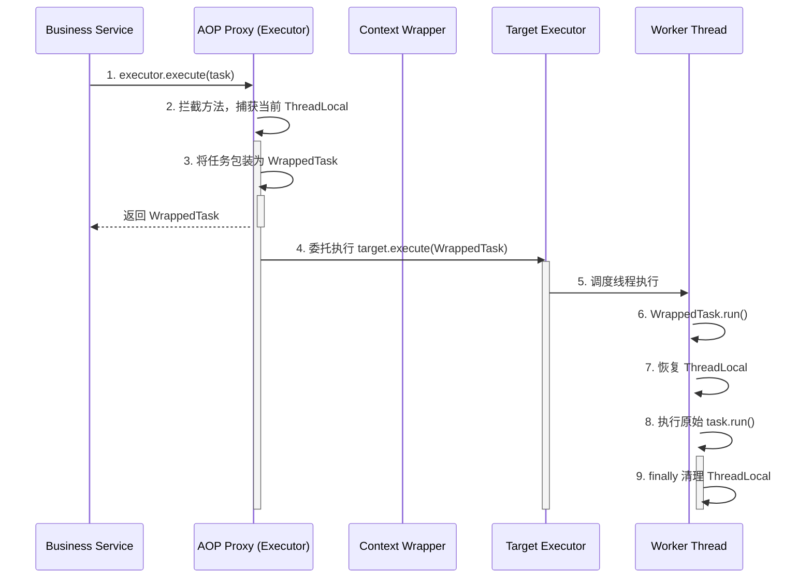

今天我们来聊一个几乎所有微服务开发者都踩过、并且大概率在生产环境里引发过血案的坑——异步线程池导致的上下文丢失问题。

不知道你有没有经历过这样的场景： 线上系统突然报警，某条核心链路的日志断层了，TraceId 查到一半神秘消失；或者业务抛出 `NullPointerException`，排查发现是因为在异步任务里调用 `UserContext.getCurrentUserId()` 拿到了 null；更可怕的是，某些依赖 `ThreadLocal` 的业务状态失效，导致异步后置操作出现数据不一致或逻辑错误。

很多同学的第一反应是：“这不就是多线程 `ThreadLocal` 没传过去吗？我在 `run()` 方法里手动 `set` 一下不就行了？”

如果你在团队里这么写代码，作为架构师，我会在 `Code Review` 时毫不犹豫地给你打回。业务代码里充斥着大量的上下文拷贝逻辑，不仅丑陋，而且极易遗漏，一旦漏掉一个，就是潜在的线上故障。

今天，我们就用架构师的思维模式，结合 Spring AOP 的底层黑科技，来彻底、优雅、无侵入地解决这个难题。拒绝到处复制粘贴，我们要的是一次配置，全局生效的工程化方案。

## 一、 案发现场：为什么上下文会凭空消失？ ##

在微服务架构中，为了提高接口响应速度，我们大量使用异步编程。无论是 Spring 的 `@Async`，还是自定义的 `ThreadPoolExecutor`，本质上都是把任务交给了另一个线程去执行。

而我们常用的上下文存储神器 `ThreadLocal`，其数据是绑定在当前线程的 `Thread` 对象上的。线程池里的线程和接收请求的 `Tomcat` 工作线程是两个完全不同的物理线程，数据自然无法互通。

### 核心痛点解析 ###

- 链路追踪中断：MDC（Mapped Diagnostic Context）底层基于 ThreadLocal，异步线程拿不到 TraceId，日志变成孤岛。
- 用户信息丢失：网关解析 Token 后存入 ThreadLocal，异步发邮件/短信时获取不到用户 ID。
- 业务状态失效：某些依赖 ThreadLocal 存储的业务状态或租户信息，在异步方法中无法获取，导致逻辑执行异常。

我们先用一张图来看看数据是怎么丢的：



## 二、 正文解析：从青铜到王者的演进之路 ##

解决这个问题，有很多种方法。我们来看看从初级开发到高级架构师，思路是如何演进的。

### 示例 1：我们的上下文对象定义 ###

为了方便后续演示，我们先定义一个简单的上下文工具类，模拟日常开发中的用户信息或 TraceId 存储。

```java
public class GlobalContextHolder {
    private static final ThreadLocal<String> TRACE_ID_HOLDER = new ThreadLocal<>();

    public static void setTraceId(String traceId) {
        TRACE_ID_HOLDER.set(traceId);
    }

    public static String getTraceId() {
        return TRACE_ID_HOLDER.get();
    }

    public static void clear() {
        TRACE_ID_HOLDER.remove();
    }
}
```

运行结果说明：这是一个基础的 ThreadLocal 封装，单线程下 `set` 和 `get` 工作正常，跨线程调用 `get` 会返回 `null`。

### 示例 2：青铜玩法 —— 手动传递（反面教材） ###

最直观的做法，是在提交任务前获取，在任务执行时设置。

```java
public void doBusiness() {
    // 主线程获取上下文
    String currentTraceId = GlobalContextHolder.getTraceId();
    
    executorService.submit(() -> {
        try {
            // 异步线程重新设置上下文
            GlobalContextHolder.setTraceId(currentTraceId);
            // 执行真正的业务逻辑
            log.info("异步任务执行中, TraceId: {}", GlobalContextHolder.getTraceId());
        } finally {
            // 必须清理，防止线程池复用导致内存泄漏或数据串位
            GlobalContextHolder.clear();
        }
    });
}
```

运行结果说明：异步线程成功打印出了主线程的 TraceId。 

> 架构师点评：代码极度冗余！如果系统里有 100 处异步调用，这段恶心的 try-finally 就要写 100 遍。违反了 DRY（Don’t Repeat Yourself）原则。

### 示例 3：白银玩法 —— Spring TaskDecorator ###

如果你使用的是 Spring 的 `@Async` 或者 ThreadPoolTaskExecutor，Spring 官方提供了一个非常优雅的扩展点：`TaskDecorator`。

```java
import org.springframework.core.task.TaskDecorator;

public class ContextCopyingDecorator implements TaskDecorator {
    @Override
    public Runnable decorate(Runnable runnable) {
        // 1. 在主线程（提交任务的线程）获取上下文
        String traceId = GlobalContextHolder.getTraceId();
        
        // 2. 返回一个新的 Runnable 包装器
        return () -> {
            try {
                // 3. 在子线程（执行任务的线程）设置上下文
                GlobalContextHolder.setTraceId(traceId);
                // 4. 执行实际的业务逻辑
                runnable.run();
            } finally {
                // 5. 务必清理
                GlobalContextHolder.clear();
            }
        };
    }
}

// 配置线程池
@Bean("asyncExecutor")
public ThreadPoolTaskExecutor asyncExecutor() {
    ThreadPoolTaskExecutor executor = new ThreadPoolTaskExecutor();
    executor.setTaskDecorator(new ContextCopyingDecorator());
    executor.initialize();
    return executor;
}
```

运行结果说明：使用 `@Async("asyncExecutor")` 注解的方法，自动具备了上下文传递能力。 

> 架构师点评：这是 Spring 生态内非常推荐的标准做法。但它的局限性在于：只适用于 Spring 的 ThreadPoolTaskExecutor，如果你用了原生的 `CompletableFuture.runAsync()` 或者第三方框架内部的线程池，它就无能为力了。

### 示例 4：黄金玩法 —— 静态代理包装 Executor ###

为了覆盖所有原生线程池，我们可以自己写一个包装类，代理 ExecutorService。

```java
import java.util.concurrent.Executor;

public class ContextAwareExecutor implements Executor {
    private final Executor delegate;

    public ContextAwareExecutor(Executor delegate) {
        this.delegate = delegate;
    }

    @Override
    public void execute(Runnable command) {
        // 捕获上下文
        String traceId = GlobalContextHolder.getTraceId();
        
        // 包装任务
        Runnable wrappedCommand = () -> {
            try {
                GlobalContextHolder.setTraceId(traceId);
                command.run();
            } finally {
                GlobalContextHolder.clear();
            }
        };
        
        // 委托给实际线程池执行
        delegate.execute(wrappedCommand);
    }
}
```

运行结果说明：将普通的 Executor 包装后，调用 `execute` 方法会自动传递上下文。 

> 架构师点评：通用性变强了，但依然需要业务开发人员在创建线程池时手动套一层包装，存在人为遗漏的风险。

### 示例 5：王者玩法 —— Spring AOP 动态代理拦截（底层黑科技） ###

如何做到真正的零侵入？这就需要祭出 Spring AOP 了。我们可以拦截所有返回类型为 Executor 的 Bean 方法，或者直接对容器中的 Executor Bean 进行后置处理（BeanPostProcessor），将其替换为我们的代理对象。

这里我们演示一种基于 AOP 切面拦截特定自定义注解 `@AsyncContext` 的高级玩法，适用于需要精细化控制的方法级上下文传递。

```java
import org.aspectj.lang.ProceedingJoinPoint;
import org.aspectj.lang.annotation.Around;
import org.aspectj.lang.annotation.Aspect;
import org.springframework.stereotype.Component;

@Aspect
@Component
public class AsyncContextAspect {

    @Around("@annotation(com.howell.annotation.AsyncContext)")
    public Object handleAsyncContext(ProceedingJoinPoint pjp) throws Throwable {
        // 1. 主线程：快照当前所有上下文
        String traceId = GlobalContextHolder.getTraceId();
        
        // 我们利用 AOP 改变参数中的 Runnable/Callable（假设方法参数里有任务）
        // 但更常见的是，这个切面直接包在 @Async 方法上
        
        // 如果是拦截 @Async 方法本身：
        // 此时已经在子线程了！所以这种方式不行。
        // 💡 重点：AOP 拦截 @Async 方法时，切面逻辑是在子线程执行的，为主时已晚！
        
        return pjp.proceed(); 
    }
}
```

⚠️ 踩坑警告：上面的思路是很多新手的误区。在 `@Async` 方法上加 AOP 切面，切面的执行实际已经处于异步线程中了，此时上下文已经丢失！
正确的 AOP 黑科技：拦截线程池的 `submit`/`execute` 方法。

```java
import org.aopalliance.intercept.MethodInterceptor;
import org.aopalliance.intercept.MethodInvocation;
import org.springframework.aop.framework.ProxyFactory;
import org.springframework.beans.BeansException;
import org.springframework.beans.factory.config.BeanPostProcessor;
import org.springframework.stereotype.Component;
import java.util.concurrent.Executor;

@Component
public class ExecutorBeanPostProcessor implements BeanPostProcessor {

    @Override
    public Object postProcessAfterInitialization(Object bean, String beanName) throws BeansException {
        // 拦截所有 Executor 类型的 Bean
        if (bean instanceof Executor) {
            ProxyFactory proxyFactory = new ProxyFactory(bean);
            proxyFactory.addAdvice(new MethodInterceptor() {
                @Override
                public Object invoke(MethodInvocation invocation) throws Throwable {
                    String methodName = invocation.getMethod().getName();
                    if ("execute".equals(methodName) || "submit".equals(methodName)) {
                        Object[] args = invocation.getArguments();
                        if (args[0] instanceof Runnable) {
                            Runnable originalTask = (Runnable) args[0];
                            String traceId = GlobalContextHolder.getTraceId();
                            args[0] = (Runnable) () -> {
                                try {
                                    GlobalContextHolder.setTraceId(traceId);
                                    originalTask.run();
                                } finally {
                                    GlobalContextHolder.clear();
                                }
                            };
                        } else if (args[0] instanceof java.util.concurrent.Callable) {
                            java.util.concurrent.Callable<?> originalTask = (java.util.concurrent.Callable<?>) args[0];
                            String traceId = GlobalContextHolder.getTraceId();
                            args[0] = (java.util.concurrent.Callable<Object>) () -> {
                                try {
                                    GlobalContextHolder.setTraceId(traceId);
                                    return originalTask.call();
                                } finally {
                                    GlobalContextHolder.clear();
                                }
                            };
                        }
                    }
                    return invocation.proceed();
                }
            });
            return proxyFactory.getProxy();
        }
        return bean;
    }
}
```

运行结果说明：项目启动后，容器中所有的 Executor 实例都会被自动替换为 AOP 代理。业务代码无需做任何修改，直接调用 executor.execute() 即可自动实现上下文传递。 

> 架构师点评：这才是真正的无侵入设计！利用 Spring 的 BeanPostProcessor 和 AOP，在框架底层偷梁换柱。业务开发者完全无感知，极大地降低了心智负担。

### 示例 6：结合 MDC 日志链路追踪的生产级实战 ###

在生产环境中，最常用的就是 SLF4J 的 MDC。我们将上述逻辑封装为生产可用的 MDC 传递器。

```java
import org.slf4j.MDC;
import org.springframework.core.task.TaskDecorator;
import java.util.Map;

public class MdcTaskDecorator implements TaskDecorator {
    @Override
    public Runnable decorate(Runnable runnable) {
        // 抓取主线程的 MDC 上下文
        Map<String, String> contextMap = MDC.getCopyOfContextMap();
        
        return () -> {
            try {
                // 恢复到子线程
                if (contextMap != null) {
                    MDC.setContextMap(contextMap);
                }
                runnable.run();
            } finally {
                // 必须清理子线程的 MDC
                MDC.clear();
            }
        };
    }
}
```

运行结果说明：配置此 Decorator 后，日志中的 `%X{traceId}` 在主线程和异步线程中输出完全一致，`ELK` 收集日志后可以完美串联整条链路。

为了让你更直观地理解 AOP 代理拦截的过程，我们来看这个底层交互逻辑图：



## 三、 思维拓展：架构层面的深思与排坑 ##

很多同学看完上面的代码，可能会觉得：“我已经掌握了异步传参的精髓。” 别急，真正的生产环境远比这复杂。

### 常见误区：InheritableThreadLocal 的致命陷阱 ###

面试中经常会问：“怎么在父子线程间传递数据？” 很多人会脱口而出 InheritableThreadLocal (ITL)。 *千万别在线程池环境使用 ITL！*  ITL 的原理是在创建子线程（`new Thread()`）时，将父线程的 ThreadLocal 拷贝过来。但在微服务中，我们使用的是线程池。线程池的核心机制是线程复用。 如果用 ITL，只有在线程池刚创建工作线程时会拷贝一次，之后该线程处理其他请求时，内部的上下文永远是第一次创建它的那个请求的上下文。这会导致严重的数据串位，A 用户的请求拿到了 B 用户的 Token，这在生产上是绝对的 P0 级安全事故！

### 业界标杆对比：阿里开源的 TransmittableThreadLocal (TTL) ###

我们上面手写的 AOP 拦截方案虽然优雅，但需要我们自己维护包装逻辑。如果系统中有成百上千种不同的上下文（MDC、SecurityContext、TraceContext 等），代码会变得臃肿。

阿里巴巴开源的 TransmittableThreadLocal (TTL) 是解决这个问题的工业级标准方案。 它的核心思想和我们讲的 AOP 类似，但它做得更彻底：通过 Java Agent 技术，在类加载时直接修改 `java.util.concurrent` 包下线程池类的字节码（ASM 技术），强制注入上下文包装逻辑。

- 优点：真正的终极无侵入，连 BeanPostProcessor 都不用写，直接挂载 agent 即可。
- 缺点：引入了外部依赖，且 Java Agent 级别的字节码修改在排查底层 Bug 时增加了难度。

### 架构师思维：基础设施与业务逻辑的解耦 ###

从手动传递到 AOP 代理，再到 Java Agent，这背后体现的是架构演进的核心思想：将非功能性需求（如*链路追踪*、*上下文传递*）从业务代码中剥离，下沉到基础设施层。  业务开发人员的职责应该是专注实现业务逻辑，他们不需要也不应该关心当前是在哪个线程运行、MDC 怎么传。通过框架底层的黑科技兜底，我们才能构建出高容错、易扩展的微服务架构。

> 风险提示：使用 BeanPostProcessor 代理 Executor 时需注意，如果目标类是 final 的，或者存在内部方法自调用，AOP 代理可能会失效。这也是为什么最终推荐使用 TTL（Java Agent 字节码增强）的原因，它能从更底层绕过这些代理局限。

### 事务上下文的特殊性警告 ###

虽然本文方案可以传递普通的上下文，但千万不要试图直接拷贝 Spring 事务的上下文（如 ConnectionHolder）到异步线程。数据库连接非线程安全，异步操作应作为独立事务，或采用最终一致性方案（如本地消息表、Seata 等）。

### 邪修版本架构设计（纯属整活，切勿模仿） ###

有时候为了追求极致的“无侵入”，有些“邪修”架构师会想出一些丧心病狂的方案： 邪修方案：利用 Java 反射，在系统启动时强行修改 java.lang.Thread 类的底层结构，或者通过反射拿到 ThreadPoolExecutor 内部的 Worker 集合，强行在 `runWorker` 方法执行前后注入钩子。 后果：这种做法严重破坏了 JVM 的安全机制，在 JDK 9 引入模块化（JPMS）后，强行反射 JDK 内部类会直接抛出 `InaccessibleObjectException` 导致系统崩溃。技术可以极客，但工程必须严谨。

## 四、 总结（精炼 Takeaway） ##

在微服务高并发场景下，异步线程池的上下文传递是一个绕不开的坎。今天我们抽丝剥茧，从底层原理到工程实践，彻底打通了这层壁垒。

核心结论与建议：

- 🚫 绝对禁止在线程池环境下使用 InheritableThreadLocal，一定会导致数据串位和内存泄漏。
- 💡 Spring 体系首选：如果你只用 Spring 提供的线程池，老老实实实现 TaskDecorator，简单稳定。
- 🚀 全局无侵入方案：利用 Spring BeanPostProcessor 结合 AOP 代理，拦截容器内所有 Executor，实现底层静默包装。
- 👑 终极工业级方案：对于复杂的微服务集群，强烈建议引入阿里的 TransmittableThreadLocal (TTL)，配合 Java Agent，一劳永逸解决所有跨线程上下文丢失问题。
- ⚠️ 底线原则：无论使用哪种方案，在子线程执行完毕后，务必在 finally 块中清理 ThreadLocal（调用 `remove()`） ，否则在高并发下极易引发 OOM 或数据污染。

> 技术没有银弹，但架构师的价值就在于：用最底层的认知，写出最优雅的代码，解决最痛点的问题。
s
