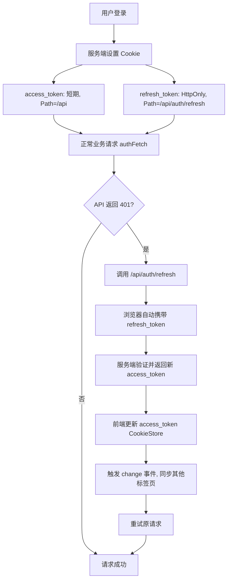

## 1. 概述

本文档旨在介绍一种现代化、安全的客户端令牌管理方案。我们将结合三个核心要素：

- **JWT（JSON Web Token）**：用于无状态身份验证的令牌标准。
- **CookieStore API**：新一代浏览器 Cookie 操作接口，基于 Promise 并提供变更事件。
- **HTTP 安全机制**：`HttpOnly`、`Secure`、`SameSite`、`Path` 等 Cookie 属性。

你将了解到如何利用这些技术构建一个既方便前端使用，又能抵御 XSS 和 CSRF 攻击的鉴权系统。


## 2. 核心概念

### 2.1 双令牌模式

| 令牌类型 | 生命周期 | 主要用途 | 暴露风险 |
| :--- | :--- | :--- | :--- |
| **Access Token** | 短期（如 15 分钟） | 访问业务 API，携带用户身份 | 较高（需在前端使用） |
| **Refresh Token** | 长期（如 7 天） | 用于换取新的 Access Token | 极高（一旦泄露，可长期冒充用户） |

> **原则**：Refresh Token 必须受到最严格的保护，绝不能被 JavaScript 读取。


### 2.2 Cookie 属性与安全性

| 属性 | 作用 | 推荐值 |
| :--- | :--- | :--- |
| **HttpOnly** | 禁止 JavaScript 访问（`document.cookie` / `CookieStore` 不可见） | Refresh Token 必须使用 |
| **Secure** | 仅通过 HTTPS 传输 | 生产环境必须使用 |
| **SameSite** | 控制跨站请求是否携带 Cookie | `Strict` 或 `Lax`（防 CSRF） |
| **Path** | 限制 Cookie 发送的路径范围 | 精确控制，减少不必要传输 |


## 3. CookieStore API 快速入门

`CookieStore` 是浏览器原生的异步 Cookie 操作接口，替代了繁琐的 `document.cookie` 字符串操作。

### 3.1 前置条件

- 必须在**安全上下文**中使用（HTTPS 或 `localhost`）。
- 对 `HttpOnly` Cookie **不可见**。

### 3.2 基本操作

```ts
    // 写入 Cookie
    await cookieStore.set({
      name: 'theme',
      value: 'dark',
      expires: Date.now() + 30 * 24 * 60 * 60 * 1000, // 毫秒时间戳
      path: '/',
      secure: true,
      sameSite: 'lax'
    });

    // 读取单个 Cookie
    const cookie = await cookieStore.get('theme');
    console.log(cookie?.value); // 'dark'

    // 读取所有 Cookie
    const allCookies = await cookieStore.getAll();

    // 删除 Cookie
    await cookieStore.delete('theme');
```

### 3.3 监听变更事件

```ts
    cookieStore.addEventListener('change', (event) => {
      for (const cookie of event.changed) {
        console.log(`Cookie ${cookie.name} 被修改`);
      }
      for (const cookie of event.deleted) {
        console.log(`Cookie ${cookie.name} 被删除`);
      }
    });
```

该事件在 Service Worker 中同样可用，是跨标签页同步令牌的理想方式。

## 4. 与 Fetch 及 JWT 结合

### 4.1 基础请求封装

将 Access Token 存储在**非 HttpOnly** Cookie（或内存）中，然后自动附加到 `Authorization` 头。

```ts
    // authFetch.js
    export async function authFetch(url, options = {}) {
      const headers = new Headers(options.headers);

      if (!headers.has('Authorization')) {
        const token = await getAccessToken();
        if (token) {
          headers.set('Authorization', `Bearer ${token}`);
        }
      }

      return fetch(url, { ...options, headers });
    }

    async function getAccessToken() {
      if ('cookieStore' in window) {
        const cookie = await cookieStore.get('access_token');
        return cookie?.value ?? null;
      }
      // 降级方案
      const match = document.cookie.match(/(?:^|; )access_token=([^;]*)/);
      return match ? decodeURIComponent(match[1]) : null;
    }
```

### 4.2 自动刷新过期令牌

当收到 401 响应时，自动调用刷新接口获取新令牌，重试原请求。


```ts
    async function authFetch(url, options = {}) {
      let res = await doFetch(url, options);

      if (res.status === 401) {
        const newToken = await refreshAccessToken();
        if (newToken) {
          res = await doFetch(url, options, newToken);
        }
      }
      return res;
    }

    async function refreshAccessToken() {
      const res = await fetch('/api/auth/refresh', { method: 'POST' });
      if (res.ok) {
        const { access_token, expires_in } = await res.json();
        // 更新 Access Token
        if ('cookieStore' in window) {
          await cookieStore.set({
            name: 'access_token',
            value: access_token,
            expires: Date.now() + expires_in * 1000,
            secure: true,
            sameSite: 'strict'
          });
        }
        return access_token;
      }
      // 刷新失败，引导登录
      window.location.href = '/login';
      return null;
    }
```

### 4.3 跨标签页令牌同步

利用 `cookieStore.change` 事件，一个标签页刷新令牌后，其他标签页可立即感知。

```ts
    cookieStore.addEventListener('change', (event) => {
      for (const cookie of event.changed) {
        if (cookie.name === 'access_token') {
          // 通知应用令牌已更新
          window.dispatchEvent(new CustomEvent('token-updated', { detail: cookie.value }));
        }
      }
    });
```


## 5. Refresh Token 为何要“精确发送”？

### 5.1 默认 Cookie 发送行为的不足

如果不加限制，一个设置了 `path=/` 的 Cookie 会在**该域下所有请求**中发送。这意味着：

- 浏览器请求 `/api/users`、`/api/posts` 等业务接口时，都会**自动带上** Refresh Token。
- 这增加了 Refresh Token 在网络中被截获的机会（尽管 HTTPS 已加密，但减少暴露面仍是安全原则）。

### 5.2 解决方案：使用 `Path` 属性

将 Refresh Token 的 **`Path`** 设置为**刷新令牌的专属端点**。

**服务端设置示例（Node.js + Express）**：


```ts
    // 登录成功时
    res.cookie('refresh_token', refreshToken, {
      httpOnly: true,
      secure: true,
      sameSite: 'strict',
      path: '/api/auth/refresh',   // 仅此路径及子路径会携带此 Cookie
      maxAge: 7 * 24 * 60 * 60 * 1000
    });
```

**效果**：

| 请求路径 | 是否携带 Refresh Token |
| :--- | :--- |
| `/api/auth/refresh` | ✅ 自动携带 |
| `/api/users` | ❌ 不携带 |
| `/home` | ❌ 不携带 |

这样，Refresh Token 只在它**唯一需要出现的请求**中发送，最大程度减少了传输次数。

### 5.3 为什么不用 localStorage 或内存存储 Refresh Token？

| 存储方式 | XSS 攻击读取风险 | CSRF 风险 | 持久化 |
| :--- | :--- | :--- | :--- |
| **HttpOnly Cookie（Path 限制）** | ❌ 完全不可读 | 需配合 SameSite/CSRF Token | 可设置过期，天然持久 |
| **JavaScript 内存** | ✅ 可被 XSS 直接读取 | 不受 CSRF 影响 | 标签页关闭即丢失 |
| **localStorage** | ✅ 可被 XSS 直接读取 | 不受 CSRF 影响 | 持久存在，风险最大 |

结论：**HttpOnly Cookie + 精确 Path** 是目前唯一能同时抵抗 XSS 和 CSRF 的长期令牌存储方案。


## 6. 完整工作流总结



## 7. 兼容性与渐进增强

- `CookieStore` API 自 2025 年起已覆盖 Chrome、Firefox、Safari 等主流浏览器。
- 生产环境建议封装统一的 Cookie 工具函数，在不支持 `CookieStore` 时降级使用 `document.cookie`。
- 对于 Refresh Token 的 `path` 控制，完全依赖服务端设置，与客户端 API 无关，兼容所有浏览器。

```ts
    // 兼容降级示例
    export async function getCookie(name) {
      if ('cookieStore' in window) {
        const cookie = await cookieStore.get(name);
        return cookie?.value ?? null;
      }
      const match = document.cookie.match(new RegExp(`(?:^|; )${name}=([^;]*)`));
      return match ? decodeURIComponent(match[1]) : null;
    }
```

## 8. 总结

通过本文档，你学到了一个现代、安全的 Web 令牌管理方案：

- 使用 **双令牌** 分离短期访问与长期授权。
- 使用 **CookieStore** 异步操作非 HttpOnly 的 Access Token，并监听变更。
- 在 `fetch` 封装中自动附加令牌并处理过期刷新。
- 将 Refresh Token 放在 **HttpOnly + Secure + SameSite=Strict + Path=/api/auth/refresh** 的 Cookie 中，实现最严格的安全保护。

这样既保证了开发体验（Promise 风格、事件驱动），又遵循了纵深防御的安全原则。

## 一、传统Cookie API的三宗罪 ##

在Web开发中操作Cookie，开发者们已经忍受了二十多年的折磨。`document.cookie` 这个API的设计堪称"反人类"的典范：

第一，*API 风格过于怪异*。传统 Cookie 读写共用一个属性，读是取值、写是拼接字符串赋值。这种设计违背了最基本的编程直觉：读取用属性访问，设置也用属性赋值，但两者行为完全不同。读取返回所有cookie，设置却只会新增/修改一个。这种不对称性让无数新手开发者踩坑。

第二，*需要手动转义数据*。`document.cookie` 任何特殊字符都必须开发者自己处理转义，一旦疏忽就会出现解析异常、值截断等问题，增加了不必要的心智负担。

第三，*可选项难记、易写错*。`domain`、`expires`、`secure`等配置项需要拼接在字符串里，格式严格、记忆成本高，新手很容易因为格式不对导致 Cookie 设置不生效。

这三点共同导致实际项目里几乎没人直接裸写 `document.cookie`，都会选择封装工具库。而 `cookieStore` 的出现，本意就是解决这些痛点，让原生 API 达到工具库级别的易用性。

## 二、cookieStore 能否解决以上问题？ ##

`cookieStore` 是近年来提出的一个新 API，旨在用现代、直观的方式操作 Cookie。它提供了类似于 localStorage 的 set、get、delete 方法，并支持通过 change 事件监听 Cookie 的变化。那么，它是否解决了传统 API 的三大弊病呢？

### API 风格：确实易用了 ###

cookieStore 的 API 设计非常符合现代开发者的习惯：

```javascript
// 设置 cookie
await cookieStore.set('foo', "bar", { expires: Date.now() + 3600_000, path: '/' });

 // 读取 cookie
const cookie = await cookieStore.get('foo');
console.log(cookie?.value); // "bar"

 // 删除 cookie
await cookieStore.delete('foo');
```

不再需要拼接字符串，也不再需要手动解析，一切看起来都那么自然。从 API 风格来看，cookieStore 无疑是一个巨大的进步。

### 转义：仍需手动处理 ###

遗憾的是，cookieStore 并没有内置数据转义的能力。所以开发者仍然需要手动调用 `encodeURIComponent`。同时，cookieStore 会主动检查字符串中是否包含特殊字符（如分号、逗号、空格等），如果存在则会抛出错误。这意味着我们仍然逃不掉序列化和转义的工作。

```javascript
await cookieStore.set('userName', encodeURIComponent(userName));
```

读取时也要对应地解码：

```javascript
const cookie = await cookieStore.get('userName');
const userName = cookie ? decodeURIComponent(cookie.value) : null;
```

所以，在数据转义这个场景下，cookieStore 并没有带来本质的改变，只是将错误从“静默失败”变成了“主动抛出”，提醒开发者需要正确处理。

### 可选项：从拼字符串变成了拼对象 ###

`cookieStore.set` 的第三个参数是一个选项对象，包含了 `expires`（毫秒时间戳或 Date 对象）、`domain`、`path`、`sameSite`、`secure` 等属性。相比传统 API 的手工拼字符串，这无疑清晰了很多。

```javascript
await cookieStore.set('session', "token123", {
  expires: Date.now() + 7 * 24 * 60 * 60 * 1000, // 7天后过期
  path: '/'
});
```

不过，你仍然需要记住有哪些选项可用，以及它们的含义。好在如今 TypeScript 的普及和 AI 补全工具的辅助，这个问题已经不那么严重了——当你输入 `cookieStore.set()` 时，编辑器会自动提示可用的选项，大大降低了记忆负担。

整体来看，cookieStore 只解决了传统 API 风格怪异的问题，序列化和配置项的痛点并没有被彻底消灭。

## 三、cookieStore 带来了哪些新能力？ ##

除了写法优化，cookieStore 也确实提供了传统 API 不具备的新能力。

最典型的就是*获取更完整的 Cookie 元信息*。传统 API 只能根据键拿到值，而 cookieStore 可以直接读到过期时间、路径、域、安全配置等底层信息，对需要监控、管理 Cookie 的场景更友好。

但这项能力也带来限制：*cookieStore 只能在 HTTPS 环境下使用*，本地开发如果用 HTTP 协议，会直接无法调用，这对部分开发场景不够友好。

## 四、异步设计的真相：不是为了性能 ##

很多开发者看到cookieStore使用async/await，会产生两个误解：

### 误解1："异步意味着不会阻塞主线程？" ###

事实：传统API本来就不会卡顿。

现代浏览器的 I/O 机制并没有那么脆弱。当我们在调用 `document.cookie = ...` 时，浏览器将写入操作提交给内存缓冲区后，JS 引擎就会立刻返回并继续执行后续代码，并不会等待数据真正落盘到磁盘。

因此，即便磁盘写入速度极慢，传统同步 API 也不会造成明显的 UI 卡顿。

所以"同步API导致卡顿"是个伪命题。

### 误解2："异步API能确保写入完成？" ###

事实：cookieStore同样不保证持久化。

既然同步 API 已经很快，那么 cookieStore 的异步设计是不是为了等待磁盘写入完成，从而让开发者知道 Cookie 真正持久化了呢？答案也是否定的。`cookieStore.set` 返回的 Promise 同样在 Cookie 被存入内存后就 resolve 了，并不等待磁盘 I/O。

```javascript
await cookieStore.set({ name: "critical", value: "data" });
// 这行执行时，cookie可能还没真正写到磁盘
// 如果此时断电，数据可能丢失
```

无论是传统 API 还是 cookieStore，浏览器写入 Cookie 时都是先写入内存就立即返回，并不会等待磁盘持久化完成。所以传统同步 API 并不会造成 JS 阻塞，cookieStore 的异步也无法真正响应 “磁盘写入完成”。

官方把它设计成异步，主要目的是兼容 Service Worker 场景并为后续权限校验预留机制，而非提升性能或可靠性。

这就导致一个尴尬结果：cookieStore 的异步设计*没有带来实际能力提升*，反而是掣肘。

## 总结：cookieStore 到底值不值得用？ ##

综合以上所有特点，我的建议是：

*cookieStore 更适合偏底层的架构、框架、工具库开发者使用*，它在元信息获取、标准化 API 上有优势，适合做底层封装。

不建议业务开发人员直接使用 cookieStore。它没有完全摆脱手动序列化、配置繁琐的问题，异步写法又对业务代码有侵入性，同时还受 HTTPS 限制。

对业务开发而言，最优选择依旧是基于 `document.cookie` 的成熟封装库，简单、稳定、无环境限制、API 更友好，远比直接使用原生 cookieStore 更高效。

cookieStore 是 Web 标准化的一次有益尝试，但在易用性层面，它尚未达到能完美替代“工具库”的高度。在未来的 Web 开发中，它或许更适合作为底层基建的基石，而非业务代码的直接工具。
