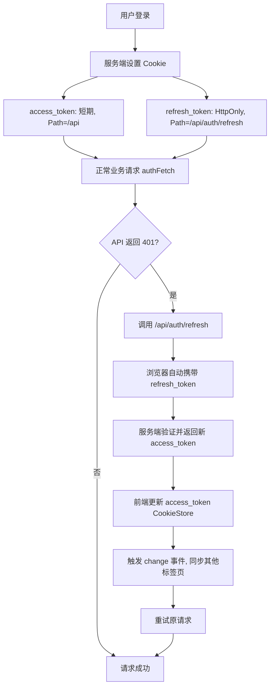

## 1. 概述

本文档旨在介绍一种现代化、安全的客户端令牌管理方案。我们将结合三个核心要素：

- **JWT（JSON Web Token）**：用于无状态身份验证的令牌标准。
- **CookieStore API**：新一代浏览器 Cookie 操作接口，基于 Promise 并提供变更事件。
- **HTTP 安全机制**：`HttpOnly`、`Secure`、`SameSite`、`Path` 等 Cookie 属性。

你将了解到如何利用这些技术构建一个既方便前端使用，又能抵御 XSS 和 CSRF 攻击的鉴权系统。


## 2. 核心概念

### 2.1 双令牌模式

| 令牌类型 | 生命周期 | 主要用途 | 暴露风险 |
| :--- | :--- | :--- | :--- |
| **Access Token** | 短期（如 15 分钟） | 访问业务 API，携带用户身份 | 较高（需在前端使用） |
| **Refresh Token** | 长期（如 7 天） | 用于换取新的 Access Token | 极高（一旦泄露，可长期冒充用户） |

> **原则**：Refresh Token 必须受到最严格的保护，绝不能被 JavaScript 读取。


### 2.2 Cookie 属性与安全性

| 属性 | 作用 | 推荐值 |
| :--- | :--- | :--- |
| **HttpOnly** | 禁止 JavaScript 访问（`document.cookie` / `CookieStore` 不可见） | Refresh Token 必须使用 |
| **Secure** | 仅通过 HTTPS 传输 | 生产环境必须使用 |
| **SameSite** | 控制跨站请求是否携带 Cookie | `Strict` 或 `Lax`（防 CSRF） |
| **Path** | 限制 Cookie 发送的路径范围 | 精确控制，减少不必要传输 |


## 3. CookieStore API 快速入门

`CookieStore` 是浏览器原生的异步 Cookie 操作接口，替代了繁琐的 `document.cookie` 字符串操作。

### 3.1 前置条件

- 必须在**安全上下文**中使用（HTTPS 或 `localhost`）。
- 对 `HttpOnly` Cookie **不可见**。

### 3.2 基本操作

```ts
    // 写入 Cookie
    await cookieStore.set({
      name: 'theme',
      value: 'dark',
      expires: Date.now() + 30 * 24 * 60 * 60 * 1000, // 毫秒时间戳
      path: '/',
      secure: true,
      sameSite: 'lax'
    });

    // 读取单个 Cookie
    const cookie = await cookieStore.get('theme');
    console.log(cookie?.value); // 'dark'

    // 读取所有 Cookie
    const allCookies = await cookieStore.getAll();

    // 删除 Cookie
    await cookieStore.delete('theme');
```

### 3.3 监听变更事件

```ts
    cookieStore.addEventListener('change', (event) => {
      for (const cookie of event.changed) {
        console.log(`Cookie ${cookie.name} 被修改`);
      }
      for (const cookie of event.deleted) {
        console.log(`Cookie ${cookie.name} 被删除`);
      }
    });
```

该事件在 Service Worker 中同样可用，是跨标签页同步令牌的理想方式。

## 4. 与 Fetch 及 JWT 结合

### 4.1 基础请求封装

将 Access Token 存储在**非 HttpOnly** Cookie（或内存）中，然后自动附加到 `Authorization` 头。

```ts
    // authFetch.js
    export async function authFetch(url, options = {}) {
      const headers = new Headers(options.headers);

      if (!headers.has('Authorization')) {
        const token = await getAccessToken();
        if (token) {
          headers.set('Authorization', `Bearer ${token}`);
        }
      }

      return fetch(url, { ...options, headers });
    }

    async function getAccessToken() {
      if ('cookieStore' in window) {
        const cookie = await cookieStore.get('access_token');
        return cookie?.value ?? null;
      }
      // 降级方案
      const match = document.cookie.match(/(?:^|; )access_token=([^;]*)/);
      return match ? decodeURIComponent(match[1]) : null;
    }
```

### 4.2 自动刷新过期令牌

当收到 401 响应时，自动调用刷新接口获取新令牌，重试原请求。


```ts
    async function authFetch(url, options = {}) {
      let res = await doFetch(url, options);

      if (res.status === 401) {
        const newToken = await refreshAccessToken();
        if (newToken) {
          res = await doFetch(url, options, newToken);
        }
      }
      return res;
    }

    async function refreshAccessToken() {
      const res = await fetch('/api/auth/refresh', { method: 'POST' });
      if (res.ok) {
        const { access_token, expires_in } = await res.json();
        // 更新 Access Token
        if ('cookieStore' in window) {
          await cookieStore.set({
            name: 'access_token',
            value: access_token,
            expires: Date.now() + expires_in * 1000,
            secure: true,
            sameSite: 'strict'
          });
        }
        return access_token;
      }
      // 刷新失败，引导登录
      window.location.href = '/login';
      return null;
    }
```

### 4.3 跨标签页令牌同步

利用 `cookieStore.change` 事件，一个标签页刷新令牌后，其他标签页可立即感知。

```ts
    cookieStore.addEventListener('change', (event) => {
      for (const cookie of event.changed) {
        if (cookie.name === 'access_token') {
          // 通知应用令牌已更新
          window.dispatchEvent(new CustomEvent('token-updated', { detail: cookie.value }));
        }
      }
    });
```


## 5. Refresh Token 为何要“精确发送”？

### 5.1 默认 Cookie 发送行为的不足

如果不加限制，一个设置了 `path=/` 的 Cookie 会在**该域下所有请求**中发送。这意味着：

- 浏览器请求 `/api/users`、`/api/posts` 等业务接口时，都会**自动带上** Refresh Token。
- 这增加了 Refresh Token 在网络中被截获的机会（尽管 HTTPS 已加密，但减少暴露面仍是安全原则）。

### 5.2 解决方案：使用 `Path` 属性

将 Refresh Token 的 **`Path`** 设置为**刷新令牌的专属端点**。

**服务端设置示例（Node.js + Express）**：


```ts
    // 登录成功时
    res.cookie('refresh_token', refreshToken, {
      httpOnly: true,
      secure: true,
      sameSite: 'strict',
      path: '/api/auth/refresh',   // 仅此路径及子路径会携带此 Cookie
      maxAge: 7 * 24 * 60 * 60 * 1000
    });
```

**效果**：

| 请求路径 | 是否携带 Refresh Token |
| :--- | :--- |
| `/api/auth/refresh` | ✅ 自动携带 |
| `/api/users` | ❌ 不携带 |
| `/home` | ❌ 不携带 |

这样，Refresh Token 只在它**唯一需要出现的请求**中发送，最大程度减少了传输次数。

### 5.3 为什么不用 localStorage 或内存存储 Refresh Token？

| 存储方式 | XSS 攻击读取风险 | CSRF 风险 | 持久化 |
| :--- | :--- | :--- | :--- |
| **HttpOnly Cookie（Path 限制）** | ❌ 完全不可读 | 需配合 SameSite/CSRF Token | 可设置过期，天然持久 |
| **JavaScript 内存** | ✅ 可被 XSS 直接读取 | 不受 CSRF 影响 | 标签页关闭即丢失 |
| **localStorage** | ✅ 可被 XSS 直接读取 | 不受 CSRF 影响 | 持久存在，风险最大 |

结论：**HttpOnly Cookie + 精确 Path** 是目前唯一能同时抵抗 XSS 和 CSRF 的长期令牌存储方案。


## 6. 完整工作流总结



## 7. 兼容性与渐进增强

- `CookieStore` API 自 2025 年起已覆盖 Chrome、Firefox、Safari 等主流浏览器。
- 生产环境建议封装统一的 Cookie 工具函数，在不支持 `CookieStore` 时降级使用 `document.cookie`。
- 对于 Refresh Token 的 `path` 控制，完全依赖服务端设置，与客户端 API 无关，兼容所有浏览器。

```ts
    // 兼容降级示例
    export async function getCookie(name) {
      if ('cookieStore' in window) {
        const cookie = await cookieStore.get(name);
        return cookie?.value ?? null;
      }
      const match = document.cookie.match(new RegExp(`(?:^|; )${name}=([^;]*)`));
      return match ? decodeURIComponent(match[1]) : null;
    }
```

## 8. 总结

通过本文档，你学到了一个现代、安全的 Web 令牌管理方案：

- 使用 **双令牌** 分离短期访问与长期授权。
- 使用 **CookieStore** 异步操作非 HttpOnly 的 Access Token，并监听变更。
- 在 `fetch` 封装中自动附加令牌并处理过期刷新。
- 将 Refresh Token 放在 **HttpOnly + Secure + SameSite=Strict + Path=/api/auth/refresh** 的 Cookie 中，实现最严格的安全保护。

这样既保证了开发体验（Promise 风格、事件驱动），又遵循了纵深防御的安全原则。

