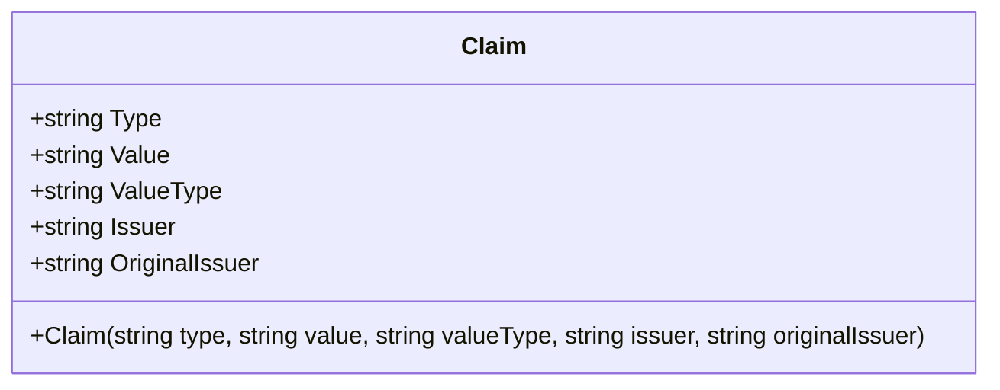

## 前言 ##

身份验证（Authentication）与授权（Authorization）是每一个 Web 应用的安全基础。自 .NET Framework 4.5 起，微软将 WIF（Windows Identity Foundation）全面整合进 .NET，引入了以 Claim 为核心的现代身份体系。时至 .NET 10，这套体系已相当成熟，是构建精细化权限控制不可绕开的基石。

本文从最基础的概念出发，逐层深入，覆盖核心类型、请求管道流转、Claims 映射、动态转换、 策略 授权等完整链路，并在每个环节给出工程实践建议。

## 一、什么是 Claim？ ##

### 核心概念 ###

Claim 是由签发方（Issuer） 对某个实体（Subject） 所作的一种声明，用以描述该实体的某个属性或特征。它描述"主体是什么"，而不是"主体能做什么"。

现实世界中最直观的类比是身份证：

```txt
          签发方（公安局）            实体（张三）
               │
               ▼
         签发一张身份证
         ┌─────────────────────────────────┐
         │  姓名   = 张三                  │ ← Claim(Type="name",    Value="张三")
         │  出生日期 = 1994-05-01          │ ← Claim(Type="dob",     Value="1994-05-01")
         │  国籍   = 中国                  │ ← Claim(Type="country", Value="CN")
         │  签发机关 = 上海市公安局        │ ← Issuer = "上海市公安局"
         └─────────────────────────────────┘
```

酒吧场景进一步说明了 Claim 与授权的关系：服务员读取你身份证上的"出生日期"这一 Claim，根据"年龄 ≥ 18 岁"的策略（Policy）决定是否允许购酒。这就是 Claim 驱动授权的完整流程。

### Claim 类的关键属性 ###




```C#
// 示例
const string issuer = "https://auth.mycompany.com";
var claim = new Claim(
    ClaimTypes.Email,
    "alice@example.com",
    ClaimValueTypes.String,
    issuer
);
```

### 为什么 Issuer 很重要？ ###

同一个 Claim 类型，来自不同来源的可信度截然不同。应用应该只信任受信任签发方的 Claim：

```C#
// ❌ 危险：任何人声称自己是 admin 都被信任
bool isAdmin = context.User.HasClaim("role", "admin");

// ✅ 安全：只信任来自指定签发方的 Claim
bool isAdmin = context.User.HasClaim(c =>
    c.Type   == "role" &&
    c.Value  == "admin" &&
    c.Issuer == "https://auth.mycompany.com");
```

### 标准 ClaimTypes 速查 ###

System.Security.Claims.ClaimTypes 预定义了大量标准类型，均以 WS-Federation（Web Services Federation）风格的 URI 表示：

| 常量名 | 语义 | 对应 OIDC（OpenID Connect）短名称 |
| :--- | :--- | :--- |
|  `ClaimTypes.NameIdentifier`  | 唯一用户 ID | `sub` |
|  `ClaimTypes.Name`  | 显示名称 | `name` |
|  `ClaimTypes.Email`  | 电子邮件 | `email` |
|  `ClaimTypes.Role`  | 角色 | `role` / `roles` |
|  `ClaimTypes.GivenName`  | 名 | `given_name` |
|  `ClaimTypes.Surname`  | 姓 | `family_name` |
|  `ClaimTypes.DateOfBirth`  | 出生日期 | `birthdate` |
|  `ClaimTypes.MobilePhone`  | 手机号 | `phone_number` |

## 二、三层核心 架构 ##

.NET 的 Claim 体系是一个三层嵌套结构：

```txt
┌─────────────────────────────────────────────────────┐
│                  ClaimsPrincipal                    │
│           （安全主体，代表"这个人"）                │
│                                                     │
│  ┌─────────────────────┐  ┌─────────────────────┐   │
│  │    ClaimsIdentity   │  │    ClaimsIdentity   │   │
│  │  AuthType="Cookies" │  │  AuthType="Bearer"  │   │
│  │  （用户身份证）     │  │  （API令牌身份）    │   │
│  │  ┌───────────────┐  │  │  ┌───────────────┐  │   │
│  │  │ Claim(name)   │  │  │  │ Claim(sub)    │  │   │
│  │  │ Claim(email)  │  │  │  │ Claim(scope)  │  │   │
│  │  │ Claim(role)   │  │  │  └───────────────┘  │   │
│  │  │ Claim(role)   │  │  └─────────────────────┘   │
│  │  └───────────────┘  │                            │
│  └─────────────────────┘                            │
└─────────────────────────────────────────────────────┘
```

### ClaimsIdentity：身份证件 ###

ClaimsIdentity 是 claims-based identity 的具体实现，类比一本护照，护照上的每一项信息就是一个 Claim。

AuthenticationType 是最关键也最容易被忽视的属性。

它有两个作用：

作用一：决定 IsAuthenticated 的值。 源码实现就是一行判断：

```cs
public virtual bool IsAuthenticated => !string.IsNullOrEmpty(AuthenticationType);
```

```cs
// ❌ 常见 Bug：没传 AuthenticationType → IsAuthenticated = false
//    [Authorize] 会直接拒绝，表现为莫名其妙的 401
var identity = new ClaimsIdentity(claims);
Console.WriteLine(identity.IsAuthenticated); // False

// ✅ 任何非空字符串 → IsAuthenticated = true
var identity = new ClaimsIdentity(claims, "Cookies");
Console.WriteLine(identity.IsAuthenticated); // True
```

作用二：标识身份的来源方案。 按约定写认证方案名，便于后续判断身份来源：

```cs
// 按认证方案的约定名称填写
var cookieIdentity = new ClaimsIdentity(claims, "Cookies"); // Cookie 登录
var jwtIdentity    = new ClaimsIdentity(claims, "Bearer");  // JWT 令牌
var testIdentity   = new ClaimsIdentity(claims, "TestAuth");// 单元测试

// 通过 AuthenticationType 判断身份来源
var authType = User.Identity?.AuthenticationType;
// "Cookies" / "Bearer" / "Google" ...
```

四种构造方式：

```cs
// ① 仅传 Claims（IsAuthenticated = false，通常是 Bug）
var id1 = new ClaimsIdentity(claims);

// ② 传认证类型（最常用）
var id2 = new ClaimsIdentity(claims, "Cookies");

// ③ 显式指定 Name Claim 和 Role Claim 的 Type
var id3 = new ClaimsIdentity(
    claims,
    authenticationType: "jwt",
    nameType: "preferred_username", // .Name 读哪个 Type 的 Claim
    roleType: "roles"               // IsInRole() 查哪个 Type 的 Claim
);

// ④ 先空构造，再动态添加
var id4 = new ClaimsIdentity("Bearer");
id4.AddClaim(new Claim(ClaimTypes.Name, "Alice"));
id4.AddClaims(new[]
{
    new Claim(ClaimTypes.Role, "Admin"),
    new Claim(ClaimTypes.Role, "Editor"), // 同类型多个 Claim 完全合法
});
```

关于 Claim.Type 的规则：

Claim.Type 本质是一个普通字符串，技术上可以随意写，框架不做格式校验。它的作用是多值字典的 Key：

```txt
Claims 集合（可以理解为 List<(string Type, string Value)>）:
  ("name",       "Alice")
  ("email",      "alice@example.com")
  ("role",       "Admin")
  ("role",       "Editor")   ← 同一 Type 可以多个 Value
  ("department", "Engineering")
```

有三个消费方在使用 `Claim.Type`：

- 框架内部的 `.Name` 和 `.IsInRole()`（根据 nameType/roleType 查找）
- 授权策略的 `RequireClaim("department", "Engineering")`
- 业务代码的 `User.FindFirstValue("department")`

最佳实践：用常量集中管理所有自定义 Type，永远不要写魔法字符串：

```cs
public static class AppClaimTypes
{
    public const string TenantId   = "tenant_id";
    public const string Department = "department";
    public const string Permission = "permission";
    public const string FullName   = "full_name";
}

// 写入、读取、策略配置，全部引用同一个常量
identity.AddClaim(new Claim(AppClaimTypes.Department, "Engineering"));
var dept = User.FindFirstValue(AppClaimTypes.Department);
policy.RequireClaim(AppClaimTypes.Department, "Engineering");
```

### ClaimsPrincipal：安全主体 ###

ClaimsPrincipal 是整个安全上下文，代表"这个人"，聚合多个 ClaimsIdentity。

多个 Identity 存在的意义：现实中一个人可能同时持有多种证件（护照 + 驾照），用不同 Identity 分开管理，职责清晰：

```cs
// 用户身份（已认证）
var userIdentity = new ClaimsIdentity(new[]
{
    new Claim(ClaimTypes.Name,  "Alice"),
    new Claim(ClaimTypes.Email, "alice@example.com"),
    new Claim(ClaimTypes.Role,  "Admin"),
}, "Cookies");

// 设备信息（补充上下文，无 AuthenticationType）
var deviceIdentity = new ClaimsIdentity(new[]
{
    new Claim("ip_address", "192.168.1.100"),
    new Claim("user_agent", "Mozilla/5.0"),
});

var principal = new ClaimsPrincipal(new[] { userIdentity, deviceIdentity });

// Claims 属性聚合所有 Identity 的全部 Claim
foreach (var claim in principal.Claims)
    Console.WriteLine($"{claim.Type}: {claim.Value}");
```

Identity 主身份的选取规则：

```txt
ClaimsPrincipal.Identity 的选取优先级：
  1. 优先返回第一个 WindowsIdentity
  2. 没有 WindowsIdentity → 返回第一个 ClaimsIdentity
  3. 都没有 → 返回 null
  4. 集合为空 → 抛出 ArgumentNullException
  （可通过 PrimaryIdentitySelector 属性自定义选取逻辑）
```

## 三、Claim 在请求管道中的完整流转 ##

```txt
              HTTP Request
                    │
                    ▼
┌─────────────────────────────────────────────────┐
│         Authentication Middleware               │
│                                                 │
│  1. 读取 Cookie / Bearer Token / 其他凭证       │
│  2. 验证签名、过期时间                          │
│  3. 构建初始 ClaimsPrincipal                    │
│     （Token 里有什么 Claim 就是什么）           │
│  4. 调用 IClaimsTransformation.TransformAsync   │
│     （在这里动态追加/修改 Claims）              │
│  5. 写入 HttpContext.User                       │
└──────────────────┬──────────────────────────────┘
                   │
                   ▼
┌──────────────────────────────────────────────────┐
│         Authorization Middleware                 │
│                                                  │
│  读取 HttpContext.User.Claims                    │
│  依次评估 Policy → Requirement → Handler         │
└──────────────────┬───────────────────────────────┘
                   │
                   ▼
           Controller / Endpoint
           （通过 User.Claims 访问）
```

在 Controller 中访问 Claims：

```cs
[ApiController]
[Route("api/[controller]")]
[Authorize]
public class ProfileController : ControllerBase
{
    [HttpGet]
    public IActionResult Get()
    {
        var userId  = User.FindFirstValue(ClaimTypes.NameIdentifier);
        var email   = User.FindFirstValue(ClaimTypes.Email);
        var roles   = User.FindAll(ClaimTypes.Role).Select(c => c.Value);

        bool isAdmin = User.HasClaim(c =>
            c.Type   == ClaimTypes.Role &&
            c.Value  == "Admin" &&
            c.Issuer == "https://auth.mycompany.com"); // 验证签发方

        string name  = User.Identity?.Name;
        string scheme = User.Identity?.AuthenticationType; // "Cookies" / "Bearer"

        return Ok(new { userId, email, roles, isAdmin, name, scheme });
    }
}
```

## 四、Claims Mapping：解决字段名不一致问题 ##

### 问题根源 ###

JWT（JSON Web Token ）和 OIDC（OpenID Connect）使用短字段名，而 .NET 内置的 ClaimTypes 常量是长 URI，两者对不上：

```txt
JWT Token 里：                   .NET ClaimTypes 常量（实际是 URI）：
  "sub"   → "usr-001"             ClaimTypes.NameIdentifier =
  "email" → "alice@example.com"     "http://schemas.xmlsoap.org/.../nameidentifier"
  "name"  → "Alice"               ClaimTypes.Email =
                                    "http://schemas.xmlsoap.org/.../emailaddress"
```

### .NET 的默认自动翻译表 ###

.NET 内置一张映射表，解析 JWT 时自动将短名称转换成 URI：

```txt
JWT 字段     →   自动映射为（长 URI）
─────────────────────────────────────────────────
"sub"        →   ClaimTypes.NameIdentifier
"name"       →   ClaimTypes.Name
"email"      →   ClaimTypes.Email
"role"       →   ClaimTypes.Role
"given_name" →   ClaimTypes.GivenName
```

默认情况下，用 `ClaimTypes.XXX` 常量访问就能找到对应值，因为已经被自动翻译了。

### 三种场景及对应做法 ###

#### 场景 A：使用默认映射（适合新项目快速上手） ####

```cs
// 什么都不做，JWT 里的 "sub" 自动变成 ClaimTypes.NameIdentifier
var userId = User.FindFirstValue(ClaimTypes.NameIdentifier); // ✅
```

#### 场景 B：清除默认映射，直接用短名称（推荐现代 JWT 项目） ####

```cs
// Program.cs 启动时清除映射表
JsonWebTokenHandler.DefaultInboundClaimTypeMap.Clear();

// 之后必须用原始字段名，不能再用 ClaimTypes 常量
var userId = User.FindFirstValue("sub");    // ✅
var email  = User.FindFirstValue("email");  // ✅

// 下面这行找不到，因为没有映射了
var userId = User.FindFirstValue(ClaimTypes.NameIdentifier); // ❌ null
```

#### 场景 C：外部 IdP（Identity Provider，身份提供商）返回非标准字段 ####

```cs
.AddOpenIdConnect(options =>
{
    options.GetClaimsFromUserInfoEndpoint = true;

    // 把 IdP 返回的 "preferred_username" 字段保留为同名 Claim
    options.ClaimActions.MapUniqueJsonKey("preferred_username", "preferred_username");

    // 把 IdP 返回的 "custom_dept" 字段重命名为 "department"
    options.ClaimActions.MapUniqueJsonKey("department", "custom_dept");
});
```

自定义 name/role Claim 的映射：

```cs
.AddOpenIdConnect(options =>
{
    options.TokenValidationParameters = new TokenValidationParameters
    {
        NameClaimType = "preferred_username", // .Name 读这个字段
        RoleClaimType = "roles"               // IsInRole() 查这个字段
    };
});
```

## 五、IClaimsTransformation：动态丰富 Claims ##

### 调用时机 ###

每次调用 `HttpContext.AuthenticateAsync()` 成功后，框架立即调用 `TransformAsync`，不只是登录时，而是每次请求都会触发。

```txt
每次 HTTP 请求
      │
      ▼
Authentication Middleware
      │  Token / Cookie 验证通过
      │  构建初始 ClaimsPrincipal（仅含 Token 里的 Claim）
      │
      ▼  ← ⭐ 每次请求都在这里触发
IClaimsTransformation.TransformAsync()
      │  可以追加、修改 Claims
      │
      ▼
HttpContext.User（最终版本，含追加的 Claims）
```

### 为什么不在登录时一次性读数据库？ ###

登录时一次性读是可以的，但有时候不够用。核心矛盾是：权限可能在用户登录之后发生变化，而 Cookie/Token 不会自动更新。

```txt
用户登录
  │  Cookie 签发，记录 permission = ["read", "write"]
  │
  │  ← 管理员后台撤销了该用户的 "write" 权限
  │
下一个请求
  │  Cookie 里还是有 "write" ← 安全漏洞
```

`IClaimsTransformation` 每次请求都重新从数据库（或缓存）加载权限，确保实时性。

两种方案的适用场景：

|  | 登录时写入（UserClaimsPrincipalFactory） | IClaimsTransformation |
| :--- | :--- | :--- |
|  数据库请求次数  | 仅登录时一次 | 每次请求（需加缓存） |
|  权限实时性  | 差（Token 过期前不更新） | 好（每次反映最新状态） |
|  适合场景  | 权限几乎不变的系统 | 权限动态变化的系统 |

实践建议：两者结合。登录时写稳定信息（userId、name、email），IClaimsTransformation 每次请求从缓存读权限，缓存失效时才真正查数据库：

```cs
public class PermissionClaimsTransformation : IClaimsTransformation
{
    private readonly IPermissionService _svc;
    private readonly IMemoryCache _cache;

    public PermissionClaimsTransformation(
        IPermissionService svc, IMemoryCache cache)
    {
        _svc   = svc;
        _cache = cache;
    }

    public async Task<ClaimsPrincipal> TransformAsync(ClaimsPrincipal principal)
    {
        // ✅ 幂等保护：已经追加过就不重复处理
        if (principal.HasClaim(c => c.Type == "perms_loaded"))
            return principal;

        var userId = principal.FindFirstValue(ClaimTypes.NameIdentifier);
        if (userId is null) return principal;

        // ✅ 缓存：正常请求命中缓存，不查数据库
        //    权限变更时主动使缓存失效，下次请求自动更新
        var perms = await _cache.GetOrCreateAsync(
            $"perms:{userId}",
            async entry =>
            {
                entry.SlidingExpiration = TimeSpan.FromMinutes(5);
                return await _svc.GetPermissionsAsync(userId);
            });

        var extra = new ClaimsIdentity();
        extra.AddClaim(new Claim("perms_loaded", "true"));
        foreach (var p in perms)
            extra.AddClaim(new Claim(AppClaimTypes.Permission, p));

        principal.AddIdentity(extra);
        return principal;
    }
}

// 注册为 Transient（每次请求创建新实例）
builder.Services.AddTransient<IClaimsTransformation, PermissionClaimsTransformation>();
```

## 六、基于 Policy 的授权体系 ##

这是整个 Claim 体系在授权层面的集大成者，由三个角色协作完成。

### 三个角色的职责 ###

| 角色 | 类比 | 职责 |
| :--- | :--- | :--- |
|  Policy  | 门卫手册上的入楼规则 | 规则的名字，以及该规则由哪些条件组成 |
|  Requirement  | 某一项具体条件（“需持有工牌”） | 描述需要满足什么，是数据容器 |
|  Handler  | 实际执行检查的门卫 | 判断用户是否满足某个 Requirement，是逻辑容器 |

### 两条核心规则 ###

```txt
Policy 内多个 Requirement → AND 语义（全部必须满足）

同一 Requirement 多个 Handler → OR 语义（任一满足即可）
```

```txt
Policy "OfficeEntry"
    │
    ├── HasBadgeRequirement          （AND）
    │       ├── BadgeEntryHandler    （OR）  → 持正式工牌
    │       └── TempStickerHandler   （OR）  → 持临时贴纸也行
    │
    └── WorkingHoursRequirement      （AND）
            └── WorkingHoursHandler         → 必须在工作时段
```

### 完整实现 ###

#### Step 1：定义 Requirement（数据容器） ####

```cs
// 无参 Requirement
public class HasBadgeRequirement : IAuthorizationRequirement { }

// 带参 Requirement（参数在构造函数里）
public class WorkingHoursRequirement : IAuthorizationRequirement
{
    public int StartHour { get; }
    public int EndHour   { get; }

    public WorkingHoursRequirement(int start, int end)
    {
        StartHour = start;
        EndHour   = end;
    }
}
```

#### Step 2：实现 Handler（逻辑容器） ####

```cs
// 方式一：持正式工牌可进
public class BadgeEntryHandler : AuthorizationHandler<HasBadgeRequirement>
{
    protected override Task HandleRequirementAsync(
        AuthorizationHandlerContext context,
        HasBadgeRequirement requirement)
    {
        if (context.User.HasClaim(c =>
                c.Type   == "badge_type" &&
                c.Value  == "permanent" &&
                c.Issuer == "https://hr.mycompany.com"))
        {
            context.Succeed(requirement); // ✅ 满足，放行
        }
        // 不调用 Succeed 也不调用 Fail → 弃权，让其他 Handler 继续
        return Task.CompletedTask;
    }
}

// 方式二：持有效临时贴纸也可进（同一 Requirement 的另一个 Handler）
public class TempStickerHandler : AuthorizationHandler<HasBadgeRequirement>
{
    protected override Task HandleRequirementAsync(
        AuthorizationHandlerContext context,
        HasBadgeRequirement requirement)
    {
        var expiryClaim = context.User.FindFirst("temp_sticker_expiry");

        if (expiryClaim is not null &&
            DateTime.TryParse(expiryClaim.Value, out var expiry) &&
            expiry > DateTime.UtcNow)
        {
            context.Succeed(requirement); // ✅ 贴纸未过期，放行
        }
        return Task.CompletedTask;
    }
}

// 工作时段检查
public class WorkingHoursHandler : AuthorizationHandler<WorkingHoursRequirement>
{
    protected override Task HandleRequirementAsync(
        AuthorizationHandlerContext context,
        WorkingHoursRequirement requirement)
    {
        var hour = DateTime.Now.Hour;

        if (hour >= requirement.StartHour && hour < requirement.EndHour)
            context.Succeed(requirement);
        else
            context.Fail(); // ❌ 明确拒绝，即使其他 Handler Succeed 也无效

        return Task.CompletedTask;
    }
}
```

#### Step 3：注册 Policy 和 Handler ####

Requirement 与 Handler 的对应关系靠泛型类型参数自动匹配，无需手动配置：

```cs
// Handler 泛型参数 <T> 就是它负责处理的 Requirement 类型
// AuthorizationHandler<HasBadgeRequirement> → 处理 HasBadgeRequirement

builder.Services.AddAuthorization(options =>
{
    options.AddPolicy("OfficeEntry", policy =>
        policy.AddRequirements(
            new HasBadgeRequirement(),
            new WorkingHoursRequirement(9, 18)
        ));
});

// 全部注册为 IAuthorizationHandler，框架运行时自动按泛型类型匹配
builder.Services.AddSingleton<IAuthorizationHandler, BadgeEntryHandler>();
builder.Services.AddSingleton<IAuthorizationHandler, TempStickerHandler>();
builder.Services.AddSingleton<IAuthorizationHandler, WorkingHoursHandler>();
```

运行时匹配流程：

```txt
IAuthorizationService 从 DI 容器取出所有 IAuthorizationHandler
      │
      ├── HasBadgeRequirement
      │     筛选泛型参数为 HasBadgeRequirement 的 Handler：
      │         BadgeEntryHandler  → Succeed ✅
      │         TempStickerHandler → 弃权
      │     任一 Succeed → HasBadgeRequirement ✅
      │
      └── WorkingHoursRequirement
            筛选泛型参数为 WorkingHoursRequirement 的 Handler：
                WorkingHoursHandler → 当前 14:00 在范围内 → Succeed ✅
            WorkingHoursRequirement ✅

两个 Requirement 全部满足 → Policy 通过 → 请求放行
```

#### Step 4：使用 Policy ####

```cs
// 声明式（Attribute 方式）
[Authorize(Policy = "OfficeEntry")]
public IActionResult EnterOffice() => Ok("Welcome!");

// 命令式（运行时动态判断，可传入具体资源对象）
public class RoomController : ControllerBase
{
    private readonly IAuthorizationService _authz;

    public RoomController(IAuthorizationService authz) => _authz = authz;

    public async Task<IActionResult> Enter(string roomId)
    {
        // 第二个参数是资源对象，Handler 里可通过 context.Resource 取到
        var result = await _authz.AuthorizeAsync(User, roomId, "OfficeEntry");
        if (!result.Succeeded) return Forbid();
        return Ok($"Entered room {roomId}");
    }
}
```

## 七、与 ASP.NET Core Identity 的集成 ##

ASP.NET Core Identity 将用户持久化的 Claims 存入数据库（AspNetUserClaims 表），并通过 `UserManager<TUser>` API 管理：

```cs
public class UserClaimsService
{
    private readonly UserManager<AppUser> _userManager;

    public UserClaimsService(UserManager<AppUser> userManager)
        => _userManager = userManager;

    public async Task AddClaimAsync(string userId, string type, string value)
    {
        var user  = await _userManager.FindByIdAsync(userId);
        var claim = new Claim(type, value, ClaimValueTypes.String);
        await _userManager.AddClaimAsync(user, claim);
    }

    public async Task<IList<Claim>> GetClaimsAsync(string userId)
    {
        var user = await _userManager.FindByIdAsync(userId);
        return await _userManager.GetClaimsAsync(user);
    }

    public async Task ReplaceClaimAsync(string userId, Claim oldClaim, Claim newClaim)
    {
        var user = await _userManager.FindByIdAsync(userId);
        await _userManager.ReplaceClaimAsync(user, oldClaim, newClaim);
    }
}
```

登录时 Identity 通过 UserClaimsPrincipalFactory 将数据库 Claims 填入 ClaimsPrincipal。可以继承该工厂注入额外的稳定信息：

```cs
public class AppUserClaimsPrincipalFactory
    : UserClaimsPrincipalFactory<AppUser, AppRole>
{
    public AppUserClaimsPrincipalFactory(
        UserManager<AppUser> userManager,
        RoleManager<AppRole> roleManager,
        IOptions<IdentityOptions> options)
        : base(userManager, roleManager, options) { }

    protected override async Task<ClaimsIdentity> GenerateClaimsAsync(AppUser user)
    {
        var identity = await base.GenerateClaimsAsync(user);

        // 登录时写入稳定的业务信息（不会动态变化的数据）
        identity.AddClaim(new Claim(AppClaimTypes.TenantId,  user.TenantId.ToString()));
        identity.AddClaim(new Claim(AppClaimTypes.FullName,
            $"{user.FirstName} {user.LastName}"));

        return identity;
    }
}

// 注册替换默认工厂
builder.Services.AddScoped
    IUserClaimsPrincipalFactory<AppUser>,
    AppUserClaimsPrincipalFactory>();
```

## 八、完整数据流总览 ##

```txt
用户登录
    │
    ▼
UserClaimsPrincipalFactory.GenerateClaimsAsync()
    │  从数据库读取稳定信息
    │  写入 name、email、tenantId 等 Claim
    ▼
Cookie / JWT Token 签发
    │  Claims 序列化进 Token
    │
    │  ← 权限可能在此期间变化
    ▼
后续每次请求
    │
    ▼
Authentication Middleware
    │  验证 Token，构建初始 ClaimsPrincipal
    ▼
IClaimsTransformation.TransformAsync()
    │  从缓存/数据库读取实时权限
    │  追加 permission Claim
    ▼
Authorization Middleware
    │  评估 Policy → Requirement → Handler
    │  Handler 查询 ClaimsPrincipal.Claims
    ▼
Controller / Endpoint
    │  User.FindFirstValue() / User.HasClaim() / User.IsInRole()
    ▼
Response
```

## 九、工程最佳实践清单 ##

### Claim Type 用常量集中管理 ###

所有自定义 Claim Type 定义在一个静态类里，消灭魔法字符串。

### 构建 ClaimsIdentity 时必须传 AuthenticationType ###

忘传是导致 401 的常见 Bug。单元测试中随便写一个非空字符串即可（如 "TestAuth"）。

### 明确 nameType 和 roleType ###

如果 Claim 里 Type 是 "roles"（复数），但没有显式设置 roleType = "roles"，`User.IsInRole()` 永远返回 false。

### IClaimsTransformation 做好幂等保护和缓存 ###

每次请求都触发，不加保护会重复追加 Claim，不加缓存会频繁打数据库。

### 验证 Issuer ###

授权逻辑中验证 Claim 的 Issuer，防止伪造。

### 策略（Policy）优于角色检查 ###

`[Authorize(Roles = "Admin,Manager")]` 改为有语义的 Policy，安全规则自文档化，也更易于单元测试。

### 单元测试中 Mock ClaimsPrincipal ###

```cs
private static ClaimsPrincipal BuildUser(params Claim[] claims)
{
    var identity = new ClaimsIdentity(claims, "TestAuth");
    return new ClaimsPrincipal(identity);
}

[Fact]
public async Task Handler_Succeeds_WhenAgeIsValid()
{
    var user = BuildUser(
        new Claim(ClaimTypes.DateOfBirth, "1990-01-01")
    );
    var ctx = new AuthorizationHandlerContext(
        new[] { new MinimumAgeRequirement(21) }, user, null);

    await new MinimumAgeHandler().HandleAsync(ctx);

    Assert.True(ctx.HasSucceeded);
}
```

## 总结 ##

.NET 10 的 Claim 体系以 `Claim → ClaimsIdentity → ClaimsPrincipal` 三层结构为核心，各层职责清晰：Claim 是最小的信息单元，ClaimsIdentity 是一张带有来源标识（AuthenticationType）的证件，ClaimsPrincipal 是聚合多个证件的安全主体。

在请求管道中，Claims 经由 Mapping 层统一字段名，经由 IClaimsTransformation 动态丰富实时权限，最终交由 Policy/Requirement/Handler 三层结构完成精细化授权决策。

相比传统的角色授权，Claims 驱动的访问控制模型能携带更丰富的身份信息，以更精细的方式表达权限语义，是构建现代 .NET 应用安全架构不可或缺的基础。
