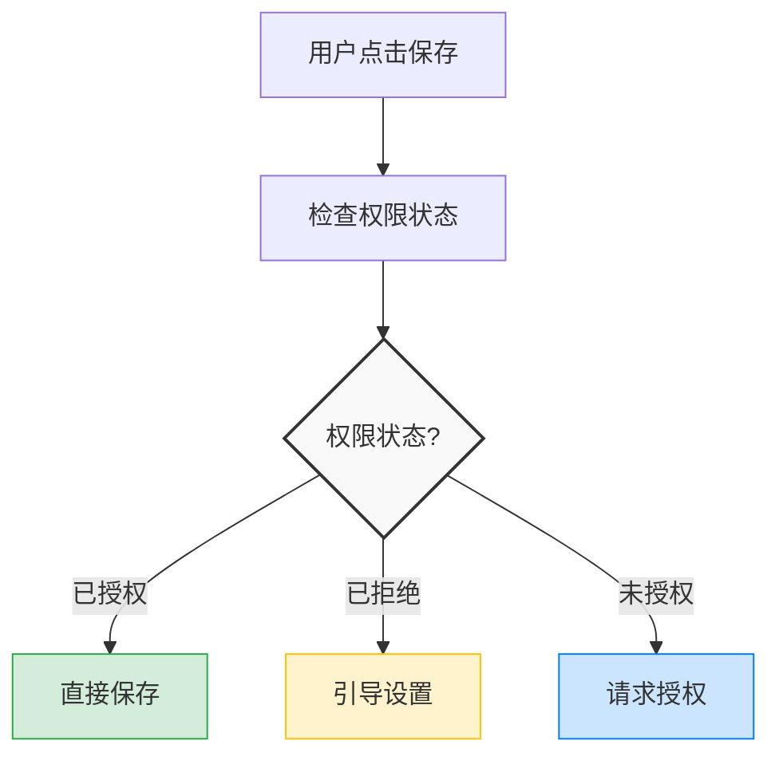

## 前言 ##

在微信小程序开发中，海报生成是一个常见的需求场景，比如邀请海报、分享海报、活动推广等。虽然需求看似简单，但实际开发中会遇到很多技术难点：Canvas 绘制、图片处理、权限管理、2倍图适配等。

本文将详细介绍如何从零开始开发一个高度可配置的微信小程序海报生成组件 `wxapp-poster`，深入解析核心实现细节和技术难点。

## 一、需求分析与技术选型 ##

### 需求分析 ###

在开始开发之前，我们需要明确组件的核心需求：

- 功能需求：支持背景图、二维码、文字的自定义配置
- 样式需求：支持颜色、字体、间距等所有样式参数的自定义
- 交互需求：支持预览、保存到相册
- 性能需求：使用 2 倍图提升清晰度，避免模糊
- 兼容性需求：适配不同屏幕尺寸，处理权限问题

### 技术选型 ###

#### 为什么选择 Canvas？ ####

微信小程序中实现图片合成主要有两种方案：

- 服务端生成：需要后端支持，增加服务器压力，实时性差
- 客户端 Canvas 绘制：实时生成，用户体验好，无需服务器支持

我们选择 Canvas 方案，因为：

- 实时生成，用户体验好
- 不依赖后端服务
- 可以充分利用小程序原生能力

#### 为什么使用 Component 而不是 Page？ ####

组件化设计可以让代码更易复用和维护，符合小程序的最佳实践。

## 二、架构设计 ##

### 组件结构 ###

```txt
components/poster/
├── poster.js      # 组件逻辑
├── poster.wxml    # 组件模板
├── poster.wxss    # 组件样式
├── poster.json    # 组件配置
└── package.json   # npm 包配置
```

### 设计思路 ###

组件采用双视图设计：

- 预览视图：使用 WXML + WXSS 实现，用于用户预览
- Canvas 视图：隐藏的 Canvas，用于实际绘制和生成图片

这种设计的优势：

- 预览视图可以实时响应样式变化
- Canvas 在后台绘制，不影响用户体验
- 最终保存的是 Canvas 生成的图片，质量更高

## 三、核心实现详解 ##

### Canvas 初始化与 2 倍图处理 ###

#### 为什么需要 2 倍图？ ####

在移动端，为了在高分辨率屏幕上显示清晰，需要使用 2 倍图。Canvas 的默认分辨率较低，直接绘制会导致图片模糊。

实现代码：

```javascript
initCanvas() {
  let that = this;
  wx.getSystemInfo({
    success: (res) => {
      const { imageRatio, whiteAreaHeight } = that.properties;
      // 使用2倍canvas提升清晰度
      const canvasWidth = res.screenWidth * 2; // 2倍图宽度
      // 根据配置的图片比例计算高度
      const imageAreaHeight = canvasWidth * imageRatio.height / imageRatio.width;
      // 白色区域高度转换为px（2倍图）
      const whiteAreaHeightPx = whiteAreaHeight * canvasWidth / res.screenHeight * 2;
      const canvasHeight = imageAreaHeight + whiteAreaHeightPx;
      
      that.setData({
        screenHeight: res.screenHeight,
        photoWidth: canvasWidth, // canvas实际宽度（2倍图）
        photoHeight: canvasHeight, // canvas实际高度（2倍图）
      });
      // 初始化完成后绘制
      that.draw();
    }
  });
}
```

关键技术点：

- 2 倍图计算：`canvasWidth = screenWidth * 2`
- 比例计算：根据配置的 `imageRatio` 计算实际高度
- rpx 转 px：小程序使用 rpx 单位，需要转换为 px
  - 转换公式：`px = rpx * screenWidth / 750`
  - 2倍图转换：`px = rpx * screenWidth * 2 / 750`

### Canvas 绘制流程 ###

绘制流程分为以下几个步骤：

```javascript
draw() {
  // 1. 获取图片信息
  wx.getImageInfo({
    src: backgroundImage,
    success: (imageRes) => {
      let ctx = wx.createCanvasContext('canvasPoster', that);
      
      // 2. 绘制背景
      ctx.setFillStyle(canvasBackgroundColor);
      ctx.fillRect(0, 0, canvasWidth, canvasHeight);
      
      // 3. 绘制背景图片
      ctx.drawImage(backgroundImage, 0, 0, canvasWidth, imageAreaHeight);
      
      // 4. 绘制白色区域
      ctx.setFillStyle(whiteAreaBackgroundColor);
      ctx.fillRect(0, imageAreaHeight, canvasWidth, whiteAreaHeightPx);
      
      // 5. 绘制文字
      // ... 文字绘制逻辑
      
      // 6. 绘制二维码（异步）
      if (qrImage) {
        wx.getImageInfo({
          src: qrImage,
          success: (qrRes) => {
            ctx.drawImage(qrImage, qrX, qrY, qrSize, qrSize);
            that.drawCanvas(ctx, canvasWidth, canvasHeight);
          }
        });
      }
    }
  });
}
```

### 文字绘制与垂直居中 ###

文字绘制是组件中最复杂的部分，需要处理：

- rpx 到 px 的转换
- 字体大小的 2 倍图适配
- 垂直居中对齐
- 行间距控制

实现代码：

```javascript
// rpx 转 px 的转换系数
// 原逻辑：28rpx -> 36 * canvasWidth / 750
// 转换系数：主文本 36/28 ≈ 1.286, 次文本 32/24 ≈ 1.333
const primaryTextRatio = 36 / 28;
const secondaryTextRatio = 32 / 24;
const fontSize1 = primaryTextSize * primaryTextRatio * canvasWidth / 750;
const fontSize2 = secondaryTextSize * secondaryTextRatio * canvasWidth / 750;

// 计算白色区域中心点
const whiteAreaStartY = imageAreaHeight;
const whiteAreaCenterY = whiteAreaStartY + whiteAreaHeightPx / 2;

// 计算行间距
const lineSpacing = fontSize2 * lineSpacingRatio;
// 计算两行文字的总高度
const totalTextHeight = fontSize1 + lineSpacing + fontSize2;

// 计算第一行文字的y坐标（垂直居中）
// fillText的y坐标是基线位置，所以需要加上字体大小
const firstLineY = whiteAreaCenterY - totalTextHeight / 2 + fontSize1;
// 计算第二行文字的y坐标
const secondLineY = firstLineY + fontSize1 + lineSpacing;

// 绘制文字
ctx.setFontSize(fontSize1);
ctx.setFillStyle(primaryTextColor);
ctx.setTextAlign('left');
ctx.fillText(primaryText, leftPaddingPx, firstLineY);
```

关键技术点：

- 基线对齐：`fillText` 的 y 坐标是文字基线位置，不是顶部，需要加上字体大小的一半才能实现视觉居中
- 行间距计算：使用相对于字体大小的比例，保证不同字体大小下间距协调
- 垂直居中算法：

```txt
中心点Y = 区域起始Y + 区域高度 / 2
第一行Y = 中心点Y - 总高度 / 2 + 字体大小
第二行Y = 第一行Y + 字体大小 + 行间距
```

### 二维码绘制与定位 ###

二维码需要：

- 根据配置的比例计算大小
- 右对齐
- 垂直居中

```javascript
if (qrImage) {
  wx.getImageInfo({
    src: qrImage,
    success: (qrRes) => {
      // 计算二维码尺寸（正方形，根据配置的比例）
      const qrSize = whiteAreaHeightPx * qrSizeRatio;
      // 计算x坐标：距离右边
      const rightPaddingPx = rightPadding * canvasWidth / 750;
      const qrX = canvasWidth - rightPaddingPx - qrSize;
      // 计算y坐标：垂直居中
      const qrY = whiteAreaCenterY - qrSize / 2;
      
      // 绘制二维码（正方形）
      ctx.drawImage(qrImage, qrX, qrY, qrSize, qrSize);
      
      // 绘制所有内容
      that.drawCanvas(ctx, canvasWidth, canvasHeight);
    }
  });
}
```

### Canvas 转图片 ###

绘制完成后，需要将 Canvas 转换为图片文件：

```javascript
drawCanvas(ctx, canvasWidth, canvasHeight) {
  let that = this;
  ctx.draw(true, () => {
    // 因为安卓机兼容问题, 所以方法要延迟
    setTimeout(() => {
      wx.canvasToTempFilePath({
        canvasId: 'canvasPoster',
        x: 0,
        y: 0,
        width: canvasWidth,
        height: canvasHeight,
        destWidth: canvasWidth,  // 保持2倍图分辨率
        destHeight: canvasHeight,
        success: res => {
          let path = res.tempFilePath;
          that.setData({
            tempImagePath: path
          });
          // 触发绘制完成事件
          that.triggerEvent('drawcomplete', { tempImagePath: path });
        },
        fail: (err) => {
          console.error('生成临时图片失败:', err);
          that.triggerEvent('error', { err });
        }
      }, that); // 新版小程序必须传this
    }, 200);
  });
}
```

关键技术点：

- 延迟处理：Android 设备上需要延迟执行，确保 Canvas 绘制完成
- 分辨率保持：destWidth 和 destHeight 设置为 2 倍图尺寸，保持高清
- this 传递：新版小程序 API 必须传递组件实例

## 四、权限处理机制 ##

保存图片到相册需要处理相册权限，这是小程序开发中的常见难点。

### 权限状态 ###

微信小程序的权限有三种状态：

- 未授权：用户未操作过
- 已授权：用户已同意
- 已拒绝：用户已拒绝，需要引导到设置页面

### 实现代码 ###

```javascript
saveImage() {
  if (!this.data.tempImagePath) {
    wx.showToast({
      title: loadingText,
      icon: 'none'
    });
    return;
  }

  // 检查授权
  wx.getSetting({
    success: (res) => {
      if (res.authSetting['scope.writePhotosAlbum']) {
        // 已授权，直接保存
        this.doSaveImage();
      } else if (res.authSetting['scope.writePhotosAlbum'] === false) {
        // 已拒绝授权，引导用户开启
        wx.showModal({
          title: permissionModalTitle,
          content: permissionModalContent,
          showCancel: true,
          confirmText: permissionModalConfirmText,
          success: (modalRes) => {
            if (modalRes.confirm) {
              wx.openSetting(); // 打开设置页面
            }
          }
        });
      } else {
        // 未授权，请求授权
        wx.authorize({
          scope: 'scope.writePhotosAlbum',
          success: () => {
            this.doSaveImage();
          },
          fail: () => {
            wx.showToast({
              title: needPermissionText,
              icon: 'none'
            });
          }
        });
      }
    }
  });
}
```

处理流程：




## 五、组件化设计 ##

### 属性设计 ###

组件采用高度可配置的设计，所有样式参数都可通过属性配置：

```javascript
properties: {
  // 内容相关
  backgroundImage: { type: String, value: '' },
  qrImage: { type: String, value: '' },
  primaryText: { type: String, value: '邀请您一起加入POPO' },
  secondaryText: { type: String, value: '长按二维码识别' },
  
  // Canvas相关
  canvasBackgroundColor: { type: String, value: '#7e57c2' },
  canvasZoom: { type: Number, value: 40 },
  imageRatio: { type: Object, value: { width: 750, height: 1050 } },
  
  // 颜色配置
  whiteAreaBackgroundColor: { type: String, value: '#ffffff' },
  primaryTextColor: { type: String, value: '#000000' },
  secondaryTextColor: { type: String, value: '#9C9C9C' },
  
  // 字体配置
  primaryTextSize: { type: Number, value: 28 },
  secondaryTextSize: { type: Number, value: 24 },
  lineSpacingRatio: { type: Number, value: 0.3 },
  
  // ... 更多配置
}
```

### 事件设计 ###

组件通过事件与父组件通信：

```javascript
// 绘制完成事件
that.triggerEvent('drawcomplete', { tempImagePath: path });

// 保存成功事件
this.triggerEvent('savesuccess', { tempImagePath: this.data.tempImagePath });

// 保存失败事件
this.triggerEvent('saveerror', { err, message });

// 错误事件
that.triggerEvent('error', { err });
```

### 方法暴露 ###

组件暴露 saveImage 方法供外部调用：

```javascript
// 在页面中调用
const poster = this.selectComponent('#poster');
poster.saveImage();
```

## 六、样式与布局 ##

### Canvas 隐藏 ###

Canvas 需要隐藏，但保持绘制能力。使用 `zoom` 和 `position` 实现：

```html
<canvas 
  class="poster__canvas" 
  canvas-id="canvasPoster" 
  style="width:{{photoWidth}}px;height:{{photoHeight}}px;zoom:{{canvasZoom}}%">
</canvas>
```

```css
.poster__canvas {
  position: absolute;
  left: 99999rpx;  /* 移出屏幕 */
  top: 0rpx;
}
```

### 预览视图 ###

预览视图使用常规的 WXML + WXSS 实现，实时响应样式变化：

```html
<view class="poster__image-container">
  <image class="poster__image-container-image" src="{{backgroundImage}}"></image>
  <view class="poster__white-area">
    <view class="poster__white-area-left">
      <view class="poster__text poster__text--primary">{{primaryText}}</view>
      <view class="poster__text poster__text--secondary">{{secondaryText}}</view>
    </view>
    <view class="poster__white-area-right">
      <image class="poster__qr-image" src="{{qrImage}}" />
    </view>
  </view>
</view>
```

## 七、性能优化 ##

### 图片加载优化 ###

- 使用 `wx.getImageInfo` 预加载图片，确保绘制时图片已加载完成
- 异步加载二维码，避免阻塞主流程

### Canvas 绘制优化 ###

- 使用 2 倍图提升清晰度，避免模糊
- 延迟执行 `canvasToTempFilePath`，确保 Android 设备兼容性

### 内存管理 ###

- 及时清理临时文件路径
- 避免重复绘制，只在必要时触发

## 八、常见问题与解决方案 ##

### Canvas 模糊问题 ###

问题：生成的图片模糊

解决方案：使用 2 倍图

```javascript
const canvasWidth = res.screenWidth * 2; // 2倍图
```

### Android 设备兼容性 ###

问题：Android 设备上 `canvasToTempFilePath` 执行失败

解决方案：延迟执行

```javascript
setTimeout(() => {
  wx.canvasToTempFilePath({...}, that);
}, 200);
```

### 文字垂直居中 ###

问题：文字无法垂直居中

解决方案：考虑基线对齐

```javascript
// fillText的y坐标是基线位置
const firstLineY = whiteAreaCenterY - totalTextHeight / 2 + fontSize1;
```

### 权限处理 ###

问题：用户拒绝权限后无法再次请求

解决方案：引导用户到设置页面

```javascript
if (res.authSetting['scope.writePhotosAlbum'] === false) {
  wx.showModal({
    confirmText: '去设置',
    success: (modalRes) => {
      if (modalRes.confirm) {
        wx.openSetting();
      }
    }
  });
}
```

## 九、发布 npm 包 ##

### package.json 配置 ###

```json
{
  "name": "wxapp-poster",
  "version": "1.0.2",
  "description": "微信小程序海报生成组件",
  "main": "poster.js",
  "miniprogram": ".",
  "files": [
    "poster.js",
    "poster.wxml",
    "poster.wxss",
    "poster.json",
    "README.md"
  ]
}
```

### 发布流程 ###

```bash
# 1. 登录 npm
npm login

# 2. 发布
npm publish
```

## 十、总结 ##

本文详细介绍了微信小程序海报生成组件的开发实践，包括：

- 技术选型：选择 Canvas + Component 方案
- 2倍图处理：提升图片清晰度
- 文字绘制：处理 rpx 转换、垂直居中、行间距
- 权限管理：完善的权限处理机制
- 组件化设计：高度可配置、低耦合
- 性能优化：图片预加载、延迟执行等

通过这个组件的开发，我们不仅解决了海报生成的需求，还积累了很多小程序开发的经验。希望这篇文章能帮助到正在开发类似功能的开发者。
