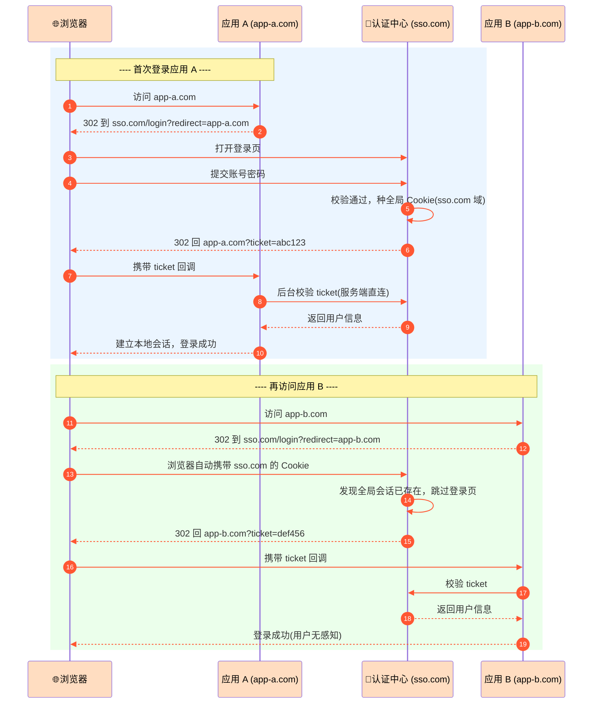

## 一、为什么需要 SSO ##

在一家稍具规模的公司里，内部系统往往是一把一把的：邮箱、OA、Wiki、CRM、工单、监控、代码仓库……如果每个系统都自建一套账号体系，问题会从三个角度同时冒出来：

- 用户视角：要记多套账号密码，每切换一个系统都得重新登录一次，体验割裂。
- 运维视角：员工入职、离职、调岗时，要在 N 个系统里逐个开通或回收账号，极易遗漏，审计也难以拉通。
- 开发视角：每个新系统都要重复实现注册、登录、找回密码、会话管理这一整套逻辑，既是重复劳动，也让安全短板分散在各处。

单点登录(Single Sign-On，SSO) 要解决的核心诉求只有一句话：用户只登录一次，就能访问所有互相信任的系统。

> ⚠️ 注意：SSO 只解决“你是谁”(认证 Authentication)，不直接解决“你能做什么”(授权 Authorization)。后者是权限系统的事，两者经常被混为一谈。

## 二、核心思想：把登录这件事“外包”出去 ##

SSO 的关键是把认证从各业务系统中剥离，交给一个独立的认证中心(SSO Server / Identity Provider)。业务系统(Service Provider) 自己不再保管密码，只信任认证中心签发的凭证。

```mermaid
graph LR
    %% 定义专业色彩
    classDef user fill:#E5E7EB,stroke:#374151,stroke-width:2px;
    classDef app fill:#DBEAFE,stroke:#2563EB,stroke-width:2px;
    classDef sso fill:#FEF3C7,stroke:#D97706,stroke-width:2px;
    classDef db fill:#DCFCE7,stroke:#16A34A,stroke-width:2px;

    U((用户)):::user --> A[应用 A]:::app
    U --> B[应用 B]:::app
    U --> C[应用 C]:::app
    
    A -. 认证委托 .-> S[认证中心&#x3C;br/>SSO Server]:::sso
    B -. 认证委托 .-> S
    C -. 认证委托 .-> S
    
    S === DB[(统一用户库)]:::db

    %% 这里的线条颜色也做了弱化处理，不抢戏
    linkStyle default stroke:#6B7280,stroke-width:1px;
```

这样带来的直接好处：

- 密码只在一个地方输入、校验、存储，攻击面收敛
- 账号开通、禁用、改密一处生效
- 业务系统专注自己的领域，不再重复造登录轮子

## 三、同域 SSO：最简单的场景 ##

如果所有子系统共用一个父域，比如 `mail.example.com`、`wiki.example.com`、`oa.example.com`，那其实不需要什么复杂协议——一个设置了 `Domain=.example.com` 的 Cookie 就够了。

```mermaid
%%{init: {"themeVariables": { "actorBkg": "#FFDDC1", "actorTextColor": "#000", "signalColor": "#FF5733"}}}%%
sequenceDiagram
    autonumber

    participant U as 🌐 浏览器
    participant A as ✉️ mail.example.com
    participant S as 🔑 sso.example.com
    participant W as 📝 wiki.example.com

    Note over U, S: 第一阶段:访问 mail(无会话,需登录)
    U->>A: 1. 访问邮箱系统
    A-->>U: 2. 未登录,302 重定向至 SSO
    U->>S: 3. 打开登录页
    U->>S: 4. 提交账号密码

    rect rgb(230, 255, 230)
        S-->>S: SSO 端建立全局会话,&#x3C;br/>Cookie 是它的句柄
        S-->>U: 5. 验证通过，Set-Cookie(Domain=.example.com)&#x3C;br/>并 302 返回 mail
    end

    U->>A: 6. 携带全局 Cookie 访问邮箱
    A->>S: 7. 首次访问：拿 token 换取用户身份
    S-->>A: 8. 返回用户信息
    A-->>U: 9. 建立本地 Session，登录成功

    Note over U, S: 第二阶段：访问 wiki(同域共享,无缝登录)

    rect rgb(255, 245, 230)
        U->>W: 10. 访问 Wiki(浏览器自动携带同域 Cookie)
        W->>S: 11. 首次访问：拿 token 换取用户身份&#x3C;br/>(仅首次,之后走本地 Session)
        S-->>W: 12. 返回用户信息
        W-->>U: 13. 建立本地 Session，登录成功
    end
```

首次访问 `mail.example.com` 输入密码认证后，第二次访问 `wiki.example.com`，浏览器会自动把同一个 Cookie 带上，认证中心校验通过即可——全程只需用户输入一次密码。

局限也很明显：一旦子系统域名不同（比如收购来的业务、SaaS 集成），Cookie 就带不过去了，必须上真正的跨域 SSO 方案。

## 四、跨域 SSO：票据重定向 ##

跨域场景下（如 `app-a.com`、`app-b.com`），浏览器的同源策略挡住了 Cookie 共享，业界通行的解法是重定向 + 一次性票据。经典代表是 CAS，现代互联网场景则是 OAuth2 / OIDC 的授权码模式(Authorization Code Flow)。

核心流程如下:

几个关键点值得单独拎出来:

1. *为什么要用一次性票据，而不是直接把 token 放 URL?* 票据短时、一次性、通过浏览器前端传递，即使被日志或 Referer 泄露，也很快失效；真正的身份信息是应用通过后台直连认证中心换回来的，不经过浏览器，安全性高得多。

2. *全局会话 vs 本地会话* 认证中心那边有一份“全局会话”，记录“这个用户已经登录了”；每个业务系统拿到身份后还会建自己的“本地会话”。两套会话的生命周期并不一致——这也是后面单点登出要处理的难点。

3. *第二次登录为什么"无感知"?* 因为全局 Cookie 还在，认证中心不需要再问密码，直接签一张新票据就跳回去了。用户看到的只是一次快速的 302 跳转。

## 五、主流协议对比 ##

| 协议 | 定位 | 适用场景 | 特点 |
| ----- | ------ | ----- | ------ |
| **CAS** | 企业级 SSO | 内部多 Web 系统 | 经典 ticket 流程，协议简单，生态集中在 Java |
| **SAML 2.0** | 企业 / SaaS | 传统企业对接 SaaS | 基于 XML，重，但在 B2B 领域仍是事实标准 |
| **OAuth 2.0** | 授权协议 | 第三方应用拿资源 | 本身不是认证协议，常被误用 |
| **OIDC** | 认证 + 授权 | 现代互联网 SSO | OAuth2 之上补齐身份层，签发 ID Token(JWT) |

一个容易踩的坑：*OAuth2 严格来说是"授权"协议，不是"认证"协议*。早期很多系统用 OAuth2 的 `access_token` 当作登录凭据，其实是把“拿到资源的权限”误当成“证明身份”，在安全上是有隐患的。OIDC 就是为了修正这个问题——它在 OAuth2 授权码流程之上额外签发一个 `id_token`(一个 JWT)，里面才是真正经过签名的身份断言。

## 六、容易被忽略的几个工程难点 ##

### 单点登出(Single Logout, SLO) ###

登录容易，登出难。用户在应用 A 点了"退出"，期望是所有系统都登出——但各系统有自己的本地会话，认证中心必须主动通知它们。常见做法:

- 前端通道：登出页用隐藏 iframe 依次访问各系统的登出接口(依赖浏览器，可能被拦)
- 后端通道：认证中心直接广播回调各系统注册的 logout endpoint(可靠，但要求各系统可达)

现实中很多"SSO"其实只做了 SSI(Single Sign-In)，登出是各管各的——用户以为退出了，实际别的标签页还是登录态,这是常见的安全隐患。

### 会话生命周期对齐 ###

全局会话 2 小时、应用 A 本地会话 30 分钟、应用 B 本地会话 8 小时——当它们不一致时，会出现“明明刚在 A 里还好好的，切到 B 却被踢出去”这类怪现象。通常的做法是让本地会话不超过全局会话，并在每次请求时做滑动续期。

### 安全性清单 ###

真正上线前至少要过一遍:

- 票据防重放：一次性 + 短时效 + 绑定 IP/UA
- `redirect_uri` 白名单：防止 Open Redirect 和授权码劫持
- CSRF 防护：OIDC 的 `state` 参数必须校验
- PKCE：公共客户端(SPA、移动端)必须启用
- 令牌存储：JWT 不要随便塞 localStorage，注意 XSS 风险

### 和微服务网关的配合 ###

在微服务架构里，SSO 常和网关 + JWT 组合使用：认证中心登录成功后签发 JWT，网关在入口处校验签名并解析出用户身份，转发给下游服务。下游服务本地不保存会话，天然无状态，水平扩展方便。代价是 JWT 一旦签出就难以主动失效，需要配合短有效期 + refresh token,或者引入黑名单机制。

## 七、总结 ##

回到最开始那句话：SSO 的本质是把认证从业务系统中剥离，交给一个被所有系统信任的认证中心。

- 同域场景：一个父域 Cookie 就能搞定，不要过度设计
- 跨域场景：走重定向 + 一次性票据的路子，CAS / OIDC 都是这个思路的不同实现
- OAuth2 是授权协议，OIDC 才是现代 SSO 的认证标准，这一点务必分清
- 登录只是开始，登出、会话一致性、令牌安全才是真正考验工程落地的地方

理解了票据流转的这套机制，再去看 JWT、OAuth2、OIDC 的具体协议细节，就是顺水推舟的事了。
