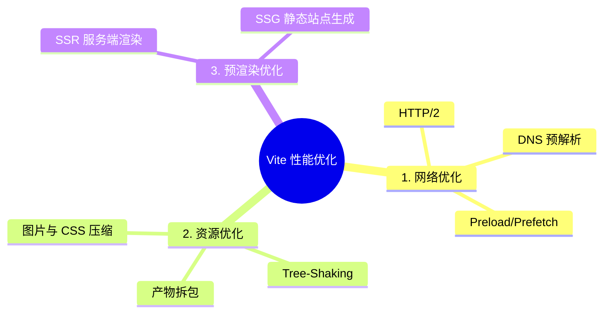

## 💡 引言 ##

在前端开发的世界里，Vite 凭借着开发环境的“天下武功，唯快不破”斩获了无数开发者的芳心。但在生产环境（Production）下，Vite 底层使用的是 Rollup 进行全量打包。面对复杂的线上网络环境、动辄数兆的第三方庞大依赖、以及低版本浏览器的兼容挑战，单凭 Vite 的默认配置往往很难撑起大厂应用对 “极致首屏加载速度” 的要求。

性能优化从来都不是一个孤立的抓手，而是一场立体化的攻防战。通常，我们可以将项目的加载性能优化归纳为三大核心战线：
                    


本文将带你顺着这条完整的工程化链路，从网络协议一路死磕到打包磁盘文件的每一个字节。

## 一、 第一战线：网络层优化（让资源更早到达） ##

再轻量级的代码，如果卡在网络的“队头阻塞”里也无济于事。网络优化的核心就是缩短连接建立时间，打破浏览器的并发锁。

### 拥抱 HTTP 2.0（多路复用与服务端推送） ###

#### 传统 HTTP 1.1 的痛点 ####

- 队头阻塞（Head-of-Line Blocking） ：同一个 TCP 管道中同一时刻只能处理一个 HTTP 请求，后续请求必须排队。

- 并发连接限制：浏览器对同一域名下的并发请求数量有着严格限制（如 Chrome 仅允许 6 个并发），多出来的资源请求只能苦苦等待。

#### HTTP 2.0 的降维打击 ####

- 多路复用（Multiplexing） ：将数据切分为多个二进制帧，多个请求和响应的数据帧在同一个 TCP 通道内交错传输，完美根治队头阻塞。同域名并发请求限制直接飙升到 100 个以上。

- 服务端推送（Server Push） ：允许服务器在客户端没有主动请求的情况下推送资源。例如请求 index.html 时，服务器直接把配套的 main.js 和 style.css 一并塞给浏览器，省去了后续来回握手的开销。

#### 🛠 落地实践（1）：Vite 本地开发环境开启 HTTP 2.0 ####

在本地通过 `vite-plugin-mkcert` 插件可以在开发服务器（Dev Server）上丝滑开启 HTTP2：

```ts
import { defineConfig } from "vite";
import react from "@vitejs/plugin-react";
import mkcert from "vite-plugin-mkcert";

export default defineConfig({
  plugins: [react(), mkcert()],
  server: {
    https: true, // 关键：HTTP2 强依赖 TLS 握手，必须开启 HTTPS
  },
});
```

> 底层原理：该插件会在本地自动生成并受信任一套 TLS 证书，支持通过 HTTPS 启动，Vite 检测到 HTTPS 服务后会自动将其升级为 HTTP2 协议。

#### 🛠 落地实践（2）：线上 Nginx 正式环境配置 HTTP 2.0 ####

线上环境需要通过配置 Nginx 服务器来开启 HTTP2 能力，参考配置如下：

```nginx
server {
    listen 443 ssl http2;  # 核心关键：加上 http2
    server_name yourdomain.com;

    # SSL 证书配置（必须有）
    ssl_certificate /path/to/fullchain.pem;
    ssl_certificate_key /path/to/privkey.pem;

    # 前端静态资源项目部署
    root /usr/share/nginx/html;
    index index.html;

    # 完美支持 SPA 路由
    location / {
        try_files $uri $uri/ /index.html;
    }
}

# 80 端口强制重定向跳转 HTTPS
server {
    listen 80;
    server_name yourdomain.com;
    return 301 https://$host$request_uri;
}
```

### DNS 预解析与预连接 ###

浏览器向跨域的第三方服务器发送请求时，第一步是进行 DNS 解析（域名 →\rightarrow→ IP），这通常会带来几十到上百毫秒的延迟。

- `dns-prefetch`：告诉浏览器提前去解析第三方域名的 DNS，降低延迟。
- `preconnect`：比前者更激进，不仅解析 DNS，还顺便把 TCP 三次握手和 TLS 握手全部建好。

```html
<!-- 一般情况下两者搭配使用，优化体验极佳 -->
<link rel="preconnect" href="https://fonts.gstatic.com/" crossorigin>
<link rel="dns-prefetch" href="https://fonts.gstatic.com/">
```

> ⚠️ 避坑指南：对于 preconnect 的 link 标签，如果是获取字体或跨域资源，必须加上 crossorigin 属性，否则浏览器会建立两个独立的连接通道，导致预连接直接失效。

### Preload 与 Prefetch（资源优先级控制） ###

- Preload：高优先级预加载。告诉浏览器这个资源是当前页面必不可少的（如核心字体、首屏关键 JS），不管用没用到，立刻、马上下载。
- Prefetch：低优先级预拉取。告诉浏览器这个资源是后续其他页面可能会用到的。浏览器会在网络空闲（Idle）的时候偷偷把它下载到本地缓存。

## 二、 第二战线：资源层优化（极致压缩与精准分包） ##

资源优化关注的是如何让产物的物理体积更小、更符合用户的首屏加载动态分配。

### JavaScript 精细化治理 ###

- Tree-Shaking（树摇） ：Rollup 会对标准 ESM 模块做全量的静态上下文分析，识别出那些声明了却从未被调用的函数、组件，并在打包时将其彻底“摇”掉。- Vite 生产环境默认开启该能力，无需额外配置。
语法降级与转译：通过 `@vitejs/plugin-legacy` 插件将 ES6+ 高级语法平稳转译为低版本浏览器能够兼容的代码，保证线上绝对的安全稳定。

### CSS 精密提取与隔离 ###

- 独立抽离：Vite 会默认把 `.vue`、`.tsx` 文件中的 `style` 代码提取为一个个独立的 CSS 文件（而不是内联包裹进 JS 中），避免 JS 体积过大导致阻塞。
- 动态异步加载：配合前端路由的懒加载，Vite 会自动将不同路由 Chunk 对应的 CSS 拆分为独立的 CSS 补丁包，只有当路由切换时才请求该 CSS，实现 CSS 按需加载。
- 去重去瑕：Vite 内部会对 CSS 进行 AST 解析，自动检测并剔除重复、冗余的样式规则。

### 图片资源的精细化控制 ###

- Base64 内联：Vite 默认将 ≤4kb 的小静态资源（如小图标、SVG、字体）转换为 Base64 编码内联直接嵌入到 JS/CSS 中，减少了一次额外的网络 HTTP 请求。 
- 强缓存与 Hash 化：所有的静态资源编译后会统一输出到 dist/assets 目录，文件名自动追加唯一的哈希值（如 `logo.8f78b1.png`），方便线上配置 Nginx 强缓存且不用担心版本更新问题。
- 自动压实：引入 `vite-plugin-imagemin` 插件，在生产构建时对大图、PNG/JPG 进行无损/有损质量优化，直接缩减包体积。

### 产物精细化拆包（Code Splitting） ###

如果把所有代码打包成一个巨大的 index.js，哪怕网络再快，用户也需要等待很久。利用 Rollup 的 manualChunks，我们可以像切蛋糕一样把产物精准切分。

在 `vite.config.ts` 中，我们有两种高阶拆包配置方式：

#### 💡 方式一：对象映射配置（简单直观） ####

```ts
export default defineConfig({
  build: {
    rollupOptions: {
      output: {
        manualChunks: {
          // 将 React 生态全家桶打包成独立的 react-vendor.js
          'react-vendor': ['react', 'react-dom'],
          // 将 Lodash 这种大工具库单独拎出来
          'lodash': ['lodash-es'],
          // 将重型组件库单独打包，避免污染主包
          'library': ['antd'],
        },
      },
    },
  },
});
```

#### 💡 方式二：函数拦截配置（全自动按需动态分包） ####

如果项目依赖非常复杂，使用对象配置容易漏掉隐式依赖，此时推荐使用标准的函数式拦截方案：

```ts
export default defineConfig({
  build: {
    rollupOptions: {
      output: {
        // 基于模块绝对路径 id 进行动态分包拦截
        manualChunks(id) {
          if (id.includes('node_modules')) {
            if (id.includes('antd') || id.includes('@arco-design')) {
              return 'library';
            }
            if (id.includes('lodash-es')) {
              return 'lodash';
            }
            if (id.includes('react')) {
              return 'react-vendor';
            }
            // 其余所有第三方库统一归纳到 vendor 中
            return 'vendor';
          }
        }
      },
    },
  },
});
```

## 三、 第三战线：预渲染优化（打破 SPA 渲染天花板） ##

哪怕网络再快、体积再小，单页面应用（SPA）依然逃不出 “白屏 →\rightarrow→ 加载 JS →\rightarrow→ 渲染挂载” 的时间差。针对企业级或有极高 SEO/首屏要求的项目，我们需要直接改变页面渲染的范式：

- 服务端渲染（SSR - Server-Side Rendering） ：页面在 Node.js 服务端直接组装并注入好数据，拼接成完整的 HTML 字符串直接返回给浏览器。浏览器拿到即可呈现画面，大大缩短了真正意义上的 白屏时间（FP / FCP） 。
- 静态站点生成（SSG - Static Site Generation） ：在项目构建阶段（Build Time），直接把路由对应的页面全部编译生成好一个个现成的 .html 文件。部署上线后，用户访问任意路径拿到的都是纯静态页面，配合 CDN 分发，速度可达到物理极限。

## 📌 总结 ##

前端性能优化从来不是单点的炫技，而是一项系统的、全链路的重塑工程。通过 HTTP/2 多路复用打通网络的高速路，利用精细的 manualChunks 拆包控制代码的组织边界，最后配合图片、CSS 资源的极致压缩， 这一套三维防线，才是让你的 Vite 项目在线上快到飞起的真正底层奥秘。
