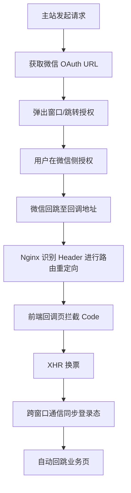

在当前的 Web 开发生态中，微信扫码登录已成为 B/S 架构系统的标配。然而，如何在单页应用（SPA）中优雅地处理跨窗口通信、状态校验、以及 Nginx 层的路由分发，是衡量一个系统工程化水平的重要指标。本文将结合实际项目经验，深度拆解一套工业级的微信授权登录全链路实现方案。

## 一、 授权发起的严密性：State 校验与环境预判 ##

授权的第一步并非简单地跳转链接，而是确保请求的安全性和上下文的可追溯性。

### 安全指纹：State 的生成与持久化 ###

为了防御 CSRF（跨站请求伪造）攻击，前端在请求后端获取微信授权 URL 之前，需生成一个随机的 `state`。在本项目中，该 `state` 被写入 `localStorage` 而非 `sessionStorage`。

技术细节：由于微信授权往往涉及新窗口弹出（`window.open`），子窗口与父窗口之间需要共享状态。`sessionStorage` 仅在单一标签页生命周期内有效，无法跨窗口传递。

### 交互降级策略 ###

为了提供极致的用户体验，前端通常优先尝试使用 `window.open` 打开一个新的空白页，随后通过 `location.href` 重定向至微信授权页。这样做可以保留主站点的状态。

异常处理：若浏览器拦截了弹窗，系统需立即捕获异常并降级为 `window.location.assign`，即在当前标签页整页跳转，确保业务流不中断。

## 二、 Nginx 层的巧妙路由：API 路径与前端路由的解耦 ##

这是本项目实现中的一个亮点：*通过 Nginx 识别请求意图，实现 API 回调与 SPA 回调页面的动态分发*。

微信官方要求的 `redirect_uri` 通常指向后端接口（如 `/nexus/api/auth/wechat/callback`）。然而，在现代前后端分离架构中，我们需要一个前端中转页来处理逻辑。

- 同步导航流：当微信服务端携带 `code` 重定向回浏览器时，这是一个 GET 请求且 Accept 头包含 `text/html`。Nginx 配置通过判断 Header，利用 302 重定向将流量引向前端 SPA 的静态路由（如 `/nexus/auth/wechat/callback`），同时保留所有 `Query` 参数。
- 异步数据流：当 SPA 回调页加载完成后，前端会发起 XHR 请求。此时 Nginx 识别到 `application/json` 或 `XHR` 标识，直接反向代理至后端真实的换票接口。

这种设计实现了“地址统一、逻辑分离”，极大提升了架构的灵活性。

## 三、 回调页的逻辑闭环：换票与状态落库 ##

当用户在微信侧完成点击授权，浏览器跳转至前端回调页（WeChatOAuthCallbackPage）后，核心逻辑开始执行。

### 状态双向校验 ###

回调页首先提取 URL 中的 `state`，并与 `localStorage` 中暂存的 `state` 进行比对。只有完全一致，才证明该请求是由本系统发起的。校验通过后，立即销毁 `state` 以防重用。

### 换票与令牌获取 ###

前端调用 `loginWithWeChatCode(code)`。后端在接收到 `code` 后，通过后端服务器向微信服务器请求 `access_token` 和 `openid`。

> 身份转化：后端将微信身份转化为系统自身的 JWT 或 Session Token。响应数据通常包含 access_token 和用户信息（user）。

## 四、 跨窗口通信：多种协议的协同工作 ##

在子窗口完成授权后，如何通知父窗口“登录成功”并同步状态？本项目采用了多层级通信机制。

- PostMessage（首选） ：通过 `window.opener.postMessage` 向父窗口发送包含 `token` 和重定向路径的消息。
- BroadcastChannel（备选） ：若 `opener` 引用丢失，利用 `BroadcastChannel` 建立跨页面通信隧道。
- Storage Event（保底） ：若上述 API 均失效，通过修改 `localStorage` 触发 `storage` 事件，实现父子窗口的被动同步。

## 五、 登录态的持久化与上下文更新 ##

一旦前端拿到 Token，需要完成最后的“着陆”：

- 写入持久化存储：将 Token 写入 localStorage。此时全局 Axios 拦截器会自动感知，并在后续所有请求的 Authorization 头中携带 Bearer Token。

- 用户上下文更新：触发全局 AuthProvider 的状态更新。若后端在换票阶段已返回用户信息，可直接 `setMe` 渲染 UI；否则需立即发起一次 `/user/me` 请求，补全用户头像、昵称及权限数据。

## 六、 总结 ##

这套微信授权登录方案的精髓在于其健壮性与解耦能力。

### 核心路径回顾 ###

通过 state 校验防御安全风险，利用 Nginx 解决路由冲突，再配合多套跨窗口通信方案，这套流程不仅能够应对复杂的浏览器兼容性问题，也为单页应用处理第三方社交登录提供了一个标准化的范本。在实际生产环境下，这种对细节（如 localStorage 选型、Nginx 302 策略）的打磨，正是系统稳定性的基石。
