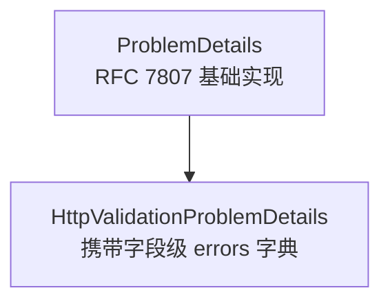
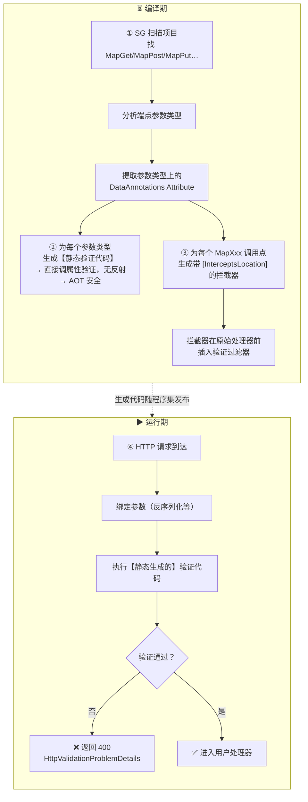
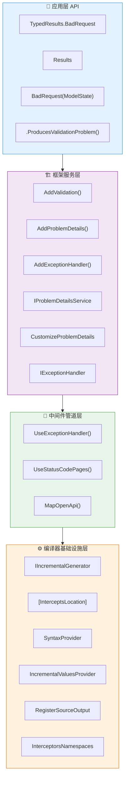

## 一、HTTP 400 的语义定位 ##

HTTP 400 Bad Request 由 RFC 9110 定义，语义是：服务端因请求自身的语法或语义错误，拒绝处理本次请求。关键在于"错误来自客户端"，与 5xx 的"服务端出错"严格区分。

在 API 设计实践中，400 承担多种具体场景：

| 场景 | 推荐状态码 | 说明 |
| :--- | :--- | :--- |
| 请求体 JSON 格式非法 | 400 | 解析失败，不是业务问题 |
| 字段级验证失败 | 400 或 422 | 语义上两者均可，团队应统一 |
| 业务前置条件不满足 | 400 | 如“余额不足”等领域规则 |
| 缺少必填字段 | 400 | 属于请求结构问题 |
| 资源不存在 | 404 | 不是 400 |
| 已存在冲突 | 409 | 不是 400 |


理解这一分类是后续所有技术选型的前提。

## 二、BadRequest 的四种表达方式 ##

### Controller API：`ControllerBase.BadRequest()` ###

ControllerBase 提供三个重载：

```cs
// 重载一：无响应体，仅状态码 400
return BadRequest();

// 重载二：携带任意对象，框架通过内容协商序列化
return BadRequest(new { message = "Invalid input" });

// 重载三：携带 ModelStateDictionary，框架自动转为 ValidationProblemDetails
return BadRequest(ModelState);
```

BadRequest(object?) 的内部路径：

```mermaid
flowchart TD
    A[BadRequest(obj)] --> B[BadRequestObjectResult(obj)]
    B --> C[ObjectResult.ExecuteResultAsync()]
    C --> D[ObjectResultExecutor<br/>遍历 IOutputFormatter 列表]
    D --> E[SystemTextJsonOutputFormatter]
    E --> F[JSON 序列化<br/>写入响应体]
```

`BadRequest(ModelState)` 则走专用路径，框架将 ModelStateDictionary 包装为 HttpValidationProblemDetails，这是一个携带字段级 errors 字典的 ProblemDetails 子类。

任意对象不会自动转换为 ProblemDetails，只有 ModelStateDictionary 重载和 `[ApiController]` 自动验证才产生标准化的 ProblemDetails 结构。

### Minimal API：`Results.BadRequest()` 与 `TypedResults.BadRequest<T>()`

```cs
// Results：返回 IResult 接口，类型信息在接口层丢失
Results.BadRequest(new ProblemDetails { Title = "error" })
// 返回类型：IResult

// TypedResults：返回具体泛型类型，类型信息完整保留
TypedResults.BadRequest(new ProblemDetails { Title = "error" })
// 返回类型：BadRequest<ProblemDetails>
```

`TypedResults.BadRequest<TValue>` 的签名：

```cs
public static BadRequest<TValue> BadRequest<TValue>(TValue? error)
```

T 没有任何基类约束，任意类型均可。框架将 T 的值直接 JSON 序列化写入响应体，不进行任何类型转换或 ProblemDetails 包装：

```cs
// BadRequest<TValue> 核心执行逻辑（简化）
public async Task ExecuteAsync(HttpContext httpContext)
{
    httpContext.Response.StatusCode = 400;
    if (Value is not null)
        await httpContext.Response.WriteAsJsonAsync(Value, Value.GetType());
}
```

因此传入什么类型，响应体就是那个类型的 JSON。若要符合 RFC 7807 规范，应主动传入 ProblemDetails 或 HttpValidationProblemDetails。

## 三、TypedResults vs Results：类型系统的深层差异 ##

### 类型信息丢失的本质 ###

```cs
// Results 工厂方法签名
public static IResult BadRequest(object? error = null)
    => new BadRequest<object>(error); // 泛型参数擦除为 object

// TypedResults 工厂方法签名
public static BadRequest<TValue> BadRequest<TValue>(TValue? error)
    => new BadRequest<TValue>(error); // 泛型参数完整保留
```

"编译期可见"的含义是：TypedResults 的返回类型是具体类，编译器、OpenAPI 分析器、单元测试框架都可以在不执行代码的情况下知道：这个调用会产生一个携带 TValue 类型响应体、状态码为 400 的结果。

### OpenAPI 元数据自动推断 ###

`BadRequest<TValue>` 实现了 IEndpointMetadataProvider：

```cs
static void IEndpointMetadataProvider.PopulateMetadata(
    MethodInfo method, EndpointBuilder builder)
{
    // 编译器在构建端点时调用，T 的类型信息在此注入 OpenAPI 元数据
    builder.Metadata.Add(new ProducesResponseTypeMetadata(
        statusCode: 400,
        type: typeof(TValue),
        contentTypes: ["application/json"]
    ));
}
```

这就是 `TypedResults.BadRequest<ProblemDetails>` 能让 OpenAPI 文档自动出现"400 → ProblemDetails schema"的原因——无需任何 `[ProducesResponseType]` 标注。

### `Results<T1, T2, ...>` 联合类型：编译期返回约束 ###

```cs
// 声明端点所有可能的返回类型
app.MapPost("/products",
    async Task<Results<Created<ProductDto>, BadRequest<HttpValidationProblemDetails>, Conflict<ProblemDetails>>> (
        CreateProductRequest request, IProductService svc) =>
    {
        // ✅ 三种返回均在声明范围内，编译通过
        if (!Validate(request, out var errors))
            return TypedResults.BadRequest(errors);

        if (await svc.ExistsAsync(request.Sku))
            return TypedResults.Conflict(new ProblemDetails { Title = "Already exists" });

        var product = await svc.CreateAsync(request);
        return TypedResults.Created($"/products/{product.Id}", product.ToDto());

        // ❌ 编译错误：NotFound 不在声明的联合类型中
        // return TypedResults.NotFound();
    });
```

`Results<T1, T2, ...>` 通过隐式类型转换运算符，让编译器在每个 return 语句处验证类型合法性，将运行时错误提前为编译时错误。

### 单元测试的差异 ###

```cs
// ❌ Results：只能得到 IResult，需要脆弱的类型转换
var result = handler.Handle(invalidRequest);
var bad = result as BadRequest<ProblemDetails>; // 可能为 null，运行时才发现

// ✅ TypedResults：直接断言具体类型，安全可靠
var badRequest = Assert.IsType<BadRequest<ProblemDetails>>(result);
Assert.Equal(400, badRequest.StatusCode);
Assert.Equal("Validation failed", badRequest.Value?.Title);
```

## 四、ProblemDetails 体系 ##

### 类型层次 ###



### ProblemDetails 字段详解 ###

```cs
public class ProblemDetails
{
    // 指向问题类型的 URI，约定指向 RFC 对应章节
    // 400 → "https://tools.ietf.org/html/rfc9110#section-15.5.1"
    public string? Type { get; set; }

    // 问题类型摘要，不随具体实例变化
    public string? Title { get; set; }

    // 应与实际 HTTP 状态码一致
    public int? Status { get; set; }

    // 面向本次具体实例的详细说明
    public string? Detail { get; set; }

    // 问题发生的 URI，如 "/api/products/123"
    public string? Instance { get; set; }

    // 扩展字段：因 [JsonExtensionData]，序列化时展平在 JSON 顶层
    [JsonExtensionData]
    public IDictionary<string, object?> Extensions { get; set; }
}
```

Extensions 的展平行为：

```json
{
  "type": "https://tools.ietf.org/html/rfc9110#section-15.5.1",
  "title": "Validation failed",
  "status": 400,
  "traceId": "4bf92f3577b34da6",
  "environment": "Production"
}
```

traceId 和 environment 不是 ProblemDetails 的正式字段，它们通过 Extensions 写入，但由于 `[JsonExtensionData]` 直接展平在顶层，客户端可以像访问普通字段一样读取。

### HttpValidationProblemDetails ###

```cs
public class HttpValidationProblemDetails : ProblemDetails
{
    public HttpValidationProblemDetails()
    {
        Title = "One or more validation errors occurred.";
        Status = 400;
    }

    // key：属性名；value：该属性的所有错误消息数组
    public IDictionary<string, string[]> Errors { get; }
        = new Dictionary<string, string[]>(StringComparer.Ordinal);
}
```

标准 JSON 输出：

```json
{
  "type": "https://tools.ietf.org/html/rfc9110#section-15.5.1",
  "title": "One or more validation errors occurred.",
  "status": 400,
  "errors": {
    "Name":  ["Name is required", "Name must be at least 2 characters"],
    "Price": ["Price must be greater than 0"]
  }
}
```

errors 字段本身不是 Extensions，是 HttpValidationProblemDetails 的正式属性，序列化时保留 "errors" 键名。

## 五、.NET 10 重大变化：Minimal API 内建验证 ##

### 历史痛点 ###

.NET 9 及之前，Minimal API 不支持自动验证，每个端点需要手写守卫子句：

```cs
// .NET 9 及之前：样板代码堆积，业务逻辑被淹没
app.MapPost("/orders", async (CreateOrderRequest request, IOrderService svc) =>
{
    if (string.IsNullOrWhiteSpace(request.Product))
        return Results.BadRequest("Product name is required.");
    if (request.Quantity is < 1 or > 100)
        return Results.BadRequest("Quantity must be between 1 and 100.");
    if (request.DueDate < DateTime.Today)
        return Results.BadRequest("Due date must be in the future.");
    // 每个端点都要重复这些逻辑，且响应格式不一致
    var order = await svc.CreateAsync(request);
    return Results.Created($"/orders/{order.Id}", order);
});
```

问题清单：验证逻辑散落各处、不同端点响应格式不一致、无法复用、测试困难。

### .NET 10 的解决方案 ###

注册（Program.cs）：

```cs
builder.Services.AddValidation(); // 一行，开启框架级自动验证
```

同时需要在项目文件中授权 Interceptor 命名空间（原因见第九节）：

```xml
<PropertyGroup>
  <InterceptorsNamespaces>
    $(InterceptorsNamespaces);Microsoft.AspNetCore.Http.Validation
  </InterceptorsNamespaces>
</PropertyGroup>
```

在模型上声明验证规则：

```cs
public record CreateOrderRequest(
    [Required(ErrorMessage = "Product name is required")]
    [MinLength(3, ErrorMessage = "Product name must be at least 3 characters")]
    string? Product,

    [Required]
    [Range(1, 100, ErrorMessage = "Quantity must be between 1 and 100")]
    int Quantity,

    [Required]
    DateOnly DueDate
);
```

端点处理器保持纯粹的业务意图：

```cs
app.MapPost("/orders", async (CreateOrderRequest request, IOrderService svc) =>
{
    // 能到达这里，验证已通过，无需任何守卫子句
    var order = await svc.CreateAsync(request);
    return TypedResults.Created($"/orders/{order.Id}", order);
});
```

验证范围覆盖所有参数绑定来源：

```cs
// 请求体复杂对象
app.MapPost("/orders", (CreateOrderRequest order) => ...);

// 路由参数
app.MapGet("/users/{id}",
    ([Range(1, int.MaxValue)] int id) => ...);

// 查询字符串
app.MapGet("/products",
    ([Range(1, 100)] int pageSize, [Range(1, int.MaxValue)] int page) => ...);

// 请求头
app.MapGet("/secure",
    ([Required][FromHeader(Name = "X-Api-Key")] string apiKey) => ...);
```

验证失败时自动返回标准化响应：

```json
{
  "type": "https://tools.ietf.org/html/rfc9110#section-15.5.1",
  "title": "One or more validation errors occurred.",
  "status": 400,
  "errors": {
    "Product": ["Product name is required"],
    "Quantity": ["Quantity must be between 1 and 100"]
  }
}
```

请求永远不会进入处理器，验证过滤器在管道更前端拦截。

## 六、AddProblemDetails() 的完整机制 ##

### 注册内容 ###

```cs
builder.Services.AddProblemDetails(options =>
{
    options.CustomizeProblemDetails = context =>
    {
        // 注入分布式追踪 ID，客户端可凭此联系支持团队
        context.ProblemDetails.Extensions["traceId"] =
            context.HttpContext.TraceIdentifier;
        context.ProblemDetails.Extensions["environment"] =
            builder.Environment.EnvironmentName;
    };
});
```

`AddProblemDetails()` 注册三项核心内容：

- IProblemDetailsService（DefaultProblemDetailsService）：统一写入接口
- IProblemDetailsWriter（DefaultProblemDetailsWriter）：负责序列化并设置 `Content-Type: application/problem+json`
- ProblemDetailsOptions：持有 CustomizeProblemDetails 委托

### CustomizeProblemDetails 的执行链路 ###

```mermaid
flowchart TD
    subgraph 触发点
        A1[UseExceptionHandler<br/>捕获未处理异常]
        A2[UseStatusCodePages<br/>检测到无响应体的错误状态码]
        A3[[ApiController]<br/>模型验证失败]
        A4[代码主动调用<br/>IProblemDetailsService.TryWriteAsync()]
    end

    A1 --> B
    A2 --> B
    A3 --> B
    A4 --> B

    B[DefaultProblemDetailsService.TryWriteAsync<br/>(ProblemDetailsContext)]

    B --> C[DefaultProblemDetailsWriter.CanWrite()]
    C -->|Accept 包含<br/>application/problem+json<br/>或 application/json| D
    C -->|不支持| E[跳过写入]

    D[ProblemDetailsOptions.CustomizeProblemDetails<br/>Invoke(context)]
    D --> F[修改 / 增强<br/>context.ProblemDetails]

    F --> G[序列化 ProblemDetails]
    G --> H[写入 HTTP 响应]
    H --> I[Content-Type:<br/>application/problem+json]
```

### TraceIdentifier 的来源 ###

HttpContext.TraceIdentifier 的值：

- 若当前存在 System.Diagnostics.Activity（如已接入 OpenTelemetry），返回 W3C TraceContext 格式的 TraceId（32 位十六进制）
- 否则返回框架生成的短 ID（如 `"0HN2K1X3Y4Z:00000001"`）

将 TraceIdentifier 写入 ProblemDetails 的实用价值：客户端收到错误响应时保留这个值，联系支持时提供，支持团队在日志系统（Jaeger、Zipkin、Application Insights）中直接搜索，定位到完整调用链。

### 多次注册的叠加行为 ###

`AddProblemDetails()` 内部使用 `Configure<ProblemDetailsOptions>`，多次调用叠加而非覆盖：

```cs
// 第一次：注入 traceId
builder.Services.AddProblemDetails(opts =>
    opts.CustomizeProblemDetails = ctx =>
        ctx.ProblemDetails.Extensions["traceId"] = ctx.HttpContext.TraceIdentifier);

// 第二次：不会覆盖第一次，需手动链式调用
builder.Services.Configure<ProblemDetailsOptions>(opts =>
{
    var prev = opts.CustomizeProblemDetails;
    opts.CustomizeProblemDetails = ctx =>
    {
        prev?.Invoke(ctx);
        ctx.ProblemDetails.Extensions["version"] = "2.0";
    };
});
```

### 与中间件的配合 ###

`AddProblemDetails()` 只注册服务，不自动处理任何响应，必须配合中间件：

```ts
app.UseExceptionHandler(); // 处理未捕获异常 → 5xx ProblemDetails
app.UseStatusCodePages();  // 处理无响应体的错误状态码 → 4xx ProblemDetails
```

## 七、异常处理的统一化 ##

### IExceptionHandler 接口 ###

```cs
public interface IExceptionHandler
{
    ValueTask<bool> TryHandleAsync(
        HttpContext httpContext,
        Exception exception,
        CancellationToken cancellationToken);
    // 返回 true：本 Handler 已处理，停止查找后续 Handler
    // 返回 false：本 Handler 放弃，继续查找下一个 Handler
}
```

### `UseExceptionHandler()` 的执行流程 ###

```mermaid
flowchart TD
    A[HTTP 请求进入管道] --> B[ExceptionHandlerMiddleware<br/>try / catch 包裹后续管道]

    B --> C{后续管道中<br/>发生未处理异常?}

    C -->|否| D[正常响应]
    C -->|是| E[catch Exception ex]

    E --> F[1. 清空已写入的响应内容<br/>（若响应头尚未发送）]

    F --> G[2. 按注册顺序<br/>遍历 IExceptionHandler 列表]

    G --> H[当前 Handler.TryHandleAsync()]
    
    H -->|返回 true| I[✅ 停止传播<br/>异常处理完成]
    H -->|返回 false| J{还有下一个 Handler?}

    J -->|是| G
    J -->|否| K[3. Fallback<br/>重新抛出或默认处理]

    %% 样式
    style E fill:#f44336,color:#fff
    style I fill:#4caf50,color:#fff
    style K fill:#ff9800,color:#fff
```

### 实现示例：分层异常处理 ###

```cs
// 注册顺序即优先级：特定异常的 Handler 先注册
builder.Services.AddExceptionHandler<DomainExceptionHandler>();
builder.Services.AddExceptionHandler<GlobalExceptionHandler>();
builder.Services.AddProblemDetails();

// ---

// 处理领域异常 → 400
public sealed class DomainExceptionHandler(
    IProblemDetailsService problemDetailsService) : IExceptionHandler
{
    public async ValueTask<bool> TryHandleAsync(
        HttpContext httpContext,
        Exception exception,
        CancellationToken cancellationToken)
    {
        // 不处理非领域异常，交给下一个 Handler
        if (exception is not DomainException domainEx)
            return false;

        httpContext.Response.StatusCode = StatusCodes.Status400BadRequest;

        return await problemDetailsService.TryWriteAsync(new ProblemDetailsContext
        {
            HttpContext = httpContext,
            ProblemDetails = new ProblemDetails
            {
                Status = 400,
                Title = "Business rule violation",
                Detail = domainEx.Message,
                Type = "https://example.com/errors/domain"
            },
            Exception = exception
        });
        // TryWriteAsync 内部会调用 CustomizeProblemDetails，
        // 因此 traceId、environment 等扩展字段自动注入
    }
}

// 兜底处理所有其他异常 → 500
public sealed class GlobalExceptionHandler(
    IProblemDetailsService problemDetailsService) : IExceptionHandler
{
    public async ValueTask<bool> TryHandleAsync(
        HttpContext httpContext,
        Exception exception,
        CancellationToken cancellationToken)
    {
        httpContext.Response.StatusCode = 500;

        return await problemDetailsService.TryWriteAsync(new ProblemDetailsContext
        {
            HttpContext = httpContext,
            ProblemDetails = new ProblemDetails
            {
                Status = 500,
                Title = "An unexpected error occurred."
            },
            Exception = exception
        });
    }
}
```

## 八、OpenAPI 元数据推断与 400 的特殊性 ##

### 元数据的两个来源 ###

```mermaid
flowchart LR
    subgraph 来源A[TypedResults 静态类型推断]
        A1[IEndpointMetadataProvider.PopulateMetadata]
        A2[从方法返回类型自动提取]
        A3[响应类型 + 状态码]
        A4[✅ 无需任何标注]
    end

    subgraph 来源B[手动声明扩展方法]
        B1[.Produces\<T\>(statusCode)]
        B2[.ProducesValidationProblem()]
        B3[.ProducesProblem(statusCode)]
        B4[处理"框架注入但不在返回类型中"的响应]
    end

    A1 --> A2 --> A3 --> A4
    B1 --> B4
    B2 --> B4
    B3 --> B4

    A4 ---|共同组成| C[Endpoint 的最终 OpenAPI 元数据]
    B4 ---|共同组成| C
```

### 框架自动验证后 OpenAPI 的缺口 ###

启用 `AddValidation()` 后，400 响应由框架在过滤器层生成，不经过处理器返回类型。此时端点的返回类型中没有 `BadRequest<T>`，OpenAPI 文档看不到 400：

```cs
// 返回类型只有 Created<ProductDto>，OpenAPI 只生成 201 的文档
app.MapPost("/products",
    async Task<Created<ProductDto>> (CreateProductRequest request, ...) => ...);
```

### 补救方案 ###

```cs
app.MapPost("/products",
    async Task<Created<ProductDto>> (CreateProductRequest request, ...) =>
    {
        return TypedResults.Created(...);
    })
    // 声明框架自动注入的 400 验证响应
    .ProducesValidationProblem();

// 或更精确地指定类型
    .Produces<HttpValidationProblemDetails>(400);
```

若端点同时存在框架验证（400）和业务逻辑错误（也是 400），可以在返回类型中声明业务 400，并用扩展方法声明验证 400：

```cs
app.MapPost("/products",
    async Task<Results<Created<ProductDto>, BadRequest<ProblemDetails>, Conflict<ProblemDetails>>> (
        CreateProductRequest request, IProductService svc) =>
    {
        // 框架在这里之前拦截验证失败（不走这条路径）

        // 业务逻辑 400（走这条路径）
        if (await svc.IsDuplicateSkuAsync(request.Sku))
            return TypedResults.BadRequest(new ProblemDetails
            {
                Title = "Duplicate SKU",
                Detail = $"SKU '{request.Sku}' already exists."
            });

        if (await svc.IsDiscontinuedCategoryAsync(request.CategoryId))
            return TypedResults.Conflict(new ProblemDetails
            {
                Title = "Category discontinued"
            });

        var product = await svc.CreateAsync(request);
        return TypedResults.Created($"/products/{product.Id}", product.ToDto());
    })
    .ProducesValidationProblem(); // 补充框架验证的 400
```

### `AddOpenApi()` 与 `MapOpenApi()` ###

```cs
// 注册 OpenAPI 文档生成服务
builder.Services.AddOpenApi("v1");

// 暴露为 HTTP 端点
app.MapOpenApi("/openapi/{documentName}.json");
// GET /openapi/v1.json → 返回 OpenAPI 3.x JSON 文档
```

两者的职责分离：`AddOpenApi()` 是服务注册（在 builder 阶段），`MapOpenApi()` 是路由注册（在 app 阶段）。前者处理"如何生成文档"，后者处理"在哪里暴露文档"。

.NET 10 的新增能力：ProblemDetails 类的 XML 文档注释可跨程序集读取，OpenAPI 文档中 ProblemDetails 的每个字段都会携带来自框架源码的字段描述。

## 九、编译器基础设施：Interceptor 技术 ##

### 核心概念 ###

Interceptor 是 C# 12 引入的实验性编译期特性，允许一个方法通过 `[InterceptsLocation]` 声明，在编译时精确替换另一个方法在特定调用点的调用。替换发生在 IL 生成之前，运行时看到的已是替换后的调用，没有任何间接层或反射开销。

与运行时 AOP 方案的本质区别：

| 方案 | 替换时机 | 开销 | AOT 友好 |
| :--- | :--- | :--- | :--- |
| Castle.DynamicProxy | 运行时，动态生成代理类 | 有（代理层调用） | 否 |
| DispatchProxy | 运行时，接口代理 | 有（反射分发） | 否 |
| Interceptor | 编译期，IL 层调用点替换 | 零 | 是 |

### `[InterceptsLocation]` 的工作原理 ###

```cs
// 被拦截的原始调用（用户代码，Program.cs 第 12 行第 4 列）
app.MapPost("/orders", handler);

// 拦截器（通常由 Source Generator 生成，用户不手写）
namespace Microsoft.AspNetCore.Http.Validation
{
    file static class GeneratedInterceptors
    {
        // 三元组（文件路径 + 行号 + 列号）唯一确定调用点
        [InterceptsLocation("Program.cs", line: 12, character: 4)]
        public static RouteHandlerBuilder MapPost_WithValidation(
            this IEndpointRouteBuilder app,
            string pattern,
            Delegate handler)
        {
            // 在原始 MapPost 逻辑基础上，自动挂载验证过滤器
            return app.MapPost(pattern, handler)
                      .AddEndpointFilter<ValidationFilter<CreateOrderRequest>>();
        }
    }
}
```

编译后的 IL 中，原始 `app.MapPost(...)` 调用点直接调用 MapPost_WithValidation，行为完全透明。

### InterceptorsNamespaces 的作用 ###

```xml
<PropertyGroup>
  <InterceptorsNamespaces>
    $(InterceptorsNamespaces);Microsoft.AspNetCore.Http.Validation
  </InterceptorsNamespaces>
</PropertyGroup>
```

Interceptor 是实验性特性，Roslyn 默认不启用。这个 MSBuild 属性作为白名单，告诉编译器：“允许 `Microsoft.AspNetCore.Http.Validation` 命名空间中的代码使用 `[InterceptsLocation]`”。

执行流程：

```mermaid
flowchart TD
    A[MSBuild 读取<br/>InterceptorsNamespaces] --> B[以 Feature Flag 形式<br/>传递给 Roslyn]
    B --> C["-features:InterceptorsNamespaces=<br/>Microsoft.AspNetCore.Http.Validation"]
    C --> D[Roslyn 处理<br/>[InterceptsLocation]]
    D --> E{检查命名空间<br/>是否在白名单中?}
    E -->|在白名单中| F[✅ 允许替换调用点]
    E -->|不在白名单中| G[❌ 编译错误 CS9137]
```

## 十、Source Generator 原理 ##

### 在编译流水线中的位置 ###

Source Generator 是 Roslyn 编译器流水线中的扩展点，在 IL 生成之前运行，检查语法树和语义模型，向编译注入新的 `.cs` 文件：

```mermaid
flowchart TD
    A[用户源码 (.cs)] --> B[Roslyn 语法分析]
    B --> C[SyntaxTree + SemanticModel]
    C --> D[Source Generator 运行]
    D --> E[扫描语法树<br/>提取所需符号信息]
    E --> F[生成新的 .cs 文件内容<br/>(字符串)]
    F --> G["ctx.AddSource(""xxx.g.cs"", content)"]
    G --> H[生成的文件加入 Compilation]
    H -.->|"等同于用户手写的 .cs"| I[可被项目中其他代码引用]
    H --> J[统一编译所有代码]
    J --> K[IL]
    K --> L[.dll]
```

两个关键约束：只能添加代码，不能修改现有代码；纯编译期，运行时零开销。

### 两代 API ###

第一代 ISourceGenerator（已废弃）：每次编译（包括 IDE 中每次按键）都完整重新执行，在大型项目中严重拖慢 IDE 响应速度。

第二代 IIncrementalGenerator（当前标准）：基于管道的声明式模型，Roslyn 对每个管道阶段的输入输出进行缓存，若输入未变化则直接复用缓存，跳过下游阶段：

```cs
[Generator]
public class MyGenerator : IIncrementalGenerator
{
    public void Initialize(IncrementalGeneratorInitializationContext context)
    {
        // 阶段 0：注册静态代码（Marker Attribute 定义）
        // 在编译最早期注入，后续 SyntaxProvider 可立即看到该 Attribute
        context.RegisterPostInitializationOutput(static ctx =>
            ctx.AddSource("GenerateToStringAttribute.g.cs", """
                namespace MyLib
                {
                    [System.AttributeUsage(System.AttributeTargets.Class)]
                    internal sealed class GenerateToStringAttribute : System.Attribute { }
                }
                """));

        // 阶段 1：声明数据管道
        var provider = context.SyntaxProvider
            .ForAttributeWithMetadataName(
                "MyLib.GenerateToStringAttribute",
                // predicate：对每个语法节点变更都运行，必须极轻量
                predicate: static (node, _) => node is ClassDeclarationSyntax,
                // transform：通过谓词后才执行，可访问 SemanticModel
                transform: static (ctx, _) => ExtractModel(ctx))
            .Where(static m => m is not null)!;

        // 阶段 2：管道终点，输入变化时执行生成逻辑
        context.RegisterSourceOutput(provider,
            static (spc, model) => Generate(spc, model));
    }
}
```

### 管道缓存的关键：值相等性 ###

Roslyn 在每个管道阶段将输出与缓存比较，相等则跳过下游。若模型类未实现 `IEquatable<T>`，Roslyn 退回到引用相等，每次都视为"已变更"，完全失去增量优势：

```cs
// ✅ 使用 record，自动实现基于所有属性的结构相等
internal sealed record ClassModel(
    string Namespace,
    string ClassName,
    ImmutableArray<PropertyModel> Properties);

// ❌ 普通 class，引用相等，每次提取都是新对象，缓存永远无效
internal sealed class ClassModel
{
    public string Namespace { get; init; }
    public string ClassName { get; init; }
}
```

在 transform 阶段应立即将 INamedTypeSymbol 等大对象转为轻量模型，ISymbol 内部持有对整个 Compilation 的引用，在管道中传递会阻止缓存并大量占用内存。

### 框架内置的 Source Generator 实例 ###

System.Text.Json 序列化：

```cs
// 用户声明
[JsonSerializable(typeof(Order))]
[JsonSerializable(typeof(List<Order>))]
internal partial class AppJsonContext : JsonSerializerContext { }

// Source Generator 生成专用序列化代码，消除运行时反射
var json = JsonSerializer.Serialize(order, AppJsonContext.Default.Order);
```

反射版本在 NativeAOT 编译时无法使用，Source Generator 版本完全兼容。

结构化日志 LoggerMessage：

```cs
// 声明签名
[LoggerMessage(Level = LogLevel.Information, Message = "Processing {OrderId}")]
private partial void LogOrder(int orderId);
// Source Generator 生成直接调用强类型 ILogger.Log 重载的代码，避免装箱和字符串分配
```

Regex 预编译：

```cs
[GeneratedRegex(@"^\d{4}-\d{2}-\d{2}$")]
private static partial Regex DatePattern();
// Source Generator 在编译期生成正则状态机，零运行时编译开销
```

## 十一、`AddValidation()` 的底层实现：Interceptor + Source Generator 的结合 ##

### 完整执行链 ###



### 与运行时反射验证的对比 ###

| 维度 | 运行时反射验证（.NET 9 前） | 编译期 Source Generator（.NET 10） |
| :--- | :--- | :--- |
| 验证代码 | 运行时扫描 Attribute，反射调用 | 编译期生成，直接调用 |
| AOT 兼容 | 否（反射被修剪） | 是 |
| 启动时开销 | 有（首次扫描） | 无 |
| 运行时性能 | 有反射开销 | 等同于手写代码 |
| IDE 性能 | 不影响 | 增量生成器，影响极小 |

## 十二、最佳实践与决策指南 ##

### 注册配置的完整模板 ###

```cs
var builder = WebApplication.CreateBuilder(args);

// ① .NET 10 Minimal API 自动验证
builder.Services.AddValidation();

// ② 统一 ProblemDetails 基础设施
builder.Services.AddProblemDetails(options =>
{
    options.CustomizeProblemDetails = context =>
    {
        context.ProblemDetails.Extensions["traceId"] =
            context.HttpContext.TraceIdentifier;
    };
});

// ③ 分层异常处理
builder.Services.AddExceptionHandler<DomainExceptionHandler>();
builder.Services.AddExceptionHandler<GlobalExceptionHandler>();

// ④ OpenAPI 文档
builder.Services.AddOpenApi("v1");

var app = builder.Build();

// ⑤ 中间件顺序（顺序有意义）
app.UseExceptionHandler();      // 必须在路由之前
app.UseStatusCodePages();       // 填充无响应体的错误状态码

app.MapOpenApi("/openapi/{documentName}.json");

// 端点注册...
app.Run();
```

### 端点设计决策矩阵 ###

| 场景 | 推荐方案 |
| :--- | :--- |
| Minimal API 输入格式/字段验证 | `AddValidation()` + `DataAnnotations`，框架自动拦截 |
| Minimal API 业务规则 400 | `TypedResults.BadRequest<ProblemDetails>()` + `Results<T1, T2>` |
| Controller 模型验证 | `[ApiController]` 自动处理，或 `BadRequest(ModelState)` |
| Controller 业务规则 400 | `BadRequest(new ProblemDetails { ... })` |
| 异常转 400 | `IExceptionHandler` + `IProblemDetailsService.TryWriteAsync()` |
| 验证失败用 422 而非 400 | CustomizeProblemDetails 中检测并替换状态码和 Type |
| 需要 OpenAPI 文档中出现 400 | 框架验证用 `.ProducesValidationProblem()`；业务 400 用 `Results<T>` 联合类型 |

### 响应体类型选择 ###

```cs
// 场景 A：简单错误消息（不推荐，不符合 RFC 7807）
TypedResults.BadRequest("Invalid input");
// 响应体："Invalid input"（原始字符串）

// 场景 B：结构化业务错误（可以，但不是标准格式）
TypedResults.BadRequest(new { code = "ERR_001", message = "..." });

// 场景 C：单个业务规则错误（推荐）
TypedResults.BadRequest(new ProblemDetails
{
    Title = "Business rule violation",
    Detail = "Order quantity exceeds available stock.",
    Type = "https://example.com/errors/out-of-stock"
});

// 场景 D：多字段验证错误（推荐）
TypedResults.BadRequest(new HttpValidationProblemDetails(
    new Dictionary<string, string[]>
    {
        ["Quantity"] = ["Must be between 1 and 100"],
        ["DueDate"]  = ["Must be a future date"]
    }));
```

### 将 400 状态码改为 422 的完整配置 ###

部分 REST 设计风格区分"请求格式错误（400）“与"语义验证失败（422 Unprocessable Entity）”：

```cs
builder.Services.AddProblemDetails(options =>
{
    options.CustomizeProblemDetails = context =>
    {
        // 自动注入 traceId
        context.ProblemDetails.Extensions["traceId"] =
            context.HttpContext.TraceIdentifier;

        // 将框架产生的验证失败 400 改为 422
        if (context.ProblemDetails.Status == StatusCodes.Status400BadRequest
            && context.ProblemDetails is HttpValidationProblemDetails)
        {
            context.ProblemDetails.Status = StatusCodes.Status422UnprocessableEntity;
            context.ProblemDetails.Type =
                "https://tools.ietf.org/html/rfc4918#section-11.2";
            context.HttpContext.Response.StatusCode =
                StatusCodes.Status422UnprocessableEntity;
        }
    };
});
```

## 十三、技术全景总结 ##

本文涉及的技术构成一个完整的分层体系：



理解这个分层的意义在于：当 `AddValidation()` 的"一行代码"背后出现问题时，你知道去哪一层查找原因——是 DataAnnotations 写错了（应用层），是 `AddValidation()` 未注册（框架服务层），是 `InterceptorsNamespaces` 未配置（编译器基础设施层），还是 Source Generator 未能识别到你的端点参数（同样是编译器层）。

这套体系的演进方向同样清晰：从运行时反射到编译期代码生成，从手写样板代码到框架托管，从类型不安全的 IResult 到编译期约束的 Results`<T1,T2>`——每一步都是将"运行时发现的问题"前移到"编译时发现"，这是整个 .NET 平台在 NativeAOT 压力下演进的核心逻辑。
