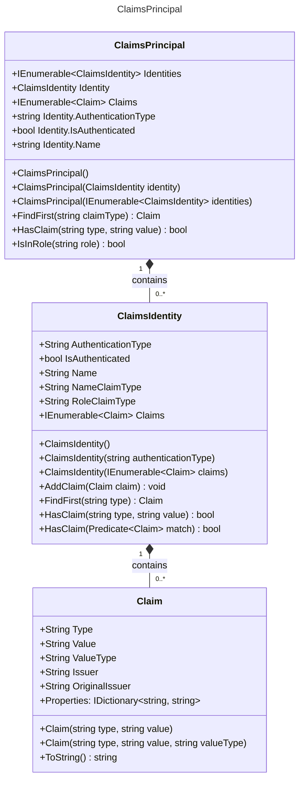

> 在现代 .NET 应用（尤其是 ASP.NET Core）中，ClaimsPrincipal 是身份认证和授权的核心对象。它封装了当前用户的身份信息、角色声明（claims）以及其他安全上下文数据。然而，当你需要将用户身份信息跨服务传递、记录日志、缓存或用于调试时，往往会遇到一个看似简单却颇具挑战的问题：ClaimsPrincipal 无法直接被标准的 JSON 序列化器（如 System.Text.Json 或 Newtonsoft.Json）序列化。

为什么？因为 ClaimsPrincipal 并非设计为可序列化的 DTO（Data Transfer Object，数据传输对象），其内部结构包含接口、只读集合和运行时类型，缺乏公开的构造函数和属性 setter。那么，我们该如何优雅地将其转换为 JSON 字符串，并在需要时还原回来？

本文将带你一步步探索可行的解决方案——从手动提取关键声明，到自定义转换器，再到完整可逆的序列化/反序列化策略，助你在分布式系统、微服务通信或审计日志等场景中灵活处理用户身份信息。

## 第一步，看源码，分析类的结构

不用去反编译，Github上有现成的：https://github.com/dotnet/runtime/tree/main/src/libraries/System.Security.Claims/src/System/Security/Claims

就不挨个贴代码了，我直接整理成类图。



## 第二步，理解三者的关系

### Claim：声明的基本单元

#### 职责

- 表示一个键值对形式的声明（如 `"name" = "Alice"`、`"role" = "Admin"`）。
- 不仅包含类型（Type）和值（Value），还携带元数据，如：
  - ValueType：值的数据类型（如字符串、整数等，默认为 string）。
  - Issuer：声明的颁发者（如 `"https://login.microsoft.com"`）。
  - OriginalIssuer：原始颁发者（用于联合身份场景）。
  - Properties：可扩展的键值对字典，用于存储额外信息。

#### 特点

- 不可变性：一旦创建，其核心属性（`Type`/`Value`）通常不可更改。
- 轻量级：设计为数据载体，无业务逻辑。
- 语义丰富：通过标准声明类型（如 `ClaimTypes.Name`、`ClaimTypes.Role`）实现互操作性。

### ClaimsIdentity：代表一个身份（Identity）

#### 职责

- 封装一组相关的 Claim，构成一个完整的身份视图。
- 提供身份的上下文信息：
  - `AuthenticationType`：认证方式（如 `"Cookies"`、`"JwtBearer"`）。
  - `IsAuthenticated`：是否已通过认证（依赖 `AuthenticationType` 非空）。
  - `Name`：通常映射自 `NameClaimType` 类型的声明（默认为 `ClaimTypes.Name`）。
  - `RoleClaimType`：用于角色判断的声明类型（默认为 `ClaimTypes.Role`）。

#### 关键行为

- `AddClaim(Claim)`：动态添加声明（常用于中间件或策略授权）。
- `FindFirst(string type)`：查找首个匹配类型的声明。
- `HasClaim(...)`：检查是否存在特定声明。

#### 设计思想

- 一个主体（如用户）可以有多个身份（例如：本地登录身份 + 社交账号身份）。
- 支持多身份源（如 Windows 身份、JWT 身份、自定义身份）。

### ClaimsPrincipal：代表一个安全主体（Principal）

#### 职责

- 代表当前用户或系统实体，是安全上下文的顶层容器。
- 包含一个或多个 `ClaimsIdentity` 对象（通过 `Identities` 集合）。
- 提供便捷属性访问主身份（`Identity` 属性返回第一个 `ClaimsIdentity`）。
- 聚合所有身份的声明（`Claims` 属性返回所有 `ClaimsIdentity` 中声明的并集）。

#### 关键行为

- `IsInRole(string role)`：检查是否属于某角色（依据 RoleClaimType 声明）。
- `FindFirst(string claimType)`：跨所有身份查找首个匹配声明。
- `HasClaim(...)`：检查是否存在指定声明。

#### 与线程上下文集成

- 在 ASP.NET Core 中，`HttpContext.User` 的类型就是 `ClaimsPrincipal`。
- 可通过 `Thread.CurrentPrincipal`（.NET Framework）或 `IHttpContextAccessor`（.NET Core）访问。

### 三者协作关系

```txt
ClaimsPrincipal
│
├── ClaimsIdentity #1 (e.g., from JWT)
│   ├── Claim: { Type="name", Value="Alice" }
│   ├── Claim: { Type="role", Value="Admin" }
│   └── Claim: { Type="email", Value="alice@example.com" }
│
└── ClaimsIdentity #2 (e.g., from external provider)
    ├── Claim: { Type="sub", Value="12345" }
    └── Claim: { Type="idp", Value="Google" }
```

## 第三步，设计序列化模型（DTO）

理解了 ClaimsPrincipal 的内部结构后，我们需要设计可序列化的 DTO 来承载这些数据。关键是要保留足够的信息，以便在反序列化时能够完整还原原始对象。

### 设计原则

在设计序列化模型时，我们需要遵循以下原则：

#### 完整性（Completeness）

保留所有关键信息，确保反序列化后的对象与原始对象等价：

- Claim 的所有核心属性（Type、Value、ValueType、Issuer、OriginalIssuer、Properties）
- ClaimsIdentity 的认证上下文（AuthenticationType、NameClaimType、RoleClaimType）
- ClaimsPrincipal 的多身份支持（Identities 集合）

#### 可序列化性（Serializability）

- 使用简单类型（string、int、bool 等）和标准集合（List、Dictionary）
- 避免接口类型、只读属性、私有构造函数等不友好的序列化特性
- 兼容主流序列化器（System.Text.Json、Newtonsoft.Json）

#### 可读性（Readability）

生成的 JSON 应当清晰易读，方便调试和日志记录：

```json
{
  "identities": [
    {
      "authenticationType": "Bearer",
      "nameClaimType": "http://schemas.xmlsoap.org/ws/2005/05/identity/claims/name",
      "roleClaimType": "http://schemas.microsoft.com/ws/2008/06/identity/claims/role",
      "claims": [
        {
          "type": "name",
          "value": "Alice",
          "valueType": "http://www.w3.org/2001/XMLSchema#string",
          "issuer": "LOCAL AUTHORITY"
        }
      ]
    }
  ]
}
```

### DTO 类设计

#### ClaimDto

```cs
public class ClaimDto
{
    /// <summary>
    /// 声明类型（如 "name"、"role"、"email"）
    /// </summary>
    public string Type { get; set; } = string.Empty;

    /// <summary>
    /// 声明值
    /// </summary>
    public string Value { get; set; } = string.Empty;

    /// <summary>
    /// 值的数据类型（默认为 XMLSchema#string）
    /// </summary>
    public string ValueType { get; set; } = ClaimValueTypes.String;

    /// <summary>
    /// 声明颁发者
    /// </summary>
    public string Issuer { get; set; } = ClaimsIdentity.DefaultIssuer;

    /// <summary>
    /// 原始颁发者（联合身份场景）
    /// </summary>
    public string OriginalIssuer { get; set; } = ClaimsIdentity.DefaultIssuer;

    /// <summary>
    /// 自定义属性集合
    /// </summary>
    public Dictionary<string, string>? Properties { get; set; }

    /// <summary>
    /// 从 Claim 创建 DTO
    /// </summary>
    public static ClaimDto FromClaim(Claim claim)
    {
        var dto = new ClaimDto
        {
            Type = claim.Type,
            Value = claim.Value,
            ValueType = claim.ValueType,
            Issuer = claim.Issuer,
            OriginalIssuer = claim.OriginalIssuer
        };

        // 仅在有自定义属性时才序列化
        if (claim.Properties.Count > 0)
        {
            dto.Properties = new Dictionary<string, string>(claim.Properties);
        }

        return dto;
    }

    /// <summary>
    /// 转换为 Claim 对象
    /// </summary>
    public Claim ToClaim()
    {
        var claim = new Claim(Type, Value, ValueType, Issuer, OriginalIssuer);

        // 还原自定义属性
        if (Properties != null)
        {
            foreach (var prop in Properties)
            {
                claim.Properties[prop.Key] = prop.Value;
            }
        }

        return claim;
    }
}
```

#### ClaimsIdentityDto

```cs
public class ClaimsIdentityDto
{
    /// <summary>
    /// 认证类型（如 "Bearer"、"Cookies"）
    /// </summary>
    public string? AuthenticationType { get; set; }

    /// <summary>
    /// 用于标识用户名的声明类型
    /// </summary>
    public string NameClaimType { get; set; } = ClaimsIdentity.DefaultNameClaimType;

    /// <summary>
    /// 用于标识角色的声明类型
    /// </summary>
    public string RoleClaimType { get; set; } = ClaimsIdentity.DefaultRoleClaimType;

    /// <summary>
    /// 声明集合
    /// </summary>
    public List<ClaimDto> Claims { get; set; } = new();

    /// <summary>
    /// 从 ClaimsIdentity 创建 DTO
    /// </summary>
    public static ClaimsIdentityDto FromClaimsIdentity(ClaimsIdentity identity)
    {
        return new ClaimsIdentityDto
        {
            AuthenticationType = identity.AuthenticationType,
            NameClaimType = identity.NameClaimType,
            RoleClaimType = identity.RoleClaimType,
            Claims = identity.Claims.Select(ClaimDto.FromClaim).ToList()
        };
    }

    /// <summary>
    /// 转换为 ClaimsIdentity 对象
    /// </summary>
    public ClaimsIdentity ToClaimsIdentity()
    {
        var claims = Claims.Select(c => c.ToClaim()).ToList();
        return new ClaimsIdentity(
            claims,
            AuthenticationType,
            NameClaimType,
            RoleClaimType
        );
    }
}
```

#### ClaimsPrincipalDto

```cs
public class ClaimsPrincipalDto
{
    /// <summary>
    /// 身份集合
    /// </summary>
    public List<ClaimsIdentityDto> Identities { get; set; } = new();

    /// <summary>
    /// 从 ClaimsPrincipal 创建 DTO
    /// </summary>
    public static ClaimsPrincipalDto FromClaimsPrincipal(ClaimsPrincipal principal)
    {
        return new ClaimsPrincipalDto
        {
            Identities = principal.Identities
                .Select(ClaimsIdentityDto.FromClaimsIdentity)
                .ToList()
        };
    }

    /// <summary>
    /// 转换为 ClaimsPrincipal 对象
    /// </summary>
    public ClaimsPrincipal ToClaimsPrincipal()
    {
        var identities = Identities.Select(i => i.ToClaimsIdentity()).ToList();
        return new ClaimsPrincipal(identities);
    }
}
```

### 使用示例

#### 序列化

```cs
using System.Text.Json;

// 获取当前用户的 ClaimsPrincipal
var principal = httpContext.User;

// 转换为 DTO
var dto = ClaimsPrincipalDto.FromClaimsPrincipal(principal);

// 序列化为 JSON
var json = JsonSerializer.Serialize(dto, new JsonSerializerOptions
{
    WriteIndented = true,  // 格式化输出
    DefaultIgnoreCondition = JsonIgnoreCondition.WhenWritingNull  // 忽略 null 值
});

// 记录到日志或存储
logger.LogInformation("User principal: {Principal}", json);
```

#### 反序列化

```cs
// 从 JSON 还原
var dto = JsonSerializer.Deserialize<ClaimsPrincipalDto>(json);

// 转换为 ClaimsPrincipal
var principal = dto?.ToClaimsPrincipal();

// 使用还原的对象
if (principal != null)
{
    httpContext.User = principal;
    // 或者传递给其他服务
}
```

### 实际应用场景

#### 场景 1：分布式会话存储

```cs
// 将用户身份序列化后存储到 Redis
public async Task SaveUserSession(string sessionId, ClaimsPrincipal principal)
{
    var dto = ClaimsPrincipalDto.FromClaimsPrincipal(principal);
    var json = JsonSerializer.Serialize(dto);
    await redis.StringSetAsync($"session:{sessionId}", json, TimeSpan.FromHours(1));
}

// 从 Redis 还原用户身份
public async Task<ClaimsPrincipal?> LoadUserSession(string sessionId)
{
    var json = await redis.StringGetAsync($"session:{sessionId}");
    if (json.IsNullOrEmpty) return null;

    var dto = JsonSerializer.Deserialize<ClaimsPrincipalDto>(json);
    return dto?.ToClaimsPrincipal();
}
```

#### 场景 2：微服务间传递身份

```cs
// 在 HTTP 请求头中传递用户身份
public async Task<HttpResponseMessage> CallDownstreamService(ClaimsPrincipal principal)
{
    var dto = ClaimsPrincipalDto.FromClaimsPrincipal(principal);
    var json = JsonSerializer.Serialize(dto);

    var request = new HttpRequestMessage(HttpMethod.Get, "https://api.example.com/data");
    request.Headers.Add("X-User-Principal", Convert.ToBase64String(Encoding.UTF8.GetBytes(json)));

    return await httpClient.SendAsync(request);
}
```

#### 场景 3：审计日志

```cs
// 记录用户操作时保存完整的身份信息
public void LogUserAction(ClaimsPrincipal principal, string action, object data)
{
    var dto = ClaimsPrincipalDto.FromClaimsPrincipal(principal);
    var auditLog = new
    {
        Timestamp = DateTime.UtcNow,
        Principal = dto,
        Action = action,
        Data = data
    };

    var json = JsonSerializer.Serialize(auditLog, new JsonSerializerOptions { WriteIndented = true });
    File.AppendAllText("audit.log", json + Environment.NewLine);
}
```

### 性能优化建议

#### 按需序列化

如果只需要部分信息（如用户名和角色），可以创建简化版的 DTO：

```cs
public class SimplePrincipalDto
{
    public string? Name { get; set; }
    public List<string> Roles { get; set; } = new();

    public static SimplePrincipalDto FromClaimsPrincipal(ClaimsPrincipal principal)
    {
        return new SimplePrincipalDto
        {
            Name = principal.Identity?.Name,
            Roles = principal.Claims
                .Where(c => c.Type == ClaimTypes.Role)
                .Select(c => c.Value)
                .ToList()
        };
    }
}
```

#### 缓存序列化结果

对于频繁访问的用户身份信息，可以缓存序列化结果：

```cs
private readonly ConcurrentDictionary<string, string> _cache = new();

public string GetCachedJson(ClaimsPrincipal principal)
{
    var key = principal.FindFirst(ClaimTypes.NameIdentifier)?.Value ?? string.Empty;
    return _cache.GetOrAdd(key, _ =>
    {
        var dto = ClaimsPrincipalDto.FromClaimsPrincipal(principal);
        return JsonSerializer.Serialize(dto);
    });
}
```

#### 避免序列化敏感信息

在序列化前过滤敏感声明：

```cs
public static ClaimsPrincipalDto FromClaimsPrincipalSafe(ClaimsPrincipal principal)
{
    // 定义敏感声明类型
    var sensitiveTypes = new HashSet<string>
    {
        "password",
        "secret",
        "token"
    };

    var dto = new ClaimsPrincipalDto
    {
        Identities = principal.Identities.Select(identity => new ClaimsIdentityDto
        {
            AuthenticationType = identity.AuthenticationType,
            NameClaimType = identity.NameClaimType,
            RoleClaimType = identity.RoleClaimType,
            Claims = identity.Claims
                .Where(c => !sensitiveTypes.Contains(c.Type.ToLowerInvariant()))
                .Select(ClaimDto.FromClaim)
                .ToList()
        }).ToList()
    };

    return dto;
}
```

## 第四步，通过自定义 Converter 进行序列化和反序列化

上一步我们使用 DTO 模式实现了序列化，需要手动转换对象。如果你希望更透明地序列化 ClaimsPrincipal，可以使用 `System.Text.Json` 的自定义转换器（JsonConverter）。这样可以直接对原始对象进行序列化，无需中间的 DTO 层。

### 自定义 Converter 的优势

#### 透明性

直接序列化原始类型，无需手动转换：

```cs
// DTO 方式（需要显式转换）
var dto = ClaimsPrincipalDto.FromClaimsPrincipal(principal);
var json = JsonSerializer.Serialize(dto);

// Converter 方式（直接序列化）
var json = JsonSerializer.Serialize(principal, options);
```

#### 集中化

序列化逻辑集中在 Converter 中，使用时只需配置一次：

```cs
var options = new JsonSerializerOptions();
options.Converters.Add(new ClaimsPrincipalConverter());
// 全局使用，无需每次转换
```

#### 类型安全

反序列化直接返回目标类型，无需额外转换：

```cs
var principal = JsonSerializer.Deserialize<ClaimsPrincipal>(json, options);
// 直接得到 ClaimsPrincipal，不是 DTO
```

### 实现自定义 Converter

#### ClaimConverter

```cs
using System.Security.Claims;
using System.Text.Json;
using System.Text.Json.Serialization;

public class ClaimConverter : JsonConverter<Claim>
{
    public override Claim? Read(ref Utf8JsonReader reader, Type typeToConvert, JsonSerializerOptions options)
    {
        if (reader.TokenType != JsonTokenType.StartObject)
        {
            throw new JsonException("Expected StartObject token");
        }

        string? type = null;
        string? value = null;
        string? valueType = ClaimValueTypes.String;
        string? issuer = ClaimsIdentity.DefaultIssuer;
        string? originalIssuer = ClaimsIdentity.DefaultIssuer;
        Dictionary<string, string>? properties = null;

        while (reader.Read())
        {
            if (reader.TokenType == JsonTokenType.EndObject)
            {
                break;
            }

            if (reader.TokenType != JsonTokenType.PropertyName)
            {
                throw new JsonException("Expected PropertyName token");
            }

            string propertyName = reader.GetString()!;
            reader.Read();

            switch (propertyName.ToLowerInvariant())
            {
                case "type":
                    type = reader.GetString();
                    break;
                case "value":
                    value = reader.GetString();
                    break;
                case "valuetype":
                    valueType = reader.GetString() ?? ClaimValueTypes.String;
                    break;
                case "issuer":
                    issuer = reader.GetString() ?? ClaimsIdentity.DefaultIssuer;
                    break;
                case "originalissuer":
                    originalIssuer = reader.GetString() ?? ClaimsIdentity.DefaultIssuer;
                    break;
                case "properties":
                    properties = JsonSerializer.Deserialize<Dictionary<string, string>>(ref reader, options);
                    break;
                default:
                    reader.Skip();
                    break;
            }
        }

        if (string.IsNullOrEmpty(type) || value == null)
        {
            throw new JsonException("Claim must have Type and Value");
        }

        var claim = new Claim(type, value, valueType, issuer, originalIssuer);

        if (properties != null)
        {
            foreach (var prop in properties)
            {
                claim.Properties[prop.Key] = prop.Value;
            }
        }

        return claim;
    }

    public override void Write(Utf8JsonWriter writer, Claim value, JsonSerializerOptions options)
    {
        writer.WriteStartObject();

        writer.WriteString("type", value.Type);
        writer.WriteString("value", value.Value);
        writer.WriteString("valueType", value.ValueType);
        writer.WriteString("issuer", value.Issuer);
        writer.WriteString("originalIssuer", value.OriginalIssuer);

        if (value.Properties.Count > 0)
        {
            writer.WritePropertyName("properties");
            JsonSerializer.Serialize(writer, value.Properties, options);
        }

        writer.WriteEndObject();
    }
}
```

#### ClaimsIdentityConverter

```cs
public class ClaimsIdentityConverter : JsonConverter<ClaimsIdentity>
{
    public override ClaimsIdentity? Read(ref Utf8JsonReader reader, Type typeToConvert, JsonSerializerOptions options)
    {
        if (reader.TokenType != JsonTokenType.StartObject)
        {
            throw new JsonException("Expected StartObject token");
        }

        string? authenticationType = null;
        string nameClaimType = ClaimsIdentity.DefaultNameClaimType;
        string roleClaimType = ClaimsIdentity.DefaultRoleClaimType;
        List<Claim>? claims = null;

        while (reader.Read())
        {
            if (reader.TokenType == JsonTokenType.EndObject)
            {
                break;
            }

            if (reader.TokenType != JsonTokenType.PropertyName)
            {
                throw new JsonException("Expected PropertyName token");
            }

            string propertyName = reader.GetString()!;
            reader.Read();

            switch (propertyName.ToLowerInvariant())
            {
                case "authenticationtype":
                    authenticationType = reader.GetString();
                    break;
                case "nameclaimtype":
                    nameClaimType = reader.GetString() ?? ClaimsIdentity.DefaultNameClaimType;
                    break;
                case "roleclaimtype":
                    roleClaimType = reader.GetString() ?? ClaimsIdentity.DefaultRoleClaimType;
                    break;
                case "claims":
                    claims = JsonSerializer.Deserialize<List<Claim>>(ref reader, options);
                    break;
                default:
                    reader.Skip();
                    break;
            }
        }

        return new ClaimsIdentity(
            claims ?? new List<Claim>(),
            authenticationType,
            nameClaimType,
            roleClaimType
        );
    }

    public override void Write(Utf8JsonWriter writer, ClaimsIdentity value, JsonSerializerOptions options)
    {
        writer.WriteStartObject();

        writer.WriteString("authenticationType", value.AuthenticationType);
        writer.WriteString("nameClaimType", value.NameClaimType);
        writer.WriteString("roleClaimType", value.RoleClaimType);

        writer.WritePropertyName("claims");
        JsonSerializer.Serialize(writer, value.Claims.ToList(), options);

        writer.WriteEndObject();
    }
}
```

#### ClaimsPrincipalConverter

```cs
public class ClaimsPrincipalConverter : JsonConverter<ClaimsPrincipal>
{
    public override ClaimsPrincipal? Read(ref Utf8JsonReader reader, Type typeToConvert, JsonSerializerOptions options)
    {
        if (reader.TokenType != JsonTokenType.StartObject)
        {
            throw new JsonException("Expected StartObject token");
        }

        List<ClaimsIdentity>? identities = null;

        while (reader.Read())
        {
            if (reader.TokenType == JsonTokenType.EndObject)
            {
                break;
            }

            if (reader.TokenType != JsonTokenType.PropertyName)
            {
                throw new JsonException("Expected PropertyName token");
            }

            string propertyName = reader.GetString()!;
            reader.Read();

            if (propertyName.Equals("identities", StringComparison.OrdinalIgnoreCase))
            {
                identities = JsonSerializer.Deserialize<List<ClaimsIdentity>>(ref reader, options);
            }
            else
            {
                reader.Skip();
            }
        }

        return new ClaimsPrincipal(identities ?? new List<ClaimsIdentity>());
    }

    public override void Write(Utf8JsonWriter writer, ClaimsPrincipal value, JsonSerializerOptions options)
    {
        writer.WriteStartObject();

        writer.WritePropertyName("identities");
        JsonSerializer.Serialize(writer, value.Identities.ToList(), options);

        writer.WriteEndObject();
    }
}
```

### 使用自定义 Converter

#### 基本使用

```cs
// 配置序列化选项
var options = new JsonSerializerOptions
{
    WriteIndented = true,
    DefaultIgnoreCondition = JsonIgnoreCondition.WhenWritingNull,
    Converters =
    {
        new ClaimConverter(),
        new ClaimsIdentityConverter(),
        new ClaimsPrincipalConverter()
    }
};

// 序列化
var principal = httpContext.User;
var json = JsonSerializer.Serialize(principal, options);

// 反序列化
var deserializedPrincipal = JsonSerializer.Deserialize<ClaimsPrincipal>(json, options);
```

#### 全局配置

在 ASP.NET Core 中，可以全局配置序列化选项：

```cs
// Program.cs 或 Startup.cs
builder.Services.Configure<JsonOptions>(options =>
{
    options.JsonSerializerOptions.Converters.Add(new ClaimConverter());
    options.JsonSerializerOptions.Converters.Add(new ClaimsIdentityConverter());
    options.JsonSerializerOptions.Converters.Add(new ClaimsPrincipalConverter());
});
```

#### 创建扩展方法

为了更方便使用，可以创建扩展方法：

```cs
public static class ClaimsPrincipalExtensions
{
    private static readonly JsonSerializerOptions DefaultOptions = new()
    {
        WriteIndented = true,
        DefaultIgnoreCondition = JsonIgnoreCondition.WhenWritingNull,
        Converters =
        {
            new ClaimConverter(),
            new ClaimsIdentityConverter(),
            new ClaimsPrincipalConverter()
        }
    };

    /// <summary>
    /// 将 ClaimsPrincipal 序列化为 JSON
    /// </summary>
    public static string ToJson(this ClaimsPrincipal principal, JsonSerializerOptions? options = null)
    {
        return JsonSerializer.Serialize(principal, options ?? DefaultOptions);
    }

    /// <summary>
    /// 从 JSON 反序列化为 ClaimsPrincipal
    /// </summary>
    public static ClaimsPrincipal? FromJson(string json, JsonSerializerOptions? options = null)
    {
        return JsonSerializer.Deserialize<ClaimsPrincipal>(json, options ?? DefaultOptions);
    }

    /// <summary>
    /// 将 ClaimsPrincipal 安全地序列化为 JSON（过滤敏感信息）
    /// </summary>
    public static string ToJsonSafe(this ClaimsPrincipal principal, HashSet<string>? sensitiveTypes = null)
    {
        sensitiveTypes ??= new HashSet<string>(StringComparer.OrdinalIgnoreCase)
        {
            "password",
            "secret",
            "token",
            "apikey"
        };

        // 创建过滤后的副本
        var filteredIdentities = principal.Identities.Select(identity =>
        {
            var filteredClaims = identity.Claims
                .Where(c => !sensitiveTypes.Contains(c.Type))
                .ToList();

            return new ClaimsIdentity(
                filteredClaims,
                identity.AuthenticationType,
                identity.NameClaimType,
                identity.RoleClaimType
            );
        }).ToList();

        var filteredPrincipal = new ClaimsPrincipal(filteredIdentities);
        return filteredPrincipal.ToJson();
    }
}
```

使用扩展方法：

```cs
// 序列化
var json = httpContext.User.ToJson();

// 安全序列化（自动过滤敏感信息）
var safeJson = httpContext.User.ToJsonSafe();

// 反序列化
var principal = ClaimsPrincipalExtensions.FromJson(json);
```

### 实际应用示例

#### 中间件中传递用户身份

```cs
public class UserPrincipalMiddleware
{
    private readonly RequestDelegate _next;

    public UserPrincipalMiddleware(RequestDelegate next)
    {
        _next = next;
    }

    public async Task InvokeAsync(HttpContext context)
    {
        // 如果请求头包含序列化的用户身份，则还原
        if (context.Request.Headers.TryGetValue("X-User-Principal", out var principalHeader))
        {
            try
            {
                var json = Encoding.UTF8.GetString(Convert.FromBase64String(principalHeader!));
                var principal = ClaimsPrincipalExtensions.FromJson(json);

                if (principal != null)
                {
                    context.User = principal;
                }
            }
            catch (Exception ex)
            {
                // 记录错误但不中断请求
                Console.WriteLine($"Failed to deserialize principal: {ex.Message}");
            }
        }

        await _next(context);
    }
}
```

#### 分布式缓存

```cs
public class UserSessionService
{
    private readonly IDistributedCache _cache;

    public UserSessionService(IDistributedCache cache)
    {
        _cache = cache;
    }

    public async Task SaveSessionAsync(string sessionId, ClaimsPrincipal principal)
    {
        var json = principal.ToJson();
        var bytes = Encoding.UTF8.GetBytes(json);

        await _cache.SetAsync(sessionId, bytes, new DistributedCacheEntryOptions
        {
            AbsoluteExpirationRelativeToNow = TimeSpan.FromHours(1)
        });
    }

    public async Task<ClaimsPrincipal?> GetSessionAsync(string sessionId)
    {
        var bytes = await _cache.GetAsync(sessionId);
        if (bytes == null) return null;

        var json = Encoding.UTF8.GetString(bytes);
        return ClaimsPrincipalExtensions.FromJson(json);
    }
}
```

### DTO vs Converter：如何选择？

#### 使用 DTO 的场景

_优点_：

- 显式转换，逻辑清晰
- 可以灵活定制传输的数据结构
- 更容易进行数据验证和转换
- 不依赖特定的序列化框架

_适用场景_：

- API 数据传输（需要版本控制和向后兼容）
- 跨语言/跨平台通信
- 需要数据脱敏或转换的场景
- 长期存储的数据格式

_示例_：

```cs
// 为前端提供简化的用户信息
public class UserInfoDto
{
    public string UserId { get; set; }
    public string Name { get; set; }
    public List<string> Roles { get; set; }

    public static UserInfoDto FromPrincipal(ClaimsPrincipal principal)
    {
        return new UserInfoDto
        {
            UserId = principal.FindFirst(ClaimTypes.NameIdentifier)?.Value ?? "",
            Name = principal.Identity?.Name ?? "",
            Roles = principal.Claims
                .Where(c => c.Type == ClaimTypes.Role)
                .Select(c => c.Value)
                .ToList()
        };
    }
}
```

#### 使用 Converter 的场景

_优点_：

- 透明序列化，使用更简洁
- 保持原始类型，无需转换
- 全局配置一次，处处可用
- 更好地支持嵌套对象序列化

_适用场景_：

- 内部服务通信（同技术栈）
- 临时缓存和会话存储
- 调试和日志记录
- 需要完整保留对象状态

_示例_：

```cs
// 缓存完整的用户身份
public async Task CacheUserPrincipal(string key, ClaimsPrincipal principal)
{
    // 直接序列化，无需转换
    var json = principal.ToJson();
    await _cache.SetStringAsync(key, json, TimeSpan.FromMinutes(30));
}
```

#### 混合使用

在实际项目中，两种方式可以共存：

```cs
public class UserService
{
    // 对外 API：使用 DTO
    public UserInfoDto GetPublicUserInfo(ClaimsPrincipal principal)
    {
        return UserInfoDto.FromPrincipal(principal);
    }

    // 内部缓存：使用 Converter
    public async Task CacheUserSession(string sessionId, ClaimsPrincipal principal)
    {
        var json = principal.ToJson();
        await SaveToCache(sessionId, json);
    }

    // 审计日志：使用 Converter（安全模式）
    public void LogUserAction(ClaimsPrincipal principal, string action)
    {
        var json = principal.ToJsonSafe();
        _logger.LogInformation("Action: {Action}, User: {User}", action, json);
    }
}
```

### 性能对比

```cs
using BenchmarkDotNet.Attributes;
using BenchmarkDotNet.Running;

[MemoryDiagnoser]
public class SerializationBenchmark
{
    private ClaimsPrincipal _principal;
    private JsonSerializerOptions _options;

    [GlobalSetup]
    public void Setup()
    {
        var claims = new[]
        {
            new Claim(ClaimTypes.Name, "Alice"),
            new Claim(ClaimTypes.Email, "alice@example.com"),
            new Claim(ClaimTypes.Role, "Admin"),
            new Claim(ClaimTypes.Role, "User")
        };

        var identity = new ClaimsIdentity(claims, "Bearer");
        _principal = new ClaimsPrincipal(identity);

        _options = new JsonSerializerOptions
        {
            Converters =
            {
                new ClaimConverter(),
                new ClaimsIdentityConverter(),
                new ClaimsPrincipalConverter()
            }
        };
    }

    [Benchmark]
    public string SerializeWithDto()
    {
        var dto = ClaimsPrincipalDto.FromClaimsPrincipal(_principal);
        return JsonSerializer.Serialize(dto);
    }

    [Benchmark]
    public string SerializeWithConverter()
    {
        return JsonSerializer.Serialize(_principal, _options);
    }

    [Benchmark]
    public ClaimsPrincipal DeserializeWithDto()
    {
        var dto = ClaimsPrincipalDto.FromClaimsPrincipal(_principal);
        var json = JsonSerializer.Serialize(dto);
        var deserializedDto = JsonSerializer.Deserialize<ClaimsPrincipalDto>(json);
        return deserializedDto!.ToClaimsPrincipal();
    }

    [Benchmark]
    public ClaimsPrincipal DeserializeWithConverter()
    {
        var json = JsonSerializer.Serialize(_principal, _options);
        return JsonSerializer.Deserialize<ClaimsPrincipal>(json, _options)!;
    }
}

// 运行基准测试
// BenchmarkRunner.Run<SerializationBenchmark>();
```

_预期结果_：

- Converter 方式通常略快（少一次对象转换）
- 内存使用相近
- 两者性能差异在大多数场景下可忽略

### 注意事项

#### 空值处理

确保 `Converter` 正确处理 `null` 值：

```cs
public override void Write(Utf8JsonWriter writer, ClaimsPrincipal? value, JsonSerializerOptions options)
{
    if (value == null)
    {
        writer.WriteNullValue();
        return;
    }

    // ... 正常序列化逻辑
}
```

#### 循环引用

虽然 `ClaimsPrincipal` 结构简单，不会出现循环引用，但在扩展时需注意：

```cs
var options = new JsonSerializerOptions
{
    ReferenceHandler = ReferenceHandler.IgnoreCycles,  // 处理循环引用
    Converters = { /* ... */ }
};
```

#### 版本兼容性

序列化格式应考虑向后兼容：

```cs
public override ClaimsIdentity? Read(ref Utf8JsonReader reader, Type typeToConvert, JsonSerializerOptions options)
{
    // 为新增字段提供默认值
    string nameClaimType = ClaimsIdentity.DefaultNameClaimType;

    // 兼容旧版本 JSON（可能缺少某些字段）
    // ...
}
```
