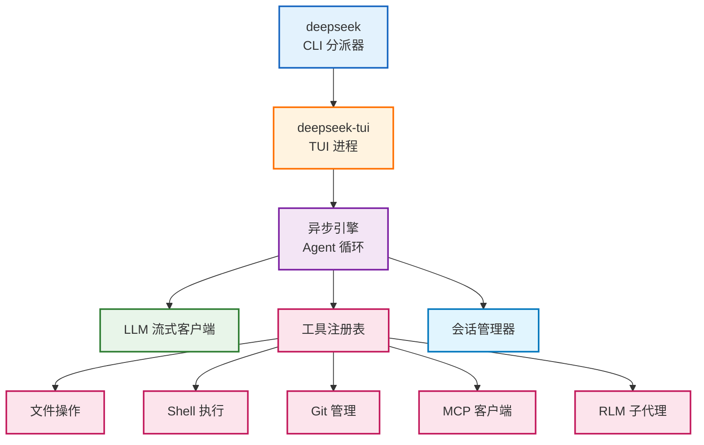

## 一、DeepSeek TUI 是什么？ ##

DeepSeek TUI 是一个终端原生的 AI 编码 Agent，专门为 DeepSeek V4 大模型 构建。与其说它是一个聊天界面，不如说它是一个全功能的终端开发环境——内置文件操作、Shell 执行、Git 管理、LSP 诊断、MCP 协议支持等一系列开发工具。

官方描述："A terminal-native coding agent built around DeepSeek V4's 1M-token context and prefix cache."

> 核心特色：以单个 Rust 二进制文件分发，无需安装 Node.js、Python 等运行时，下载即用。

DeepSeek TUI是一款基于DeepSeek V4的开源终端编程智能体（类似Claude Code），原生支持100万token的上下文和思考模式流式输出，目前在在Github上已有31k+star。

DeepSeek TUI的主要功能如下：

- Auto 模式：每轮对话能根据任务复杂度自动选择模型和推理强度。
- 思考模式流式输出：能实时观察模型在解决问题时的思维链。
- 完整工具集：内置文件操作、shell 执行、git、网页搜索/浏览、子智能体、MCP服务器等工具。
- 100万token上下文：支持上下文跟踪、手动或配置压缩。
- 三种交互模式：Plan（只读模式）、Agent（任务执行需审批的默认模式）、YOLO（工作区任务自动执行模式）。
- 推理强度档位：有off → high → max三种不同档位。
- MCP协议：支持通过MCP服务器扩展智能体的能力。
- 多语言和主题选择器：支持中文界面，有亮/暗色主题。

下面是DeepSeek TUI使用过程中的效果图，界面还是挺炫酷的！

{data-zoomable}

{data-zoomable}

{data-zoomable}

{data-zoomable}

### 核心亮点速览 ###

| 特性 | 说明 |
| :--- | :--- |
| **纯 Rust 实现** | 单二进制分发，无需 Node.js/Python 运行时 |
| **1M Token 上下文** | 专为 DeepSeek V4 的超长上下文设计 |
| **三模式交互** | Plan（只读）→ Agent（审批）→ YOLO（自动），渐进式授权 |
| **Ratatui UI** | 基于 Rust Ratatui 框架的终端界面，DeepSeek 蓝色主题 |
| **MCP 协议支持** | 兼容 Model Context Protocol 生态 |
| **LSP 原生集成** | rust-analyzer、pyright、typescript-language-server 等 |
| **会话管理** | 保存/恢复、Checkpoint、工作区回滚 |
| **技能系统** | SKILL.md 可发现安装，支持 GitHub 仓库安装 |
| **超低价格** | 缓存命中低至 $0.0036/百万 token |


## 二、架构设计 ##

### 分派器架构 ###

DeepSeek TUI 采用"分派器 → TUI → 引擎 → 工具"的四层架构：



- deepseek：轻量级 CLI 分派器，负责参数解析和进程管理
- deepseek-tui：实际的 TUI 进程，使用 Ratatui 框架渲染界面
- 引擎：异步 Agent 循环，处理用户输入 → LLM 调用 → 工具调用 → 结果返回的完整链路
- 两个二进制文件都不可或缺

### 三种交互模式 ###

DeepSeek TUI 设计了三种递进式的交互模式，覆盖从安全分析到完全自动化的全场景：

| 模式 | Tab 键切换 | 权限 | 适用场景 |
| :--- | :--- | :--- | :--- |
| **Plan** | 第 1 次按 Tab | **只读**，拒绝文件写入，Shell 执行需审批 | 代码分析、架构探索 |
| **Agent** | 第 2 次按 Tab | **标准模式**，工具调用逐次审批 | 日常开发、功能实现 |
| **YOLO** | 第 3 次按 Tab | **自动批准**所有调用 | 批量操作、自动化脚本 |

> 合理使用顺序：先用 Plan 分析代码结构和影响范围 → 切到 Agent 逐次执行 → 确认安全后用 YOLO 批量推进。


三、技术栈

| 层级 | 技术选型 | 说明 |
| :--- | :--- | :--- |
| **核心语言** | **Rust (99.3%)** | 保证性能、内存安全与极低资源占用 |
| **UI 框架** | **Ratatui** | 基于 Rust 的终端 UI 库，提供流畅的 TUI 体验 |
| **包分发** | **npm** / **crates.io** | `deepseek-tui` (npm) 与 `deepseek-tui-cli` (crates) 双轨分发 |
| **LLM API** | **OpenAI-compatible** | 兼容 Chat Completions API，支持多模型接入 |
| **协议支持** | **MCP** / **HTTP/SSE** | Model Context Protocol 与流式运行时 API |
| **LSP 支持** | **多语言全覆盖** | rust-analyzer, pyright, typescript-language-server, gopls, clangd |
| **发布渠道** | **GitHub Releases** | 预编译二进制、Cargo、npm、Docker 全平台覆盖 |


## 四、快速安装 ##

### 系统要求 ###

任何支持 Rust Tier-1 目标的系统：Linux x64/ARM64、macOS x64/ARM64、Windows x64

### 安装方式 ###

```bash
# 方式一：npm（推荐）
npm install -g deepseek-tui

# 方式二：Cargo
cargo install deepseek-tui-cli --locked
cargo install deepseek-tui --locked

# 方式三：预编译二进制
# 从 GitHub Releases 下载对应平台的二进制文件
# Linux x64/ARM64、macOS x64/ARM64、Windows x64

# 方式四：Docker
# Dockerfile 已包含在仓库中
```

在项目的 Release 页面下载到的 Windows 可执行文件，并不是 `codewhale.exe`。正确的文件名是 `codewhale-windows-x64.exe` 和 `codewhale-tui-windows-x64.exe`。

这是安装步骤，你可以一步步来操作。

#### ✅ 第一步：找到并重命名二进制文件 ####

在 GitHub Releases 页面找到并下载这两个文件：

- `codewhale-windows-x64.exe`

- `cododewhale-tui-windows-x64.exe`

在你电脑上创建一个文件夹，比如 D:\CodeWhale，把这两个文件都放进去。

关键一步：*对这两个文件进行重命名*：

- 将 `codewhale-windows-x64.exe` 重命名为 `codewhale.exe`。

- 将 `cododewhale-tui-windows-x64.exe` 重命名为 `codewhale-tui.exe`。

#### ⚙️ 第二步：正确配置环境变量 ####

为了让系统在任何目录下都能识别 `codewhale` 命令，需要把 `D:\CodeWhale` 这个文件夹路径添加到系统环境变量 PATH 中。

1. 按下 `Win + R` 键，输入 `sysdm.cpl` 并回车。

2. 在弹出的“系统属性”窗口中，切换到“高级”选项卡，然后点击“环境变量(N)...”按钮。

3. 在“系统变量”列表中找到 Path 变量，选中它并点击“编辑(I)...”按钮。

4. 在弹出的“编辑环境变量”窗口中，点击“新建(N)”，然后输入 `D:\CodeWhale`（即你存放两个 `.exe` 文件的文件夹路径）。

5. 一路点击“确定”保存所有窗口。

#### 🚀 第三步：完成安装与配置 ####

重新打开一个命令提示符或 PowerShell 窗口。

*验证环境变量*：

在新打开的终端输入 `codewhale --version`。如果能正常显示版本信息，说明环境变量配置成功。

*登录认证*：

你需要使用 API Key 进行登录，参考命令如下：

```bash
codewhale login --api-key "你的_DeepSeek_API_密钥"
```

如果没有 API Key，可以登录 DeepSeek 平台 获取。

*进行健康检查（可选）*：

可以运行诊断命令，确保一切就绪：

```bash
codewhale doctor
```

#### 📌 额外提醒 ####

你可以把这个 `D:\CodeWhale` 理解成一个“搬运工具”，通过 PATH 路径随时调用。而你的项目文件夹才是这个工具真正要处理和管理的“工作室”。

为了以后管理方便，你可以直接把 `D:\CodeWhale` 这个文件夹备份起来。以后重装系统后，只要把这个文件夹重新放回原位置，并把路径再添加到 PATH 里就能直接用了，不用再去下载。

#### 🧰 附：你的错误排查步骤 ####

如果操作后遇到问题，可以按这个步骤检查一下：

- 确认两个 `.exe` 文件都已下载且放在了同一个文件夹里。

- 确认已经完成了重命名步骤，这是命令能被识别的关键。

- 确认已将正确的文件夹路径添加到系统的 PATH 变量中。

- 务必重新打开一个新的终端窗口，然后再执行 codewhale 命令。

> 全局配置目录 `C:\Users\{UserName}\.codewhale`

### 认证配置 ###

```bash
# 方式一（推荐）：交互式设置
deepseek auth set --provider deepseek

# 方式二：环境变量
export DEEPSEEK_API_KEY=your_key_here
```

### 支持的大模型供应商 ###

| 供应商 | 配置方式 |
| :--- | :--- |
| DeepSeek (默认) | `--provider deepseek` |
| NVIDIA NIM | `--provider nvidia` |
| Fireworks AI | `--provider fireworks` |
| SGLang (自托管) | `--provider sglang` + 自定义 Base URL |

## 五、核心特性深度解析 ##

### 1M Token 超长上下文 ###

DeepSeek TUI 专为 DeepSeek V4 的 1M token 上下文窗口 设计。当上下文占满时，系统会自动执行智能压缩，而不是粗暴截断。

这意味着你可以：

- 把整个代码仓库加载到上下文中
- 进行跨文件的全局重构
- 维护长时间的多轮对话不丢失上下文
- 缓存命中时成本极低

### 推理模式（Thinking Mode） ###

DeepSeek TUI 支持流式显示 DeepSeek 的思维链推理过程：

```text
正常模式：仅显示最终回复
思考模式：实时显示模型的推理过程
```

通过 Shift+Tab 可以在关闭 → 高 → 最大三个推理努力级别间循环切换。

### 原生 RLM 批处理 ###

rlm_query 工具可以派生出 1 到 16 个并行子代理，用于批量分析任务：

- 并行审查多个文件
- 并发执行多项分析
- 结果自动汇总合并

这相当于内置了一个轻量级的子代理并行系统。

### 会话与工作区管理 ###

DeepSeek TUI 的会话管理能力远超一般的 AI 编码工具：

- 保存/恢复：随时保存会话，下次 Ctrl+R 恢复
- Checkpoint：关键节点创建检查点
- 工作区回滚：通过侧边 Git 快照（pre/post-turn）实现回滚，与你的项目 Git 仓库完全独立
- Composer 暂存：Ctrl+S 暂存当前提示，/stash list、/stash pop、/stash clear 管理

### LSP 集成 ###

DeepSeek TUI 内置了多语言 LSP 客户端，编辑文件后自动触发诊断：

- 支持 rust-analyzer、pyright、typescript-language-server、gopls、clangd
- 自动检测项目中的语言服务器
- 工具编辑完成后立即显示诊断结果
- 无需切换编辑器即可获得 IDE 级别的反馈

### 技能系统 ###

技能以 SKILL.md 文件形式存在，可以被自动发现：

```bash
# 搜索路径（按优先级）
1. .agents/skills/
2. skills/
3. ~/.deepseek/skills/

# 从 GitHub 安装社区技能
/skill install github:<owner>/<repo>
```

技能系统与 Claude Code 的 Skills 生态类似，但更轻量。
 
### MCP 协议支持 ###

兼容 Model Context Protocol，可以接入任意 MCP 服务器：

- 配置文件配置 MCP 服务器
- 底部状态栏显示 MCP 健康状态指示器
- 支持标准 MCP 工具调用

## 六、模型定价 ##

DeepSeek TUI 的目标模型是 DeepSeek V4，定价极低：

| 模型 | 缓存命中 | 缓存未命中 | 输出 |
| :--- | :--- | :--- | :--- |
| deepseek-v4-pro | $0.003625 | $0.435 | $0.87 |
| deepseek-v4-flash | $0.0028 | $0.14 | $0.28 |

> 缓存命中价格仅为 $0.0028–0.0036/百万 token——这在所有 AI 编码工具中几乎是成本最低的。

Pro 版当永久 75% 限时折扣。

## 七、键盘快捷键 ##

| 快捷键 | 功能 |
| :--- | :--- |
| Tab | 切换 Plan → Agent → YOLO 模式 |
| Shift+Tab | 切换推理努力级别 |
| F1 / Ctrl+/ | 搜索帮助覆盖 |
| Ctrl+K | 命令面板 |
| Ctrl+R | 恢复会话 |
| Alt+R | 搜索历史 |
| Alt+↑ | 编辑已排队消息 |
| Ctrl+S | 暂存 Composer 提示 |
| Esc | 返回/关闭 |
| @path | 附加文件 |

## 八、配置与自定义 ##

### 配置文件 ###

`~/.deepseek/config.toml`，提供了完整的 `config.example.toml` 参考。

### 环境变量覆盖 ###

| 变量 | 作用 |
| :--- | :--- |
| `DEEPSEEK_API_KEY` | API 密钥 |
| `DEEPSEEK_BASE_URL` | 自定义 API 地址 |
| `DEEPSEEK_MODEL` | 指定模型 |
| `DEEPSEEK_PROVIDER` | 指定供应商 |
| `DEEPSEEK_PROFILE` | 指定配置 Profile |
| `NO_ANIMATIONS=1` | 禁用动画（无障碍） |
| `SSL_CERT_FILE` | 企业代理证书 |

### 多语言支持 ###

UI 语言支持自动检测，内置：简体中文、日语、葡萄牙语（巴西），英语为回退项。

通过 `locale` 配置项设置。

### 生命周期钩子 ###

DeepSeek TUI 支持事件钩子系统，通过 `/hooks` 查看当前钩子列表。

## 九、安全特性 ##

DeepSeek TUI 在安全方面做了细致的设计：

- 项目配置锁定：项目级配置不能覆盖安全敏感设置
- SSRF 防护：`fetch_url` 工具有 SSRF 保护
- Execpolicy：Shell 命令匹配使用 heredoc 解析
- SSL 证书：支持 `SSL_CERT_FILE` 企业代理证书
- 键盘清理：崩溃时自动清理终端键盘状态

## 十、与其他 AI 编码 Agent 对比 ##

| 维度 | DeepSeek TUI | OpenCode | Claude Code | Hermes Agent |
| :--- | :--- | :--- | :--- | :--- |
| **语言** | Rust (99%) | TypeScript + Rust | TypeScript | Python |
| **运行时** | 单二进制 | Node.js | Node.js | Python/uv |
| **上下文** | 1M token | 标准 | 标准 | 标准 |
| **价格** | 极低 ($0.003起) | 由模型决定 | 订阅制 $20/月 | 由模型决定 |
| **模式** | Plan/Agent/YOLO | Build/Plan | 单一模式 | 多 Agent |
| **LSP** | ☑️ 内置 | ☑️ 内置 | ❌ | ❌ |
| **MCP** | ☑️ | ☑️ | ☑️ | ☑️ |
| **Stars** | 2.9K | 153K | — | 129K |
| **协议** | MIT | MIT | 闭源 | MIT |

## 十一、适用场景 ##

### DeepSeek V4 用户 ###

如果你正在使用或计划使用 DeepSeek V4，这是最原生的编码 Agent 选择——充分利用 1M 上下文和前缀缓存优势。

### 成本敏感型开发者 ###

DeepSeek V4 的定价极低（缓存命中 $0.003/百万 token），配合 TUI 的缓存机制，可以以极低成本完成大量编码工作。

### Rust 和终端爱好者 ###

纯 Rust 实现、单二进制分发、Ratatui 终端 UI——对于 Rust 爱好者和终端重度用户来说，DeepSeek TUI 本身就是一件值得体验的作品。

### 需要精细权限控制 ###

Plan（只读）→ Agent（审批）→ YOLO（自动）的三级递进模式，让用户可以针对不同场景选择合适的授权级别。

## 十二、总结 ##

DeepSeek TUI 是 AI 编码 Agent 领域一个独特的存在。它以纯 Rust 实现、单二进制分发的方式，提供了一套完整的终端开发环境。专为 DeepSeek V4 的 1M token 上下文 优化，配合极低的 API 定价，在成本和性能之间找到了很好的平衡点。

三模式交互设计（Plan → Agent → YOLO）、LSP 内置集成、MCP 协议支持、技能系统……该有的能力一个不少。如果你已经是 DeepSeek 的用户，或者想探索一种更轻量、更便宜的 AI 编码方式，值得一试。


*快速开始*：

```bash
npm install -g deepseek-tui
deepseek auth set --provider deepseek
deepseek
```

> 具体参照  [为 DeepSeek V4 而生的终端编程智能体。](https://codewhale.net/zh)
