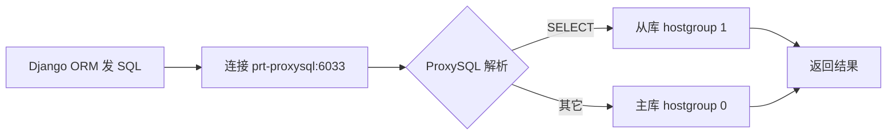
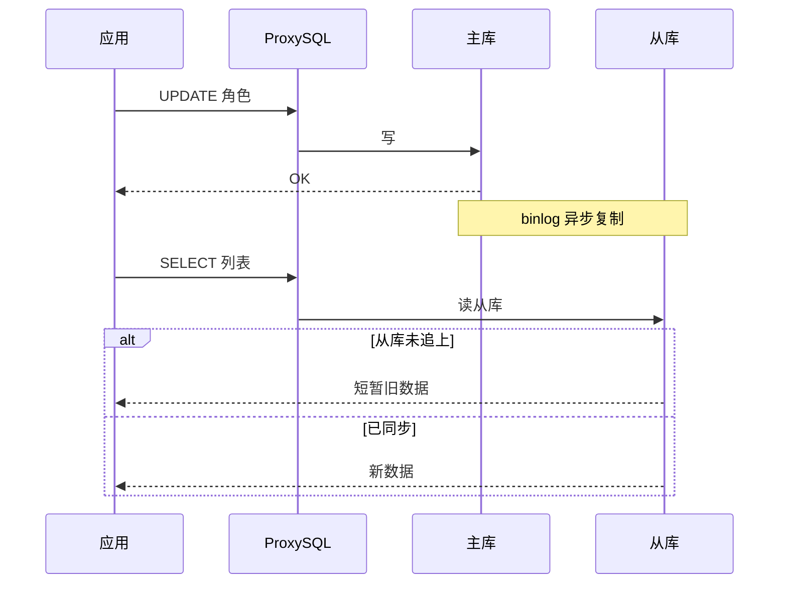
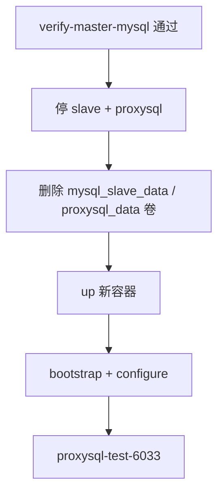
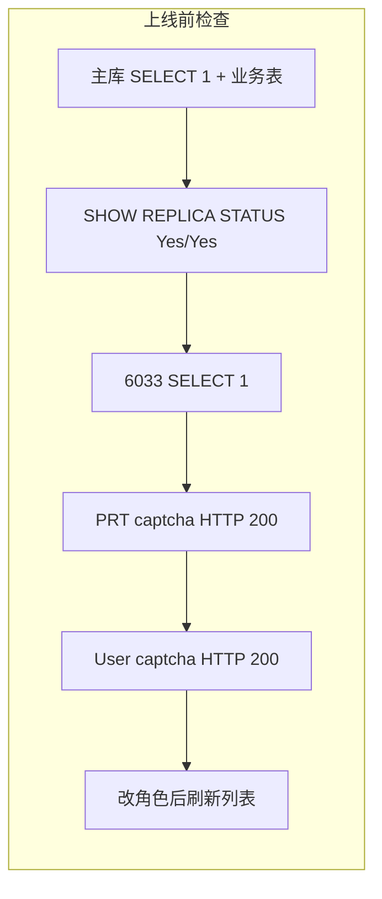

## 要解决什么问题 ##

典型场景：网关后面挂着 协议/业务服务（PRT） 和 用户中心（User），二者共用同一个 MySQL 库（例如 `PRT_DB`），平时各连 `prt-mysql:3306`。读请求多了之后，希望：

- 写（INSERT / UPDATE / DELETE）仍走主库，保证一致；
- 读（SELECT）分流到从库，减轻主库压力；
- 不拆掉 已有主库数据卷，避免「为了读写分离重装数据库」。

常见做法是：*主从复制 + 中间件按 SQL 类型路由*。本文采用 *MySQL 8.0 主从 + ProxySQL 2.6*。

## 目标架构 ##

### 组件一览 ###

| 组件 | 角色 | 端口（示例） |
| :--- | :--- | :--- |
| `prt-mysql` | 主库，历史数据卷保留 | 3306 |
| `prt-mysql-slave` | 从库，新卷 | 3306（容器内） |
| `prt-proxysql` | 读写代理，应用连此 | 6033（业务）/ 6032（管理） |
| `prt-django` / `uc-django` | 应用，改 `DATABASE_HOST` 即可 | — |

### 拓扑图 ###

```mermaid
flowchart TB
  subgraph apps["应用层"]
    GW[反向代理 / 网关]
    PRT[业务 Django]
    UC[用户中心 Django]
  end

  subgraph proxy["读写代理"]
    PS[ProxySQL&#x3C;br/>6033]
  end

  subgraph mysql["MySQL 集群"]
    M[(主库 prt-mysql&#x3C;br/>写 + binlog)]
    S[(从库 prt-mysql-slave&#x3C;br/>只读副本)]
  end

  GW --> PRT &#x26; UC
  PRT --> PS
  UC --> PS
  PS -->|增删改| M
  PS -->|SELECT| S
  M -->|binlog 复制| S
```

### 一条 SQL 的路由 ###



### 写后读与复制延迟 ###



列表类接口若不能接受延迟，可在后续迭代中为特定 SQL 强制走主库；首版通常先接受毫秒～秒级延迟。

## 与单库部署的差异（两套 Compose） ##

很多人联调时会遇到：*PRT 页面正常，User 登录页接口 1045*。往往不是主库坏了，而是 *两个项目各有一份 `.env`、各起一个 Django 容器*：

```mermaid
flowchart TB
  subgraph prt_stack["Compose 项目 prt"]
    E1[PRT/.env]
    D1[prt-django]
    E1 --> D1
  end

  subgraph uc_stack["Compose 项目 uc"]
    E2[User/backend/.env]
    D2[uc-django]
    E2 --> D2
  end

  D1 &#x26; D2 --> DB[(同一 PRT_DB)]
```

只改 PRT 的 `DATABASE_HOST` 不会自动改 User。后文切库与回滚都按 两边分别执行 来写。

## 实施总流程 ##

一键入口（推荐）

在 `PRT` 根目录（含 `docker-compose.yml` 与 `docker-compose.rw-split.ym`l）：

```bash
cd $PRT_ROOT
scripts/rw-split/fix-crlf.sh
scripts/rw-split/enable-rw-split.sh
```

- 已有备份：`enable-rw-split.sh --skip-backup`
- 只建基础设施、应用仍连主库：`--no-cutover`

从 Windows 开发机同步脚本到 Linux 部署机后，先执行 fix-crlf.sh（见 §8），再跑上述命令。

## 分步说明（含联调中常见现象） ##

### 备份与主库 binlog ###

主库叠加 `master-rw.cnf` 后需要 `recreate prt-mysql` 才能加载 `log_bin` / `gtid_mode`，但 不删除 `mysql_data` 卷。

```bash
bash scripts/rw-split/backup-before-rw-split.sh
bash scripts/rw-split/ensure-master-binlog.sh
bash scripts/rw-split/verify-master-mysql.sh
```

`verify-master-mysql.sh` 会检查：容器 `healthy`、`SELECT 1`、业务表行数、`log_bin=ON`。若这里失败，后面不必动从库卷。

### 从库首次启动与 root 密码 ###

从库使用 新卷 `mysql_slave_data`，`MYSQL_ROOT_PASSWORD` 必须在 首次 *docker compose up* 前 就写在 PRT 的 `.env` 里。若第一次 `up` 时变量为空，日志里会出现 `empty password`，之后只改 `.env` 再 `restart` 不会重写卷内密码。

此时用 `docker exec prt-mysql-slave mysql -uroot -e "SELECT 1"`（不要加 `-h127.0.0.1`）有时能进；用 `-h127.0.0.1` 可能报 1130（没有 `root@'127.0.0.1'`），容易误判成「密码错了」。

处理脚本：`set-slave-root-password.sh`（关 `super_read_only` 后只改 `root@'localhost'`）。

### 建立复制（bootstrap） ###

```bash
bash scripts/rw-split/bootstrap-replication.sh
bash scripts/rw-split/verify-replication.sh
```

若 `Replica_IO=Yes`、`Replica_SQL=No`，常见原因是主库已开 GTID，但导库用了 `SET-GTID-PURGED=OFF` 与 `AUTO_POSITION` 冲突。日志里 `Last_Error` 会提到 GTID 相关字样。此时跑 `repair-replication.sh`（在从库 `RESET MASTER` 后用 `SET-GTID-PURGED=ON` 重新导入）。

删从库卷若报 `volume is in use`，需要先 `compose rm -f prt-mysql-slave`，确认没有容器仍挂载该卷，再 `volume rm`。

### 配置 ProxySQL ###

```bash
bash scripts/rw-split/configure-proxysql.sh
```

脚本会：

- 写入后端 `prt-mysql` / `prt-mysql-slave`；
- 配置 `mysql_users`（root + 与 .env 一致的密码）；
- 规则：`^SELECT` → 从库，其余 → 主库；
- 设置 `mysql-default_authentication_plugin=mysql_native_password`（见下）。

#### 联调现象 A：6033 报 1045，主库直连却正常 ####

- 用 `mysql` 客户端测 6033 失败，但 `docker exec prt-mysql mysql -uroot -p... -e "SELECT 1"` 成功。
- 原因之一：ProxySQL 2.6 默认对客户端宣告 `caching_sha2_password`，与 `mysql_users` 里按 `mysql_native_password` 存的口令握手不一致。配置里显式改为 `mysql_native_password` 后，应用侧 PyMySQL 与带 `--default-auth=mysql_native_password` 的测试可通过。
- 验证脚本：`proxysql-test-6033.sh`（同时尝试 PyMySQL，与 Django 一致）。

#### 联调现象 B：`.env` 里肉眼是 Tractor，脚本却显示密码长度 7 ####

- `grep MYSQL_PASSWORD .env | cat -A` 显示 `Tractor$` 无 `^M`，但 `shell` 变量长度仍为 7：多为历史隐藏字节或重复行；`force-tractor-password.sh` 会重写一行并统一主从与 ProxySQL。

### 应用切库（必须 force-recreate） ###

*PRT*：

```bash
scripts/rw-split/apply-app-database-env.sh prt-proxysql 6033
# 脚本内：改 PRT/.env → compose up --force-recreate prt-django prt-celery → restart prt-web
```

只 `restart` django 不会重新读 `.env`；只改 `.env` 不 `recreate` 容器也无效。切库后若 网关 502，常见是 prt-web 仍指向旧 django IP，需 `restart prt-web`（脚本已包含）。

*User（单独目录）*：

```bash
cd $UC_BACKEND
scripts/fix-crlf.sh
scripts/fix-user-db-only.sh prt-mysql 3306   # 先确认主库通
# 确认 ProxySQL 6033 正常后再：
# bash scripts/fix-user-db-only.sh prt-proxysql 6033
```

联调现象 C：PRT `.env` 已是 `prt-mysql`，`printenv` 仍显示 `prt-proxysql`

*原因*：部署脚本先 `source .env` 再改文件，`docker compose` 继承了 `shell` 里旧的 `DATABASE_HOST`。现版 `apply-app-database-env.sh` 已改为 先改文件、`unset` 变量、再 `source`。

### 浏览器控制台与后端错误如何区分 ###

| 控制台内容 | 来源 | 是否阻塞业务 |
| :--- | :--- | :--- |
| `tabs-xxxxx.js` + `No tab with id: …` | 浏览器扩展（标签页类插件） | 否，可忽略 |
| `/api/user/...` + (`1045, Access denied for user 'root'@'172.x.x.x'`) | uc-django 连库失败 | 是，修 User `.env` + `recreate` |
| `/PRT/api/...` 502 | 多为 nginx → django 上游 | 与 ProxySQL 无必然关系 |

PRT 能打开首页而 User 登录失败，优先对比两个容器的 `DATABASE_HOST` / `DATABASE_PORT`，不要先重建从库。

## 从零重建从库与代理（不碰主库卷） ##

当从库卷状态混乱、ProxySQL 用户表反复试错后，可在 *验收主库通过* 的前提下删掉 *从库卷 + ProxySQL 卷* 重来：

```bash
cd $PRT_ROOT
scripts/rw-split/rebuild-rw-split-from-scratch.sh
```

默认 *只重建基础设施*，PRT 应用仍保持 `prt-mysql:3306`；6033 验证通过后再：

```bash
scripts/rw-split/rebuild-rw-split-from-scratch.sh --cutover
```

或分步 `apply-app-database-env.sh prt-proxysql 6033` 与 User 侧 `fix-user-db-only.sh`。



## 回滚 ##

PRT：

```bash
scripts/rw-split/rollback-app-database.sh
# 或 apply-app-database-env.sh prt-mysql 3306
```

User：

```bash
cd $UC_BACKEND
scripts/fix-user-db-only.sh prt-mysql 3306
```

可选停止从库与代理（主库数据仍在）：

```bash
docker compose -p prt -f docker-compose.yml -f docker-compose.rw-split.yml \
  stop prt-mysql-slave prt-proxysql
```

## Windows 开发机 → Linux 部署脚本 ##

在 Windows 上编辑 `.sh` 后，部署机执行时若出现：

- `set: pipefail\r: 无效的选项名` → 脚本带 CRLF 或误用 pipefail（本项目脚本统一 set -eu）；
- `sed: -e 表达式 #1，字符 8："s"的未知选项` → `sed` 与路径粘在一起，应为 `sed -i 's/\r$//' .env`（有空格）；
- 脚本只打印标题就退出 → 常为脚本自身 CRLF，需在脚本头做自修复或先 `fix-crlf.sh`。

PRT：

```bash
cd $PRT_ROOT
sed -i 's/\r$//' .env
sed -i 's/\r$//' scripts/rw-split/*.sh
scripts/rw-split/fix-crlf.sh
```

User：

```bash
cd $UC_BACKEND
sed -i 's/\r$//' .env
sed -i 's/\r$//' scripts/*.sh
scripts/fix-crlf.sh
```

## 验收清单 ##



## 小结 ##

- 读写分离在本方案中是：主库卷保留 + 新从库 + ProxySQL 路由，应用只改连接地址与端口。
- 两个 Django 服务必须各自改 `.env` 并 `force-recreate`，不能指望改一处两边生效。
- 联调中的 1045、502、复制 SQL 线程停止、从库空密码、6033 认证失败，多与 环境变量、卷初始化时机、GTID 导库方式、ProxySQL 认证插件、nginx 上游 相关，按流程图顺序排查即可。
