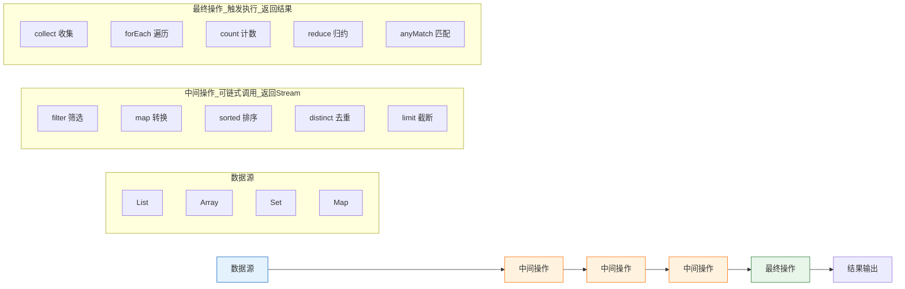

在 Java 中，“高级函数” 通常指那些*接收一个或多个函数作为参数，或者返回一个函数的函数*。这是函数式编程的核心概念之一。Java 8 引入的 Lambda 表达式和函数式接口为高级函数的实现提供了强大的支持。

## 一、核心函数式接口（高级函数的基石） ##

`java.util.function` 包提供了一系列函数式接口，它们是构建高级函数的基础。

| 接口 | 输入参数 | 返回值 | 作用 |
| :--- | :--- | :--- | :--- |
| `Function<T, R>` | 1 个 (T) | 1 个 (R) | 将一个对象转换为另一个对象 |
| `Consumer<T>` | 1 个 (T) | 无 | 消费一个对象 |
| `Supplier<T>` | 0 个 | 1 个 (T) | 提供一个对象 |
| `Predicate<T>` | 1 个 (T) | `boolean` | 判断一个对象是否满足条件 |
| `BiFunction<T, U, R>` | 2 个 (T, U) | 1 个 (R) | 将两个对象转换为一个对象 |
| `UnaryOperator<T>` | 1 个 (T) | 1 个 (T) | 对一个对象进行一元操作（输入输出类型相同） |
| `BinaryOperator<T>` | 2 个 (T) | 1 个 (T) | 对两个对象进行二元操作（输入输出类型相同） |

## 二、常用的高级函数 ##

### Stream API 中的高级函数 ###

Stream API 是高级函数最集中的地方。

#### `map(Function<T, R>)` ####

作用：将流中的每个元素转换为另一种类型。

```java
List<String> words = Arrays.asList("Hello", "World");
List<Integer> lengths = words.stream()
    .map(String::length) // Function<String, Integer>
    .collect(Collectors.toList());
```

#### `filter(Predicate<T>)` ####

作用：根据条件过滤流中的元素。

```java
List<Integer> numbers = Arrays.asList(1, 2, 3, 4, 5);
List<Integer> evenNumbers = numbers.stream()
    .filter(n -> n % 2 == 0) // Predicate<Integer>
    .collect(Collectors.toList());
```

#### `forEach(Consumer<T>)` ####

作用：遍历流中的每个元素并执行操作。

```java
List<String> names = Arrays.asList("Alice", "Bob");
names.stream()
    .forEach(name -> System.out.println("Hello, " + name)); // Consumer<String>
```

#### `reduce(BinaryOperator<T>)` ####

作用：将流中的元素归约为一个值。

```java
List<Integer> numbers = Arrays.asList(1, 2, 3, 4, 5);
int sum = numbers.stream()
    .reduce(0, Integer::sum); // BinaryOperator<Integer>
```

#### `sorted(Comparator<T>)` ####

作用：根据自定义比较器对元素进行排序。

```java
List<String> words = Arrays.asList("banana", "apple", "cherry");
List<String> sortedWords = words.stream()
    .sorted((s1, s2) -> s1.length() - s2.length()) // Comparator<String>
    .collect(Collectors.toList());
```

### Map 接口中的高级函数 ###

#### `replaceAll(BiFunction<K, V, V>)` ####

作用：根据键和值更新映射关系。

```java
Map<String, Integer> prices = new HashMap<>();
prices.put("Apple", 10);
prices.put("Banana", 5);

prices.replaceAll((fruit, price) -> price + 2); // BiFunction<String, Integer, Integer>
```

#### `compute(K, BiFunction<K, V, V>)` ####

作用：根据键和当前值计算新值。

```java
prices.compute("Apple", (k, v) -> v * 2);
```

#### `merge(K, V, BiFunction<V, V, V>)` ####

作用：如果键不存在则添加，否则合并新值和旧值。

```java
prices.merge("Apple", 5, Integer::sum);
```

### Collections 工具类中的高级函数 ###

#### `sort(List<T>, Comparator<T>)` ####

作用：根据自定义比较器对列表进行排序。

```java
List<String> words = Arrays.asList("banana", "apple", "cherry");
Collections.sort(words, Comparator.comparingInt(String::length));
```

## 三、自定义高级函数 ##

你也可以自己定义接收函数作为参数的方法。

```java
// 一个通用的转换方法
public static <T, R> List<R> transform(List<T> list, Function<T, R> function) {
    List<R> result = new ArrayList<>();
    for (T item : list) {
        result.add(function.apply(item));
    }
    return result;
}

// 使用
List<String> words = Arrays.asList("Hello", "World");
List<Integer> lengths = transform(words, String::length);
```

## 四、总结 ##

- Java 中的高级函数主要依赖于 函数式接口 和 Lambda 表达式。
- `java.util.function` 包提供了一系列核心函数式接口。
- Stream API 和 集合框架 提供了大量实用的高级函数，如 `map`, `filter`, `reduce`, `forEach` 等。
- 你可以自己定义接收函数作为参数的方法，实现更灵活的逻辑

> BiFunction的使用

## 一、一句话定义 ##

`BiFunction` 是一个函数式接口，它接收两个参数，对它们进行处理，并返回一个结果。

简单来说，它就像一个需要两个输入才能产生一个输出的 “函数”。

## 二、接口定义 ##

`BiFunction` 位于 `java.util.function` 包下，其核心定义如下：

```java
@FunctionalInterface
public interface BiFunction<T, U, R> {
    R apply(T t, U u);
}
```

- `T`: 第一个参数的类型。
- `U`: 第二个参数的类型。
- `R`: 返回结果的类型。
- `apply(T t, U u)` : 核心方法，接收两个参数并返回一个结果。

## 三、与其他函数式接口的对比 ##

为了更好地理解，我们把它和之前讨论过的接口放在一起对比：

| 接口 | 输入参数 | 返回值 | 作用 |
| :--- | :--- | :--- | :--- |
| `Consumer<T>` | 1 个 (T) | 无 | 消费一个对象 |
| `Function<T, R>` | 1 个 (T) | 1 个 (R) | 将一个对象转换为另一个对象 |
| `BiFunction<T, U, R>` | 2 个 (T, U) | 1 个 (R) | 将两个对象转换为一个对象 |
| `Supplier<R>` | 0 个 | 1 个 (R) | 提供一个对象 |
| `Predicate<T>` | 1 个 (T) | `boolean` | 判断一个对象是否满足条件 |

`BiFunction` 的核心特点就是接收两个参数。

## 四、常见用法和场景 ##

### 创建和使用 BiFunction ###

#### 方式一：匿名内部类（老式写法） ####

```java
// 创建一个 BiFunction，用于计算两个整数的和
BiFunction<Integer, Integer, Integer> addFunction = new BiFunction<Integer, Integer, Integer>() {
    @Override
    public Integer apply(Integer a, Integer b) {
        return a + b;
    }
};

// 使用 apply 方法调用
int result = addFunction.apply(5, 3); // result = 8
```

#### 方式二：Lambda 表达式（现代写法，最常用） ####

```java
// 创建一个 BiFunction，用于拼接两个字符串
BiFunction<String, String, String> concatFunction = (str1, str2) -> str1 + " " + str2;

// 使用 apply 方法调用
String fullName = concatFunction.apply("Hello", "World"); // fullName = "Hello World"
```

### 作为方法参数传递 ###

BiFunction 经常作为参数传递给其他方法，用于处理数据。

```java
// 一个通用的计算方法
public static <T, U, R> R calculate(T a, U b, BiFunction<T, U, R> function) {
    return function.apply(a, b);
}

// 使用
// 计算乘积
int product = calculate(5, 3, (x, y) -> x * y); // product = 15

// 组合用户信息
String userInfo = calculate("张三", 25, (name, age) -> name + "今年" + age + "岁");
// userInfo = "张三今年25岁"
```

### 在集合操作中的应用 ###

`Map` 接口有一个 `replaceAll` 方法，它接收一个 `BiFunction` 作为参数，用于根据键和值更新映射关系。

```java
Map<String, Integer> prices = new HashMap<>();
prices.put("Apple", 10);
prices.put("Banana", 5);

// 将所有价格增加 2
prices.replaceAll((fruit, price) -> price + 2);

// 遍历输出
prices.forEach((k, v) -> System.out.println(k + ": " + v));
// 输出:
// Apple: 12
// Banana: 7
```

## 五、常用操作符 ##

`BiFunction` 提供了一些默认方法，可以方便地进行函数组合。

`andThen(Function<? super R, ? extends V> after)` : 在 `BiFunction` 执行完之后，再执行一个 Function。

```java
// 先求和，再将结果转为字符串
BiFunction<Integer, Integer, Integer> add = (a, b) -> a + b;
Function<Integer, String> convertToString = (num) -> "结果是: " + num;

BiFunction<Integer, Integer, String> addAndConvert = add.andThen(convertToString);

String result = addAndConvert.apply(3, 4); // result = "结果是: 7"
```

## 六、总结 ##

- `BiFunction<T, U, R>`  是一个接收两个参数（`T` 和 `U`）并返回一个结果（R）的函数式接口。
- 核心方法是 `apply(T t, U u)` 。
- 常用于需要两个输入进行处理并得到一个输出的场景，如数据转换、计算、集合更新等。
- 它是 Function 接口的 “双参数” 版本，是 Java 函数式编程中不可或缺的一部分。

> Function 用法

`Function` 是 *Java 8 函数式接口*，核心作用：*接收一个参数，处理后返回一个结果*（参数和返回值类型可以不同）。

简单理解：*你给它一个原料，它加工完给你一个成品 → 有入参，有返回值*。

## 一、核心定义 ##

```java
@FunctionalInterface
public interface Function<T, R> {
    // 唯一抽象方法：T=入参类型，R=返回值类型
    R apply(T t);
}
```

- T：输入（参数）的类型
- R：输出（返回）的类型
- 核心方法：`R apply(T t)`
- 专门做：*有参数、有返回值*的转换 / 计算 / 处理

## 二、最基础用法（必看） ##

### 匿名内部类（老式） ###

```java
import java.util.function.Function;

public class FunctionTest {
    public static void main(String[] args) {
        // 功能：接收 String，返回其长度 Integer
        Function<String, Integer> fun = new Function<String, Integer>() {
            @Override
            public Integer apply(String s) {
                return s.length();
            }
        };

        int len = fun.apply("Hello");
        System.out.println(len); // 输出 5
    }
}
```

### Lambda 简化（推荐） ###

```java
public class FunctionTest {
    public static void main(String[] args) {
        // 字符串 → 长度
        Function<String, Integer> getLength = s -> s.length();
        
        int result = getLength.apply("Java Function");
        System.out.println(result); // 输出 13
    }
}
```

## 三、常用场景：类型转换、数据处理 ##

### 示例 1：字符串转整数 ###

```java
// String → Integer
Function<String, Integer> strToInt = s -> Integer.parseInt(s);
int num = strToInt.apply("100");
System.out.println(num + 1); // 101
```

### 示例 2：对象 → 某个属性（开发最常用） ###

```java
class User {
    private String name;
    private int age;
    // 构造、getter
    public User(String name, int age) { this.name = name; this.age = age; }
    public String getName() { return name; }
}

// 使用：User → String（姓名）
Function<User, String> getUserName = user -> user.getName();

User user = new User("张三", 20);
String name = getUserName.apply(user);
System.out.println(name); // 张三
```

## 四、高级用法：链式调用（compose /andThen） ##

Function 支持多个函数串联执行，非常强大！

### andThen：先执行当前，再执行下一个 ###

```java
public class FunctionTest {
    public static void main(String[] args) {
        // f1：字符串 → 长度
        Function<String, Integer> f1 = s -> s.length();
        
        // f2：数字 → 平方
        Function<Integer, Integer> f2 = i -> i * i;

        // 先执行 f1，再执行 f2
        Function<String, Integer> chain = f1.andThen(f2);
        
        int result = chain.apply("Hello");
        System.out.println(result); // 5² = 25
    }
}
```

### compose：先执行参数里的函数，再执行自己 ###

```java
// f2.compose(f1) = 先 f1，再 f2
Function<String, Integer> chain2 = f2.compose(f1);
int result2 = chain2.apply("Hello"); // 同样 25
```

## 五、实战：封装通用工具方法 ##

把 Function 当参数传入，实现通用数据提取 / 转换，代码极度灵活！

```java
public class FunctionTest {
    // 通用工具：传入数据 + 转换规则，返回转换后的结果
    public static <T, R> R convert(T data, Function<T, R> function) {
        return function.apply(data);
    }

    public static void main(String[] args) {
        User user = new User("李四", 25);

        // 提取姓名
        String name = convert(user, u -> u.getName());
        System.out.println("姓名：" + name);

        // 提取年龄
        int age = convert(user, u -> u.getAge());
        System.out.println("年龄：" + age);

        // 自定义转换：年龄+10
        int newAge = convert(user, u -> u.getAge() + 10);
        System.out.println("新年龄：" + newAge);
    }
}
```

## 六、扩展：BiFunction（两个参数） ##

如果需要接收两个参数，用 `BiFunction<T, U, R>`：

- T：参数 1
- U：参数 2
- R：返回值

```java
import java.util.function.BiFunction;

public class FunctionTest {
    public static void main(String[] args) {
        // 两个 int → 求和
        BiFunction<Integer, Integer, Integer> add = (a, b) -> a + b;
        
        int sum = add.apply(10, 20);
        System.out.println(sum); // 30
    }
}
```

## 七、Stream 中最常用（开发必备） ##

`Stream.map()` 方法的参数就是 Function！

```java
import java.util.Arrays;
import java.util.List;
import java.util.stream.Collectors;

public class FunctionTest {
    public static void main(String[] args) {
        List<User> userList = Arrays.asList(
            new User("小明", 20),
            new User("小红", 18)
        );

        // map(Function)：提取所有姓名
        List<String> nameList = userList.stream()
                .map(user -> user.getName()) // Function<User, String>
                .collect(Collectors.toList());

        System.out.println(nameList); // [小明, 小红]
    }
}
```

八、Function vs Consumer（必区分）

| 接口 | 入参 | 返回值 | 用途 |
| :--- | :--- | :--- | :--- |
| `Function` | 1 个 | 有 | 转换、计算、提取、处理 |
| `Consumer` | 1 个 | 无 | 打印、修改、消费、执行 |

一句话区分：

- 需要返回结果 → 用 Function
- 不需要返回结果 → 用 Consumer

> Supplier的使用

Supplier 是 Java 8 函数式接口，核心作用：不接收任何参数，直接返回一个结果。

简单理解：它就是一个 “生产工厂”，不用给原料，直接产出产品 → 无入参，有返回值。

## 一、核心定义 ##

```java
@FunctionalInterface
public interface Supplier<T> {
    // 唯一抽象方法：无参数，返回一个 T 类型结果
    T get();
}
```

- T：返回值的类型
- 核心方法：`T get()`
- 专门做：无参数、有返回值的操作（生产、获取、创建）

## 二、最基础用法（必看） ##

### 匿名内部类（老式） ###

```java
import java.util.function.Supplier;

public class SupplierTest {
    public static void main(String[] args) {
        // 定义一个Supplier：生产一个字符串
        Supplier<String> supplier = new Supplier<String>() {
            @Override
            public String get() {
                return "我是Supplier生产的内容";
            }
        };

        // 获取结果
        String result = supplier.get();
        System.out.println(result);
    }
}
```

### Lambda 简化（推荐） ###

```java
public class SupplierTest {
    public static void main(String[] args) {
        // 无参数，直接返回
        Supplier<String> supplier = () -> "Lambda 简化版";
        
        // 调用get()获取值
        String result = supplier.get();
        System.out.println(result);
    }
}
```

## 三、常用场景：生产 / 创建 / 获取数据 ##

### 示例 1：生产随机数 ###

```java
import java.util.Random;

// 无参数，返回随机整数
Supplier<Integer> randomSupplier = () -> new Random().nextInt(100);

// 获取随机数
int num = randomSupplier.get();
System.out.println("随机数：" + num);
```

### 示例 2：创建对象（工厂模式） ###

```java
class User {
    private String name = "默认用户";
    @Override
    public String toString() { return name; }
}

// 无参数，创建并返回User对象
Supplier<User> userSupplier = () -> new User();

// 获取User
User user = userSupplier.get();
System.out.println(user); // 输出：默认用户
```

## 四、高级用法：懒加载（延迟执行） ##

Supplier 最大价值：代码不调用 `get ()` 就不执行，延迟加载。

```java
public class SupplierTest {
    public static void main(String[] args) {
        // 定义时，方法体不会执行！
        Supplier<String> lazySupplier = () -> {
            System.out.println("开始生产数据...");
            return "懒加载完成";
        };

        System.out.println("定义完成，还没调用get()");
        
        // 调用get()时才真正执行
        String result = lazySupplier.get();
        System.out.println(result);
    }
}
```

输出：

```text
定义完成，还没调用get()
开始生产数据...
懒加载完成
```

## 五、实战：封装通用工具方法 ##

把 Supplier 当参数，实现通用获取数据、容错、懒加载。

```java
public class SupplierTest {
    // 通用工具：获取数据，自动打印日志
    public static <T> T getData(Supplier<T> supplier) {
        System.out.println("正在获取数据...");
        T data = supplier.get(); // 真正执行
        System.out.println("获取成功：" + data);
        return data;
    }

    public static void main(String[] args) {
        // 获取字符串
        String str = getData(() -> "测试数据");
        
        // 获取数字
        Integer num = getData(() -> 666);
        
        // 获取对象
        User user = getData(User::new); // 方法引用写法
    }
}
```

## 六、Stream 中的应用 ##

`Stream` 里很多方法用 `Supplier`，比如 `Stream.generate()`：

```java
import java.util.stream.Stream;

public class SupplierTest {
    public static void main(String[] args) {
        // 无限生成 10 的数据流
        Stream.generate(() -> 10)
              .limit(5)
              .forEach(System.out::println);
    }
}
```

输出：

```text
10
10
10
10
10
```

## 七、三大函数式接口对比（必记） ##

| 接口 | 入参 | 返回值 | 一句话理解 |
| :--- | :--- | :--- | :--- |
| `Supplier` | 无 | 有 | 工厂，生产数据 (无入有出) |
| `Function` | 1 个 | 有 | 加工，转换数据 (有入有出) |
| `Consumer` | 1 个 | 无 | 消费，处理数据 (有入无出) |

*终极口诀*：

- 不接收参数，只返回值 → Supplier（生产者）
- 接收参数，返回值 → Function（转换器）
- 接收参数，不返回值 → Consumer（消费者）

> Predicate的使用

Predicate 是 Java 8 函数式接口，核心作用：接收一个参数，判断条件是否成立，返回布尔值（true/false） 。

简单理解：它就是一个 “判断器 / 过滤器”，你给它一个东西，它返回 true 或 false → 有入参，返回 boolean。

## 一、核心定义 ##

```java
@FunctionalInterface
public interface Predicate<T> {
    // 唯一抽象方法：接收参数，返回 boolean
    boolean test(T t);
}
```

- T：输入（参数）的类型
- 核心方法：`boolean test(T t)`
- 专门做：条件判断、过滤、校验

## 二、最基础用法（必看） ##

### 匿名内部类（老式） ###

```java
import java.util.function.Predicate;

public class PredicateTest {
    public static void main(String[] args) {
        // 判断：字符串长度是否大于 5
        Predicate<String> predicate = new Predicate<String>() {
            @Override
            public boolean test(String s) {
                return s.length() > 5;
            }
        };

        // 调用 test() 方法判断
        boolean result1 = predicate.test("Hello"); // false
        boolean result2 = predicate.test("HelloWorld"); // true
        
        System.out.println(result1);
        System.out.println(result2);
    }
}
```

### Lambda 简化（推荐） ###

```java
public class PredicateTest {
    public static void main(String[] args) {
        // Lambda 一行：判断数字是否大于 10
        Predicate<Integer> isGreaterThan10 = num -> num > 10;
        
        System.out.println(isGreaterThan10.test(5));  // false
        System.out.println(isGreaterThan10.test(20)); // true
    }
}
```

## 三、最常用场景：集合过滤（开发必备） ##

Java Stream.filter() 方法的参数就是 Predicate！这是你用得最多的地方。

```java
import java.util.Arrays;
import java.util.List;
import java.util.stream.Collectors;

public class PredicateTest {
    public static void main(String[] args) {
        List<Integer> list = Arrays.asList(1, 5, 8, 12, 15, 20);

        // filter(Predicate)：过滤出 > 10 的数字
        List<Integer> result = list.stream()
                .filter(num -> num > 10) // 这里就是 Predicate
                .collect(Collectors.toList());

        System.out.println(result); // [12, 15, 20]
    }
}
```

## 四、高级用法：三大逻辑运算（and /or/negate） ##

Predicate 自带 3 个默认方法，实现*复杂条件组合*：

- and：与（两个条件都满足）
- or：或（满足一个即可）
- negate：非（取反）

### 代码示例 ###

```java
public class PredicateTest {
    public static void main(String[] args) {
        // 条件1：数字 > 5
        Predicate<Integer> p1 = num -> num > 5;
        // 条件2：数字 < 15
        Predicate<Integer> p2 = num -> num < 15;

        // 1. and：5 < num < 15
        boolean andResult = p1.and(p2).test(10); // true
        System.out.println("and: " + andResult);

        // 2. or：>5 或 <15
        boolean orResult = p1.or(p2).test(3); // true
        System.out.println("or: " + orResult);

        // 3. negate：取反（不大于5）
        boolean negateResult = p1.negate().test(3); // true
        System.out.println("negate: " + negateResult);
    }
}
```

## 五、实战：判断对象（开发常用） ##

判断用户是否满足条件（如：成年、姓名长度等）。

### 实体类 ###

```java
class User {
    private String name;
    private int age;

    // 构造、getter
    public User(String name, int age) {
        this.name = name;
        this.age = age;
    }
    public int getAge() { return age; }
    public String getName() { return name; }
}
```

### 使用 Predicate 判断 ###

```java
public class PredicateTest {
    public static void main(String[] args) {
        User user = new User("张三", 20);

        // 判断：是否成年（age >= 18）
        Predicate<User> isAdult = u -> u.getAge() >= 18;
        System.out.println("是否成年：" + isAdult.test(user)); // true

        // 组合判断：成年 且 姓名长度 > 2
        Predicate<User> nameLength = u -> u.getName().length() > 2;
        boolean complex = isAdult.and(nameLength).test(user);
        System.out.println("复合条件：" + complex); // true
    }
}
```

## 六、封装通用校验工具 ##

把 Predicate 当作参数，实现通用条件校验。

```java
public class PredicateTest {
    // 通用工具：传入数据 + 判断规则，返回判断结果
    public static <T> boolean validate(T data, Predicate<T> predicate) {
        System.out.println("开始校验数据...");
        return predicate.test(data);
    }

    public static void main(String[] args) {
        // 校验字符串是否为空
        boolean b1 = validate("Hello", s -> !s.isEmpty());
        System.out.println(b1); // true

        // 校验年龄是否合法
        boolean b2 = validate(new User("李四", 15), u -> u.getAge() >= 18);
        System.out.println(b2); // false
    }
}
```

## 七、扩展：BiPredicate（两个参数判断） ##

如果需要接收两个参数进行判断，用 `BiPredicate<T, U>`：

```java
import java.util.function.BiPredicate;

public class PredicateTest {
    public static void main(String[] args) {
        // 判断：两个数字是否相等
        BiPredicate<Integer, Integer> isEqual = (a, b) -> a.equals(b);
        
        System.out.println(isEqual.test(10, 10)); // true
        System.out.println(isEqual.test(5, 8));   // false
    }
}
```

## 八、四大函数式接口终极对比（必记） ##


## 九、核心总结 ##

- `Predicate<T>`：接收参数，返回 boolean
- 核心方法：`test(T t)`
- 核心能力：条件判断、集合过滤、逻辑组合（and/or/negate）
- 最常用场景：`Stream.filter ()` 过滤数据
- 作为方法参数：代码更灵活、通用、可复用

一句话记住：需要做条件判断、过滤筛选，就用 Predicate！

> UnaryOperator的使用

`UnaryOperator` 是 Java 8 函数式接口，它是 Function 的特例！

核心作用：接收一个参数，处理后返回 同类型 的结果。简单理解：自己变自己，类型不变 → 入参和返回值类型必须一样。

## 一、先搞懂：它和 Function 的关系 ##

```java
// UnaryOperator 源代码（继承自 Function）
@FunctionalInterface
public interface UnaryOperator<T> extends Function<T, T> {
}
```

- `Function<T, R>` ：入参 T，返回 R（类型可不同）
- `UnaryOperator` ：入参 T，返回 T（类型必须相同）
- 核心方法：`T apply(T t)` （和 Function 一样）

一句话区分：

- 要类型转换 → 用 `Function`
- 只是自身运算 / 修改（类型不变）→ 用 `UnaryOperator`

## 二、最基础用法（必看） ##

### 匿名内部类（老式） ###

```java
import java.util.function.UnaryOperator;

public class UnaryOperatorTest {
    public static void main(String[] args) {
        // 功能：接收整数，返回它的 2 倍（类型都是 Integer）
        UnaryOperator<Integer> uo = new UnaryOperator<Integer>() {
            @Override
            public Integer apply(Integer num) {
                return num * 2;
            }
        };

        int result = uo.apply(5);
        System.out.println(result); // 输出 10
    }
}
```

### Lambda 简化（推荐） ###

```java
public class UnaryOperatorTest {
    public static void main(String[] args) {
        // 数字 → 平方（类型不变）
        UnaryOperator<Integer> square = num -> num * num;
        
        int result = square.apply(6);
        System.out.println(result); // 36
    }
}
```

## 三、常用场景：同类型运算、修改对象 ##

### 示例 1：字符串处理 ###

```java
// 字符串转大写（入出都是 String）
UnaryOperator<String> upper = s -> s.toUpperCase();

String result = upper.apply("hello");
System.out.println(result); // HELLO
```

### 示例 2：修改对象属性（最实用） ###

```java
class User {
    private String name;
    private int age;

    // 构造、get、set、toString
    public User(String name, int age) {
        this.name = name;
        this.age = age;
    }
    public void setAge(int age) { this.age = age; }
    @Override
    public String toString() { return name + "，年龄：" + age; }
}
```

```java
public class UnaryOperatorTest {
    public static void main(String[] args) {
        User user = new User("小明", 20);

        // 功能：年龄 +5，返回修改后的对象（类型都是 User）
        UnaryOperator<User> addAge = u -> {
            u.setAge(u.getAge() + 5);
            return u;
        };

        User newUser = addAge.apply(user);
        System.out.println(newUser); // 小明，年龄：25
    }
}
```

## 四、高级用法：链式调用（andThen /compose） ##

和 `Function` 完全一样，支持链式操作！

```java
public class UnaryOperatorTest {
    public static void main(String[] args) {
        // f1：+2
        UnaryOperator<Integer> f1 = num -> num + 2;
        // f2：×3
        UnaryOperator<Integer> f2 = num -> num * 3;

        // andThen：先 f1，再 f2 → (5+2)*3 = 21
        UnaryOperator<Integer> chain = f1.andThen(f2);
        System.out.println(chain.apply(5)); // 21
    }
}
```

## 五、实战：通用工具方法 ##

```java
public class UnaryOperatorTest {
    // 通用：处理同类型数据
    public static <T> T process(T data, UnaryOperator<T> operator) {
        return operator.apply(data);
    }

    public static void main(String[] args) {
        // 处理数字
        int num = process(10, n -> n + 10);
        System.out.println(num); // 20

        // 处理字符串
        String str = process("java", s -> s.toUpperCase());
        System.out.println(str); // JAVA
    }
}
```

## 六、扩展：BinaryOperator（两个参数） ##

`BinaryOperator` 是 `BiFunction` 的特例：两个入参 + 返回值，类型都相同。

```java
import java.util.function.BinaryOperator;

public class UnaryOperatorTest {
    public static void main(String[] args) {
        // 两个 Integer → 返回 Integer（求和）
        BinaryOperator<Integer> add = (a, b) -> a + b;
        
        int sum = add.apply(10, 20);
        System.out.println(sum); // 30
    }
}
```

## 七、终极对比：四大金刚 + 两个特例 ##


## 八、核心总结 ##

- `UnaryOperator<T>`：入参 T，返回 T（类型一致）
- 继承自 `Function<T, T>`，是 Function 的简化版
- 核心方法：`apply(T t)`
- 常用场景：同类型计算、字符串处理、对象自身修改
- 支持链式：`andThen`、`compose`

一句话记住：只做自身运算，类型不改变，首选 UnaryOperator！

> BinaryOperator的使用

BinaryOperator 是 Java 8 函数式接口，它是 BiFunction 的特例！

核心作用：接收两个同类型参数，处理后返回 同类型 结果。简单理解：两个相同类型的数据运算，返回还是同类型 → 两个入参 + 返回值，三者类型完全一样。

## 一、先搞懂：它和 BiFunction 的关系 ##

```java
// BinaryOperator 源代码（继承自 BiFunction）
@FunctionalInterface
public interface BinaryOperator<T> extends BiFunction<T, T, T> {
}
```

- `BiFunction<T, U, R>` ：两个参数，返回值（类型可不同）
- `BinaryOperator` ：两个参数都是 T，返回值也是 T（类型必须相同）
- 核心方法：`T apply(T t1, T t2)` （和 BiFunction 一样）

一句话区分：

- 要不同类型运算 / 转换 → 用 BiFunction
- 两个同类型运算，返回同类型 → 用 BinaryOperator

## 二、最基础用法（必看） ##

### 匿名内部类（老式） ###

```java
import java.util.function.BinaryOperator;

public class BinaryOperatorTest {
    public static void main(String[] args) {
        // 功能：两个整数相加，返回整数（类型一致）
        BinaryOperator<Integer> add = new BinaryOperator<Integer>() {
            @Override
            public Integer apply(Integer a, Integer b) {
                return a + b;
            }
        };

        int result = add.apply(10, 20);
        System.out.println(result); // 输出 30
    }
}
```

### Lambda 简化（推荐） ###

```java
public class BinaryOperatorTest {
    public static void main(String[] args) {
        // 两个数字相乘（同入同出）
        BinaryOperator<Integer> multiply = (a, b) -> a * b;
        
        int result = multiply.apply(5, 6);
        System.out.println(result); // 30
    }
}
```

## 三、常用场景：数值运算、字符串拼接、对象合并 ##

### 示例 1：字符串拼接 ###

```java
// 两个字符串拼接，返回字符串
BinaryOperator<String> concat = (s1, s2) -> s1 + " | " + s2;

String result = concat.apply("Hello", "Java");
System.out.println(result); // Hello | Java
```

### 示例 2：数值比较（取最大 / 最小） ###

自带两个静态方法：

- `BinaryOperator.maxBy(Comparator)`：取最大值
- `BinaryOperator.minBy(Comparator)`：取最小值

```java
import java.util.Comparator;

public class BinaryOperatorTest {
    public static void main(String[] args) {
        // 取两个数的最大值
        BinaryOperator<Integer> max = BinaryOperator.maxBy(Comparator.naturalOrder());
        System.out.println(max.apply(10, 20)); // 20

        // 取两个数的最小值
        BinaryOperator<Integer> min = BinaryOperator.minBy(Comparator.naturalOrder());
        System.out.println(min.apply(10, 20)); // 10
    }
}
```

## 四、实战：Stream 中最常用（reduce 聚合） ##

`Stream.reduce()` 方法的参数就是 BinaryOperator！作用：把集合所有数据，两两运算，最终合并成一个结果（求和、求最大、求最小）。

### 示例：集合求和、求最大值 ###

```java
import java.util.Arrays;
import java.util.List;

public class BinaryOperatorTest {
    public static void main(String[] args) {
        List<Integer> list = Arrays.asList(1, 2, 3, 4, 5);

        // 1. 求和：1+2+3+4+5
        int sum = list.stream().reduce(0, (a, b) -> a + b);
        // 等价于：reduce(0, Integer::sum);
        System.out.println("总和：" + sum); // 15

        // 2. 求最大值
        int max = list.stream().reduce(Integer::max).get();
        System.out.println("最大值：" + max); // 5
    }
}
```

## 五、高级用法：链式调用（andThen） ##

和 Function / BiFunction 一样，支持 andThen 链式（先执行二元运算，再执行后续操作）。

```java
import java.util.function.Function;

public class BinaryOperatorTest {
    public static void main(String[] args) {
        // 第一步：两个数相加
        BinaryOperator<Integer> add = (a, b) -> a + b;
        // 第二步：结果 ×2
        Function<Integer, Integer> doubleNum = x -> x * 2;

        // 先 add，再 double：(10+20)*2 = 60
        var result = add.andThen(doubleNum).apply(10, 20);
        System.out.println(result); // 60
    }
}
```

## 六、实战：合并两个对象 ##

```java
class User {
    private String name;
    private int age;

    // 构造、get、set、toString
    public User(String name, int age) {
        this.name = name;
        this.age = age;
    }
    // 合并两个用户：姓名拼接，年龄相加
    public static User merge(User u1, User u2) {
        return new User(u1.getName() + "&" + u2.getName(), u1.getAge() + u2.getAge());
    }

    @Override
    public String toString() { return name + " - " + age; }
}
```

```java
public class BinaryOperatorTest {
    public static void main(String[] args) {
        User u1 = new User("小明", 20);
        User u2 = new User("小红", 18);

        // 合并两个 User，返回 User（同类型）
        BinaryOperator<User> mergeUser = User::merge;
        
        User result = mergeUser.apply(u1, u2);
        System.out.println(result); // 小明&小红 - 38
    }
}
```

## 七、终极对比：所有函数式接口（一张表吃透） ##

| 接口 | 入参 | 返回值 | 特点 | 一句话 |
| :--- | :--- | :--- | :--- | :--- |
| `Supplier` | 无 | 有 | 无入有出 | 生产数据 |
| `Consumer` | 1 个 | 无 | 有入无出 | 消费 / 处理 |
| `Function` | 1 个 | 有 | 入出可不同 | 转换 / 计算 |
| `Predicate` | 1 个 | boolean | 判断真假 | 过滤 / 校验 |
| `UnaryOperator` | 1 个 | 有 | 入出相同 | 自身运算 |
| `BiFunction` | 2 个 | 有 | 入出可不同 | 二元转换 |
| `BinaryOperator` | 2 个 | 有 | 三者全相同 | 同类型二元运算 |

## 八、核心总结 ##

- `BinaryOperator<T>`：两个 T 入参，返回 T（三者类型完全一致）
- 继承自 `BiFunction<T, T, T>`，是 BiFunction 的简化版
- 核心方法：`apply(T t1, T t2)`
- 最常用场景：`Stream.reduce ()` 聚合（求和、求最大）
- 自带工具：`maxBy()`、`minBy()` 快速取最大 / 最小

一句话记住：两个同类型数据运算，返回同类型，必用 BinaryOperator！

> Stream 的使用

Stream 是 Java 8 基于函数式编程的核心工具，专门用来高效、优雅地处理集合 / 数组（筛选、排序、转换、聚合、去重等）。

简单理解：把集合 / 数组变成一条 “数据流”，流水线式处理，一行代码搞定复杂操作，告别繁琐的 for 循环！

## 一、Stream 核心三大特性 ##

- 流水线式操作：多个操作连在一起，一步到位
- 惰性执行：只有调用最终操作，中间逻辑才会执行
- 一次性使用：一个 Stream 只能用一次，用完即废

## 二、Stream 操作流程（固定套路） ##

数据源 → 中间操作（筛选/排序/转换...可多个） → 最终操作（结果输出）




- 数据源：集合、数组、文件等
- 中间操作：返回 Stream，可链式拼接
- 最终操作：返回结果（集合、数值、对象等），Stream 结束

## 三、第一步：创建 Stream（数据源） ##

### 集合创建（最常用） ###

```java
List<String> list = Arrays.asList("a", "b", "c");
Stream<String> stream = list.stream(); // 串行流
Stream<String> parallelStream = list.parallelStream(); // 并行流
```

### 数组创建 ###

```java
String[] arr = {"a", "b", "c"};
Stream<String> stream = Arrays.stream(arr);
```

### 静态方法创建 ###

```java
Stream<String> stream = Stream.of("a", "b", "c");
```

## 四、第二步：常用中间操作（核心！） ##

返回 Stream，可链式拼接，重点掌握这 6 个：

### filter：筛选（条件过滤） ###

接收 Predicate，保留满足条件的数据

```java
List<Integer> list = Arrays.asList(1, 5, 8, 12, 15);
// 筛选 > 10 的数字
list.stream().filter(num -> num > 10);
```

### map：转换（提取 / 类型转换） ###

接收 Function，把数据转成另一种形式

```java
// 字符串 → 长度
list.stream().map(s -> s.length());
// 对象 → 属性（开发最常用）
userList.stream().map(User::getName);
```

### sorted：排序 ###

```java
// 自然排序（升序）
list.stream().sorted();
// 自定义排序（年龄降序）
userList.stream().sorted((u1, u2) -> u2.getAge() - u1.getAge());
```

### distinct：去重 ###

```java
list.stream().distinct();
```

### limit：限制条数 ###

```java
// 取前 3 条
list.stream().limit(3);
```

### skip：跳过条数 ###

```java
// 跳过前 2 条
list.stream().skip(2);
```

## 五、第三步：常用最终操作（必须有！） ##

返回最终结果，执行后 Stream 关闭：

### collect：收集结果（最常用） ###

转成 List/Set/Map

```java
// 转 List
List<String> resultList = stream.collect(Collectors.toList());
// 转 Map（key=name,value=user）
Map<String, User> userMap = userList.stream()
    .collect(Collectors.toMap(User::getName, u -> u));
```

### forEach：遍历 ###

接收 Consumer

```java
stream.forEach(System.out::println);
```

### count：计数 ###

```java
long count = stream.count();
```

### reduce：聚合（求和 / 最大 / 最小） ###

接收 BinaryOperator

```java
// 求和
int sum = list.stream().reduce(0, Integer::sum);
// 最大值
int max = list.stream().reduce(Integer::max).get();
```

### anyMatch /allMatch/noneMatch：判断 ###

接收 Predicate

```java
// 是否有任意一个满足
boolean any = stream.anyMatch(num -> num > 10);
// 是否全部满足
boolean all = stream.allMatch(num -> num > 10);
```

### findFirst /findAny：查找 ###

```java
// 获取第一个
Optional<Integer> first = stream.findFirst();
```

## 六、实战：一行代码完成复杂操作（必看） ##

需求：用户集合 → 筛选成年 → 按年龄降序 → 提取姓名 → 转 List

```java
import java.util.Arrays;
import java.util.List;
import java.util.stream.Collectors;

class User {
    private String name;
    private int age;
    // 构造、getter
    public User(String name, int age) {
        this.name = name;
        this.age = age;
    }
    public String getName() { return name; }
    public int getAge() { return age; }
}

public class StreamTest {
    public static void main(String[] args) {
        List<User> userList = Arrays.asList(
            new User("张三", 16),
            new User("李四", 22),
            new User("王五", 19),
            new User("赵六", 25)
        );

        // Stream 一行搞定！
        List<String> adultNameList = userList.stream()
                .filter(u -> u.getAge() >= 18) // 1.筛选成年
                .sorted((u1, u2) -> u2.getAge() - u1.getAge()) // 2.降序
                .map(User::getName) // 3.提取姓名
                .collect(Collectors.toList()); // 4.转List

        System.out.println(adultNameList); // [赵六, 李四, 王五]
    }
}
```

## 七、Stream 常用聚合操作（开发必备） ##

```java
List<Integer> list = Arrays.asList(1,2,3,4,5);

// 求和
int sum = list.stream().mapToInt(Integer::intValue).sum();
// 最大值
int max = list.stream().mapToInt(Integer::intValue).max().getAsInt();
// 最小值
int min = list.stream().mapToInt(Integer::intValue).min().getAsInt();
// 平均值
double avg = list.stream().mapToInt(Integer::intValue).average().getAsDouble();
```

## 八、中间操作 vs 最终操作（快速区分） ##

| 类型 | 返回值 | 特点 | 例子 |
| :--- | :--- | :--- | :--- |
| **中间操作** | Stream | 不执行，只拼接 | filter、map、sorted |
| **最终操作** | 具体结果 | 触发执行，关闭流 | collect、forEach、count |


口诀：没有最终操作，Stream 等于白写！

## 九、核心总结（一句话吃透） ##

- Stream = 集合的流水线工具，专门简化集合操作
- 固定流程：创建 → 中间操作（筛选 / 转换 / 排序） → 最终操作（结果）
- 核心中间操作：filter（筛选）、map（转换）、sorted（排序）
- 核心最终操作：collect（收集）、forEach（遍历）、reduce（聚合）
- 优点：代码极简、可读性高、支持并行高效


### 终极口诀 ###

集合处理不用愁，Stream 流水线解千愁；筛选转换加排序，一行代码全搞定！
