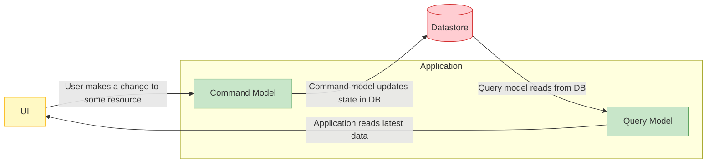

> 使用中介者模式轻松实现命令查询职责分离，构建高内聚、低耦合的应用系统

## 一、知识点回顾

### 什么是CQRS？

CQRS是Command Query Responsibility Segregation的缩写，一般称作命令查询职责分离。从字面意思理解，就是将命令（写入）和查询（读取）的责任划分到不同的模型中。

对比一下常用的 CRUD 模式（创建-读取-更新-删除），通常我们会让用户界面与负责所有四种操作的数据存储交互。而 CQRS 则将这些操作分成两种模式，一种用于查询（又称 "R"），另一种用于命令（又称 "CUD"）。



### CQRS的作用是什么？

CQRS将系统的写操作（命令）和读操作（查询）分离到不同的模型和数据存储中，从而实现读写分离，提高系统的性能、可扩展性和安全性，并使复杂业务逻辑（写端）和高效查询（读端）各自得到优化，降低系统复杂性。它允许为写操作设计严谨的领域模型，为读操作设计简单、只关注查询效率的数据模型（如专用视图或报表数据库），并可通过事件等机制保持最终一致性。

### CQRS 的优点

- 独立缩放。 CQRS 使读取模型和写入模型能够独立缩放。 此方法可帮助最大程度地减少锁争用并提高负载下的系统性能。
- 优化的数据架构。 读取操作可以使用针对查询进行优化的模式。 写入操作使用针对更新优化的模式。
- 安全性。 通过分隔读取和写入，可以确保只有适当的域实体或操作有权对数据执行写入操作。
- 关注点分离。 分离读取和写入责任会导致更简洁、更易于维护的模型。 写入端通常处理复杂的业务逻辑。 读取端可以保持简单且专注于查询效率。
- 更简单的查询。 在读取数据库中存储具体化视图时，应用程序可以在查询时避免复杂的联接。

## 二、关于PipelinR

### 项目地址

https://github.com/sizovs/PipelinR

项目开发者在Github的介绍不多，关键是最后一句话：It's similar to a popular MediatR .NET library. 意思就是这个项目是参考着一个叫MediatR的.net库写的。关于MediatR我之前有两篇文章专门介绍过。

PipelinR（包括MediatR）提供了一种CQRS的实现方式，基于中介者模式实现进程内消息传递，用于解耦应用中的各个组件，支持请求/响应（一对一，有返回值）和发布/订阅（一对多，无返回值）两种消息模式。它们在内部提供管道行为 (Pipeline Behaviors)，用于在消息处理前后插入自定义逻辑，如日志、验证、异常处理等。

> 需要提醒的是，PipelinR并不是一个完整的CQRS框架，它只是一个中介者模式的具体实现方式，将调用方和处理方进行了解耦，而这种模式恰好可以用来在一个单体应用（或者是微服务的服务内部）中实现简单的CQRS。

## 三、依赖安装和配置

### Maven安装

```xml
<dependency>
  <groupId>net.sizovs</groupId>
  <artifactId>pipelinr</artifactId>
  <version>0.11</version>
</dependency>
```

### Gradle安装

```txt
dependencies {
    compile 'net.sizovs:pipelinr:0.11'
}
```

### 在Spring项目中配置PipelinR

```java
@Configuration
public class PipelinrConfiguration {

    @Bean
    Pipeline pipeline(ObjectProvider<Command.Handler> commandHandlers, ObjectProvider<Notification.Handler> notificationHandlers, ObjectProvider<Command.Middleware> middlewares) {
        return new Pipelinr()
          .with(commandHandlers::stream)
          .with(notificationHandlers::stream)
          .with(middlewares::orderedStream);
    }
}
```

## 四、核心组件

- `Pipeline/Pipelinr`：Pipeline是消息和处理器之间的中介者，调用方向Pipeline发送消息，Pipeline收到消息后通过注册到Pipeline的中间件进行层层传递并最终抵达匹配的消息处理器进行处理。Pipelinr是Pipeline的默认实现。
- `Command<R>`：用于约定请求/响应模式的消息类型，泛型参数R是返回值的类型，如果不需要返回值，可以将R指定为Voidy。
- `Notification`：用于约定发布/订阅模式的消息类型，没有返回值，消息可以有多个处理器。
- `Middlewar`e：管道中间件，Command和Notification都定义了各自的中间件接口。Pipeline接收到的消息，在到达最终的处理器之前，会经过所有注册到Pipeline的中间。可以使用Middleware实现诸如日志记录、数据验证、开启事务等一系列操作。

## 五、请求/响应模式实现

请求/响应模式需要用到Command接口。

### 定义Command

Command代表一个请求，需要实现`net.sizovs.pipelinr.Command`接口。泛型参数指定返回值类型。

```java
// 定义一个创建用户的命令
public class CreateUserCommand implements Command<UserResponse> {
    private String username;
    private String email;

    public CreateUserCommand(String username, String email) {
        this.username = username;
        this.email = email;
    }

    public String getUsername() {
        return username;
    }

    public String getEmail() {
        return email;
    }
}

// 返回值类型
public class UserResponse {
    private Long userId;
    private String username;
    private String email;

    public UserResponse(Long userId, String username, String email) {
        this.userId = userId;
        this.username = username;
        this.email = email;
    }

    // getters
}
```

### 定义Command Handler

创建该Command对应的处理器，实现`net.sizovs.pipelinr.Command.Handler`接口。

```java
@Component
public class CreateUserCommandHandler implements Command.Handler<CreateUserCommand, UserResponse> {

    @Autowired
    private UserRepository userRepository;

    @Override
    public UserResponse handle(CreateUserCommand command) {
        // 业务逻辑处理
        User user = new User();
        user.setUsername(command.getUsername());
        user.setEmail(command.getEmail());

        User savedUser = userRepository.save(user);

        return new UserResponse(savedUser.getId(), savedUser.getUsername(), savedUser.getEmail());
    }
}
```

### 在业务代码中使用

通过注入Pipeline实例，发送Command并获取响应。

```java
@Service
public class UserService {

    @Autowired
    private Pipeline pipeline;

    public UserResponse createUser(String username, String email) {
        CreateUserCommand command = new CreateUserCommand(username, email);
        UserResponse response = pipeline.send(command);
        return response;
    }
}
```

### 添加Command中间件

中间件可以在Command处理前后执行一些操作，如验证、日志、事务管理等。

```java
@Component
public class LoggingMiddleware implements Command.Middleware {

    private static final Logger logger = LoggerFactory.getLogger(LoggingMiddleware.class);

    @Override
    public <R, C extends Command<R>> R invoke(C command, Chain<R> chain) {
        logger.info("Executing command: {}", command.getClass().getSimpleName());
        try {
            R result = chain.proceed(command);
            logger.info("Command executed successfully");
            return result;
        } catch (Exception e) {
            logger.error("Command execution failed", e);
            throw e;
        }
    }
}

@Component
public class ValidationMiddleware implements Command.Middleware {

    @Autowired
    private Validator validator;

    @Override
    public <R, C extends Command<R>> R invoke(C command, Chain<R> chain) {
        Set<ConstraintViolation<C>> violations = validator.validate(command);
        if (!violations.isEmpty()) {
            throw new ConstraintViolationException("Validation failed", violations);
        }
        return chain.proceed(command);
    }
}

@Component
@Order(1) // 指定中间件执行顺序
public class TransactionMiddleware implements Command.Middleware {

    @Autowired
    private PlatformTransactionManager transactionManager;

    @Override
    public <R, C extends Command<R>> R invoke(C command, Chain<R> chain) {
        TransactionStatus status = transactionManager.getTransaction(new DefaultTransactionDefinition());
        try {
            R result = chain.proceed(command);
            transactionManager.commit(status);
            return result;
        } catch (Exception e) {
            transactionManager.rollback(status);
            throw e;
        }
    }
}
```

## 六、发布/订阅模式实现

发布/订阅模式使用Notification接口，用于一对多的消息分发，没有返回值。

### 定义Notification

Notification代表一个事件通知，需要实现`net.sizovs.pipelinr.Notification`接口。

```java
// 定义一个用户创建成功的事件通知
public class UserCreatedNotification implements Notification {
    private Long userId;
    private String username;
    private String email;
    private LocalDateTime createdTime;

    public UserCreatedNotification(Long userId, String username, String email) {
        this.userId = userId;
        this.username = username;
        this.email = email;
        this.createdTime = LocalDateTime.now();
    }

    // getters
}
```

### 定义Notification Handler

Notification可以有多个处理器，每个处理器实`现net.sizovs.pipelinr.Notification.Handler`接口。

```java
@Component
public class SendWelcomeEmailHandler implements Notification.Handler<UserCreatedNotification> {

    private static final Logger logger = LoggerFactory.getLogger(SendWelcomeEmailHandler.class);

    @Autowired
    private EmailService emailService;

    @Override
    public void handle(UserCreatedNotification notification) {
        logger.info("Sending welcome email to user: {}", notification.getUsername());
        emailService.sendWelcomeEmail(notification.getEmail(), notification.getUsername());
    }
}

@Component
public class LogUserCreationHandler implements Notification.Handler<UserCreatedNotification> {

    private static final Logger logger = LoggerFactory.getLogger(LogUserCreationHandler.class);

    @Autowired
    private UserAuditLogRepository auditLogRepository;

    @Override
    public void handle(UserCreatedNotification notification) {
        logger.info("Logging user creation: {}", notification.getUsername());
        UserAuditLog auditLog = new UserAuditLog();
        auditLog.setUserId(notification.getUserId());
        auditLog.setOperation("CREATE");
        auditLog.setTimestamp(notification.getCreatedTime());
        auditLogRepository.save(auditLog);
    }
}

@Component
public class UpdateUserStatisticsHandler implements Notification.Handler<UserCreatedNotification> {

    private static final Logger logger = LoggerFactory.getLogger(UpdateUserStatisticsHandler.class);

    @Autowired
    private UserStatisticsRepository statisticsRepository;

    @Override
    public void handle(UserCreatedNotification notification) {
        logger.info("Updating statistics for new user: {}", notification.getUsername());
        UserStatistics stats = statisticsRepository.findOrCreate();
        stats.incrementTotalUsers();
        statisticsRepository.save(stats);
    }
}
```

### 发送Notification

在Command处理完成后，可以发送Notification通知所有相关的处理器。

```java
@Component
public class CreateUserCommandHandler implements Command.Handler<CreateUserCommand, UserResponse> {

    @Autowired
    private UserRepository userRepository;

    @Autowired
    private Pipeline pipeline;

    @Override
    public UserResponse handle(CreateUserCommand command) {
        // 业务逻辑处理
        User user = new User();
        user.setUsername(command.getUsername());
        user.setEmail(command.getEmail());

        User savedUser = userRepository.save(user);

        // 发送事件通知
        UserCreatedNotification notification = new UserCreatedNotification(
            savedUser.getId(),
            savedUser.getUsername(),
            savedUser.getEmail()
        );
        pipeline.send(notification);

        return new UserResponse(savedUser.getId(), savedUser.getUsername(), savedUser.getEmail());
    }
}
```

### 添加Notification中间件

类似Command，Notification也支持中间件。

```java
@Component
public class NotificationLoggingMiddleware implements Notification.Middleware {

    private static final Logger logger = LoggerFactory.getLogger(NotificationLoggingMiddleware.class);

    @Override
    public <N extends Notification> void invoke(N notification, Chain chain) {
        logger.info("Publishing notification: {}", notification.getClass().getSimpleName());
        try {
            chain.proceed(notification);
            logger.info("Notification published successfully");
        } catch (Exception e) {
            logger.error("Notification publishing failed", e);
            throw e;
        }
    }
}

@Component
public class NotificationErrorHandlingMiddleware implements Notification.Middleware {

    private static final Logger logger = LoggerFactory.getLogger(NotificationErrorHandlingMiddleware.class);

    @Override
    public <N extends Notification> void invoke(N notification, Chain chain) {
        try {
            chain.proceed(notification);
        } catch (Exception e) {
            logger.error("Error handling notification: {}", notification.getClass().getSimpleName(), e);
            // 可以选择吞掉异常或重新抛出，取决于业务需求
            // throw e;
        }
    }
}
```

## 七、总结

### 核心收获

通过本文的介绍，我们了解了如何在Java应用中使用PipelinR框架实现CQRS模式。核心要点总结如下：

#### CQRS的价值

- 读写分离：通过Command处理写操作，Notification处理事件响应，实现职责的明确划分
- 独立优化：读端和写端可以独立优化，不同的数据模型适应不同的场景需求
- 系统解耦：中介者模式解耦了调用方和处理方，提高了系统的可维护性和可扩展性

#### PipelinR的核心特性

- 轻量级实现：相比完整的CQRS框架，PipelinR更轻便，学习成本低
- 灵活的管道机制：通过中间件可以方便地植入横切关注点（如日志、验证、事务等）
- 支持两种消息模式：Command用于请求/响应，Notification用于发布/订阅

#### 最佳实践建议

- 合理使用中间件：通过`@Order`注解控制中间件执行顺序，但要避免中间件层级过多导致性能问题
- 异常处理：根据场景选择合适的异常处理策略，Notification可考虑不中断其他处理器的错误隔离
- 事件驱动设计：充分利用Notification实现事件驱动架构，解耦不同的业务流程
- 代码组织：按照Command、Handler、Middleware的划分方式组织代码，保持结构清晰

### 实施建议

#### 适用场景

中等复杂度的业务系统，需要良好的代码结构和可维护性
业务逻辑相对复杂，需要事件驱动的系统设计
团队具备良好的DDD设计理念和架构意识

#### 注意事项

学习曲线：虽然PipelinR本身简单，但要理解CQRS的设计理念需要一定时间
适度使用：CQRS不是银弹，过度设计会增加系统复杂度，要根据实际需求决定是否引入
团队协作：CQRS的有效实施对团队的整体架构意识和编码规范要求较高
性能考虑：虽然使用了中介者模式会引入少量额外开销，但对大多数应用来说可以忽略不计

### 结论

PipelinR提供了一种轻量级、简洁的CQRS实现方案。它特别适合那些想要在不过度复杂化系统的前提下，引入DDD思想和事件驱动设计的项目。通过合理运用Command和Notification，结合恰当的中间件设计，开发者可以构建出高内聚、低耦合、易于维护和扩展的应用系统。

关键是要把握好"度"——既要充分发挥CQRS和PipelinR的优势，又要避免为了追求"高大上"的架构而过度设计，最终的目标是为业务的快速迭代和长期维护提供支撑。
