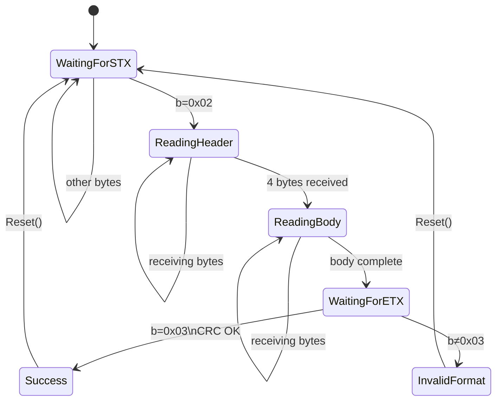

## 问题背景

在串口/网口通信场景，数据不一定按照帧边界自然到达，而是很有可能以半包（数据少于一帧）或粘包（多帧同时到达）形式出现。需要上层解析器能处理这种情况。

## 状态机增量解析

以如下类 Modbus RTU 协议为例，实现一个基于状态机设计的增量解析器。

```ini
协议帧格式 (v0)：
Byte:    0       1         2         3..4         5..(N+4)     (N+5..N+6)   N+7
Field:  [STX] [Address] [FuncCode] [Length:2B BE] [Payload:N] [CRC16:2B] [ETX]
Value:  0x02  1B        1B        大端序uint16    N字节       Modbus CRC   0x03
```

> 实际 payload 中可能出现与 `STX（0x02）`/`ETX（0x03）`相同的字节值，需要用 `0x10` 做转义（类似 `SLIP` 协议）。payload 中的 `0x02``/0x03`/`0x10` 前加 `0x10` 前缀。CRC 覆盖反转义后的原始数据。

## 状态设计



数据处理以逐字节 While + Switch 推进，无论成功还是失败都Reset（状态回到WaitingForSTX，清空状态机中缓存的字节）。

## 代码实现

```c#
public class StateMachineParser
{
    private ParserState _state;		// 解析状态
    private readonly byte[] _headerBuf = new byte[4];
    private int _headerPos;
    private readonly byte[] _bodyBuf = new byte[ProtocolConstants.MaxPayloadSize + 2];
    private int _bodyPos;
    private int _expectedPayloadLength;
    private bool _escapeMode;	// 是否开始转义模式，解析payload内可能出现的STX、ETX。

    public (ParseResult Result, SensorDataDto? Frame, int Consumed) TryParse(ReadOnlySpan<byte> data)
    {
        int consumed = 0;
        while (consumed < data.Length)
        {
            byte b = data[consumed];
            switch (_state)
            {
                case ParserState.WaitingForSTX:
                    consumed++;
                    if (b == ProtocolConstants.STX)
                    {
                        _state = ParserState.ReadingHeader;
                        _headerPos = 0;
                    }
                    break;
                case ParserState.ReadingHeader:
                    _headerBuf[_headerPos++] = b;
                    consumed++;
                    if (_headerPos == 4)
                    {
                        _expectedPayloadLength = BinaryPrimitives.ReadUInt16BigEndian(
                        	_headerBuf.AsSpan(2, 2));
                        if (_expectedPayloadLength > ProtocolConstants.MaxPayloadSize)	// 超出协议约束
                        {
                        	Reset();
                            return (ParseResult.InvalidFormat, null, consumed);
                        }
                        _state = ParserState.ReadingBody;
                        _bodyPos = 0;
                        _escapeMode = false;
                    }
                    break;
                case ParserState.ReadingBody:
                    if (_escapeMode)		// 开启了转义模式，直接解析下一字节
                    {
                        _bodyBuf[_bodyPos++] = b;
                        _escapeMode = false;
                        consumed++;
                    }
                    else if (b == 0x10)
                    {
                    	_escapeMode = true;
                        consumed++;
                    }
                    else if (b == ProtocolConstants.STX || b == ProtocolConstants.ETX)
                    {
                        Reset();
                        return (ParseResult.InvalidFormat, null, consumed);
                    }
                    else
                    {
                        _bodyBuf[_bodyPos++] = b;
                        consumed++;
                    }
                    if (_bodyPos >= _expectedPayloadLength + 2)
                    {
                        _state = ParserState.WaitingForETX;
                    }
                    break;
                case ParserState.WaitingForETX:
                    consumed++;
                    if (b == ProtocolConstants.ETX)
                    {
                        ushort tempCrc = Crc16.Compute(_headerBuf.AsSpan());
                        ushort expectedCrc = Crc16.Compute(_bodyBuf.AsSpan(0, _expectedPayloadLength), tempCrc);		// 增量 Crc16 计算
                        ushort receivedCrc = BinaryPrimitives.ReadUInt16LittleEndian(
                        	_bodyBuf.AsSpan(_expectedPayloadLength, 2));
                        if (expectedCrc != receivedCrc)
                        {
                            Reset();
                            return (ParseResult.CrcError, null, consumed);
                        }
                        byte[] payloadCopy = _bodyBuf.AsSpan(0, _expectedPayloadLength).ToArray();
                        var dto = new SensorDataDto
                        {
                            Address = _headerBuf[0],
                            FuncCode = _headerBuf[1],
                            PayloadLength = _expectedPayloadLength,
                            Payload = new ReadOnlyMemory<byte>(payloadCopy),
                            ReceivedCrc = receivedCrc
                        };
                        Reset();	// 重置内部状态准备开始下一次解析。
                        return (ParseResult.Success, dto, consumed);
                    }
                    else
                    {
                        Reset();
                        return (ParseResult.InvalidFormat, null, consumed);
                    }
            }
        }
        return (ParseResult.Incomplete, null, consumed);
    }

    // 辅助方法，用于清理状态机内部状态
    public void Reset()
    {
        _state = ParserState.WaitingForSTX;
        _headerPos = 0;
        _bodyPos = 0;
        _expectedPayloadLength = 0;
        _escapeMode = false;
    }

}
```

## Example

假设数据以通道 Channel 到达，用 `channel.Reader.ReadAllAsync()` 异步读取数据。

```c#
public async IAsyncEnumerable<SensorDataDto> ReadFramesAsync([EnumeratorCancellation] CancellationToken ct = default)
{
    await foreach (byte[] chunk in _reader.ReadAllAsync(ct))
    {
        int offset = 0;
        while (offset < chunk.Length)
        {
            var (result, frame, consumed) = _parser.TryParse(chunk.AsSpan(offset));
            offset += consumed;
            if (result == ParseResult.Success)	// 在这里根据 ParseResult 做错误处理
                yield return frame!;
        }
    }
}
```

> `consumed` 告诉调用方 ”处理了几个字节“。调用方用 `chunk.AsSpan(offset)` 推进，正确跳过已消费字节。失败时 consumed 也推进 -- 状态机内部已 Reset，consumed 告诉上层跳过出错部分。
