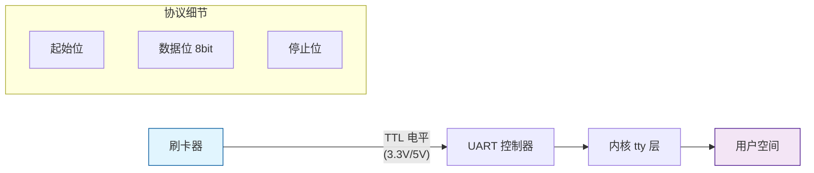
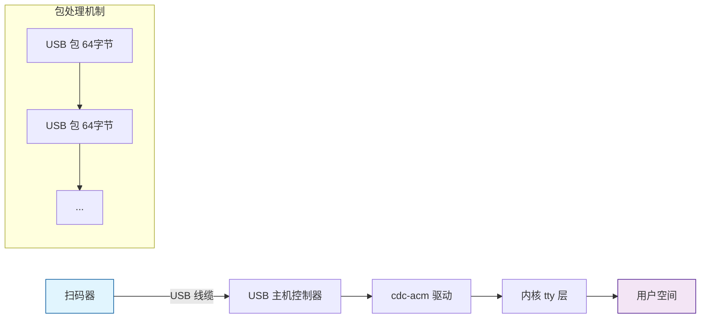
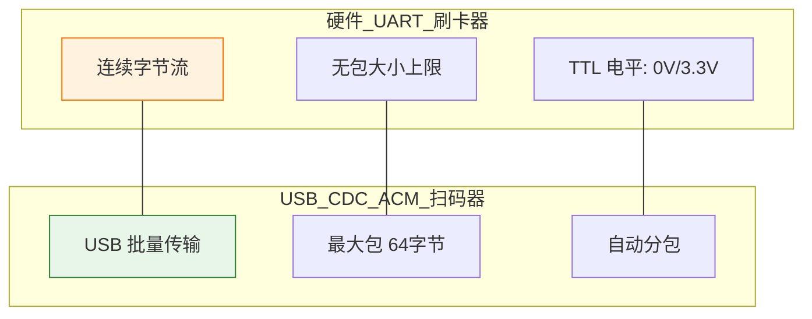
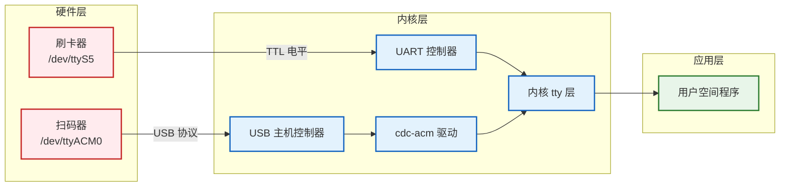
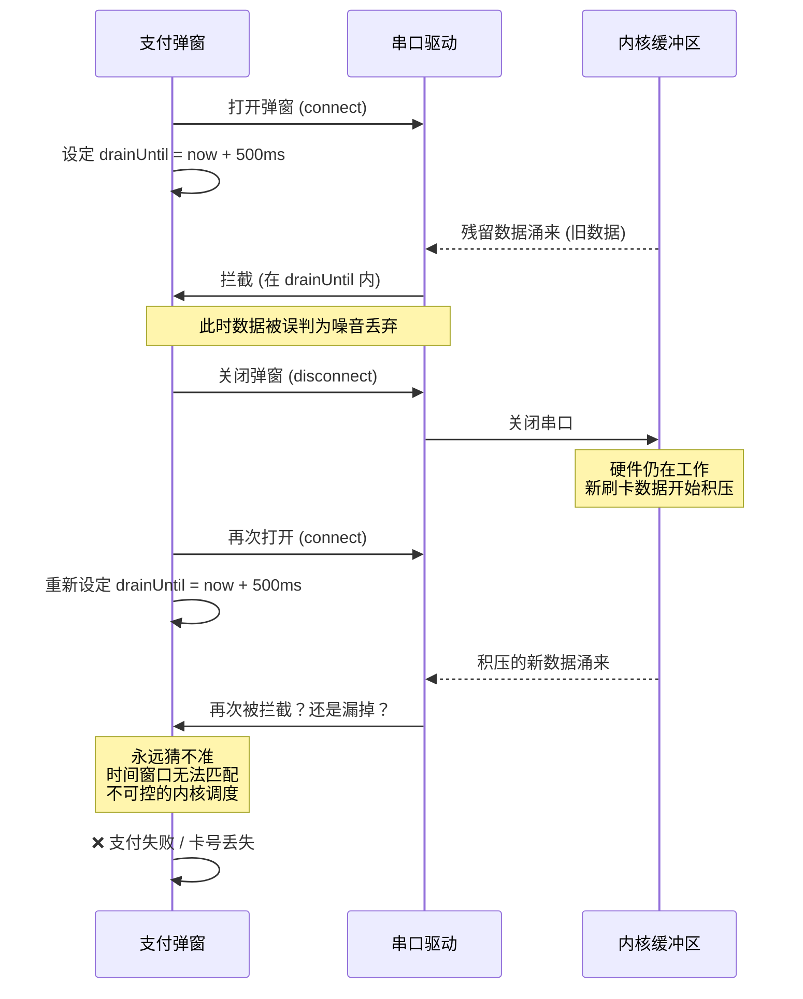
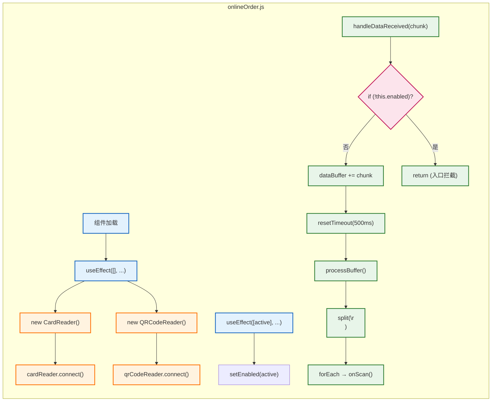

## 背景 ##

在一个 React Native 自助点餐机项目中，需要同时对接两个串口设备：

| 设备 | 接口 | 用途 | 数据长度 |
| :--- | :--- | :--- | :--- |
| **刷卡器** | `/dev/ttyS5` (硬件 UART) | 读取物理卡号 | 8~20 位十进制数字 |
| **扫码器** | `/dev/ttyACM0` (USB CDC-ACM 虚拟串口) | 读取二维码 | 最长 164 字符 |

使用 `react-native-serial-port-api` 进行串口通信，数据通过 `onReceived(buffer)` 回调接收。

## 硬件 UART 与 USB 虚拟串口的本质区别 ##










| 特性 | ttyS5 (硬件 UART) | ttyACM0 (USB CDC-ACM) |
| :--- | :--- | :--- |
| **传输方式** | 连续字节流 | 按 USB 包 (≤64 字节) 分块 |
| **数据长度限制** | 无 | 每次回调最多 64 字节 |
| **长数据被拆分** | 基本不会 | 必然 |
| **内核缓冲区残留** | 无 | 断开期间容易积压 |

这是本次所有问题的根源。

## 核心设计：串口只连一次，通过 enabled 开关控制 ##

### 为什么 drainUntil（DrainGate）方案被放弃了 ###

最初尝试在每次重连时用时间窗口拦截内核残留数据：

支付弹窗打开 → connect → drainUntil = now + 500ms → 残留数据涌来 → 被拦截
支付弹窗关闭 → disconnect → 串口关闭 → 内核缓冲区又积压新数据
支付弹窗再打开 → connect → drainUntil 再猜一次 → 永远猜不准

*致命问题*：

- USB 包乱序导致带 `\r\n` 的尾包可能比前包晚到，时间窗口挡不住
- React useCallback 闭包陈旧导致 `isPaymentModalVisible` 读到的永远是旧值
- `handleCardScanned` / `handleQrCodeScanned` 依赖变化 → `useEffect` 反复 `disconnect`/`reconnect`

### 最终方案：连接一次，永不断开 ###



> 没有断开就没有内核残留，不需要任何时间窗口猜谜。

### 架构图 ###



## 踩坑实录 ##

### 坑 1：长二维码被切成三块，每块触发一次回调 ###

*现象*：

```bash
LOG  读到二维码: 6474FC57928C38C6...A4C483CD   // 只拿到前 64 字符
LOG  读到二维码: 9E4E95A66CB7CB20...B60ECF     // 中间 64 字符
LOG  读到二维码: E0A37DB9C5C7CC...FC32,20593    // 最后 36 字符
```

一条 164 字符的二维码触发了三次 `handleQrCodeScanned`。

*原因*：原始代码每收到一个 `buffer` 就直接 `trim()` → `onScan()`，没有任何缓冲。

*修复*：引入 `dataBuffer` 拼接，等 `500ms` 帧超时或收齐 `\r\n` 后统一处理。

### 坑 2：CRLF 的 `\r` 和 `\n` 被 USB 分包切开 ###

```js
// ❌ 只检测到单个字符就触发
if (this.dataBuffer.includes('\n') || this.dataBuffer.includes('\r'))

// ✅ 必须两个字符同时存在
if (this.dataBuffer.includes('\r\n'))
```

### 坑 3：USB 数据包乱序，`\r\n` 尾包先到 ###

```ini
原始码分三包: [块1] [块2] [块3\r\n]
实际到达: 块3先到 → \r\n 检测到 → 立即触发 → 只拿到 36 字符
```

*修复*：`\r\n` 仅作为分割符使用，不作为触发信号。统一使用 `500ms` 帧超时，所有分块在超时内应收尽收后统一处理。

```js
// QRCodeReader: 统一 500ms 超时，\r\n 只在 processBuffer 里用于分割
handleDataReceived(buffer) {
  if (!this.enabled) return;
  this.dataBuffer += buffer.toString('ascii');
  clearTimeout(this.scanTimeout);
  this.scanTimeout = setTimeout(() => this.processBuffer(), 500);
}

processBuffer() {
  const parts = this.dataBuffer.split(/[\r\n]+/); // \r\n 只是分隔符
  // ...
}

// CardReader: 硬件 UART 无乱序问题，\r\n 到了就立即处理
handleDataReceived(buffer) {
  if (!this.enabled) return;
  this.dataBuffer += buffer.toString('ascii');
  clearTimeout(this.bufferTimeout);
  if (this.dataBuffer.includes('\r\n')) {
    this.processBufferedData(); // 立即处理
  } else {
    this.bufferTimeout = setTimeout(() => this.processBufferedData(), 300);
  }
}
```

注意：两个设备处理策略不同。扫码器用统一超时（防乱序），刷卡器用 CRLF 即时触发（硬件 UART 无乱序）。

### 坑 4：React useCallback 闭包陈旧 → isPaymentModalVisible = false ###

*现象*：日志明明显示 `setEnabled: true`，回调也触发了 `handleQrCodeScanned`，但 `isPaymentModalVisible: false`，导致卡在 `if (!isPaymentModalVisible) return;` 不动。

*原因*：`handleCardScanned` / `handleQrCodeScanned` 的 `useCallback` 闭包内捕获的 `isPaymentModalVisible` 是创建时的旧 `state`。虽然用了 `xxxRef.current = handleXxx` 持有最新回调，但回调内部仍引用闭包内的旧变量。

*修复*：用 `paymentStateRef` 持有实时支付状态，回调内部不依赖闭包变量：

```js
const paymentStateRef = useRef({ isPaymentModalVisible, paymentModalMode, paymentIdentityStep });
useEffect(() => {
  paymentStateRef.current = { isPaymentModalVisible, paymentModalMode, paymentIdentityStep };
}, [isPaymentModalVisible, paymentModalMode, paymentIdentityStep]);

const handleCardScanned = useCallback(async cardNumber => {
  const { isPaymentModalVisible, paymentModalMode, paymentIdentityStep } =
    paymentStateRef.current; // 永远是最新值
  if (!isPaymentModalVisible || ...) return;
  // ...
}, [handleIdentitySuccess]); // 不再依赖 isPaymentModalVisible 等
```

### 坑 5：`enabled=false` 时残留数据的处理 ###

*问题*：虽然 `enabled=false` 时 `processBuffer` 不会触发 `onScan`，但数据已经拼入 `dataBuffer`。当再次 `setEnabled(true)` 时，如果之前积压的数据在 `500ms` 超时内，就会被当作新数据触发。

*修复两处*：

- `handleDataReceived` 入口拦截：`enabled=false` 时直接 `return`，连 `buffer` 都不进
- `setEnabled(true)` 清空：从禁用切到启用时，清除 `buffer` 和所有未决定时器

```js
handleDataReceived(buffer) {
  if (!this.enabled) return; // 入口拦截，不进 buffer
  // ...
}

setEnabled(val) {
  if (val && !this.enabled) {
    clearTimeout(this.scanTimeout);
    this.scanTimeout = null;
    this.dataBuffer = '';     // 清空禁用期间积压的残留
  }
  this.enabled = val;
}
```

### 坑 6：串口设备节点延迟就绪 ###

*现象*：App 启动时 `connect` 立即失败，报错 `no permission to read or write this serial port`。

*原因*：Android 系统初始化 `/dev/ttyS5` 和 `/dev/ttyACM0` 设备节点需要时间，App 启动时节点尚未创建。

*修复*：带重试的连接逻辑，每 3 秒重试，最多 5 次：

```js
const connectWithRetry = async (reader, devicePath, baudRate, label) => {
  let attempts = 0;
  while (attempts < 5 && !disposed) {
    const success = await reader.connect(devicePath, baudRate);
    if (success) break;
    attempts++;
    await new Promise(r => setTimeout(r, 3000));
  }
};
```

### 坑 7：`useEffect` 依赖变化导致反复 `disconnect`/`reconnect` ###

*问题*：旧代码中 `useEffect` 依赖了 `handleCardScanned` 和 `handleQrCodeScanned`，这两个回调又是 `useCallback`，每当 `isPaymentModalVisible` 等 `state` 变化时就会新建回调引用 → `useEffect` 重新执行 → `disconnect` + `reconnect` → 制造新的内核缓冲区残留。

*修复*：拆成两个 useEffect：

```js
// 1. 创建实例 + 连接：只执行一次，依赖 []
useEffect(() => {
  const cardReader = new CardReader();
  const qrCodeReader = new QRCodeReader();
  // ... setOnXxx ...
  connectWithRetry(cardReader, '/dev/ttyS5', 9600, '...');
  connectWithRetry(qrCodeReader, '/dev/ttyACM0', 9600, '...');
  return () => { cardReader.disconnect(); qrCodeReader.disconnect(); };
}, []);

// 2. 切换 enabled：只在 isSwipeCardActive 变化时执行
useEffect(() => {
  cardReaderRef.current?.setEnabled(isSwipeCardActive);
  qrCodeReaderRef.current?.setEnabled(isSwipeCardActive);
}, [isSwipeCardActive]);
```

回调通过 `handleCardScannedRef` / `handleQrCodeScannedRef` 持有最新版本，避免 `useEffect` 依赖它们。

## 最终方案总结 ##

### 原则 ###

- 串口只连一次（`[]` useEffect），永远不断开 — 根除内核缓冲区残留
- enabled 开关控制（`[isSwipeCardActive]` useEffect）— 禁止时数据在入口丢弃
- 支付状态走 ref（`paymentStateRef`）— 避免闭包陈旧
- 扫码器统一 500ms 超时，`\r\n` 仅作分隔符 — 防 USB 包乱序
- 刷卡器 CRLF 即时触发，300ms 超时兜底 — 硬件 UART 无乱序
- 连接失败自动重试 — 等待设备节点就绪

### 两个设备的处理差异 ###

| 机制 | QRCodeReader (ttyACM0) | CardReader (ttyS5) |
| :--- | :--- | :--- |
| **缓冲聚合** | 必须 (USB 64字节分块) | 有就留着 (安全兜底) |
| **帧触发方式** | 统一 500ms 超时 | CRLF 即时 + 300ms 兜底 |
| **enabled 入口拦截** | 是 | 是 |
| **setEnabled 清 buffer** | 是 | 是 |
| **断开重连** | 否 (只连一次) | 否 (只连一次) |
| **重试连接** | 是 (3s×5) | 是 (3s×5) |
