> 摘要：实战解析 Docker Compose + Nginx 多前端与 Node.js 部署架构。详解 HTTPS 证书挂载、API 内网转发及 Nginx 完美支持 SSE 推送的高阶配置技巧。

在现代的 Web 应用开发中，我们往往需要将多个前端项目（如 Vue2、Vue3、Vite）与后端 Node.js 服务一起部署。如何优雅地管理这些容器？如何配置 HTTPS、HTTP/2？如何让反向代理完美支持 SSE（Server-Sent Events）？

本文将带你从零开始，结合一份真实的生产级别配置，详细拆解如何使用 docker-compose 和 Nginx 完成高可用网站应用的部署。

## 部署架构图 ##

首先，让我们通过一张架构图来看看整体的请求流转情况：

```mermaid
graph TD
    Client(("客户端 / 浏览器"))

    subgraph Host ["宿主机 (Public IP / Domain)"]
        Proxy["Proxy 容器&#x3C;br>Nginx Gateway&#x3C;br>:80, :443"]

        subgraph DockerNetwork ["Docker 内部网络 default (Bridge)"]
            Vue2["Vue2 容器&#x3C;br>:80"]
            Vue3["Vue3 容器&#x3C;br>:80"]
            Vite["Vite 容器&#x3C;br>:80"]
            Server["Node.js Server 容器&#x3C;br>:3000"]
        end

        Cert[("SSL 证书 /cert")]
    end

    Client -- "HTTP (:80) -> 301 重定向" --> Proxy
    Client -- "HTTPS (:443) / HTTP2" --> Proxy

    %% 直接 IP+端口访问
    Client -. "IP:8082" .-> Vue2
    Client -. "IP:8083" .-> Vue3
    Client -. "IP:5173" .-> Vite
    Client -. "IP:3000" .-> Server

    %% 代理转发
    Proxy -- "/vue2/" --> Vue2
    Proxy -- "/vue3/" --> Vue3
    Proxy -- "/vite/" --> Vite
    Proxy -- "/rest/ (API &#x26; SSE)" --> Server

    Cert -. "Volume 挂载 (只读)" .-> Proxy
```



在这套架构中：

- Nginx 代理网关作为唯一的主力入口，处理 HTTPS 卸载和路由分发。
- 多通道访问：前端既可以通过 *域名+反向代理* 访问，也可以在测试期通过 IP+独立端口 访问。
- 内网通信：代理转发到后端 API 的请求完全走 Docker 内网（*default bridge*），不暴露在公网，更加安全高效。

## 容器构建设计 (Dockerfile) ##

为了保证镜像体积最小化，生产环境我们统一基于 Alpine 系统构建。

### 前端容器构建 ###

不论是 Vue2 还是 Vite 项目，静态资源的部署逻辑一致，我们使用 nginx:alpine 作为基础镜像：

```dockerfile
FROM nginx:1.26.1-alpine

# 将打包好的静态文件复制到 nginx 根目录
COPY dist/ /etc/nginx/html/
# 覆盖默认的 Nginx 配置文件
COPY nginx.conf /etc/nginx/

RUN mkdir /etc/nginx/cert/
COPY cert/ /etc/nginx/cert/

EXPOSE 80
CMD ["nginx", "-g", "daemon off;"]
```

### 后端 Node.js 容器构建 ###

后端采用 `node:18-alpine`，并利用 pnpm 缓存优化构建：

```dockerfile
FROM node:18-alpine

# 设置国内镜像源并安装 pnpm
RUN npm config set registry https://registry.npmmirror.com && npm install -g pnpm

WORKDIR /app
# 仅拷贝依赖文件，充分利用 Docker 缓存层
COPY package.json pnpm-lock.yaml ./
RUN pnpm install --prod --frozen-lockfile

COPY . .
RUN mkdir -p src/uploads_koa

EXPOSE 3000
CMD ["node", "src/sse.js"]
```

## 同时支持 IP+端口 与 域名+反向代理 访问 ##

通过配置 `docker-compose.yml`，我们可以极其轻松地实现多通道访问。

关键在于 **ports（端口映射）**与 Docker 内部 DNS 的结合：

```yaml
version: "3.8"
services:
  proxy:
    image: proxy:2604201
    ports:
      - "80:80"
      - "443:443"
    networks:
      - default

  vue2:
    image: vue2:260419
    ports:
      - "8082:80" # 支持宿主机 IP:8082 直接访问
    networks:
      - default # Proxy 容器可以通过 http://vue2:80 访问它

  server:
    image: server:260420
    ports:
      - "3000:3000" # 支持宿主机 IP:3000 直接访问
    networks:
      - default
```

- IP+端口访问：由于映射了 `8082:80`，你可以直接通过 `http://<服务器IP>:8082` 独立访问 Vue2 页面，极大地排错和调试。
- 域名+反向代理访问：通过 Proxy 容器上的 80/443 端口进入，由 Proxy 内部的 Nginx 分发到 `http://vue2`。

## HTTPS 与 HTTP/2 配置（及证书热更挂载） ##

传统的做法是在 Dockerfile 中将证书 COPY 进去，但这会导致每次证书续期都要重新打镜像。

最佳实践是：*通过 Volume 将宿主机证书以只读(:ro)模式挂载进 Proxy 容器*。

在 docker-compose.yml 中：

```yaml
proxy:
  # ...
  volumes:
    - ../proxy/cert:/etc/nginx/cert:ro
```

在 proxy 容器的 nginx.conf 中，配置强制 HTTPS 和 HTTP/2：

```nginx
# HTTP 强制重定向到 HTTPS
server {
    listen 80;
    server_name localhost;
    return 301 https://$host$request_uri;
}

# HTTPS 服务器
server {
    listen 443 ssl;
    http2 on; # 开启 HTTP/2 提升并发性能
    server_name localhost;

    # 指向我们 volume 挂载进来的证书
    ssl_certificate /etc/nginx/cert/server.crt;
    ssl_certificate_key /etc/nginx/cert/server.key;

    ssl_session_timeout 5m;
    ssl_ciphers ECDHE-RSA-AES128-GCM-SHA256:ECDHE:ECDH:AES:HIGH:!NULL:!aNULL:!MD5:!ADH:!RC4;
    ssl_protocols TLSv1.2 TLSv1.3;
    ssl_prefer_server_ciphers on;
    # ...
}
```

## REST API 内网转发设计 ##

很多新手会在前端代码里把 API 请求地址写成 `http://<服务器公网IP>:3000/api`。这不仅暴露了后端真实端口，还让请求去公网绕了一圈。

*正确的姿势：利用 Docker Default Network 走内网转发。*

我们在 Proxy Nginx 中配置一个 Location：

```nginx
location /rest/ {
    # 这里的 `server` 是 docker-compose 中的服务名，Docker 会自动解析为内网 IP；3000是容器内网端口
    proxy_pass http://server:3000;

    proxy_set_header Host $host;
    proxy_set_header X-Real-IP $remote_addr;
    proxy_set_header X-Forwarded-For $proxy_add_x_forwarded_for;
    proxy_set_header X-Forwarded-Proto $scheme;
}
```

此时，前端只需请求当前域名的 `/rest/xxx`，Nginx 就会通过 Docker 的虚拟网桥（Bridge）把请求直接转发给 server 容器的 3000 端口。
通过这种方式，服务器防火墙只需要放通443端口即可，其他端口的请求通过反向代理转发。

## 反向代理如何支持 SSE (Server-Sent Events) 请求？ ##

SSE 是一种基于 HTTP 的长连接单向推送技术。如果经过 Nginx 代理，默认的缓冲机制会导致客户端无法实时收到消息流。

为了让 Nginx 完美转发 SSE，必须在对应的 `location` 下追加以下配置：

```nginx
location /rest/ {
    proxy_pass http://server:3000;
    # ...其他 header 配置

    # SSE 支持核心配置
    proxy_set_header Connection '';  # 移除默认的 close 标头，保持长连接
    proxy_buffering off;             # 关闭代理缓冲，让数据流实时到达客户端
    proxy_cache off;                 # 禁用缓存
    proxy_read_timeout 86400s;       # 将超时时间设为 24 小时，防止长连接断开
}
```

通过关闭 `proxy_buffering` 并且将 Connection 设为空，后端 Node.js 通过 SSE 推送的每一块数据都会被 Nginx 立即转发给前端浏览器。

## 总结 ##

利用 docker-compose 结合 Nginx，我们可以构建出非常灵活且强大的单机多容器架构。通过 Volume 挂载证书 实现了配置与数据的解耦；通过 Docker 内部网络 保障了微服务通信的安全性；并且通过合理的 Nginx 配置，实现了 HTTP/2、多通道访问以及 SSE 长连接的完美支持。希望这份架构实战能对你有所启发！
