## 一、开篇：当你的服务器开始"崩溃" ##

### 那个熟悉的夜晚 ###

凌晨两点，运维小王被刺耳的告警声吵醒。公司刚上的营销活动爆了——日活从 5 万冲到 50 万，那台可怜的服务器 CPU 直接飙到 100%，数据库连接池耗尽，页面转圈转到用户怀疑人生。老板打来电话："怎么回事？加机器啊！"

小王一脸苦笑：*一台机器都撑不住，加机器怎么保证用户请求均匀分配到新机器上？*

这就是负载均衡要解决的核心问题。

### 单机时代的三大绝症 ###

```mermaid
flowchart LR
    subgraph A["📱 海量用户请求"]
        U1[用户1]
        U2[用户2]
        U3[用户...]
        Un[用户N]
    end

    subgraph B["💀 单台服务器"]
        S[服务器]
    end

    A -->|"请求洪峰"| B

    subgraph C["☠️ 三大绝症"]
        P1["🔴 单点故障&#x3C;br/>挂了就全完"]
        P2["🟡 性能瓶颈&#x3C;br/>CPU 冒烟"]
        P3["🟠 无法扩容&#x3C;br/>只能换大机器"]
    end

    B --> C
```

三大绝症翻译成人话：

- 单点故障：服务器一挂，全站歇菜，老板找你谈心。
- 性能瓶颈：一台机器再强也有限，双十一那种流量来了直接跪。
- 无法扩容：业务增长只能"换更大的机器"（垂直扩容），贵且天花板明显。

### 负载均衡一句话定义 ###

负载均衡（Load Balance）：把大量请求像食堂打饭一样，分到多个窗口（服务器），谁也不累死，谁也不闲着。

### 本文地图导航 ###

本文带你从 分层分类 → 调度算法 → 关键机制 → 组件选型 → 落地架构 → 问题优化 一路吃透负载均衡，全程 Mermaid 图解 + 人话解释，包教包会。

## 二、负载均衡的核心概念与四大价值 ##

### 基础定义（人话版） ###

负载均衡不是什么黑科技。你把它想象成餐厅的领位员：

- 客人来了（请求），领位员看看哪个服务员手头的桌少（负载低），就把客人领过去。
- 如果有服务员突然拉肚子（宕机），领位员自动跳过，把客人安排给其他人。
- 新招了服务员（扩容），领位员自动把新人也纳入排班。

```mermaid
flowchart TD
    subgraph 负载均衡工作流
        A["🔽 请求进入"] --> B{"🎯 负载均衡器&#x3C;br/>【领位员】"}
        B -->|"分配策略"| C1["服务器1&#x3C;br/>✅ 正常"]
        B -->|"分配策略"| C2["服务器2&#x3C;br/>✅ 正常"]
        B -->|"分配策略"| C3["服务器3&#x3C;br/>✅ 正常"]
        B -.->|"❌ 跳过"| C4["服务器4&#x3C;br/>💀 宕机"]
    end
```

### 四大核心价值 ###

| 价值 | 没有负载均衡 | 有了负载均衡 |
| :--- | :--- | :--- |
| **高可用** | 一台挂，全线崩 | 自动摘除故障节点，业务无感 |
| **高性能** | 一台累死，其他围观 | 流量分摊，大家都有活干 |
| **可扩容** | 加机器还得改代码改配置 | 新机器上线自动接流 |
| **一致性体验** | 请求乱跳，用户懵圈 | 会话保持，用户无感知 |

一句话总结：负载均衡解决的不是"怎么算得快"，而是"怎么干活不累死一个"。

## 三、负载均衡经典分层分类（核心必看） ##

负载均衡可以在网络的不同层级实现，从上到下共四层，各有各的绝活：

```mermaid
flowchart TB
    subgraph L1["🌐 第一层：DNS 负载均衡"]
        D1["域名解析层&#x3C;br/>返回不同IP"]
    end

    subgraph L2["🚦 第二层：四层负载均衡 L4"]
        D2["传输层 TCP/UDP&#x3C;br/>IP+端口转发"]
    end

    subgraph L3["📄 第三层：七层负载均衡 L7"]
        D3["应用层 HTTP/HTTPS&#x3C;br/>URL/Cookie/Header转发"]
    end

    subgraph L4["🔧 第四层：服务层负载均衡"]
        D4["微服务内部&#x3C;br/>客户端/服务端负载"]
    end

    L1 --> L2 --> L3 --> L4
```

### DNS 负载均衡（域名层）—— 最"佛系"的负载均衡 ###

原理：同一个域名配置多条 A 记录，指向不同服务器 IP。用户访问域名时，DNS 服务器按某种策略返回其中一个 IP。

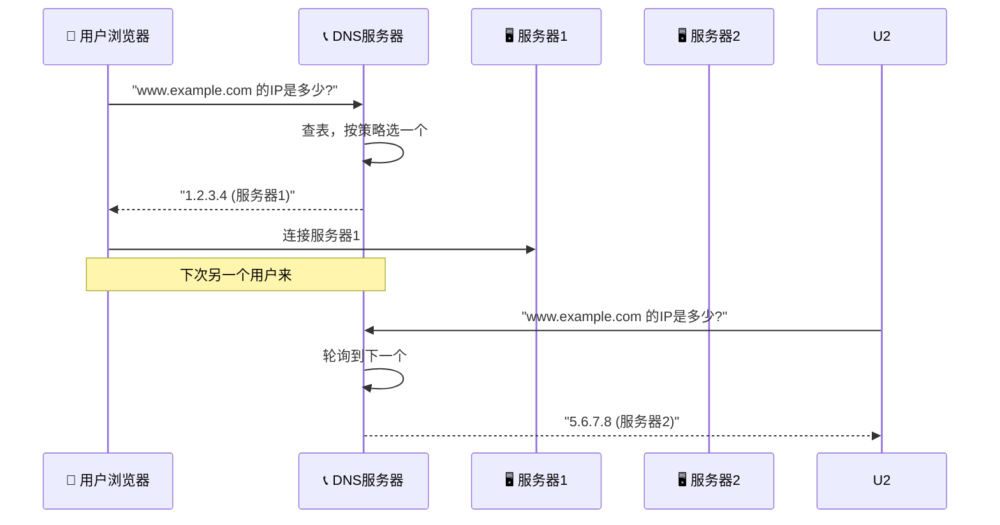

*特点*：

| 维度 | 评价 |
| :--- | :--- |
| **性能** | ★★★★★ 几乎无性能损耗 |
| **控制粒度** | ★ 非常粗，只能到 IP 级别 |
| **故障感知** | ★ 极差，DNS 有缓存，IP 挂了用户还在访问 |
| **成本** | ★★★★★ 零额外成本 |

*局限性*：

- DNS 缓存导致故障切换慢（TTL 时间内，用户还往挂了的老 IP 上怼）
- 无法感知后端真实负载（不知道哪台服务器忙、哪台闲）
- 策略单一，基本只能轮询或权重

*适用场景*：异地多活、全球加速、简单流量分摊（配合其他层一起用）。

### 四层负载均衡 L4（传输层）—— "快准狠"的转发高手 ###

*原理*：工作在 OSI 第四层（TCP/UDP），只关心 IP 地址 + 端口号，不看请求内容。收到数据包后直接修改目标地址转给后端，类似于"快递分拣只看地址不看包裹里是什么"。

```mermaid
flowchart LR
    subgraph 四层负载均衡转发流程
        C["📦 客户端请求&#x3C;br/>src: 客户端IP:随机端口&#x3C;br/>dst: VIP:80"] --> LB{"🔀 L4 负载均衡器&#x3C;br/>LVS / F5"}
        LB -->|"修改目标IP"| RS1["🖥️ Real Server 1&#x3C;br/>10.0.0.1:80"]
        LB -->|"修改目标IP"| RS2["🖥️ Real Server 2&#x3C;br/>10.0.0.2:80"]
        LB -->|"修改目标IP"| RS3["🖥️ Real Server 3&#x3C;br/>10.0.0.3:80"]
    end
```

*工作模式（以 LVS 为例）*：

| 模式 | 核心思路 | 特点 |
| :--- | :--- | :--- |
| **NAT 模式** | 负载均衡器同时改目标IP和源IP，进出都经过它 | 简单但 LB 压力大 |
| **DR 模式** | 只改目标 MAC 地址，服务器直接回客户端 | 性能最强，LB 只是“指路人” |
| **TUN 模式** | IP 隧道封装，适合跨机房 | 灵活但开销大 |

*代表工具*：

- LVS（Linux Virtual Server）：Linux 内核级，性能恐怖，百万级并发轻松扛。
- F5：硬件负载均衡器，贵但稳，银行券商的最爱。

*特点*：

| 维度 | 评价 |
| :--- | :--- |
| **性能** | ★★★★★ 只处理到第四层，开销极小 |
| **控制粒度** | ★★ 只能看 IP 和端口 |
| **部署成本** | LVS 低（开源），F5 高（硬件贵） |
| **适用场景** | 对性能要求极高的入口层 |

*核心优势*：快！不解析 HTTP 内容，纯内核态转发，吞吐量大。

*局限性*：无法根据 URL、Cookie 等应用层信息做路由决策。比如不能把 `/api/order` 和 `/api/user` 分到不同服务器组。

*适用场景*：作为统一的流量入口，顶在最前面接流，后面再交给七层负载做精细分发。

### 七层负载均衡 L7（应用层）—— "最聪明"的调度员 ###

*原理*：工作在 OSI 第七层（应用层），能看懂 HTTP 协议内容——URL 路径、Cookie、Header、请求方法，甚至请求体。像一个精明的管家："这个请求是查订单的，发给订单服务组；那个请求带了 `version:v2` 头，发给灰度集群。"

```mermaid
flowchart TD
    subgraph 七层负载均衡路由逻辑
        REQ["📥 HTTP 请求&#x3C;br/>GET /api/order?id=123&#x3C;br/>Cookie: user_id=abc&#x3C;br/>Header: version=v2"] --> PARSER{"🔍 七层负载均衡&#x3C;br/>Nginx / HAProxy&#x3C;br/>解析请求内容"}

        PARSER -->|"URL: /api/order/*"| ORDER["订单服务集群"]
        PARSER -->|"URL: /api/user/*"| USER["用户服务集群"]
        PARSER -->|"Header: version=v2"| GRAY["灰度发布集群"]
        PARSER -->|"Cookie: VIP用户"| VIP["VIP专属集群"]
    end
```

*核心能力（甩四层几条街）*：

| 能力 | 说明 | 实际场景 |
| :--- | :--- | :--- |
| **URL 路由** | 按路径转发 | `/static/*` 给静态资源服务器，`/api/*` 给应用服务器 |
| **Header 路由** | 读请求头转发 | 灰度发布、A/B 测试 |
| **Cookie 绑定** | 按 Cookie 粘住用户 | 同一用户始终打到同一台服务器 |
| **SSL 卸载** | LB 负责 HTTPS 加解密 | 后端用 HTTP，省掉加密开销 |
| **内容改写** | 修改请求/响应 | 添加安全头、压缩内容、限流 |

*代表工具*：

- Nginx：七层负载的事实标准，轻量高效，模块丰富。
- HAProxy：专注代理，性能略优于 Nginx 做纯转发场景。
- Apache HTTP Server：老牌 Web 服务器，也能做反向代理和负载均衡。

*特点*：

| 维度 | 评价 |
| :--- | :--- |
| **性能** | ★★★★ 比四层差但够用，且功能强大 |
| **控制粒度** | ★★★★★ 全 HTTP 协议可控 |
| **部署成本** | ★★★★★ Nginx 免费开源，配置简单 |
| **适用场景** | 作为业务层负载均衡的主力 |

*适用场景*：Web 应用入口、微服务网关层、动静分离、灰度发布。

### 服务层负载均衡（微服务内部）—— "自己找队友"模式 ###

到了微服务架构里，负载均衡不再是入口专属，服务之间互相调用也需要负载均衡。比如订单服务调用库存服务，库存有 3 个实例，该调哪个？

```mermaid
flowchart TB
    subgraph 客户端负载均衡
        A1["订单服务"] -->|"本地负载均衡策略"| A2["查询注册中心&#x3C;br/>库存服务实例列表"]
        A1 -->|"自己选一个调用"| A3["库存实例1"]
        A1 -->|"自己选一个调用"| A4["库存实例2"]
    end

    subgraph 服务端负载均衡
        B1["订单服务"] -->|"发给网关/LB"| B2["网关 / 负载均衡"]
        B2 -->|"由网关选一个"| B3["库存实例1"]
        B2 -->|"由网关选一个"| B4["库存实例2"]
    end
```

*两种模式对比*：

| 维度 | 客户端负载均衡 | 服务端负载均衡 |
| :--- | :--- | :--- |
| **谁来选** | 调用方自己选 | 中间代理选 |
| **代表组件** | Ribbon / Nacos + Feign | Spring Cloud Gateway / Kong |
| **性能** | 少一跳，延迟低 | 多一跳，但集中管控 |
| **复杂度** | 每个服务都要集成 | 集中在网关上 |
| **典型用法** | Spring Cloud 微服务间调用 | 对外 API 统一入口 |

*代表组件*：

- Ribbon：Spring Cloud 老牌客户端负载均衡组件（已进入维护模式）。
- Spring Cloud LoadBalancer：Ribbon 的接班人，Spring 官方出品。
- Nacos / Consul / Eureka：注册中心 + 负载均衡二合一。


### 四层负载均衡对比总结表 ###

```mermaid
graph LR
    DNS["DNS 负载均衡&#x3C;br/>🌐 域名层&#x3C;br/>性能: ⭐⭐⭐⭐⭐&#x3C;br/>粒度: ⭐&#x3C;br/>场景: 异地多活"] --> L4
    L4["四层负载 L4&#x3C;br/>🚦 传输层&#x3C;br/>性能: ⭐⭐⭐⭐⭐&#x3C;br/>粒度: ⭐⭐&#x3C;br/>场景: 高并发入口"] --> L7
    L7["七层负载 L7&#x3C;br/>📄 应用层&#x3C;br/>性能: ⭐⭐⭐⭐&#x3C;br/>粒度: ⭐⭐⭐⭐⭐&#x3C;br/>场景: Web 应用分发"] --> SVC
    SVC["服务层负载&#x3C;br/>🔧 微服务层&#x3C;br/>性能: ⭐⭐⭐⭐&#x3C;br/>粒度: ⭐⭐⭐⭐⭐&#x3C;br/>场景: 服务间调用"]
```

| 层级 | 工作层 | 转发依据 | 性能 | 粒度 | 典型工具 | 核心场景 |
| :--- | :--- | :--- | :--- | :--- | :--- | :--- |
| **DNS** | 域名解析 | 域名 → IP | 极高 | 极粗 | DNS 服务 | 异地多活、全球流量 |
| **L4** | 传输层 | IP + 端口 | 极高 | 粗 | LVS / F5 | 大规模流量入口 |
| **L7** | 应用层 | URL/Cookie/Header | 高 | 极细 | Nginx / HAProxy | Web 服务分发、灰度 |
| **服务层** | 服务发现 | 服务名 + 策略 | 高 | 极细 | Ribbon / Nacos | 微服务间调用 |

> 实战心得：真正的生产环境，这四层不是四选一，而是层层配合。DNS 做就近接入，L4 做第一层高速分流，L7 做精细路由，服务层做内部调用编排。

## 四、负载均衡主流算法（人话 + 图解） ##

### 轮询（Round Robin）—— "排队发牌，人人有份" ###

*原理*：请求按顺序轮流发，1→2→3→1→2→3…… 谁也别插队。

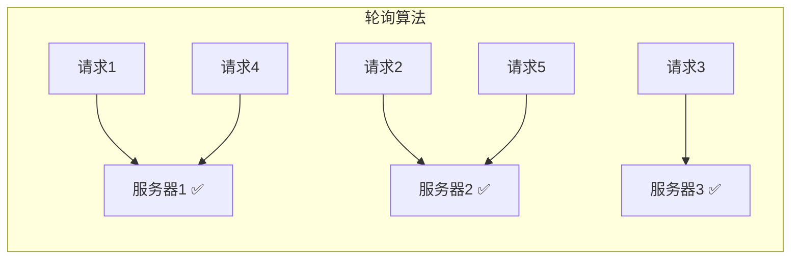

*优点*：简单到令人发指，实现零成本。

*缺点*：假设所有服务器性能一样——但如果服务器 1 是树莓派、服务器 3 是 128 核的怪兽，轮询就是"虐待儿童 + 浪费壮丁"。

*适用场景*：所有服务器配置一致、请求处理时间相近的无状态服务。

### 加权轮询（Weighted Round Robin）—— "能者多劳，多劳多得" ###

*原理*：给每台服务器配一个权重，性能好的权重高，分到的请求就多。

```mermaid
flowchart LR
    subgraph WeightPolling["加权轮询 (weight=5:2:1)"]
        LB["⚖️ 负载均衡器&#x3C;br/>权重配置"]

        LB -->|"5次请求"| RS_H["🦍 高配服务器&#x3C;br/>128核&#x3C;br/>权重: 5"]
        LB -->|"2次请求"| RS_M["🐒 中配服务器&#x3C;br/>32核&#x3C;br/>权重: 2"]
        LB -->|"1次请求"| RS_L["🐭 低配服务器&#x3C;br/>4核&#x3C;br/>权重: 1"]
    end
```

*优点*：解决了"性能不均"的问题，适合异构服务器集群。

*缺点*：权重是静态的，不能反映实时负载——128 核的机器如果已经在处理 10 个耗时任务，新的请求照样往它那儿塞。

*适用场景*：服务器配置差异明显的集群。

### 随机（Random）—— "交给天意" ###

*原理*：随机选一台服务器，听起来不靠谱，但请求足够多时，概率上也是均匀分布的。

```mermaid
flowchart TD
    A["🎲 请求"] --> B{"随机算法&#x3C;br/>Random()"}
    B -->|"30%概率"| S1["服务器1"]
    B -->|"35%概率"| S2["服务器2"]
    B -->|"35%概率"| S3["服务器3"]
```

*优点*：实现和轮询一样简单，且避免了轮询在某些场景下的"同步抖动"。

*缺点*：可能某台机器连着中奖多次，压力不均。

*适用场景*：大型集群、对均匀性要求不极端的无状态服务。一般配合加权随机使用。

### IP 哈希（IP Hash）—— "认脸绑定，不换人" ###

*原理*：对客户端 IP 做哈希计算，同一个 IP 的请求永远落到同一台服务器。

```mermaid
flowchart TD
    subgraph IP哈希
        U1["👤 用户A&#x3C;br/>IP: 1.2.3.4"] --> HASH{"🔢 Hash(1.2.3.4) % 3"}

        HASH -->|"模结果=0"| S1["服务器1&#x3C;br/>用户A永远来这"]
        HASH -->|"模结果=1"| S2["服务器2&#x3C;br/>用户B永远来这"]
        HASH -->|"模结果=2"| S3["服务器3&#x3C;br/>用户C永远来这"]
    end

    subgraph 哈希计算
        FORMULA["Hash(客户端IP) % 服务器数量 = 命中服务器"]
    end
```

*优点*：天然支持会话保持（Session Sticky），同一个用户始终访问同一台服务器，Session 不用跨服务器共享。

*缺点*：

- 服务器数量变化时（扩缩容），大部分用户的映射关系会变——这就是"哈希重分布"问题。
- 如果某个 IP 段流量巨大（比如公司出口 IP），会压死一台服务器。

*适用场景*：需要会话保持、服务器数量和 IP 分布相对稳定的场景。

### 最小连接数（Least Connections）—— "谁闲就给谁" ###

*原理*：记录每台服务器当前活跃连接数，新请求发给连接数最少的那台。

```mermaid
flowchart TD
    NEW["🆕 新请求"] --> LB{"📊 最小连接数&#x3C;br/>调度器"}

    LB -->|"❌ 跳过&#x3C;br/>当前连接: 15"| S1["服务器1&#x3C;br/>连接数: 15"]
    LB -->|"❌ 跳过&#x3C;br/>当前连接: 23"| S2["服务器2&#x3C;br/>连接数: 23"]
    LB -->|"✅ 命中&#x3C;br/>当前连接: 3"| S3["服务器3&#x3C;br/>连接数: 3"]
```

*优点*：动态感知服务器实时压力，比静态权重更智能。

*缺点*：需要维护连接计数，有一定开销。

*适用场景*：请求处理时间差异大的动态服务、长连接场景（WebSocket、数据库连接池）。

### 加权最小连接数（Weighted Least Connections）—— "最强 + 最闲"二合一 ###

*原理*：结合权重和连接数，给每台服务器算一个"性价比得分"，选得分最高的。

> *伪公式*：`score = weight / (connections + 1)`，谁大选谁。

| 服务器 | 权重 | 当前连接数 | 得分 | 是否命中 |
| :--- | :--- | :--- | :--- | :--- |
| **服务器1** | 10 | 5 | 10/6 = 1.67 | ❌ |
| **服务器2** | 5 | 1 | 5/2 = 2.50 | ✅ 命中 |
| **服务器3** | 5 | 3 | 5/4 = 1.25 | ❌ |

*适用场景*：异构 + 动态负载场景，是加权轮询的升级版。

### 一致性哈希（Consistent Hash）—— "加机器不翻脸"⭐⭐⭐ ###

这是负载均衡算法里的"王炸"，面试必问，实战必用。

*痛点*：普通哈希（IP Hash）在集群节点变化时，大部分映射关系都会改变。对于缓存服务来说，这意味着大量缓存同时失效（缓存雪崩），数据库直接被打穿。

*核心思想*：把哈希空间组织成一个环（0 ~ 2^32-1），服务器节点和请求都映射到环上，请求沿着环顺时针找到最近的服务器。

```mermaid
flowchart TD
    subgraph 一致性哈希环
        direction LR
        RING["🔵 哈希环 (0 ~ 2^32-1)&#x3C;br/>&#x3C;br/>
        ┌──────────────────────┐&#x3C;br/>
        │  🟢 请求A → 服务器1  │&#x3C;br/>
        │  🟢 请求B → 服务器2  │&#x3C;br/>
        │  🟢 请求C → 服务器3  │&#x3C;br/>
        │  🟢 请求D → 服务器1  │&#x3C;br/>
        └──────────────────────┘"]
    end
```

*详细图解*：

```mermaid
flowchart LR
    subgraph 场景1扩容前
        direction TB
        R1["🔵 哈希环"]
        N1["节点A&#x3C;br/>hash=100"] --- R1
        N2["节点B&#x3C;br/>hash=5000"] --- R1
        N3["节点C&#x3C;br/>hash=20000"] --- R1
        K1["📦 key1&#x3C;br/>hash=300&#x3C;br/>→ 节点B"] --- R1
        K2["📦 key2&#x3C;br/>hash=6000&#x3C;br/>→ 节点C"] --- R1
        K3["📦 key3&#x3C;br/>hash=15000&#x3C;br/>→ 节点C"] --- R1
    end

    subgraph 场景2扩容后添加节点D
        direction TB
        R2["🔵 哈希环"]
        N1_2["节点A&#x3C;br/>hash=100"] --- R2
        N2_2["节点B&#x3C;br/>hash=5000"] --- R2
        ND["🆕 节点D&#x3C;br/>hash=8000"] --- R2
        N3_2["节点C&#x3C;br/>hash=20000"] --- R2
        K1_2["📦 key1&#x3C;br/>hash=300&#x3C;br/>→ 节点B ✅不变"] --- R2
        K2_2["📦 key2&#x3C;br/>hash=6000&#x3C;br/>→ 节点D ⚠️变了"] --- R2
        K3_2["📦 key3&#x3C;br/>hash=15000&#x3C;br/>→ 节点C ✅不变"] --- R2
    end

    场景1扩容前 -->|"添加节点D后&#x3C;br/>只有部分key重新映射"| 场景2扩容后
```

*核心优势*：增加或删除节点时，只需重新分配受影响的那一小部分数据，而不是全量重新哈希。这就是它叫"一致性"的原因——大部分映射关系保持不变。

*虚拟节点优化*：

实际问题：如果节点数量少，在环上分布不均匀，可能导致数据倾斜（某节点分到太多）。

解决办法：为每个物理节点创建多个"虚拟节点"散布在环上，让数据分布更均匀。

```mermaid
flowchart LR
    subgraph 无虚拟节点
        direction TB
        NR["❌ 分布不均&#x3C;br/>节点A 管 70%&#x3C;br/>节点B 管 30%"]
    end

    subgraph 有虚拟节点
        direction TB
        VR["✅ 分布均匀&#x3C;br/>节点A-1 A-2 A-3&#x3C;br/>节点B-1 B-2 B-3&#x3C;br/>均匀散布在环上"]
    end

    无虚拟节点 -->|"为每个物理节点&#x3C;br/>创建多个虚拟节点"| 有虚拟节点
```

适用场景：分布式缓存（Memcached、Redis Cluster）、分布式存储、任何需要"节点变化时最小化数据迁移"的场景。

## 算法选型速查表 ##

| 算法 | 核心逻辑 | 适合场景 | 不适合场景 |
| :--- | :--- | :--- | :--- |
| **轮询** | 一人一次 | 同构无状态服务 | 异构集群 |
| **加权轮询** | 按权重排队 | 异构无状态服务 | 请求耗时差异大 |
| **随机** | 看天意 | 大规模均匀分布 | 精准控制需求 |
| **IP 哈希** | 认 IP 不换人 | 需要会话保持 | 节点频繁变动 |
| **最小连接数** | 谁空给谁 | 长连接 / 动态负载 | 短连接高频请求 |
| **一致性哈希** | 加机器少搬家 | 分布式缓存 / 存储 | 简单 Web 转发 |

## 五、负载均衡核心关键机制 ##

### 健康检查机制 —— "心跳检测，开除摸鱼的" ###

负载均衡器不能当"瞎眼"领位员——服务员都躺地上了，你还往那儿带客人。

```mermaid
sequenceDiagram
    participant LB as 🔀 负载均衡器
    participant S1 as ✅ 健康服务器1
    participant S2 as 💀 故障服务器2
    participant S3 as ✅ 健康服务器3

    loop 每5秒健康检查
        LB->>S1: "GET /health"
        S1-->>LB: "200 OK 👌"
        LB->>S2: "GET /health"
        S2--xLB: "超时 ❌"
        LB->>S3: "GET /health"
        S3-->>LB: "200 OK 👌"
    end

    Note over LB: 连续3次失败&#x3C;br/>标记 S2 为 DOWN
    LB->>S2: "你被降级了 🚫"

    Note over LB: 后续请求只发 S1 和 S3

    loop 恢复检测
        LB->>S2: "GET /health&#x3C;br/>（探活，频率降低）"
        S2-->>LB: "200 OK 👌"
    end

    Note over LB: 连续2次成功&#x3C;br/>标记 S2 恢复 UP
    LB->>S2: "欢迎归队 ✅"
```

两种检查模式：

| 模式 | 原理 | 优点 | 缺点 |
| :--- | :--- | :--- | :--- |
| **主动检查** | LB 定期发探测请求 | 故障发现快 | 额外网络开销 |
| **被动检查** | 根据真实请求的失败率判断 | 无额外开销 | 故障发现慢 |

> 实战经验：生产环境一般两者结合——主动探活用，被动探真故障。

### 会话保持机制 —— "别换服务员，我们聊到一半呢" ###

用户登录后，Session 存在服务器 1 的内存里。如果下一请求被分配到服务器 2，用户就得重新登录——这就是会话丢失。

```mermaid
flowchart TD
    subgraph 三种会话保持方案
        direction LR
        A["🔀 负载均衡器"] --> B{"选哪个方案?"}

        B -->|"方案A"| C["🍪 Cookie绑定&#x3C;br/>LB 下发 Cookie&#x3C;br/>绑定服务器&#x3C;br/>【简单但有状态】"]

        B -->|"方案B"| D["🔢 IP哈希&#x3C;br/>同一IP永到&#x3C;br/>同一服务器&#x3C;br/>【网络变化会翻车】"]

        B -->|"方案C"| E["💾 会话共享&#x3C;br/>Session 存 Redis&#x3C;br/>所有服务器都能读&#x3C;br/>【推荐方案】"]
    end
```

| 方案 | 原理 | 缺点 | 推荐度 |
| :--- | :--- | :--- | :--- |
| **Cookie 绑定** | LB 下发 Cookie 记录后端标识 | LB 有状态，故障复杂 | ⭐⭐ |
| **IP 哈希** | 按 IP 固定分配 | NAT/代理环境失效 | ⭐⭐ |
| **会话共享** | Session 存 Redis 等集中存储 | 多一次 Redis 调用 | ⭐⭐⭐⭐ |

> 最佳实践：尽量做无状态服务 + 集中式 Session（Redis），这是主流方案。

### 故障转移与重试机制 —— "摔倒了有人扶" ###

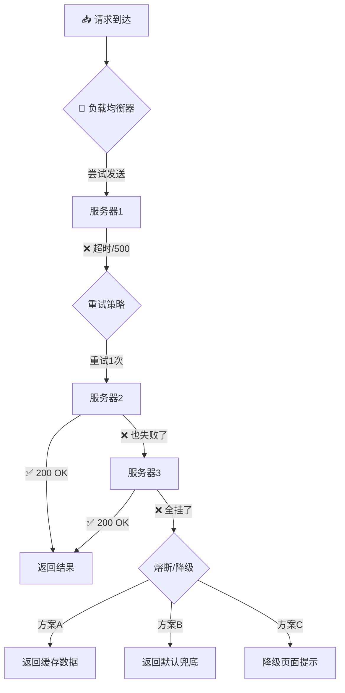

*三大保护机制*：

| 机制 | 作用 | 典型配置 |
| :--- | :--- | :--- |
| **重试** | 请求失败后换一台再试 | 最多重试 2-3 次 |
| **熔断** | 连续失败 N 次后暂时不再请求 | 错误率 > 50% 自动熔断 |
| **降级** | 返回兜底数据，保证不白屏 | 返回缓存或友好提示页 |

### 动静分离机制 —— "快餐和正餐分开排队" ###

静态资源（图片、CSS、JS）和动态请求（API）的处理特点完全不同：

- 静态资源：纯 I/O，处理快，适合用专门的轻量服务器（如 Nginx 直接返回）。
- 动态请求：需要跑业务代码，耗 CPU，适合用应用服务器（如 Tomcat）。

```mermaid
flowchart TD
    USER["👤 用户浏览器"] --> LB{"🔀 Nginx&#x3C;br/>动静分离"}

    LB -->|"*.jpg *.css *.js"| STATIC["📁 静态资源服务器&#x3C;br/>Nginx直接返回&#x3C;br/>【快餐窗口】"]

    LB -->|"/api/* /app/*"| DYNAMIC["⚙️ 动态请求&#x3C;br/>转发到 Tomcat/Django&#x3C;br/>【正餐窗口】"]
```

*好处*：静态资源不占用应用服务器资源，应用服务器可以专心处理业务逻辑。

## 六、生产主流负载均衡组件选型 ##

### 组件全家福 ###

```mermaid
flowchart TB
    subgraph DNS层
        DNS["DNS 服务&#x3C;br/>Bind / Cloud DNS"]
    end

    subgraph 硬件层
        HW["F5 BIG-IP&#x3C;br/>💵 贵但稳&#x3C;br/>银行/证券专用"]
    end

    subgraph 四层软件
        L4_SW["LVS&#x3C;br/>🐧 Linux内核级&#x3C;br/>百万并发"]
    end

    subgraph 七层软件
        L7_NGINX["Nginx&#x3C;br/>⭐ 七层之王&#x3C;br/>Web服务+负载均衡"]
        L7_HAPROXY["HAProxy&#x3C;br/>纯代理性能王"]
    end

    subgraph 云原生
        CLOUD["CLB / ALB / SLB&#x3C;br/>☁️ 云厂商LB&#x3C;br/>开箱即用"]
    end

    subgraph 微服务
        GW["Spring Cloud Gateway&#x3C;br/>Kong&#x3C;br/>APISIX&#x3C;br/>微服务网关"]
    end
```

### 各组件对比 ###

| 组件 | 类型 | 层级 | 核心优势 / 特点 | 劣势 / 注意点 | 适用场景 |
| :--- | :--- | :--- | :--- | :--- | :--- |
| **Nginx** | 开源软件 | L4+L7 | 功能全面、社区大、模块丰富 | 动态配置需 reload | Web 服务入口首选 |
| **LVS** | 开源软件 | L4 | 性能极高、内核级转发 | 配置复杂、无七层能力 | 大规模高并发入口 |
| **F5** | 硬件 | L4+L7 | 极稳定、吞吐量巨大 | 贵、扩展不灵活 | 金融/政务核心系统 |
| **HAProxy** | 开源软件 | L4+L7 | 纯代理场景性能优于 Nginx | Web 服务能力弱 | 纯转发代理 |
| **云 LB** | 云服务 | L4+L7 | 免运维、弹性伸缩 | 绑定云厂商 | 云上部署 |
| **Kong/APISIX** | 开源软件 | L7 | 插件化、API 管理 | 运维成本较高 | API 网关 |

### 选型建议（人话版） ###

```bash
"省钱省心" → Nginx（免费开源，一人战千军）
"极致性能" → LVS（内核级转发，性能怪兽）
"不差钱"   → F5（企业级硬件，稳如泰山）
"上云了"   → 云厂商 LB（运维躺平，弹性伸缩）
"微服务"   → Spring Cloud Gateway / Kong（API管理一把梭）
```

## 七、真实业务落地架构案例 ##

### 小型网站架构 —— Nginx 单机七层 ###

```mermaid
flowchart LR
    INTERNET["🌍 互联网"] --> NGINX["🔀 Nginx&#x3C;br/>七层负载均衡&#x3C;br/>动静分离 + 反向代理"]
    NGINX --> WEB1["🖥️ Web 服务器1"]
    NGINX --> WEB2["🖥️ Web 服务器2"]
    WEB1 --> DB["🗄️ 数据库&#x3C;br/>主从"]
    WEB2 --> DB
```

*架构要点*：一台 Nginx 扛所有，做反向代理、负载均衡、动静分离。适合日均 PV 十万级的小网站。

### 中大型高并发架构 —— LVS + Nginx 双层（主流生产架构） ###

```mermaid
flowchart TB
    INTERNET["🌍 互联网"] -->|"流量入口"| LVS{"🔀 LVS 四层&#x3C;br/>DR模式&#x3C;br/>VIP 对公暴露"}

    LVS -->|"第一层分发"| NGINX1["🔀 Nginx 七层&#x3C;br/>动静分离&#x3C;br/>URL路由"]
    LVS -->|"第一层分发"| NGINX2["🔀 Nginx 七层&#x3C;br/>动静分离&#x3C;br/>URL路由"]

    NGINX1 -->|"动态请求"| APP1["⚙️ 应用服务器1"]
    NGINX1 -->|"动态请求"| APP2["⚙️ 应用服务器2"]

    NGINX2 -->|"动态请求"| APP3["⚙️ 应用服务器3"]
    NGINX2 -->|"动态请求"| APP4["⚙️ 应用服务器4"]

    NGINX1 -->|"静态资源"| CDN["📁 CDN/OSS"]
    NGINX2 -->|"静态资源"| CDN

    APP1 --> DB["🗄️ 数据库集群&#x3C;br/>主从+读写分离"]
    APP2 --> DB
    APP3 --> DB
    APP4 --> DB

    APP1 --> CACHE["💾 Redis 集群&#x3C;br/>会话共享+缓存"]
```

#### 为什么 LVS + Nginx 搭配？ ####

| 层 | 职责 | 理由 |
| :--- | :--- | :--- |
| **LVS (四层)** | 扛住海量连接，快速转发 | 性能最高，不解析 HTTP 内容，适合做第一道防线 |
| **Nginx (七层)** | 按 URL/Header 精细路由 | 七层能力强，动静分离、限流、灰度一把抓 |

> 经典的"4+7 组合拳"：LVS 在前面挡子弹，Nginx 在后面做战术指挥——一个快，一个聪明，绝配。


### 微服务架构 —— 网关 + 服务注册发现 ###

```mermaid
flowchart TB
    INTERNET["🌍 互联网"] --> GW{"🔀 API 网关&#x3C;br/>Spring Cloud Gateway&#x3C;br/>限流/鉴权/路由"}

    subgraph 服务注册中心
        REG["📋 Nacos / Consul&#x3C;br/>服务注册与发现"]
    end

    GW -->|"查询可用服务"| REG

    subgraph 微服务集群
        GW -->|"/order/**"| OS["📦 订单服务&#x3C;br/>实例1/2/3"]
        GW -->|"/user/**"| US["👤 用户服务&#x3C;br/>实例1/2/3"]
        GW -->|"/product/**"| PS["🛒 商品服务&#x3C;br/>实例1/2/3"]
    end

    OS -->|"Feign + LoadBalancer&#x3C;br/>客户端负载均衡"| US
    US -->|"Feign + LoadBalancer&#x3C;br/>客户端负载均衡"| PS

    REG -.->|"心跳注册"| OS
    REG -.->|"心跳注册"| US
    REG -.->|"心跳注册"| PS
```

微服务负载均衡的两层：

- 网关层：对外暴露统一入口，做路由、鉴权、限流。
- 服务间调用：服务之间通过 Feign + LoadBalancer（或 Ribbon）做客户端负载均衡。


### 异地多活架构 —— DNS + 本地负载均衡全局调度 ###

```mermaid
flowchart TB
    USER_CN["👤 中国用户"] --> DNS{"🌐 智能 DNS&#x3C;br/>GeoDNS&#x3C;br/>按地域解析"}

    USER_US["👤 美国用户"] --> DNS

    DNS -->|"返回上海机房IP"| SH["🏢 上海机房&#x3C;br/>LVS + Nginx&#x3C;br/>应用集群"]
    DNS -->|"返回美西机房IP"| US_W["🏢 美西机房&#x3C;br/>LVS + Nginx&#x3C;br/>应用集群"]

    SH &#x3C;-->|"数据同步"| DB_SYNC["🔄 数据同步中心&#x3C;br/>跨机房复制"]
    US_W &#x3C;-->|"数据同步"| DB_SYNC
```

*架构要点*：

- DNS 做第一层地理位置调度，就近接入
- 每个机房内部自建 LVS + Nginx 双层
- 数据层做跨机房异步复制

## 八、负载均衡常见问题与优化方案 ##

### 会话丢失问题 ###

| 问题 | 原因 | 解决方案 |
| :--- | :--- | :--- |
| **用户突然被登出** | 请求被分到另一台服务器，Session 不共享 | **集中式 Session** (Redis 存储) |
| **验证码刷不出来** | 同上，验证码存 Session 里了 | 同上 |
| **购物车东西没了** | 还是 Session 问题 | **Redis 集中存储** or **Token (JWT)** |

> 终极解法：做无状态服务 + JWT Token + Redis 集中存 Session。从此告别"我跟哪台服务器谈恋爱"的烦恼。

### 节点压力不均 / 流量倾斜 ###

```mermaid
flowchart TD
    subgraph 问题场景
        BAD["⚠️ 问题：3台服务器&#x3C;br/>服务器1: CPU 90% 🔥&#x3C;br/>服务器2: CPU 30% 😎&#x3C;br/>服务器3: CPU 20% 😴"]
    end

    subgraph 排查方向
        C1["① 算法选对了吗？&#x3C;br/>轮询 → 加权轮询/最小连接数"]
        C2["② 权重配对了吗？&#x3C;br/>检查异构集群的权重"]
        C3["③ 哈希倾斜了吗？&#x3C;br/>一致性哈希加虚拟节点"]
        C4["④ 有慢请求吗？&#x3C;br/>某个用户的上传下载卡死连接"]
    end

    BAD --> C1
    BAD --> C2
    BAD --> C3
    BAD --> C4
```

优化 checklist：

- 换加权最小连接数算法
- 给热点 IP 单独限流
- 给大文件上传单独走 CDN 或专用通道

### 长连接场景负载均衡优化 ###

WebSocket、gRPC、TCP 长连接场景下，连接建立后长期不释放，轮询/加权轮询算法容易让某些服务器扛得太重。

*优化方案*：

- 使用 最小连接数 算法（天然适配长连接）
- 做好连接池管理和空闲超时
- gRPC 场景使用客户端负载均衡（如 gRPC 自带的 Name Resolver + LoadBalancer）

### 高并发下负载均衡性能瓶颈 ###

```mermaid
| 瓶颈点 | 表现 | 优化手段 |
| :--- | :--- | :--- |
| **L4 LB 网卡打满** | 带宽瓶颈 | 万兆网卡、多网卡 bonding、DDoS 清洗 |
| **L7 LB CPU 打满** | Nginx worker 进程占用高 | 增加 worker 数、开启 keepalive、SSL 卸载到硬件 |
| **后端连接池耗尽** | 502 Bad Gateway | 调大 upstream keepalive、增加后端实例 |
| **DNS 解析瓶颈** | 域名解析慢 | 本地 DNS 缓存、减少 DNS 依赖 |
```

### 上线扩容 / 灰度发布流量调度 ###

```mermaid
flowchart TD
    REQ["📥 用户请求"] --> LB{"🔀 Nginx&#x3C;br/>灰度策略"}

    LB -->|"Header: version=v1&#x3C;br/>90%流量"| OLD["🟢 老版本集群(v1.0)&#x3C;br/>稳定运行"]
    LB -->|"Header: version=v2&#x3C;br/>10%流量"| NEW["🟡 新版本集群(v2.0)&#x3C;br/>灰度验证"]

    NEW -->|"监控: 无异常 ✅"| SCALE["📈 逐步提升灰度比例&#x3C;br/>10% → 30% → 50% → 100%"]
    NEW -->|"监控: 有异常 ❌"| ROLLBACK["🔙 立即回滚&#x3C;br/>100% → v1.0"]
```

*灰度发布负载均衡策略*：

- 先切 5%-10% 流量到新版本
- 观察错误率、响应时间、业务指标
- 无异常逐步放大流量比例
- 出问题立刻撤回

## 九、总结与学习拓展 ##

### 全文核心知识点复盘 ###

```mermaid
mindmap
  root((负载均衡))
    分层架构
      DNS 层（域名 → IP）
      L4 四层（IP+端口）
      L7 七层（URL/Cookie/Header）
      服务层（微服务间调用）
    调度算法
      轮询 / 加权轮询
      随机 / 加权随机
      IP哈希
      最小连接数
      一致性哈希 ⭐
    关键机制
      健康检查（主动+被动）
      会话保持（Cookie/IP哈希/集中存储）
      故障转移（重试+熔断+降级）
      动静分离
    组件选型
      Nginx / LVS / F5
      云厂商 LB
      Spring Cloud Gateway / Kong
    生产架构
      小型：Nginx 单层
      中大型：LVS + Nginx 双层
      微服务：网关 + 注册中心
      异地多活：DNS + 本地LB
```

### 各层负载均衡使用场景一句话总结 ###

```mermaid
| 层级 | 一句话总结 |
| :--- | :--- |
| **DNS** | "全球调度，粗粒度分流" |
| **L4** | "高性能入口，快速转发" |
| **L7** | "聪明路由，精细化管控" |
| **服务层** | "微服务内部，服务找服务" |
```

### 进阶学习方向 ###

如果负载均衡已经吃透了，下一步可以深入：

```bash
📚 流量调度与治理        → 灰度发布、蓝绿部署、全链路压测
📚 弹性负载与自动扩缩容    → HPA、K8s Service、Serverless
📚 全局负载均衡（GSLB）   → 异地多活、灾备切换、多活架构
📚 Service Mesh           → Istio/Envoy 的负载均衡与流量治理
📚 高性能网络             → DPDK、eBPF、XDP 加速转发
```

## 十、文末结语 ##

负载均衡不是什么高深莫测的技术，它就是分布式系统里的"交通警察"——指挥流量往哪走、怎么走、不走哪儿。

但就是这么一个简单的角色，却撑起了整个互联网的可用性和扩展性。没有负载均衡，双十一的流量能把任何一台机器打穿；没有负载均衡，服务器挂了业务就得停；没有负载均衡，微服务之间的调用就像没有导航的出租车——到处乱撞。
不管是写代码的、做架构的、搞运维的，负载均衡都是你的必备技能树上的一个关键分叉。

记住一句话：流量如水，负载均衡如渠——好的渠能让水润泽万物，坏的渠只会水漫金山。
