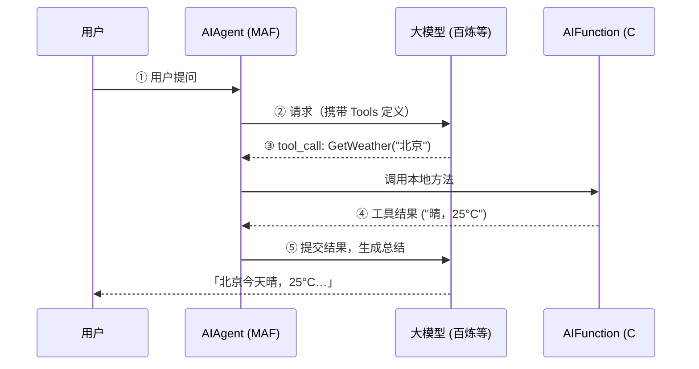

## 一、先搞懂：什么是 Function Tool？ ##

### 只会聊天的 AI，像「关在玻璃罩里的专家」 ###

上一篇我们做的 Agent，本质上只有一件事：把用户的话发给大模型，再把大模型的文字拿回来。

它很聪明，能写诗、能解释概念，但有一个硬伤——它碰不到你的系统。

你问它：「北京今天天气怎么样？」

没有外部数据时，它只能根据训练记忆「猜」一个答案，甚至一本正经地胡说。你问「P002 产品多少钱？」，它同样无法连你的数据库或 ERP。

这就像一位被关在玻璃罩里的气象专家：嘴很厉害，手伸不出来。

### Function Tool = 给 AI 装上「手脚」 ###

Function Tool（函数工具 / 工具调用） 解决的就是这个问题：

> 你提前用代码写好一批「能办事的方法」，告诉大模型这些方法叫什么、需要什么参数、能干什么；
> 当用户提问时，大模型自己判断要不要调用、调用哪一个、参数填什么；
> 你的程序真正执行这段 C#，把结果再喂回给模型，由它组织成自然语言回复。

打个比方：

| 角色 | 对应什么 |
| :--- | :--- |
| 大模型 | 大脑：理解意图、做规划、选工具、写总结 |
| Function Tool | 手脚：查天气 API、查库存、发邮件、改订单 |

### 和「普通对话」差在哪？ ###

```mermaid
graph TD
    subgraph "普通对话（无 Tool）"
        U1[用户] --> M1[模型]
        M1 --> R1[文本回复<br/>（仅依赖模型内部知识）]
    end

    subgraph "Function Tool（工具调用）"
        U2[用户] --> M2[模型]
        M2 -->|识别意图| T[决定调用 Function<br/>GetWeather(city=北京)]
        T --> E[执行 C# 代码<br/>调用外部 API]
        E --> D[返回真实数据<br/>"晴，25°C..."]
        D --> M2
        M2 --> R2[自然语言回复<br/>"北京今天晴，25°C..."]
    end
```

多出来的这一圈，行业里常叫 Tool Calling 循环（也可能多轮：查完天气再查库存）。MAF 基于 Microsoft.Extensions.AI，注册工具后由框架自动跑这个循环，你不用自己拼 OpenAI 的 tool_calls JSON。

## 二、整体流程（一张图记住） ##



## 三、分步实现 ##

### 步骤 1：准备项目与依赖 ###

在已有 MAF 控制台项目上，确保已引用（版本以你本地 NuGet 为准）：

```bash
dotnet add package Microsoft.Agents.AI.OpenAI
dotnet add package OpenAI
dotnet add package Microsoft.Extensions.Configuration.Json
dotnet add package Microsoft.Extensions.Configuration.Binder
```

Microsoft.Extensions.AI（含 AIFunctionFactory）会随 MAF 包一并引入，无需单独安装。

配置好百炼（或其它 OpenAI 兼容端点）的 ApiKey、Model

> 注意：工具调用需要模型支持 Function Calling。百炼上建议使用 qwen-plus 等文档标明支持工具调用的模型。

### 步骤 2：用 C# 写好「手脚」——AgentTools ###

在 Tools/AgentTools.cs 中定义静态方法，用 `[Description]` 写清「这个工具干什么、参数什么意思」——这些描述会进入发给大模型的 JSON Schema，相当于工具说明书。

```csharp
using System.ComponentModel;

namespace MafDemo.Tools;

public static class AgentTools
{
    [Description("查询指定城市的当前天气情况")]
    public static string GetWeather(
        [Description("城市名称，例如：北京、上海、深圳")] string city)
    {
        return city.Trim() switch
        {
            "北京" => "北京：晴，25°C，北风 2 级，空气质量良",
            "上海" => "上海：多云，22°C，东南风 3 级，空气质量优",
            "深圳" => "深圳：阵雨，28°C，南风 2 级，空气质量良",
            _ => $"{city}：晴，23°C，微风（模拟数据）"
        };
    }

    [Description("根据产品编号查询商品名称与价格")]
    public static string GetProductInfo(
        [Description("产品编号，例如：P001、P002")] string productId)
    {
        return productId.Trim().ToUpperInvariant() switch
        {
            "P001" => "P001：MAF 入门实战手册，价格 ¥99，库存充足",
            "P002" => "P002：.NET AI 开发课程，价格 ¥299，库存充足",
            "P003" => "P003：Agent 架构设计指南，价格 ¥159，仅剩 3 件",
            _ => $"未找到产品 {productId}，请尝试 P001 / P002 / P003（模拟数据）"
        };
    }
}
```

关键点：

| 要点 | 说明 |
| :--- | :--- |
| 方法签名要「AI 友好」 | 优先用 string、int、bool 等简单类型，复杂对象也能映射，但 Schema 会更复杂 |
| `[Description]` 不是装饰 | 会参与生成 JSON Schema，模型靠它决定何时调、参数怎么填 |
| 返回 string 最常见 | 工具结果一般以文本形式回到对话；也可返回其它可序列化类型 |

### 步骤 3：用 AIFunctionFactory 生成「说明书」 ###

一行代码，把一个 .NET 方法包装成 AIFunction（实现 AITool 接口）：

```csharp
using Microsoft.Extensions.AI;

IList<AITool> tools =
[
    AIFunctionFactory.Create(AgentTools.GetWeather),
    AIFunctionFactory.Create(AgentTools.GetProductInfo),
];
```

`AIFunctionFactory.Create()` 在背后做了什么？

- 读取方法名 → 工具名（如 GetWeather）
- 读取 `[Description]` → 工具描述、参数描述
- 生成 JSON Schema → 发给大模型
- 当模型发起调用时 → 反序列化参数、执行方法、把返回值序列化回去

你不需要手写 OpenAI 风格的：

```json
{
  "type": "function",
  "function": {
    "name": "GetWeather",
    "parameters": { "type": "object", "properties": { "city": { "type": "string" } } }
  }
}
```

工厂会帮你生成。

> 拓展：也可用 `AIFunctionFactory.Create(methodInfo, target)` 绑定实例方法；或用 AIFunctionFactoryOptions 自定义序列化、隐藏某些参数（如 IServiceProvider）等。

### 步骤 4：注册到 Agent —— AsAIAgent(tools: ...) ###

先照旧创建 IChatClient（本 Demo 通过 ChatClientFactory 连接百炼 OpenAI 兼容端点），再创建带工具的 Agent：

```csharp
using Microsoft.Agents.AI;

private const string SystemInstructions =
    """
    你是智能助手，可以查询天气和商品信息。
    当用户询问天气或产品时，请先调用对应工具获取数据，再用简洁中文回答。
    不要编造工具未返回的信息。
    """;

IChatClient chatClient = ChatClientFactory.Create(llm);

AIAgent agent = chatClient.AsAIAgent(
    instructions: SystemInstructions,
    name: "ToolAssistant",
    tools: tools);
```

三个参数各司其职：

| 参数 | 作用 |
| :--- | :--- |
| `instructions` | System 指令；告诉模型有哪些能力、何时必须用工具 |
| `name` | Agent 名称，便于日志与多 Agent 场景 |
| `tools` | 工具列表，MAF 会配置 Function Invoking 中间层，自动完成 tool 循环 |

`instructions` 里写「不要编造工具未返回的信息」很重要——否则模型可能在工具失败时继续「脑补」。

### 步骤 5：发起对话，观察工具是否被调用 ###

```csharp
private static async Task RunPromptAsync(AIAgent agent, string prompt, CancellationToken cancellationToken)
{
    Console.WriteLine($"用户: {prompt}");
    Console.Write("助手: ");

    await foreach (AgentResponseUpdate update in agent.RunStreamingAsync(prompt, cancellationToken))
    {
        if (!string.IsNullOrEmpty(update.Text))
        {
            Console.Write(update.Text);
        }
    }

    Console.WriteLine();
}
```

Demo 里设计了三句提问，对比鲜明：

```csharp
await RunPromptAsync(agent, "你今天开心吗？", cancellationToken);           // 闲聊 → 通常不调工具
await RunPromptAsync(agent, "北京今天天气怎么样？", cancellationToken);     // → 应调用 GetWeather
await RunPromptAsync(agent, "帮我查一下 P002 这个产品的信息", cancellationToken); // → 应调用 GetProductInfo
```

预期现象：

- 第一句：直接聊天，不触发工具
- 第二句：后台调用 GetWeather("北京")，回复里出现 25°C 等与 mock 数据一致的内容
- 第三句：调用 GetProductInfo("P002")，回复里出现 ¥299 等

若第二、三句也像纯聊天、数据对不上，优先检查：模型是否支持工具调用、ApiKey/Endpoint 是否正确。

## 四、关键代码串起来（最小闭环） ##

```csharp
// 1. 连接大模型
IChatClient chatClient = ChatClientFactory.Create(llm);

// 2. 包装工具
IList<AITool> tools =
[
    AIFunctionFactory.Create(AgentTools.GetWeather),
    AIFunctionFactory.Create(AgentTools.GetProductInfo),
];

// 3. 创建带工具的 Agent
AIAgent agent = chatClient.AsAIAgent(
    instructions: SystemInstructions,
    name: "ToolAssistant",
    tools: tools);

// 4. 对话（框架内部自动处理 tool call 循环）
await agent.RunStreamingAsync("北京今天天气怎么样？");
```

记住这条链：C# 方法 → AIFunctionFactory → AITool 列表 → AsAIAgent(tools) → RunAsync / RunStreamingAsync。

## 五、拓展知识 ##

### Tool Calling 循环是谁跑的？ ###

注册 tools 后，MAF / Microsoft.Extensions.AI 会在 IChatClient 外包装 Function Invoking 层，大致逻辑：

- 把工具 Schema 发给模型
- 若响应含 tool_calls → 执行对应 AIFunction
- 把结果作为 tool 角色消息追加到历史
- 再次请求模型，直到不再调工具或达到上限

因此业务代码里不必手写 while (hasToolCalls)。若需自定义（日志、重试、审批），可接 Middleware 或使用 ApprovalRequiredAIFunction（敏感操作前先让人确认）。

### AITool 不只 Function ###

tools 参数类型是 `IList<AITool>`。除了本地函数，生态里还有：

- MCP 工具 — 连外部 MCP Server
- Hosted 工具（部分云厂商）— 代码解释器、联网搜索等

本 Demo 是入门最常见的 本地 Function Tool。

### 多工具时模型怎么选？ ###

模型会根据 工具 Description + 用户问题 做意图匹配。描述写得越具体，误调越少。例如：

- 不好：`[Description("查询")]`
- 更好：`[Description("查询指定城市的当前天气情况")]`

工具过多时，可考虑：按场景拆多个 Agent、或动态裁剪本次请求可用的工具子集。

## 七、小结 ##

| 步骤 | 你做了什么 |
| :--- | :--- |
| 理解概念 | Function Tool = 大模型的大脑 + 你写的 C# 手脚 |
| 定义工具 | AgentTools + `[Description]` |
| 生成 AIFunction | `AIFunctionFactory.Create(方法)` |
| 挂到 Agent | `AsAIAgent(..., tools: tools)` |
| 验证 | dotnet run -- tools，天气 / 商品各问一句 |

> 上一篇 Agent 只会「说」；加上 Function Tool 之后，它终于能「做」——你的代码，成了 AI 的一部分。
