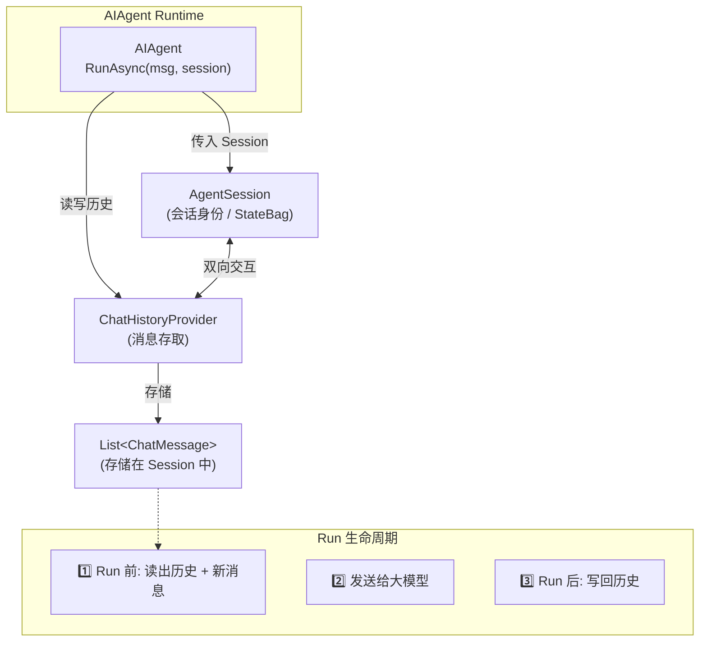

## 一、为什么需要「记忆」？ ##

### 单轮 Agent 像「金鱼」 ###

前两篇里，我们每次调用大致是这样：

```csharp
await agent.RunAsync("你好");
await agent.RunAsync("我刚才说了什么？");  // 模型：不知道 🤷
```

每次 RunAsync 都是全新的一轮——用户说了什么、助手回了什么，不会自动带到下一次。大模型本身是无状态的，它不会「记住」上一句你叫什么。

这就像跟一位每句话都失忆的朋友聊天：

- 你：「我叫小明。」
- 朋友：「你好小明！」
- 你：「我刚才说我叫什么？」
- 朋友：「抱歉，我不知道你叫什么。」

不是模型笨，是我们没把对话历史传给它。

### 多轮对话 = 给模型一本「聊天记录本」 ###

真正好用的聊天产品，第二轮提问时，模型能看到：

```text
[System] 你是助手…
[User]   我叫小明，是 .NET 开发者。
[Assistant] 你好小明！…
[User]   我刚才说我叫什么？        ← 当前问题
```

MAF 里实现这套机制，核心就两个概念：

| 概念 | 是什么 | 类比 |
| :--- | :--- | :--- |
| AgentSession | 一次独立会话的「身份牌」 | 微信里和一个好友的聊天窗口 |
| ChatHistory | 窗口里的消息列表 | 往上翻能看到的聊天记录 |

本文讲两种落地方式：

- 推荐：AgentSession + InMemoryChatHistoryProvider —— 框架帮你记
- 手动：自己维护 `List<ChatMessage>` —— 完全自控

清除历史、注入 System、截断策略等放在 （3 下） 再讲。

## 二、整体架构（一张图） ##



一次多轮对话的生命周期：

```text
CreateSessionAsync()  →  得到 session
RunAsync("我叫小明", session)     →  历史 +1 轮
RunAsync("我叫什么", session)     →  带上之前的历史，模型能答「小明」
```

## 三、方式一：AgentSession + InMemoryChatHistoryProvider（推荐） ##

### 步骤 1：创建带历史能力的 Agent ###

不能只用 `AsAIAgent(instructions, name)`，而要告诉 MAF：历史由谁存。

AgentFactory.cs 封装了创建逻辑：

```csharp
public static AIAgent CreateWithSessionHistory(
    IChatClient chatClient,
    string instructions,
    string name,
    InMemoryChatHistoryProvider? historyProvider = null)
{
    historyProvider ??= new InMemoryChatHistoryProvider();

    var options = new ChatClientAgentOptions
    {
        Name = name,
        ChatOptions = new ChatOptions { Instructions = instructions },
        ChatHistoryProvider = historyProvider,   // 关键：挂上历史提供者
    };

    return chatClient.AsAIAgent(options);
}
```

| 配置项 | 作用 |
| :--- | :--- |
| ChatOptions.Instructions | System 指令，每轮都会带上（角色设定） |
| ChatHistoryProvider | 负责「读历史、写历史」的组件 |

`InMemoryChatHistoryProvider` 把消息存在 AgentSession.StateBag 里，进程内内存，适合 Demo 和单机 Web 会话。

> 注意（百炼 / OpenAI 兼容端点）
> 这类 API 通常不会在服务端替你存多轮历史。必须用 `ChatHistoryProvider` 在客户端维护，否则每次请求只有当前一句 user 消息。

### 步骤 2：创建 Session ####

```csharp
AIAgent agent = AgentFactory.CreateWithSessionHistory(
    chatClient, instructions, "SessionAgent", historyProvider);

AgentSession session = await agent.CreateSessionAsync(cancellationToken);
```

- AgentSession：代表一个用户、一次连续对话。不同用户各建一个 session，历史互不干扰。
- 同一 session 多次 RunAsync，历史会累积。
- 新开会话 → 再 CreateSessionAsync() 一个新的即可。

> 拓展：SerializeSessionAsync / DeserializeSessionAsync 可把 session 序列化存 Redis、数据库，用户下次登录接着聊——生产环境常用。


### 步骤 3：多轮 RunAsync —— 传入 session ###

```csharp
await agent.RunAsync("我叫小明，是一名 .NET 开发者。", session, cancellationToken);
await agent.RunAsync("我刚才说我叫什么？", session, cancellationToken);
```

对比单轮写法：

```csharp
// 单轮：无记忆
await agent.RunAsync("你好");

// 多轮：有记忆
await agent.RunAsync("你好", session);
```

第二个参数 session 就是开关。 有它，MAF 会在调用模型前从 ChatHistoryProvider 取出历史，拼上本轮 user 消息；调用结束后把 user + assistant 消息写回去。

Demo 里封装成 RunTurnAsync：

```csharp
private static async Task RunTurnAsync(
    AIAgent agent, AgentSession session, string userText, CancellationToken cancellationToken)
{
    Console.WriteLine($"用户: {userText}");
    AgentResponse response = await agent.RunAsync(userText, session, cancellationToken);
    Console.WriteLine($"助手: {response.Text}");
}
```

### 步骤 4：查看历史（调试利器） ###

```csharp
var messages = historyProvider.GetMessages(session);
foreach (ChatMessage msg in messages)
{
    Console.WriteLine($"{msg.Role}: {msg.Text}");
}
```

运行 ：

```text
【1】AgentSession 多轮对话（自动保留上下文）
用户: 我叫小明，是一名 .NET 开发者。
助手: 你好，小明！欢迎使用会话记忆演示。

  [第一轮后] 历史 2 条:
    - user: 我叫小明，是一名 .NET 开发者。
    - assistant: 你好，小明！欢迎使用会话记忆演示。

用户: 我刚才说我叫什么？
助手: 你叫小明。

  [第二轮后] 历史 4 条:
    - user: 我叫小明，是一名 .NET 开发者。
    - assistant: 你好，小明！欢迎使用会话记忆演示。
    - user: 我刚才说我叫什么？
    - assistant: 你叫小明。
```

### 方式一完整代码 ###

```csharp
var historyProvider = new InMemoryChatHistoryProvider();

AIAgent agent = chatClient.AsAIAgent(new ChatClientAgentOptions
{
    Name = "SessionAgent",
    ChatOptions = new ChatOptions
    {
        Instructions = "你是会话记忆演示助手。根据对话历史回答，回答简洁。"
    },
    ChatHistoryProvider = historyProvider,
});

AgentSession session = await agent.CreateSessionAsync();

await agent.RunAsync("我叫小明，是一名 .NET 开发者。", session);
await agent.RunAsync("我刚才说我叫什么？", session);
```

## 四、方式二：手动维护 `List<ChatMessage>` ##

### 什么时候用手动？ ###

| 场景 | 选手动 |
| :--- | :--- |
| 学习 MAF / 大模型 API 原理 | 看清「历史就是 messages 数组」 |
| 要在入模前改历史（删某条、插 RAG 片段） | 完全掌控列表 |
| 已有自己的消息存储（DB、Redis） | 读出来拼成 `List` 即可 |

### 实现步骤 ###

#### 创建「无历史」Agent —— 不配置 ChatHistoryProvider： ####

```csharp
AIAgent agent = chatClient.AsAIAgent(
    instructions: BaseInstructions,
    name: "ManualHistoryAgent");
```

#### ② 自己维护 `List<ChatMessage>`： ####

```csharp
var history = new List<ChatMessage>();
```

#### ③ 每轮：追加 user → RunAsync(整个 history) → 追加 assistant： ####

```csharp
async Task ManualTurnAsync(string userText)
{
    // 1. 用户消息入列表
    history.Add(new ChatMessage(ChatRole.User, userText));

    // 2. 把「完整历史」交给 Agent（不是只传当前一句）
    AgentResponse response = await agent.RunAsync(history, cancellationToken);

    // 3. 助手回复入列表，供下一轮使用
    foreach (ChatMessage msg in response.Messages)
    {
        if (msg.Role == ChatRole.Assistant)
            history.Add(msg);
    }
}
```

#### ④ 验证多轮记忆： ####

```csharp
await ManualTurnAsync("我最喜欢的语言是 C#。");
await ManualTurnAsync("我最喜欢什么语言？");   // 应回答 C#
```

### 两种方式调用对比 ###

```csharp
// 方式一：只传本轮 user 文本 + session，历史由 Provider 管
await agent.RunAsync("我叫什么？", session);

// 方式二：传完整 messages 列表，历史你自己管
await agent.RunAsync(history);
```

方式二里，history 是 `IEnumerable<ChatMessage>`，MAF 不会自动帮你 append——存取全是你的责任。

## 五、关键知识点细讲，防止概念搞混 ##

### Instructions 和 ChatHistory ###

| | Instructions | ChatHistory |
| :--- | :--- | :--- |
| **来源** | `ChatOptions.Instructions` / `AsAIAgent(instructions:..)` | User / Assistant 往返消息 |
| **变化** | 通常固定（除非运行时注入，【就是在对话中也能修改系统提示词】） | 每轮增加 |
| **作用** | 角色、规则、风格 | 事实、上下文、用户说过的话 |

模型既需要 Instructions（「你是谁、怎么答」），也需要 History（「用户刚才说了啥」）。

### AgentSession 和 ChatHistoryProvider ###

- Session：会话容器，可挂 StateBag、多个 Provider 的状态。
- ChatHistoryProvider：专门管「消息列表」的存取策略。

可以一个 Agent 服务很多 Session；每个 Session 各自一份历史。

`InMemoryChatHistoryProvider` 是 MAF 自带的内存实现；以后可换成读写的 Redis / SQL 实现（实现 ChatHistoryProvider 抽象）。

## 六、拓展知识 ##

### 大模型 API 层面的「多轮」本质 ###

无论 MAF 还是裸调 OpenAI，多轮本质都是：

```json
{
  "messages": [
    { "role": "system", "content": "你是助手…" },
    { "role": "user", "content": "我叫小明" },
    { "role": "assistant", "content": "你好小明" },
    { "role": "user", "content": "我叫什么" }
  ]
}
```

MAF 的 ChatHistoryProvider + AgentSession，就是帮你自动维护这个数组，不用每轮手写拼接。

### 实际业务中应用怎么存储历史和使用历史？ ###

```text
HTTP 请求携带 sessionId
    → 从 Redis/DB 取出 AgentSession（或 DeserializeSession）
    → RunAsync(userMessage, session)
    → 存回 Session
    → 返回 assistant 文本
```

一个 sessionId 对应一个 AgentSession，和 Demo 里「一个 session 对象多轮 Run」是同一模型。

### 和 Function Tool 一起用 ###

多轮 + 工具调用时，历史里还会有 tool / assistant（含 tool_calls）等消息。

配置了 ChatHistoryProvider 后，MAF 会把工具往返一并写入历史，下一轮模型仍能看到之前调过什么工具——无需额外处理。

## 七、小结 ##

| 步骤 | 方式一 (推荐) | 方式二 (手动) |
| :--- | :--- | :--- |
| **创建 Agent** | `ChatClientAgentOptions` + `ChatHistoryProvider` | `AsAIAgent(instructions, name)` |
| **会话** | `await agent.CreateSessionAsync()` | 不需要 Session |
| **调用** | `RunAsync(userText, session)` | `RunAsync(history列表)` |
| **历史谁管** | `InMemoryChatHistoryProvider` | 自己的 `List<ChatMessage>` |
